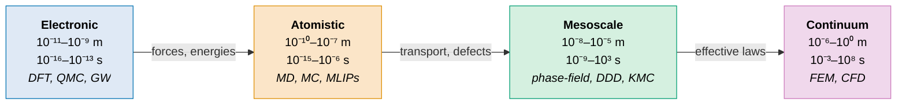

# 2.1 The Scale Ladder

<figure markdown>

<figcaption>The four rungs of the materials-simulation ladder, ordered left to right from shortest to longest scale: the electronic rung (sub-ångström, sub-picosecond, DFT and QMC) passes forces and energies up to the atomistic rung (nanometre, nanosecond, MD and MLIPs), which passes transport and defect information up to the mesoscale (micrometre, second, phase-field and KMC), which in turn passes effective constitutive laws up to the continuum rung (metre, scale, FEM and CFD).</figcaption>
</figure>

A material is a hierarchy. An aluminium beam holding up a bridge is, at the bottom of the stack, a sea of $10^{29}$ or so electrons moving in the potential of $10^{29}$ ion cores. Just above that is a regular arrangement of those ions into an FCC lattice with the occasional vacancy or dislocation. Higher still, those defects form patterns — grain boundaries, precipitates, voids — that organise themselves on the micrometre scale. Finally, on the metre scale, the beam bends. Different physics dominates at each level, and no single simulation method can span them all. The art of computational materials science is in knowing which rung to stand on.

This section introduces the ladder. We will move from short to long, from fast to slow, naming the dominant methods at each scale and what they output. By the end you should be able to look at a research question and place it on the ladder, which is the first step in choosing a method.

## A picture of the ladder

It is conventional to plot length scale on one axis and time scale on the other, both logarithmic. Methods then occupy roughly rectangular regions in this plane, with overlap at the borders.

**Figure 2.1.1.** Imagine a log–log diagram. The horizontal axis runs from $10^{-11}$ m (sub-ångström) on the left to $1$ m on the right. The vertical axis runs from $10^{-16}$ s (sub-femtosecond) at the bottom to $10^{8}$ s (years) at the top. Four roughly rectangular blocks sit on a diagonal from lower-left to upper-right. The bottom-left block is labelled *electronic structure* and covers $10^{-11}$ to $10^{-9}$ m and $10^{-16}$ to $10^{-13}$ s. Above and to the right, the *atomistic* block covers $10^{-10}$ to $10^{-7}$ m and $10^{-15}$ to $10^{-6}$ s. The *mesoscale* block sits at $10^{-8}$ to $10^{-5}$ m and $10^{-9}$ to $10^{3}$ s. Finally the *continuum* block fills the top right, $10^{-6}$ to $10^{0}$ m and $10^{-3}$ to $10^{8}$ s.

This is the canonical picture. Real research often involves moving between blocks, either by running separate simulations on different scales and passing parameters from one to the next, or by genuine on-the-fly coupling. We discuss multiscale methods at the end of the section.

## Rung 1: Electronic structure

At the bottom of the ladder we keep electrons explicit. The state of the system is a many-electron wavefunction $\Psi(\mathbf{r}_1, \mathbf{r}_2, \ldots, \mathbf{r}_N)$, or an electron density $n(\mathbf{r})$, and the governing equation is some flavour of the Schrödinger equation. The dominant practical tool is **density functional theory (DFT)**, which we will explore in detail in Chapters 5 and 6. Less commonly, one uses post-Hartree–Fock methods (MP2, coupled cluster), GW for charged excitations, or quantum Monte Carlo for benchmarks.

**Length scale.** Typical unit cells contain 1 to perhaps 1000 atoms, occupying a cube of edge $\sim 0.3$ to $5$ nm. The resolution of the calculated electron density is sub-ångström: features smaller than a hydrogen atom are well resolved.

**Time scale.** Standard DFT is a static method: it gives you the ground-state energy, forces, and electron density for a fixed nuclear configuration. *Ab initio* molecular dynamics — running DFT at every time step of an MD simulation — extends DFT into the time domain but is expensive enough that typical trajectories are picoseconds, not nanoseconds.

**Outputs.** Energy of formation, equilibrium geometry, electronic band structure, density of states, charge density, magnetic moments, phonon frequencies (via finite displacements or DFPT), elastic constants, optical spectra (at increasingly sophisticated levels), reaction barriers via nudged elastic band, and atomic forces with which to do MD.

**Dominant codes.** *Plane-wave codes:* VASP (commercial), Quantum ESPRESSO (open), ABINIT, CASTEP. *Local orbital codes:* FHI-aims, SIESTA, Gaussian, CP2K. *Real-space:* GPAW, OCTOPUS. We will return to these in Section 2.4.

**Trade-off.** Accurate but expensive. A standard generalised-gradient-approximation (GGA) DFT calculation on a 100-atom cell takes minutes on a single node. A 1000-atom cell with the same functional takes hours; a 10000-atom cell is essentially infeasible for ordinary users. Hybrid functionals add another order of magnitude. The scaling is nominally $\mathcal{O}(N^3)$ in the number of electrons; linear-scaling DFT exists but trades accuracy and is not yet mainstream.

## Rung 2: Atomistic simulation

One rung up, we remove the electrons and treat atoms as classical point masses interacting through an effective potential. The potential is either fitted by hand (Lennard-Jones, Stillinger–Weber, EAM, ReaxFF) or, increasingly, learned from DFT data (GAP, ACE, NequIP, MACE, foundation MLIPs). The governing equation is Newton's second law,

$$
m_i \ddot{\mathbf{r}}_i = -\nabla_i U(\mathbf{r}_1, \ldots, \mathbf{r}_N),
$$

integrated with the velocity Verlet algorithm or similar. This is **molecular dynamics (MD)**. A close cousin is **Monte Carlo (MC)**, which samples the same Boltzmann distribution without integrating equations of motion.

**Length scale.** Routinely $10^4$ to $10^7$ atoms; large simulations of polycrystalline metals on GPU clusters reach $10^{10}$ atoms. That corresponds to cubes of edge 10 nm to 1 µm.

**Time scale.** The fundamental step is the vibrational period of the lightest atom, typically 0.1–1 fs. Routine trajectories are nanoseconds; specialised runs reach microseconds. Rare events on a millisecond time scale are inaccessible to brute-force MD and require enhanced sampling.

**Outputs.** Phase diagrams (via thermodynamic integration), elastic moduli, diffusion coefficients, structure factors, radial distribution functions, glass transitions, plastic deformation, crack propagation, melting points, viscosities, surface tensions, free energies along reaction coordinates.

**Dominant codes.** *General purpose:* LAMMPS, GROMACS, AMBER, NAMD, OpenMM. *MLIP-friendly:* LAMMPS with the ML-IAP package, ASE, JAX-MD, TorchSim. The line between code and potential is blurring as foundation MLIPs are shipped with their own runners.

**Trade-off.** Cheap per atom, but the quality of the simulation is set by the quality of the potential. A classical Lennard-Jones simulation runs on a laptop and is qualitatively useful for noble gases, but its quantitative predictions for, say, water are mediocre. A modern MLIP runs roughly 100 times slower than a classical potential but achieves close to DFT accuracy. The trade-off has shifted dramatically in the past five years.

## Rung 3: The mesoscale

Above the atomistic level lies a heterogeneous collection of methods that aim to capture phenomena occurring on length scales of nanometres to micrometres and time scales of nanoseconds to seconds. There is no single mesoscale method; instead there is a family of approaches each suited to a particular phenomenon.

**Phase-field methods** treat the local composition or order parameter as a continuous field $\phi(\mathbf{r}, t)$ evolving according to a Cahn–Hilliard or Allen–Cahn equation. They are the workhorse for microstructure evolution — solidification dendrites, spinodal decomposition, grain growth, ferroelectric domain switching. Inputs are typically free energies fitted from thermodynamic databases (CALPHAD) or extracted from atomistic simulations.

**Kinetic Monte Carlo (KMC)** simulates rare events on a lattice. The state is a list of occupied sites; transitions happen with rates set by Arrhenius factors $\nu \exp(-E_a / k_\mathrm{B} T)$. Used for crystal growth, surface diffusion, radiation damage evolution, electrochemical processes. Inputs are activation energies, typically from DFT NEB calculations.

**Dislocation dynamics (DD)** treats dislocations as line objects in an elastic medium, with rules for their interactions. Used for plasticity in metals at scales beyond MD. Codes include ParaDiS and MoDELib.

**Length scale.** 10 nm to 10 µm typically; larger for some DD simulations.

**Time scale.** Microseconds for phase-field; seconds to years for KMC and DD.

**Outputs.** Microstructure images, grain-size distributions, dislocation densities, time-resolved evolution of order parameters.

**Dominant codes.** MOOSE (multiphysics, includes phase-field), PRISMS-PF, OpenPhase, SPPARKS (KMC), ParaDiS (DD). The mesoscale community is smaller and more fragmented than the DFT or MD communities.

**Trade-off.** Mesoscale methods make heavy use of parameters fitted at smaller scales. If those parameters are wrong, the simulation is wrong, but it will still run and produce a beautiful picture. The danger of mesoscale simulation is not that it crashes; it is that it produces plausible nonsense.

## Rung 4: Continuum

At the top of the ladder, atoms disappear entirely. A material becomes a field — a density, a stress tensor, a temperature distribution — obeying partial differential equations (PDEs) that we know well: Navier–Cauchy for elasticity, Navier–Stokes for fluids, the heat equation. The method of choice is the **finite element method (FEM)**, in which the domain is meshed and the PDE solved with piecewise polynomial basis functions.

**Length scale.** Micrometres to metres; engineering structures are simulated routinely.

**Time scale.** Effectively unbounded for static problems; up to seconds for transient problems.

**Outputs.** Stress and strain fields, displacements, temperature distributions, fluid flow patterns, eigenfrequencies, failure predictions.

**Dominant codes.** *Commercial:* ABAQUS, ANSYS, COMSOL. *Open-source:* FEniCS, deal.II, MOOSE, FreeFEM.

**Trade-off.** Continuum methods scale to entire components, but they are only as good as the constitutive laws fed into them. Stress–strain curves come from experiments or, increasingly, from atomistic simulations.

## The scale-ladder summary table

| Scale | Length | Time | Method | Outputs | Codes |
|---|---|---|---|---|---|
| Electronic | $10^{-11}$–$10^{-9}$ m | $\le 10^{-13}$ s | DFT, post-HF, QMC | Energies, forces, band structure, charge density | VASP, QE, FHI-aims, GPAW |
| Atomistic | $10^{-10}$–$10^{-7}$ m | $10^{-15}$–$10^{-6}$ s | MD, MC, MLIP-MD | Phase diagrams, diffusion, RDF, melting | LAMMPS, GROMACS, JAX-MD |
| Mesoscale | $10^{-8}$–$10^{-5}$ m | $10^{-9}$–$10^{3}$ s | Phase-field, KMC, DD | Microstructure, grain growth, dislocation dynamics | MOOSE, PRISMS-PF, SPPARKS |
| Continuum | $10^{-6}$–$10^{0}$ m | $10^{-3}$–$10^{8}$ s | FEM, FVM | Stress, strain, flow, temperature | ABAQUS, FEniCS, COMSOL |

!!! note "The scale–accuracy trade-off"
    The fundamental constraint of the field is that the methods at the bottom of the ladder are the most physically transparent and accurate, but the most expensive per atom. Each step up gains roughly two to three orders of magnitude in accessible system size but discards information about the level below. There is no free lunch: you can have first-principles accuracy on 100 atoms or empirical accuracy on $10^9$, but not first-principles accuracy on $10^9$.

??? question "Pause and recall"
    Before reading on, try to answer these from memory:

    1. Name the four rungs of the scale ladder in order, and give the characteristic length and time scale of each.
    2. State the scale–accuracy trade-off in one sentence: what do you gain and what do you lose with each step up the ladder?
    3. Why can a mesoscale simulation "produce plausible nonsense" even when it runs without crashing?

    If any of these is shaky, re-read the preceding section before continuing.

## Multiscale coupling

Few real research questions live cleanly on one rung. A catalyst, for instance, is an electronic-structure problem at the active site, an atomistic problem on the surface where reactants diffuse, a mesoscale problem in the porous support, and a continuum problem in the reactor. The dream of multiscale modelling is to connect these levels.

There are two broad approaches.

**Sequential coupling** (also called information passing) runs the smaller-scale simulation first, extracts a parameter — an elastic constant, an activation energy, a free-energy surface — and feeds it into a larger-scale simulation. This is by far the more common approach. CALPHAD-fed phase-field simulations are an example; so is fitting a classical potential to DFT data. The advantage is simplicity: each simulation is run independently with its native code. The disadvantage is that the small-scale calculation is run *before* the user knows precisely which regions of phase space the large-scale simulation will visit; if it visits a region where the fit is bad, you get garbage.

**Concurrent coupling** runs both simulations simultaneously, with information flowing dynamically across an interface. The quantum mechanics / molecular mechanics (QM/MM) approach, originating in biochemistry, is the canonical example: a small region is treated with DFT while the surroundings use a classical potential. Analogous schemes exist for atomistic–continuum coupling (the coupled atomistic/discrete-dislocation method, for instance). Concurrent coupling is harder to implement and produces non-trivial artefacts at the interface, but it allows the small-scale model to follow phenomena that the large-scale model cannot predict in advance.

A more recent and increasingly important approach is **machine-learning surrogates**. Rather than running DFT inside a large MD simulation, one trains an MLIP on DFT data and uses it in place of DFT throughout. This is sequential coupling in spirit, but the *parameter* being passed is now a flexible neural-network potential rather than a single number, and it can be retrained on the fly if the simulation strays. Active-learning workflows that combine MD with on-demand DFT to extend the MLIP's domain of validity are the current state of the art and are the subject of Chapter 11.

!!! tip "Choosing a rung"
    A useful heuristic: identify the length and time scales of the *answer* you need, then pick the largest-scale (cheapest) method that resolves them. Want to know whether atoms in a catalyst surface arrange themselves into a 2 × 1 reconstruction? You need sub-ångström spatial resolution, so DFT. Want to know the steady-state grain-size distribution of a polycrystalline alloy after annealing for an hour? You need micrometre resolution over seconds, so phase-field. Want to know whether a turbine blade fails under load? FEM. Resist the temptation to use a smaller-scale method than you need just because it is more *fundamental*: it will not finish in time.

## Where this leaves us

The remainder of the handbook is a deeper exploration of the bottom two rungs — electronic structure in Chapters 4–6 and atomistic simulation in Chapters 7–8 — with one hand reaching upward through machine-learning interatomic potentials in Chapters 9–10 toward the mesoscale, and the other reaching outward through active learning and foundation models in Chapters 11–12. Mesoscale and continuum methods are referenced where relevant but are not the focus of this book; they have excellent texts of their own.

The next section confronts the obvious follow-up question: given all this machinery, what can it actually deliver in 2026, and where does it still fall short?
