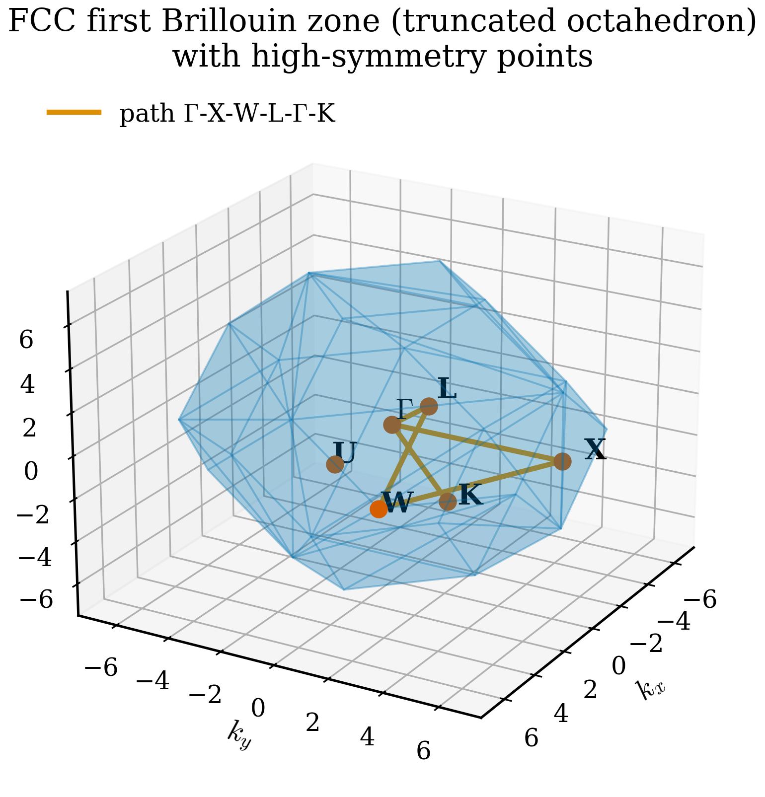

# 3.4 Reciprocal Space Without Tears

<figure markdown>
{ width="600" }
<figcaption>Figure 3.4.1. The first Brillouin zone of the face-centred-cubic reciprocal lattice — a truncated octahedron — with the conventional high-symmetry points \(\Gamma\), X, L, K, U, W labelled. The orange path \(\Gamma\)–X–W–L–\(\Gamma\)–K is a standard route for plotting band structures.</figcaption>
</figure>

Reciprocal space is the natural setting in which to describe waves moving through a periodic crystal. It is the home of Brillouin zones, $\mathbf{k}$-points, band structures, phonon dispersions, and X-ray diffraction patterns. It is also, for many newcomers, the first part of solid-state physics that feels genuinely abstract: an entire space whose points are *not* positions in the crystal but *wavenumbers*, used to label *labels* of basis functions.

This section is an attempt to demystify reciprocal space without burying it in formalism. The mathematics will be precise but light. By the end you should be able to write down the reciprocal-lattice vectors of any crystal you have constructed, sketch its Brillouin zone in the simple cases, and explain why band-structure plots run along peculiar one-dimensional paths through it.

## Why reciprocal space exists

The starting point is a single mathematical fact: a function defined on a periodic lattice has a *natural* Fourier expansion in terms of plane waves whose wavevectors live on a *dual* lattice — the reciprocal lattice. We saw the one-dimensional version in Chapter 0: a function periodic with period $L$ is naturally expanded in Fourier components $e^{i k_n x}$ with $k_n = 2\pi n / L$. The wavenumbers $k_n$ form a one-dimensional reciprocal lattice with spacing $2\pi / L$.

In three dimensions, with a general crystal lattice, the same logic applies, but the reciprocal lattice is also three-dimensional and its geometry depends on the direct-lattice geometry. Any function $f(\mathbf{r})$ that is periodic on the direct lattice — meaning $f(\mathbf{r} + \mathbf{R}) = f(\mathbf{r})$ for every direct-lattice vector $\mathbf{R}$ — can be expanded as

$$
f(\mathbf{r}) = \sum_{\mathbf{G}} \tilde f(\mathbf{G}) \, e^{i \mathbf{G} \cdot \mathbf{r}},
$$

where the sum is over a set of vectors $\mathbf{G}$ that form a lattice in their own right — the *reciprocal lattice*.

For the expansion to make sense — for $e^{i \mathbf{G} \cdot \mathbf{r}}$ to itself be periodic on the direct lattice — we need $e^{i \mathbf{G} \cdot (\mathbf{r} + \mathbf{R})} = e^{i \mathbf{G} \cdot \mathbf{r}}$, that is, $e^{i \mathbf{G} \cdot \mathbf{R}} = 1$, which means

$$
\mathbf{G} \cdot \mathbf{R} = 2\pi \times \text{integer}.
$$

This single condition defines the reciprocal lattice.

## The definition

Let $\mathbf{a}_1, \mathbf{a}_2, \mathbf{a}_3$ be the (primitive) lattice vectors of a direct lattice. The **reciprocal-lattice vectors** $\mathbf{b}_1, \mathbf{b}_2, \mathbf{b}_3$ are defined by

$$
\mathbf{b}_i \cdot \mathbf{a}_j = 2\pi \, \delta_{ij},
$$

where $\delta_{ij}$ is the Kronecker delta. Three relations for $i = j$, six for $i \ne j$ — nine conditions to fix the nine components of the three $\mathbf{b}_i$. In closed form,

$$
\mathbf{b}_1 = 2\pi \, \frac{\mathbf{a}_2 \times \mathbf{a}_3}{\mathbf{a}_1 \cdot (\mathbf{a}_2 \times \mathbf{a}_3)},
\quad
\mathbf{b}_2 = 2\pi \, \frac{\mathbf{a}_3 \times \mathbf{a}_1}{\mathbf{a}_1 \cdot (\mathbf{a}_2 \times \mathbf{a}_3)},
\quad
\mathbf{b}_3 = 2\pi \, \frac{\mathbf{a}_1 \times \mathbf{a}_2}{\mathbf{a}_1 \cdot (\mathbf{a}_2 \times \mathbf{a}_3)}.
$$

The denominator $\mathbf{a}_1 \cdot (\mathbf{a}_2 \times \mathbf{a}_3)$ is the volume $V$ of the direct-space unit cell. The volume of the reciprocal-space unit cell is $(2\pi)^3 / V$. The two cells are *reciprocal* in the literal arithmetic sense as well as the dual sense.

A general reciprocal-lattice vector is $\mathbf{G} = m_1 \mathbf{b}_1 + m_2 \mathbf{b}_2 + m_3 \mathbf{b}_3$ with $m_i \in \mathbb{Z}$.

### Worked example: simple cubic

For a simple cubic lattice with $\mathbf{a}_1 = a \hat x$, $\mathbf{a}_2 = a \hat y$, $\mathbf{a}_3 = a \hat z$,

$$
\mathbf{b}_1 = \frac{2\pi}{a} \hat x, \quad
\mathbf{b}_2 = \frac{2\pi}{a} \hat y, \quad
\mathbf{b}_3 = \frac{2\pi}{a} \hat z.
$$

The reciprocal of simple cubic is simple cubic, with lattice parameter $2\pi / a$. This is the only Bravais lattice that is its own reciprocal.

### Worked example: FCC

For face-centred cubic with conventional lattice parameter $a$, the *primitive* direct-lattice vectors are

$$
\mathbf{a}_1 = \tfrac{a}{2}(\hat y + \hat z), \quad
\mathbf{a}_2 = \tfrac{a}{2}(\hat x + \hat z), \quad
\mathbf{a}_3 = \tfrac{a}{2}(\hat x + \hat y).
$$

Computing the cross products and dividing by the volume $V = a^3/4$,

$$
\mathbf{b}_1 = \tfrac{2\pi}{a}(-\hat x + \hat y + \hat z), \quad
\mathbf{b}_2 = \tfrac{2\pi}{a}(\hat x - \hat y + \hat z), \quad
\mathbf{b}_3 = \tfrac{2\pi}{a}(\hat x + \hat y - \hat z).
$$

These are the primitive vectors of a *body-centred cubic* (BCC) lattice with conventional cube edge $4\pi / a$. **The reciprocal of FCC is BCC**, and vice versa. This is one of the most-cited facts in solid-state physics. Diamond, FCC metals, rock salt — all have BCC reciprocal lattices.

A quick sanity check in code:

```python
import numpy as np

a = 1.0
A = (a / 2.0) * np.array([
    [0, 1, 1],
    [1, 0, 1],
    [1, 1, 0],
])  # FCC primitive vectors (rows)

B = 2.0 * np.pi * np.linalg.inv(A).T   # b_i in rows
print(B)
print("a_i . b_i / (2 pi):", np.diag(A @ B.T) / (2 * np.pi))  # should be 1, 1, 1
print("a_i . b_j / (2 pi):", (A @ B.T) / (2 * np.pi))         # identity
```

The identity comes out exactly, confirming the duality.

ASE provides the reciprocal-lattice vectors via the `cell.reciprocal()` method:

```python
from ase.build import bulk

si = bulk("Si")
print("Direct cell:")
print(si.cell.array)
print("Reciprocal cell (in 1/Å):")
print(si.cell.reciprocal())
```

Note that ASE uses the convention without the $2\pi$ in some places (returning $\mathbf{b}_i / 2\pi$, sometimes called the *crystallographic* reciprocal lattice). Always check the conventions of any code you use; the factor of $2\pi$ is the single most common source of confusion.

## The Brillouin zone

The reciprocal lattice fills reciprocal space with a regular array of points. Just as the *primitive cell* of the direct lattice partitions real space into copies of one box, the *primitive cell* of the reciprocal lattice partitions reciprocal space.

There is a particular choice of primitive cell that respects symmetry: the **Wigner–Seitz cell** of the reciprocal lattice, defined as the set of points closer to the origin than to any other reciprocal-lattice point. This Wigner–Seitz cell is called the **first Brillouin zone** (BZ). It is bounded by planes that perpendicularly bisect the lines from the origin to each nearest-neighbour reciprocal-lattice point.

The first BZ for a simple cubic lattice is a cube of edge $2\pi/a$ centred on the origin. The first BZ for FCC is the *truncated octahedron* (a truncated octahedron made of six square and eight hexagonal faces) — because the reciprocal lattice of FCC is BCC, the BZ inherits BCC's Wigner–Seitz shape. For BCC, the first BZ is the *rhombic dodecahedron*.

### High-symmetry points

The Brillouin zone has special points where its symmetry is highest. These get conventional names — derived in part from group theory, in part from historical accident — and they are where band structures are evaluated. For FCC (whose BZ is the truncated octahedron), the high-symmetry points are:

- $\boldsymbol{\Gamma} = (0, 0, 0)$ — the centre of the BZ. Every BZ has a $\Gamma$ point.
- $\mathrm{X} = (2\pi/a)(1, 0, 0)$ — centre of a square face (one of six).
- $\mathrm{L} = (2\pi/a)(1/2, 1/2, 1/2)$ — centre of a hexagonal face (one of eight).
- $\mathrm{K} = (2\pi/a)(3/4, 3/4, 0)$ — centre of an edge between two hexagonal faces.
- $\mathrm{W} = (2\pi/a)(1, 1/2, 0)$ — vertex of the BZ.
- $\mathrm{U} = (2\pi/a)(1, 1/4, 1/4)$ — middle of an edge between a square and hexagonal face.

The canonical band-structure path for FCC materials is $\Gamma \to \mathrm{X} \to \mathrm{W} \to \mathrm{L} \to \Gamma \to \mathrm{K}$, or some variant.

For BCC the relevant high-symmetry points are $\Gamma$, $\mathrm{H}$, $\mathrm{N}$, $\mathrm{P}$. For hexagonal lattices: $\Gamma$, $\mathrm{M}$, $\mathrm{K}$, $\mathrm{A}$, $\mathrm{L}$, $\mathrm{H}$. The conventions are tabulated in standard references (Bradley and Cracknell; Setyawan and Curtarolo provide a modern compilation). Codes such as pymatgen and ASE compute the standard paths automatically:

```python
from ase.build import bulk

si = bulk("Si")
path = si.cell.bandpath("LGXWKL", npoints=100)
print(path)            # describes the path
print(path.kpts[:5])   # first five k-points along the path
```

??? question "Pause and recall"
    Before reading on, try to answer these from memory:

    1. Write down the defining condition $\mathbf{b}_i \cdot \mathbf{a}_j = 2\pi\,\delta_{ij}$ and explain in words what it guarantees about $e^{i\mathbf{G}\cdot\mathbf{r}}$.
    2. What is the reciprocal lattice of FCC, and what is the shape of the corresponding first Brillouin zone?
    3. Why is the first Brillouin zone defined as the Wigner–Seitz cell of the reciprocal lattice rather than any other primitive cell?

    If any of these is shaky, re-read the preceding section before continuing.

## Why band-structure paths are one-dimensional

The electronic eigenvalues of a crystal are functions of the three-component wavevector $\mathbf{k}$, defined on the Brillouin zone. So properly, the band structure is a set of three-dimensional surfaces $E_n(\mathbf{k})$. Plotting these in three dimensions is impractical, so the convention is to project them onto a one-dimensional path that connects the high-symmetry points where the dispersion has interesting features. This path is what a typical *band-structure plot* shows along the horizontal axis.

The choice of path is a convention. Different choices reveal different features. The conventional FCC path $\Gamma \to \mathrm{X} \to \mathrm{W} \to \mathrm{L} \to \Gamma \to \mathrm{K}$ traverses all the high-symmetry points and is enough to characterise gaps and effective masses.

## Bloch's theorem in preview

The reason reciprocal space matters for electronic structure is **Bloch's theorem**: the eigenstates of a single electron in a periodic potential can be written as

$$
\psi_{n\mathbf{k}}(\mathbf{r}) = e^{i \mathbf{k} \cdot \mathbf{r}} \, u_{n\mathbf{k}}(\mathbf{r}),
$$

where $u_{n\mathbf{k}}(\mathbf{r})$ has the same periodicity as the lattice. The wavevector $\mathbf{k}$ labels a continuous family of eigenstates; the band index $n$ labels the discrete bands at each $\mathbf{k}$. Wavevectors differing by a reciprocal-lattice vector $\mathbf{G}$ give physically equivalent states, so it is enough to consider $\mathbf{k}$ in the first Brillouin zone.

We will derive Bloch's theorem properly in Chapter 4. For now, take it as the statement that the natural quantum number for an electron in a crystal is a *vector in the first Brillouin zone*, and that the band structure plots energy versus this vector.

## Reciprocal space and momentum

What does $\mathbf{k}$ *mean* physically? In free space, $\hbar \mathbf{k}$ is the momentum of a plane-wave electron. In a crystal, $\hbar \mathbf{k}$ is the *crystal momentum* — a quantity that is conserved up to reciprocal-lattice vectors (because the symmetry of the system is translation by $\mathbf{R}$, not arbitrary translation). The distinction matters when computing transitions: photons carry essentially no crystal momentum, so optical transitions in a band structure are *vertical* (same $\mathbf{k}$ initial and final). Phonons can carry crystal momentum, so phonon-assisted transitions are not vertical. This is why indirect-gap semiconductors are poor light absorbers and emitters.

## k-point meshes

For practical DFT and MD-on-an-MLIP calculations, we usually do not care about $E_n(\mathbf{k})$ along a one-dimensional path. We care about *integrals* over the Brillouin zone — total energy, density, density of states. These integrals are approximated by sums over a discrete set of $\mathbf{k}$-points, the **k-point mesh** or **k-mesh**.

The standard scheme is the **Monkhorst–Pack** mesh, which places $\mathbf{k}$-points on a regular grid in reciprocal space. A $4 \times 4 \times 4$ Monkhorst–Pack mesh in a cubic cell has 64 $\mathbf{k}$-points (reduced to a smaller number by symmetry). The required density of $\mathbf{k}$-points depends on the system: metals need denser meshes than insulators because the Fermi surface is sharp; large unit cells need sparser meshes (their Brillouin zones are smaller, so fewer points are needed to sample them equivalently); small unit cells need denser meshes.

A useful rule of thumb: the product of the number of $\mathbf{k}$-points along each direction times the lattice parameter along that direction should be approximately constant. So a $4 \times 4 \times 4$ mesh for an 8 Å cell becomes a $2 \times 2 \times 2$ mesh for a 16 Å cell (e.g., after doubling the cell).

```python
from ase.build import bulk
from ase.dft.kpoints import monkhorst_pack

si = bulk("Si")
kpts = monkhorst_pack((4, 4, 4))
print(f"4 x 4 x 4 grid: {len(kpts)} k-points before symmetry reduction")
```

After symmetry reduction by the space group, a $4 \times 4 \times 4$ mesh for diamond silicon reduces to 8 *irreducible* k-points — a dramatic saving that makes the calculation feasible.

We will return to k-point convergence in Chapter 6.

## Diffraction and the structure factor

Reciprocal space is also the natural setting for X-ray and neutron diffraction. The intensity of a scattered beam at wavevector $\mathbf{q}$ is proportional to the modulus squared of the structure factor

$$
F(\mathbf{q}) = \sum_j f_j \, e^{i \mathbf{q} \cdot \mathbf{r}_j},
$$

where the sum is over atoms in the unit cell, $f_j$ is the atomic scattering factor (a function of atomic number and $\mathbf{q}$), and $\mathbf{r}_j$ is the atomic position. The condition for constructive interference — *Bragg's law* — is that $\mathbf{q}$ equals a reciprocal-lattice vector $\mathbf{G}$. Diffraction peaks therefore appear at the points of the reciprocal lattice, with intensities set by the structure factor. The *systematic absences* of certain reflections in particular structures (e.g., the disappearance of $(100)$ in FCC because of the face-centring) are a structure-factor effect.

This is the bridge between simulation and experiment: a crystal we have built in ASE has predictable diffraction peak positions and intensities, and these can be compared directly with X-ray data.

## A simple visualisation

To get a feel for the first Brillouin zone, you can plot the BZ boundary together with the high-symmetry path. ASE provides utilities, but the conceptual picture is the one to internalise.

```python
import numpy as np
import matplotlib.pyplot as plt
from ase.build import bulk

si = bulk("Si")
bz = si.cell.bandpath().free_electron_band_structure()  # toy bands

bz_path = si.cell.bandpath("LGXWKL", npoints=200)
print("Special points on this path:", bz_path.special_points)
print("Path:", bz_path.path)
```

Run this and inspect the special points: $\Gamma$, X, L, W, K. They are the bookmarks for everything that follows. When you read a band-structure plot, you are walking along this set of bookmarks.

## Reciprocal space for phonons

Everything we have said about electrons applies to phonons (lattice vibrations) as well. Each phonon mode is labelled by a wavevector $\mathbf{q}$ in the first Brillouin zone and a band index. Phonon dispersion plots — $\omega(\mathbf{q})$ along a one-dimensional path — look structurally identical to electronic band structures, with frequency on the vertical axis. Phonon $\mathbf{q}$-meshes are needed for thermodynamic integrals.

The unifying picture: any wave-like excitation in a periodic crystal — electrons, phonons, magnons, plasmons — lives in the same reciprocal space, on the same Brillouin zone, and is labelled by a wavevector in that zone. This is one of the deep unifications that the abstract reciprocal-space machinery delivers.

## Common confusions

A handful of stumbling blocks deserve flagging.

**The $2\pi$ factor.** Some references (physics convention) define the reciprocal lattice with the $2\pi$; some (crystallography convention) omit it. ASE's `cell.reciprocal()` historically omits it; pymatgen uses $2\pi$. Always check the definition before quoting a value.

**Primitive versus conventional cells in reciprocal space.** The reciprocal lattice is defined from the *primitive* direct-lattice vectors. If you start from the conventional cell of an FCC crystal (a cube), naive computation gives you the reciprocal of a cube (another cube), which is the *Brillouin zone of a simple-cubic crystal with four-atom basis*, not the BCC-shaped FCC Brillouin zone. This causes endless confusion with k-point meshes. When in doubt, work in the primitive cell.

**k-points as labels, not particles.** A k-point is not a place an electron is; it is a label for a single-particle eigenstate, like a quantum number. Saying *the electron is at the X point* is a sloppy shorthand for *the electron is in the eigenstate of crystal momentum $\hbar \mathbf{k}_X$*.

**Path conventions.** Different sources use different paths through the BZ for the same structure. *X–U–K–$\Gamma$* and *X–W–K–$\Gamma$* are both legitimate FCC paths. When reproducing a published band structure, check which path was used.

!!! tip "What to memorise"
    The minimum you should know without thinking:
    - $\mathbf{b}_i \cdot \mathbf{a}_j = 2\pi \delta_{ij}$ defines the reciprocal lattice.
    - The reciprocal of FCC is BCC; of BCC is FCC; of simple cubic is simple cubic; of hexagonal is hexagonal.
    - $\Gamma$ is the BZ centre; X is the centre of a square face of the FCC BZ; L is the centre of a hexagonal face.
    - Bloch states are labelled by $\mathbf{k}$ in the first BZ and a band index.
    - Optical transitions are vertical in $\mathbf{k}$; phonon-assisted transitions are not.

## Where this leaves us

We can now describe a crystal in real space (Bravais lattice + basis), build it in code (`ase.build.bulk`), and describe its dual in reciprocal space (reciprocal-lattice vectors, Brillouin zone, high-symmetry points, k-meshes). This is the structural vocabulary of every electronic-structure method in the rest of the book. Chapter 4 will populate the band structure with electrons; Chapter 5 will compute it self-consistently with DFT.

Before moving on, work through the [exercises](exercises.md). They include both pen-and-paper questions and short coding tasks that will cement the geometric intuition this chapter has built.
