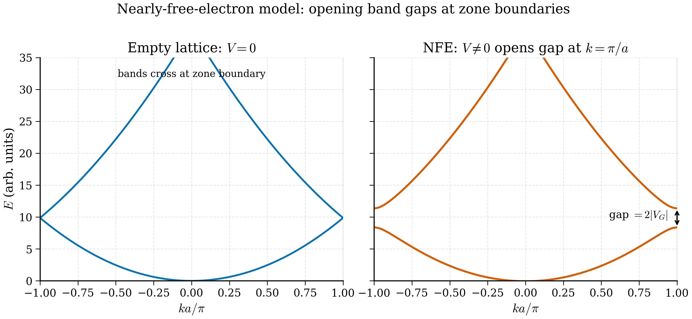

# 3b.2 — The Nearly Free Electron Model

<figure markdown>
{ width="700" }
<figcaption>Figure 3b.2.1. The nearly-free-electron mechanism for band gaps. With no lattice potential (left) the free-electron parabolas, folded into the first Brillouin zone, cross at the zone boundary. Switching on even a small periodic potential (right) lifts the degeneracy, opening a gap of width \(2|V_G|\) at \(k = \pm\pi/a\).</figcaption>
</figure>

> *"Most metals look free-electron until you measure them carefully."* — folklore

The previous section gave the *structure* of crystal eigenstates: $\psi_{n\mathbf k}(\mathbf r) = e^{i\mathbf k\cdot\mathbf r}u_{n\mathbf k}(\mathbf r)$. It did not, however, tell us anything about the *energies* $E_{n\mathbf k}$. To get those, you need a model. The two simplest models — and the two limits that bracket every real material — are the *nearly free electron* model (this section) and the *tight-binding* model (next section). They start from opposite ends and meet in the middle.

The nearly free electron (NFE) model is the appropriate starting point for metals such as Na, Al, Cu, and (with caveats) Si, where the valence electrons are spread out and the ionic pseudopotential is *weak*. We will see that even a weak periodic potential changes the qualitative picture in one essential way: it opens *band gaps* at the Brillouin-zone boundaries. The size of those gaps is the principal quantitative output of the model, and the mechanism by which they open is so general that it underlies every avoided crossing in solid state physics.

## 3b.2.1 The empty-lattice limit

Set $V(\mathbf r) = 0$ in the single-particle Schrödinger equation. The eigenstates are plane waves $e^{i\mathbf q\cdot\mathbf r}$ with continuous energy $\hbar^2 q^2/2m$. As we noted at the end of §3b.1, we can repackage them in Bloch form by writing $\mathbf q = \mathbf k + \mathbf G$ with $\mathbf k$ in the first Brillouin zone:

$$E_n^{(0)}(\mathbf k) = \frac{\hbar^2}{2m}\, |\mathbf k + \mathbf G_n|^2. \tag{3b.2.1}$$

Each reciprocal lattice vector $\mathbf G_n$ defines a "band" — a paraboloid in $\mathbf k$-space, shifted so that its minimum is at $-\mathbf G_n$. When we restrict $\mathbf k$ to the BZ, these paraboloids fold inward. The result is the *empty-lattice band structure*. For a 1D chain with lattice constant $a$ the reciprocal lattice vectors are $G_n = 2\pi n/a$ for $n\in\mathbb Z$, and the BZ is $-\pi/a \le k \le \pi/a$. The first few bands are

$$E_0^{(0)}(k) = \frac{\hbar^2 k^2}{2m}, \quad E_{\pm 1}^{(0)}(k) = \frac{\hbar^2 (k\mp 2\pi/a)^2}{2m}, \quad \ldots \tag{3b.2.2}$$

At the zone boundary $k = \pi/a$, the bands $E_0^{(0)}$ and $E_{-1}^{(0)}$ are both equal to $\hbar^2 (\pi/a)^2/(2m)$. They cross. The same phenomenon happens at every BZ boundary in every dimension: at the boundary you find pairs of empty-lattice states that satisfy the Bragg condition

$$|\mathbf k|^2 = |\mathbf k + \mathbf G|^2, \quad \Longleftrightarrow \quad 2\mathbf k\cdot \mathbf G + |\mathbf G|^2 = 0. \tag{3b.2.3}$$

A weak periodic potential will lift this degeneracy. The job of this section is to compute by how much.

## 3b.2.2 Turning on a weak potential: Fourier setup

Now keep $V(\mathbf r)$ small but nonzero. Because $V$ is lattice-periodic, it has a Fourier expansion in *reciprocal lattice vectors*:

$$V(\mathbf r) = \sum_\mathbf G V_\mathbf G\, e^{i\mathbf G\cdot\mathbf r}, \qquad V_\mathbf G = \frac{1}{\Omega}\int_\text{cell} V(\mathbf r)\, e^{-i\mathbf G\cdot\mathbf r}\, d^3 r, \tag{3b.2.4}$$

with $\Omega$ the unit-cell volume. Hermiticity of $V$ implies $V_{-\mathbf G} = V_\mathbf G^*$. We choose the average to vanish, $V_{\mathbf G=0} = 0$ (a constant adds only a global shift). The smallness assumption is $|V_\mathbf G| \ll \hbar^2 |\mathbf G|^2/2m$, i.e. the potential's Fourier amplitudes are small compared to the kinetic energy at the corresponding wavelength.

Expand Bloch states in plane waves with the same $\mathbf k$ (different $\mathbf G$):

$$\psi_\mathbf k(\mathbf r) = \sum_\mathbf G c_{\mathbf k}(\mathbf G)\, e^{i(\mathbf k+\mathbf G)\cdot\mathbf r}. \tag{3b.2.5}$$

Plug into $\hat{H} \psi = E \psi$ and project onto $e^{-i(\mathbf k + \mathbf G')\cdot\mathbf r}$. The kinetic operator gives $\hbar^2|\mathbf k+\mathbf G'|^2/(2m)\, c_\mathbf k(\mathbf G')$, and the potential mixes coefficients:

$$\frac{\hbar^2|\mathbf k+\mathbf G'|^2}{2m}\, c_\mathbf k(\mathbf G') + \sum_\mathbf G V_{\mathbf G' - \mathbf G}\, c_\mathbf k(\mathbf G) = E\, c_\mathbf k(\mathbf G'). \tag{3b.2.6}$$

This is the **central equation** of band theory in a plane-wave basis. It is an infinite matrix eigenvalue problem indexed by $\mathbf G$. In a real DFT code it is truncated at some cutoff $|\mathbf G|^2 \le 2m E_\text{cut}/\hbar^2$ and diagonalised numerically.

## 3b.2.3 Away from a zone boundary: non-degenerate perturbation theory

Far from any Bragg condition (3b.2.3), the empty-lattice energies $\varepsilon_{\mathbf k+\mathbf G}^{(0)} := \hbar^2|\mathbf k+\mathbf G|^2/(2m)$ are well separated. Standard non-degenerate perturbation theory applies. To first order, $c_\mathbf k(\mathbf G) \propto V_{\mathbf G}/[\varepsilon_\mathbf k^{(0)} - \varepsilon_{\mathbf k+\mathbf G}^{(0)}]$ for $\mathbf G\ne 0$, and the energy correction at second order is

$$E_\mathbf k = \varepsilon_\mathbf k^{(0)} + \sum_{\mathbf G \ne 0} \frac{|V_\mathbf G|^2}{\varepsilon_\mathbf k^{(0)} - \varepsilon_{\mathbf k+\mathbf G}^{(0)}}, \tag{3b.2.7}$$

since the first-order correction $\langle \mathbf k| V |\mathbf k\rangle = V_{\mathbf G=0} = 0$ vanishes by our gauge choice. Equation (3b.2.7) is a smooth shift of the parabola; nothing interesting happens away from zone boundaries. The action is at the boundary, where the energy denominators vanish.

## 3b.2.4 At a zone boundary: degenerate perturbation theory

Consider a wavevector $\mathbf k$ at which the Bragg condition (3b.2.3) holds for some reciprocal vector $\mathbf G$. Then $\varepsilon_\mathbf k^{(0)} = \varepsilon_{\mathbf k+\mathbf G}^{(0)} =: \bar\varepsilon$ and the denominator in (3b.2.7) blows up. The non-degenerate expansion fails. We must instead diagonalise the $2\times 2$ block of (3b.2.6) coupling the two degenerate states $\mathbf G = 0$ and $\mathbf G$. All other states are nondegenerate and may be eliminated to leading order.

The reduced $2\times 2$ secular problem is

$$\begin{pmatrix} \bar\varepsilon & V_\mathbf G^* \\ V_\mathbf G & \bar\varepsilon \end{pmatrix} \begin{pmatrix} c_0 \\ c_\mathbf G \end{pmatrix} = E \begin{pmatrix} c_0 \\ c_\mathbf G \end{pmatrix}, \tag{3b.2.8}$$

where we have used $V_{\mathbf G' - \mathbf G} = V_{-\mathbf G} = V_\mathbf G^*$ for the off-diagonal coupling from $\mathbf G' = 0$ to $\mathbf G$, and $V_\mathbf G$ for the reverse. The two diagonal entries are both $\bar\varepsilon$ because we sit exactly at the degenerate point.

The eigenvalues of a $2\times 2$ Hermitian matrix $\begin{pmatrix} a & b^* \\ b & a\end{pmatrix}$ are $a \pm |b|$. Here $a = \bar\varepsilon$, $b = V_\mathbf G$, so

$$\boxed{\; E_\pm = \bar\varepsilon \pm |V_\mathbf G|, \qquad \Delta = E_+ - E_- = 2|V_\mathbf G|. \;} \tag{3b.2.9}$$

The band gap at the zone boundary is **twice the magnitude of the relevant Fourier component of the potential**. This is equation (3b.2.9) — memorise it.

The corresponding eigenvectors satisfy $V_\mathbf G c_0 = \pm|V_\mathbf G|c_\mathbf G$. Writing $V_\mathbf G = |V_\mathbf G|e^{i\phi}$,

$$\begin{pmatrix} c_0 \\ c_\mathbf G \end{pmatrix}_{\pm} = \frac{1}{\sqrt 2} \begin{pmatrix} 1 \\ \pm e^{-i\phi}\end{pmatrix}. \tag{3b.2.10}$$

## 3b.2.5 The physical picture: standing waves

Specialise to one dimension and to the simplest case where $V_\mathbf G$ is real (the potential is inversion-symmetric, $V(-x) = V(x)$, so all $V_G$ are real, and we can take $V_G > 0$ at the first reciprocal vector). At the boundary $k = \pi/a$ the two degenerate plane waves are $e^{i\pi x/a}$ and $e^{-i\pi x/a}$ (the latter being $e^{i(\pi/a - 2\pi/a)x}$). The eigenstates (3b.2.10) become

$$\psi_+ \propto e^{i\pi x/a} + e^{-i\pi x/a} = 2\cos(\pi x/a), \tag{3b.2.11}$$
$$\psi_- \propto e^{i\pi x/a} - e^{-i\pi x/a} = 2i\sin(\pi x/a). \tag{3b.2.12}$$

These are *standing waves* — interferometric combinations of the two running waves moving in opposite directions. The probability densities are

$$|\psi_+|^2 \propto \cos^2(\pi x/a), \qquad |\psi_-|^2 \propto \sin^2(\pi x/a). \tag{3b.2.13}$$

If the ions sit at $x = 0, a, 2a, \ldots$, the cosine state piles its charge density *on top of* the ions, while the sine state piles its charge density *between* the ions. The ionic potential is attractive (negative) near each ion. So the cosine state — sitting on the negative wells — has lower energy than the sine state, which sits on the positive bumps.

Quantitatively, the energy splitting is set by the difference in electrostatic energy:

$$\Delta E = \int |\psi_+|^2 V(x)\, dx - \int |\psi_-|^2 V(x)\, dx = 2\int [\cos^2(\pi x/a) - \sin^2(\pi x/a)] V(x)\, dx, \tag{3b.2.14}$$

after normalising so that $\int|\psi_\pm|^2 dx = 1$. The integrand is $\cos(2\pi x/a)$, so

$$\Delta E = 2 \int_0^a \cos(2\pi x/a) V(x)\, dx \cdot \frac{1}{a} \cdot a = 2 V_{G_1}, \tag{3b.2.15}$$

where $G_1 = 2\pi/a$ is the first reciprocal lattice vector. We have rederived (3b.2.9) by an entirely physical argument: the gap is the difference in electrostatic energy between charge piled on ions and charge piled between them.

!!! note "Why this picture survives in DFT"
    Plane-wave DFT computes the Kohn–Sham band structure in *exactly* this language: a Fourier expansion (3b.2.5), a matrix equation (3b.2.6), and a self-consistent $V_\mathbf G$ generated by the electron density. The band gaps you see in a VASP band structure are, microscopically, $2|V_\mathbf G^\text{eff}|$ at the relevant Bragg planes, where $V_\mathbf G^\text{eff}$ is the Fourier component of the self-consistent Kohn–Sham potential.

## 3b.2.6 Where the gap opens — the BZ-boundary geometry

We have argued that gaps open *at* the BZ boundary. But which boundaries, and how big a gap, depends on $V_\mathbf G$:

1. **First gap.** Opens at the boundary of the first BZ, between the lowest two empty-lattice bands. Size $2|V_{\mathbf G_1}|$ where $\mathbf G_1$ is the shortest reciprocal lattice vector relevant to the boundary in question (in 1D, $G_1 = 2\pi/a$).

2. **Higher gaps.** Open at the boundaries between higher bands, each at the corresponding $\mathbf G$. Sizes $2|V_{\mathbf G_n}|$. For a typical pseudopotential $|V_\mathbf G|$ decreases as $|\mathbf G|$ grows, so higher gaps are smaller.

3. **No gap if $V_\mathbf G = 0$.** A symmetry constraint can force $V_\mathbf G = 0$ at some $\mathbf G$ (for instance the structure-factor zeros of diamond-structure silicon at certain $\mathbf G$); then no gap opens at that Bragg plane, and the bands cross.

In a 3D material, the bands depend on the full $\mathbf k$ vector, not just $|\mathbf k|$, so a "gap" requires that the highest filled band be below the lowest empty band *for every* $\mathbf k$ in the BZ. This is much more restrictive than the 1D picture suggests: a band can dip below the gap in one direction while another band rises above it in a different direction, producing a metal (overlapping bands). This is the band-overlap mechanism by which divalent metals such as Mg and Ca are metals rather than insulators.

## 3b.2.7 A worked 1D example

Let the potential be a single cosine,

$$V(x) = 2V_0 \cos(2\pi x/a) = V_0 e^{i 2\pi x/a} + V_0 e^{-i 2\pi x/a}, \tag{3b.2.16}$$

so $V_{G=\pm 2\pi/a} = V_0$ and all other Fourier components vanish. The first BZ runs over $|k| \le \pi/a$. Away from the zone boundary, second-order perturbation theory gives a smooth correction. *At* the boundary $k = \pi/a$, the $2\times 2$ block couples $G=0$ and $G=-2\pi/a$. The gap is $2V_0$, the bottom of the upper band sits at $\bar\varepsilon + V_0$ and the top of the lower band at $\bar\varepsilon - V_0$ with $\bar\varepsilon = \hbar^2(\pi/a)^2/(2m)$.

For numerical illustration take $a = 5.0$ Å (about a typical lattice constant), $V_0 = 1.0$ eV. Then

$$\bar\varepsilon = \frac{\hbar^2}{2m}\left(\frac{\pi}{a}\right)^2 = \frac{(1.0546\times 10^{-34})^2}{2 \times 9.109\times 10^{-31}} \cdot \left(\frac{\pi}{5.0\times 10^{-10}}\right)^2 \approx 1.50 \text{ eV}, \tag{3b.2.17}$$

and the gap is $\Delta = 2.0$ eV, opening between the lower band edge at $\approx 0.50$ eV and the upper at $\approx 2.50$ eV. Real materials are messier, but the arithmetic is exactly the same.

## 3b.2.8 Why DFT band gaps are too small

A persistent embarrassment of standard Kohn–Sham DFT (LDA, GGA, even meta-GGA) is that it underestimates band gaps in semiconductors by 30–100%. The NFE picture lets us understand the structural reason without going into the formal theorems.

The argument is this. The Kohn–Sham potential is

$$V_\text{KS}(\mathbf r) = V_\text{ext}(\mathbf r) + V_\text{H}(\mathbf r) + V_\text{xc}(\mathbf r), \tag{3b.2.18}$$

where $V_\text{H}$ is the Hartree potential (classical Coulomb), and $V_\text{xc}$ is the exchange–correlation potential. The Hartree term contains a *self-interaction* error: an electron Coulombically interacts with itself, because $V_\text{H}$ is built from the total density including the contribution of the electron in question. In an exact theory this is cancelled by the exchange part of $V_\text{xc}$. In LDA and GGA the cancellation is incomplete. The residual self-interaction makes the Kohn–Sham eigenvalues at *occupied* states sit too high, because each electron sees a bit of its own repulsion, while the eigenvalues of *empty* states are not boosted by the same amount. The net effect is to *shrink the gap*.

In the NFE language, the relevant matrix elements $V_\mathbf G^\text{eff}$ are too small, so the gap $2|V_\mathbf G^\text{eff}|$ is too small. Hybrid functionals (Ch 5.7) add a fraction of exact exchange — which cancels self-interaction better — and reliably increase the gap. The GW method (Ch 5.9) goes further by computing the screened-exchange self-energy. Both can be understood, qualitatively, as making the effective Fourier potential larger at the relevant Bragg planes.

!!! warning "Practical implication"
    If you are computing a band gap in Ch 6 and your GGA result is, say, 0.6 eV against an experimental 1.1 eV, you are *not* making a numerical error. You are hitting the LDA/GGA gap problem head-on. Switch to HSE06 (a common hybrid functional) and you will typically recover 0.9–1.0 eV. This is built into your workflow expectations from day one.

## 3b.2.9 Tight-binding vs nearly-free electron: which is which

NFE works well when:

- The electronic states are spread out over many lattice sites (delocalised).
- The relevant Fourier amplitudes $|V_\mathbf G|$ are much smaller than the kinetic energies $\hbar^2|\mathbf G|^2/2m$.
- The number of valence electrons per atom is small (one or two $s$-like electrons).

It applies in practice to alkali metals (Na, K, Cs), aluminium, and to a surprisingly accurate first approximation to silicon and germanium — once one folds in the right pseudopotential and the right BZ geometry, NFE band structures of Si and Ge look qualitatively right.

Tight-binding works well when:

- The electronic states are well-localised on atoms (transition metal $d$-orbitals, $p$-orbitals in molecular crystals).
- Inter-atomic hopping is small compared to on-site energy differences.
- The unit cell contains many atoms or many distinct orbital characters.

It applies to transition metal oxides, organic crystals, $d$-band metals, graphene, and most 2D materials. We turn to it in the next section.

In reality almost every material is *partly* NFE and *partly* tight-binding. The valence band of silicon is tight-binding-like (it derives from sp$^3$ bonding orbitals), while the conduction band has more NFE character (it is more spread out). DFT does not choose between the two — it just solves (3b.2.6) for the actual self-consistent potential, and the resulting band structure interpolates between the two limits.

## Where this is used later

The nearly free electron picture supplies the conceptual vocabulary for several later chapters:

- **Tier 1.** §5.6 (LDA/GGA failures: gap underestimation), §5.7 (hybrid functionals as enlarged $V_\mathbf G$), §6.4 (interpreting band structures as folded parabolas plus gaps), §6.5 (effective mass at band edges from the curvature of the corrected bands).
- **Tier 2.** §9.7 (transferability of MLIPs: NFE-like systems are easy, strongly tight-binding-like systems are hard), §10.5 (GNN models of metals vs. insulators: the descriptor structure matters more for the latter).
- **Capstone Project 2.** Predicting the band gap of a high-throughput screened halide perovskite library — you will see the LDA underestimate in real data, and apply hybrid corrections.

Proceed to §3b.3 for the opposite limit — tight binding — where bands are *built up* from localised orbitals rather than *carved out* of free-electron parabolas.
