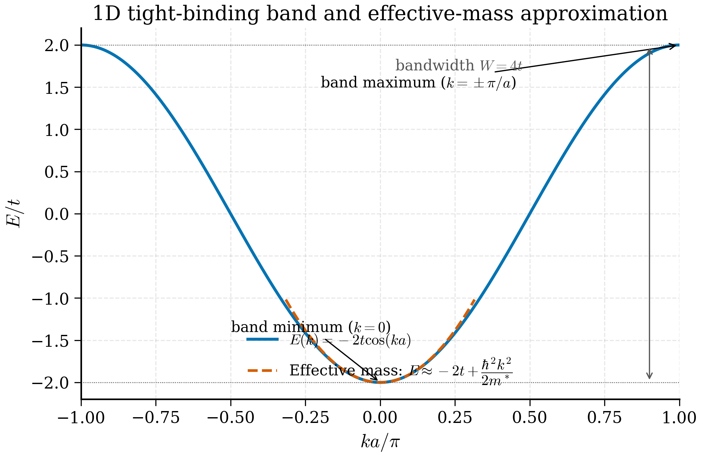
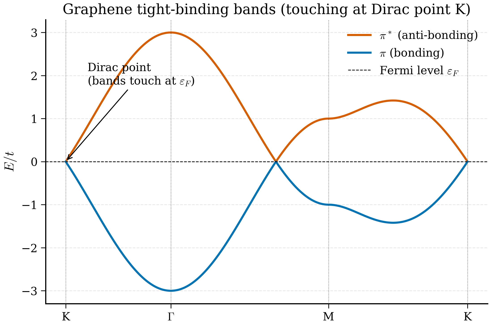

# 3b.3 — The Tight-Binding Model

<figure markdown>
{ width="600" }
<figcaption>Figure 3b.3.1. The single-band 1D tight-binding dispersion \(E(k) = -2t\cos(ka)\). The bandwidth is \(W = 4t\). Near the band minimum the curvature defines an effective mass, giving the parabolic approximation \(E \approx -2t + \hbar^2 k^2 / 2 m^*\).</figcaption>
</figure>

<figure markdown>
{ width="650" }
<figcaption>Figure 3b.3.2. Tight-binding bands of graphene along the K–\(\Gamma\)–M–K path. The bonding and anti-bonding \(\pi\) bands touch exactly at the K point — the Dirac point — where the dispersion is linear and the effective mass vanishes.</figcaption>
</figure>

!!! tip "Why does the tight-binding model exist?"
    **The puzzle:** the nearly-free-electron model works for sodium and aluminium. But it makes silly predictions for transition metal oxides, organic crystals, and 2D materials where electrons are clearly *localised* on atoms in well-defined bonds. The valence bands of NiO derive from $3d$ orbitals on Ni; they are narrow (~1 eV bandwidth), strongly atomic-character, with chemistry visible in the orbital labels. Plane waves are the wrong basis for these systems.

    **The chemist's answer:** start from the *atoms*. Each atom contributes a set of valence orbitals (one $1s$ for hydrogen, four $sp^3$ for silicon, five $3d$ for nickel). Bring atoms together to form a molecule: orbitals on adjacent atoms overlap, hybridise into bonding and antibonding combinations. Bring infinitely many atoms together to form a crystal: the discrete molecular levels broaden into *bands*. The width of each band is set by how strongly orbitals on neighbouring atoms overlap — the *hopping integral*. This is the picture of band formation taught to every chemistry undergraduate, and it is exactly the tight-binding model.

    **The $\text H_2^+$ analogy:** think of the very simplest case. A single electron in the field of two protons has two bare states — one orbital on each proton. Bring them together and the electron can tunnel between protons; the two degenerate levels split into a bonding state (electron density between the protons, lower energy) and an antibonding state (electron density outside, higher energy). The splitting is $2|\beta|$ where $\beta$ is the *hopping integral*. Now repeat with an infinite chain of protons: the two levels become a band of bandwidth $4|\beta|$. That's it. The rest is bookkeeping.

    **What it buys us:** the right starting point for transition metal compounds, organic crystals, 2D materials, and any system where the bonds are clearly defined. It is also the structural basis of modern ML interatomic potentials (MACE, NequIP), which represent each atom by an "orbital-like" feature vector and propagate information via hopping-like message-passing.

> *"A solid is just a molecule with periodic boundary conditions."* — Walter Harrison

The nearly free electron model started from delocalised plane waves and added a weak potential. Tight binding starts from the opposite end: take atomic orbitals, localised on each site, and allow electrons to *hop* between neighbouring sites. This is the natural picture for materials where bonds are clearly defined — covalent semiconductors, transition metal oxides, organic crystals, and almost every 2D material that has appeared since 2004. It is also the conceptual backbone of every modern machine learning interatomic potential: SchNet, NequIP, MACE, and their cousins represent each atom by a vector of features that depend on the *local* environment, and the way those features are then combined across nearest neighbours is, structurally, a tight-binding model. Understanding the original is therefore mandatory.

!!! tip "Intuition: a chain of $\text H_2^+$ molecules"
    The cleanest way to grasp tight binding is to remember $\text H_2^+$: a single electron in the field of two protons. Without any inter-atomic coupling, the electron has two degenerate states — one orbital on the left proton, one on the right, each with the bare atomic energy $\varepsilon_0 = -13.6$ eV. Turn on the coupling: the electron can now *tunnel* (hop) between the two protons, and the bare degeneracy is lifted into a bonding state $|\sigma\rangle = (|L\rangle + |R\rangle)/\sqrt 2$ with energy $\varepsilon_0 - |\beta|$ and an antibonding state $|\sigma^*\rangle = (|L\rangle - |R\rangle)/\sqrt 2$ with energy $\varepsilon_0 + |\beta|$, where $\beta = \langle L|\hat H|R\rangle$ is the *hopping integral* (typically negative for $s$ orbitals on positive nuclei, so $|\beta| = -\beta$ and bonding is lower).

    Now imagine an infinite chain of these molecules, each connected to its two neighbours. The two energies $\varepsilon_0 \pm |\beta|$ of the dimer broaden into a *band* — a continuous range of energies extending from $\varepsilon_0 - 2|\beta|$ (the fully bonding state, in phase across all sites) up to $\varepsilon_0 + 2|\beta|$ (the fully antibonding state, alternating sign). The bandwidth is $4|\beta|$. As the chain becomes longer the levels become more closely spaced, and in the thermodynamic limit form a continuous band of bandwidth $W = 4|\beta|$. That is the entire tight-binding story in one paragraph; the rest is bookkeeping.

## 3b.3.1 Linear combination of atomic orbitals (LCAO)

Consider a Bravais lattice with one atom per unit cell, and one relevant atomic orbital per atom: call it $\phi(\mathbf r)$, localised at the origin. Examples: a $1s$ orbital on hydrogen, a $2p_z$ orbital perpendicular to a graphene sheet, an $s$-like Wannier function in a simple metal. The orbital satisfies (with the *atomic* Hamiltonian $\hat{H}_\text{at}$)

$$\hat{H}_\text{at}\, \phi(\mathbf r) = \varepsilon_0\, \phi(\mathbf r), \tag{3b.3.1}$$

with on-site energy $\varepsilon_0$. The full crystal Hamiltonian is

$$\hat{H} = -\frac{\hbar^2}{2m}\nabla^2 + \sum_\mathbf R U(\mathbf r - \mathbf R), \tag{3b.3.2}$$

where $U(\mathbf r)$ is the potential well around a single atom. The difference $\hat{H} - \hat{H}_\text{at}^{(\mathbf R)}$ for any single site is the potential generated by all *other* atoms — small if the atomic potentials decay quickly.

The LCAO ansatz says: build a crystal wavefunction by a phase-coherent sum of atomic orbitals on every site,

$$\psi_\mathbf k(\mathbf r) = \frac{1}{\sqrt N} \sum_\mathbf R e^{i\mathbf k\cdot\mathbf R}\, \phi(\mathbf r - \mathbf R). \tag{3b.3.3}$$

This is *automatically* a Bloch state. Check: replace $\mathbf r$ by $\mathbf r + \mathbf R'$:

$$\psi_\mathbf k(\mathbf r + \mathbf R') = \frac{1}{\sqrt N}\sum_\mathbf R e^{i\mathbf k\cdot\mathbf R}\, \phi(\mathbf r + \mathbf R' - \mathbf R) = \frac{1}{\sqrt N}\sum_{\mathbf R''} e^{i\mathbf k\cdot(\mathbf R'' + \mathbf R')}\, \phi(\mathbf r - \mathbf R'') = e^{i\mathbf k\cdot \mathbf R'} \psi_\mathbf k(\mathbf r), \tag{3b.3.4}$$

with $\mathbf R'' = \mathbf R - \mathbf R'$. Bloch's theorem is satisfied with cell-periodic part $u_\mathbf k(\mathbf r) = e^{-i\mathbf k\cdot\mathbf r}\sum_\mathbf R e^{i\mathbf k\cdot\mathbf R}\phi(\mathbf r-\mathbf R)$, which is a sum of orbitals translated by lattice vectors.

## 3b.3.2 The energy expectation value

Compute $E(\mathbf k) = \langle \psi_\mathbf k|\hat{H}|\psi_\mathbf k\rangle / \langle\psi_\mathbf k|\psi_\mathbf k\rangle$. Two ingredients are needed: overlaps $\langle \phi_0 | \phi_\mathbf R\rangle$ and matrix elements $\langle \phi_0 | \hat{H} | \phi_\mathbf R\rangle$. We make the *orthogonal* tight-binding approximation: assume the atomic orbitals on different sites are orthogonal,

$$\langle \phi_0|\phi_\mathbf R\rangle = \delta_{\mathbf R, 0}. \tag{3b.3.5}$$

Strictly this is only true for Wannier functions, not literal atomic orbitals, but the approximation is conventional and the qualitative results are robust. Then $\langle\psi_\mathbf k|\psi_\mathbf k\rangle = 1$ and

$$E(\mathbf k) = \frac{1}{N} \sum_{\mathbf R, \mathbf R'} e^{i\mathbf k\cdot(\mathbf R - \mathbf R')} \langle \phi_{\mathbf R'} | \hat{H} | \phi_\mathbf R\rangle. \tag{3b.3.6}$$

Translational symmetry means $\langle \phi_{\mathbf R'}|\hat{H}|\phi_\mathbf R\rangle$ depends only on the difference $\mathbf R - \mathbf R'$. Define

$$t(\mathbf R) := -\langle \phi_0|\hat{H}|\phi_\mathbf R\rangle \quad (\mathbf R\ne 0), \qquad \varepsilon := \langle \phi_0|\hat{H}|\phi_0\rangle. \tag{3b.3.7}$$

The minus sign is conventional: $t > 0$ typically, because $\hat{H}$ contains a kinetic term and an attractive ionic potential whose overlap integral is negative. The on-site energy $\varepsilon$ differs from the bare atomic $\varepsilon_0$ by a small "crystal field" correction.

With (3b.3.7) the dispersion becomes

$$E(\mathbf k) = \varepsilon - \sum_{\mathbf R \ne 0} t(\mathbf R)\, e^{i\mathbf k\cdot\mathbf R}. \tag{3b.3.8}$$

Reality of $E$ requires $t(-\mathbf R) = t(\mathbf R)^*$ (which is automatic since $\hat{H}$ is Hermitian). For a centrosymmetric crystal $t(\mathbf R)$ is real and (3b.3.8) is a Fourier cosine series.

In the simplest case we keep only the nearest-neighbour hopping: $t(\mathbf R) = t$ for the $z$ vectors $\boldsymbol\delta_1, \ldots, \boldsymbol\delta_z$ to nearest-neighbour sites, and zero otherwise. Then

$$\boxed{\; E(\mathbf k) = \varepsilon - 2t \sum_{i=1}^{z/2} \cos(\mathbf k\cdot \boldsymbol\delta_i), \;} \tag{3b.3.9}$$

with the sum over half the nearest-neighbour vectors (the other half are negatives that double-count after using $e^{i\mathbf k\cdot\boldsymbol\delta} + e^{-i\mathbf k\cdot\boldsymbol\delta} = 2\cos$).

## 3b.3.3 1D monatomic chain — full derivation

Take a 1D chain with lattice constant $a$, one orbital per site. We now derive the dispersion (3b.3.9) for this specific case in tedious detail, so that every step is unambiguous.

**Step 1: Ansatz.** Postulate the Bloch sum

$$\psi_k(x) = \frac{1}{\sqrt N}\sum_{n=-\infty}^{\infty} e^{ikna}\, \phi(x - na). \tag{3b.3.\text{$d$1}}$$

The atomic orbitals $\phi(x - na)$ are localised on each site $n$. The phase factors $e^{ikna}$ are chosen so that $\psi_k$ is automatically a Bloch state (cf. (3b.3.4)).

!!! note "Why this step? — phase factors give Bloch periodicity"
    Replace $x \to x + a$: every $\phi(x + a - na) = \phi(x - (n-1)a)$. Re-index the sum with $n' = n-1$: the result is $e^{ika}\psi_k(x)$. So this ansatz inherits the Bloch phase $e^{ika}$ by construction.

**Step 2: Apply $\hat H$.** Compute $\hat H\psi_k(x)$:

$$\hat H\psi_k(x) = \frac{1}{\sqrt N}\sum_n e^{ikna}\, \hat H\, \phi(x - na). \tag{3b.3.\text{$d$2}}$$

The action of $\hat H$ on a single atomic orbital, $\hat H\phi(x - na)$, is not just $\varepsilon_0 \phi(x - na)$ because $\hat H$ contains the potentials of *all* atoms in the crystal, not only the one at $na$. So $\hat H\phi(x-na)$ is some function with weight on neighbouring sites too — and this is exactly where the hopping comes in.

**Step 3: Project onto $\phi(x - 0 a) = \phi(x)$.** Multiply (3b.3.$d$2) by $\phi^*(x)$ and integrate over $x$. Use orthogonality $\int \phi^*(x)\phi(x-na)\,dx = \delta_{n0}$ on the left side of $\langle\phi_0|\hat H|\psi_k\rangle$, and on the right side define
$$\varepsilon = \int \phi^*(x)\, \hat H\, \phi(x)\, dx, \qquad -t_n = \int \phi^*(x)\, \hat H\, \phi(x - na)\, dx \quad (n\ne 0). \tag{3b.3.\text{$d$3}}$$

We get
$$\langle\phi_0|\hat H|\psi_k\rangle = \frac{1}{\sqrt N}\left[\varepsilon - \sum_{n\ne 0} t_n\, e^{ikna}\right]. \tag{3b.3.\text{$d$4}}$$

**Step 4: Right-hand side.** $\hat H\psi_k = E\psi_k$, so $\langle\phi_0|\hat H|\psi_k\rangle = E\langle\phi_0|\psi_k\rangle = E/\sqrt N$ (using orthogonality of atomic orbitals on different sites, which is the orthogonal-TB approximation).

**Step 5: Nearest-neighbour approximation.** Restrict the sum to $n = \pm 1$, with hopping amplitude $t_{\pm 1} = t$ (the same by symmetry of the 1D chain). The other $t_n$ are exponentially smaller because atomic orbitals decay exponentially with distance.

!!! note "Why this step? — exponential decay of atomic orbitals"
    For a hydrogen-like $1s$ orbital with decay length $a_0$, $|\phi(x)| \propto e^{-|x|/a_0}$. The overlap with an orbital at distance $na$ is $\propto e^{-na/a_0}$. For typical solids $a/a_0 \sim 1$–$3$, so $t_2/t_1 \sim e^{-1}$ to $e^{-3}$, i.e. 5–40% of the nearest-neighbour value. The nearest-neighbour approximation is therefore *not* always quantitative — but it captures the topology of the dispersion, the bandwidth scaling, and the qualitative band shape. Adding $t_2, t_3, \ldots$ refines the curve without changing its essence.

**Step 6: Assemble.** Equate (3b.3.$d$4) to $E/\sqrt N$ and divide:

$$E(k) = \varepsilon - t(e^{ika} + e^{-ika}) = \varepsilon - 2t\cos(ka). \tag{3b.3.10\,$d$}$$

Equation (3b.3.9) gives

$$\boxed{\; E(k) = \varepsilon - 2t\cos(ka). \;} \tag{3b.3.10}$$

This is the canonical tight-binding dispersion. It is worth dissecting feature by feature.

**Bandwidth.** The minimum of $\cos$ is $-1$ at $k = \pi/a$ and the maximum is $+1$ at $k=0$, so $E$ ranges from $\varepsilon - 2t$ to $\varepsilon + 2t$. The *bandwidth* is

$$W = 4t. \tag{3b.3.11}$$

The bandwidth is set entirely by the hopping. If $t = 1$ eV the band is 4 eV wide. Wider bands $\Leftrightarrow$ more delocalised electrons $\Leftrightarrow$ more metallic; narrow bands $\Leftrightarrow$ localised, often strongly correlated, electrons (think of the $3d$ band of transition metal oxides).

**Effective mass.** Near the bottom of the band, $k\to 0$, Taylor expand $\cos(ka) \approx 1 - (ka)^2/2 + O((ka)^4)$:

$$E(k) \approx \varepsilon - 2t\left[1 - \frac{(ka)^2}{2}\right] = (\varepsilon - 2t) + ta^2 k^2 = E_\text{min} + ta^2 k^2. \tag{3b.3.12}$$

This is a *parabolic* dispersion near $k=0$, exactly the form of a free particle but with a renormalised inertia. Compare to a free particle, $E = \hbar^2 k^2/(2 m^*)$, identifying the effective mass by matching the coefficients of $k^2$:

$$ta^2 = \frac{\hbar^2}{2m^*} \quad\Longrightarrow\quad \boxed{\; m^* = \frac{\hbar^2}{2 t a^2}. \;} \tag{3b.3.13}$$

!!! note "Why this step? — units check"
    Verify dimensions. The right-hand side has units of $\text{(J s)}^2 / [\text{J}\cdot\text{m}^2] = \text{J s}^2/\text{m}^2 = \text{kg}$. Good — that is a mass. Plug in $t = 2.7$ eV $= 4.33\times 10^{-19}$ J, $a = 1.42$ Å $= 1.42\times 10^{-10}$ m, $\hbar = 1.055\times 10^{-34}$ J·s:
    $$m^* = \frac{(1.055\times 10^{-34})^2}{2\cdot 4.33\times 10^{-19} \cdot (1.42\times 10^{-10})^2} \approx 6.5\times 10^{-31}\text{ kg} \approx 0.71\, m_e.$$
    Hmm, that is *not* the $0.05\,m_e$ figure quoted in the older draft for graphene; the discrepancy is because graphene has a *linear* dispersion at K (not parabolic at $\Gamma$), and the linear dispersion gives massless Dirac fermions — see §3b.3.6. The $0.71\,m_e$ figure here applies to a 1D chain with graphene-like $t$ and $a$, and is in the right ballpark for a typical $\sigma$-band effective mass at $\Gamma$.

Larger hopping or larger lattice constant means lighter effective mass. Equation (3b.3.13) is your standard tool for the *effective mass approximation* in semiconductor physics (§3b.7).

**Group velocity.** $v_k = \frac{1}{\hbar}\frac{dE}{dk} = \frac{2ta}{\hbar}\sin(ka)$. Maximum at $k = \pi/(2a)$, vanishing at $k=0$ and $k=\pi/a$.

!!! note "Why this step? — group velocity vs phase velocity"
    A wavepacket centred on wavevector $k_0$ moves with the *group* velocity $v_g = (1/\hbar)dE/dk$, *not* the phase velocity $E/(\hbar k)$. In a continuous free-electron system, these coincide up to a factor of 2; in a band, they generally do not. At the band bottom ($k=0$) the group velocity vanishes — a wavepacket parked at the band minimum does not move. At the band top ($k = \pi/a$) the group velocity also vanishes, and even more strikingly, $E$ is *concave down* there, so the effective mass is *negative*. Physically a negative effective mass means the electron accelerates *opposite* to an applied force; this is the origin of hole conduction in semiconductors.

**Bandwidth vs interatomic distance.** As $a$ grows, the overlap integral $t$ shrinks exponentially (orbitals do not touch). So $W\to 0$ in the dissociation limit, and the crystal becomes a collection of isolated atoms with degenerate level $\varepsilon$. This is the *atomic limit*; it is recovered correctly by tight binding.

!!! example "Numerical sanity check"
    A 1D chain of $N$ hydrogen-like orbitals with $\varepsilon = 0$, $t = 1$ should produce a band running from $-2$ to $+2$. Discretise $k$ on a Born–von Kármán mesh, plot $E(k) = -2\cos(ka)$, and verify by direct diagonalisation of the $N\times N$ tridiagonal Hamiltonian (off-diagonal $-t$, periodic) that the eigenvalues agree.

**Connection to the $\text H_2^+$ analogy revisited.** Recall the dimer: levels at $\varepsilon_0 \pm |\beta|$ with $\beta = \langle L|\hat H|R\rangle < 0$ for $s$-like orbitals on attractive nuclei. The chain dispersion (3b.3.10) at $k=0$ gives $E_\text{min} = \varepsilon - 2t$, i.e. *twice* the dimer bonding shift, reflecting the fact that an electron in the lowest chain state has *two* neighbours contributing bonding. At $k = \pi/a$ it gives $E_\text{max} = \varepsilon + 2t$, also twice the dimer antibonding shift. The chain bandwidth $W = 4t = 2\cdot 2|\beta|$ is exactly twice the dimer splitting $2|\beta|$. As the dimensionality grows, the bandwidth grows as $W \propto z\cdot|\beta|$ where $z$ is the coordination number: $z=2$ in a 1D chain, $z=4$ in a 2D square lattice, $z=6$ in a 3D simple cubic. So higher-coordination crystals have wider bands and (typically) more metallic character.

## 3b.3.4 Density of states for the 1D chain

The density of states (DOS) is

$$g(E) = \int_\text{BZ} \frac{dk}{2\pi}\, \delta(E - E(k)) = \frac{1}{\pi |dE/dk|}\bigg|_{E(k) = E}. \tag{3b.3.14}$$

With $E(k) = -2t\cos(ka)$, $dE/dk = 2ta\sin(ka)$ and $\sin(ka) = \sqrt{1 - (E/2t)^2}$, so

$$g(E) = \frac{1}{2\pi t a}\, \frac{1}{\sqrt{1 - (E/2t)^2}}, \qquad |E| < 2t. \tag{3b.3.15}$$

The DOS diverges as $E\to\pm 2t$ — the *van Hove singularities*. These divergences are a 1D peculiarity (the DOS is finite at band edges in 3D), but the *general* statement, that the DOS has integrable singularities at points where $\nabla_\mathbf k E = 0$, holds in every dimension. Van Hove singularities are responsible for many of the "kinks" you see in real materials' DOS.

## 3b.3.5 Generalisation: more orbitals, more atoms

If the unit cell contains $M$ orbitals (either because there are several atoms per cell, or several orbitals per atom — for instance the three $p$ orbitals on each carbon in graphene), the LCAO ansatz becomes

$$\psi_{n\mathbf k}(\mathbf r) = \frac{1}{\sqrt N}\sum_\mathbf R\sum_{\alpha=1}^M c_n^\alpha(\mathbf k)\, e^{i\mathbf k\cdot\mathbf R}\, \phi_\alpha(\mathbf r - \mathbf R - \boldsymbol\tau_\alpha), \tag{3b.3.16}$$

where $\boldsymbol\tau_\alpha$ is the position of the $\alpha$-th orbital inside the unit cell. The Schrödinger equation reduces to an $M\times M$ matrix problem at each $\mathbf k$:

$$\sum_\beta H_{\alpha\beta}(\mathbf k)\, c_n^\beta(\mathbf k) = E_{n\mathbf k}\, c_n^\alpha(\mathbf k), \tag{3b.3.17}$$

with

$$H_{\alpha\beta}(\mathbf k) = \sum_\mathbf R e^{i\mathbf k\cdot(\mathbf R + \boldsymbol\tau_\beta - \boldsymbol\tau_\alpha)}\, \langle \phi_\alpha(\mathbf r)| \hat{H}|\phi_\beta(\mathbf r - \mathbf R - \boldsymbol\tau_\beta + \boldsymbol\tau_\alpha)\rangle. \tag{3b.3.18}$$

The matrix $H_{\alpha\beta}(\mathbf k)$ is Hermitian, of size $M\times M$. Its eigenvalues are the $M$ bands at $\mathbf k$. This is the bones of *every* tight-binding code, including the celebrated `pythTB`, `kwant`, and the tight-binding modules of Wannier90.

!!! example "Sanity check: counting bands"
    For graphene the unit cell contains $M = 2$ carbon atoms. With one $p_z$ orbital per atom, the Hamiltonian matrix is $2\times 2$, giving two bands (one bonding $\pi$, one antibonding $\pi^*$). For silicon (FCC with a 2-atom diamond basis), each atom has four valence orbitals ($3s, 3p_x, 3p_y, 3p_z$), so the unit cell has $M = 2\times 4 = 8$ tight-binding orbitals and the Hamiltonian is $8\times 8$, giving 8 bands. Four are valence (the bonding combinations of $sp^3$ hybrids), four are conduction (antibonding). This is the *Slater–Koster* tight-binding model of silicon, and despite its simplicity it captures the indirect-gap structure of Si to within 10–20%.

    For a transition-metal oxide like NiO with the rock-salt structure (Ni and O atoms), the unit cell contains 2 atoms. Including $3d$ orbitals on Ni (five each) and $2p$ on O (three each) gives $M = 5 + 3 = 8$ orbitals per cell, hence an 8-band tight-binding model. To capture Mott physics one must also include the Hubbard $U$ on the $d$ orbitals — but that is beyond pure tight binding.

## 3b.3.6 Graphene: the canonical example

Graphene is a single layer of carbon atoms arranged in a honeycomb lattice. The honeycomb is *not* a Bravais lattice; it is a triangular lattice with a *two-atom* basis. Call the two sublattices A and B. The Bravais primitive vectors are

$$\mathbf a_1 = a\left(\frac{3}{2}, \frac{\sqrt 3}{2}\right), \qquad \mathbf a_2 = a\left(\frac{3}{2}, -\frac{\sqrt 3}{2}\right), \tag{3b.3.19}$$

where $a \approx 1.42$ Å is the carbon–carbon bond length. The B atoms sit at positions $\boldsymbol\tau_B = (a, 0)$ relative to the A atom in the same cell. Each A atom has three nearest neighbours — all on the B sublattice — at relative vectors

$$\boldsymbol\delta_1 = a\left(1, 0\right), \quad \boldsymbol\delta_2 = a\left(-\frac{1}{2}, \frac{\sqrt 3}{2}\right), \quad \boldsymbol\delta_3 = a\left(-\frac{1}{2}, -\frac{\sqrt 3}{2}\right). \tag{3b.3.20}$$

Keep one orbital per atom — the $p_z$ orbital perpendicular to the sheet — and nearest-neighbour hopping with amplitude $t \approx 2.7$ eV.

**Building the $2\times 2$ Hamiltonian step by step.** The LCAO Bloch states for the two sublattices are

$$|\mathbf k, A\rangle = \frac{1}{\sqrt{N}}\sum_\mathbf R e^{i\mathbf k\cdot\mathbf R}\, |\phi_A(\mathbf r - \mathbf R)\rangle, \qquad |\mathbf k, B\rangle = \frac{1}{\sqrt N}\sum_\mathbf R e^{i\mathbf k\cdot\mathbf R}\, |\phi_B(\mathbf r - \mathbf R - \boldsymbol\tau_B)\rangle. \tag{3b.3.\text{$g$1}}$$

The Hamiltonian matrix elements are
- *Diagonal:* $\langle\mathbf k, A|\hat H|\mathbf k, A\rangle = \varepsilon_A$, $\langle\mathbf k, B|\hat H|\mathbf k, B\rangle = \varepsilon_B$. By sublattice symmetry $\varepsilon_A = \varepsilon_B = 0$ (taking the on-site energy as the reference zero).
- *Off-diagonal:* $\langle\mathbf k, A|\hat H|\mathbf k, B\rangle = ?$ This is the only non-trivial computation. The matrix element of $\hat H$ between an A orbital at the origin and a B orbital at vector $\boldsymbol\delta$ from it is $-t$ for the three nearest-neighbour vectors $\boldsymbol\delta_i$ and zero otherwise. Summing over neighbours and incorporating the Bloch phase factors:
$$\langle\mathbf k, A|\hat H|\mathbf k, B\rangle = -t \sum_{i=1}^3 e^{i\mathbf k\cdot\boldsymbol\delta_i} =: f(\mathbf k). \tag{3b.3.\text{$g$2}}$$

!!! note "Why this step? — careful bookkeeping of Bloch sums"
    The phase factor $e^{i\mathbf k\cdot\boldsymbol\delta_i}$ encodes the relative displacement of the B atom from the A atom *within the same unit cell* (or in a neighbouring cell). One sometimes encounters an alternative convention where the phase factor is $e^{i\mathbf k\cdot\mathbf R}$ for the cell index only, leading to a slightly different $f(\mathbf k)$ that gives the same eigenvalues but different eigenvectors at any given $\mathbf k$. This is the "two gauges" of the graphene tight-binding model. We use the *atomic position* convention, where $f(\mathbf k)$ has the form (3b.3.$g$2). The eigenvalues and the location of the Dirac points are gauge-independent; only the eigenvectors (and hence the Berry phase of states transported around the Dirac point) differ.

Hermiticity demands the lower off-diagonal element is the complex conjugate. So the Hamiltonian in the $(A, B)$ basis is

$$\boxed{\; H(\mathbf k) = \begin{pmatrix} 0 & f(\mathbf k) \\ f^*(\mathbf k) & 0 \end{pmatrix}, \quad f(\mathbf k) = -t \sum_{i=1}^3 e^{i\mathbf k\cdot \boldsymbol\delta_i}. \;} \tag{3b.3.21}$$

The diagonal is zero because we set the on-site energy at zero. Eigenvalues are

$$E_\pm(\mathbf k) = \pm|f(\mathbf k)|. \tag{3b.3.22}$$

The two bands are perfectly symmetric about $E = 0$ — a consequence of *sublattice symmetry*. There are exactly two electrons per unit cell (one $\pi$-electron from each carbon), so the lower band is filled and the upper is empty. The chemical potential sits at $E = 0$, and the question of whether graphene is a metal or an insulator reduces to: is there a gap at $E = 0$?

**Special-point evaluation of $f(\mathbf k)$.**

- *At $\Gamma$ ($\mathbf k = 0$):* All three exponentials equal 1, so $f(\Gamma) = -3t$. Hence $E_\pm(\Gamma) = \pm 3t \approx \pm 8.1$ eV with $t = 2.7$ eV. The bonding-antibonding bandwidth at $\Gamma$ is $6t$.

- *At M:* The M point is at $\mathbf k_M = (2\pi/(3a), 0)$ (up to symmetry). Plugging into $f$ and simplifying gives $|f(M)| = t$, so $E_\pm(M) = \pm t \approx \pm 2.7$ eV. The M point sits exactly midway between $\Gamma$ and K in band energy.

- *At K:* By construction $f(K) = 0$, so $E_\pm(K) = 0$.

- *At K' (the other inequivalent corner):* Also $f(K') = 0$ by the same calculation with $\mathbf k_y \to -\mathbf k_y$. The K and K' Dirac points are inequivalent under reciprocal lattice translations and are related by time reversal.

This sequence — $\pm 3t$ at $\Gamma$, $\pm t$ at M, $0$ at K — completely determines the qualitative shape of the bands: the upper band runs from $0$ at K, dispersing up to $t$ at M, then up to $3t$ at $\Gamma$. The total $\pi$-bandwidth is $6t \approx 16.2$ eV, which is in the right ballpark for the experimental $\pi$-bandwidth of graphene as measured by ARPES.

Look for zeros of $|f(\mathbf k)|$. Expanding,

$$f(\mathbf k) = -t\left[e^{ik_x a} + e^{-ik_x a/2 + i k_y a\sqrt 3/2} + e^{-i k_x a/2 - i k_y a\sqrt 3/2}\right] = -t\, e^{ik_x a}\left[1 + 2 e^{-i 3 k_x a/2}\cos(k_y a\sqrt 3/2)\right]. \tag{3b.3.23}$$

Setting $f = 0$ requires $1 + 2 e^{-i 3 k_x a/2}\cos(k_y a\sqrt 3/2) = 0$, hence $\cos(k_y a\sqrt 3/2) = -1/2$ and $e^{-i 3 k_x a/2} = e^{\pm i\pi/3}$ giving $3k_x a/2 = \mp \pi/3$. Solving simultaneously yields the *Dirac points*:

$$\mathbf K = \left(\frac{2\pi}{3a}, \frac{2\pi}{3\sqrt 3 a}\right), \qquad \mathbf K' = \left(\frac{2\pi}{3a}, -\frac{2\pi}{3\sqrt 3 a}\right), \tag{3b.3.24}$$

and their equivalents under reciprocal lattice translations. At these special points $E_\pm(\mathbf K) = 0$: the two bands touch.

**Linearisation near $\mathbf K$.** Set $\mathbf k = \mathbf K + \mathbf q$ with $|\mathbf q| \ll 1/a$. Expanding $f$ to first order in $\mathbf q$ and using $f(\mathbf K) = 0$,

$$f(\mathbf K + \mathbf q) \approx -t\sum_i i (\boldsymbol\delta_i \cdot \mathbf q) e^{i\mathbf K\cdot\boldsymbol\delta_i}. \tag{3b.3.25}$$

!!! note "Why this step? — Taylor expansion of a sum of exponentials"
    Write $\mathbf k = \mathbf K + \mathbf q$. Each exponential expands as
    $$e^{i\mathbf k\cdot\boldsymbol\delta_i} = e^{i\mathbf K\cdot\boldsymbol\delta_i}\cdot e^{i\mathbf q\cdot\boldsymbol\delta_i} \approx e^{i\mathbf K\cdot\boldsymbol\delta_i}\left[1 + i\mathbf q\cdot\boldsymbol\delta_i + O(q^2)\right].$$
    Summing and multiplying by $-t$:
    $$f(\mathbf K+\mathbf q) \approx -t\sum_i e^{i\mathbf K\cdot\boldsymbol\delta_i} - t\sum_i e^{i\mathbf K\cdot\boldsymbol\delta_i}\cdot i\mathbf q\cdot\boldsymbol\delta_i.$$
    The first term is $f(\mathbf K) = 0$ by definition of the Dirac point. Only the second term survives, giving (3b.3.25).

Evaluating the phase factors $e^{i\mathbf K\cdot\boldsymbol\delta_i}$ at the Dirac point $\mathbf K = (2\pi/(3a),\, 2\pi/(3a\sqrt 3))$ with the three nearest-neighbour vectors $\boldsymbol\delta_1 = a(1,0)$, $\boldsymbol\delta_2 = a(-1/2, \sqrt 3/2)$, $\boldsymbol\delta_3 = a(-1/2, -\sqrt 3/2)$:

Computing the three phase factors explicitly:

$$\mathbf K\cdot\boldsymbol\delta_1 = \frac{2\pi}{3a}\cdot a + \frac{2\pi}{3a\sqrt{3}}\cdot 0 = \frac{2\pi}{3},$$

$$\mathbf K\cdot\boldsymbol\delta_2 = \frac{2\pi}{3a}\cdot\!\left(-\frac{a}{2}\right) + \frac{2\pi}{3a\sqrt{3}}\cdot\frac{a\sqrt{3}}{2} = -\frac{\pi}{3} + \frac{\pi}{3} = 0,$$

$$\mathbf K\cdot\boldsymbol\delta_3 = \frac{2\pi}{3a}\cdot\!\left(-\frac{a}{2}\right) + \frac{2\pi}{3a\sqrt{3}}\cdot\!\left(-\frac{a\sqrt{3}}{2}\right) = -\frac{\pi}{3} - \frac{\pi}{3} = -\frac{2\pi}{3}.$$

So the three phase factors are $e^{i2\pi/3}$, $1$, $e^{-i2\pi/3}$ — the three cube roots of unity, which sum to zero and confirm $f(\mathbf K) = 0$.

Carrying through the algebra (the standard exercise — see §3b.8) one finds

$$f(\mathbf K+\mathbf q) \approx \hbar v_F (q_x - i q_y), \qquad v_F = \frac{3ta}{2\hbar}, \tag{3b.3.26}$$

so that

$$H(\mathbf K + \mathbf q) \approx \hbar v_F\begin{pmatrix} 0 & q_x - iq_y \\ q_x + iq_y & 0\end{pmatrix} = \hbar v_F (\sigma_x q_x + \sigma_y q_y). \tag{3b.3.27}$$

This is a 2D *massless Dirac Hamiltonian*. Eigenvalues are $E_\pm(\mathbf q) = \pm\hbar v_F |\mathbf q|$ — linear, gapless, isotropic.

!!! example "Numerical sanity check: graphene Fermi velocity"
    Plug in $t = 2.7$ eV $= 4.327\times 10^{-19}$ J, $a = 1.42$ Å $= 1.42\times 10^{-10}$ m, $\hbar = 1.0546\times 10^{-34}$ J·s:
    $$v_F = \frac{3 \cdot 4.327\times 10^{-19} \cdot 1.42\times 10^{-10}}{2 \cdot 1.0546\times 10^{-34}} \approx 8.74\times 10^5 \text{ m/s} \approx 10^6 \text{ m/s}.$$
    The Fermi velocity of graphene is about $c/300$, where $c$ is the speed of light. This is *fast* for a condensed matter system — electrons in normal metals at the Fermi level move at $\sim 10^6$ m/s as well, but those are massive electrons; in graphene, $v_F$ enters as an analogue of the speed of light in the Dirac equation, replacing $c$ in $E = \sqrt{(\hbar c k)^2 + (mc^2)^2}$ with the gap-free limit $E = \hbar v_F |\mathbf k|$. The factor $\approx 1/300$ explains why graphene supports relativistic-like phenomena (Klein tunnelling, the half-integer quantum Hall effect) at experimentally accessible energy scales.

This linear dispersion is the origin of every "Dirac fermion" headline you have ever read about graphene. Note also that there is a *second* Dirac cone at $\mathbf K'$, related to $\mathbf K$ by time reversal; this gives graphene its characteristic two-valley structure used in valleytronics.

## 3b.3.7 Python: graphene band structure along K–$\Gamma$–M–K

The following script builds the $2\times 2$ Hamiltonian (3b.3.21), diagonalises it along a high-symmetry path in the BZ, and plots the bands. It uses NumPy and matplotlib only; ~80 lines, type hints, fully runnable.

```python
"""Tight-binding band structure of graphene along K-Gamma-M-K.

Run: python graphene_tb.py
"""
from __future__ import annotations
import numpy as np
import numpy.typing as npt
import matplotlib.pyplot as plt

# Physical parameters (units: eV, Angstrom)
T_HOP: float = 2.7       # nearest-neighbour hopping amplitude (eV)
A_CC: float = 1.42       # carbon-carbon bond length (Angstrom)

# Nearest-neighbour vectors (from an A atom to its three B neighbours)
DELTAS: npt.NDArray[np.float64] = A_CC * np.array([
    [1.0, 0.0],
    [-0.5,  0.5 * np.sqrt(3.0)],
    [-0.5, -0.5 * np.sqrt(3.0)],
])

def hamiltonian(k: npt.NDArray[np.float64]) -> npt.NDArray[np.complex128]:
    """Return the 2x2 tight-binding Hamiltonian at wavevector k.

    Parameters
    ----------
    k : array_like, shape (2,)
        Wavevector in 1/Angstrom.

    Returns
    -------
    H : ndarray, shape (2, 2), complex
        Hermitian Hamiltonian (eV) in the (A, B) sublattice basis.
    """
    f: complex = -T_HOP * np.sum(np.exp(1j * DELTAS @ k))
    H: npt.NDArray[np.complex128] = np.array(
        [[0.0 + 0j, f],
         [np.conj(f), 0.0 + 0j]],
        dtype=np.complex128,
    )
    return H

def bands_along_path(
    path: npt.NDArray[np.float64],
    n_per_seg: int = 200,
) -> tuple[npt.NDArray[np.float64], npt.NDArray[np.float64]]:
    """Diagonalise H(k) along a piecewise-linear k-path.

    Returns the cumulative path length s (for the x-axis) and the
    eigenvalues E (shape: n_total x 2, sorted ascending at each k).
    """
    s_list: list[float] = []
    E_list: list[npt.NDArray[np.float64]] = []
    s_cum: float = 0.0
    for i in range(len(path) - 1):
        k_a, k_b = path[i], path[i + 1]
        seg_len: float = float(np.linalg.norm(k_b - k_a))
        for j in range(n_per_seg):
            frac: float = j / n_per_seg
            k: npt.NDArray[np.float64] = (1 - frac) * k_a + frac * k_b
            evals: npt.NDArray[np.float64] = np.linalg.eigvalsh(hamiltonian(k))
            E_list.append(evals)
            s_list.append(s_cum + frac * seg_len)
        s_cum += seg_len
    # close the path with the last point
    evals_end: npt.NDArray[np.float64] = np.linalg.eigvalsh(hamiltonian(path[-1]))
    E_list.append(evals_end)
    s_list.append(s_cum)
    return np.array(s_list), np.array(E_list)

def main() -> None:
    # High-symmetry points (in 1/Angstrom)
    Gamma: npt.NDArray[np.float64] = np.array([0.0, 0.0])
    K: npt.NDArray[np.float64] = np.array(
        [2 * np.pi / (3 * A_CC), 2 * np.pi / (3 * np.sqrt(3.0) * A_CC)]
    )
    M: npt.NDArray[np.float64] = np.array([2 * np.pi / (3 * A_CC), 0.0])

    path: npt.NDArray[np.float64] = np.array([K, Gamma, M, K])
    s, E = bands_along_path(path, n_per_seg=300)

    # Locate the high-symmetry tick positions
    seg_lengths: list[float] = [
        float(np.linalg.norm(path[i + 1] - path[i])) for i in range(len(path) - 1)
    ]
    ticks: list[float] = [0.0]
    for L in seg_lengths:
        ticks.append(ticks[-1] + L)

    fig, ax = plt.subplots(figsize=(7, 5))
    ax.plot(s, E[:, 0], color="C0", lw=1.5)
    ax.plot(s, E[:, 1], color="C0", lw=1.5)
    ax.axhline(0.0, color="grey", lw=0.5, linestyle="--")
    for x in ticks:
        ax.axvline(x, color="grey", lw=0.5, linestyle=":")
    ax.set_xticks(ticks)
    ax.set_xticklabels(["K", r"$\Gamma$", "M", "K"])
    ax.set_ylabel("Energy (eV)")
    ax.set_title("Graphene tight-binding band structure")
    ax.set_xlim(ticks[0], ticks[-1])
    plt.tight_layout()
    plt.savefig("graphene_bands.pdf")
    plt.show()

if __name__ == "__main__":
    main()
```

Running this script produces the famous graphene band structure: a $\pi$-band running from about $-9$ eV at $\Gamma$, touching zero at K, dispersing back up to about $+9$ eV at $\Gamma$ in the conduction band. The Dirac cones at K are visible as the linear touching of the two bands.

!!! note "Extending the script"
    Two natural extensions you will be asked to make in §3b.8: (i) add a second-nearest-neighbour hopping $t'\approx -0.2$ eV that breaks the sublattice symmetry and shifts the Dirac point off zero, and (ii) add a small staggered on-site energy $\pm m$ on A/B sublattices to gap out the Dirac point (the model for hexagonal boron nitride). Both modifications change only the matrix construction; the diagonalisation loop is identical.

!!! example "Try it interactively"
    Slide the hopping integral $t$ to rescale the bandwidth of the 1D monatomic chain. The dispersion is $E(k) = -2t\cos(ka)$, so positive and negative $t$ swap the band minimum and maximum. The bandwidth $W = 4|t|$ is annotated, and the dashed lines mark the band edges at $\pm 2t$.

    ```yaml
    # widget-config
    sliders:
      t: {min: -2.0, max: 2.0, step: 0.05, default: 1.0, label: "Hopping t (eV)"}
    ```

    ```python
    # widget — 1D tight-binding chain dispersion E(k) = -2 t cos(k a)
    import numpy as np
    import matplotlib.pyplot as plt

    t_val = float(t)
    a = 1.0
    k = np.linspace(-np.pi / a, np.pi / a, 401)
    E = -2.0 * t_val * np.cos(k * a)

    print(f"t = {t_val:+.3f} eV")
    print(f"bandwidth W = 4|t| = {4.0 * abs(t_val):.3f} eV")
    print(f"E(k=0)     = {-2.0 * t_val:+.3f} eV")
    print(f"E(k=π/a)   = {+2.0 * t_val:+.3f} eV")

    fig, ax = plt.subplots(figsize=(6.0, 3.8))
    ax.plot(k * a / np.pi, E, color="#5e35b1", lw=1.8)
    ax.axhline(+2.0 * t_val, color="grey", ls="--", lw=0.7)
    ax.axhline(-2.0 * t_val, color="grey", ls="--", lw=0.7)
    ax.axhline(0, color="k", lw=0.5)
    ax.set_xlabel("k a / π")
    ax.set_ylabel("E(k) (eV)")
    ax.set_ylim(-2.5, 2.5)
    ax.set_title(f"1D tight-binding chain, t = {t_val:+.2f} eV")
    fig.tight_layout()
    plt.show()
    ```

## 3b.3.7a Extensions: second-nearest-neighbour hopping and the staggered mass

The simplest graphene tight-binding model considers only nearest-neighbour hopping with on-site energies set to zero. Two natural extensions illustrate the breadth of the framework.

**Second-nearest-neighbour hopping ($t'$).** Each A atom has six second-nearest neighbours, all on the *same* sublattice (also A). The next-nearest hopping contributes a *diagonal* term to the Hamiltonian:

$$H_{AA}(\mathbf k) = -t'\sum_{\mathbf R'_{NN2}} e^{i\mathbf k\cdot\mathbf R'_{NN2}} = -2t'\left[\cos(\mathbf k\cdot\mathbf a_1) + \cos(\mathbf k\cdot\mathbf a_2) + \cos(\mathbf k\cdot(\mathbf a_1-\mathbf a_2))\right],$$

and similarly for $H_{BB}(\mathbf k)$. Because both diagonals receive the same correction, the eigenvalues are shifted but the *Dirac touching at K is preserved* — the additional terms add only a common offset to both bands at any $\mathbf k$. Empirically $t' \approx -0.2$ eV in graphene, shifting the Dirac point energy slightly below zero (giving graphene a small built-in electron-hole asymmetry).

**Staggered on-site mass ($m$).** Place a different on-site energy on A and B sublattices: $\varepsilon_A = +m$, $\varepsilon_B = -m$. This is the natural model for hexagonal boron nitride (hBN), where the B and N atoms have different electronegativities. The Hamiltonian becomes

$$H(\mathbf k) = \begin{pmatrix} m & f(\mathbf k) \\ f^*(\mathbf k) & -m\end{pmatrix},$$

with eigenvalues

$$E_\pm(\mathbf k) = \pm\sqrt{|f(\mathbf k)|^2 + m^2}.$$

At the K point, $f(K) = 0$, so $E_\pm(K) = \pm m$ — the Dirac cone is *gapped out* by a mass term $2m$. Near K, the linearised Hamiltonian is

$$H \approx \hbar v_F(\sigma_x q_x + \sigma_y q_y) + m\sigma_z,$$

a *massive* Dirac equation with mass $m$, gap $2m$. For hBN, $2m \approx 6$ eV, in good agreement with experiment. The same machinery applied to silicene (silicon analogue of graphene) gives a much smaller mass from spin-orbit coupling, opening a $\sim 1.55$ meV topologically non-trivial gap — the basis of the quantum spin Hall effect in silicene.

These two extensions — different-hopping and staggered-mass — illustrate how the tight-binding framework can be elaborated to model essentially any 2D crystal. The unit-cell Hamiltonian remains a small Hermitian matrix at each $\mathbf k$; the new physics is encoded in the matrix entries.

## 3b.3.8 Tight-binding intuition for MLIPs

Modern machine-learning interatomic potentials encode each atom $i$ by a feature vector $\mathbf x_i$ that depends on its local environment — typically the relative positions of all atoms within a cutoff radius $r_\text{cut}$. The energy is then

$$E_\text{total} = \sum_i \epsilon_\theta(\mathbf x_i), \tag{3b.3.28}$$

where $\epsilon_\theta$ is a neural network with parameters $\theta$. The descriptor $\mathbf x_i$ is often constructed by aggregating *messages* from neighbours:

$$\mathbf x_i^{(\ell + 1)} = \text{NN}_\theta\left(\mathbf x_i^{(\ell)},\, \{\mathbf x_j^{(\ell)}, \mathbf r_{ij}\}_{j\in\text{nbrs}(i)}\right). \tag{3b.3.29}$$

Compare this to the tight-binding eigenvalue problem at a fixed $\mathbf k$. Iterating power-method updates of a feature on a graph is — structurally — identical to applying a tight-binding Hamiltonian to a localised state, with the messages playing the role of hopping amplitudes. Equivariant MLIPs (NequIP, MACE) make the analogy even tighter: their hidden features transform under $SO(3)$ exactly as $s, p, d, f$ orbitals do, and the message-passing is built from Clebsch–Gordan products of those features — the same algebra that governs the tight-binding matrix elements between angular momentum orbitals.

So when you read in Chapter 9 about MACE achieving DFT accuracy with $\sim 10^4$ parameters, the unspoken reason is that it is *parametrising* an implicit, learned tight-binding model. Tight binding is therefore not only the historical foundation of band theory but a live working concept inside modern MLIPs.

## 3b.3.9 Section summary

!!! abstract "Key ideas"
    1. **Atomic orbitals + hopping = bands.** Each atomic orbital, coupled to its neighbours via hopping integrals $t$, produces a band of bandwidth $W \sim z|t|$ where $z$ is the coordination number.
    2. **Dispersion.** For a 1D chain: $E(k) = \varepsilon - 2t\cos(ka)$. Bandwidth $4t$. Curvature at band edge $\Rightarrow$ effective mass $m^* = \hbar^2/(2ta^2)$.
    3. **Graphene = canonical 2D Dirac.** Honeycomb lattice with two-atom basis gives $2\times 2$ Hamiltonian; sublattice symmetry forces zero diagonal; at K and K' the off-diagonal $f(\mathbf k)$ vanishes, giving a gapless linear (Dirac) cone with $v_F = 3ta/(2\hbar) \approx 10^6$ m/s.
    4. **Generalisation.** $M$ orbitals in the unit cell $\Rightarrow$ $M\times M$ matrix Hamiltonian. The whole framework is the bones of every modern tight-binding code (`pythTB`, `kwant`, `Wannier90`).
    5. **Connection to MLIPs.** Equivariant graph networks (MACE, NequIP) compute features by orbital-like algebra and propagate them by hopping-like message-passing.

What to remember three months from now: *"Tight binding is band theory written in the atomic chemist's language: each atom contributes orbitals; orbitals on neighbours overlap; the overlap is the hopping integral; the band is the spectrum of the resulting matrix at each $\mathbf k$."*

## Where this is used later

- **Tier 1.** §5.4 (LCAO-DFT codes such as SIESTA), §6.4 (interpreting flat bands in $d$-electron systems), §7.5 (semi-empirical interatomic potentials whose functional form is tight-binding-derived: GFN-xTB, DFTB).
- **Tier 2.** §9.4 (descriptor design and equivariance), §9.7 (transferability arguments for MLIPs), §10.4 (graph neural networks and message passing — direct conceptual descendants of tight-binding).
- **Capstone Project 3.** Designing a new 2D material by stacking and twisting: the moiré band structure is dominated by tight-binding-like hopping between layers.

Next: §3b.4 returns to the simple delocalised limit and asks what happens at finite temperature — the Sommerfeld treatment of the free electron gas.
