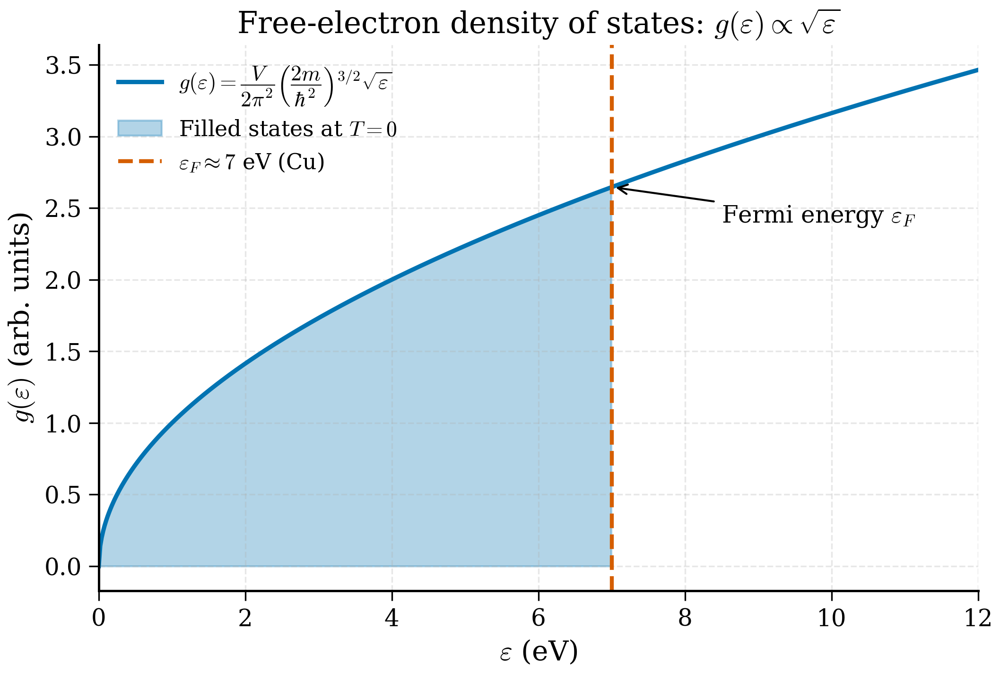

# 3b.4 — The Free Electron Gas and the Sommerfeld Expansion

<figure markdown>
{ width="600" }
<figcaption>Figure 3b.4.1. The free-electron density of states is \(g(\varepsilon) \propto \sqrt{\varepsilon}\). At \(T = 0\), all states below the Fermi energy \(\varepsilon_F\) are filled (shaded region); for copper this corresponds to \(\varepsilon_F \approx 7\) eV.</figcaption>
</figure>

!!! tip "Why does the free electron / Sommerfeld model exist?"
    **The puzzle in 1900:** Drude proposed that metals contain a gas of free electrons that scatter off ions, and from this he derived Ohm's law and the Wiedemann-Franz ratio of thermal to electrical conductivity — both stunningly successful. But by the 1920s a paradox had emerged: classical kinetic theory predicted an electronic contribution to the heat capacity of $(3/2)Nk_B$ — comparable to the lattice contribution. Experimentally the electronic specific heat is *thousands of times smaller* than that. Where did the missing heat capacity go?

    **Sommerfeld's resolution (1928):** electrons are *fermions*. At ordinary temperatures, the Fermi sea is full up to the Fermi energy $E_F \sim 5-10$ eV, far above $k_B T \sim 0.025$ eV at room temperature. Only electrons within $k_B T$ of $E_F$ can be thermally excited; the rest are "frozen" by the Pauli principle into the depths of the Fermi sea. The fraction that participates is $\sim T/T_F \sim 1/300$, and so the electronic heat capacity is suppressed by this factor — giving the linear-in-$T$ Sommerfeld term that *does* match experiment to within a factor of two.

    **The picture to keep:** imagine a 3D sphere in $\mathbf k$-space, filled to its surface (the Fermi sphere of radius $k_F$). At zero temperature every state inside is occupied and every state outside is empty. At finite temperature, only a thin shell of width $\sim k_B T/\hbar v_F$ near the surface has any thermal action. Everything thermal in a metal — heat capacity, magnetic susceptibility, low-$T$ resistivity — is a story about this thin Fermi shell.

    **What it buys us:** the simplest possible model that gets electronic thermodynamics roughly right, *and* (via jellium) the starting point for the LDA functional that powers most modern DFT calculations.

> *"Take all the electrons in a metal, ignore the ions completely, ignore the interactions completely, and see what you get. The answer is: most of the metal."* — Drude, paraphrased

The simplest band structure is no band structure: ignore the lattice altogether and treat the conduction electrons as a gas of non-interacting fermions in a box. This is the *free electron gas* model, and despite its crudeness it accounts for many properties of simple metals to within tens of percent: electronic specific heat, Pauli paramagnetism, the linear-in-$T$ resistivity coefficient, and the rough magnitude of the Fermi energy. It is also the starting point — quite literally — for the local density approximation in DFT, which uses the exchange–correlation energy of a *uniform* electron gas as its building block.

In this section we develop the free electron gas in three dimensions, derive its density of states, define the Fermi energy and Fermi temperature, and use the Sommerfeld expansion to compute finite-temperature corrections including the famous linear electronic specific heat. We finish with a numerical worked example for copper.

!!! tip "Intuition: count grains of sand inside a sphere"
    The free electron gas is, mathematically, the simplest possible band structure: a single parabola $E = \hbar^2 k^2/2m$. The non-trivial content comes from *counting* — figuring out how many states have energy less than some value $E$, and how that count translates into thermodynamic quantities like specific heat. The geometry is clean: in 3D the states form a uniform cubic lattice in $\mathbf k$-space with spacing $2\pi/L$, and the constant-energy surfaces are spheres. So "how many states have energy $\le E$" is "how many lattice points fit inside a sphere of radius $k = \sqrt{2mE}/\hbar$". In the thermodynamic limit this becomes "volume of sphere divided by volume of one cubic cell" — pure geometry.

    With the density of states $g(\varepsilon)$ in hand, all thermodynamic quantities of the free electron gas are integrals over $\varepsilon$ weighted by $g(\varepsilon)f(\varepsilon)$, where $f$ is the Fermi–Dirac distribution. At temperatures far below the Fermi temperature ($T \ll T_F$), $f$ is essentially a sharp step function and only states within $k_B T$ of $\varepsilon_F$ matter. This is the *degenerate limit*, and it justifies the Sommerfeld expansion — a systematic series in the small parameter $T/T_F$.

## 3b.4.1 The setup

$N$ non-interacting electrons of mass $m$ live in a cubic box of side $L$, volume $V = L^3$. Impose periodic boundary conditions (the same Born–von Kármán device as in §3b.1). The single-particle eigenstates are plane waves

$$\psi_\mathbf k(\mathbf r) = \frac{1}{\sqrt V}\, e^{i\mathbf k\cdot\mathbf r}, \qquad \mathbf k = \frac{2\pi}{L}(n_x, n_y, n_z), \quad n_i \in \mathbb Z, \tag{3b.4.1}$$

with energy

$$\varepsilon(\mathbf k) = \frac{\hbar^2 |\mathbf k|^2}{2m}. \tag{3b.4.2}$$

Electrons carry spin $1/2$, so each $\mathbf k$ accommodates two electrons. The allowed $\mathbf k$ form a cubic lattice in reciprocal space with spacing $2\pi/L$, hence density

$$\frac{V}{(2\pi)^3}\, d^3 k \tag{3b.4.3}$$

states per unit volume of $\mathbf k$-space (counting spin doubles this).

## 3b.4.2 Filling the Fermi sphere

At zero temperature, the ground state has every state with $\varepsilon < \varepsilon_F$ filled and every state with $\varepsilon > \varepsilon_F$ empty. Because $\varepsilon$ depends only on $|\mathbf k|$, the occupied region is a sphere of radius $k_F$ — the **Fermi sphere**. The Fermi wavevector $k_F$ is fixed by the total number of electrons:

$$N = 2 \cdot \frac{V}{(2\pi)^3} \cdot \frac{4\pi}{3}\, k_F^3, \tag{3b.4.4}$$

where the leading $2$ is the spin degeneracy. Solve for $k_F$:

$$\boxed{\; k_F = (3\pi^2 n)^{1/3}, \quad n := N/V. \;} \tag{3b.4.5}$$

The Fermi energy is

$$\varepsilon_F = \frac{\hbar^2 k_F^2}{2m} = \frac{\hbar^2}{2m}(3\pi^2 n)^{2/3}, \tag{3b.4.6}$$

and the Fermi temperature is

$$T_F := \varepsilon_F / k_B. \tag{3b.4.7}$$

For metals, $T_F$ is typically $10^4 - 10^5$ K — far above room temperature. This is the central observation justifying the *degenerate* electron gas approximation: at any laboratory temperature $T \ll T_F$, the electron gas is essentially in its ground state, and finite-temperature effects show up as small corrections in powers of $T/T_F$.

!!! note "Why this step? — the Fermi sphere volume"
    Equation (3b.4.4) is a simple geometric statement. The total number of electrons must equal twice (for spin) the number of $\mathbf k$-states inside the Fermi sphere. The number of $\mathbf k$-states inside a sphere of radius $k_F$ is the volume of the sphere $\tfrac43\pi k_F^3$ multiplied by the density of $\mathbf k$-states in $\mathbf k$-space, which is $V/(2\pi)^3$. Solving (3b.4.4) for $k_F$ gives $(3\pi^2 n)^{1/3}$. The factor $3\pi^2$ is the dimensionless number that always appears here; you should recognise it on sight.

!!! example "Sanity check: Fermi sphere parameters across the periodic table"
    The free electron density $n$ in metals varies by less than two orders of magnitude across the periodic table. Some examples (assuming one valence electron per atom, except where noted):
    - Li ($n = 4.7\times 10^{28}$ /m$^3$): $k_F = 1.12\times 10^{10}$ /m, $E_F = 4.7$ eV, $T_F = 5.5\times 10^4$ K.
    - Na ($n = 2.65\times 10^{28}$ /m$^3$): $k_F = 0.92\times 10^{10}$ /m, $E_F = 3.2$ eV, $T_F = 3.7\times 10^4$ K.
    - Cu ($n = 8.49\times 10^{28}$ /m$^3$): $k_F = 1.36\times 10^{10}$ /m, $E_F = 7.0$ eV, $T_F = 8.2\times 10^4$ K (worked out in detail below).
    - Al ($n = 1.81\times 10^{29}$ /m$^3$, three valence electrons): $k_F = 1.75\times 10^{10}$ /m, $E_F = 11.6$ eV, $T_F = 1.35\times 10^5$ K.
    Across this list, $T/T_F$ at room temperature ranges from 0.002 (Al) to 0.008 (Na) — all firmly in the degenerate regime where the Sommerfeld expansion converges rapidly.

## 3b.4.3 The density of states

Many thermodynamic quantities depend on the electron distribution only through the *density of states* $g(\varepsilon)$, defined so that $g(\varepsilon) d\varepsilon$ is the number of single-particle states (per unit volume) with energy in $[\varepsilon, \varepsilon + d\varepsilon]$.

We will derive $g(\varepsilon)$ in three slow, instructive steps so that you can see the whole machinery laid out — DOS in $\mathbf k$-space, volume element in spherical shells, Jacobian transform $\mathbf k \to E$.

**Step 1: DOS in $\mathbf k$-space.** From the box quantisation (3b.4.1), each allowed wavevector occupies a cell of volume $(2\pi/L)^3 = (2\pi)^3/V$ in $\mathbf k$-space. So the number of $\mathbf k$-states per unit volume of $\mathbf k$-space is $V/(2\pi)^3$. Including the spin-2 degeneracy, the *spin-summed* DOS in $\mathbf k$-space is

$$\rho_{\mathbf k} = \frac{2V}{(2\pi)^3} \quad [\text{states per (m}^{-1}\text{)}^3]. \tag{3b.4.\text{$d$1}}$$

**Step 2: Volume of a thin spherical shell.** Because the energy depends only on $|\mathbf k|$, the constant-energy surface is a sphere. A thin spherical shell between $|\mathbf k|$ and $|\mathbf k|+dk$ has volume $4\pi k^2\, dk$ in $\mathbf k$-space. The number of states in that shell is

$$dN = \rho_{\mathbf k}\cdot 4\pi k^2\, dk = \frac{2V}{(2\pi)^3}\cdot 4\pi k^2\, dk = \frac{V k^2}{\pi^2}\, dk. \tag{3b.4.\text{$d$2}}$$

**Step 3: Change variable from $k$ to $\varepsilon$.** Use $\varepsilon = \hbar^2 k^2/(2m)$, so $k = \sqrt{2m\varepsilon}/\hbar$ and $dk/d\varepsilon = (1/\hbar)\sqrt{m/(2\varepsilon)}$. Then $k^2\, dk = k^2\cdot (dk/d\varepsilon)\, d\varepsilon = (2m\varepsilon/\hbar^2)\cdot (1/\hbar)\sqrt{m/(2\varepsilon)}\, d\varepsilon = (m/\hbar^3)\sqrt{2m\varepsilon}\, d\varepsilon$.

!!! note "Why this step? — the Jacobian carries all the dimensionality"
    The factor $\sqrt{\varepsilon}$ in the final DOS comes entirely from this change of variables. In $d$ dimensions, the shell volume scales as $k^{d-1}\,dk$, and after substituting $k\propto\sqrt\varepsilon$ you get $g_d(\varepsilon)\propto \varepsilon^{(d-2)/2}$. So $g_1\propto 1/\sqrt\varepsilon$ (1D, diverges at band bottom), $g_2 = \text{const}$ (2D), $g_3\propto\sqrt\varepsilon$ (3D). This dimensional pattern is one of the few facts about DOS that you should commit to memory.

Substituting back,

$$dN = \frac{V}{\pi^2}\cdot\frac{m}{\hbar^3}\sqrt{2m\varepsilon}\, d\varepsilon = \frac{V}{2\pi^2}\left(\frac{2m}{\hbar^2}\right)^{3/2}\sqrt\varepsilon\, d\varepsilon. \tag{3b.4.\text{$d$3}}$$

The DOS per unit volume is therefore $g(\varepsilon) = dN/(V\, d\varepsilon)$, exactly recovering (3b.4.10).

For reference, here is the original calculation in the more compact "differentiate the cumulative" approach:

Start with the number of states with energy $\le \varepsilon$:

$$N(\varepsilon)/V = 2 \cdot \frac{1}{(2\pi)^3} \cdot \frac{4\pi}{3} k(\varepsilon)^3, \qquad k(\varepsilon) = \sqrt{2m\varepsilon}/\hbar. \tag{3b.4.8}$$

Substituting,

$$\frac{N(\varepsilon)}{V} = \frac{1}{3\pi^2}\left(\frac{2m\varepsilon}{\hbar^2}\right)^{3/2}. \tag{3b.4.9}$$

Differentiating with respect to $\varepsilon$,

$$\boxed{\; g(\varepsilon) = \frac{1}{2\pi^2}\left(\frac{2m}{\hbar^2}\right)^{3/2}\sqrt{\varepsilon}. \;} \tag{3b.4.10}$$

The 3D free-electron DOS grows as $\sqrt{\varepsilon}$. A useful equivalent form, expressing $g$ in terms of $\varepsilon_F$ and $n$:

$$g(\varepsilon_F) = \frac{3n}{2\varepsilon_F}, \qquad g(\varepsilon) = g(\varepsilon_F)\, \sqrt{\varepsilon/\varepsilon_F}. \tag{3b.4.11}$$

A factor that recurs everywhere. In 1D the DOS is $\propto 1/\sqrt\varepsilon$ (diverging at the band bottom); in 2D it is constant; in 3D it is $\propto\sqrt\varepsilon$. The dimensional dependence is a useful sanity check for any DOS you ever compute.

## 3b.4.4 Numerical example: copper

Copper has one $4s$ electron per atom outside the closed $3d^{10}$ shell. The metallic density is $8.96$ g/cm$^3$ with atomic mass $63.55$ g/mol, giving an atomic number density of $8.49\times 10^{28}$ atoms/m$^3$, and hence (one electron per atom) $n = 8.49\times 10^{28}$ m$^{-3}$. Plugging into (3b.4.5) and (3b.4.6):

$$k_F = (3\pi^2 \cdot 8.49\times 10^{28})^{1/3} \approx 1.36\times 10^{10}\text{ m}^{-1}, \tag{3b.4.12}$$

$$\varepsilon_F = \frac{(1.055\times 10^{-34})^2}{2 \cdot 9.109\times 10^{-31}}\cdot (1.36\times 10^{10})^2 \approx 1.13\times 10^{-18}\text{ J} \approx 7.04\text{ eV}, \tag{3b.4.13}$$

$$T_F = \varepsilon_F/k_B \approx 8.16\times 10^4\text{ K}. \tag{3b.4.14}$$

The Fermi temperature of copper is about 82 000 K. At room temperature $T/T_F \approx 0.0037$, vanishingly small. The famous experimental Fermi energy of copper, measured from photoemission, is 7.0 eV — the free electron gas is essentially exact, and this is the reason copper is the textbook simple metal.

## 3b.4.4a Numerical worked example: copper from scratch

Let us pause and walk through the copper calculation in full, with every step explicit.

**Step 1: Atomic number density.** Copper has atomic mass $M = 63.55$ g/mol $= 0.06355$ kg/mol. Mass density $\rho = 8.96$ g/cm$^3 = 8960$ kg/m$^3$. Number density of atoms:
$$n_\text{at} = \frac{\rho\, N_A}{M} = \frac{8960\cdot 6.022\times 10^{23}}{0.06355} \approx 8.49\times 10^{28}\text{ m}^{-3}.$$
With one valence ($4s$) electron per atom, the electron density is $n = n_\text{at} = 8.49\times 10^{28}$ /m$^3$.

**Step 2: Fermi wavevector.**
$$k_F = (3\pi^2 n)^{1/3} = (3\pi^2 \cdot 8.49\times 10^{28})^{1/3} = (2.514\times 10^{30})^{1/3} \approx 1.36\times 10^{10}\text{ m}^{-1}.$$
Equivalent: $k_F \approx 1.36$ Å$^{-1}$, i.e. one wavelength fits across about 4.6 Å (compare to Cu's lattice constant $a = 3.61$ Å).

**Step 3: Fermi energy.**
$$E_F = \frac{\hbar^2 k_F^2}{2 m_e} = \frac{(1.055\times 10^{-34})^2 (1.36\times 10^{10})^2}{2\cdot 9.109\times 10^{-31}} \approx 1.13\times 10^{-18}\text{ J}.$$
Converting to eV: $E_F = 1.13\times 10^{-18}/1.602\times 10^{-19} \approx 7.04$ eV.

**Step 4: Fermi temperature.**
$$T_F = E_F/k_B = 1.13\times 10^{-18}/1.381\times 10^{-23} \approx 8.16\times 10^4 \text{ K} \approx 82\,000\text{ K}.$$
At room temperature, $T/T_F \approx 0.0037$. Sommerfeld expansion converges in 4 significant figures after the $T^2$ correction.

**Step 5: Density of states at the Fermi level.**
$$g(E_F) = \frac{3n}{2 E_F} = \frac{3\cdot 8.49\times 10^{28}}{2\cdot 1.13\times 10^{-18}} \approx 1.13\times 10^{47}\text{ J}^{-1}\text{ m}^{-3}.$$
Equivalently, per eV: $g(E_F) \approx 1.81\times 10^{28}$ eV$^{-1}$ m$^{-3}$, or per atom: $g(E_F)/n_\text{at} \approx 0.21$ eV$^{-1}$ per atom — a typical number for a simple metal.

**Step 6: Sommerfeld coefficient.**
$$\gamma = \frac{\pi^2}{3} g(E_F) k_B^2 = \frac{\pi^2}{3} \cdot 1.13\times 10^{47}\cdot (1.381\times 10^{-23})^2 \approx 7.1\times 10^1 \text{ J K}^{-2}\text{ m}^{-3}.$$
Per mole of Cu (molar volume $V_m = M/\rho = 7.09\times 10^{-6}$ m$^3$/mol):
$$\gamma_\text{mol} = \gamma \cdot V_m \approx 71\cdot 7.09\times 10^{-6} \approx 5.0\times 10^{-4} \text{ J K}^{-2}\text{ mol}^{-1}.$$
The experimental value is $\gamma_\text{Cu}^\text{exp} \approx 7.0\times 10^{-4}$ J K$^{-2}$ mol$^{-1}$, about 40% higher than the free-electron prediction. The discrepancy is the *effective mass enhancement*: real Cu electrons interact with each other and with phonons, making them slightly heavier than free electrons. The mass enhancement ratio $m^*/m_e \approx 1.4$ for Cu.

## 3b.4.5 Finite-temperature: the Fermi–Dirac distribution

At temperature $T$ the occupation of single-particle state with energy $\varepsilon$ is governed by Fermi–Dirac statistics:

$$f(\varepsilon) = \frac{1}{e^{(\varepsilon - \mu)/k_B T} + 1}, \tag{3b.4.15}$$

with chemical potential $\mu$ determined by particle conservation:

$$n = \int_0^\infty g(\varepsilon)\, f(\varepsilon)\, d\varepsilon. \tag{3b.4.16}$$

At $T = 0$, $f$ is a step function: $f(\varepsilon) = 1$ for $\varepsilon < \mu = \varepsilon_F$ and zero otherwise. At low $T$, the step is *smeared* over an energy window of width $\sim k_B T$ around $\mu$. Only electrons near the Fermi level participate in thermal processes — the deep interior of the Fermi sphere is frozen. This is the central feature of the degenerate electron gas, and it controls every "low-T anomaly" in metals.

## 3b.4.6 The Sommerfeld expansion

To compute the average energy and the specific heat we need integrals of the form

$$I[H] := \int_{-\infty}^\infty H(\varepsilon)\, f(\varepsilon)\, d\varepsilon. \tag{3b.4.17}$$

for slowly varying $H$. The Sommerfeld expansion is a systematic asymptotic series in $k_B T/\mu$. We will derive it in detail because the steps are pedagogically useful and recur in many other low-temperature expansions.

**Step 1: Integration by parts.** Let $K(\varepsilon) := \int_{-\infty}^\varepsilon H(\varepsilon')\, d\varepsilon'$ be the antiderivative of $H$. Then $K(-\infty) = 0$ and $K(\infty) = \int_{-\infty}^\infty H\, d\varepsilon$ (assumed finite for the integrand to make sense at the upper limit; in practice $H$ contains a factor of $g(\varepsilon)$ that vanishes for $\varepsilon < 0$ and a factor of $f(\varepsilon)$ that vanishes for $\varepsilon\to\infty$, so this is benign). Integrate (3b.4.17) by parts:

$$I[H] = [K(\varepsilon)\, f(\varepsilon)]_{-\infty}^\infty - \int_{-\infty}^\infty K(\varepsilon)\, f'(\varepsilon)\, d\varepsilon. \tag{3b.4.\text{$s$1}}$$

The boundary term vanishes ($K(-\infty)=0$ kills the lower limit; $f(\infty) = 0$ kills the upper limit). So

$$I[H] = -\int_{-\infty}^\infty K(\varepsilon)\, f'(\varepsilon)\, d\varepsilon. \tag{3b.4.\text{$s$2}}$$

!!! note "Why this step? — pivoting from $f$ to $-f'$"
    The Fermi function $f(\varepsilon)$ varies smoothly across the entire energy axis, but its *derivative* $-f'(\varepsilon)$ is a sharply peaked positive function of width $\sim k_B T$ centred at $\varepsilon = \mu$. Integrals weighted by $-f'$ are dominated by the immediate neighbourhood of $\mu$; everywhere else $-f'$ is exponentially small. So integration by parts transforms an integral over a smooth weight into one over a *local* weight — much easier to expand systematically.

**Step 2: Taylor expand $K(\varepsilon)$ about $\mu$.**

$$K(\varepsilon) = K(\mu) + K'(\mu)(\varepsilon - \mu) + \tfrac12 K''(\mu)(\varepsilon - \mu)^2 + \tfrac16 K'''(\mu)(\varepsilon-\mu)^3 + \cdots \tag{3b.4.18}$$

Insert into (3b.4.$s$2):

$$I[H] = -K(\mu)\int(-f')d\varepsilon\cdot(-1) - K'(\mu)\int(\varepsilon-\mu)\,f'\,d\varepsilon - \tfrac12 K''(\mu)\int(\varepsilon-\mu)^2 f'\,d\varepsilon - \cdots$$

Let me simplify using the *positive* weight $w(\varepsilon) := -f'(\varepsilon)$. Then

$$I[H] = K(\mu)\int w\,d\varepsilon + K'(\mu)\int (\varepsilon-\mu) w\,d\varepsilon + \tfrac12 K''(\mu)\int(\varepsilon-\mu)^2 w\,d\varepsilon + \cdots \tag{3b.4.\text{$s$3}}$$

**Step 3: Standard moments of $-f'$.** These are computed once and for all:

$$\int_{-\infty}^\infty w(\varepsilon)\, d\varepsilon = 1, \tag{3b.4.\text{$s$4}}$$

$$\int_{-\infty}^\infty (\varepsilon-\mu)\, w(\varepsilon)\, d\varepsilon = 0 \quad (\text{integrand is odd about }\mu), \tag{3b.4.\text{$s$5}}$$

$$\int_{-\infty}^\infty (\varepsilon-\mu)^2\, w(\varepsilon)\, d\varepsilon = \frac{\pi^2}{3}(k_B T)^2. \tag{3b.4.\text{$s$6}}$$

!!! note "Why this step? — the $\pi^2/3$ moment"
    The second moment is a standard integral worth memorising. Substitute $x = (\varepsilon-\mu)/k_B T$; the integral becomes $(k_B T)^2 \int_{-\infty}^\infty x^2 \cdot \tfrac{e^x}{(e^x+1)^2}\, dx$. The dimensionless integral evaluates to $\pi^2/3$ (it is a standard Dirichlet-eta function value; alternatively one can derive it from $\int_0^\infty x/(e^x+1)\, dx = \pi^2/12$ using integration by parts). Similarly, the fourth moment is $7\pi^4(k_B T)^4 / 15$, giving the next-order $T^4$ correction. All odd moments vanish by parity.

**Step 4: Substitute and re-express.** Using $K(\mu) = \int_{-\infty}^\mu H\,d\varepsilon$ and $K'(\mu) = H(\mu)$, $K''(\mu) = H'(\mu)$,

$$I[H] = \int_{-\infty}^\mu H(\varepsilon)\,d\varepsilon + \frac{\pi^2}{6}(k_B T)^2\, H'(\mu) + \frac{7\pi^4}{360}(k_B T)^4\, H'''(\mu) + \cdots \tag{3b.4.\text{$s$7}}$$

The leading non-trivial correction is the $H'(\mu)$ term. To order $T^2$:

$$\boxed{\; I[H] = \int_{-\infty}^\mu H(\varepsilon)\, d\varepsilon + \frac{\pi^2}{6}(k_B T)^2\, H'(\mu) + O(T^4). \;} \tag{3b.4.19}$$

This is the Sommerfeld expansion. The leading correction is $O(T^2)$, with the coefficient $\pi^2/6$ — a number that appears in every metal property at low temperature.

## 3b.4.6a Temperature dependence of $\mu$

The Sommerfeld machinery applies not only to the energy density but also to the particle-number equation that determines $\mu(T)$. Apply (3b.4.19) to (3b.4.16) with $H(\varepsilon) = g(\varepsilon)$:

$$n = \int_0^\mu g(\varepsilon)\, d\varepsilon + \frac{\pi^2}{6}(k_B T)^2\, g'(\mu) + O(T^4). \tag{3b.4.\text{$m$1}}$$

At $T=0$, $n = \int_0^{\varepsilon_F} g(\varepsilon)\,d\varepsilon$ by definition. So expanding both $\int_0^\mu$ around $\mu = \varepsilon_F$:

$$\int_0^\mu g\,d\varepsilon \approx \int_0^{\varepsilon_F} g\,d\varepsilon + g(\varepsilon_F)(\mu - \varepsilon_F) + \cdots,$$

we get

$$0 = g(\varepsilon_F)(\mu - \varepsilon_F) + \frac{\pi^2}{6}(k_B T)^2\, g'(\varepsilon_F) + O(T^4). \tag{3b.4.\text{$m$2}}$$

Solving for $\mu$:

$$\boxed{\; \mu(T) = \varepsilon_F - \frac{\pi^2}{6}(k_B T)^2\, \frac{g'(\varepsilon_F)}{g(\varepsilon_F)} + O(T^4). \;} \tag{3b.4.\text{$m$3}}$$

For the free electron gas, $g(\varepsilon) \propto \sqrt\varepsilon$, so $g'(\varepsilon)/g(\varepsilon) = 1/(2\varepsilon)$. Hence

$$\mu(T) \approx \varepsilon_F\left[1 - \frac{\pi^2}{12}\left(\frac{k_B T}{\varepsilon_F}\right)^2\right]. \tag{3b.4.\text{$m$4}}$$

At room temperature for copper, $(k_B T/\varepsilon_F)^2 \approx (300/8.16\times 10^4)^2 \approx 1.3\times 10^{-5}$, so $\mu$ deviates from $\varepsilon_F$ by about 10 ppm. In practice $\mu = \varepsilon_F$ to terrific accuracy throughout the degenerate regime, justifying the substitution $\mu \to \varepsilon_F$ in most calculations.

## 3b.4.7 Specific heat

Apply (3b.4.19) to the energy density:

$$u(T) = \int_0^\infty \varepsilon\, g(\varepsilon)\, f(\varepsilon)\, d\varepsilon. \tag{3b.4.20}$$

Identify $H(\varepsilon) = \varepsilon g(\varepsilon)$. Then $H'(\mu) = g(\mu) + \mu g'(\mu)$. To leading order, $\mu \approx \varepsilon_F$ (corrections are $O(T^2)$ and matter only at next order). Also, the $T=0$ integral $\int_0^{\varepsilon_F} \varepsilon g(\varepsilon)\, d\varepsilon = u(0)$, the zero-temperature energy density. So

$$u(T) = u(0) + \frac{\pi^2}{6}(k_B T)^2\left[g(\varepsilon_F) + \varepsilon_F g'(\varepsilon_F)\right] + O(T^4). \tag{3b.4.21}$$

Differentiating with respect to $T$ to get the specific heat per unit volume,

$$c_v^\text{el}(T) = \frac{\partial u}{\partial T} = \frac{\pi^2}{3} k_B^2 T\left[g(\varepsilon_F) + \varepsilon_F g'(\varepsilon_F)\right]. \tag{3b.4.22}$$

To leading order in $T/T_F$, the second term in the bracket is comparable to the first; but for the free electron gas it is conventional to write the answer as

$$\boxed{\; c_v^\text{el}(T) = \frac{\pi^2}{3} g(\varepsilon_F)\, k_B^2\, T. \;} \tag{3b.4.23}$$

The electronic specific heat is *linear* in $T$, with a coefficient $\gamma := (\pi^2/3) g(\varepsilon_F) k_B^2$ called the **Sommerfeld coefficient**. The lattice (phonon) specific heat is $T^3$ at low $T$ (next section), so at sufficiently low temperature the electronic contribution dominates. Plotting $c_v/T$ vs $T^2$ — a so-called "Sommerfeld plot" — gives a straight line whose intercept is $\gamma$ and slope is the lattice $T^3$ coefficient. This is the experimental standard for measuring $g(\varepsilon_F)$.

The free electron prediction for $\gamma$ in copper, using $g(\varepsilon_F) = 3n/(2\varepsilon_F)$ from (3b.4.11):

$$\gamma_\text{free} = \frac{\pi^2}{3}\cdot \frac{3n}{2\varepsilon_F}\cdot k_B^2 = \frac{\pi^2 n k_B^2}{2\varepsilon_F} \approx 5.0\times 10^{-4}\text{ J K}^{-2}\text{ mol}^{-1}. \tag{3b.4.24}$$

(Per-volume this is $\approx 71$ J K$^{-2}$ m$^{-3}$; multiplication by Cu's molar volume $V_m \approx 7.09\times 10^{-6}$ m$^3$/mol gives the per-mole figure.) The measured value is $7.0\times 10^{-4}$ J K$^{-2}$ mol$^{-1}$. The ratio 1.4 is the *effective mass enhancement* — band structure and electron–phonon coupling combine to make the real Cu electrons slightly heavier than free electrons.

## 3b.4.8 Python: $g(\varepsilon)$, $\varepsilon_F$ for copper

The following script computes $g(\varepsilon)$ from (3b.4.10), inverts (3b.4.16) numerically at $T=0$ to find $\varepsilon_F$ for copper's electron density, and verifies (3b.4.6) directly.

```python
"""Free-electron density of states and Fermi energy for copper."""
from __future__ import annotations
import numpy as np
import numpy.typing as npt
import matplotlib.pyplot as plt
from scipy.optimize import brentq

# Physical constants (SI)
HBAR: float = 1.054_571_817e-34   # J s
M_E: float = 9.109_383_7015e-31   # kg
E_CHARGE: float = 1.602_176_634e-19  # J/eV (for unit conversion)

# Copper number density (one electron per atom)
N_CU: float = 8.49e28  # electrons / m^3

def dos(eps: npt.NDArray[np.float64]) -> npt.NDArray[np.float64]:
    """Free-electron DOS per unit volume (states / J / m^3)."""
    pref: float = (1.0 / (2.0 * np.pi**2)) * (2.0 * M_E / HBAR**2) ** 1.5
    return pref * np.sqrt(np.maximum(eps, 0.0))

def electron_density(eps_f: float) -> float:
    """Integrate the DOS from 0 to eps_f (T=0)."""
    eps_grid: npt.NDArray[np.float64] = np.linspace(0.0, eps_f, 10_000)
    return float(np.trapezoid(dos(eps_grid), eps_grid))

def find_fermi_energy(n: float) -> float:
    """Solve electron_density(eps_F) = n for eps_F (Joules)."""
    eps_lo: float = 1e-22   # arbitrary small
    eps_hi: float = 1e-17   # ~ 60 eV; safely above any metal's eps_F
    return brentq(lambda x: electron_density(x) - n, eps_lo, eps_hi, xtol=1e-25)

def main() -> None:
    eps_f_J: float = find_fermi_energy(N_CU)
    eps_f_eV: float = eps_f_J / E_CHARGE
    eps_f_analytic_J: float = (HBAR**2 / (2 * M_E)) * (3 * np.pi**2 * N_CU) ** (2 / 3)
    print(f"eps_F (numerical)  = {eps_f_eV:.4f} eV")
    print(f"eps_F (analytic)   = {eps_f_analytic_J / E_CHARGE:.4f} eV")
    k_f: float = (3 * np.pi**2 * N_CU) ** (1 / 3)
    print(f"k_F                = {k_f:.4e} 1/m")
    print(f"T_F                = {eps_f_J / 1.380649e-23:.2f} K")

    # Plot g(eps)
    eps_plot: npt.NDArray[np.float64] = np.linspace(0.0, 1.5 * eps_f_J, 1000)
    fig, ax = plt.subplots(figsize=(6, 4))
    ax.plot(eps_plot / E_CHARGE, dos(eps_plot) * E_CHARGE * 1e-28,
            color="C0", lw=2)
    ax.axvline(eps_f_eV, color="red", linestyle="--",
               label=f"$\\varepsilon_F$ = {eps_f_eV:.2f} eV")
    ax.set_xlabel(r"$\varepsilon$ (eV)")
    ax.set_ylabel(r"$g(\varepsilon)$ ($10^{28}$ states eV$^{-1}$ m$^{-3}$)")
    ax.set_title("Copper: free-electron density of states")
    ax.legend()
    plt.tight_layout()
    plt.savefig("cu_dos.pdf")
    plt.show()

if __name__ == "__main__":
    main()
```

Running this script prints, among other things, $\varepsilon_F \approx 7.04$ eV and $T_F \approx 8.17\times 10^4$ K — matching the by-hand calculation in §3b.4.4 to four significant figures.

## 3b.4.9 The jellium model and the bridge to DFT

If we generalise the free electron gas by adding a uniform positive background of charge density $+en$ to make the system neutral, the resulting system is called **jellium**. The Hamiltonian now contains the Coulomb interaction between electrons. Despite the simplicity of the model, the *exact* exchange–correlation energy per electron is well known as a function of density: it is a smooth, monotonically increasing function $\epsilon_\text{xc}(n)$, computed accurately by Ceperley–Alder Monte Carlo and parametrised by Perdew, Zunger, and others.

The **local density approximation** (LDA) to the exchange–correlation functional in DFT consists of asserting that, *locally*, the exchange–correlation energy density at a point $\mathbf r$ in an *inhomogeneous* electron system is the same as that of a uniform electron gas of the same density $n(\mathbf r)$:

$$E_\text{xc}^\text{LDA}[\rho] = \int \rho(\mathbf r)\, \epsilon_\text{xc}(\rho(\mathbf r))\, d^3 r. \tag{3b.4.25}$$

This is by far the most consequential idea in computational materials science. It is also the reason that every DFT code on Earth uses the free electron gas as its reference, and the reason that LDA does so well for free-electron-like metals (Na, Al, Cu) and so badly for strongly correlated materials.

In Chapter 5 you will see (3b.4.25) written down formally, and in Chapter 6 you will choose a Perdew–Zunger LDA functional in your input file. When that happens, recall: it is *literally* the energy of a Fermi gas, applied pointwise.

!!! warning "When jellium fails"
    LDA inherits the strengths and weaknesses of jellium. It is excellent for slowly varying densities (metals). It is moderate for typical solids. It is poor for systems with strong density variations (van der Waals interactions, atomic densities near nuclei) and disastrous for localised electrons (NiO, MnO, CoO, rare-earth compounds). Each of these is a forward reference to a specific functional improvement in Chapter 5: GGAs (PBE), meta-GGAs (SCAN), hybrids (HSE06), DFT+U.

## 3b.4.10 Section summary

!!! abstract "Key ideas"
    1. **Free electrons in a box.** Plane-wave eigenstates with $E = \hbar^2 k^2/2m$, $\mathbf k$-density $V/(2\pi)^3$ in $\mathbf k$-space (factor 2 for spin).
    2. **Fermi sphere.** At $T=0$, electrons fill a sphere of radius $k_F = (3\pi^2 n)^{1/3}$ in $\mathbf k$-space. Fermi energy $E_F = \hbar^2 k_F^2/(2m)$, Fermi temperature $T_F = E_F/k_B$ — typically $10^4$–$10^5$ K.
    3. **3D DOS.** $g(\varepsilon) = (1/2\pi^2)(2m/\hbar^2)^{3/2}\sqrt\varepsilon$. Memorise the $\sqrt\varepsilon$ scaling.
    4. **Sommerfeld expansion.** $\int H(\varepsilon)f(\varepsilon)d\varepsilon \approx \int^\mu H + (\pi^2/6)(k_B T)^2 H'(\mu) + O(T^4)$. Leading correction is $T^2$.
    5. **Electronic specific heat.** $c_v^\text{el} = \gamma T$ with $\gamma = (\pi^2/3)g(E_F) k_B^2$. The Sommerfeld coefficient $\gamma$ is the experimental signature of the DOS at the Fermi level.
    6. **Jellium and LDA.** The exchange-correlation energy of the uniform electron gas, parametrised pointwise by density, *is* the LDA functional of DFT.

What to remember three months from now: *"In a metal, only electrons within $k_B T$ of the Fermi level participate in thermodynamics; this fraction is $\sim T/T_F \ll 1$, which is why the electronic heat capacity is linear in $T$ rather than the classical $(3/2)k_B$ per electron."*

## Where this is used later

- **Tier 1.** §5.2 (the Kohn–Sham equations specialise to jellium when $V_\text{ext}$ is constant), §5.5 (LDA construction), §6.3 (smearing schemes — Methfessel–Paxton, Fermi–Dirac — all rely on the Sommerfeld picture of states near $\varepsilon_F$), §6.4 (interpreting metallic DOS at $\varepsilon_F$ and computing $\gamma$).
- **Tier 2.** §8.3 (electronic contribution to the Helmholtz free energy at finite temperature, dominated by the Sommerfeld term), §9.6 (transferability of MLIPs to metals: a learnt potential must reproduce the *electronic* equation of state implicit in the free electron gas).
- **Capstone Project 1.** Validate a screened-hybrid DFT calculation against the free-electron-gas prediction for a simple metal — a sanity check that any pre-screening study must pass.

Onwards to phonons (§3b.5), where we leave the electrons behind and quantise the *nuclear* degrees of freedom.
