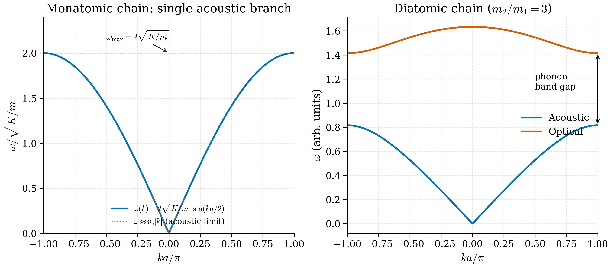

# 3b.5 — Phonons

<figure markdown>
{ width="700" }
<figcaption>Figure 3b.5.1. Phonon dispersions of the simplest 1D models. The monatomic chain (left) has a single acoustic branch with a linear (sound-like) regime near \(k=0\). The diatomic chain (right) splits this into an acoustic branch and an optical branch separated by a band gap that opens at the zone boundary when the two masses differ.</figcaption>
</figure>

!!! tip "Why do phonons exist?"
    **The puzzle in 1907:** Einstein worried that classical equipartition (each mode carrying $k_B T$ of energy) predicted a heat capacity of $3Nk_B$ at *all* temperatures — including at $T = 0$, which is absurd. Experimentally the heat capacity of diamond vanishes at low $T$. Something must be suppressing the modes. Einstein's brilliant guess: if each atom oscillates as a *quantum* harmonic oscillator with discrete energy levels, then modes with $\hbar\omega \gg k_B T$ are stuck in their ground states and contribute nothing to the heat capacity. The freezing-out of high-frequency modes at low $T$ is the universal mechanism behind the $T^3$ law.

    **The "phonon" name (Tamm, 1932):** because lattice vibrations are quantised, each mode carries energy in discrete units of $\hbar\omega$. These quanta behave like *particles* — they have a definite momentum $\hbar\mathbf k$, a definite energy $\hbar\omega(\mathbf k)$, and they can scatter off other phonons or off electrons. They look like sound-quanta, and so they were named *phonons* by analogy with photons.

    **Tap a tuning fork:** the fork rings at a single frequency — that is *one* mode of vibration. A crystal of $N$ atoms has $3N$ modes (one for each Cartesian direction of motion of each atom). The "tuning fork" is replaced by a *spectrum* of frequencies $\omega_\nu(\mathbf k)$ that depend on the wavevector $\mathbf k$ of the propagating disturbance. The whole picture of lattice dynamics — sound velocities, heat capacity, thermal conductivity, infrared absorption, neutron scattering — is built on top of this spectrum.

    **What it buys us:** an exact, quantum-mechanical description of nuclear motion that explains heat capacity, thermal expansion, sound propagation, thermal conductivity, and serves as the benchmark for all interatomic potentials (classical force fields, ab initio, machine-learned).

> *"A solid is a forest of harmonic oscillators."* — every solid state course since 1907

So far we have quantised the electrons and treated the nuclei as fixed in their crystallographic positions. This is the Born–Oppenheimer approximation, and it is excellent for most ground-state electronic structure questions. But the moment we ask anything about *thermal* properties — heat capacity, thermal expansion, sound velocity, lattice stability — we must allow the nuclei to move. The classical lattice vibrations decompose into normal modes; the quanta of those modes are *phonons*. Phonons are the bridge between electronic structure (Tier 1) and finite-temperature statistical mechanics (Ch 8), and they are the most direct benchmark for any interatomic potential, classical or machine-learned.

We build the theory in the standard pedagogical sequence: a 1D monatomic chain, then a 1D diatomic chain (which already exhibits the most important qualitative features — acoustic and optical branches), then generalise to 3D. Working code for the diatomic chain finishes the section.

!!! tip "Intuition: a forest of coupled oscillators"
    Picture a row of marbles connected by springs. At rest, the marbles sit at uniform spacing $a$. Knock one marble sideways; the spring on each side pulls it back, but also tugs the neighbours, which then tug *their* neighbours, and so on. The disturbance propagates as a *wave* through the chain. If you knock the marble gently, all marbles execute small oscillations and the system is linear (harmonic); the natural modes of oscillation are *standing waves* of the chain, characterised by a wavevector $k$ and a frequency $\omega(k)$. The function $\omega(k)$ is the *dispersion relation* — the central object of lattice dynamics.

    At long wavelengths $ka\ll 1$, neighbouring marbles move almost together; the chain looks like an elastic continuum and the dispersion is linear, $\omega \approx c_s k$ — these are *sound waves*. At the shortest wavelength $ka = \pi$, neighbouring marbles oscillate exactly out of phase, and the restoring force is maximal: this gives the highest possible frequency $\omega_\text{max}$. Beyond this lies no wave: it would just be a rephrasing of a shorter wavelength inside the same chain.

    When you put *two* species of marble in alternating positions, the chain has two natural modes per $k$: an *acoustic* mode where neighbours move in phase (the chain locally looks like an elastic medium) and an *optical* mode where neighbours move out of phase (heavy and light marble oscillate against each other, with the centre of mass nearly stationary). The optical mode has a finite frequency even at $k = 0$, because moving the two atoms in opposite directions costs energy regardless of wavelength. This is the picture of phonons in real ionic crystals like NaCl, where the alkali and halide ions are the heavy and light marbles, and the $\Gamma$-point optical mode couples to infrared light through its oscillating dipole.

## 3b.5.1 The 1D monatomic chain

Consider $N$ identical atoms of mass $m$ arranged on a line with equilibrium spacing $a$. Couple each atom to its two nearest neighbours by springs of stiffness $K$. Let $u_n(t)$ be the displacement of atom $n$ from its equilibrium position $na$. Newton's second law for atom $n$ reads

$$m\ddot u_n = K(u_{n+1} - u_n) + K(u_{n-1} - u_n) = K(u_{n+1} + u_{n-1} - 2u_n). \tag{3b.5.1}$$

!!! note "Why this step? — units sanity check"
    Both sides should be in newtons (kg m s$^{-2}$). LHS: $m\cdot$(acceleration) = kg$\cdot$m/s$^2$ = N. Good. RHS: $K\cdot$(length) where $K$ is a spring stiffness in N/m and displacements are in m. So $K\cdot u$ has units of N. Good. The equation is dimensionally consistent.

Impose periodic boundary conditions $u_{n+N} = u_n$ (Born–von Kármán again). The lattice has translational symmetry, so look for solutions of Bloch form — plane waves in *site index*:

$$u_n(t) = A\, e^{i(kna - \omega t)}, \tag{3b.5.2}$$

with $k$ taking $N$ discrete values in the BZ $-\pi/a < k \le \pi/a$.

!!! note "Why this step? — Bloch ansatz for the discrete lattice"
    The same logic as Bloch's theorem (§3b.1) applies here: lattice translations $n \to n + 1$ are a symmetry of the equations of motion, so simultaneous eigenstates of the dynamics and of translation are plane waves in the site index $n$. The continuous-time factor $e^{-i\omega t}$ separates the time dependence (the eigenvalue of the time-translation generator $i\partial_t$ is $\omega$). So the ansatz (3b.5.2) is not a guess — it is mandated by symmetry.

Substituting (3b.5.2) into (3b.5.1) and dividing through by the common exponential,

$$-m\omega^2 A = K\,A\, [e^{ika} + e^{-ika} - 2] = 2KA[\cos(ka) - 1] = -4KA\sin^2(ka/2). \tag{3b.5.3}$$

!!! note "Why this step? — useful trig identity"
    $\cos(ka) - 1 = -2\sin^2(ka/2)$ (half-angle identity). Taking the *negative* sign on the right ensures the $A$ cancels and the result is real and positive (since $\omega^2 \ge 0$). This identity is worth keeping in mind: it converts a "stiffness vs. frequency" expression with explicit minus signs into a manifestly positive $\sin^2$ form.

Solving for $\omega$,

$$\boxed{\; \omega(k) = 2\sqrt{K/m}\, \left|\sin(ka/2)\right|. \;} \tag{3b.5.4}$$

!!! example "Numerical sanity check: a typical atomic chain"
    Take $m = 50$ amu (a typical metal atom, e.g. Cu has $m_{\text{Cu}} \approx 63.5$ amu, so 50 amu is in the right ballpark), $K = 50$ N/m (a typical bond stiffness; the C–C bond in diamond has $K \approx 440$ N/m so 50 N/m is a soft bond), $a = 3.0$ Å. Then
    $$\sqrt{K/m} = \sqrt{50 / (50\cdot 1.66\times 10^{-27})} \approx 7.77\times 10^{12}\text{ rad/s},$$
    so $\omega_\text{max} = 2\sqrt{K/m} \approx 1.55\times 10^{13}$ rad/s, or $\nu_\text{max} = \omega_\text{max}/(2\pi) \approx 2.47$ THz. The sound velocity is $c_s = a\sqrt{K/m} \approx 7.77\times 10^{12}\cdot 3\times 10^{-10} \approx 2300$ m/s, comparable to the experimental sound velocity in soft metals.

This is the dispersion relation of the 1D monatomic chain. Several features merit attention.

**Long-wavelength limit ($k\to 0$).** $\sin(ka/2)\approx ka/2$ so $\omega \approx \sqrt{K/m}\cdot ka = c_s k$, where

$$c_s = a\sqrt{K/m} \tag{3b.5.5}$$

is the *sound velocity*. The chain supports sound waves with linear dispersion at long wavelengths, as it must — the elastic continuum limit of any 3D crystal also gives linear dispersion (acoustic phonons).

**Zone boundary ($k = \pi/a$).** $\omega_\text{max} = 2\sqrt{K/m}$, a hard maximum frequency. Above this, no propagating modes exist. This is the lattice analogue of a cutoff frequency in a dispersive transmission line.

**Periodicity in $k$.** $\omega(k + 2\pi/a) = \omega(k)$, so all distinct modes lie in the first BZ.

**Number of modes.** Exactly $N$ values of $k$ in the BZ, one for each atom: the number of normal modes equals the number of degrees of freedom, as it must.

**Counting:** in 3D the chain becomes a 3D crystal of $N$ atoms with $3N$ degrees of freedom; the BZ houses $N$ wavevectors, each carrying *three* phonon polarisations (one longitudinal, two transverse for an isotropic medium). The count comes out right.

### Quantisation: phonons as oscillator quanta

So far the chain is *classical*: each mode has a continuous amplitude $A$. To get phonons we quantise. The standard procedure (canonical quantisation of a collection of harmonic oscillators) replaces each normal mode by a quantum harmonic oscillator with energy levels $E_{n_k} = \hbar\omega(k)(n_k + 1/2)$, $n_k = 0, 1, 2, \ldots$. The integer $n_k$ is the *occupation number* of the mode $k$; equivalently, it is the number of phonons in that mode. A phonon is therefore a quantum of vibrational energy with crystal momentum $\hbar k$ and energy $\hbar\omega(k)$.

This step transforms the classical lattice dynamics into a quantum field theory of phonons. In thermal equilibrium the average occupation is the Bose–Einstein distribution

$$\langle n_k\rangle = \frac{1}{e^{\hbar\omega(k)/k_BT} - 1}, \tag{3b.5.\text{$q$1}}$$

because phonons are bosons (any number of phonons can occupy the same mode). This is the formula used in the heat-capacity calculations of §3b.6 and the thermal-conductivity calculations of Ch 8.

!!! note "Why this step? — phonons as identical bosons"
    Distinct phonons (different $k$) are independent quantum oscillators. Within a single mode $k$, the excitations are indistinguishable bosons (each excitation just bumps the occupation $n_k$ by one). The Bose statistics follow from the algebra of the creation/annihilation operators $a_k, a_k^\dagger$ that satisfy $[a_k, a_{k'}^\dagger] = \delta_{kk'}$ — the same algebra as for photons in QED. A useful slogan: "phonons are to lattice vibrations as photons are to electromagnetic waves." Both are massless bosonic excitations of a gauge-invariant continuum, and both obey Bose–Einstein statistics.

## 3b.5.2 The 1D diatomic chain — full derivation

Now place two distinct atoms per unit cell: atom A of mass $m_1$ at position $na$ (the cell origin), atom B of mass $m_2$ at position $na + d$ (somewhere inside the cell). Connect each A to each B inside the same cell with spring $K$, and each A to the B of the previous cell also with $K$ (we take the alternating-spring model: same stiffness, alternating bond lengths). Let $u_n$ be the displacement of A in cell $n$, and $v_n$ the displacement of B in cell $n$. The equations of motion are

$$m_1 \ddot u_n = K(v_n + v_{n-1} - 2u_n), \tag{3b.5.6}$$
$$m_2 \ddot v_n = K(u_{n+1} + u_n - 2v_n). \tag{3b.5.7}$$

Use the Bloch ansatz

$$u_n(t) = U\, e^{i(kna - \omega t)}, \qquad v_n(t) = V\, e^{i(kna - \omega t)}. \tag{3b.5.8}$$

Substituting into (3b.5.6),

$$-m_1\omega^2 U = K(V + V e^{-ika} - 2U) = K[V(1 + e^{-ika}) - 2U]. \tag{3b.5.9}$$

Substituting into (3b.5.7),

$$-m_2\omega^2 V = K(U e^{ika} + U - 2V) = K[U(1 + e^{ika}) - 2V]. \tag{3b.5.10}$$

Collect terms into a matrix equation for $(U, V)^T$:

$$\begin{pmatrix} 2K - m_1\omega^2 & -K(1 + e^{-ika}) \\ -K(1 + e^{ika}) & 2K - m_2\omega^2 \end{pmatrix}\begin{pmatrix} U \\ V\end{pmatrix} = 0. \tag{3b.5.11}$$

Nontrivial solutions require the determinant to vanish:

$$(2K - m_1\omega^2)(2K - m_2\omega^2) - K^2|1 + e^{ika}|^2 = 0. \tag{3b.5.12}$$

Use $|1 + e^{ika}|^2 = 2 + 2\cos(ka) = 4\cos^2(ka/2)$. Expand:

$$4K^2 - 2K(m_1 + m_2)\omega^2 + m_1 m_2 \omega^4 = 4K^2 \cos^2(ka/2), \tag{3b.5.13}$$

$$m_1 m_2 \omega^4 - 2K(m_1 + m_2)\omega^2 + 4K^2\sin^2(ka/2) = 0. \tag{3b.5.14}$$

This is a quadratic in $\omega^2$. Solve:

$$\boxed{\; \omega_\pm^2(k) = \frac{K(m_1 + m_2)}{m_1 m_2}\left[1 \pm \sqrt{1 - \frac{4 m_1 m_2}{(m_1 + m_2)^2}\sin^2(ka/2)}\right]. \;} \tag{3b.5.15}$$

The two branches $\omega_-$ and $\omega_+$ are the **acoustic** and **optical** phonons respectively. We inspect each.

**Acoustic branch** ($\omega_-$).
- At $k=0$: $\sin = 0$ so $\omega_- = 0$. The acoustic branch is gapless at the BZ centre.
- Near $k=0$: Taylor expand the square root: $\sqrt{1 - x} \approx 1 - x/2$ for small $x$, where $x = (4m_1m_2/(m_1+m_2)^2)\sin^2(ka/2) \approx (4m_1m_2/(m_1+m_2)^2)\cdot(ka/2)^2$. So
$$\omega_-^2 \approx \frac{K(m_1+m_2)}{m_1m_2}\cdot \frac{1}{2}\cdot\frac{4m_1m_2}{(m_1+m_2)^2}\cdot\frac{(ka)^2}{4} = \frac{K\,(ka)^2}{2(m_1+m_2)},$$
giving $\omega_- \approx ka\sqrt{K/[2(m_1 + m_2)]}$ — a linear, gapless dispersion with sound speed $c_s = a\sqrt{K/[2(m_1 + m_2)]}$. The two atoms move *in phase*: $U \approx V$.
- At $k = \pi/a$ (zone boundary): $\sin^2(ka/2) = 1$ so $\omega_-^2 = 2K/\max(m_1, m_2)$ — depends on the *heavier* mass.

**Optical branch** ($\omega_+$).
- At $k=0$: $\omega_+^2 = 2K(m_1 + m_2)/(m_1 m_2) = 2K/\mu$, where $\mu = m_1 m_2/(m_1+m_2)$ is the reduced mass. The optical branch has a *finite* frequency at $\mathbf k = 0$. The atoms move *out of phase*: $m_1 U = -m_2 V$, i.e. the centre of mass is at rest while the two atoms oscillate against each other. This is the physical reason optical phonons in ionic crystals couple to light: they create an oscillating electric dipole.
- At $k = \pi/a$: $\omega_+^2 = 2K/\min(m_1, m_2)$ — depends on the *lighter* mass.

**Eigenvector identification at $k=0$.** Let us be explicit about who moves how. At $k=0$, the matrix (3b.5.11) becomes
$$\begin{pmatrix} 2K - m_1\omega^2 & -2K \\ -2K & 2K - m_2\omega^2\end{pmatrix}\begin{pmatrix} U\\ V\end{pmatrix} = 0.$$
The two solutions are:

- **Acoustic ($\omega = 0$):** Setting $\omega = 0$ gives $2KU = 2KV$, so $U = V$. Both atoms move *together*, in phase, with equal amplitude. This is a uniform translation of the entire crystal — and a uniform translation must have zero restoring force, hence zero frequency. (It is a Goldstone mode of continuous translational symmetry.)

- **Optical ($\omega^2 = 2K/\mu$):** Plug into the first equation: $(2K - m_1\cdot 2K/\mu) U = 2KV$, i.e. $(\mu - m_1)/\mu \cdot U = V$. Use $\mu = m_1 m_2/(m_1+m_2)$: $(\mu - m_1)/\mu = -m_1/m_2$. So $V = -m_1 U/m_2$, equivalently $m_1 U + m_2 V = 0$. The two atoms move with opposite signs and amplitudes inversely proportional to their masses: the *centre of mass is exactly stationary*. The lighter atom oscillates more vigorously. In an ionic crystal where $m_1$ has charge $+e$ and $m_2$ has charge $-e$, this anti-phase oscillation creates a *time-varying electric dipole*, which couples to electromagnetic waves at frequency $\omega = \sqrt{2K/\mu}$ — that is why this branch is called *optical*.

**Gap at the zone boundary.** Between the top of the acoustic branch and the bottom of the optical branch there is a gap whose size is set by the mass difference:

$$\omega_+^2(\pi/a) - \omega_-^2(\pi/a) = 2K\left[\frac{1}{m_1} - \frac{1}{m_2}\right] \quad (m_2 > m_1). \tag{3b.5.16}$$

If $m_1 = m_2$ the gap closes and the two branches join — the diatomic chain *with equal masses* is just a monatomic chain with half the lattice constant, and the optical branch is the *backfold* of the upper half of the original acoustic branch.

!!! example "Numerical sanity check: NaCl-like diatomic chain"
    Take $m_1 = 23$ amu (Na), $m_2 = 35.5$ amu (Cl), $K = 30$ N/m (a typical ionic bond stiffness), $a = 2.82$ Å (Na-Cl bond length). Reduced mass: $\mu = 23\cdot 35.5/(23+35.5) \approx 13.95$ amu $= 2.317\times 10^{-26}$ kg. Optical $\Gamma$ frequency:
    $$\omega_+(\Gamma) = \sqrt{2K/\mu} = \sqrt{2\cdot 30 / 2.317\times 10^{-26}} \approx 5.09\times 10^{13}\text{ rad/s}.$$
    Equivalent: $\nu_+(\Gamma) \approx 8.1$ THz, or in wavenumbers, $\tilde\nu \approx 270$ cm$^{-1}$ — comparable to the experimental TO mode of NaCl at $\sim 164$ cm$^{-1}$. The factor of two discrepancy reflects the simple harmonic-spring model; including longer-range Coulomb interactions (LO-TO splitting) gives much better agreement.

    Sound velocity:
    $$c_s = a\sqrt{K/[2(m_1+m_2)]} = 2.82\times 10^{-10}\cdot\sqrt{30/(2\cdot 9.71\times 10^{-26})} \approx 3500\text{ m/s},$$
    close to the experimental longitudinal sound velocity in NaCl (~4500 m/s; the factor of ~1.3 discrepancy is again from neglecting longer-range elastic terms).

## 3b.5.3 3D phonons: the dynamical matrix

In a 3D crystal with $N_\text{at}$ atoms per unit cell, the displacement of atom $a$ in cell $\mathbf R$ along Cartesian direction $\alpha$ is $u_\alpha^a(\mathbf R, t)$. The harmonic potential energy is

$$V = \frac{1}{2}\sum_{\mathbf R \mathbf R'}\sum_{ab}\sum_{\alpha\beta} \Phi_{\alpha\beta}^{ab}(\mathbf R - \mathbf R')\, u_\alpha^a(\mathbf R)\, u_\beta^b(\mathbf R'), \tag{3b.5.17}$$

with $\Phi_{\alpha\beta}^{ab}(\mathbf R)$ the **force constant matrix** — the second derivative of the Born–Oppenheimer energy with respect to atomic displacements, evaluated at equilibrium:

$$\Phi_{\alpha\beta}^{ab}(\mathbf R - \mathbf R') = \frac{\partial^2 E_\text{BO}}{\partial u_\alpha^a(\mathbf R)\, \partial u_\beta^b(\mathbf R')}\bigg|_\text{eq}. \tag{3b.5.18}$$

By translational symmetry, $\Phi$ depends only on $\mathbf R - \mathbf R'$. The equations of motion are

$$m_a \ddot u_\alpha^a(\mathbf R) = -\sum_{\mathbf R' b\beta} \Phi_{\alpha\beta}^{ab}(\mathbf R - \mathbf R') u_\beta^b(\mathbf R'). \tag{3b.5.19}$$

Use the Bloch ansatz $u_\alpha^a(\mathbf R, t) = \epsilon_\alpha^a\, e^{i(\mathbf k\cdot\mathbf R - \omega t)}/\sqrt{m_a}$ (the mass-weighted normalisation is conventional). Substitution gives the eigenvalue problem

$$\omega^2\, \epsilon_\alpha^a = \sum_{b\beta} D_{\alpha\beta}^{ab}(\mathbf k)\, \epsilon_\beta^b, \tag{3b.5.20}$$

with the **dynamical matrix**

$$\boxed{\; D_{\alpha\beta}^{ab}(\mathbf k) = \frac{1}{\sqrt{m_a m_b}} \sum_\mathbf R \Phi_{\alpha\beta}^{ab}(\mathbf R)\, e^{i\mathbf k\cdot\mathbf R}. \;} \tag{3b.5.21}$$

$D(\mathbf k)$ is a $3N_\text{at}\times 3N_\text{at}$ Hermitian matrix. Its eigenvalues are $\omega_\nu^2(\mathbf k)$ — there are $3N_\text{at}$ phonon branches at each $\mathbf k$. Of these, three are acoustic (gapless at $\mathbf k = 0$) and $3N_\text{at} - 3$ are optical. The eigenvectors $\boldsymbol\epsilon_\nu(\mathbf k)$ are the **polarisation vectors**, telling you the relative motion of the atoms in each mode.

!!! note "Why is the dynamical matrix $3N_\text{at}\times 3N_\text{at}$?"
    Each atom in the unit cell has three Cartesian degrees of freedom — three directions in which it can be displaced. For $N_\text{at}$ atoms per cell, that is $3 N_\text{at}$ degrees of freedom *per unit cell*. The dynamical matrix mixes these via the Fourier-transformed force constants. The Bloch label $\mathbf k$ reduces an infinite-dimensional problem (infinitely many cells) to a $3N_\text{at}\times 3N_\text{at}$ matrix problem at each $\mathbf k$, exactly as Bloch's theorem reduces the electronic problem to a unit-cell problem at each $\mathbf k$.

    Counting modes: $3N_\text{at}$ branches at each of $N$ wavevectors in the BZ gives $3N\cdot N_\text{at}$ total modes — equal to three times the total number of atoms in the crystal, which is the total number of mechanical degrees of freedom. The bookkeeping checks out.

    For NaCl ($N_\text{at} = 2$): six branches, three acoustic + three optical. For diamond ($N_\text{at} = 2$): same. For graphene ($N_\text{at} = 2$): six branches; three acoustic (LA, TA, ZA where ZA is the flexural out-of-plane mode) + three optical (LO, TO, ZO). For complex oxides like perovskite SrTiO$_3$ ($N_\text{at} = 5$): fifteen branches.

The dynamical matrix is a Fourier transform of the force-constant matrix. In practice $\Phi(\mathbf R)$ has short range — it decays rapidly with $|\mathbf R|$ — so only a few neighbour shells of $\Phi$ need be stored. This is why phonon calculations are tractable: a $3N_\text{at}\times 3N_\text{at}$ matrix at each $\mathbf k$.

**Extracting phonon dispersion paths.** To plot a phonon dispersion you do exactly what you do for an electronic band structure: pick a path in the BZ through high-symmetry points (e.g. $\Gamma$–X–L–$\Gamma$ for FCC, or $\Gamma$–K–M–$\Gamma$ for a 2D hexagonal lattice), discretise it into a sequence of $\mathbf k$ values, construct $D(\mathbf k)$ at each, diagonalise, and plot the $3N_\text{at}$ eigenfrequencies as a function of path length. The output is a graph with $3N_\text{at}$ curves, the lowest three of which start linearly from zero at $\Gamma$ (the acoustic branches with slopes equal to the three independent sound velocities of the crystal), the rest with finite frequencies at $\Gamma$. The phonopy and DFPT workflows mentioned below automate all of this.

### Phonon polarisation vectors and longitudinal vs transverse modes

In 3D, at any given $\mathbf k$, the $3 N_\text{at}$ eigenvectors $\boldsymbol\epsilon_\nu(\mathbf k)$ of $D(\mathbf k)$ specify the *direction* and *relative amplitude* of atomic motion in each mode. For an isotropic medium the modes can be classified as:

- **Longitudinal (LA, LO):** Atomic displacement parallel to $\mathbf k$. These modes have the larger restoring force in a simple cubic lattice (compression of bonds along the propagation direction) and therefore higher frequencies than the transverse modes at the same $|\mathbf k|$.
- **Transverse (TA, TO):** Atomic displacement perpendicular to $\mathbf k$ — two degenerate modes (a doublet) in an isotropic medium, split when the crystal has anisotropy.

For a 3D crystal with $N_\text{at}$ atoms per cell, the total $3N_\text{at}$ modes split as: 3 acoustic (one LA, two TA) + $3(N_\text{at}-1)$ optical (split into LO and TO subfamilies, with possible additional anisotropy splittings). For NaCl with $N_\text{at}=2$, this gives 3 acoustic + 3 optical = 6 modes. For graphene with $N_\text{at}=2$, the in-plane LA and TA modes have linear dispersion, but the out-of-plane "ZA" (flexural) mode has *quadratic* dispersion at small $\mathbf k$ — a peculiarity of 2D crystals with bending stiffness.

!!! note "LO-TO splitting in ionic crystals"
    In a polar (ionic) crystal at $\mathbf k = 0$, the longitudinal optical (LO) and transverse optical (TO) modes are not degenerate. The reason is that LO modes create a macroscopic electric polarisation parallel to $\mathbf k$, which couples to a long-range electrostatic restoring force. The TO modes do not. The resulting splitting is given by the *Lyddane-Sachs-Teller relation*:
    $$\frac{\omega_{LO}^2}{\omega_{TO}^2} = \frac{\epsilon_0^\text{static}}{\epsilon_\infty}.$$
    For NaCl, $\epsilon_0^\text{static} \approx 5.9$, $\epsilon_\infty \approx 2.3$, giving $\omega_{LO}/\omega_{TO} \approx 1.6$. Capturing this in a DFT phonon calculation requires non-analytic corrections at $\mathbf k = 0$, which both phonopy and DFPT codes handle automatically through the Born effective charges and the electronic dielectric tensor.

## 3b.5.4 Force constants from DFT

How do you actually compute $\Phi$? Two ingredients.

**Finite differences.** Displace one atom in a *supercell* by a small amount $\Delta u$, run a self-consistent DFT calculation, read off the forces on every other atom. Each pair of (displacement, force) entries gives one column of the force-constant matrix. Repeat for all symmetry-inequivalent displacements. The python package `phonopy` automates this entire workflow, taking a primitive-cell DFT calculation and producing the full $\Phi(\mathbf R)$, the dynamical matrix at any $\mathbf k$, and the resulting phonon dispersion. This is the workhorse method.

**Density-functional perturbation theory (DFPT).** Compute $\Phi(\mathbf q)$ at any wavevector $\mathbf q$ directly by linear response, without ever building a supercell. This is faster than finite differences and is built into Quantum ESPRESSO (`ph.x`) and ABINIT.

You will use phonopy in Chapter 6 to compute the phonon spectrum of a real material and check that all frequencies are real — imaginary $\omega^2$ indicates a structural instability, and is the first-line tool for detecting that you have not in fact found the ground state structure.

### Worked dynamical-matrix example: monatomic FCC

To make the $3N_\text{at}\times 3N_\text{at}$ structure concrete, here is the simplest 3D case: a monatomic FCC crystal with nearest-neighbour spring couplings. Each atom has $N_\text{at} = 1$, so the dynamical matrix is $3\times 3$. The 12 nearest-neighbour vectors of an FCC lattice (with conventional lattice constant $a$) are

$$\mathbf R_{NN} = \frac{a}{2}(\pm 1, \pm 1, 0), \quad \frac{a}{2}(\pm 1, 0, \pm 1), \quad \frac{a}{2}(0, \pm 1, \pm 1),$$

twelve in total. With a longitudinal spring stiffness $K_\parallel$ and transverse $K_\perp$ between an atom and each NN, the force constant tensor for one such bond is (in the local frame where the bond is along $\hat x$)

$$\Phi_\text{bond} = \begin{pmatrix} K_\parallel & 0 & 0 \\ 0 & K_\perp & 0 \\ 0 & 0 & K_\perp\end{pmatrix},$$

rotated appropriately to the global frame for each of the 12 directions. Summing over neighbours and Fourier-transforming gives the $3\times 3$ dynamical matrix $D(\mathbf k)$, whose three eigenvalues at each $\mathbf k$ are $\omega_\nu^2(\mathbf k)$ for the three branches (one LA + two TA in the isotropic limit).

At $\Gamma$, $D(\Gamma) = 0$ identically (the sum of $\Phi$'s yields no net coupling — translation invariance). At the X point $\mathbf k_X = (2\pi/a, 0, 0)$, the cosines combine to give $D_{xx}(X) = 8 K_\parallel/m$, $D_{yy}(X) = D_{zz}(X) = 4(K_\parallel + K_\perp)/m$. The LA branch sits at $\omega_X^{LA} = 2\sqrt{2K_\parallel/m}$, the TA branch at $\omega_X^{TA} = 2\sqrt{(K_\parallel + K_\perp)/m}$. Both are real (i.e. $\omega^2 > 0$) so long as $K_\parallel, K_\perp > 0$. An imaginary eigenfrequency at any $\mathbf k$ would indicate that the crystal is *dynamically unstable* — a powerful diagnostic discussed in §3b.5.4.

## 3b.5.5 Python: phonon dispersion of a 1D diatomic chain

The following code builds the dynamical matrix (3b.5.11) for the 1D diatomic chain at 200 wavevectors and plots both branches.

```python
"""Phonon dispersion of a 1D diatomic chain.

Builds the dynamical matrix from analytical expressions, diagonalises
at 200 k-points, and plots acoustic + optical branches.
"""
from __future__ import annotations
import numpy as np
import numpy.typing as npt
import matplotlib.pyplot as plt

# Parameters (arbitrary units)
M1: float = 1.0      # mass of atom A
M2: float = 3.0      # mass of atom B (heavier)
K_SPRING: float = 1.0  # spring constant
A_LATT: float = 1.0    # lattice constant of the diatomic cell

def dynamical_matrix(k: float) -> npt.NDArray[np.complex128]:
    """Return the 2x2 dynamical matrix at wavevector k.

    Constructed by reading off Eq. (3b.5.11) and dividing by sqrt(m_a m_b).
    """
    D: npt.NDArray[np.complex128] = np.zeros((2, 2), dtype=np.complex128)
    D[0, 0] = (2 * K_SPRING) / M1
    D[1, 1] = (2 * K_SPRING) / M2
    coupling: complex = -K_SPRING * (1.0 + np.exp(-1j * k * A_LATT))
    D[0, 1] = coupling / np.sqrt(M1 * M2)
    D[1, 0] = np.conj(D[0, 1])
    return D

def phonon_frequencies(k: float) -> npt.NDArray[np.float64]:
    """Diagonalise the dynamical matrix; return sqrt of (real) eigenvalues."""
    eigs_omega2: npt.NDArray[np.float64] = np.linalg.eigvalsh(dynamical_matrix(k))
    # Clip tiny negatives from round-off
    eigs_clip: npt.NDArray[np.float64] = np.clip(eigs_omega2, a_min=0.0, a_max=None)
    return np.sqrt(eigs_clip)

def analytical_branches(k: npt.NDArray[np.float64]) -> tuple[npt.NDArray[np.float64], npt.NDArray[np.float64]]:
    """Closed-form Eq. (3b.5.15) for cross-checking."""
    pref: float = K_SPRING * (M1 + M2) / (M1 * M2)
    discr: npt.NDArray[np.float64] = 1.0 - (4 * M1 * M2 / (M1 + M2) ** 2) * np.sin(k * A_LATT / 2) ** 2
    omega_minus: npt.NDArray[np.float64] = np.sqrt(pref * (1.0 - np.sqrt(discr)))
    omega_plus: npt.NDArray[np.float64] = np.sqrt(pref * (1.0 + np.sqrt(discr)))
    return omega_minus, omega_plus

def main() -> None:
    n_k: int = 200
    k_vals: npt.NDArray[np.float64] = np.linspace(-np.pi / A_LATT, np.pi / A_LATT, n_k)
    omega_numeric: npt.NDArray[np.float64] = np.array(
        [phonon_frequencies(float(k)) for k in k_vals]
    )  # shape (n_k, 2)
    omega_minus, omega_plus = analytical_branches(k_vals)

    # Sanity check
    err_acoustic: float = float(np.max(np.abs(omega_numeric[:, 0] - omega_minus)))
    err_optical: float = float(np.max(np.abs(omega_numeric[:, 1] - omega_plus)))
    print(f"Max |numerical - analytical| acoustic = {err_acoustic:.2e}")
    print(f"Max |numerical - analytical| optical  = {err_optical:.2e}")

    fig, ax = plt.subplots(figsize=(7, 5))
    ax.plot(k_vals * A_LATT / np.pi, omega_numeric[:, 0],
            color="C0", lw=2, label="acoustic (numerical)")
    ax.plot(k_vals * A_LATT / np.pi, omega_numeric[:, 1],
            color="C3", lw=2, label="optical (numerical)")
    ax.plot(k_vals * A_LATT / np.pi, omega_minus,
            color="C0", lw=0, marker=".", markersize=2, label="acoustic (Eq. 3b.5.15)")
    ax.plot(k_vals * A_LATT / np.pi, omega_plus,
            color="C3", lw=0, marker=".", markersize=2, label="optical (Eq. 3b.5.15)")
    ax.axvline(-1.0, color="grey", lw=0.5, linestyle=":")
    ax.axvline(1.0, color="grey", lw=0.5, linestyle=":")
    ax.set_xlabel(r"$k\, a/\pi$")
    ax.set_ylabel(r"$\omega$ (arb. units)")
    ax.set_title(
        f"Diatomic chain phonons (m1={M1}, m2={M2}, K={K_SPRING})"
    )
    ax.legend()
    plt.tight_layout()
    plt.savefig("diatomic_phonons.pdf")
    plt.show()

if __name__ == "__main__":
    main()
```

You should see an acoustic branch vanishing linearly at $k=0$, an optical branch starting at $\omega_+(0) = \sqrt{2K/\mu} \approx \sqrt{2 \cdot 1 / 0.75} \approx 1.633$, and a clear gap at the BZ boundary $k = \pi/a$ of size $\omega_+^2 - \omega_-^2 = 2K(1/m_1 - 1/m_2) = 2(1 - 1/3) = 4/3$. The numerical and analytical results agree to round-off.

### Phonon density of states

Just as for electrons (§3b.4), the phonon density of states (DOS) is

$$g(\omega) = \sum_\nu \int_\text{BZ} \frac{d^3 k}{(2\pi)^3}\, \delta(\omega - \omega_\nu(\mathbf k)). \tag{3b.5.\text{$d$1}}$$

It counts modes by frequency. The phonon DOS controls all thermodynamic properties — internal energy, free energy, entropy, heat capacity — through integrals like

$$\langle E\rangle_\text{th} = \int_0^\infty g(\omega)\, \frac{\hbar\omega}{e^{\hbar\omega/k_B T}-1}\, d\omega.$$

For a 3D crystal at low frequencies, only the three acoustic branches contribute, and (assuming an isotropic sound velocity $c_s$) the DOS is

$$g(\omega) \approx \frac{3 V}{2\pi^2 c_s^3}\, \omega^2 \quad (\omega \ll \omega_\text{max}). \tag{3b.5.\text{$d$2}}$$

This $\omega^2$ scaling is the lattice analogue of the electronic $\sqrt{\varepsilon}$ DOS at the bottom of a 3D free-electron band, and it is the input to the Debye model of §3b.6. For 2D crystals the low-frequency DOS scales as $\omega$ (one factor lower because the BZ is 2D); for 1D as a constant. This dimensionality dependence again controls the low-$T$ heat capacity scaling: $C_v \propto T^d$ for $d$-dimensional acoustic-dominated systems.

## 3b.5.6 Connection to molecular dynamics

In Chapter 7 you will run classical molecular dynamics (MD): integrate Newton's equations for $N$ atoms in a thermostat, generating a trajectory. The atoms vibrate around their equilibrium positions; the time series of atomic positions contains all the lattice-dynamical information of the crystal. Specifically:

1. **Mean-square displacement** of an atom is set by the Bose–Einstein average of $|\boldsymbol\epsilon|^2 / \omega$, summed over modes. In the classical limit ($k_B T \gg \hbar\omega$) this becomes $\langle u^2\rangle = k_B T/(m\omega^2)$ — the equipartition theorem applied to harmonic oscillators.

2. **Velocity autocorrelation function** $C(t) = \langle \mathbf v(0)\cdot\mathbf v(t)\rangle$ is, by the Wiener–Khinchin theorem, the Fourier transform of the *phonon density of states*. So you can extract the phonon DOS from any sufficiently long MD trajectory — a method called the velocity autocorrelation method, or sometimes (in jargon) "thermostat phonons".

3. **Validity of classical MD.** The catch in (1) — that the classical formula assumes $k_B T \gg \hbar\omega$ — is the central restriction on MD. In hydrogen-containing solids, the high-frequency O–H stretches have $\hbar\omega/k_B \sim 4000$ K, far above room temperature. Classical MD therefore *over-populates* these modes and gets the heat capacity too high by a factor of three at low temperatures: equipartition gives $3Nk_B$ instead of the experimental $T^3$ falloff. This is the Einstein/Debye problem of the next section, viewed from the MD side.

In other words: classical MD *is* lattice dynamics, but in the classical limit. Phonons quantise the same physics. They are two views of the same picture.

!!! note "Phonons and MLIPs"
    A machine-learning interatomic potential must reproduce, at minimum, the phonon dispersion of the training material. The reason is that vibrational free energies (Ch 8), thermal expansion, sound velocities, and Raman/infrared spectra all depend on $\omega_\nu(\mathbf k)$. The standard benchmark of an MLIP — used in every Ch 9 paper — is the per-mode phonon error: RMSE in THz between MLIP and DFT, computed at a dense $\mathbf k$-grid in the BZ. State of the art models (MACE, NequIP) routinely achieve $\le 0.2$ THz across all branches.

## 3b.5.7 Section summary

!!! abstract "Key ideas"
    1. **Phonons = quanta of lattice vibrations.** Each normal mode of a harmonic crystal is a quantum harmonic oscillator with energy $\hbar\omega(\mathbf k)$ per quantum. Crystal momentum $\hbar\mathbf k$ is conserved modulo $\hbar\mathbf G$.
    2. **1D monatomic chain.** Dispersion $\omega(k) = 2\sqrt{K/m}\,|\sin(ka/2)|$. Linear (sound-like) at $k\to 0$, maximum $2\sqrt{K/m}$ at zone boundary.
    3. **1D diatomic chain.** Two branches: acoustic ($\omega\to 0$ at $k=0$, in-phase atomic motion, sound waves) and optical ($\omega(0) = \sqrt{2K/\mu}$, anti-phase motion, infrared-active in ionic crystals).
    4. **3D dynamical matrix.** $D(\mathbf k)$ is a $3N_\text{at}\times 3N_\text{at}$ Hermitian matrix; eigenvalues give $\omega^2_\nu(\mathbf k)$, eigenvectors give polarisation vectors. Three acoustic branches + $3(N_\text{at}-1)$ optical.
    5. **DFT phonons.** Force constants from finite differences (phonopy) or DFPT (Quantum ESPRESSO). Imaginary frequencies $\Rightarrow$ dynamical instability $\Rightarrow$ structure relaxation required.
    6. **Connection to MD.** Classical MD = lattice dynamics in the classical limit ($k_B T \gg \hbar\omega$). Velocity autocorrelation function $\leftrightarrow$ phonon DOS by Wiener-Khinchin.

What to remember three months from now: *"A crystal of $N$ atoms has $3N$ vibrational modes; their frequency spectrum $\omega_\nu(\mathbf k)$ determines all thermal and elastic properties; the spectrum is computed from the dynamical matrix, a $3N_\text{at}\times 3N_\text{at}$ Hermitian Fourier transform of the harmonic force constants."*

## Where this is used later

- **Tier 1.** §6.6 (running phonon calculations with phonopy and DFPT), §7.2 (molecular dynamics as classical lattice dynamics in disguise), §7.5 (interatomic potentials must reproduce the lowest few moments of the phonon DOS).
- **Tier 2.** §8.2 (vibrational free energy from phonon DOS, Helmholtz free energy at finite temperature), §8.4 (thermal expansion via Grüneisen parameters), §9.7 (phonon benchmarks for MLIPs), §10.6 (equivariant features and the connection to phonon polarisation vectors).
- **Capstone Project 2.** Computing thermal conductivity in a thermoelectric: the Boltzmann transport equation for phonons takes $\omega_\nu(\mathbf k)$ as input.

Next, §3b.6, where we feed the phonon spectrum into a statistical mechanics machine and recover the specific heat — Einstein for room-temperature intuition, Debye for the low-temperature truth.
