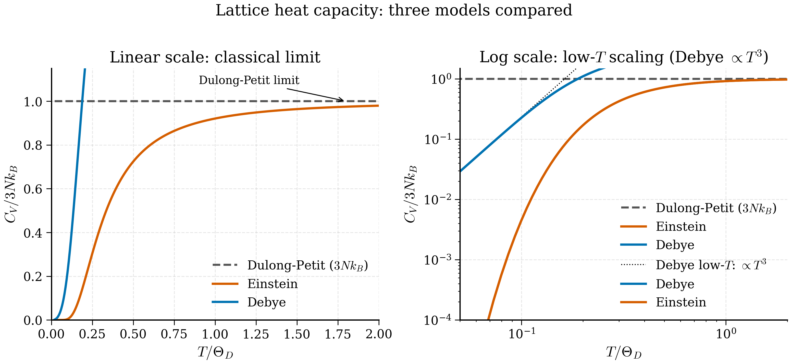

# 3b.6 — Specific Heat: Einstein and Debye

<figure markdown>
{ width="700" }
<figcaption>Figure 3b.6.1. Lattice heat capacity in three classic models. All converge to the Dulong–Petit classical limit \(3 N k_B\) at high temperature, but the Einstein model decays exponentially at low \(T\) (wrong) while the Debye model gives the correct \(T^3\) scaling.</figcaption>
</figure>

> *"Three peas in a pod; classical, Einstein, and Debye."* — paraphrased from any sophomore thermodynamics text

The heat capacity of a solid is the most basic finite-temperature observable, and historically it was the first piece of evidence that *something quantum* was happening in solids. Dulong–Petit (1819) predicted a temperature-independent molar heat capacity $C_v = 3R$ — a beautiful consequence of equipartition. By the late 1800s it was clear that $C_v$ in fact *vanishes* as $T\to 0$, and that the experimental scaling $C_v \propto T^3$ for non-magnetic insulators could not be reconciled with any classical theory.

Einstein (1907) and Debye (1912) provided the resolution by quantising the lattice vibrations. The Einstein model is the simplest possible: a single oscillator frequency per atom. The Debye model adds the crucial ingredient of a *distribution* of frequencies with linear dispersion at small $k$ — and reproduces the $T^3$ law. Both are special cases of the phonon framework of §3b.5, and they remain the simplest tractable approximations for any practical estimate of vibrational free energies in Chapter 8.

## 3b.6.1 Classical baseline: Dulong–Petit

Consider $N$ atoms, each oscillating in 3D about its equilibrium position. In the harmonic approximation, each atom contributes three independent harmonic oscillators. By the classical equipartition theorem, each quadratic degree of freedom in the Hamiltonian carries $\tfrac12 k_B T$ of mean energy. A harmonic oscillator has *two* quadratic degrees of freedom (kinetic + potential), so

$$\langle E\rangle_\text{classical} = 3N \cdot 2 \cdot \tfrac12 k_B T = 3 N k_B T. \tag{3b.6.1}$$

Differentiating with respect to $T$,

$$C_v^\text{Dulong} = \frac{\partial \langle E\rangle}{\partial T} = 3 N k_B \quad \Longrightarrow \quad C_v^\text{molar} = 3R \approx 24.94 \text{ J K}^{-1}\text{mol}^{-1}. \tag{3b.6.2}$$

Empirically this holds at high temperatures (room temperature is "high" for most metals), to within a few percent. At low temperatures, however, $C_v$ measurably drops far below $3R$ and tends to zero. Equipartition fails. The reason is that *quantum mechanics suppresses the population of high-frequency modes whose excitation energies are large compared to $k_B T$*. Mode by mode this is the harmonic-oscillator energy from Chapter 4. We need to put it back into the sum over modes.

## 3b.6.2 Einstein model

Einstein's idea: assume every atom is an independent harmonic oscillator of the *same* frequency $\omega_E$, in three dimensions. The total energy of $N$ atoms (i.e. $3N$ oscillators) at temperature $T$ is

$$\langle E\rangle = 3N \cdot \langle E\rangle_\text{1 osc}(\omega_E, T). \tag{3b.6.3}$$

The mean energy of a single quantum harmonic oscillator at temperature $T$ is

$$\langle E\rangle_\text{1 osc}(\omega, T) = \hbar\omega\left[\frac{1}{2} + \frac{1}{e^{\hbar\omega/k_B T} - 1}\right]. \tag{3b.6.4}$$

(The zero-point contribution $\hbar\omega/2$ does not depend on $T$ and drops out of $C_v$.) Differentiating with respect to $T$,

$$C_v(\omega, T) = k_B \left(\frac{\hbar\omega}{k_B T}\right)^2\, \frac{e^{\hbar\omega/k_B T}}{(e^{\hbar\omega/k_B T} - 1)^2}. \tag{3b.6.5}$$

Summing over all $3N$ oscillators,

$$\boxed{\; C_v^\text{Einstein}(T) = 3 N k_B \left(\frac{\hbar\omega_E}{k_B T}\right)^2 \frac{e^{\hbar\omega_E/k_B T}}{(e^{\hbar\omega_E/k_B T} - 1)^2}. \;} \tag{3b.6.6}$$

Define the **Einstein temperature** $\Theta_E := \hbar\omega_E/k_B$. The high- and low-$T$ limits:

**High $T$ ($T\gg \Theta_E$).** $e^x \approx 1 + x$, so $(e^x - 1)^2 \approx x^2$ and $e^x \approx 1$. Substituting,

$$C_v \to 3Nk_B \cdot x^2 \cdot 1/x^2 = 3Nk_B, \tag{3b.6.7}$$

recovering Dulong–Petit. Good.

**Low $T$ ($T\ll \Theta_E$).** The dominant factor is $(e^{\Theta_E/T})$ in the numerator divided by $(e^{\Theta_E/T})^2$ in the denominator, giving $e^{-\Theta_E/T}$, multiplied by $(\Theta_E/T)^2$. So

$$C_v \to 3 N k_B \left(\frac{\Theta_E}{T}\right)^2 e^{-\Theta_E/T}. \tag{3b.6.8}$$

The Einstein heat capacity drops *exponentially* with $1/T$. Experimentally, however, $C_v\propto T^3$ in real insulators, which is a *power-law* falloff, vastly slower than exponential. Einstein's model decays much too fast.

The reason for the discrepancy is physically obvious in retrospect. By collapsing all modes to a single frequency $\omega_E$, Einstein excised the existence of arbitrarily low-frequency modes — long-wavelength acoustic phonons with $\omega\to 0$ as $k\to 0$. These low-frequency modes are *always* populated, even at very low $T$, and their contribution falls off only as a power of $T$. To capture them you need a distribution of frequencies extending all the way down to zero. That distribution is what Debye supplied.

!!! note "When the Einstein model is still useful"
    For *optical* phonon branches — high-frequency modes with weak dispersion — the Einstein model is a fine approximation. In a real solid you might use Debye for the acoustic branches and Einstein for each optical branch, with separate $\Theta_E$ values. This composite approximation is good enough for back-of-envelope free-energy estimates in Chapter 8.

## 3b.6.3 Debye model

Debye's idea: replace the actual phonon spectrum with an *isotropic* one with strictly linear dispersion $\omega(\mathbf k) = c_s |\mathbf k|$, valid up to a cutoff wavevector $k_D$ chosen so that the total number of modes is correct. There are three acoustic branches (the longitudinal and two transverse), and we (Debye, originally) average their sound velocities into a single $c_s$.

The total number of modes in a crystal of $N$ atoms is $3N$. In the Debye model the number of mode in a sphere of radius $k_D$ is

$$3 \cdot \frac{V}{(2\pi)^3}\cdot\frac{4\pi}{3} k_D^3 = 3N, \tag{3b.6.9}$$

giving

$$k_D = (6\pi^2 n)^{1/3}, \quad n = N/V. \tag{3b.6.10}$$

The **Debye frequency** and **Debye temperature** are

$$\omega_D = c_s k_D, \qquad \Theta_D := \hbar\omega_D / k_B. \tag{3b.6.11}$$

The phonon density of states in the Debye model is, by direct calculation analogous to (3b.4.10),

$$g(\omega) = \frac{3 V}{2\pi^2 c_s^3}\, \omega^2 \qquad (\omega \le \omega_D), \qquad g(\omega) = 0 \quad (\omega > \omega_D). \tag{3b.6.12}$$

Verify normalisation: $\int_0^{\omega_D} g(\omega) d\omega = V\omega_D^3/(2\pi^2 c_s^3) = V k_D^3/(2\pi^2) = 3N$. Good.

The total vibrational energy at temperature $T$ is

$$\langle E\rangle = \int_0^{\omega_D} g(\omega) \cdot \hbar\omega \left[\frac{1}{2} + \frac{1}{e^{\hbar\omega/k_B T} - 1}\right]\, d\omega. \tag{3b.6.13}$$

Drop the zero-point part (constant in $T$). Substitute $x = \hbar\omega/k_B T$, $x_D = \hbar\omega_D/k_B T = \Theta_D/T$:

$$\langle E\rangle - E_\text{zp} = \frac{3V}{2\pi^2 c_s^3}\cdot\frac{(k_B T)^4}{\hbar^3}\int_0^{x_D}\frac{x^3}{e^x - 1}\, dx. \tag{3b.6.14}$$

Using $V/(c_s^3) = 6\pi^2 N/\omega_D^3$ via (3b.6.10) and (3b.6.11),

$$\langle E\rangle - E_\text{zp} = 9 N k_B T \left(\frac{T}{\Theta_D}\right)^3 \int_0^{\Theta_D/T} \frac{x^3}{e^x - 1}\, dx. \tag{3b.6.15}$$

Differentiating with respect to $T$, after some standard manipulations (differentiate the upper limit of the integral, then split — see exercises),

$$\boxed{\; C_v^\text{Debye}(T) = 9 N k_B \left(\frac{T}{\Theta_D}\right)^3 \int_0^{\Theta_D/T} \frac{x^4 e^x}{(e^x - 1)^2}\, dx. \;} \tag{3b.6.16}$$

This is the **Debye formula**. The integral cannot be evaluated in closed form but is easily computed numerically.

**High $T$ ($T\gg \Theta_D$).** Then $\Theta_D/T \ll 1$ so the integration range is small and the integrand $\approx x^4/(x)^2 \cdot 1 = x^2$ (using $e^x - 1 \approx x$). The integral $\approx (\Theta_D/T)^3/3$. So

$$C_v^\text{Debye} \to 9 N k_B (T/\Theta_D)^3 \cdot (\Theta_D/T)^3/3 = 3 N k_B, \tag{3b.6.17}$$

Dulong–Petit, as required.

**Low $T$ ($T\ll \Theta_D$).** Then $\Theta_D/T \gg 1$ and we extend the upper limit to infinity. The integral becomes the dimensionless number

$$\int_0^\infty \frac{x^4 e^x}{(e^x - 1)^2}\, dx = \frac{4\pi^4}{15}. \tag{3b.6.18}$$

(Use $x^4 e^x/(e^x-1)^2 = -d/dx[x^4/(e^x - 1)] + 4 x^3/(e^x-1)$ and the standard $\int_0^\infty x^3/(e^x-1)\,dx = \pi^4/15$.) So

$$\boxed{\; C_v^\text{Debye}(T \ll \Theta_D) \to \frac{12\pi^4}{5} N k_B \left(\frac{T}{\Theta_D}\right)^3. \;} \tag{3b.6.19}$$

This is the celebrated **Debye $T^3$ law**, confirmed experimentally to high precision in every non-magnetic insulator at temperatures below $\sim \Theta_D/10$.

The $T^3$ scaling has a transparent physical origin. At temperature $T$, modes with $\hbar\omega \lesssim k_B T$ are thermally populated; modes above this cutoff are frozen. The number of populated modes is the volume in $\mathbf k$-space of the sphere $|\mathbf k| \lesssim k_B T/(\hbar c_s)$, namely $\propto T^3$. Each populated mode contributes of order $k_B$ to the heat capacity. So $C_v\propto T^3$. The same argument in $d$ dimensions gives $C_v\propto T^d$.

## 3b.6.4 Comparing models

The plot below (you will reproduce it in exercise 3b.8.4) compares $C_v(T)$ from the three models for a representative material with $\Theta_D = \Theta_E = 300$ K. All three agree at high $T$ on the Dulong–Petit value $3Nk_B$. As $T$ decreases:

- **Classical (Dulong–Petit)**: flat at $3Nk_B$ — wrong below room temperature.
- **Einstein**: drops exponentially below $\Theta_E$ — wrong at low $T$, but adequate near and above $\Theta_E$.
- **Debye**: drops as $T^3$ at low $T$ — matches experiment for acoustic-dominated solids.

In a real material, $\Theta_D$ ranges from $\sim 80$ K for soft metals like Pb (heavy atoms, weak bonds) to $\sim 2200$ K for diamond (light atoms, strong bonds). The Debye temperature is, in fact, the most useful single number for characterising a material's lattice dynamics — it sets the temperature scale below which quantum effects in nuclear motion become important, and it controls the low-temperature heat capacity to a power of 3.

## 3b.6.5 Numerical evaluation: copper

The experimental Debye temperature of copper is $\Theta_D \approx 343$ K. Compute $C_v^\text{Debye}(T)$ at, say, $T = 50$ K, where the $T^3$ law should be dominant.

By (3b.6.19), with $T/\Theta_D = 0.146$,

$$C_v/Nk_B \approx \frac{12\pi^4}{5}(0.146)^3 \approx 233.78 \cdot 0.00310 \approx 0.726. \tag{3b.6.20}$$

So a mole of copper at 50 K has $C_v \approx 0.726 R \approx 6.03$ J K$^{-1}$ mol$^{-1}$, compared to the Dulong–Petit $3R \approx 24.9$. About a quarter of the classical value, well below room temperature. Experimentally the heat capacity of copper at 50 K is roughly 6.5 J K$^{-1}$ mol$^{-1}$ — agreement to within 8%, the discrepancy ascribed (correctly) to the electronic specific heat from §3b.4 and to deviations from the Debye approximation (the real phonon DOS is not exactly $\omega^2$).

For a Python evaluation, the script in exercise 3b.8.4 computes the integral (3b.6.16) numerically by `scipy.integrate.quad` and plots $C_v(T)/3Nk_B$ from $T = 0.01 \Theta_D$ to $T = 5\Theta_D$. The Dulong–Petit limit is approached from below, and the $T^3$ law is visible as a straight line on a log-log plot at low $T$.

## 3b.6.6 Beyond Einstein–Debye: realistic phonon DOS

In a real material the phonon DOS is computed from the full dynamical matrix (§3b.5), not approximated as $\omega^2$ up to a cutoff. The vibrational free energy in the harmonic approximation is

$$F_\text{vib}(T) = \int_0^\infty g(\omega)\left[\frac{\hbar\omega}{2} + k_B T \ln(1 - e^{-\hbar\omega/k_B T})\right] d\omega. \tag{3b.6.21}$$

The first term is the zero-point energy; the second is the thermal contribution. From $F$ one obtains $C_v = -T\partial^2 F/\partial T^2$ and, if the lattice constant is allowed to depend on $T$, the Helmholtz free energy required for thermal expansion calculations. All of this is the subject of §8.2.

The Debye approximation enters Chapter 8 as a useful sanity check and as a *back-of-envelope estimator* of vibrational free energy when full phonon spectra are unavailable. For example, to a first approximation, an MLIP that gets the elastic constants right will get $\Theta_D$ right, which in turn fixes the vibrational entropy of the material to within $\sim 10\%$. This is sometimes the difference between predicting that a metastable phase is thermodynamically stable above 500 K and not.

!!! warning "Don't trust Debye outside its regime"
    The Debye $T^3$ law is exact only in the limit $T \to 0$ for purely acoustic systems. As soon as $T$ approaches a fraction of $\Theta_D$, deviations of the real DOS from $\omega^2$ matter. Plotting $C_v/T^3$ vs $T$ on log axes is the standard diagnostic — flat at low $T$ (in the Debye regime), then rising as optical modes turn on. The point of departure from flatness is a useful empirical lower bound on the lowest optical phonon frequency.

## 3b.6.7 The total heat capacity of a real metal

In a real metal, the total low-temperature specific heat combines the electronic linear term (§3b.4.7) and the lattice $T^3$ term:

$$\boxed{\; C_v^\text{total}(T) = \gamma T + \frac{12\pi^4}{5} N k_B \left(\frac{T}{\Theta_D}\right)^3. \;} \tag{3b.6.22}$$

The standard experimental procedure: measure $C_v$ at temperatures of a few Kelvin, plot $C_v/T$ vs $T^2$; the intercept is $\gamma$ and the slope is the $T^3$ coefficient. From the slope one extracts $\Theta_D$. From $\gamma$ one extracts $g(\varepsilon_F)$, which is a quantity that DFT computes natively. So a low-temperature heat-capacity measurement is one of the most direct experimental tests of *both* the electronic DOS and the phonon DOS predicted by a first-principles calculation. We will return to this in Chapter 6, where you will compute $\gamma$ and $\Theta_D$ for a metal and compare to tabulated experimental values.

## Where this is used later

- **Tier 1.** §6.6 (Debye temperature from elastic constants — a quick consistency check on a phonon calculation), §6.8 (electronic and lattice contributions to total $C_v$ at low $T$).
- **Tier 2.** §8.2 (harmonic vibrational free energy, with Debye and Einstein as analytic shortcuts), §8.3 (thermal expansion in the quasi-harmonic approximation), §8.5 (phase stability boundaries set by free-energy differences with vibrational entropy). §9.7 (MLIP benchmarks: matching $\Theta_D$ within $\sim 5\%$ is a sine qua non).
- **Capstone Project 3.** Estimating the operating-temperature stability of a candidate thermoelectric: the vibrational entropy difference between competing phases is computed from Debye temperatures derived from MLIP phonon calculations.

Next: §3b.7 examines what happens when the perfect periodicity is *broken* — by defects, impurities, and strain — which is, after all, where the interesting physics of real materials lives.
