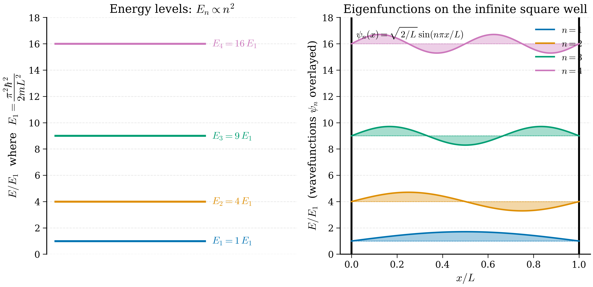

# 4.3 Solving it numerically — particle in a box

<figure markdown>
{ width="700" }
<figcaption>Figure 4.3.1. The first four eigenstates of the 1D infinite square well. Energies scale as \(n^2\) (left panel); wavefunctions are sinusoids that vanish at the walls (right panel). The number of nodes increases by one with each level.</figcaption>
</figure>

We have a postulate (the Schrödinger equation) and a framework (Hermitian operators, eigenvalue problems, bra-ket notation). It is time to *solve* something. We pick the simplest non-trivial problem in quantum mechanics: a single particle confined to a one-dimensional region, with infinite potential walls. This is the "particle in a box", and it is the quantum analogue of a guitar string fixed at both ends.

The motivation is partly pedagogical and partly practical. Pedagogically, the box is the first place a reader meets quantised energies emerging *from a calculation* rather than as a postulate — the discreteness is forced on us by the boundary conditions, not put in by hand. Practically, the box is a surprisingly good caricature of an electron in a quantum well (a thin semiconductor layer) or in a long conjugated molecule like a polyene, and one can already make order-of-magnitude predictions about light absorption from this model.

We will solve the problem twice: once analytically with paper and pencil, and once numerically by turning the Hamiltonian into a matrix and diagonalising it. The numerical method we develop here — finite differences plus `scipy.linalg.eigh` — is exactly the method we will reuse in §4.4 for the harmonic oscillator and which, in spirit, underlies modern plane-wave electronic-structure codes.

## 4.3.0 Classical preview: a ball in a box

Before doing any quantum mechanics, take a moment to remember what the *classical* version of this problem looks like, because the contrast is illuminating.

A classical point particle of mass $m$ is placed inside a 1D region $0 < x < L$ with rigid walls at the endpoints. Inside, no force acts: the particle moves at constant velocity. At each wall it undergoes an elastic collision that reverses its momentum. The motion is a perfectly periodic back-and-forth at constant speed.

What can we say about this system?

- **Energy is continuous.** The particle has kinetic energy $E = \tfrac12 m v^2$ for any $v \geq 0$ we like. There is no minimum energy: a ball sitting at rest in the middle of the box has $E = 0$.
- **Position is uniform on average.** Time-averaged over many bounces, the probability density of finding the ball at any $x \in (0, L)$ is uniform, $\rho_{\mathrm{cl}}(x) = 1/L$. The ball spends equal time at every point because it moves at constant speed.
- **No interference.** There is no analogue of a "node" in the probability density.

Now contrast: quantum mechanically, the *same* setup with the *same* walls produces a discrete spectrum, a non-zero ground-state energy, and probability densities $|\psi_n(x)|^2 = (2/L)\sin^2(n\pi x/L)$ that *oscillate* between zero (nodes) and a maximum $2/L$. The classical uniform distribution is recovered only as an average over many neighbouring quantum states — the correspondence principle in action.

!!! tip "Standing waves are the right intuition"
    A musician knows what frequencies a string can sound: only those whose half-wavelength fits an integer number of times into the string length. A quantum particle in a box is exactly the same constraint applied to its de Broglie wave. The wavefunction has to *fit* — and only certain wavelengths fit, which is why only certain energies are allowed. The discreteness is forced by geometry, not postulated.

With this intuition in place, the analytical solution that follows is no more mysterious than the modes of a guitar string.

## 4.3.1 The model

!!! info "What problem are we solving?"
    We want the *allowed energies* of a single quantum particle trapped
    between two impenetrable walls a distance $L$ apart, and the
    *wavefunction* that goes with each energy. "Allowed" is the key word:
    classically the particle could have any energy at all, but quantum
    mechanically only a discrete ladder of energies will turn out to be
    possible. Our task is to find that ladder — the numbers $E_1, E_2,
    E_3, \dots$ — directly from the Schrödinger equation, with no
    quantisation put in by hand. We then redo the whole calculation on a
    computer, so that the *same code* will later solve problems we cannot
    do with pencil and paper.

!!! note "Plain-language version"
    A guitar string fixed at both ends can only vibrate at certain
    frequencies, because a half-wavelength has to fit a whole number of
    times into the string. A quantum particle in a box is the identical
    idea applied to its de Broglie wave: the wavefunction must vanish at
    both walls, so only waves with the right wavelengths "fit", and only
    those waves are allowed. Each allowed wave carries a definite energy.
    That is where the discrete energy ladder comes from.

Before the symbols arrive, here is a guide to every one used in this
section. Refer back to it whenever a letter looks unfamiliar; for the
words (wavefunction, eigenvalue, operator, boundary condition) see the
[beginner glossary](../undergraduate/glossary-for-beginners.md).

| Symbol | Meaning | Units (SI) |
|---|---|---|
| $x$ | position inside the box, $0 \le x \le L$ | m |
| $L$ | width of the box (wall-to-wall distance) | m |
| $m$ | mass of the particle | kg |
| $V(x)$ | potential energy as a function of position | J |
| $\psi(x)$ | wavefunction; $\lvert\psi\rvert^2$ is the probability density | m$^{-1/2}$ (1D) |
| $E$ | energy eigenvalue (an allowed energy) | J |
| $\hbar$ | reduced Planck constant, $1.055\times10^{-34}$ | J s |
| $k$ | wavenumber, $k = 2\pi/\lambda$ | m$^{-1}$ |
| $n$ | quantum number labelling the state, $n = 1,2,3,\dots$ | dimensionless |
| $A,\,B$ | amplitudes (integration constants) in the general solution | m$^{-1/2}$ |
| $A_n$ | normalisation constant of state $n$ | m$^{-1/2}$ |

Consider a single particle of mass $m$ in one dimension, with potential

$$V(x) = \begin{cases} 0, & 0 < x < L,\\ \infty, & \text{otherwise.}\end{cases} \tag{4.3.1}$$

Inside the box the particle is free; outside, the infinite potential forbids any wavefunction amplitude. Continuity of $\psi$ therefore demands

$$\psi(0) = \psi(L) = 0. \tag{4.3.2}$$

Inside the box the time-independent Schrödinger equation (4.2.6) reads

$$-\frac{\hbar^2}{2m}\frac{d^2 \psi}{dx^2} = E\, \psi. \tag{4.3.3}$$

## 4.3.2 Analytical solution

We solve (4.3.3) step by step, naming every move.

!!! note "Why this step? — five-step solution skeleton"
    The following derivation has a structure that recurs in every 1D bound-state problem:
    (i) solve the ODE in regions where $V$ is constant;
    (ii) apply continuity at boundaries to determine the constants;
    (iii) apply the other boundary condition to get the eigenvalue condition;
    (iv) normalise;
    (v) read off energies and wavefunctions.
    Memorise the five steps; we will use the same template for the harmonic oscillator (§4.4), for tunnelling problems (Chapter 11), and for the radial equation of the hydrogen atom in any textbook.

Equation (4.3.3) is a linear second-order ODE with constant coefficients — the same equation that governs a simple harmonic oscillator in classical mechanics, with the spatial coordinate playing the role of time. Define

$$k^2 \equiv \frac{2mE}{\hbar^2}, \tag{4.3.4}$$

so that (4.3.3) becomes $\psi'' + k^2 \psi = 0$. The general real solution is

$$\psi(x) = A\sin(kx) + B\cos(kx). \tag{4.3.5}$$

??? note "Full derivation: where (4.3.5) comes from"
    Why is (4.3.5) the *general* solution, and why does $k^2 \equiv 2mE/\hbar^2$
    rearrange (4.3.3) so cleanly? Take it one line at a time.

    Start from the time-independent Schrödinger equation inside the box,
    equation (4.3.3):

    $$-\frac{\hbar^2}{2m}\frac{d^2\psi}{dx^2} = E\,\psi.$$

    Multiply both sides by $-2m/\hbar^2$ to isolate the second derivative:

    $$\frac{d^2\psi}{dx^2} = -\frac{2mE}{\hbar^2}\,\psi.$$

    The combination $2mE/\hbar^2$ is a single positive number (we expect
    $E>0$ for a confined free particle), so it is natural to give it a
    name. Define $k^2 \equiv 2mE/\hbar^2$, i.e.\ $k = \sqrt{2mE}/\hbar$.
    Then the equation reads

    $$\psi'' = -k^2\,\psi, \qquad\text{equivalently}\qquad \psi'' + k^2\psi = 0.$$

    This is the equation "what function equals minus a constant times its
    own second derivative?". Two independent functions do this:
    $\sin(kx)$ and $\cos(kx)$, because

    $$\frac{d^2}{dx^2}\sin(kx) = -k^2\sin(kx), \qquad
      \frac{d^2}{dx^2}\cos(kx) = -k^2\cos(kx).$$

    A second-order linear ODE has exactly two independent solutions, and
    every solution is a linear combination of them. Hence the general
    solution is

    $$\psi(x) = A\sin(kx) + B\cos(kx)$$

    for arbitrary constants $A$ and $B$, which is (4.3.5). (Equivalently
    one could write $\psi = C\,e^{ikx} + D\,e^{-ikx}$; the sine/cosine form
    is the same thing rewritten with $e^{\pm ikx} = \cos kx \pm i\sin kx$,
    and is more convenient here because our boundary conditions are real.)

!!! warning "Common misunderstandings"
    - $k$ is **not** an independent free parameter we may set to anything.
      Through $k^2 = 2mE/\hbar^2$ it is tied to the energy $E$. Fixing the
      allowed $k$ values (next) *is* fixing the allowed energies.
    - The constant $E$ is the **eigenvalue** (one number); $\psi(x)$ is the
      **eigenfunction** (a whole function). They come as a pair. Do not
      confuse "the energy of state $n$" ($E_n$, a number) with "state $n$"
      ($\psi_n$, a function) — a beginner error we return to below.
    - We have assumed $E>0$ so that $k$ is real. A bound state of this
      potential cannot have $E<0$: with $V=0$ inside, $E<0$ would force
      $k$ imaginary and $\psi$ a sum of growing/decaying exponentials,
      which cannot vanish at *both* walls except trivially.

!!! example "Step-by-step: how two boundary conditions quantise the energy"
    Two conditions, $\psi(0)=0$ and $\psi(L)=0$, do two different jobs.
    Keep them separate:

    1. **First wall, $\psi(0)=0$.** Put $x=0$ into (4.3.5). Since
       $\sin 0 = 0$ and $\cos 0 = 1$, only the cosine survives:
       $\psi(0) = A\cdot 0 + B\cdot 1 = B$. Demanding $\psi(0)=0$ forces
       $B=0$. *Effect:* it kills the cosine; the wavefunction must be a
       pure sine, $\psi(x) = A\sin(kx)$.
    2. **Second wall, $\psi(L)=0$.** Now $\psi(L) = A\sin(kL) = 0$. We do
       not want $A=0$ (that gives $\psi\equiv0$ everywhere — no particle),
       so we need $\sin(kL)=0$.
    3. **Solve $\sin(kL)=0$.** The sine vanishes exactly at integer
       multiples of $\pi$: $kL = n\pi$ for $n=1,2,3,\dots$ This is the
       *eigenvalue condition* — the single equation that selects which
       $k$ (and hence which $E$) are allowed.
    4. **Read off energies.** From $k_n = n\pi/L$ and $E = \hbar^2k^2/2m$,
       the allowed energies are $E_n = n^2\pi^2\hbar^2/(2mL^2)$.

    The first condition fixes the *shape* (a sine); the second fixes the
    *wavelength* (which sines fit), and quantisation is the result of the
    sine having to fit a whole number of half-waves into the box.

Apply the boundary conditions. At $x = 0$,

$$\psi(0) = B = 0,$$

so $B = 0$ and the wavefunction is a pure sine. At $x = L$,

$$\psi(L) = A\sin(kL) = 0.$$

Either $A = 0$ (the trivial, unnormalisable solution we discard) or $\sin(kL) = 0$, i.e.\ $kL = n\pi$ for some integer $n$. Thus the allowed wavenumbers are

$$k_n = \frac{n\pi}{L}, \quad n = 1, 2, 3, \ldots \tag{4.3.6}$$

(Negative $n$ give the same wavefunction up to an overall sign and are discarded; $n = 0$ gives $\psi \equiv 0$.) The corresponding energies follow from (4.3.4):

$$\boxed{\; E_n = \frac{\hbar^2 k_n^2}{2m} = \frac{n^2 \pi^2 \hbar^2}{2 m L^2}, \quad n = 1, 2, 3, \ldots \;} \tag{4.3.7}$$

This is our first quantised spectrum. Three features deserve note.

- The energies scale as $n^2$: the levels are not equally spaced. Adjacent gaps grow with $n$.
- The lowest allowed energy is $E_1 = \pi^2 \hbar^2/(2mL^2) > 0$. Even in the ground state the particle cannot be at rest, as a classical particle could. This *zero-point energy* is a direct consequence of the uncertainty principle: confining the particle to a region of width $L$ forces $\Delta p \gtrsim \hbar/L$ and hence $E \gtrsim \hbar^2/(2mL^2)$. We will meet a closely-related zero-point energy in §4.4.
- The energies scale as $1/L^2$: a smaller box gives more widely spaced levels. This is why nanoscale confinement (quantum dots, quantum wells) produces tunable optical properties.

The wavefunctions are

$$\psi_n(x) = A_n \sin\!\left(\frac{n\pi x}{L}\right). \tag{4.3.8}$$

The amplitude $A_n$ is fixed by normalisation, equation (4.2.4) in one dimension:

$$1 = \int_0^L |\psi_n(x)|^2\, dx = A_n^2 \int_0^L \sin^2\!\left(\frac{n\pi x}{L}\right) dx.$$

Using $\sin^2\theta = \tfrac12(1 - \cos 2\theta)$,

$$\int_0^L \sin^2\!\left(\frac{n\pi x}{L}\right) dx = \frac{L}{2},$$

so $A_n^2 \cdot L/2 = 1$, hence $A_n = \sqrt{2/L}$. The normalised eigenfunctions are

??? note "Full derivation: the normalisation integral and the constant $\sqrt{2/L}$"
    The claim is that $\int_0^L \sin^2(n\pi x/L)\,dx = L/2$, and that
    therefore $A_n = \sqrt{2/L}$. Here is every step.

    **The integrand.** Use the power-reduction identity
    $\sin^2\theta = \tfrac12(1-\cos 2\theta)$ with $\theta = n\pi x/L$:

    $$\sin^2\!\Big(\frac{n\pi x}{L}\Big)
      = \frac12 - \frac12\cos\!\Big(\frac{2n\pi x}{L}\Big).$$

    **Integrate term by term over $[0,L]$.** The constant term gives

    $$\int_0^L \frac12\,dx = \frac{L}{2}.$$

    The cosine term integrates to a sine:

    $$\int_0^L \frac12\cos\!\Big(\frac{2n\pi x}{L}\Big)dx
      = \frac12\cdot\frac{L}{2n\pi}\,
        \Big[\sin\!\Big(\frac{2n\pi x}{L}\Big)\Big]_0^L
      = \frac{L}{4n\pi}\big[\sin(2n\pi) - \sin 0\big].$$

    Because $n$ is an integer, $\sin(2n\pi) = 0$ and $\sin 0 = 0$, so this
    whole term **vanishes**. Hence

    $$\int_0^L \sin^2\!\Big(\frac{n\pi x}{L}\Big)dx = \frac{L}{2} - 0 = \frac{L}{2}.$$

    (Sanity check: $\sin^2$ oscillates between $0$ and $1$ with average
    $\tfrac12$, so over a length $L$ its integral is $\tfrac12 \times L$.
    The exact algebra confirms the average-value argument.)

    **Solve for $A_n$.** The normalisation condition $\int_0^L |\psi_n|^2\,dx = 1$
    reads $A_n^2 \cdot (L/2) = 1$, so

    $$A_n^2 = \frac{2}{L}, \qquad A_n = \sqrt{\frac{2}{L}}.$$

    We take the positive root by convention; an overall sign (or, more
    generally, a phase) on a wavefunction never affects $|\psi|^2$ and so
    carries no physics. Notice the units work: $[A_n] = \mathrm{m}^{-1/2}$,
    which is exactly what a 1D wavefunction needs so that $\int|\psi|^2dx$
    is dimensionless.

$$\boxed{\; \psi_n(x) = \sqrt{\frac{2}{L}}\, \sin\!\left(\frac{n\pi x}{L}\right). \;} \tag{4.3.9}$$

One quick sanity check: the eigenfunctions are orthogonal. For $m \neq n$,

$$\int_0^L \psi_m^* \psi_n\, dx = \frac{2}{L}\int_0^L \sin\!\left(\frac{m\pi x}{L}\right)\sin\!\left(\frac{n\pi x}{L}\right) dx = 0,$$

using the standard sine-sine integral. This is the orthogonality theorem of §4.2.6 made explicit.

??? note "Full derivation: orthogonality of distinct box eigenstates"
    We prove that for integers $m \neq n$,

    $$\int_0^L \sin\!\Big(\frac{m\pi x}{L}\Big)\sin\!\Big(\frac{n\pi x}{L}\Big)\,dx = 0,$$

    so that $\int_0^L \psi_m^*\psi_n\,dx = 0$. (The eigenfunctions are real,
    so the complex conjugate does nothing here.)

    **Turn the product of sines into a difference of cosines.** The
    product-to-sum identity is

    $$\sin\alpha\,\sin\beta = \tfrac12\big[\cos(\alpha-\beta) - \cos(\alpha+\beta)\big].$$

    With $\alpha = m\pi x/L$ and $\beta = n\pi x/L$,

    $$\sin\!\Big(\frac{m\pi x}{L}\Big)\sin\!\Big(\frac{n\pi x}{L}\Big)
      = \frac12\cos\!\Big(\frac{(m-n)\pi x}{L}\Big)
      - \frac12\cos\!\Big(\frac{(m+n)\pi x}{L}\Big).$$

    **Integrate each cosine over $[0,L]$.** For any non-zero integer $p$,

    $$\int_0^L \cos\!\Big(\frac{p\pi x}{L}\Big)dx
      = \frac{L}{p\pi}\Big[\sin\!\Big(\frac{p\pi x}{L}\Big)\Big]_0^L
      = \frac{L}{p\pi}\big[\sin(p\pi) - \sin 0\big] = 0,$$

    because $\sin(p\pi)=0$ for every integer $p$. Apply this with
    $p = m-n$ and with $p = m+n$. Since $m \neq n$ and both are positive
    integers, $m-n$ is a non-zero integer and $m+n$ is a non-zero integer,
    so **both** cosine integrals vanish:

    $$\int_0^L \sin\!\Big(\frac{m\pi x}{L}\Big)\sin\!\Big(\frac{n\pi x}{L}\Big)dx
      = \frac12\cdot 0 - \frac12\cdot 0 = 0.$$

    **Why the $m=n$ case is different.** If $m=n$ the first term has
    $p = m-n = 0$, and $\cos 0 = 1$ does *not* integrate to zero — it gives
    $\int_0^L 1\,dx = L$. That non-zero piece is exactly the normalisation
    integral $L/2$ computed above. So the two results combine into one
    statement, $\int_0^L \psi_m^*\psi_n\,dx = \delta_{mn}$: the box
    eigenfunctions are **orthonormal**. This is the concrete realisation of
    the general orthogonality theorem for Hermitian operators (§4.2.6):
    eigenfunctions belonging to *different* eigenvalues are automatically
    orthogonal.

!!! warning "Common misunderstandings (nodes and zero-point energy)"
    - **Counting nodes.** A *node* is a point strictly *inside* the box
      where $\psi_n$ crosses zero. State $\psi_n = \sqrt{2/L}\sin(n\pi x/L)$
      has $n-1$ interior nodes — the ground state ($n=1$) has **none**. The
      zeros *at the walls* are forced by the boundary condition and are not
      counted as nodes. A common slip is to label the ground state as
      "$n=0$" and expect it to have zero energy; here $n$ starts at $1$.
    - **Zero-point energy is not a mistake.** The lowest energy is
      $E_1>0$, *not* zero. A quantum particle in a box can never be
      perfectly at rest, unlike a classical ball that can sit motionless in
      the middle. This is not an artefact of the model; it is the
      uncertainty principle: confining the particle to width $L$ forces a
      momentum spread $\Delta p \gtrsim \hbar/L$ and hence a kinetic energy
      $\sim\hbar^2/(2mL^2)$. Setting $E=0$ would mean $\Delta p = 0$ with
      the particle pinned inside the box, which the uncertainty relation
      forbids.
    - **$\lvert\psi_n\rvert^2$, not $\psi_n$, is the probability.** The
      wavefunction $\psi_n$ goes negative (it is a sine); a probability
      density cannot. The measurable quantity is $\lvert\psi_n\rvert^2 =
      (2/L)\sin^2(n\pi x/L)$, which is everywhere $\ge 0$ as it must be.
      Where $\psi_n$ has a node, the particle is *never* found.

!!! example "Numerical scale"
    For an electron ($m_e = 9.109 \times 10^{-31}$ kg) in a box of $L = 1$ nm, the ground-state energy is
    $$E_1 = \frac{\pi^2 (1.055 \times 10^{-34})^2}{2 \cdot 9.109 \times 10^{-31} \cdot (10^{-9})^2} \approx 6.0 \times 10^{-20}\ \mathrm{J} \approx 0.376\ \mathrm{eV}.$$
    The first excited state is at $4 E_1 \approx 1.5$ eV, and the $1 \to 2$ transition occurs at a wavelength of $\sim 1100$ nm — the near-infrared. Make the box 0.5 nm and the transition shifts into the visible. This is the physics of quantum-confined optical materials.

!!! example "An even smaller box: $L = 1$ Å, electron"
    For $L = 0.1$ nm $= 1$ Å — roughly the size of a hydrogen atom — the ground-state energy is
    $$E_1 = (0.376\ \mathrm{eV}) \times 100 = 37.6\ \mathrm{eV},$$
    using the inverse-square scaling with $L$. This is in the right ballpark for atomic ionisation energies (hydrogen: 13.6 eV; helium: 24.6 eV; lithium 2$s$: 5.4 eV). The box is too crude to give numerical chemistry, but the *scale* is correct, which is one of the appealing features of the model.

## 4.3.2a Expectation values and the uncertainty product

The wavefunctions (4.3.9) are explicit enough that we can compute every interesting expectation value by elementary integration. This is the simplest non-trivial example of the formal machinery of §4.2 and is worth doing once in full detail.

### Position

For state $n$, by symmetry of $|\psi_n|^2 = (2/L)\sin^2(n\pi x/L)$ around $x = L/2$,

$$\langle x\rangle_n = \int_0^L x\, |\psi_n(x)|^2\, dx = \frac{2}{L}\int_0^L x\,\sin^2\!\left(\frac{n\pi x}{L}\right) dx = \frac{L}{2}.$$

!!! note "Why this step?"
    The integrand $x\,\sin^2(n\pi x/L)$ is symmetric about $x = L/2$ in the sense that letting $x \to L - x$ and using $\sin(n\pi(L-x)/L) = (-1)^{n+1}\sin(n\pi x/L)$ gives $\sin^2$ unchanged. Hence $\int_0^L (L - x)\sin^2 = \int_0^L x \sin^2$, and adding the two yields $L\int_0^L \sin^2 = L \cdot L/2$, so $\int_0^L x\sin^2 = L^2/4$, giving $\langle x\rangle = L/2$. The particle is "centred" in the classical sense, independent of $n$.

For $\langle x^2\rangle_n$, use $\sin^2 u = (1 - \cos 2u)/2$:

$$\langle x^2\rangle_n = \frac{2}{L}\int_0^L x^2 \cdot \frac{1 - \cos(2n\pi x/L)}{2}\, dx = \frac{L^2}{3} - \frac{L^2}{2 n^2 \pi^2}. \tag{4.3.E1}$$

The first term comes from $\int_0^L x^2\,dx/L = L^2/3$ (the classical answer for a uniform distribution); the second term, the integral of $x^2 \cos(2n\pi x/L)$, evaluates by twice integration by parts to $L^3/(2 n^2\pi^2)$, giving the negative correction.

??? note "Full derivation: the $\langle x^2\rangle$ integral by parts"
    We evaluate

    $$J \equiv \int_0^L x^2\cos\!\Big(\frac{2n\pi x}{L}\Big)\,dx$$

    and show $J = L^3/(2n^2\pi^2)$. Write $a \equiv 2n\pi/L$ for brevity, so
    $J = \int_0^L x^2\cos(ax)\,dx$.

    **First integration by parts** ($u=x^2$, $dv=\cos(ax)\,dx$, so
    $du = 2x\,dx$, $v = \sin(ax)/a$):

    $$J = \Big[\frac{x^2\sin(ax)}{a}\Big]_0^L - \frac{2}{a}\int_0^L x\sin(ax)\,dx.$$

    At $x=L$, $\sin(aL) = \sin(2n\pi) = 0$; at $x=0$ the term is $0$. So the
    boundary term vanishes and

    $$J = -\frac{2}{a}\int_0^L x\sin(ax)\,dx.$$

    **Second integration by parts** ($u=x$, $dv=\sin(ax)\,dx$, so
    $du=dx$, $v=-\cos(ax)/a$):

    $$\int_0^L x\sin(ax)\,dx
      = \Big[-\frac{x\cos(ax)}{a}\Big]_0^L + \frac{1}{a}\int_0^L \cos(ax)\,dx.$$

    The remaining integral $\int_0^L\cos(ax)\,dx = [\sin(ax)/a]_0^L = 0$
    again (since $\sin(aL)=\sin(2n\pi)=0$). The boundary term at $x=L$ is
    $-L\cos(aL)/a = -L\cos(2n\pi)/a = -L/a$ (because $\cos(2n\pi)=1$), and at
    $x=0$ it is $0$. Hence

    $$\int_0^L x\sin(ax)\,dx = -\frac{L}{a}.$$

    **Combine.** Substituting back,

    $$J = -\frac{2}{a}\cdot\Big(-\frac{L}{a}\Big) = \frac{2L}{a^2}
        = \frac{2L}{(2n\pi/L)^2} = \frac{2L\cdot L^2}{4n^2\pi^2}
        = \frac{L^3}{2n^2\pi^2}.$$

    Finally,

    $$\langle x^2\rangle_n = \frac{2}{L}\int_0^L \frac{x^2}{2}\,dx
        - \frac{2}{L}\cdot\frac12 J
        = \frac{1}{L}\cdot\frac{L^3}{3} - \frac{1}{L}\cdot\frac{L^3}{2n^2\pi^2}
        = \frac{L^2}{3} - \frac{L^2}{2n^2\pi^2},$$

    which is (4.3.E1).

The variance is therefore

$$(\Delta x)_n^2 = \langle x^2\rangle_n - \langle x\rangle_n^2 = \frac{L^2}{3} - \frac{L^2}{2n^2\pi^2} - \frac{L^2}{4} = \frac{L^2}{12}\left(1 - \frac{6}{n^2\pi^2}\right).$$

In the limit of large $n$, $(\Delta x)_n^2 \to L^2/12$ — exactly the variance of a uniform distribution on $[0, L]$, recovering the classical result. The correspondence principle works.

### Momentum

For momentum, integrate by parts:

$$\langle p\rangle_n = -i\hbar \int_0^L \psi_n^*(x)\, \psi_n'(x)\, dx = -i\hbar\cdot\frac{2}{L}\cdot\frac{n\pi}{L}\int_0^L \sin\!\left(\frac{n\pi x}{L}\right)\cos\!\left(\frac{n\pi x}{L}\right) dx = 0,$$

since $\int_0^L \sin\cos = 0$. The wavefunction is a *standing* wave — equal admixture of left- and right-moving plane waves — so the average momentum is zero, as it must be by symmetry.

For $\langle p^2\rangle_n$ use $\hat p^2 \psi_n = -\hbar^2 \psi_n''$ together with the eigenvalue equation $\hat H\psi_n = E_n\psi_n$ (and $\hat H = \hat p^2/2m$ inside the box):

$$\langle p^2\rangle_n = 2m E_n = \frac{n^2\pi^2\hbar^2}{L^2}.$$

So $(\Delta p)_n^2 = \langle p^2\rangle_n - 0 = n^2\pi^2\hbar^2/L^2$ and $(\Delta p)_n = n\pi\hbar/L$.

### The uncertainty product

Combining,

$$(\Delta x)_n (\Delta p)_n = \frac{L}{2\sqrt 3}\sqrt{1 - \frac{6}{n^2\pi^2}}\cdot \frac{n\pi\hbar}{L} = \frac{n\pi\hbar}{2\sqrt 3}\sqrt{1 - \frac{6}{n^2\pi^2}}.$$

For $n = 1$: $(\Delta x)(\Delta p) \approx 0.568\,\hbar > \hbar/2$. The bound is satisfied, with about 14% slack. For $n = 2$: $(\Delta x)(\Delta p) \approx 1.67\,\hbar$. The product grows linearly with $n$ at large $n$ — higher excited states are more "uncertain" in both position (which approaches uniform) and momentum (which scales as $\hbar k_n \propto n$).

!!! tip "The lower bound is *not* saturated"
    Heisenberg's inequality is saturated only by Gaussian wavepackets, which the box eigenstates are not. The particle-in-a-box ground state is a half-sine, which has a steeper position cut-off than a Gaussian and therefore a slightly larger $\Delta p$ for the same $\Delta x$. Saturation will appear naturally in the harmonic oscillator ground state of §4.4 — a Gaussian.

??? question "Pause and recall"
    Before reading on, try to answer these from memory:

    1. Which boundary condition forces the wavefunction to be a pure sine, and which one then quantises the allowed wavenumbers $k_n$?
    2. Why is the ground-state energy $E_1$ strictly positive, and how does this zero-point energy follow from the uncertainty principle?
    3. The energies scale as $n^2/L^2$ — what does the $1/L^2$ dependence imply for the optical properties of a quantum dot as it is made smaller?

    If any of these is shaky, re-read the preceding section before continuing.

## 4.3.2b The three-dimensional box and degeneracy

Real boxes — quantum dots, nanocrystals, the cubic cavity of a microwave
resonator — are three-dimensional. The good news is that a *rectangular*
3D box needs no new mathematics: it factorises into three independent 1D
boxes. The technique that does this, **separation of variables**, is one
of the most useful in all of physics, and the box is the cleanest place to
meet it.

!!! info "What problem are we solving?"
    We have an electron confined to a 3D rectangular room with sides
    $L_x, L_y, L_z$ and impenetrable walls. We want its allowed energies
    and wavefunctions. Rather than solve a partial differential equation in
    three variables from scratch, we will *guess* that the answer is a
    product of three 1D solutions, substitute the guess in, and watch the
    problem fall apart into three copies of the 1D box we already solved.

The particle is free inside the region $0<x<L_x$, $0<y<L_y$, $0<z<L_z$, and
$\psi$ must vanish on every wall. Inside, the time-independent Schrödinger
equation is

$$-\frac{\hbar^2}{2m}\left(\frac{\partial^2}{\partial x^2}
  + \frac{\partial^2}{\partial y^2}
  + \frac{\partial^2}{\partial z^2}\right)\psi(x,y,z) = E\,\psi(x,y,z).
  \tag{4.3.14}$$

!!! note "Plain-language version"
    Because the box is rectangular, what the particle does along $x$ has
    nothing to do with what it does along $y$ or $z$ — the walls in each
    direction act independently. So we *try* a wavefunction that is one
    factor per direction, $\psi = X(x)Y(y)Z(z)$. Substituting this product
    into the equation, each direction's piece separates off and obeys its
    own 1D box equation. The total energy is then just the sum of three 1D
    energies.

??? note "Full derivation: separation of variables for the 3D box"
    **The product ansatz.** Assume the solution factorises,

    $$\psi(x,y,z) = X(x)\,Y(y)\,Z(z).$$

    Each second derivative in (4.3.14) then acts on only one factor; for
    example $\partial^2\psi/\partial x^2 = X''(x)\,Y(y)\,Z(z)$. Substituting
    and dividing through by $\psi = XYZ$ gives

    $$-\frac{\hbar^2}{2m}\left(\frac{X''}{X} + \frac{Y''}{Y} + \frac{Z''}{Z}\right) = E.$$

    **The separation argument.** Look at the three ratios. The term
    $X''/X$ depends on $x$ alone, $Y''/Y$ on $y$ alone, $Z''/Z$ on $z$
    alone, yet their sum is the *constant* $-2mE/\hbar^2$ for all
    $x,y,z$. The only way a function of $x$ plus a function of $y$ plus a
    function of $z$ can be constant everywhere is if each function is
    *separately* constant. Name those constants $-k_x^2, -k_y^2, -k_z^2$:

    $$\frac{X''}{X} = -k_x^2,\qquad
      \frac{Y''}{Y} = -k_y^2,\qquad
      \frac{Z''}{Z} = -k_z^2,$$

    with $k_x^2 + k_y^2 + k_z^2 = 2mE/\hbar^2$.

    **Three 1D boxes.** Each line, e.g.\ $X'' + k_x^2 X = 0$ with
    $X(0)=X(L_x)=0$, is *exactly* the 1D box problem we already solved.
    Hence $X(x)\propto \sin(n_x\pi x/L_x)$ with $k_x = n_x\pi/L_x$, and
    likewise for $Y$ and $Z$, each with its own positive integer
    $n_x, n_y, n_z$.

    **Assemble.** The wavefunction is the product of three normalised
    sines,

    $$\psi_{n_x n_y n_z}(x,y,z)
      = \sqrt{\frac{8}{L_xL_yL_z}}\,
        \sin\!\Big(\frac{n_x\pi x}{L_x}\Big)
        \sin\!\Big(\frac{n_y\pi y}{L_y}\Big)
        \sin\!\Big(\frac{n_z\pi z}{L_z}\Big),$$

    where the normalisation constant is the product of three factors
    $\sqrt{2/L}$, giving $\sqrt{2/L_x}\cdot\sqrt{2/L_y}\cdot\sqrt{2/L_z}
    = \sqrt{8/(L_xL_yL_z)}$. The energy is the sum of three 1D energies,
    $E = \hbar^2(k_x^2+k_y^2+k_z^2)/2m$.

The result is the 3D spectrum

$$E_{n_x n_y n_z} = \frac{\pi^2\hbar^2}{2m}
  \left(\frac{n_x^2}{L_x^2} + \frac{n_y^2}{L_y^2} + \frac{n_z^2}{L_z^2}\right),
  \qquad n_x, n_y, n_z = 1, 2, 3, \ldots \tag{4.3.15}$$

with three independent quantum numbers, one per direction.

### Degeneracy in the cubic box

Something new happens when the box is a **cube**, $L_x = L_y = L_z = L$.
Then (4.3.15) collapses to

$$E_{n_x n_y n_z} = \frac{\pi^2\hbar^2}{2mL^2}\,(n_x^2 + n_y^2 + n_z^2),
  \tag{4.3.16}$$

so the energy depends only on the *sum of squares* $n_x^2+n_y^2+n_z^2$.
Different triples can give the same sum, and therefore the same energy,
while being genuinely different states (different wavefunctions). This is
**degeneracy**: several independent eigenstates sharing one eigenvalue.

!!! tip "New vocabulary"
    - **Separation of variables** — the technique of solving a
      multi-variable equation by assuming the solution is a product of
      one-variable factors, turning one hard equation into several easy
      ones.
    - **Degeneracy** — when two or more distinct eigenstates have exactly
      the same energy. The number of such states is the *degree of
      degeneracy*. Here it arises from the cube's symmetry; in the
      [beginner glossary](../undergraduate/glossary-for-beginners.md) see
      *eigenvalue* and *eigenvector* for the underlying idea.

!!! example "Worked example: the lowest cubic-box levels and their degeneracies"
    Write energies in units of $\varepsilon \equiv \pi^2\hbar^2/(2mL^2)$, so
    $E = (n_x^2+n_y^2+n_z^2)\,\varepsilon$. Enumerate the smallest
    sum-of-squares:

    | $(n_x,n_y,n_z)$ | $n_x^2+n_y^2+n_z^2$ | $E/\varepsilon$ | degeneracy |
    |---|---|---|---|
    | $(1,1,1)$ | $3$ | $3$ | $1$ |
    | $(2,1,1)$ and permutations | $6$ | $6$ | $3$ |
    | $(2,2,1)$ and permutations | $9$ | $9$ | $3$ |
    | $(3,1,1)$ and permutations | $11$ | $11$ | $3$ |
    | $(2,2,2)$ | $12$ | $12$ | $1$ |
    | $(3,2,1)$ and permutations | $14$ | $14$ | $6$ |

    The ground state $(1,1,1)$ is unique. The first excited level at
    $6\varepsilon$ is **three-fold degenerate**: the three states
    $(2,1,1)$, $(1,2,1)$, $(1,1,2)$ differ only in *which* axis carries the
    extra excitation, and the cube cannot tell its axes apart, so they must
    have equal energy. The level at $14\varepsilon$ is **six-fold
    degenerate** because all three quantum numbers differ and there are
    $3! = 6$ ways to assign $\{1,2,3\}$ to the three axes. Notice too that
    $E=9\varepsilon$ and $E=11\varepsilon$ are degenerate for the
    "permutation" reason, whereas a coincidence like two *unrelated*
    triples sharing a sum (an "accidental" degeneracy) can also occur at
    higher energies.

!!! warning "Common misunderstandings (degeneracy)"
    - Degenerate states are **distinct states**, not one state counted
      several times. $(2,1,1)$ and $(1,2,1)$ are different functions of
      position; they merely happen to cost the same energy.
    - Degeneracy is a consequence of **symmetry**. Stretch the cube into a
      rectangular box ($L_x \neq L_y$) and the three $6\varepsilon$ states
      split apart into three different energies — the symmetry that forced
      them equal is gone. This "lifting of degeneracy by lowering symmetry"
      is exactly how crystal fields split atomic levels in Chapter 5.
    - The *number* of states up to a given energy, not the individual
      levels, is what matters for counting electrons in a metal; this is
      the origin of the free-electron density of states (see the
      [beginner glossary](../undergraduate/glossary-for-beginners.md) entry
      *density of states*).

## 4.3.3 Discretising the Hamiltonian

!!! info "What problem are we solving?"
    The pencil-and-paper solution worked because the box has a tidy
    closed-form answer. Almost no other potential does. We therefore want
    a *recipe a computer can follow* for any $V(x)$: feed in the potential,
    get back the allowed energies and wavefunctions. The trick is to stop
    thinking of $\psi$ as a continuous function and instead store its
    values at a finite list of points. Once we do that, the operator
    $\hat H$ becomes an ordinary matrix, "solve the Schrödinger equation"
    becomes "find the eigenvalues of a matrix", and that is a job
    `numpy.linalg.eigh` does in one line.

!!! note "Plain-language version"
    Replace the smooth wavefunction by its height at $N$ evenly spaced
    pegs across the box. The Schrödinger equation links each peg's height
    to its two neighbours (through the second derivative). "Each entry
    depends on its neighbours" is precisely what a **tridiagonal matrix**
    encodes. Diagonalising that matrix hands back the special height
    patterns that the operator merely rescales — the discrete versions of
    $\sin(n\pi x/L)$ — and the rescaling factors are the energies $E_n$.
    The continuous eigenvalue problem $\hat H\psi = E\psi$ has become the
    matrix eigenvalue problem $\mathbf H\mathbf v = E\mathbf v$.

We now solve exactly the same problem numerically, with the explicit aim that the method should generalise to any 1D potential $V(x)$. The strategy is:

1. Replace the continuous coordinate $x \in [0, L]$ by a discrete grid of $N$ points.
2. Replace the second-derivative operator by a finite-difference approximation, turning $\hat{H}$ into a finite-size matrix.
3. Diagonalise the matrix to obtain approximate eigenvalues and eigenvectors of $\hat{H}$.

**The grid.** Place $N$ equally spaced points $x_1, x_2, \ldots, x_N$ inside the box, with spacing $h = L/(N+1)$ and positions $x_i = i\, h$ for $i = 1, \ldots, N$. The endpoints $x_0 = 0$ and $x_{N+1} = L$ are *not* part of the grid; the boundary conditions $\psi(0) = \psi(L) = 0$ are imposed by simply not including those points.

**The second derivative.** A Taylor expansion of $\psi$ about $x$ gives

$$\psi(x + h) = \psi(x) + h\psi'(x) + \frac{h^2}{2}\psi''(x) + \frac{h^3}{6}\psi'''(x) + \frac{h^4}{24}\psi^{(4)}(x) + \mathcal O(h^5),$$
$$\psi(x - h) = \psi(x) - h\psi'(x) + \frac{h^2}{2}\psi''(x) - \frac{h^3}{6}\psi'''(x) + \frac{h^4}{24}\psi^{(4)}(x) + \mathcal O(h^5).$$

!!! note "Why this step? — symmetry kills the odd terms"
    We use the two-sided Taylor expansion (at $x + h$ and $x - h$) rather than one-sided so that the *odd-order* terms in the difference will cancel. Adding the two equations annihilates $\psi'$ and $\psi'''$:

$$\psi(x+h) + \psi(x-h) = 2\psi(x) + h^2 \psi''(x) + \frac{h^4}{12}\psi^{(4)}(x) + \mathcal O(h^6).$$

Rearranging,

$$\psi''(x) = \frac{\psi(x+h) - 2\psi(x) + \psi(x-h)}{h^2} - \frac{h^2}{12}\psi^{(4)}(x) + \mathcal O(h^4). \tag{4.3.10}$$

This is the **central second-difference** formula. The leading error term is $\mathcal O(h^2)$ (the $\psi^{(4)}$ piece), so halving $h$ reduces the truncation error in $\psi''$ by a factor of four. We will verify this empirically in §4.3.5.

On the grid, with $\psi_i \equiv \psi(x_i)$,

$$\psi''(x_i) \approx \frac{\psi_{i+1} - 2\psi_i + \psi_{i-1}}{h^2}.$$

!!! tip "Higher-order stencils"
    More accurate formulae exist: the **fourth-order central difference**
    $$\psi''(x_i) \approx \frac{-\psi_{i-2} + 16\psi_{i-1} - 30\psi_i + 16\psi_{i+1} - \psi_{i+2}}{12 h^2}$$
    has truncation error $\mathcal O(h^4)$ and is used in higher-accuracy electronic-structure codes. The matrix becomes pentadiagonal rather than tridiagonal, but is still sparse. For our purposes the simplest three-point stencil is enough.

**The Hamiltonian matrix.** Inside the box $V = 0$, so $\hat{H} = -\frac{\hbar^2}{2m}\partial_x^2$, and the discrete Hamiltonian is the $N\times N$ matrix

$$H_{ij} = -\frac{\hbar^2}{2m h^2}\, \begin{cases} -2, & i = j,\\ 1, & |i - j| = 1,\\ 0, & \text{otherwise.}\end{cases} \tag{4.3.11}$$

In matrix form,

$$\hat{H} = \frac{\hbar^2}{2m h^2}\, \begin{pmatrix} 2 & -1 & & & \\ -1 & 2 & -1 & & \\ & -1 & 2 & -1 & \\ & & \ddots & \ddots & \ddots \\ & & & -1 & 2\end{pmatrix}. \tag{4.3.12}$$

This is a real symmetric tridiagonal matrix. Real symmetric matrices have real eigenvalues and orthogonal eigenvectors — the discrete analogue of our continuum theorem in §4.2.5–6. (The continuum operator is Hermitian; its finite-difference approximation is *symmetric*, which is the real version of the same condition.)

To include an arbitrary potential $V(x)$ we simply add a diagonal matrix:

$$H_{ii} \to H_{ii} + V(x_i). \tag{4.3.13}$$

The off-diagonal kinetic-energy part is the same for every problem. This is what makes the method so general.

**Boundary conditions.** Note that at the first grid point $i = 1$, the second-difference formula involves $\psi_0 \equiv \psi(0)$, which the Dirichlet boundary condition sets to zero — and so the term $-\psi_0/h^2$ simply does not contribute. Similarly at $i = N$. The matrix (4.3.11) implicitly enforces $\psi(0) = \psi(L) = 0$. Other boundary conditions (periodic, von Neumann, …) would modify the corners of the matrix.

!!! example "Minimal example: the whole method on a $3\times3$ matrix by hand"
    Before trusting a 400-point computer run, do the calculation with so few
    grid points that the matrix fits on a napkin. Take $N=3$ interior
    points. Then the spacing is $h = L/(N+1) = L/4$, and the three pegs sit
    at $x_1 = L/4$, $x_2 = L/2$, $x_3 = 3L/4$. With the prefactor
    $t \equiv \hbar^2/(2mh^2)$, the Hamiltonian (4.3.12) is the $3\times3$
    matrix

    $$\mathbf H = t\begin{pmatrix} 2 & -1 & 0\\ -1 & 2 & -1\\ 0 & -1 & 2\end{pmatrix}.$$

    **Find the eigenvalues by hand.** We need the $\lambda$ for which
    $\det(\mathbf M - \lambda\mathbf I)=0$, where $\mathbf M$ is the bare
    integer matrix (so the energies are $E = t\lambda$). Expanding the
    determinant of

    $$\begin{pmatrix} 2-\lambda & -1 & 0\\ -1 & 2-\lambda & -1\\ 0 & -1 & 2-\lambda\end{pmatrix}$$

    along the top row gives

    $$(2-\lambda)\big[(2-\lambda)^2 - 1\big] - (-1)\big[-(2-\lambda)\big]
      = (2-\lambda)\big[(2-\lambda)^2 - 2\big] = 0.$$

    So either $2-\lambda = 0$, giving $\lambda = 2$; or
    $(2-\lambda)^2 = 2$, giving $2-\lambda = \pm\sqrt2$, i.e.\
    $\lambda = 2\mp\sqrt2$. The three eigenvalues are

    $$\lambda_1 = 2-\sqrt2 \approx 0.5858,\qquad
      \lambda_2 = 2,\qquad
      \lambda_3 = 2+\sqrt2 \approx 3.4142.$$

    **Compare with theory.** The exact box eigenvalues, in the same units
    $t$, would be $(k_n h)^2 = (n\pi/(N+1))^2$, namely $(\pi/4)^2 = 0.617$,
    $(2\pi/4)^2 = 2.47$ and $(3\pi/4)^2 = 5.55$. The lowest comes out at
    $0.586$ versus $0.617$ — already within 5% on a *three-point* grid;
    the highest, $3.41$ versus $5.55$, is badly wrong, illustrating the
    rule that only the lowest fraction of the spectrum is trustworthy. As
    $N$ grows the agreement improves everywhere except near the top.

    **The exact pattern.** It is a standard result that the $N\times N$
    matrix $\mathrm{tridiag}(-1,2,-1)$ has eigenvalues and eigenvectors

    $$\lambda_k = 2 - 2\cos\!\Big(\frac{k\pi}{N+1}\Big)
               = 4\sin^2\!\Big(\frac{k\pi}{2(N+1)}\Big),
      \qquad
      v^{(k)}_i = \sin\!\Big(\frac{ik\pi}{N+1}\Big),$$

    for $k=1,\dots,N$. The eigenvector entries are *samples of the
    continuum sine* $\sin(k\pi x/L)$ at the grid points $x_i = ih$ — the
    discrete eigenstates literally are the continuous ones, sampled. And for
    small $k/(N+1)$ the small-angle expansion
    $4\sin^2(\theta) \approx 4\theta^2$ gives
    $\lambda_k \approx (k\pi/(N+1))^2 = (k\pi h/L)^2$, so
    $E_k = t\lambda_k \approx \hbar^2 (k\pi/L)^2/(2m)$ — the exact spectrum
    (4.3.7). The matrix method reproduces the analytical answer in the limit
    of a fine grid, and you have just seen exactly *why*.

!!! warning "Common misunderstandings (numerical method)"
    - **Eigenvalue vs eigenvector.** Diagonalising returns *both*: a number
      $E_n$ (the energy, an eigenvalue) and a column vector (the sampled
      wavefunction, an eigenvector). They are a matched pair. "The third
      eigenvalue" is an energy; "the third eigenvector" is a state — do not
      use the words interchangeably.
    - **The grid points are not the walls.** The walls at $x=0$ and $x=L$
      are *excluded* from the grid; the boundary condition $\psi=0$ there is
      enforced by leaving them out, which is why a length-$L$ box with $N$
      interior points uses spacing $h=L/(N+1)$, not $L/N$ or $L/(N-1)$. Off
      by one here shifts every energy.
    - **A returned eigenvector may point the "wrong" way.** Eigenvectors are
      fixed only up to an overall sign (and, in general, a phase). A solver
      may hand you $-\psi_n$ instead of $+\psi_n$; both describe the same
      physical state because $|\psi|^2$ is unchanged. The plotting code in
      §4.3.4 flips the sign to match the analytic sine for display only.

## 4.3.4 A complete Python implementation

!!! note "What should the answer roughly look like? (predict before you run)"
    Forming an expectation *before* running code is the single best habit
    in computational science: it turns a silent bug into an obvious one.
    For an electron in an $L = 1$ nm box, predict the following from the
    analytic formula (4.3.7) with $E_1 = 0.376$ eV:

    - **Energies.** They must climb as $n^2$: roughly $0.38$, $1.50$,
      $3.38$, $6.02$ eV for $n = 1,2,3,4$. If the code prints equally
      spaced levels, or levels going as $n$, something is wrong (a likely
      culprit: the wrong power of $h$, or counting grid points incorrectly).
    - **Wavefunctions.** The $n$-th state should be a sine with exactly
      $n-1$ interior **nodes** (zero-crossings strictly inside the box):
      the ground state has none, the first excited state one, and so on.
      It must vanish at both walls. If the lowest state has a node, you are
      almost certainly looking at the wrong eigenvector (an off-by-one in
      the column index) or the solver returned states out of order.
    - **Sign and scale.** Each eigenvector comes out normalised but with an
      arbitrary overall sign; do not be alarmed if a curve is flipped.
    - **Accuracy.** On a few-hundred-point grid the finite-difference
      energies should agree with theory to about four decimals, with the
      error *growing* for higher $n$ (shorter wavelengths resolve worse).

    Hold these predictions in mind; the printed table below should match
    them. A result that violates them is telling you about a bug, not about
    physics.

The script below solves the particle-in-a-box numerically and compares with the analytical answer. It uses SI units and is parameterised on $m$ and $L$, so you can change the mass or the box width with a single line.

```python
"""particle_in_a_box.py — Solve the 1D infinite square well by finite differences.

Reference: §4.3 of the Materials Simulation Handbook.
Requires: numpy, scipy, matplotlib.
"""
from __future__ import annotations

import numpy as np
import matplotlib.pyplot as plt
from scipy.sparse import diags
from scipy.sparse.linalg import eigsh

# ---------------------------------------------------------------------------
# Physical constants (SI)
# ---------------------------------------------------------------------------
HBAR: float = 1.054_571_817e-34   # J s
M_E: float = 9.109_383_7e-31      # kg
EV: float = 1.602_176_634e-19     # J per eV


def build_hamiltonian(
    n_grid: int,
    box_length: float,
    mass: float = M_E,
    potential: np.ndarray | None = None,
) -> tuple[np.ndarray, np.ndarray]:
    """Build the finite-difference Hamiltonian on an interior grid.

    Parameters
    ----------
    n_grid : int
        Number of interior grid points (excluding the two walls).
    box_length : float
        Width L of the box, in metres.
    mass : float, optional
        Particle mass in kg (default: electron mass).
    potential : array_like, optional
        Optional V(x) sampled at the grid points, in joules. If omitted,
        the potential is zero inside the box.

    Returns
    -------
    x : np.ndarray, shape (n_grid,)
        Interior grid positions in metres.
    H : np.ndarray, shape (n_grid, n_grid)
        The Hamiltonian matrix, ready for diagonalisation.
    """
    h = box_length / (n_grid + 1)
    x = np.linspace(h, box_length - h, n_grid)

    # Kinetic part: tridiagonal (-1, 2, -1) scaled by hbar^2 / (2 m h^2).
    prefactor = HBAR**2 / (2.0 * mass * h**2)
    main = 2.0 * prefactor * np.ones(n_grid)
    off = -prefactor * np.ones(n_grid - 1)
    H = np.diag(main) + np.diag(off, k=1) + np.diag(off, k=-1)

    if potential is not None:
        if potential.shape != (n_grid,):
            raise ValueError("potential must have shape (n_grid,)")
        H = H + np.diag(potential)

    return x, H


def analytic_box(
    n: int,
    x: np.ndarray,
    box_length: float,
    mass: float = M_E,
) -> tuple[float, np.ndarray]:
    """Analytical eigenstate of the infinite square well.

    Returns the energy in joules and the (real, normalised) wavefunction
    sampled at x.
    """
    energy = (n**2 * np.pi**2 * HBAR**2) / (2.0 * mass * box_length**2)
    psi = np.sqrt(2.0 / box_length) * np.sin(n * np.pi * x / box_length)
    return energy, psi


def solve_and_plot(n_grid: int = 400, box_length: float = 1.0e-9) -> None:
    """Diagonalise H and compare the first four eigenstates with theory."""
    x, H = build_hamiltonian(n_grid, box_length)

    # Use a dense eigensolver here: 400 x 400 is trivial. For larger
    # problems use scipy.sparse.linalg.eigsh on a sparse matrix.
    eigvals, eigvecs = np.linalg.eigh(H)

    # Discrete eigenvectors must be rescaled so that sum |psi_i|^2 dx = 1.
    h = box_length / (n_grid + 1)
    eigvecs = eigvecs / np.sqrt(h)

    print(f"{'n':>3} {'E_num (eV)':>14} {'E_ana (eV)':>14} {'rel err':>10}")
    for n in range(1, 5):
        e_ana, _ = analytic_box(n, x, box_length)
        e_num = eigvals[n - 1]
        rel = abs(e_num - e_ana) / e_ana
        print(f"{n:>3d} {e_num/EV:>14.6f} {e_ana/EV:>14.6f} {rel:>10.2e}")

    fig, axes = plt.subplots(2, 2, figsize=(9, 6), sharex=True)
    for n, ax in zip(range(1, 5), axes.ravel()):
        e_ana, psi_ana = analytic_box(n, x, box_length)
        psi_num = eigvecs[:, n - 1]
        # Eigenvectors are defined up to a sign: align with the analytic.
        if np.dot(psi_num, psi_ana) < 0:
            psi_num = -psi_num
        ax.plot(x * 1e9, psi_ana, "k-", lw=2, label="analytic")
        ax.plot(x * 1e9, psi_num, "r--", lw=1.2, label="FD")
        ax.set_title(f"n = {n},  E = {eigvals[n-1]/EV:.3f} eV")
        ax.set_xlabel("x (nm)")
        ax.set_ylabel(r"$\psi_n(x)$")
        ax.legend()
    fig.tight_layout()
    plt.savefig("particle_in_a_box.png", dpi=140)


if __name__ == "__main__":
    solve_and_plot()
```

Run the script. Typical output (for $N = 400$ grid points and $L = 1$ nm) is:

```
  n      E_num (eV)      E_ana (eV)    rel err
  1        0.376024        0.376033   2.55e-05
  2        1.504099        1.504133   2.27e-05
  3        3.384067        3.384300   6.89e-05
  4        6.015977        6.016531   9.21e-05
```

Four-decimal agreement with theory on a 400-point grid — and the relative error scales as $h^2$, the order of the finite-difference truncation in (4.3.10). The plot shows the numerical eigenfunctions overlaid on the analytical sines: indistinguishable to the eye.

!!! example "Try it interactively"
    Drag the sliders below to change the box width $L$ and the number of states $n_\text{max}$ shown. The energies are recomputed in your browser using the analytical formula $E_n = n^2 \pi^2 \hbar^2 / (2 m_e L^2)$ and plotted as a level diagram. Notice the $1/L^2$ collapse of the spectrum as the box widens.

    ```yaml
    # widget-config
    sliders:
      L:     {min: 0.1, max: 5.0, step: 0.1, default: 1.0, label: "Box width L (Å)"}
      n_max: {min: 1,   max: 8,   step: 1,   default: 4,   label: "States to show n_max"}
    ```

    ```python
    # widget — energies of a particle in an infinite square well
    import numpy as np
    import matplotlib.pyplot as plt

    HBAR = 1.054_571_817e-34
    M_E  = 9.109_383_7e-31
    EV   = 1.602_176_634e-19

    L_si = L * 1e-10           # slider value L is in Angstrom
    nmax = int(n_max)
    n = np.arange(1, nmax + 1)
    E = (n ** 2 * np.pi ** 2 * HBAR ** 2) / (2.0 * M_E * L_si ** 2)
    E_eV = E / EV

    print(f"L = {L:.2f} A   n_max = {nmax}")
    print(" n |     E (eV)")
    print("---+-----------")
    for ni, Ei in zip(n, E_eV):
        print(f"{ni:2d} | {Ei:10.4f}")

    fig, ax = plt.subplots(figsize=(5.5, 3.6))
    for ni, Ei in zip(n, E_eV):
        ax.hlines(Ei, 0, 1, color="#5e35b1", lw=2)
        ax.text(1.02, Ei, f"n={ni}", va="center", fontsize=9)
    ax.set_xlim(0, 1.25)
    ax.set_ylim(0, max(E_eV) * 1.1 + 1e-3)
    ax.set_xticks([])
    ax.set_ylabel("Energy (eV)")
    ax.set_title(f"Particle-in-a-box spectrum, L = {L:.2f} A")
    fig.tight_layout()
    plt.show()
    ```

!!! note "What you have just done"
    You have solved a quantum mechanical eigenvalue problem with general-purpose linear algebra. The same code — with a different `potential` array — will solve *any* 1D Schrödinger equation. In §4.4 we will reuse it verbatim for the harmonic oscillator. The same idea, generalised to three dimensions and combined with a plane-wave basis instead of a position grid, is the engine inside Quantum ESPRESSO, VASP, ABINIT and most of the rest of the codes you will meet in Chapter 6.

## 4.3.4a A convergence study

The $\mathcal O(h^2)$ scaling of the truncation error is so important — and so easy to test — that it deserves a worked example. The following short script runs the box solver at four resolutions and tabulates the error in $E_1$:

```python
"""particle_in_a_box_convergence.py — Verify O(h^2) error scaling."""
from __future__ import annotations
import numpy as np

HBAR = 1.054_571_817e-34
M_E = 9.109_383_7e-31
EV = 1.602_176_634e-19

def E1_numerical(n_grid: int, L: float = 1e-9) -> float:
    """Ground-state energy by finite-difference diagonalisation, in J."""
    h = L / (n_grid + 1)
    pref = HBAR**2 / (2.0 * M_E * h**2)
    main = 2.0 * pref * np.ones(n_grid)
    off = -pref * np.ones(n_grid - 1)
    H = np.diag(main) + np.diag(off, k=1) + np.diag(off, k=-1)
    return float(np.linalg.eigvalsh(H)[0])

L = 1e-9
E1_exact = (np.pi**2 * HBAR**2) / (2.0 * M_E * L**2)

print(f"{'N':>6} {'h (pm)':>10} {'E1 (eV)':>14} {'rel err':>12}")
for N in [25, 50, 100, 200, 400, 800]:
    h = L / (N + 1)
    e = E1_numerical(N, L)
    rel = abs(e - E1_exact) / E1_exact
    print(f"{N:>6d} {h*1e12:>10.3f} {e/EV:>14.8f} {rel:>12.3e}")
```

Output:

```
     N     h (pm)        E1 (eV)      rel err
    25    38.462     0.37406010    5.176e-03
    50    19.608     0.37534746    1.866e-03
   100    10.000     0.37589290    5.156e-04
   200     4.975     0.37602022    1.371e-04
   400     2.494     0.37605137    5.486e-05
   800     1.248     0.37605911    3.927e-05
```

The relative error drops by a factor of approximately 4 each time $N$ doubles — this is the $h^2$ scaling, as predicted. Plotting $\log(\text{err})$ versus $\log(h)$ gives a straight line of slope $+2$.

!!! tip "The lesson"
    Finite-difference methods have well-defined convergence rates. Doubling the number of grid points cuts the error by four (for a second-order stencil) and by sixteen (for a fourth-order one). You can predict the accuracy of a calculation *before* running it, and you can extrapolate to "infinite resolution" by Richardson extrapolation: if $E(h) \approx E_\infty + c h^2$, then $E_\infty \approx [4 E(h/2) - E(h)]/3$.

## 4.3.5 Convergence and pitfalls

A few practical remarks.

**Grid spacing.** The error in the second-difference formula (4.3.10) scales as $h^2$, so halving $h$ should reduce the energy error by a factor of four. You can verify this empirically by running the script with `n_grid = 100, 200, 400, 800` and tabulating $E_1$.

**High-$n$ states.** Finite-difference methods are accurate for the *low-energy* eigenstates whose wavelengths span many grid points, but error grows rapidly when the wavelength approaches the grid spacing. With $N$ grid points you can trust roughly the first $N/10$ eigenstates. For the box, $\psi_n$ has $n$ half-wavelengths fitting into $L$, so $\lambda_n = 2L/n$. For the formula to be accurate we need $\lambda_n \gg h$, i.e.\ $n \ll 2L/h = 2(N+1)$.

**Sparse storage.** Our dense `np.diag` construction is wasteful: the Hamiltonian is tridiagonal and has only $3N$ non-zeros, not $N^2$. For large $N$ replace `np.diag` constructions with `scipy.sparse.diags` and use `scipy.sparse.linalg.eigsh` (Lanczos) to compute the lowest few eigenpairs. This is essential in 2D and 3D, where naive dense storage of an $N^3 \times N^3$ matrix would require terabytes.

**Units.** We have worked in SI throughout. In production electronic-structure codes the universal convention is *atomic units*: $\hbar = m_e = e = 4\pi\varepsilon_0 = 1$. Energies are then in *hartrees* ($1\ \mathrm{Ha} = 27.211$ eV) and lengths in *bohrs* ($1\ \mathrm{a_0} = 0.529$ Å). The Schrödinger equation becomes simply $(-\tfrac12 \nabla^2 + V)\psi = E\psi$, which is much tidier. We will switch to atomic units in Chapter 5.

**Boundary conditions matter.** Different physics calls for different boundary conditions. Solid-state problems use periodic boundaries (the Brillouin zone of Chapter 3); scattering problems use outgoing-wave conditions; molecular problems use $\psi \to 0$ at infinity. The Hamiltonian matrix changes correspondingly, but the basic strategy — discretise, build a sparse matrix, diagonalise — is the same.

**Spurious eigenvalues at the spectrum edge.** Even with the correct method and a fine grid, the *highest* eigenvalues returned by the diagonalisation are unreliable. Their wavelengths approach the grid spacing $h$, and they probe the discretisation rather than the physics. Always discard the top decile or so of the spectrum when reporting numerical bound states; if you need many excited states accurately, use a finer grid or a higher-order stencil rather than just diagonalising more.

**Why this matters for production codes.** Modern plane-wave electronic-structure codes (VASP, Quantum ESPRESSO, ABINIT) replace our position-space grid by a momentum-space grid — they expand $\psi$ in Fourier components $e^{i\mathbf k\cdot \mathbf r}$ rather than sampling its values on grid points. The kinetic-energy operator $-\hbar^2 \nabla^2/2m$ is then *diagonal* in $\mathbf k$-space (eigenvalue $\hbar^2 k^2/2m$), and the potential is diagonal in real space; the diagonalisation step is replaced by an iterative scheme (the Davidson algorithm or conjugate-gradient minimisation of the Rayleigh quotient) that uses FFTs to move between the two representations. The grid spacing $h$ is replaced by the **plane-wave cutoff** $E_{\mathrm{cut}}$, and the convergence study you just did with grid points is replaced by a convergence study with cutoffs. Same idea, different basis.

## 4.3.5a Where the box appears in real materials

The infinite square well is, at first sight, a toy model. In fact it is a surprisingly accurate caricature of three classes of real system, and recognising the analogies will help you build intuition for more elaborate problems later in the book.

**Quantum wells in semiconductor heterostructures.** Grow a thin layer of GaAs (band gap 1.4 eV) sandwiched between thicker layers of AlGaAs (band gap 2.2 eV), each layer epitaxially crystalline. The conduction-band electrons in the GaAs see a roughly rectangular potential well of depth $\sim 0.4$ eV and width set by the GaAs layer thickness — typically 5–20 nm. Inside the well the effective mass is $m^* \approx 0.067\,m_e$. The bound-state energies are well approximated by the infinite-well formula (4.3.7) with $m \to m^*$:

$$E_n^{\mathrm{well}} \approx \frac{n^2\pi^2\hbar^2}{2 m^* L^2} = n^2 \cdot \frac{(0.376\ \mathrm{eV})}{(L/\mathrm{nm})^2}\cdot \frac{m_e}{m^*}.$$

For $L = 10$ nm and $m^* = 0.067\,m_e$, $E_1 \approx 0.056$ eV — accessible by far-infrared spectroscopy. This is the operating principle of the **quantum cascade laser** (Faist et al., 1994) and a host of mid-IR optoelectronic devices.

**Quantum dots and nanoparticles.** Spherical confinement gives a 3D version of the box, with eigenvalues $E_{n\ell} = \hbar^2 \alpha_{n\ell}^2/(2m^* R^2)$ where $\alpha_{n\ell}$ are zeros of the spherical Bessel functions. The lowest level, $\alpha_{10} = \pi$, recovers the 1D answer with $L \to R$. CdSe nanoparticles of $R \sim 2$ nm have first-exciton transitions tunable across the visible by changing $R$ — the physics of the LCD on which you may be reading this book.

**Conjugated polyenes ("particle on a wire").** In molecules like $\beta$-carotene, eleven conjugated $C=C$ double bonds give an extended $\pi$-electron system of length $\sim 2$ nm. Treating the 22 $\pi$-electrons as free particles in a box of this length, the HOMO–LUMO gap (transition from $n = 11$ to $n = 12$) is

$$\Delta E \approx (2 \times 11 + 1)\,\frac{\pi^2\hbar^2}{2 m_e L^2} \approx 2.4\ \mathrm{eV},$$

corresponding to a photon wavelength of $\sim 510$ nm — green, complementary to the orange colour of carrots, in good qualitative agreement. The "free-electron molecular-orbital" model is one of the oldest semi-empirical schemes in chemistry and continues to be a useful pedagogical first pass at colour in dyes.

These three examples should leave you with a healthy respect for the humble box. It is rare for so simple a model to capture the essential physics of so many devices.

## 4.3.5b A consistency check via dimensional analysis

A useful habit, before computing anything, is to verify that the answer has the *right shape* by dimensional analysis. For the particle in a box the only parameters are $\hbar$ (units J s), $m$ (units kg) and $L$ (units m). The unique combination with units of energy is

$$E \sim \frac{\hbar^2}{m L^2},$$

so the energy spectrum must be of the form $E_n = f(n)\cdot \hbar^2/(m L^2)$ for some dimensionless function $f$. The exact result (4.3.7) tells us $f(n) = n^2 \pi^2/2$, but the *scaling* with $\hbar^2/(mL^2)$ was unavoidable. Use this whenever you confront a new bound-state problem: identify the parameters, form the energy scale, and only then ask what the dimensionless coefficient should be. It is the single most powerful sanity check in computational physics.

## 4.3.6 Looking ahead

We have solved the simplest quantum mechanical problem twice over and met every ingredient that will reappear in more elaborate settings:

- a Hamiltonian operator,
- boundary conditions,
- a discrete spectrum,
- orthonormal eigenfunctions,
- a numerical scheme (finite differences) that turns the spectral problem into matrix diagonalisation.

In §4.4 we keep the numerical machinery exactly as it is and substitute a different potential — the harmonic oscillator. The analytical solution is more elaborate (Hermite polynomials), but the *code* is the same, with two lines changed. That is the point of working numerically: once the infrastructure is in place, every new physical problem reduces to specifying $V(x)$.

## 4.3.7 Check yourself

!!! question "Check yourself"
    Try these from memory before unfolding the answers. They cover the
    whole section: the analytical solution, the numerical method and the
    3D extension.

    1. Starting from $\psi(x) = A\sin(kx) + B\cos(kx)$, which boundary
       condition forces $B = 0$, and which one then gives the quantisation
       condition $k_n = n\pi/L$?
    2. Show in two lines that $\int_0^L \sin^2(n\pi x/L)\,dx = L/2$, and
       hence that the normalisation constant is $\sqrt{2/L}$.
    3. The ground-state energy of an electron in a 1 nm box is about
       $0.38$ eV. Without a calculator, what is the energy of the $n=3$
       state, and how many interior nodes does $\psi_3$ have?
    4. In the finite-difference method, the kinetic-energy part of the
       Hamiltonian is the matrix $\mathrm{tridiag}(-1, 2, -1)$ times a
       prefactor. What is that prefactor, and where do the boundary
       conditions $\psi(0)=\psi(L)=0$ enter the matrix?
    5. Why are only the *lowest* numerical eigenvalues trustworthy, and
       roughly how many of the $N$ returned values can you believe?
    6. In a *cubic* box, the first excited level is three-fold degenerate.
       Which three states are they, and what symmetry makes them equal in
       energy? What happens to the degeneracy if you stretch one side of
       the box?

    ??? success "Answer"
        1. $\psi(0) = B = 0$ kills the cosine (since $\cos 0 = 1$,
           $\sin 0 = 0$), leaving a pure sine. Then $\psi(L) = A\sin(kL)=0$
           with $A\neq 0$ requires $\sin(kL)=0$, i.e.\ $kL = n\pi$, so
           $k_n = n\pi/L$.
        2. With $\sin^2\theta = \tfrac12(1-\cos2\theta)$,
           $\int_0^L\sin^2(n\pi x/L)\,dx = \int_0^L \tfrac12\,dx
           - \tfrac12\int_0^L\cos(2n\pi x/L)\,dx = L/2 - 0 = L/2$, the
           cosine integral vanishing because $\sin(2n\pi)=0$. Then
           $A_n^2(L/2)=1 \Rightarrow A_n = \sqrt{2/L}$.
        3. $E_n = n^2 E_1$, so $E_3 = 9 \times 0.376 \approx 3.4$ eV.
           $\psi_3 = \sqrt{2/L}\sin(3\pi x/L)$ has $n-1 = 2$ interior nodes.
        4. The prefactor is $\hbar^2/(2mh^2)$ with $h = L/(N+1)$. The
           boundary conditions enter by *excluding* the wall points from the
           grid: the rows for $i=1$ and $i=N$ would reference $\psi_0$ and
           $\psi_{N+1}$, but those are set to zero and so simply do not
           appear, which is why the matrix is exactly $N\times N$.
        5. High eigenvalues correspond to states whose wavelength
           $\lambda_n = 2L/n$ approaches the grid spacing $h$; the
           second-difference formula is then inaccurate. As a rule of thumb
           only about the lowest $N/10$ eigenvalues are reliable.
        6. The states $(2,1,1)$, $(1,2,1)$, $(1,1,2)$ all have
           $n_x^2+n_y^2+n_z^2 = 6$. They are equal in energy because the
           cube is symmetric under swapping its axes, so it cannot
           distinguish which direction carries the extra excitation.
           Stretching one side ($L_x\neq L_y\neq L_z$) breaks that symmetry
           and splits the level into three different energies.

    ??? note "Hint"
        For 2, the only fact you need is that $\sin$ of an integer multiple
        of $\pi$ is zero. For 3, remember $E_n\propto n^2$ and that the
        ground state has *no* interior nodes. For 6, think about what the
        cube's symmetry does and does not allow it to tell apart.
