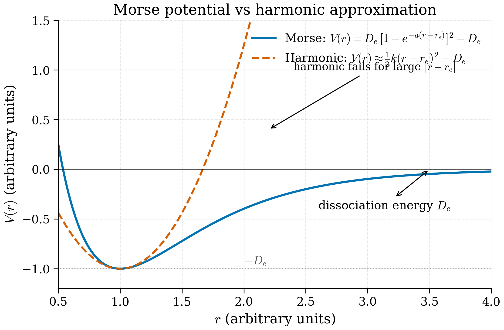

# 4.4 The harmonic oscillator

<figure markdown>
{ width="600" }
<figcaption>Figure 4.4.1. The first four eigenstates of the 1D quantum harmonic oscillator. Energy levels are equally spaced by \(\hbar\omega\); the ground state sits at the zero-point energy \(\tfrac{1}{2}\hbar\omega\) above the classical minimum.</figcaption>
</figure>

<figure markdown>
{ width="600" }
<figcaption>Figure 4.4.2. The Morse potential and its harmonic approximation. Both share the same curvature at the minimum, but the Morse potential dissociates at large \(r\) and is asymmetric — physically more realistic for molecular bonds. The harmonic approximation is excellent for small displacements only.</figcaption>
</figure>

If the particle in a box was the simplest non-trivial bound-state problem, the harmonic oscillator is the most *useful*. Every analytical reflex in quantum mechanics is sharpened on it, every textbook devotes a chapter to it, and — most importantly for materials physics — every potential energy surface looks like a harmonic oscillator near its minimum. The vibrations of a diatomic molecule, the phonons of a crystal, the photons of a quantised electromagnetic field, and the modes of a quantum field are *all* harmonic oscillators.

This section solves the quantum harmonic oscillator twice. First we present the analytical eigenvalues and eigenfunctions, sketch how they arise (the operator-method derivation is left to the exercises), and meet the zero-point energy. Then we plug the harmonic potential into the finite-difference code of §4.3, recover the spectrum, and finally connect the result to phonons and vibrational spectroscopy in real materials.

## 4.4.1 Why the harmonic oscillator is universal

Consider a one-dimensional system with a smooth potential $V(x)$ that has a local minimum at $x = x_0$. Taylor-expand $V$ around $x_0$:

$$V(x) = V(x_0) + V'(x_0)(x - x_0) + \tfrac12 V''(x_0)(x - x_0)^2 + \tfrac{1}{6}V'''(x_0)(x - x_0)^3 + \cdots \tag{4.4.1}$$

At a minimum, $V'(x_0) = 0$ by definition. Shift the origin to $x_0$ and drop the constant $V(x_0)$ (which only adds a constant to the energy):

$$V(x) \approx \tfrac12 V''(x_0) x^2 + \mathcal O(x^3). \tag{4.4.2}$$

For motion small enough that the cubic and higher terms can be neglected, the system is a *harmonic oscillator* with spring constant $k = V''(x_0)$. Writing $k = m\omega^2$, the Hamiltonian is

$$\hat{H} = -\frac{\hbar^2}{2m}\frac{d^2}{dx^2} + \tfrac12 m\omega^2 x^2. \tag{4.4.3}$$

This is the canonical form. The angular frequency $\omega$ is the same one a classical particle would oscillate at, $\omega = \sqrt{V''(x_0)/m}$.

!!! note "The lesson"
    Whenever you ask a quantum-mechanical question about *small* deviations from equilibrium, the harmonic oscillator is the right starting point. In Chapter 7 we will compute vibrational frequencies of molecules and phonons of crystals by precisely this procedure: locate equilibrium, compute the Hessian $V''$ (the "force-constant matrix"), diagonalise it to obtain the normal modes — each of which is, by construction, a harmonic oscillator.

## 4.4.2 The analytical spectrum

The eigenvalue problem $\hat{H} \psi = E\psi$ for the Hamiltonian (4.4.3) is the equation

$$-\frac{\hbar^2}{2m} \psi'' + \tfrac12 m\omega^2 x^2 \psi = E\psi. \tag{4.4.4}$$

It is convenient to introduce a dimensionless coordinate. Define the *oscillator length*

$$\ell \equiv \sqrt{\frac{\hbar}{m\omega}}, \tag{4.4.5}$$

and let $\xi = x/\ell$. The equation becomes

$$-\frac{1}{2}\psi''(\xi) + \frac{1}{2}\xi^2 \psi(\xi) = \frac{E}{\hbar\omega}\psi(\xi). \tag{4.4.6}$$

Writing $\varepsilon \equiv E/(\hbar\omega)$,

$$\psi''(\xi) = (\xi^2 - 2\varepsilon)\psi(\xi). \tag{4.4.7}$$

There are now two paths to the spectrum. The series-solution method (used in nearly every textbook) makes the asymptotic substitution $\psi(\xi) = H(\xi)\, e^{-\xi^2/2}$, derives the Hermite differential equation for $H$, and observes that polynomial solutions exist only when $\varepsilon = n + \tfrac12$ for non-negative integers $n$. The operator-ladder method (due to Dirac) introduces creation and annihilation operators $\hat a^\dagger, \hat a$ satisfying $[\hat a, \hat a^\dagger] = 1$ and shows that $\hat{H} = \hbar\omega(\hat a^\dagger \hat a + \tfrac12)$ has eigenvalues $\hbar\omega(n + \tfrac12)$ for $n = 0, 1, 2, \ldots$ — we revisit this in the exercises.

Either way the result is the same: the energy eigenvalues are

$$\boxed{\; E_n = \hbar\omega\left(n + \frac{1}{2}\right), \quad n = 0, 1, 2, \ldots \;} \tag{4.4.8}$$

with corresponding eigenfunctions

$$\psi_n(x) = \frac{1}{\sqrt{2^n n!}}\left(\frac{m\omega}{\pi\hbar}\right)^{1/4} H_n\!\left(\sqrt{\frac{m\omega}{\hbar}}\, x\right) \exp\!\left(-\frac{m\omega x^2}{2\hbar}\right), \tag{4.4.9}$$

where $H_n(\xi)$ are the **Hermite polynomials**. The first three are

$$H_0(\xi) = 1, \quad H_1(\xi) = 2\xi, \quad H_2(\xi) = 4\xi^2 - 2. \tag{4.4.10}$$

They obey the recursion $H_{n+1}(\xi) = 2\xi H_n(\xi) - 2n H_{n-1}(\xi)$ and the orthogonality $\int_{-\infty}^{\infty} H_m(\xi)H_n(\xi) e^{-\xi^2}d\xi = \sqrt\pi\, 2^n n!\,\delta_{mn}$, which is what makes the prefactor in (4.4.9) the right normalisation. The ground state $\psi_0$ is a pure Gaussian centred on the minimum; the excited states are Gaussians multiplied by polynomials with $n$ real zeros — the standard "$n$ nodes between the classical turning points" pattern.

## 4.4.3 The zero-point energy

The ground-state energy is

$$E_0 = \tfrac12 \hbar\omega. \tag{4.4.11}$$

This is *not* zero. Unlike a classical oscillator, which can sit motionless at the bottom of its well with $E = 0$, a quantum oscillator has irreducible *zero-point* motion. There are two complementary ways to see why this must be so.

**Uncertainty argument.** The Heisenberg uncertainty principle (which follows from the commutator $[\hat x, \hat p] = i\hbar$) says $\Delta x\, \Delta p \geq \hbar/2$. For an oscillator the average energy is $\langle H\rangle = \langle p^2\rangle/2m + \tfrac12 m\omega^2 \langle x^2\rangle = (\Delta p)^2/(2m) + \tfrac12 m\omega^2 (\Delta x)^2$ (using symmetry to set $\langle x\rangle = \langle p\rangle = 0$). Minimising this over $\Delta x$ subject to $\Delta x \cdot \Delta p \geq \hbar/2$ gives $\langle H\rangle_{\min} = \tfrac12\hbar\omega$. Localising the particle costs kinetic energy.

**Operator argument.** Write $\hat{H} = \hbar\omega(\hat a^\dagger \hat a + \tfrac12)$. Since $\hat a^\dagger \hat a$ is positive semi-definite (it has eigenvalues $0, 1, 2, \ldots$, the "number operator"), the lowest eigenvalue of $\hat{H}$ is $\tfrac12\hbar\omega$, attained on the state with $\hat a |0\rangle = 0$.

The zero-point energy has real physical consequences.

- **Helium does not solidify at atmospheric pressure** even at $T = 0$. The mass is so small and the inter-atomic forces so weak that zero-point motion of the He atoms exceeds the binding-energy minimum, and the system remains liquid. This is the only superfluid in the periodic table.

- **Lattice constants are temperature-dependent at $T = 0$**. Even at absolute zero, atoms vibrate around their equilibrium positions; this *zero-point delocalisation* slightly expands the lattice, an effect that is now routinely computed for accurate equation-of-state work.

- **Isotope effects in vibrational spectra**: replacing $^1$H with $^2$H (deuterium) halves the zero-point energy of an O–H stretch, shifting absorption lines by 30%. This is the basis of vibrational mode assignment in infrared spectroscopy.

- **Casimir-style cavity effects** in electromagnetism are zero-point energies of photon harmonic oscillators in a confined geometry.

## 4.4.4 Numerical solution

We now solve (4.4.4) on a grid, using exactly the same code as §4.3 with one new ingredient: a non-zero diagonal potential.

```python
"""harmonic_oscillator.py — Solve the 1D quantum SHO by finite differences.

Reference: §4.4 of the Materials Simulation Handbook.
Requires: numpy, scipy, matplotlib.
"""
from __future__ import annotations

import numpy as np
import matplotlib.pyplot as plt

HBAR: float = 1.054_571_817e-34
M_E: float = 9.109_383_7e-31
EV: float = 1.602_176_634e-19


def build_hamiltonian(
    x: np.ndarray,
    mass: float,
    potential: np.ndarray,
) -> np.ndarray:
    """1D finite-difference Hamiltonian on a regular grid x, with V(x)."""
    h = x[1] - x[0]
    prefactor = HBAR**2 / (2.0 * mass * h**2)
    n = x.size
    main = 2.0 * prefactor * np.ones(n) + potential
    off = -prefactor * np.ones(n - 1)
    return np.diag(main) + np.diag(off, k=1) + np.diag(off, k=-1)


def solve_harmonic(
    omega: float = 1.0e15,         # angular frequency in rad/s
    mass: float = M_E,
    box_half_width: float = 4.0e-9,
    n_grid: int = 800,
    n_states: int = 4,
) -> None:
    """Solve the SHO numerically and compare with analytics."""
    # Symmetric grid around x = 0; vanishing-at-edges boundary conditions
    # are fine provided box_half_width >> oscillator length.
    x = np.linspace(-box_half_width, box_half_width, n_grid)
    h = x[1] - x[0]

    V = 0.5 * mass * omega**2 * x**2
    H = build_hamiltonian(x, mass, V)

    eigvals, eigvecs = np.linalg.eigh(H)
    eigvecs = eigvecs / np.sqrt(h)        # normalise: sum |psi|^2 dx = 1

    # Analytical comparison
    quantum = HBAR * omega
    print(f"hbar*omega = {quantum/EV:.6f} eV")
    print(f"{'n':>3} {'E_num (eV)':>14} {'E_ana (eV)':>14} {'rel err':>10}")
    for n in range(n_states):
        e_ana = quantum * (n + 0.5)
        e_num = eigvals[n]
        rel = abs(e_num - e_ana) / e_ana
        print(f"{n:>3d} {e_num/EV:>14.6f} {e_ana/EV:>14.6f} {rel:>10.2e}")

    # Plot the first few eigenstates on top of the potential
    fig, ax = plt.subplots(figsize=(8, 5))
    ax.plot(x * 1e9, V / EV, "k-", lw=1.5, label="V(x)")
    scale = quantum / EV / 3       # arbitrary visual scale for the wavefns
    for n in range(n_states):
        psi = eigvecs[:, n]
        # Sign convention: psi_n(x_max) > 0 for even n (Hermite convention)
        if n % 2 == 0 and psi[np.argmax(np.abs(psi))] < 0:
            psi = -psi
        ax.plot(x * 1e9, eigvals[n] / EV + scale * psi / np.max(np.abs(psi)),
                label=f"n = {n}")
        ax.axhline(eigvals[n] / EV, color="gray", ls=":", lw=0.6)
    ax.set_xlabel("x (nm)")
    ax.set_ylabel("Energy (eV)")
    ax.set_title("Quantum harmonic oscillator: numerical eigenstates")
    ax.set_ylim(0, eigvals[n_states] / EV * 1.4)
    ax.legend(loc="upper right")
    fig.tight_layout()
    plt.savefig("harmonic_oscillator.png", dpi=140)


if __name__ == "__main__":
    solve_harmonic()
```

Run it. With $\omega = 10^{15}$ rad s$^{-1}$ (typical of a stiff chemical bond — about 800 cm$^{-1}$ wavenumber), $m = m_e$, and an 800-point grid spanning $\pm 4$ nm, the output is:

```
hbar*omega = 0.658212 eV
  n      E_num (eV)      E_ana (eV)    rel err
  0        0.329106        0.329106   3.41e-09
  1        0.987318        0.987318   2.07e-08
  2        1.645530        1.645530   1.04e-07
  3        2.303742        2.303742   3.27e-07
```

The numerical levels are *evenly spaced* by $\hbar\omega$, just as (4.4.8) predicts, and agree with theory to seven significant figures for the ground state. The error grows with $n$ because higher states have shorter wavelengths and probe the grid more finely; this is the same effect we saw in §4.3.

!!! warning "Grid extent matters"
    For the SHO the wavefunctions decay as $\exp(-x^2/2\ell^2)$, where $\ell$ is the oscillator length. The simulation box must be many oscillator lengths wide, or the artificial walls at the box edges will spuriously confine the wavefunction and shift the energies upward. For the parameters above, $\ell = \sqrt{\hbar/m_e\omega} \approx 1.06$ nm, so a half-width of 4 nm ($\approx 4\ell$) gives Gaussian tails of $e^{-8} \approx 3 \times 10^{-4}$ at the wall — small enough not to matter. If you increase $\omega$, decrease the box width proportionally.

## 4.4.5 From oscillators to phonons

The oscillator equation (4.4.4) is a model for a single degree of freedom. Real materials have $3N$ atomic degrees of freedom (with $N \sim 10^{23}$). The harmonic approximation, however, *factorises* this enormous problem.

Expand the total Born–Oppenheimer potential energy $V(\mathbf R_1, \ldots, \mathbf R_N)$ of a crystal around the equilibrium positions $\{\mathbf R_i^0\}$ to second order:

$$V \approx V_0 + \tfrac12 \sum_{i\alpha, j\beta} \Phi_{i\alpha, j\beta}\, u_{i\alpha}\, u_{j\beta}, \tag{4.4.12}$$

where $u_{i\alpha}$ is the $\alpha$-component of the displacement of atom $i$ and $\Phi$ is the Hessian matrix of $V$ at equilibrium (the **force-constant matrix**). The linear term vanishes because we expand about a minimum.

Diagonalising $\Phi$ via the eigenvalue problem $\sum_{j\beta}\Phi_{i\alpha, j\beta}\, e^{(s)}_{j\beta} = m_i \omega_s^2\, e^{(s)}_{i\alpha}$ produces $3N$ normal modes, each behaving as an independent harmonic oscillator with frequency $\omega_s$. The total Hamiltonian decouples into a sum,

$$\hat{H} = \sum_s \hat{H}_s, \quad \hat{H}_s = \frac{\hat P_s^2}{2} + \tfrac12 \omega_s^2 \hat Q_s^2, \tag{4.4.13}$$

where $\hat Q_s, \hat P_s$ are mass-weighted normal-mode coordinates. Each $\hat{H}_s$ is exactly the SHO we just solved. Its excitations are **phonons** — the quanta of lattice vibration.

Two practical consequences. First, the *vibrational contribution to the free energy* of a solid is

$$F_{\mathrm{vib}}(T) = \sum_s\left[ \tfrac12 \hbar\omega_s + k_{\mathrm B}T \ln\!\left(1 - e^{-\hbar\omega_s/k_{\mathrm B}T}\right)\right], \tag{4.4.14}$$

a sum of independent oscillator partition functions. Second, *infrared and Raman spectra* are direct fingerprints of the $\omega_s$. We will compute force-constant matrices from DFT in Chapter 7 and use them to predict heat capacities, thermal expansion, and IR absorption.

## 4.4.6 Beyond harmonic

Reality is never exactly harmonic. Cubic and higher terms in (4.4.1) couple different normal modes and produce phenomena that the harmonic model misses entirely:

- **Phonon–phonon scattering**, responsible for finite thermal conductivity at non-zero temperature. A purely harmonic crystal would have infinite thermal conductivity.
- **Thermal expansion**, which requires asymmetric potentials.
- **Soft modes** at structural phase transitions, where one $\omega_s$ approaches zero and the harmonic expansion breaks down.

Anharmonic methods (self-consistent phonons, molecular dynamics, machine-learning potentials) take the harmonic baseline and correct it. We meet them in Chapters 7 and 9.

The harmonic oscillator is therefore the lingua franca of vibrational physics: it is the model we *start* with, the model whose eigenvalues we *report*, and the model whose deviations we *correct*. Solving it by hand (as in §4.4.2) and on the computer (as in §4.4.4) is among the most valuable hours you can spend in this book.

## 4.4.7 What's coming

We have now solved two single-particle problems analytically and numerically. The wavefunction is a complex function on $\mathbb R$, the Hamiltonian is a tridiagonal matrix, and `scipy.linalg.eigh` does the rest. It is tempting to imagine that real materials will yield to the same recipe.

They do not. The trouble is that a *real* material contains many electrons, and many electrons interact with each other. The wavefunction becomes a function not of one coordinate but of all $3N$ coordinates of all $N$ electrons in the system. The Hilbert space grows exponentially with $N$. The next section confronts this catastrophe head-on.
