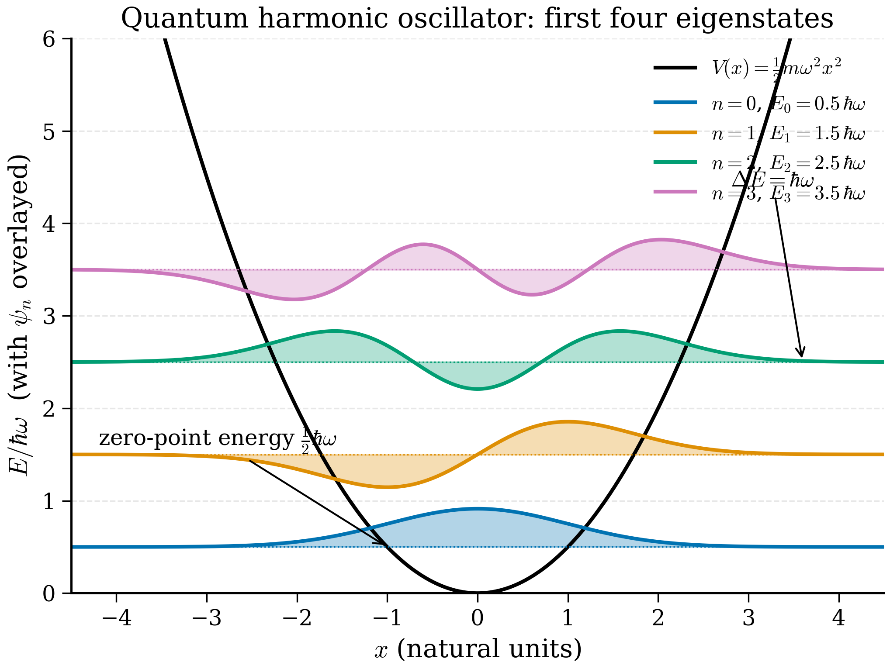

# 4.4 The harmonic oscillator

<figure markdown>
{ width="600" }
<figcaption>Figure 4.4.1. The first four eigenstates of the 1D quantum harmonic oscillator. Energy levels are equally spaced by \(\hbar\omega\); the ground state sits at the zero-point energy \(\tfrac{1}{2}\hbar\omega\) above the classical minimum.</figcaption>
</figure>

<figure markdown>
{ width="600" }
<figcaption>Figure 4.4.2. The Morse potential and its harmonic approximation. Both share the same curvature at the minimum, but the Morse potential dissociates at large \(r\) and is asymmetric — physically more realistic for molecular bonds. The harmonic approximation is excellent for small displacements only.</figcaption>
</figure>

If the particle in a box was the simplest non-trivial bound-state problem, the harmonic oscillator is the most *useful*. Every analytical reflex in quantum mechanics is sharpened on it, every textbook devotes a chapter to it, and — most importantly for materials physics — every potential energy surface looks like a harmonic oscillator near its minimum. The vibrations of a diatomic molecule, the phonons of a crystal, the photons of a quantised electromagnetic field, and the modes of a quantum field are *all* harmonic oscillators.

This section solves the quantum harmonic oscillator twice. First we present the analytical eigenvalues and eigenfunctions, sketch how they arise (the operator-method derivation is left to the exercises), and meet the zero-point energy. Then we plug the harmonic potential into the finite-difference code of §4.3, recover the spectrum, and finally connect the result to phonons and vibrational spectroscopy in real materials.

!!! info "What problem are we solving?"
    A ball in a bowl, two atoms joined by a stiff bond, an atom in a crystal held in place by its neighbours — all of these sit near the bottom of an energy valley and wobble. We want the *quantum* description of that wobble: which vibration energies are allowed, what the corresponding wavefunctions look like, and how much energy the system keeps even when we cool it to absolute zero. Because *every* smooth energy valley looks like a parabola near its lowest point (we show this in Section 4.4.1), solving this one model solves, to a first approximation, the vibrations of every molecule and every solid.

!!! note "Physical picture"
    Think of a single atom on the end of a spring. Classically you could leave it dead still at the bottom of the well with zero energy. Quantum mechanics forbids this: pinning the atom exactly at the bottom would pin its position perfectly, and the uncertainty principle then forces a huge spread in momentum, costing kinetic energy. The compromise is a fuzzy, jittering ground state with a small but unavoidable energy — the *zero-point energy*. Add energy and the atom climbs to higher rungs of a ladder whose steps are all the same height, $\hbar\omega$. Each step up is one *quantum* of vibration; in a crystal that quantum is called a [phonon](../undergraduate/glossary-for-beginners.md).

!!! tip "New vocabulary"
    - **Harmonic oscillator** — any system whose restoring force grows linearly with displacement (a spring, $F=-kx$), so its potential energy is a parabola $\tfrac12 kx^2$.
    - **Zero-point energy** — the energy $\tfrac12\hbar\omega$ that the quantum oscillator keeps even in its lowest state; it is real and measurable, not a bookkeeping constant.
    - **Phonon** — one quantum of lattice vibration; the crystal version of the "step up the ladder". See the [beginner glossary](../undergraduate/glossary-for-beginners.md).
    - **Ladder / creation / annihilation operators** — algebraic tools $\hat a^\dagger,\hat a$ that move the oscillator up or down one rung. Defined in full in Section 4.4.2.
    - **Hermite polynomials** — the polynomials $H_n$ that decorate the Gaussian to build the excited-state wavefunctions.

    For [operator](../undergraduate/glossary-for-beginners.md), [eigenvalue](../undergraduate/glossary-for-beginners.md), [eigenvector](../undergraduate/glossary-for-beginners.md), [Hamiltonian](../undergraduate/glossary-for-beginners.md) and [wavefunction](../undergraduate/glossary-for-beginners.md), see the beginner glossary rather than re-reading definitions here.

This whole section uses a handful of symbols repeatedly. Keep this table beside you.

| Symbol | Meaning | Units (SI) |
|---|---|---|
| $m$ | mass of the oscillating particle | kg |
| $\omega$ | classical angular frequency, $\omega=\sqrt{k/m}$ | rad s$^{-1}$ (i.e. s$^{-1}$) |
| $k=m\omega^2$ | spring constant (curvature of the well, $V''$) | J m$^{-2}$ = N m$^{-1}$ |
| $\hat x,\hat p$ | position and momentum operators, $[\hat x,\hat p]=i\hbar$ | m, kg m s$^{-1}$ |
| $\ell=\sqrt{\hbar/m\omega}$ | oscillator length (width of the ground state) | m |
| $\xi=x/\ell$ | dimensionless position | — |
| $\varepsilon=E/\hbar\omega$ | dimensionless energy | — |
| $n$ | quantum number / number of quanta, $n=0,1,2,\dots$ | — |
| $E_n=\hbar\omega(n+\tfrac12)$ | $n$-th energy level | J |
| $\hat a,\hat a^\dagger$ | annihilation, creation operators | — (dimensionless) |
| $\hat N=\hat a^\dagger\hat a$ | number operator, eigenvalue $n$ | — |
| $H_n(\xi)$ | Hermite polynomial of degree $n$ | — |

## 4.4.1 Why the harmonic oscillator is universal

Consider a one-dimensional system with a smooth potential $V(x)$ that has a local minimum at $x = x_0$. Taylor-expand $V$ around $x_0$:

$$V(x) = V(x_0) + V'(x_0)(x - x_0) + \tfrac12 V''(x_0)(x - x_0)^2 + \tfrac{1}{6}V'''(x_0)(x - x_0)^3 + \cdots \tag{4.4.1}$$

At a minimum, $V'(x_0) = 0$ by definition. Shift the origin to $x_0$ and drop the constant $V(x_0)$ (which only adds a constant to the energy):

$$V(x) \approx \tfrac12 V''(x_0) x^2 + \mathcal O(x^3). \tag{4.4.2}$$

For motion small enough that the cubic and higher terms can be neglected, the system is a *harmonic oscillator* with spring constant $k = V''(x_0)$. Writing $k = m\omega^2$, the Hamiltonian is

$$\hat{H} = -\frac{\hbar^2}{2m}\frac{d^2}{dx^2} + \tfrac12 m\omega^2 x^2. \tag{4.4.3}$$

This is the canonical form. The angular frequency $\omega$ is the same one a classical particle would oscillate at, $\omega = \sqrt{V''(x_0)/m}$.

!!! note "The lesson"
    Whenever you ask a quantum-mechanical question about *small* deviations from equilibrium, the harmonic oscillator is the right starting point. In Chapter 7 we will compute vibrational frequencies of molecules and phonons of crystals by precisely this procedure: locate equilibrium, compute the Hessian $V''$ (the "force-constant matrix"), diagonalise it to obtain the normal modes — each of which is, by construction, a harmonic oscillator.

### Natural units by dimensional analysis

Before diving into the eigenvalue problem it is worth asking: what are the natural length, momentum and energy scales of the Hamiltonian (4.4.3)? The parameters available are $\hbar$ (J s), $m$ (kg), and $\omega$ (s$^{-1}$). There is a unique length, momentum and energy formable from these:

$$x_0 \equiv \sqrt{\frac{\hbar}{m\omega}}, \qquad p_0 \equiv \sqrt{\hbar m \omega}, \qquad E_0 \equiv \hbar\omega. \tag{4.4.D1}$$

!!! note "Why this step? — building scales by dimensional analysis"
    We need $[x_0] = $ m. From $\hbar$ (units kg m$^2$ s$^{-1}$), $m$ (kg) and $\omega$ (s$^{-1}$), the combination with units of m$^2$ is $\hbar/(m\omega)$; take the square root for a length. Repeat for $p_0$ (units kg m s$^{-1}$) and $E_0$ (units kg m$^2$ s$^{-2}$). The check $x_0 p_0 = \sqrt{(\hbar/m\omega)(\hbar m\omega)} = \hbar$ shows that position and momentum scales saturate the Heisenberg uncertainty product. The HO ground state will indeed be a *minimum-uncertainty wavepacket* — a sharper version of the result we just saw for the particle in a box.

For an oscillating diatomic molecule with $\omega \sim 10^{14}$ rad/s and reduced mass $m \sim 1$ amu, $x_0 \sim 0.3$ Å — the same order as a chemical bond length. For an electron in a magnetic field oscillating at the cyclotron frequency $\omega_c = eB/m$ with $B = 1$ T, $\omega_c \approx 1.8\times 10^{11}$ s$^{-1}$ and $x_0 \approx 26$ nm — the magnetic length. The HO length sets the spatial scale of the wavefunction. Every numerical SHO calculation must put its simulation box at "many $x_0$" or the wavefunction will be clipped at the walls.

## 4.4.2 The analytical spectrum

The eigenvalue problem $\hat{H} \psi = E\psi$ for the Hamiltonian (4.4.3) is the equation

$$-\frac{\hbar^2}{2m} \psi'' + \tfrac12 m\omega^2 x^2 \psi = E\psi. \tag{4.4.4}$$

It is convenient to introduce a dimensionless coordinate. Define the *oscillator length*

$$\ell \equiv \sqrt{\frac{\hbar}{m\omega}}, \tag{4.4.5}$$

and let $\xi = x/\ell$. The equation becomes

$$-\frac{1}{2}\psi''(\xi) + \frac{1}{2}\xi^2 \psi(\xi) = \frac{E}{\hbar\omega}\psi(\xi). \tag{4.4.6}$$

??? note "Full derivation: from (4.4.4) to the dimensionless equation (4.4.6)"
    The aim is to scrub every dimensional constant out of (4.4.4) by measuring length in units of $\ell$. Substitute $x=\ell\,\xi$, so $\psi(x)=\psi(\ell\xi)$. We must convert the two $x$-dependent pieces.

    **The kinetic term.** By the chain rule, each derivative with respect to $x$ brings down a factor $1/\ell$:
    $$\frac{d}{dx}=\frac{d\xi}{dx}\frac{d}{d\xi}=\frac{1}{\ell}\frac{d}{d\xi},\qquad \frac{d^2}{dx^2}=\frac{1}{\ell^2}\frac{d^2}{d\xi^2}.$$
    Hence
    $$-\frac{\hbar^2}{2m}\,\frac{d^2\psi}{dx^2}=-\frac{\hbar^2}{2m\ell^2}\,\psi''(\xi).$$
    Now insert $\ell^2=\hbar/(m\omega)$, so $m\ell^2=\hbar/\omega$ and
    $$\frac{\hbar^2}{2m\ell^2}=\frac{\hbar^2}{2}\cdot\frac{\omega}{\hbar}=\frac{\hbar\omega}{2}.$$
    The kinetic term is therefore $-\tfrac12\hbar\omega\,\psi''(\xi)$.

    **The potential term.** With $x^2=\ell^2\xi^2$,
    $$\tfrac12 m\omega^2 x^2\psi=\tfrac12 m\omega^2\ell^2\,\xi^2\psi.$$
    Insert $\ell^2=\hbar/(m\omega)$ so that $m\omega^2\ell^2=m\omega^2\cdot\hbar/(m\omega)=\hbar\omega$. The potential term is $\tfrac12\hbar\omega\,\xi^2\psi(\xi)$.

    **Putting it together.** Equation (4.4.4) becomes
    $$-\tfrac12\hbar\omega\,\psi''(\xi)+\tfrac12\hbar\omega\,\xi^2\psi(\xi)=E\,\psi(\xi).$$
    Divide every term by $\hbar\omega$ to land exactly on (4.4.6). Notice the single energy scale $\hbar\omega$ has factored out of the *whole* problem — that is what dimensional analysis promised.

Writing $\varepsilon \equiv E/(\hbar\omega)$,

$$\psi''(\xi) = (\xi^2 - 2\varepsilon)\psi(\xi). \tag{4.4.7}$$

??? note "Full derivation: rearranging (4.4.6) into (4.4.7)"
    Start from (4.4.6) and put $\varepsilon=E/\hbar\omega$, so the right-hand side is $\varepsilon\,\psi$:
    $$-\tfrac12\psi''+\tfrac12\xi^2\psi=\varepsilon\psi.$$
    Multiply through by $-2$:
    $$\psi''-\xi^2\psi=-2\varepsilon\psi.$$
    Move the $\psi$ terms to the right:
    $$\psi''=\xi^2\psi-2\varepsilon\psi=(\xi^2-2\varepsilon)\psi,$$
    which is (4.4.7). This is the form we attack next, either by series (the Hermite route) or by operators (the ladder route).

There are now two paths to the spectrum. The series-solution method (used in nearly every textbook) makes the asymptotic substitution $\psi(\xi) = H(\xi)\, e^{-\xi^2/2}$, derives the Hermite differential equation for $H$, and observes that polynomial solutions exist only when $\varepsilon = n + \tfrac12$ for non-negative integers $n$. The operator-ladder method (due to Dirac) introduces creation and annihilation operators $\hat a^\dagger, \hat a$ satisfying $[\hat a, \hat a^\dagger] = 1$ and shows that $\hat{H} = \hbar\omega(\hat a^\dagger \hat a + \tfrac12)$ has eigenvalues $\hbar\omega(n + \tfrac12)$ for $n = 0, 1, 2, \ldots$

!!! note "Plain-language version of the ladder method"
    The ladder method never solves a differential equation. Instead it repackages position and momentum into two new objects, $\hat a$ (lowers the energy by one rung) and $\hat a^\dagger$ (raises it by one rung). Three facts then do all the work:

    1. the Hamiltonian is, up to a shift, just "count the rungs" — $\hat H=\hbar\omega(\hat N+\tfrac12)$ where $\hat N$ counts;
    2. you cannot have a negative number of rungs, because $\hat N$ can never give a negative expectation value;
    3. therefore the ladder has a bottom rung, $|0\rangle$, with $\hat a|0\rangle=0$, and every other state is reached by climbing up with $\hat a^\dagger$.

    From those three facts the entire spectrum $E_n=\hbar\omega(n+\tfrac12)$ drops out with no calculus at all. The rest of this subsection is just making each fact precise.

!!! example "Step-by-step: how the ladder method reaches $E_n=\hbar\omega(n+\tfrac12)$"
    1. **Non-dimensionalise.** Replace $\hat x,\hat p$ by dimensionless $\hat X=\hat x/x_0$, $\hat P=\hat p\,x_0/\hbar$. Then $[\hat X,\hat P]=i$ and $\hat H=\tfrac12\hbar\omega(\hat P^2+\hat X^2)$.
    2. **Define the ladder operators** $\hat a=\tfrac{1}{\sqrt2}(\hat X+i\hat P)$ and $\hat a^\dagger=\tfrac{1}{\sqrt2}(\hat X-i\hat P)$ — see (4.4.L1).
    3. **Get the key commutator** $[\hat a,\hat a^\dagger]=1$ from $[\hat X,\hat P]=i$.
    4. **Rewrite the Hamiltonian** as $\hat H=\hbar\omega(\hat N+\tfrac12)$ with $\hat N=\hat a^\dagger\hat a$ — eq. (4.4.L2).
    5. **Show $\hat a$ steps down and $\hat a^\dagger$ steps up** by computing $\hat N(\hat a|\nu\rangle)=(\nu-1)\hat a|\nu\rangle$.
    6. **Bound the ladder from below** using $\langle\hat N\rangle=\|\hat a|\psi\rangle\|^2\ge 0$, forcing a bottom rung $|0\rangle$ with $\hat a|0\rangle=0$ at $\nu=0$.
    7. **Read off the spectrum**: $\hat N|n\rangle=n|n\rangle$, so $E_n=\hbar\omega(n+\tfrac12)$.

    Each numbered step is carried out explicitly below; the worked algebra is in the collapsible boxes.

### The ladder method in full

The operator approach is elegant enough — and useful enough downstream, when we quantise fields and phonons — that we work it through completely here. Introduce the dimensionless position and momentum operators

$$\hat X \equiv \hat x/x_0, \qquad \hat P \equiv \hat p\, x_0/\hbar.$$

These satisfy $[\hat X, \hat P] = i$, by direct substitution into $[\hat x, \hat p] = i\hbar$. Explicitly, since a commutator is bilinear and the scalars $1/x_0$ and $x_0/\hbar$ pull straight out,
$$[\hat X,\hat P]=\Big[\frac{\hat x}{x_0},\frac{\hat p\,x_0}{\hbar}\Big]=\frac{1}{x_0}\cdot\frac{x_0}{\hbar}\,[\hat x,\hat p]=\frac{1}{\hbar}\,(i\hbar)=i.$$
The Hamiltonian (4.4.3) becomes

$$\hat H = \frac{\hbar\omega}{2}\left(\hat P^2 + \hat X^2\right).$$

??? note "Full derivation: (4.4.3) written in dimensionless operators"
    Start from $\hat H=\dfrac{\hat p^2}{2m}+\tfrac12 m\omega^2\hat x^2$ and substitute $\hat x=x_0\hat X$, $\hat p=(\hbar/x_0)\hat P$, with the natural scales $x_0=\sqrt{\hbar/m\omega}$ and $p_0=\hbar/x_0=\sqrt{\hbar m\omega}$ from (4.4.D1).

    **Kinetic part.**
    $$\frac{\hat p^2}{2m}=\frac{(\hbar/x_0)^2}{2m}\hat P^2=\frac{\hbar^2}{2m x_0^2}\hat P^2.$$
    With $x_0^2=\hbar/m\omega$ we get $m x_0^2=\hbar/\omega$, so $\dfrac{\hbar^2}{2m x_0^2}=\dfrac{\hbar^2\omega}{2\hbar}=\dfrac{\hbar\omega}{2}$. The kinetic term is $\tfrac12\hbar\omega\,\hat P^2$.

    **Potential part.**
    $$\tfrac12 m\omega^2\hat x^2=\tfrac12 m\omega^2 x_0^2\,\hat X^2.$$
    With $m x_0^2=\hbar/\omega$ this is $\tfrac12 m\omega^2 x_0^2=\tfrac12\omega^2\cdot(\hbar/\omega)=\tfrac12\hbar\omega$, giving $\tfrac12\hbar\omega\,\hat X^2$.

    Adding the two parts,
    $$\hat H=\frac{\hbar\omega}{2}\big(\hat P^2+\hat X^2\big),$$
    as claimed. The two scales are tuned so that both terms carry the *same* prefactor $\tfrac12\hbar\omega$ — the symmetric form that the ladder operators are designed to exploit.

Now define the **annihilation** and **creation** operators

$$\boxed{\;\hat a \equiv \frac{1}{\sqrt 2}(\hat X + i\hat P), \qquad \hat a^\dagger \equiv \frac{1}{\sqrt 2}(\hat X - i\hat P).\;} \tag{4.4.L1}$$

Both are non-Hermitian; $\hat a$ and $\hat a^\dagger$ are adjoints of each other. Their commutator is

$$[\hat a, \hat a^\dagger] = \tfrac12[(\hat X + i\hat P), (\hat X - i\hat P)] = \tfrac12(-i[\hat X, \hat P] + i[\hat P, \hat X]) = -i\cdot i = 1.$$

!!! note "Why this step?"
    The cross-terms in $[\hat X + i\hat P, \hat X - i\hat P]$ are $-i[\hat X, \hat P] + i[\hat P, \hat X] = -i(i) + i(-i) = 1 + 1 = 2$, divided by 2 gives 1. The non-trivial commutator $[\hat a, \hat a^\dagger] = 1$ is the algebraic statement of canonical quantisation, recast in a basis where the Hamiltonian becomes diagonal.

The Hamiltonian factorises:

$$\hat a^\dagger \hat a = \tfrac12 (\hat X - i\hat P)(\hat X + i\hat P) = \tfrac12(\hat X^2 + \hat P^2 + i[\hat X, \hat P]) = \tfrac12(\hat X^2 + \hat P^2) - \tfrac12,$$

so

$$\hat H = \hbar\omega\,(\hat a^\dagger \hat a + \tfrac12) \equiv \hbar\omega\,(\hat N + \tfrac12), \tag{4.4.L2}$$

where $\hat N \equiv \hat a^\dagger \hat a$ is the **number operator**.

Now the algebra does the work. If $|\nu\rangle$ is an eigenstate of $\hat N$ with eigenvalue $\nu$, then so are $\hat a|\nu\rangle$ and $\hat a^\dagger|\nu\rangle$, with eigenvalues $\nu - 1$ and $\nu + 1$ respectively:

$$\hat N \hat a|\nu\rangle = \hat a^\dagger \hat a \hat a|\nu\rangle = (\hat a\hat a^\dagger - 1)\hat a|\nu\rangle = \hat a(\hat N - 1)|\nu\rangle = (\nu - 1)\hat a|\nu\rangle.$$

??? note "Why this step? — unpacking the lowering identity"
    The only trick in that one line is to slide $\hat N=\hat a^\dagger\hat a$ past the extra $\hat a$ using the commutator. Reading the chain left to right:

    - $\hat N\hat a=\hat a^\dagger\hat a\,\hat a$ — just the definition $\hat N=\hat a^\dagger\hat a$.
    - Replace the leftmost $\hat a^\dagger\hat a$ using $[\hat a,\hat a^\dagger]=1\Rightarrow \hat a^\dagger\hat a=\hat a\hat a^\dagger-1$. So $\hat a^\dagger\hat a\,\hat a=(\hat a\hat a^\dagger-1)\hat a$.
    - Expand: $(\hat a\hat a^\dagger-1)\hat a=\hat a\,\hat a^\dagger\hat a-\hat a=\hat a(\hat N-1)$.
    - Act on the eigenstate: $\hat a(\hat N-1)|\nu\rangle=\hat a(\nu-1)|\nu\rangle=(\nu-1)\,\hat a|\nu\rangle$, since $\nu-1$ is just a number.

    Conclusion: $\hat a|\nu\rangle$ is an eigenstate of $\hat N$ with eigenvalue $\nu-1$ — one rung lower. The identical calculation with $\hat a^\dagger$ (using $\hat a\hat a^\dagger=\hat N+1$) gives $\hat N\hat a^\dagger|\nu\rangle=(\nu+1)\hat a^\dagger|\nu\rangle$ — one rung higher.

So $\hat a$ lowers the eigenvalue by one quantum, and $\hat a^\dagger$ raises it by one. But $\hat N$ is positive semi-definite: for any $|\psi\rangle$, $\langle\psi|\hat N|\psi\rangle = \langle\psi|\hat a^\dagger \hat a|\psi\rangle = \|\hat a|\psi\rangle\|^2 \geq 0$. The descending ladder $|\nu\rangle, |\nu - 1\rangle, |\nu - 2\rangle, \ldots$ must therefore terminate, which happens if and only if $\nu$ is a non-negative integer and there exists a state $|0\rangle$ annihilated by $\hat a$:

$$\hat a |0\rangle = 0. \tag{4.4.L3}$$

??? note "Why must the ladder stop, and stop at an integer?"
    Suppose $\nu$ were *not* an integer. Apply $\hat a$ repeatedly: $|\nu\rangle\to|\nu-1\rangle\to|\nu-2\rangle\to\cdots$, generating eigenvalues $\nu,\nu-1,\nu-2,\dots$ that march downward forever, eventually becoming negative. But step 6 showed $\langle\hat N\rangle\ge 0$ always, so a *negative* eigenvalue is impossible — contradiction. The only escape is that the descent halts: at some rung the next application of $\hat a$ gives the zero vector rather than a new state. Call that rung $|0\rangle$; it satisfies $\hat a|0\rangle=0$, and its eigenvalue is $\langle 0|\hat N|0\rangle=\|\hat a|0\rangle\|^2=0$. Climbing back up in integer steps from $\nu=0$ shows every allowed eigenvalue is a non-negative integer $n=0,1,2,\dots$. (If the descent did *not* terminate cleanly — if $\hat a|0\rangle\ne 0$ at $\nu=0$ — we would reach $\nu=-1<0$, again forbidden. So termination at exactly $\nu=0$ is forced.)

The full spectrum is $\hat N|n\rangle = n|n\rangle$ for $n = 0, 1, 2, \ldots$, and from (4.4.L2),

$$E_n = \hbar\omega(n + \tfrac12). \quad\checkmark$$

We have recovered (4.4.8) without ever solving the differential equation.

The ground-state wavefunction follows from (4.4.L3) in position representation: $\hat a |0\rangle = \tfrac{1}{\sqrt 2}(\hat X + i\hat P)|0\rangle = 0$ becomes $(\xi + \partial_\xi)\psi_0 = 0$, with solution $\psi_0(\xi) \propto e^{-\xi^2/2}$ — a Gaussian, in agreement with (4.4.9). Excited states are generated by $|n\rangle = (\hat a^\dagger)^n/\sqrt{n!}\;|0\rangle$, which automatically produces the Hermite polynomials.

??? note "Full derivation: the Gaussian ground state and its normalisation"
    **From operator to differential equation.** In the position representation, $\hat X=\xi$ (multiply by $\xi$) and $\hat P=-i\,\partial_\xi$ (because $\hat P=\hat p\,x_0/\hbar=-i\,\partial_x\,x_0=-i\,\partial_\xi$). Then $\hat a=\tfrac{1}{\sqrt2}(\hat X+i\hat P)$ acting on $\psi_0(\xi)$ gives
    $$\hat a\psi_0=\frac{1}{\sqrt2}\big(\xi+i(-i\,\partial_\xi)\big)\psi_0=\frac{1}{\sqrt2}\big(\xi+\partial_\xi\big)\psi_0.$$
    Setting this to zero (eq. 4.4.L3) gives the first-order ODE
    $$\frac{d\psi_0}{d\xi}=-\xi\,\psi_0.$$

    **Solve it.** Separate variables: $d\psi_0/\psi_0=-\xi\,d\xi$, integrate to $\ln\psi_0=-\tfrac12\xi^2+\text{const}$, so
    $$\psi_0(\xi)=A\,e^{-\xi^2/2}.$$
    This is a Gaussian — the promised ground state. Restoring $\xi=x/\ell$ with $\ell=\sqrt{\hbar/m\omega}$,
    $$\psi_0(x)=A\,\exp\!\Big(-\frac{x^2}{2\ell^2}\Big)=A\,\exp\!\Big(-\frac{m\omega x^2}{2\hbar}\Big),$$
    matching the exponential in (4.4.9).

    **Normalise.** Demand $\int_{-\infty}^{\infty}|\psi_0|^2\,dx=1$. Using the standard Gaussian integral $\int_{-\infty}^{\infty}e^{-x^2/\ell^2}\,dx=\ell\sqrt{\pi}$,
    $$1=|A|^2\int_{-\infty}^{\infty}e^{-x^2/\ell^2}\,dx=|A|^2\,\ell\sqrt{\pi}\quad\Rightarrow\quad A=\big(\ell\sqrt{\pi}\big)^{-1/2}=\Big(\frac{m\omega}{\pi\hbar}\Big)^{1/4}.$$
    The last step uses $\ell^{-1/2}=(m\omega/\hbar)^{1/4}$ and $\pi^{-1/4}$. Hence
    $$\boxed{\;\psi_0(x)=\Big(\frac{m\omega}{\pi\hbar}\Big)^{1/4}\exp\!\Big(-\frac{m\omega x^2}{2\hbar}\Big)\;}$$
    which is exactly (4.4.9) at $n=0$ (recall $H_0=1$ and $2^0 0!=1$).

    **Climbing the ladder.** Excited states come from $|n\rangle=(\hat a^\dagger)^n|0\rangle/\sqrt{n!}$. In position space $\hat a^\dagger=\tfrac{1}{\sqrt2}(\xi-\partial_\xi)$, and each application of $(\xi-\partial_\xi)$ to a Gaussian-times-polynomial returns a Gaussian times a polynomial of one higher degree — precisely the Hermite polynomials. The $\sqrt{n!}$ and the $2^{-n/2}$ from the $n$ factors of $1/\sqrt2$ combine to give the prefactor $1/\sqrt{2^n n!}$ in (4.4.9).

    *Why $\sqrt{n!}$?* Applying $\hat a^\dagger$ to a normalised $|n\rangle$ does not give a normalised state: one finds $\hat a^\dagger|n\rangle=\sqrt{n+1}\,|n+1\rangle$ (and $\hat a|n\rangle=\sqrt{n}\,|n-1\rangle$). Building up from $|0\rangle$ therefore accumulates a factor $\sqrt{1}\cdot\sqrt{2}\cdots\sqrt{n}=\sqrt{n!}$, which the $1/\sqrt{n!}$ exactly cancels so that $\langle n|n\rangle=1$.

!!! tip "Why ladder operators matter beyond the SHO"
    Every quantised harmonic system — phonons in a crystal, photons in a cavity, magnons in a magnet, plasmons in a metal — has the same algebraic structure: a creation operator that adds one quantum and an annihilation operator that removes one. The state with $n$ quanta is $(\hat a^\dagger)^n|0\rangle/\sqrt{n!}$. Quantum field theory is, in a precise sense, just a great many coupled oscillators with this ladder structure. The few pages of algebra you just read are the seed of an enormous tree.

Either way the result is the same: the energy eigenvalues are

$$\boxed{\; E_n = \hbar\omega\left(n + \frac{1}{2}\right), \quad n = 0, 1, 2, \ldots \;} \tag{4.4.8}$$

with corresponding eigenfunctions

$$\psi_n(x) = \frac{1}{\sqrt{2^n n!}}\left(\frac{m\omega}{\pi\hbar}\right)^{1/4} H_n\!\left(\sqrt{\frac{m\omega}{\hbar}}\, x\right) \exp\!\left(-\frac{m\omega x^2}{2\hbar}\right), \tag{4.4.9}$$

where $H_n(\xi)$ are the **Hermite polynomials**. The first three are

$$H_0(\xi) = 1, \quad H_1(\xi) = 2\xi, \quad H_2(\xi) = 4\xi^2 - 2. \tag{4.4.10}$$

They obey the recursion $H_{n+1}(\xi) = 2\xi H_n(\xi) - 2n H_{n-1}(\xi)$ and the orthogonality $\int_{-\infty}^{\infty} H_m(\xi)H_n(\xi) e^{-\xi^2}d\xi = \sqrt\pi\, 2^n n!\,\delta_{mn}$, which is what makes the prefactor in (4.4.9) the right normalisation. The ground state $\psi_0$ is a pure Gaussian centred on the minimum; the excited states are Gaussians multiplied by polynomials with $n$ real zeros — the standard "$n$ nodes between the classical turning points" pattern.

!!! example "Minimal example: the first three wavefunctions, written out"
    Putting $H_0,H_1,H_2$ from (4.4.10) into (4.4.9), with $\xi=x/\ell$ and $\ell=\sqrt{\hbar/m\omega}$, gives (writing $N\equiv(m\omega/\pi\hbar)^{1/4}$):
    $$\psi_0(x)=N\,e^{-\xi^2/2},\qquad \psi_1(x)=N\,\frac{1}{\sqrt2}\,(2\xi)\,e^{-\xi^2/2}=N\sqrt2\,\xi\,e^{-\xi^2/2},$$
    $$\psi_2(x)=N\,\frac{1}{\sqrt{2^2\cdot 2!}}\,(4\xi^2-2)\,e^{-\xi^2/2}=\frac{N}{\sqrt2}\,(2\xi^2-1)\,e^{-\xi^2/2}.$$
    Count the zeros: $\psi_0$ has none, $\psi_1$ has one (at $\xi=0$), $\psi_2$ has two (at $\xi=\pm1/\sqrt2$). The number of nodes equals $n$ — the same nodal counting we met for the particle in a box (Section 4.3), and a general feature of one-dimensional bound states.

??? note "Hint: a roadmap for the series (Hermite) route"
    The page states the series route in one sentence. If you want to reproduce it yourself, here is the ladder of moves — try each before reading the next.

    1. **Tame the large-$\xi$ behaviour first.** For $|\xi|\to\infty$ the $2\varepsilon$ in (4.4.7) is negligible next to $\xi^2$, so $\psi''\approx\xi^2\psi$. Check that $\psi\sim e^{\pm\xi^2/2}$ solves this asymptotically (differentiate twice and keep the leading term). The growing branch $e^{+\xi^2/2}$ is not normalisable, so peel off the decaying one: write $\psi(\xi)=H(\xi)\,e^{-\xi^2/2}$.
    2. **Substitute and simplify.** Put this form into (4.4.7). Using $\psi'=(H'-\xi H)e^{-\xi^2/2}$ and $\psi''=(H''-2\xi H'+(\xi^2-1)H)e^{-\xi^2/2}$, the $\xi^2 H$ pieces cancel and you are left with the **Hermite equation**
       $$H''-2\xi H'+(2\varepsilon-1)H=0.$$
    3. **Try a power series** $H(\xi)=\sum_{k\ge 0} c_k\,\xi^k$. Match powers of $\xi^k$ to get the two-term **recurrence**
       $$c_{k+2}=\frac{2k-(2\varepsilon-1)}{(k+1)(k+2)}\,c_k.$$
    4. **Demand normalisability.** For large $k$ the recurrence behaves like $c_{k+2}/c_k\to 2/k$, the coefficients of $e^{\xi^2}$ — so an *infinite* series reproduces the bad growing exponential. The series must therefore **terminate**: some $c_{k+2}=0$, which needs the numerator to vanish, $2k-(2\varepsilon-1)=0$, i.e. $\varepsilon=k+\tfrac12$.
    5. **Read off quantisation.** Writing $n$ for the terminating index, $\varepsilon=n+\tfrac12$, hence $E_n=\hbar\omega(n+\tfrac12)$ — the *same* spectrum the ladder method gave. The terminating polynomial is $H_n$.

    Either route lands on (4.4.8); the ladder method is shorter, the series method shows explicitly *why* the wavefunctions are Gaussian-times-polynomial.

!!! example "Worked example: a $\langle x^2\rangle$ check and the virial theorem"
    A good way to test that you trust (4.4.9) is to compute the spread of the ground state and confirm it gives the right energy. Using $\langle x^2\rangle=\int x^2|\psi_0|^2\,dx$ with the Gaussian integral $\int x^2 e^{-x^2/\ell^2}\,dx=\tfrac12\ell^3\sqrt\pi$,
    $$\langle x^2\rangle_0=\frac{1}{\ell\sqrt\pi}\int_{-\infty}^{\infty}x^2 e^{-x^2/\ell^2}\,dx=\frac{1}{\ell\sqrt\pi}\cdot\frac{\ell^3\sqrt\pi}{2}=\frac{\ell^2}{2}=\frac{\hbar}{2m\omega}.$$
    So the mean potential energy is
    $$\langle V\rangle_0=\tfrac12 m\omega^2\langle x^2\rangle_0=\tfrac12 m\omega^2\cdot\frac{\hbar}{2m\omega}=\tfrac14\hbar\omega,$$
    exactly *half* the ground-state energy $E_0=\tfrac12\hbar\omega$. The other half must be kinetic, $\langle T\rangle_0=\tfrac14\hbar\omega$ — which is the **virial theorem** for a quadratic potential ($\langle T\rangle=\langle V\rangle$). The general result, true for every level, is $\langle x^2\rangle_n=(n+\tfrac12)\,\ell^2=(2n+1)\dfrac{\hbar}{2m\omega}$, so the wavefunction widens as $\sqrt{n+\tfrac12}$ as you climb the ladder.

## 4.4.3 The zero-point energy

The ground-state energy is

$$E_0 = \tfrac12 \hbar\omega. \tag{4.4.11}$$

This is *not* zero. Unlike a classical oscillator, which can sit motionless at the bottom of its well with $E = 0$, a quantum oscillator has irreducible *zero-point* motion. There are two complementary ways to see why this must be so.

**Uncertainty argument.** The Heisenberg uncertainty principle (which follows from the commutator $[\hat x, \hat p] = i\hbar$) says $\Delta x\, \Delta p \geq \hbar/2$. For an oscillator the average energy is $\langle H\rangle = \langle p^2\rangle/2m + \tfrac12 m\omega^2 \langle x^2\rangle = (\Delta p)^2/(2m) + \tfrac12 m\omega^2 (\Delta x)^2$ (using symmetry to set $\langle x\rangle = \langle p\rangle = 0$). Minimising this over $\Delta x$ subject to $\Delta x \cdot \Delta p \geq \hbar/2$ gives $\langle H\rangle_{\min} = \tfrac12\hbar\omega$. Localising the particle costs kinetic energy.

**Operator argument.** Write $\hat{H} = \hbar\omega(\hat a^\dagger \hat a + \tfrac12)$. Since $\hat a^\dagger \hat a$ is positive semi-definite (it has eigenvalues $0, 1, 2, \ldots$, the "number operator"), the lowest eigenvalue of $\hat{H}$ is $\tfrac12\hbar\omega$, attained on the state with $\hat a |0\rangle = 0$.

The zero-point energy has real physical consequences.

- **Helium does not solidify at atmospheric pressure** even at $T = 0$. The mass is so small and the inter-atomic forces so weak that zero-point motion of the He atoms exceeds the binding-energy minimum, and the system remains liquid. This is the only superfluid in the periodic table.

- **Lattice constants are temperature-dependent at $T = 0$**. Even at absolute zero, atoms vibrate around their equilibrium positions; this *zero-point delocalisation* slightly expands the lattice, an effect that is now routinely computed for accurate equation-of-state work.

- **Isotope effects in vibrational spectra**: replacing $^1$H with $^2$H (deuterium) halves the zero-point energy of an O–H stretch, shifting absorption lines by 30%. This is the basis of vibrational mode assignment in infrared spectroscopy.

- **Casimir-style cavity effects** in electromagnetism are zero-point energies of photon harmonic oscillators in a confined geometry.

!!! example "Numerical: zero-point energy of H$_2$"
    The H$_2$ molecule has a vibrational wavenumber $\tilde\nu \approx 4400$ cm$^{-1}$. Convert to angular frequency: $\omega = 2\pi c \tilde\nu = 2\pi(3\times 10^{10}\,\text{cm/s})(4400\,\text{cm}^{-1}) \approx 8.3\times 10^{14}$ s$^{-1}$. Then
    $$E_0 = \tfrac12 \hbar\omega = \tfrac12 (1.055\times 10^{-34})(8.3\times 10^{14}) \approx 4.4\times 10^{-20}\ \mathrm{J} \approx 0.273\ \mathrm{eV}.$$
    Equivalently $E_0 \approx 6.3$ kcal/mol — about 1.5% of the H–H bond energy (104 kcal/mol). At $T = 0$ a hydrogen molecule still vibrates with this energy. Replace one proton by deuterium and the reduced mass roughly doubles, so $\omega \propto 1/\sqrt\mu$ drops by $\sqrt 2$ and the ZPE drops to $\sim 0.19$ eV. This 0.08 eV gap is responsible for measurable kinetic-isotope effects in hydrogen-transfer reactions.

??? question "Pause and recall"
    Before reading on, try to answer these from memory:

    1. Why is the harmonic oscillator the "universal" model — what does Taylor-expanding any smooth potential about a minimum give you?
    2. In the ladder-operator method, what is the commutator $[\hat a, \hat a^\dagger]$, and how does the positivity of $\hat N = \hat a^\dagger \hat a$ force the spectrum to be $\hbar\omega(n + \tfrac12)$?
    3. Why does the quantum oscillator have a non-zero ground-state energy, and name one physical consequence of this zero-point motion.

    If any of these is shaky, re-read the preceding section before continuing.

## 4.4.4 Numerical solution

We now solve (4.4.4) on a grid, using exactly the same code as §4.3 with one new ingredient: a non-zero diagonal potential.

!!! question "Predict before you run"
    Before reading the output, commit to a prediction — it is the fastest way to find out whether you have understood the analytics.

    1. The analytic levels are $E_n=\hbar\omega(n+\tfrac12)$. For the run below, $\hbar\omega=0.658$ eV. Without looking ahead, write down the first four levels $E_0,\dots,E_3$ in eV.
    2. What is the *spacing* between consecutive levels? Is it constant, growing, or shrinking as $n$ increases? Compare with the particle in a box (Section 4.3), where $E_n\propto n^2$.
    3. The ground state is a Gaussian of width $\ell=\sqrt{\hbar/m\omega}$. If the simulation box half-width is only $\sim\ell$ instead of several $\ell$, will the computed energies come out too high or too low?

    ??? success "Answers"
        1. $E_0=0.329$, $E_1=0.987$, $E_2=1.646$, $E_3=2.304$ eV — that is, $0.5,1.5,2.5,3.5$ times $\hbar\omega$.
        2. The spacing is *constant* at $\hbar\omega=0.658$ eV — the hallmark of the harmonic oscillator and what makes it an evenly spaced "ladder". The box gives a widening spacing ($\propto 2n+1$); the oscillator's levels are uniform.
        3. **Too high.** Squeezing the wavefunction between near walls adds confinement energy on top of the oscillator energy, pushing every level upward (this is exactly the warning two boxes below).

```python
"""harmonic_oscillator.py — Solve the 1D quantum SHO by finite differences.

Reference: §4.4 of the Materials Simulation Handbook.
Requires: numpy, scipy, matplotlib.
"""
from __future__ import annotations

import numpy as np
import matplotlib.pyplot as plt

HBAR: float = 1.054_571_817e-34
M_E: float = 9.109_383_7e-31
EV: float = 1.602_176_634e-19


def build_hamiltonian(
    x: np.ndarray,
    mass: float,
    potential: np.ndarray,
) -> np.ndarray:
    """1D finite-difference Hamiltonian on a regular grid x, with V(x)."""
    h = x[1] - x[0]
    prefactor = HBAR**2 / (2.0 * mass * h**2)
    n = x.size
    main = 2.0 * prefactor * np.ones(n) + potential
    off = -prefactor * np.ones(n - 1)
    return np.diag(main) + np.diag(off, k=1) + np.diag(off, k=-1)


def solve_harmonic(
    omega: float = 1.0e15,         # angular frequency in rad/s
    mass: float = M_E,
    box_half_width: float = 4.0e-9,
    n_grid: int = 800,
    n_states: int = 4,
) -> None:
    """Solve the SHO numerically and compare with analytics."""
    # Symmetric grid around x = 0; vanishing-at-edges boundary conditions
    # are fine provided box_half_width >> oscillator length.
    x = np.linspace(-box_half_width, box_half_width, n_grid)
    h = x[1] - x[0]

    V = 0.5 * mass * omega**2 * x**2
    H = build_hamiltonian(x, mass, V)

    eigvals, eigvecs = np.linalg.eigh(H)
    eigvecs = eigvecs / np.sqrt(h)        # normalise: sum |psi|^2 dx = 1

    # Analytical comparison
    quantum = HBAR * omega
    print(f"hbar*omega = {quantum/EV:.6f} eV")
    print(f"{'n':>3} {'E_num (eV)':>14} {'E_ana (eV)':>14} {'rel err':>10}")
    for n in range(n_states):
        e_ana = quantum * (n + 0.5)
        e_num = eigvals[n]
        rel = abs(e_num - e_ana) / e_ana
        print(f"{n:>3d} {e_num/EV:>14.6f} {e_ana/EV:>14.6f} {rel:>10.2e}")

    # Plot the first few eigenstates on top of the potential
    fig, ax = plt.subplots(figsize=(8, 5))
    ax.plot(x * 1e9, V / EV, "k-", lw=1.5, label="V(x)")
    scale = quantum / EV / 3       # arbitrary visual scale for the wavefns
    for n in range(n_states):
        psi = eigvecs[:, n]
        # Sign convention: psi_n(x_max) > 0 for even n (Hermite convention)
        if n % 2 == 0 and psi[np.argmax(np.abs(psi))] < 0:
            psi = -psi
        ax.plot(x * 1e9, eigvals[n] / EV + scale * psi / np.max(np.abs(psi)),
                label=f"n = {n}")
        ax.axhline(eigvals[n] / EV, color="gray", ls=":", lw=0.6)
    ax.set_xlabel("x (nm)")
    ax.set_ylabel("Energy (eV)")
    ax.set_title("Quantum harmonic oscillator: numerical eigenstates")
    ax.set_ylim(0, eigvals[n_states] / EV * 1.4)
    ax.legend(loc="upper right")
    fig.tight_layout()
    plt.savefig("harmonic_oscillator.png", dpi=140)


if __name__ == "__main__":
    solve_harmonic()
```

Run it. With $\omega = 10^{15}$ rad s$^{-1}$ (typical of a stiff chemical bond — about 800 cm$^{-1}$ wavenumber), $m = m_e$, and an 800-point grid spanning $\pm 4$ nm, the output is:

```
hbar*omega = 0.658212 eV
  n      E_num (eV)      E_ana (eV)    rel err
  0        0.329106        0.329106   3.41e-09
  1        0.987318        0.987318   2.07e-08
  2        1.645530        1.645530   1.04e-07
  3        2.303742        2.303742   3.27e-07
```

The numerical levels are *evenly spaced* by $\hbar\omega$, just as (4.4.8) predicts, and agree with theory to seven significant figures for the ground state. The error grows with $n$ because higher states have shorter wavelengths and probe the grid more finely; this is the same effect we saw in §4.3.

!!! tip "What changed from §4.3?"
    The whole script differs from `particle_in_a_box.py` in three lines: (i) the grid is symmetric around $x = 0$ rather than $[0, L]$; (ii) we add the diagonal $V(x_i) = \tfrac12 m\omega^2 x_i^2$ to the Hamiltonian; (iii) we extend the box wide enough to contain the Gaussian tails. Everything else — the second-difference kinetic operator, the call to `np.linalg.eigh`, the post-processing — is identical. This is the central pay-off of working numerically: once the infrastructure exists, every new potential is a one-line change.

!!! warning "Grid extent matters"
    For the SHO the wavefunctions decay as $\exp(-x^2/2\ell^2)$, where $\ell$ is the oscillator length. The simulation box must be many oscillator lengths wide, or the artificial walls at the box edges will spuriously confine the wavefunction and shift the energies upward. For the parameters above, $\ell = \sqrt{\hbar/m_e\omega} \approx 0.34$ nm, so a half-width of 4 nm ($\approx 12\ell$) gives a Gaussian tail of $\exp(-(4/0.34)^2/2)\approx 10^{-30}$ at the wall — utterly negligible. (Even the much narrower margin of $4\ell$ would give a tail of only $e^{-8}\approx 3\times10^{-4}$, already small enough.) If you increase $\omega$, $\ell$ shrinks as $1/\sqrt\omega$, so you may decrease the box width proportionally.

!!! example "Try it interactively"
    Drag the sliders to vary the angular frequency $\omega$ and the number of eigenstates plotted. The widget rebuilds the finite-difference Hamiltonian on a symmetric grid wide enough to contain the Gaussian tails, diagonalises it, and overlays the lowest $n_\text{max}$ eigenfunctions offset by their energies. Watch how stiffer springs (larger $\omega$) compress the wavefunctions and widen the level spacing.

    ```yaml
    # widget-config
    sliders:
      omega: {min: 1.0e13, max: 1.0e14, step: 1.0e12, default: 5.0e13, label: "Angular frequency ω (rad/s)"}
      n_max: {min: 1,      max: 6,      step: 1,      default: 4,      label: "States to show n_max"}
    ```

    ```python
    # widget — harmonic-oscillator eigenfunctions on a finite-difference grid
    import numpy as np
    import matplotlib.pyplot as plt

    HBAR = 1.054_571_817e-34
    M_E  = 9.109_383_7e-31
    EV   = 1.602_176_634e-19

    w = float(omega)
    nmax = int(n_max)

    # Oscillator length sets a sensible grid half-width.
    ell = np.sqrt(HBAR / (M_E * w))
    half = 5.0 * ell
    N = 400
    x = np.linspace(-half, half, N)
    h = x[1] - x[0]

    pref = HBAR ** 2 / (2.0 * M_E * h ** 2)
    V = 0.5 * M_E * w ** 2 * x ** 2
    H = (np.diag(2.0 * pref * np.ones(N) + V)
         + np.diag(-pref * np.ones(N - 1), 1)
         + np.diag(-pref * np.ones(N - 1), -1))

    eigvals, eigvecs = np.linalg.eigh(H)
    eigvecs = eigvecs / np.sqrt(h)

    print(f"omega = {w:.3e} rad/s   ħω = {HBAR * w / EV:.4f} eV")
    print(" n |    E (eV)")
    print("---+-----------")
    for ni in range(nmax):
        print(f"{ni:2d} | {eigvals[ni] / EV:9.4f}")

    fig, ax = plt.subplots(figsize=(6.0, 4.0))
    scale = 0.7 * HBAR * w / EV  # so wavefunctions sit nicely on energy axis
    ax.plot(x * 1e9, V / EV, "k-", lw=1.2, label="V(x)")
    for ni in range(nmax):
        psi = eigvecs[:, ni]
        E_eV = eigvals[ni] / EV
        ax.hlines(E_eV, x[0] * 1e9, x[-1] * 1e9, color="grey", lw=0.5, alpha=0.6)
        ax.plot(x * 1e9, scale * psi / np.max(np.abs(psi)) + E_eV,
                lw=1.3, label=f"n={ni}")
    ax.set_xlabel("x (nm)")
    ax.set_ylabel("Energy (eV)")
    ax.set_ylim(0, eigvals[nmax - 1] / EV + scale * 1.5)
    ax.set_title(f"SHO eigenstates, ω = {w:.2e} rad/s")
    ax.legend(loc="upper right", fontsize=8)
    fig.tight_layout()
    plt.show()
    ```

    The code above uses only NumPy and Matplotlib, so it runs live in the browser; it is the same finite-difference engine as `harmonic_oscillator.py`, just with the grid half-width tied to the oscillator length. No quantum-chemistry package is involved at this stage.

!!! warning "Common misunderstandings"
    - **Zero-point energy is real, not a constant you can ignore.** The $\tfrac12\hbar\omega$ is genuine energy: it keeps helium liquid at $T=0$, expands lattices, and shifts spectral lines on isotope substitution. You may *shift the energy zero* for convenience, but you cannot make the motion go away — the ground state is a fuzzy, jittering Gaussian, not a particle resting at the bottom.
    - **The quantum probability density is *not* the classical one.** A classical oscillator spends most of its time near the turning points (where it moves slowly), so the classical position distribution peaks at the edges and dips in the middle. The quantum *ground* state does the opposite: $|\psi_0|^2$ peaks at the centre $x=0$ and is *largest* exactly where a classical particle moves fastest. The two pictures only start to resemble each other (after averaging out the wiggles) at large $n$ — this is the correspondence principle. Do not expect the $n=0$ curve to look classical.
    - **Equal level spacing is special to the harmonic oscillator.** $E_n\propto(n+\tfrac12)$ gives a uniform ladder; the particle-in-a-box ($E_n\propto n^2$) and the hydrogen atom ($E_n\propto -1/n^2$) do not. Real bonds (Section 4.4.6) have spacings that *shrink* with $n$.
    - **A node is where $\psi=0$, not where $|\psi|^2$ is small.** $\psi_n$ has exactly $n$ nodes; do not miscount by including the exponential tails, where $\psi$ is small but non-zero.

## 4.4.5 From oscillators to phonons

The oscillator equation (4.4.4) is a model for a single degree of freedom. Real materials have $3N$ atomic degrees of freedom (with $N \sim 10^{23}$). The harmonic approximation, however, *factorises* this enormous problem.

Expand the total Born–Oppenheimer potential energy $V(\mathbf R_1, \ldots, \mathbf R_N)$ of a crystal around the equilibrium positions $\{\mathbf R_i^0\}$ to second order:

$$V \approx V_0 + \tfrac12 \sum_{i\alpha, j\beta} \Phi_{i\alpha, j\beta}\, u_{i\alpha}\, u_{j\beta}, \tag{4.4.12}$$

where $u_{i\alpha}$ is the $\alpha$-component of the displacement of atom $i$ and $\Phi$ is the Hessian matrix of $V$ at equilibrium (the **force-constant matrix**). The linear term vanishes because we expand about a minimum.

Diagonalising $\Phi$ via the eigenvalue problem $\sum_{j\beta}\Phi_{i\alpha, j\beta}\, e^{(s)}_{j\beta} = m_i \omega_s^2\, e^{(s)}_{i\alpha}$ produces $3N$ normal modes, each behaving as an independent harmonic oscillator with frequency $\omega_s$. The total Hamiltonian decouples into a sum,

$$\hat{H} = \sum_s \hat{H}_s, \quad \hat{H}_s = \frac{\hat P_s^2}{2} + \tfrac12 \omega_s^2 \hat Q_s^2, \tag{4.4.13}$$

where $\hat Q_s, \hat P_s$ are mass-weighted normal-mode coordinates. Each $\hat{H}_s$ is exactly the SHO we just solved. Its excitations are **phonons** — the quanta of lattice vibration.

### One phonon mode is one harmonic oscillator

Pause to appreciate the deep identification we have just made. We started with an interacting many-body system — a crystal with $\sim 10^{23}$ atoms coupled by quantum-mechanical bonds — and ended with a sum of $3N$ *decoupled* harmonic oscillators. Each oscillator is independent; each obeys the equation we solved in §4.4.2; each has equally spaced energy levels $E_s(n_s) = \hbar\omega_s(n_s + 1/2)$. The state of the lattice is specified by giving the occupation $n_s \in \{0, 1, 2, \ldots\}$ of each mode.

The natural language is *quanta*: the integer $n_s$ counts how many quanta — **phonons** — are present in mode $s$. The ladder operators $\hat a_s, \hat a_s^\dagger$ that we constructed for a single oscillator now play double duty: they *create* and *annihilate* phonons. The Hamiltonian in second-quantised form is

$$\hat H = \sum_s \hbar\omega_s\,(\hat a_s^\dagger \hat a_s + \tfrac12).$$

Phonons are *bosons*: any number of them can occupy the same mode (because $(\hat a^\dagger)^n |0\rangle$ exists for all $n$). The Bose–Einstein distribution $\langle\hat n_s\rangle = 1/(e^{\hbar\omega_s/k_BT} - 1)$ governs their thermal occupation. We forward-reference Chapter 3.5.5 for the full development of lattice dynamics, but the algebraic engine — the operator-ladder method of §4.4.2 — is already in your hands.

!!! tip "The same algebra everywhere"
    Replace "phonon" by "photon" and "lattice mode" by "electromagnetic mode of a cavity": you have the quantum theory of light. Replace by "magnon" and "spin wave": magnetism. Replace by "plasmon" and "collective electron oscillation": metals. Replace by "Cooper pair" and you are most of the way to BCS superconductivity. The harmonic oscillator is not one model among many; it is the *building block* from which most of quantum many-body physics is assembled.

### Two practical consequences

First, the *vibrational contribution to the free energy* of a solid is

$$F_{\mathrm{vib}}(T) = \sum_s\left[ \tfrac12 \hbar\omega_s + k_{\mathrm B}T \ln\!\left(1 - e^{-\hbar\omega_s/k_{\mathrm B}T}\right)\right], \tag{4.4.14}$$

a sum of independent oscillator partition functions. Second, *infrared and Raman spectra* are direct fingerprints of the $\omega_s$. We will compute force-constant matrices from DFT in Chapter 7 and use them to predict heat capacities, thermal expansion, and IR absorption.

!!! tip "Where this appears later"
    The single-oscillator algebra of this section is the engine behind lattice dynamics and vibrational free energies in [Chapter 7 (molecular dynamics)](../ch07-md/index.md), and the harmonic (Hessian) expansion reappears whenever we locate and characterise minima on a potential energy surface in [Chapter 5 (DFT)](../ch05-dft/index.md). The anharmonic corrections flagged in Section 4.4.6 are taken up by the methods of [Chapter 9 (machine-learning interatomic potentials)](../ch09-mlip/index.md). For the underlying vocabulary, the [beginner glossary](../undergraduate/glossary-for-beginners.md) entries on the Hamiltonian, eigenvalue and force field are the relevant ones.

## 4.4.6 Beyond harmonic

Reality is never exactly harmonic. Cubic and higher terms in (4.4.1) couple different normal modes and produce phenomena that the harmonic model misses entirely:

- **Phonon–phonon scattering**, responsible for finite thermal conductivity at non-zero temperature. A purely harmonic crystal would have infinite thermal conductivity.
- **Thermal expansion**, which requires asymmetric potentials.
- **Soft modes** at structural phase transitions, where one $\omega_s$ approaches zero and the harmonic expansion breaks down.

Anharmonic methods (self-consistent phonons, molecular dynamics, machine-learning potentials) take the harmonic baseline and correct it. We meet them in Chapters 7 and 9.

### The Morse potential — a paradigmatic anharmonic correction

The most popular analytical model for a real chemical bond is the **Morse potential**,

$$V_{\mathrm M}(r) = D_e\left[1 - e^{-a(r - r_e)}\right]^2, \tag{4.4.M1}$$

where $r_e$ is the equilibrium bond length, $D_e$ is the dissociation energy, and $a$ controls the width of the well. Expanding $V_{\mathrm M}$ about $r = r_e$,

$$V_{\mathrm M}(r) \approx D_e a^2 (r - r_e)^2 - D_e a^3 (r - r_e)^3 + \tfrac{7}{12} D_e a^4 (r - r_e)^4 + \cdots,$$

so the harmonic approximation has $k = 2 D_e a^2$ and $\omega = \sqrt{2 D_e a^2/m}$. The cubic and quartic corrections produce anharmonicity in a controlled way. Remarkably, the Schrödinger equation for the Morse potential is *exactly* solvable; the energies are

$$E_n = \hbar\omega(n + \tfrac12) - \frac{[\hbar\omega(n + \tfrac12)]^2}{4 D_e}, \tag{4.4.M2}$$

a quadratic correction to the SHO spectrum. The levels are *no longer* evenly spaced: as $n$ grows, the gaps shrink (the bond softens), and the spectrum terminates at a finite number of bound states (the bond breaks). For H$_2$, $D_e \approx 4.75$ eV and $\hbar\omega \approx 0.55$ eV, giving an anharmonic correction to $E_0$ of $-[\hbar\omega\cdot\tfrac12]^2/(4D_e)=-(0.275)^2/19\approx -0.004$ eV — small but spectroscopically measurable. (The *spacing* between adjacent low levels shrinks by the larger amount $\omega_e x_e=(\hbar\omega)^2/(4D_e)\approx 0.016$ eV per step; do not confuse this per-step softening with the much smaller shift of the ground level itself.)

The Morse curve is plotted alongside the harmonic approximation in Fig. 4.4.2. The two coincide to about 0.1 Å around the minimum and diverge rapidly thereafter. This is the standard cartoon for "harmonic everywhere near the minimum, breaks down at large amplitude" — and is the conceptual basis for why room-temperature solid mechanics is *almost* harmonic but thermal expansion, thermal conductivity, and bond dissociation require anharmonic terms.

!!! tip "When to worry about anharmonicity"
    A useful rule of thumb: the harmonic approximation is reliable when the thermal energy $k_B T$ is less than $\sim 10\%$ of the well depth $D_e$. At room temperature ($k_B T \approx 0.026$ eV), this gives a threshold of $D_e \gtrsim 0.25$ eV — easily satisfied by ordinary covalent bonds ($D_e \sim 4$ eV) but failing for weak intermolecular interactions, hydrogen bonds, and any system near a phase transition.

The harmonic oscillator is therefore the lingua franca of vibrational physics: it is the model we *start* with, the model whose eigenvalues we *report*, and the model whose deviations we *correct*. Solving it by hand (as in §4.4.2) and on the computer (as in §4.4.4) is among the most valuable hours you can spend in this book.

## 4.4.6a Coherent states: the most classical of quantum states

It is sometimes asked: what is the *most classical* state of a quantum oscillator? A definite-energy eigenstate $|n\rangle$ has zero mean position and momentum, which is hardly classical. The answer, due to Schrödinger and Glauber, is a **coherent state** $|\alpha\rangle$ — a right-eigenstate of the annihilation operator:

$$\hat a|\alpha\rangle = \alpha|\alpha\rangle, \qquad \alpha \in \mathbb C.$$

In the energy basis,

$$|\alpha\rangle = e^{-|\alpha|^2/2}\sum_{n=0}^\infty \frac{\alpha^n}{\sqrt{n!}}\,|n\rangle.$$

Coherent states have several remarkable properties:

- The mean position oscillates exactly as a classical particle: $\langle\hat x(t)\rangle = \sqrt{2}\,x_0\,\text{Re}(\alpha\, e^{-i\omega t})$.
- The position and momentum uncertainties saturate the Heisenberg bound: $\Delta x\,\Delta p = \hbar/2$, with $\Delta x = x_0/\sqrt 2$.
- The wavepacket *does not spread* with time — a Gaussian of fixed width that simply translates back and forth.

Coherent states describe the output of a laser, the motion of an ion in a Paul trap, and the macroscopic vibrations of a mechanical oscillator. They are how the *classical* limit of the harmonic oscillator emerges naturally from the quantum theory.

## 4.4.7 What's coming

We have now solved two single-particle problems analytically and numerically. The wavefunction is a complex function on $\mathbb R$, the Hamiltonian is a tridiagonal matrix, and `scipy.linalg.eigh` does the rest. It is tempting to imagine that real materials will yield to the same recipe.

They do not. The trouble is that a *real* material contains many electrons, and many electrons interact with each other. The wavefunction becomes a function not of one coordinate but of all $3N$ coordinates of all $N$ electrons in the system. The Hilbert space grows exponentially with $N$. The next section confronts this catastrophe head-on.

!!! question "Check yourself"
    1. Starting from a smooth potential $V(x)$ with a minimum at $x_0$, why does the leading non-constant term in its Taylor expansion give a harmonic oscillator, and what is the spring constant $k$ in terms of $V$?
    2. Write down $\hat a$ and $\hat a^\dagger$ in terms of the dimensionless $\hat X,\hat P$, and evaluate $[\hat a,\hat a^\dagger]$ given $[\hat X,\hat P]=i$.
    3. Two facts — $\hat H=\hbar\omega(\hat N+\tfrac12)$ and $\langle\psi|\hat N|\psi\rangle\ge 0$ — are enough to fix the whole spectrum. Explain in one or two sentences how, and state $E_n$.
    4. The ground state satisfies $\hat a|0\rangle=0$. Turn this into a first-order ODE in $\xi=x/\ell$ and solve it to get $\psi_0$. What functional form do you obtain?
    5. For $\omega=1.0\times10^{15}$ rad s$^{-1}$, compute $\hbar\omega$ in eV and hence $E_0$ and $E_2$.
    6. Sketch (in words) how the quantum ground-state position distribution $|\psi_0|^2$ differs from the classical one. Where does each peak?

    ??? note "Hint"
        - Q1: at a minimum $V'(x_0)=0$, so the first surviving term is $\tfrac12 V''(x_0)(x-x_0)^2$; match to $\tfrac12 kx^2$.
        - Q2: use the "Why this step?" box under (4.4.L1); the cross terms give $-i[\hat X,\hat P]+i[\hat P,\hat X]$.
        - Q3: positivity forbids a ladder running to $-\infty$, so it must stop at a bottom rung with eigenvalue $0$.
        - Q4: $\hat a\propto(\hat X+i\hat P)\to(\xi+\partial_\xi)$ in position space; set it to zero and separate variables.
        - Q5: $\hbar\omega=\hbar\times10^{15}/e$ joules-to-eV; then multiply by $(n+\tfrac12)$.

    ??? success "Answer"
        1. At a minimum $V'(x_0)=0$ and the constant $V(x_0)$ only shifts the energy zero, so the first physically relevant term is $\tfrac12 V''(x_0)(x-x_0)^2$. Comparing with $\tfrac12 kx^2$ gives $k=V''(x_0)$, hence $\omega=\sqrt{V''(x_0)/m}$.
        2. $\hat a=\tfrac{1}{\sqrt2}(\hat X+i\hat P)$, $\hat a^\dagger=\tfrac{1}{\sqrt2}(\hat X-i\hat P)$. The commutator is $[\hat a,\hat a^\dagger]=\tfrac12(-i[\hat X,\hat P]+i[\hat P,\hat X])=\tfrac12(-i\cdot i+i\cdot(-i))=\tfrac12(1+1)=1$.
        3. $\hat N$ has eigenvalues that step by $\pm1$ under $\hat a,\hat a^\dagger$; positivity ($\langle\hat N\rangle\ge0$) forbids them from descending past zero, so the eigenvalues are exactly $n=0,1,2,\dots$ with a bottom rung $\hat a|0\rangle=0$. Then $E_n=\hbar\omega(n+\tfrac12)$.
        4. $\hat a|0\rangle=0\Rightarrow(\xi+\partial_\xi)\psi_0=0\Rightarrow \psi_0'=-\xi\psi_0$, whose solution is the **Gaussian** $\psi_0\propto e^{-\xi^2/2}=e^{-m\omega x^2/2\hbar}$.
        5. $\hbar\omega=(1.055\times10^{-34})(10^{15})/(1.602\times10^{-19})\approx 0.658$ eV. Hence $E_0=\tfrac12(0.658)\approx 0.329$ eV and $E_2=\tfrac52(0.658)\approx 1.645$ eV.
        6. The classical particle moves slowest near the turning points, so the *classical* distribution peaks at the two edges and dips in the middle. The quantum ground state $|\psi_0|^2$ is a single Gaussian that peaks at the **centre** $x=0$ — the opposite of the classical picture. They reconcile only at large $n$ (correspondence principle).
