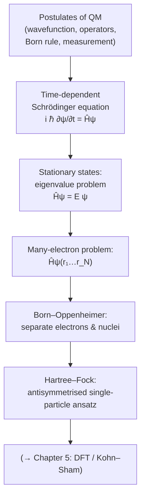

# Chapter 4 — Quantum Mechanics for Materials

[Open in Jupyter (browser)](/materials-simulation-handbook/lite/lab/index.html?path=ch04-quantum.ipynb){ .md-button .md-button--primary }

*Conceptual map of Chapter 4: from the postulates to the Hartree–Fock starting point of modern electronic-structure theory.*

> *"I think I can safely say that nobody understands quantum mechanics."* — Richard Feynman

So far in this handbook we have treated atoms as if they were billiard balls: classical particles obeying Newton's laws, perhaps bouncing around in a force field that we postulated by hand. That picture took us a long way in Chapter 3 — we placed atoms in unit cells, computed distances, drew radial distribution functions. But the moment we ask *why* a carbon atom prefers four bonds, *why* silicon is a semiconductor and copper a metal, *why* the lattice constant of diamond is 3.567 Å and not 4 Å, classical mechanics has nothing to say. The answers all lie in the behaviour of electrons, and electrons are quantum objects.

This chapter is the bridge between the descriptive materials science of Chapter 3 and the predictive electronic-structure methods that dominate the rest of the book. By the end of it you will understand what a wavefunction is, how the Schrödinger equation governs its evolution, and — crucially — *why we cannot solve it exactly for any system more complicated than a hydrogen atom*. That single observation is the reason density functional theory exists, the reason machine-learning interatomic potentials are interesting, and the reason a whole industry of approximations has grown up around the many-electron problem.

## Chapter goal

The chapter has a single overarching aim: to take a reader who has never seen quantum mechanics formally, and bring them to a point where the statement

$$\hat{H} \Psi(\mathbf r_1, \ldots, \mathbf r_N) = E\, \Psi(\mathbf r_1, \ldots, \mathbf r_N)$$

is not merely symbols on a page but a concrete computational problem whose intractability the reader can both *prove* and *feel*. Everything from Chapter 5 onwards is an approximation to this equation, so understanding why it is hopeless is the most important pedagogical step in the book.

## Roadmap

The chapter unfolds in eight sections, each building on the last.

1. **Why we need quantum mechanics** (§4.1). We revisit the late-nineteenth-century crises — blackbody radiation, the photoelectric effect, atomic stability — and follow de Broglie to the idea that matter has wave character. No equations beyond what you would meet in a popular-science book; the aim is to convince you, viscerally, that classical mechanics is wrong at the atomic scale.

2. **The Schrödinger equation** (§4.2). We *postulate* the time-dependent Schrödinger equation, interpret $|\psi|^2$ as a probability density (the Born rule), introduce the Hamiltonian operator and expectation values, prove that Hermitian operators have real eigenvalues, and end with bra-ket notation. This is the algebraic foundation for everything that follows.

3. **Solving it numerically — particle in a box** (§4.3). The simplest non-trivial problem: a single particle confined to a 1D well. We solve it analytically *and* numerically using finite differences, and you will write the code yourself. This gives you a concrete sense of what an eigenstate looks like.

4. **The harmonic oscillator** (§4.4). Every smooth potential is locally a harmonic oscillator. We solve $-\frac{\hbar^2}{2m}\partial_x^2 \psi + \frac12 m\omega^2 x^2 \psi = E\psi$ analytically and numerically, meet the zero-point energy, and connect it to phonons and vibrational spectra.

5. **Many electrons and the exponential wall** (§4.5). We write down the full electron-nuclear Hamiltonian, introduce Pauli antisymmetry and Slater determinants, and compute — with depressing back-of-envelope arithmetic — that ten electrons on a coarse 10×10×10 grid already require $10^{30}$ basis states. This is *the* central problem of computational materials science.

6. **Born–Oppenheimer separation** (§4.6). The first essential approximation: because nuclei are 1836 times heavier than electrons, we can freeze them. This yields the potential energy surface — the central object of all atomistic simulation.

7. **Hartree–Fock** (§4.7). The simplest serious attack on the many-electron problem: assume the wavefunction is a single Slater determinant and minimise the energy. We sketch the self-consistent field equations, define correlation energy as "what Hartree–Fock misses", and set the stage for density functional theory in Chapter 5.

8. **Exercises** (§4.8). Eight problems, with full solutions, covering normalisation, orthogonality, Hermite polynomials, a double-well numerical experiment, and order-of-magnitude estimates.

## How to read this chapter (undergraduate)

!!! tip "How to read this chapter (undergraduate)"
    For most readers this is their **first formal quantum mechanics**, and it is the hardest single chapter in the book — budget roughly **eighteen hours** spread over several sittings, not one long evening. That is not a sign you are slow; it is the normal pace for meeting a new way of thinking. The chapter rewards a *layered* reading, the same three layers used in the [undergraduate learning paths](../undergraduate/learning-paths.md):

    - **Layer 1 — get the intuition.** Aim only to come away with a few pictures: *why* classical mechanics fails at the atomic scale (§4.1), *what* a wavefunction is and what $|\psi|^2$ means (§4.2), and *what* an eigenstate of a confined particle looks like (§4.3). The single most important idea — *why* the many-electron Schrödinger equation is hopeless to solve directly — lives in §4.5, and it is worth reaching even on a first, fast pass.
    - **Layer 2 — the derivations.** The algebraic backbone is in §4.2 (Hermitian operators have real eigenvalues, the Born rule, bra-ket notation), §4.3–§4.4 (solving the particle-in-a-box and the harmonic oscillator both by hand and numerically), and §4.7 (the Hartree–Fock self-consistent-field equations). It is completely fine to skim a derivation the first time and return to it once the intuition from Layer 1 is solid — the [formula-reading guide](../undergraduate/formula-reading-guide.md) shows how to unpack a dense equation one symbol at a time.
    - **Layer 3 — the judgement.** The practitioner's takeaways are the *consequences* of the maths: the exponential wall (§4.5) is why every later chapter is an approximation; the Born–Oppenheimer separation (§4.6) is why the potential energy surface exists at all; and "what Hartree–Fock misses" (§4.7) — the correlation energy — is the gap that density functional theory in [Chapter 5](../ch05-dft/index.md) is built to fill. This layer matters most once you start judging which method to trust for a real calculation.

    When the symbols pile up, lean on the [beginner glossary](../undergraduate/glossary-for-beginners.md) for unfamiliar terms (wavefunction, operator, Hamiltonian, eigenvalue, boundary condition all have slow, friendly entries there).

!!! info "Prerequisites — check these before you start"
    This chapter assumes a first-year mathematics and physics background. Before §4.2 you should be comfortable with:

    - **Complex numbers and complex exponentials.** The wavefunction is complex-valued, and $e^{i\theta} = \cos\theta + i\sin\theta$ appears constantly. If $|z|^2 = z^*z$ and Euler's formula are not yet automatic, revisit [Chapter 0 (maths)](../ch00-math/index.md) first.
    - **Eigenvalue problems.** The whole chapter turns on $\hat{H}\psi = E\psi$ — "an operator acting on a special function returns the same function times a number". The [glossary entries on eigenvalue and eigenvector](../undergraduate/glossary-for-beginners.md) give the slow version.
    - **The gradient $\nabla$ and the Laplacian $\nabla^2$.** The kinetic-energy operator is $-\tfrac{\hbar^2}{2m}\nabla^2$; you need to know that $\nabla^2$ sums the second derivatives in each direction.
    - **Operators acting on functions.** An *operator* is a rule that takes a function in and gives a function out (the [glossary entry on operator](../undergraduate/glossary-for-beginners.md) expands this). "Differentiate" and "multiply by $x$" are the two you will meet first.

    From Chapter 1 you also need to be able to write and run small NumPy/SciPy programs; the numerical sections use `scipy.linalg` and `scipy.sparse`. **No prior quantum mechanics is assumed** — that is the whole point of the chapter.

!!! question "Check yourself"
    1. Roughly how many hours should you budget for this chapter, and why is it reasonable to spread that over several sittings rather than one?
    2. In the layered reading above, which single section carries *the* central message of the chapter — the reason every later chapter relies on approximations?
    3. The wavefunction is complex-valued. Which prerequisite identity lets you turn $e^{i\theta}$ into something with a real and an imaginary part, and what does $|\psi|^2$ equal in terms of $\psi$ and its complex conjugate?
    4. What does it mean to call $\hat{H}$ an *operator* rather than a number, and what is the name of the equation $\hat{H}\psi = E\psi$?

    ??? success "Answer"
        1. About **eighteen hours**. For most readers this is their first formal quantum mechanics, so the ideas are genuinely new; spacing the study lets each picture settle before the next is built on top of it, which is how hard material is actually learned.
        2. **§4.5 (many electrons and the exponential wall).** It shows that the full many-electron Schrödinger equation is intractable, which is precisely why Born–Oppenheimer, Hartree–Fock, DFT and machine-learning potentials all exist.
        3. **Euler's formula**, $e^{i\theta} = \cos\theta + i\sin\theta$. The probability density is $|\psi|^2 = \psi^{*}\psi$, where $\psi^{*}$ is the complex conjugate; this is real and non-negative even though $\psi$ itself need not be.
        4. An operator is a *rule that turns one function into another* (here, "compute the total energy of the state"), not a single numerical value. The equation $\hat{H}\psi = E\psi$ is the **(time-independent) eigenvalue equation** for the Hamiltonian; its eigenvalues $E$ are the allowed energies.

    ??? note "Hint"
        For questions 3 and 4, the [beginner glossary](../undergraduate/glossary-for-beginners.md) entries on *wavefunction*, *operator* and *eigenvalue* state each answer in one line.

## What you need

From Chapter 0, you should be comfortable with differentiation, integration, eigenvalues of small matrices, and complex numbers. We will use the gradient and the Laplacian operators freely. From Chapter 1 you should be able to write and run NumPy/SciPy code; the numerical exercises use `scipy.linalg` and `scipy.sparse`. No prior quantum mechanics is assumed.

## What you do *not* need

We will not derive the Schrödinger equation — nobody does, and anyone who claims to is lying. We will not compute scattering cross-sections, write down spherical harmonics for hydrogen, or quantise the electromagnetic field. The chapter is a computational physicist's introduction to quantum mechanics: just enough to make sense of every electronic-structure paper you will ever read, and not a syllable more.

When you finish this chapter, turn straight to Chapter 5, where we trade the wavefunction for the electron density and recover tractability.
