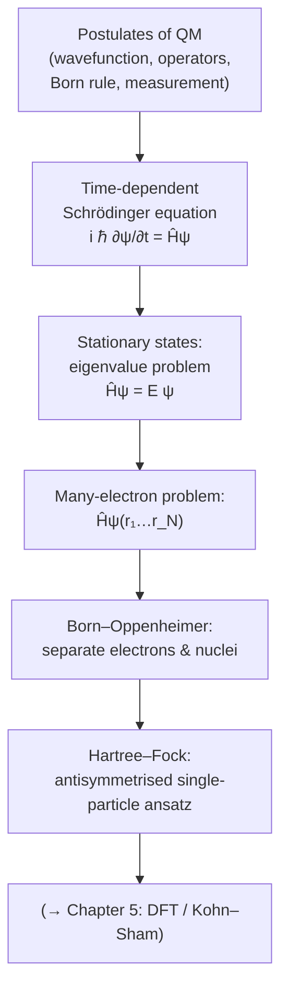

# Chapter 4 — Quantum Mechanics for Materials

*Conceptual map of Chapter 4: from the postulates to the Hartree–Fock starting point of modern electronic-structure theory.*

> *"I think I can safely say that nobody understands quantum mechanics."* — Richard Feynman

So far in this handbook we have treated atoms as if they were billiard balls: classical particles obeying Newton's laws, perhaps bouncing around in a force field that we postulated by hand. That picture took us a long way in Chapter 3 — we placed atoms in unit cells, computed distances, drew radial distribution functions. But the moment we ask *why* a carbon atom prefers four bonds, *why* silicon is a semiconductor and copper a metal, *why* the lattice constant of diamond is 3.567 Å and not 4 Å, classical mechanics has nothing to say. The answers all lie in the behaviour of electrons, and electrons are quantum objects.

This chapter is the bridge between the descriptive materials science of Chapter 3 and the predictive electronic-structure methods that dominate the rest of the book. By the end of it you will understand what a wavefunction is, how the Schrödinger equation governs its evolution, and — crucially — *why we cannot solve it exactly for any system more complicated than a hydrogen atom*. That single observation is the reason density functional theory exists, the reason machine-learning interatomic potentials are interesting, and the reason a whole industry of approximations has grown up around the many-electron problem.

## Chapter goal

The chapter has a single overarching aim: to take a reader who has never seen quantum mechanics formally, and bring them to a point where the statement

$$\hat{H} \Psi(\mathbf r_1, \ldots, \mathbf r_N) = E\, \Psi(\mathbf r_1, \ldots, \mathbf r_N)$$

is not merely symbols on a page but a concrete computational problem whose intractability the reader can both *prove* and *feel*. Everything from Chapter 5 onwards is an approximation to this equation, so understanding why it is hopeless is the most important pedagogical step in the book.

## Roadmap

The chapter unfolds in eight sections, each building on the last.

1. **Why we need quantum mechanics** (§4.1). We revisit the late-nineteenth-century crises — blackbody radiation, the photoelectric effect, atomic stability — and follow de Broglie to the idea that matter has wave character. No equations beyond what you would meet in a popular-science book; the aim is to convince you, viscerally, that classical mechanics is wrong at the atomic scale.

2. **The Schrödinger equation** (§4.2). We *postulate* the time-dependent Schrödinger equation, interpret $|\psi|^2$ as a probability density (the Born rule), introduce the Hamiltonian operator and expectation values, prove that Hermitian operators have real eigenvalues, and end with bra-ket notation. This is the algebraic foundation for everything that follows.

3. **Solving it numerically — particle in a box** (§4.3). The simplest non-trivial problem: a single particle confined to a 1D well. We solve it analytically *and* numerically using finite differences, and you will write the code yourself. This gives you a concrete sense of what an eigenstate looks like.

4. **The harmonic oscillator** (§4.4). Every smooth potential is locally a harmonic oscillator. We solve $-\frac{\hbar^2}{2m}\partial_x^2 \psi + \frac12 m\omega^2 x^2 \psi = E\psi$ analytically and numerically, meet the zero-point energy, and connect it to phonons and vibrational spectra.

5. **Many electrons and the exponential wall** (§4.5). We write down the full electron-nuclear Hamiltonian, introduce Pauli antisymmetry and Slater determinants, and compute — with depressing back-of-envelope arithmetic — that ten electrons on a coarse 10×10×10 grid already require $10^{30}$ basis states. This is *the* central problem of computational materials science.

6. **Born–Oppenheimer separation** (§4.6). The first essential approximation: because nuclei are 1836 times heavier than electrons, we can freeze them. This yields the potential energy surface — the central object of all atomistic simulation.

7. **Hartree–Fock** (§4.7). The simplest serious attack on the many-electron problem: assume the wavefunction is a single Slater determinant and minimise the energy. We sketch the self-consistent field equations, define correlation energy as "what Hartree–Fock misses", and set the stage for density functional theory in Chapter 5.

8. **Exercises** (§4.8). Eight problems, with full solutions, covering normalisation, orthogonality, Hermite polynomials, a double-well numerical experiment, and order-of-magnitude estimates.

## What you need

From Chapter 0, you should be comfortable with differentiation, integration, eigenvalues of small matrices, and complex numbers. We will use the gradient and the Laplacian operators freely. From Chapter 1 you should be able to write and run NumPy/SciPy code; the numerical exercises use `scipy.linalg` and `scipy.sparse`. No prior quantum mechanics is assumed.

## What you do *not* need

We will not derive the Schrödinger equation — nobody does, and anyone who claims to is lying. We will not compute scattering cross-sections, write down spherical harmonics for hydrogen, or quantise the electromagnetic field. The chapter is a computational physicist's introduction to quantum mechanics: just enough to make sense of every electronic-structure paper you will ever read, and not a syllable more.

When you finish this chapter, turn straight to Chapter 5, where we trade the wavefunction for the electron density and recover tractability.
