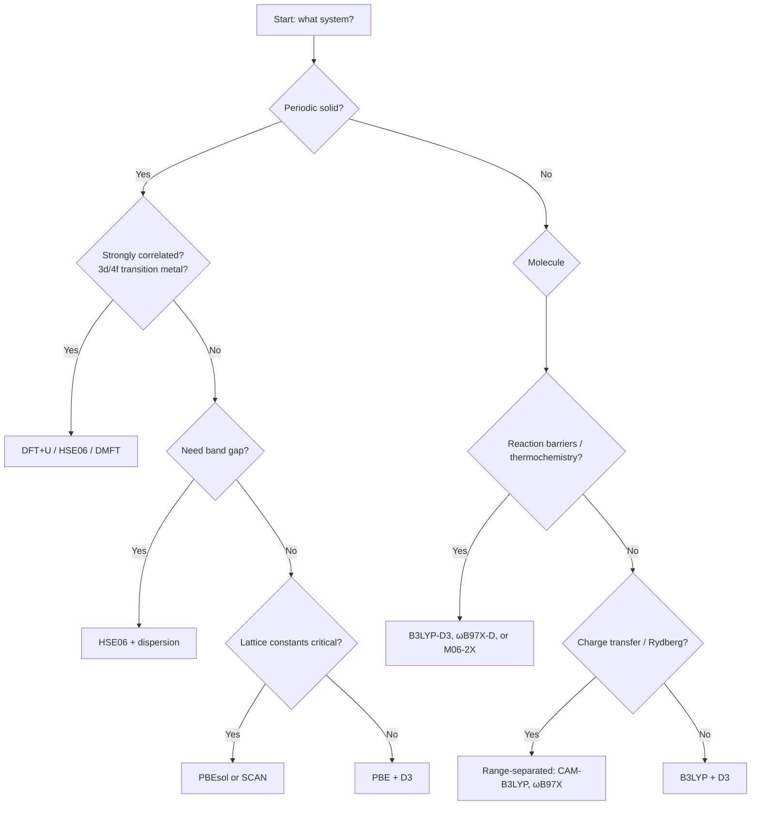

# 5.4 Exchange–Correlation Functionals

**What problem are we solving?** The Kohn–Sham equations (§5.3) are *exact* except for one piece: the exchange–correlation energy $E_{xc}[n]$. Everything in the many-electron problem that we cannot write down exactly — the subtle ways electrons avoid one another — is swept into this single term. We do not know it in closed form. The whole art of practical DFT is therefore choosing a good *approximation* to $E_{xc}[n]$; that one choice sets the accuracy of every number the calculation produces.

!!! note "In plain language"
    *Exchange* and *correlation* both describe how electrons stay out of each other's way, but for two different reasons.

    - **Exchange** comes from the Pauli principle: two electrons of the *same spin* cannot be in the same place, because the wavefunction must be antisymmetric. So same-spin electrons automatically avoid each other, which lowers their repulsion. This part is "free" in the sense that even a single Slater determinant captures it.
    - **Correlation** is the *extra* avoidance on top of that: *all* electrons (same spin or not) shuffle their motion to keep apart and reduce Coulomb repulsion further. This is the genuinely hard, many-body part.

    "**Jacob's ladder**" (used throughout this section) is just a ranking of approximations by *how much information about the density they look at*: the density value $n$ alone (LDA), then its gradient $\nabla n$ (GGA), then the kinetic-energy density $\tau$ (meta-GGA), then a slice of exact exchange built from the orbitals (hybrid). Higher rungs use more information — they are not automatically "more correct" (see the warning below).

!!! note "Symbol guide"
    | Symbol | Meaning | Notes |
    |---|---|---|
    | $E_{xc}[n]$ | exchange–correlation **energy** (a functional of the whole density) | the one unknown term; units of energy (Ha or eV) |
    | $\varepsilon_{xc}$ | exchange–correlation energy **per particle** at a point | $E_{xc}=\int n\,\varepsilon_{xc}\,\mathrm d\mathbf r$; written $\epsilon_{xc}$ elsewhere on this page |
    | $n(\mathbf r)$ | electron number density at point $\mathbf r$ | the basic variable of DFT; units of (length)$^{-3}$ |
    | $\nabla n$ | gradient of the density | how fast $n$ varies; the extra ingredient a GGA uses |
    | **LDA** | local density approximation — rung 1 | uses $n$ only |
    | **GGA** | generalised gradient approximation — rung 2 | uses $n$ and $\nabla n$ |
    | **meta-GGA** | rung 3 | adds kinetic-energy density $\tau$ |
    | **hybrid** | rung 4 | mixes in a fraction of exact exchange |

    For a fuller list of beginner terms, see the [glossary for beginners](../undergraduate/glossary-for-beginners.md).

!!! note "Why does this chapter exist?"
    Kohn–Sham theory (§5.3) is exact *in principle* — if we knew the exchange–correlation functional $E_{xc}[n]$ in closed form, we could compute the energy of any molecule or crystal to arbitrary accuracy. We do not know it in closed form. What we have is *approximations* — and over sixty years, hundreds of them. Choosing the right one is the central practical decision in any DFT calculation.
    
    A useful analogy. Imagine you are a chef, and the perfect recipe for a sauce is locked in a vault. You know the sauce exists, you know it would taste exactly right, but you cannot open the vault. You have to *guess* the recipe based on principles (it should contain salt, fat, acid), constraints (no ingredient may be negative, the total weight must be conserved), and benchmark dishes (the right sauce should taste like *this* on chicken, like *that* on fish). Different chefs make different guesses; we call them *functionals*. LDA is the simplest plausible guess; PBE adds a sensible gradient correction; SCAN adds more constraints; HSE06 mixes in some exact (but expensive) ingredient. Each climbs one rung of John Perdew's metaphorical *Jacob's ladder* toward the unreachable exact functional in the heavens.
    
    Why does LDA work as well as it does, given how crude it is? The answer is one of the great minor miracles of modern physics. LDA gets exchange right in regions where the density is uniform (which is *no* region of any real atom!). The non-uniform errors should be huge — and they are, individually. But they *cancel* between exchange and correlation, in ways that the so-called "adiabatic-connection" picture (§5.3) makes transparent. So LDA gives binding energies accurate to ~30 kcal/mol (off by enough to be useless for chemistry, but in the right ballpark for atomic energies) — better than its crude derivation deserves. This cancellation is the deep reason DFT works.

The Kohn–Sham construction (§5.3) is exact in principle. It becomes an approximation only because we do not know the exchange–correlation energy functional $E_{xc}[n]$ in closed form. Every DFT calculation in the world today involves a choice of approximate $E_{xc}$: a *functional*. The choice matters. The same molecule can have its bond length reproduced within 1 pm by one functional and missed by 10 pm by another; a band gap can come out qualitatively right or qualitatively wrong; a magnetic ground state can flip.

The functional zoo is large — thousands have been proposed; perhaps fifty are in common use. To navigate it, John Perdew suggested a marvellous metaphor: **Jacob's ladder**. Each rung adds an ingredient and, on average, climbs toward chemical accuracy ($\sim 1$ kcal/mol $\approx 0.04$ eV). Each rung also costs more. We climb the ladder in turn.

!!! abstract "Key idea (Chapter 5.4)"
    The exchange–correlation functional $E_{xc}[n]$ is the *one* thing standing between Kohn–Sham DFT and exact results. We do not know its closed form, but we can build approximations: LDA (uniform-gas limit), GGA (gradient corrections), meta-GGA (kinetic-energy density), hybrid (mix in exact exchange), double-hybrid (add MP2-like correlation). Each rung up *Jacob's ladder* adds ingredients and accuracy at increasing cost. The choice of functional governs the accuracy of every downstream prediction.

## 5.4.1 Jacob's ladder

From bottom to top:

1. **LDA**: uses $n(\mathbf r)$ only.
2. **GGA**: uses $n$ and $|\nabla n|$.
3. **meta-GGA**: adds the kinetic energy density $\tau(\mathbf r)$ or $\nabla^{2}n$.
4. **Hybrid**: mixes in a fraction of exact (Hartree–Fock) exchange.
5. **Double hybrid** / RPA / wavefunction methods: include unoccupied orbitals.

The first three rungs are purely *semi-local* — the value of $\epsilon_{xc}$ at $\mathbf r$ depends only on quantities at $\mathbf r$ (or its immediate gradients). The fourth introduces non-locality through exact exchange and is roughly an order of magnitude more expensive. The fifth introduces virtual orbitals and another order of magnitude.

!!! note "Why this step?"
    Each rung adds a new physical ingredient — and a new opportunity to break exact constraints if one is not careful. The ladder is *not* monotonically more accurate: a poorly-constructed meta-GGA can be worse than a well-constructed GGA. The metaphor is aspirational, not guaranteed. What is true is that *more ingredients* allow *more constraints* to be satisfied simultaneously; whether they actually are depends on the functional designer's craft. PBE is a clean GGA that has aged well precisely because its constants were determined by exact constraints, not fits to data; SCAN is a meta-GGA that satisfies seventeen exact constraints simultaneously. Both stand the test of time better than their many empirically-fit competitors.

!!! example "Cost ratio summary"
    For a benchmark of organic molecules on the same hardware:
    *(Timings are representative of plane-wave/Gaussian DFT codes on the GMTKN55 main-group thermochemistry test set; absolute ratios vary with system size, basis set, and code.)*
    
    | Rung | Functional | Time / GGA |
    |---|---|---|
    | 1 LDA | PW92 | 0.9 |
    | 2 GGA | PBE | 1.0 (reference) |
    | 3 meta-GGA | SCAN | 1.5 |
    | 4 hybrid (screened) | HSE06 | 10–30 |
    | 4 hybrid (global) | PBE0 | 15–50 |
    | 5 double-hybrid | XYG3 | 100–500 |
    | wavefunction | CCSD(T) | $10^{4}$–$10^{6}$ |
    
    The cost increase with rung is dominated by the cost of evaluating exact exchange (non-local, scales as $\mathcal O(N_\mathrm{occ}^{2})$ rather than $\mathcal O(N)$). Modern range-separation tricks reduce the prefactor but not the scaling.

??? question "Pause and recall"
    Before reading on, try to answer these from memory:

    1. What single quantity stands between Kohn–Sham DFT and exact results, and why is it only ever known approximately?
    2. Name the five rungs of Jacob's ladder in order, and state the new ingredient each one adds.
    3. Why is climbing the ladder not guaranteed to improve accuracy, and why are the first three rungs much cheaper than the fourth?

    If any of these is shaky, re-read the preceding section before continuing.

!!! warning "Common misunderstanding"
    A higher rung is **not** automatically more accurate for every property — and it always costs more.

    - The ladder is a guide, not a guarantee. A well-built GGA can beat a poorly-built meta-GGA, and for some quantities LDA is still surprisingly competitive (see the cancellation argument above).
    - **LDA and GGA remain the workhorses** of large-scale and high-throughput materials science precisely because they are cheap and robust.
    - **Hybrids** (rung 4) substantially help band gaps, but they cost roughly $10$–$30\times$ a GGA because of the non-local exact-exchange term.
    - **Van der Waals (dispersion) is a separate issue from the rung.** *No* semi-local functional — LDA, GGA, or meta-GGA — has a $-C_6/R^{6}$ tail. You must add an explicit correction (D3/D4, vdW-DF, or use SCAN+rVV10) for non-bonded fragments (§5.4.6).

!!! question "Check yourself"
    1. What exactly is swept into $E_{xc}[n]$, and why does it make Kohn–Sham theory only approximate in practice?
    2. What *extra* piece of information does a GGA use that an LDA does not?
    3. Why are hybrid functionals so much more expensive than LDA, GGA, or meta-GGA?

    ??? success "Answers"
        1. Everything we cannot compute exactly about electron–electron interaction beyond the classical Hartree term — specifically the exchange (same-spin Pauli avoidance) and correlation (all-electron extra avoidance) energies, plus the difference between the true kinetic energy and the Kohn–Sham non-interacting kinetic energy. Kohn–Sham is exact *if* $E_{xc}[n]$ is known; since it is not, we approximate it.
        2. The gradient of the density, $\nabla n$ (entering through the dimensionless reduced gradient $s$ of equation 5.38). LDA sees only the local value $n$; a GGA also sees how fast $n$ is changing.
        3. Hybrids include a fraction of *exact (Hartree–Fock) exchange*, which is **non-local**: it couples orbitals at two different points $\mathbf r$ and $\mathbf r'$ (equation 5.41). Evaluating it scales far worse than the $\mathcal O(N)$ semi-local functionals — typically $10$–$30\times$ the cost of a GGA on the same system.

## 5.4.2 LDA: the local density approximation

The simplest approximation: pretend that, locally, the electron gas is uniform. Define an exchange–correlation energy density per particle, $\epsilon_{xc}^\mathrm{unif}(n)$, for a uniform electron gas of density $n$. Then

$$
\boxed{\;\;E_{xc}^\mathrm{LDA}[n] \;=\; \int n(\mathbf r)\,\epsilon_{xc}^\mathrm{unif}\!\big(n(\mathbf r)\big)\,\mathrm d\mathbf r.\;\;}
\tag{5.34}
$$

Write $\epsilon_{xc}^\mathrm{unif} = \epsilon_{x}^\mathrm{unif} + \epsilon_{c}^\mathrm{unif}$: the exchange part can be computed in closed form; the correlation part is known very accurately from quantum Monte Carlo (Ceperley and Alder, 1980) and fitted to convenient analytic forms (VWN, Perdew–Zunger, Perdew–Wang).

### Derivation of LDA exchange

For a uniform electron gas of density $n$, the exchange energy per unit volume is

$$
\epsilon_x^\mathrm{vol}(n) = -\frac{1}{2}\int\frac{\rho_x(\mathbf r,\mathbf r')\,n}{|\mathbf r-\mathbf r'|}\,\mathrm d\mathbf r',
$$

where $\rho_x$ is the exchange hole. For a single Slater determinant of plane waves, the exchange hole is computable analytically. We take a more direct route via the Fock energy of the Hartree–Fock ground state of the uniform gas.

Here $\rho_x(\mathbf r,\mathbf r')$ is the **exchange hole** — the depletion of same-spin density around an electron at $\mathbf r$ caused by the Pauli principle, defined precisely later in §5.4.7 and satisfying the sum rule $\int\rho_x(\mathbf r,\mathbf r')\,\mathrm d\mathbf r' = -1$ (it removes exactly one electron's worth of same-spin charge).

The Hartree–Fock exchange energy of $N$ plane-wave electrons (two per $\mathbf k$ up to $k_F$) is

$$
E_x = -\frac{1}{2}\sum_{\mathbf k,\mathbf k'}^\mathrm{occ}\int\frac{e^{-i(\mathbf k-\mathbf k')\cdot\mathbf r}\,e^{i(\mathbf k-\mathbf k')\cdot\mathbf r'}}{L^{6}\,|\mathbf r-\mathbf r'|}\,\mathrm d\mathbf r\,\mathrm d\mathbf r'.
$$

Converting the sums to integrals (the spin factor $2$ cancels the $\tfrac12$ in front of the exchange energy) and doing the spatial integral (the Fourier transform of $1/|\mathbf r|$ is $4\pi/q^{2}$), the exchange energy becomes

$$
E_x = -\frac{4\pi}{L^{3}}\left(\frac{L^{3}}{(2\pi)^{3}}\right)^{2}\int_{k<k_F}\int_{k'<k_F}\frac{\mathrm d\mathbf k\,\mathrm d\mathbf k'}{|\mathbf k-\mathbf k'|^{2}}.
$$

The double integral evaluates (full derivation below; substitute $\mathbf q = \mathbf k - \mathbf k'$, then do the inner Fermi-sphere integral) to

$$
\int_{k<k_F}\int_{k'<k_F}\frac{1}{|\mathbf k - \mathbf k'|^{2}}\,\mathrm d\mathbf k\,\mathrm d\mathbf k' = 4\pi^{2} k_F^{4}.
$$

Substituting and simplifying the constants gives the exchange energy per unit volume $E_x/L^{3} = -k_F^{4}/(4\pi^{3})$. The collapsible box below carries out *every* step of the plane-wave calculation — the spatial integral, the spin factor, and the inner and outer Fermi-sphere integrals (the outer one via a telescoping series, with no divergent boundary term) — assembling the constants one by one so that nothing is taken on trust.

??? note "Full derivation: exchange energy of the uniform electron gas"
    We start from the Hartree–Fock exchange (Fock) energy for a set of occupied spin-orbitals,
    $$
    E_x = -\frac{1}{2}\sum_{\sigma}\sum_{i,j\,\in\,\mathrm{occ}}^{(\sigma)}\iint\frac{\phi_i^{*}(\mathbf r)\,\phi_j^{*}(\mathbf r')\,\phi_j(\mathbf r)\,\phi_i(\mathbf r')}{|\mathbf r-\mathbf r'|}\,\mathrm d\mathbf r\,\mathrm d\mathbf r'.
    \tag{5.35a}
    $$
    The exchange term couples only orbitals of the *same* spin $\sigma$ (the off-diagonal element of the antisymmetrised two-electron interaction vanishes for opposite spins), which is why the spin label sits on the inner sums.

    **Step 1 — plane-wave orbitals.** For the uniform gas in a box of side $L$ (volume $L^{3}$) with periodic boundary conditions, the Kohn–Sham orbitals are normalised plane waves
    $$
    \phi_{\mathbf k}(\mathbf r) = L^{-3/2}\,\mathrm e^{i\mathbf k\cdot\mathbf r},\qquad \int_{L^{3}}|\phi_{\mathbf k}|^{2}\,\mathrm d\mathbf r = L^{-3}\!\int_{L^{3}}\!\mathrm d\mathbf r = 1,
    \tag{5.35b}
    $$
    occupied for $|\mathbf k|<k_F$, with two spin states ($\uparrow,\downarrow$) per allowed $\mathbf k$. Insert (5.35b) into (5.35a), writing $\mathbf k$ for $i$ and $\mathbf k'$ for $j$. The product of orbitals is
    $$
    \phi_{\mathbf k}^{*}(\mathbf r)\phi_{\mathbf k'}^{*}(\mathbf r')\phi_{\mathbf k'}(\mathbf r)\phi_{\mathbf k}(\mathbf r')
    = L^{-6}\,\mathrm e^{-i\mathbf k\cdot\mathbf r}\,\mathrm e^{-i\mathbf k'\cdot\mathbf r'}\,\mathrm e^{+i\mathbf k'\cdot\mathbf r}\,\mathrm e^{+i\mathbf k\cdot\mathbf r'}
    = L^{-6}\,\mathrm e^{-i(\mathbf k-\mathbf k')\cdot(\mathbf r-\mathbf r')}.
    \tag{5.35c}
    $$
    So, with $\mathbf q\equiv\mathbf k-\mathbf k'$,
    $$
    E_x = -\frac{1}{2}\sum_{\sigma}\sum_{\mathbf k,\mathbf k'}^{(\sigma)}\frac{1}{L^{6}}\iint\frac{\mathrm e^{-i\mathbf q\cdot(\mathbf r-\mathbf r')}}{|\mathbf r-\mathbf r'|}\,\mathrm d\mathbf r\,\mathrm d\mathbf r'.
    \tag{5.35d}
    $$

    **Step 2 — the spatial double integral.** Change variables to the relative and centre-of-mass coordinates $\mathbf R=\mathbf r-\mathbf r'$ and $\bar{\mathbf r}=\tfrac12(\mathbf r+\mathbf r')$; the Jacobian is unity. The integrand depends only on $\mathbf R$, so the centre-of-mass integral is trivial and yields the volume:
    $$
    \iint\frac{\mathrm e^{-i\mathbf q\cdot(\mathbf r-\mathbf r')}}{|\mathbf r-\mathbf r'|}\,\mathrm d\mathbf r\,\mathrm d\mathbf r'
    = \underbrace{\int_{L^{3}}\mathrm d\bar{\mathbf r}}_{=\,L^{3}}\;\int\frac{\mathrm e^{-i\mathbf q\cdot\mathbf R}}{|\mathbf R|}\,\mathrm d\mathbf R.
    \tag{5.35e}
    $$
    The remaining integral is the Fourier transform of the Coulomb potential. With the standard convergence factor $\mathrm e^{-\eta R}$ ($\eta\to0^{+}$),
    $$
    \int\frac{\mathrm e^{-i\mathbf q\cdot\mathbf R}}{|\mathbf R|}\,\mathrm d\mathbf R = \frac{4\pi}{q^{2}},\qquad q=|\mathbf q|=|\mathbf k-\mathbf k'|.
    \tag{5.35f}
    $$
    (Quick check of (5.35f): align $\mathbf q$ with the polar axis, $\int_0^\infty\!\!\int_0^\pi\!\!\int_0^{2\pi} \mathrm e^{-iqR\cos\theta}\mathrm e^{-\eta R}\,R\,\sin\theta\,\mathrm d\varphi\,\mathrm d\theta\,\mathrm dR = 2\pi\int_0^\infty R\,\mathrm e^{-\eta R}\,\frac{2\sin qR}{qR}\,\mathrm dR = \frac{4\pi}{q}\int_0^\infty \mathrm e^{-\eta R}\sin qR\,\mathrm dR = \frac{4\pi}{q}\cdot\frac{q}{q^{2}+\eta^{2}}\to\frac{4\pi}{q^{2}}$.) Hence
    $$
    E_x = -\frac{1}{2}\sum_{\sigma}\sum_{\mathbf k,\mathbf k'}^{(\sigma)}\frac{L^{3}}{L^{6}}\,\frac{4\pi}{|\mathbf k-\mathbf k'|^{2}}
    = -\frac{1}{2}\sum_{\sigma}\sum_{\mathbf k,\mathbf k'}^{(\sigma)}\frac{4\pi}{L^{3}\,|\mathbf k-\mathbf k'|^{2}}.
    \tag{5.35g}
    $$

    **Step 3 — sums to integrals, and the spin factor.** Allowed wavevectors are spaced by $2\pi/L$ in each direction, so each occupies a $\mathbf k$-space volume $(2\pi/L)^{3}$ and
    $$
    \sum_{\mathbf k} \;\longrightarrow\; \frac{L^{3}}{(2\pi)^{3}}\int \mathrm d^{3}k .
    \tag{5.35h}
    $$
    The two spin channels are identical, so $\sum_{\sigma}(\cdots)=2(\cdots)$. This spin factor $2$ exactly cancels the $\tfrac12$ in front of (5.35g). Applying (5.35h) to *both* the $\mathbf k$- and $\mathbf k'$-sums,
    $$
    E_x = -\,\frac{4\pi}{L^{3}}\left(\frac{L^{3}}{(2\pi)^{3}}\right)^{2}\!\!\int_{k<k_F}\!\!\int_{k'<k_F}\frac{\mathrm d^{3}k\,\mathrm d^{3}k'}{|\mathbf k-\mathbf k'|^{2}}
    = -\,\frac{4\pi\,L^{3}}{(2\pi)^{6}}\;I,\qquad I\equiv\!\int_{k<k_F}\!\!\int_{k'<k_F}\!\frac{\mathrm d^{3}k\,\mathrm d^{3}k'}{|\mathbf k-\mathbf k'|^{2}}.
    \tag{5.35i}
    $$

    **Step 4 — the inner Fermi-sphere integral.** Fix $\mathbf k$ and integrate $\mathbf k'$ over the Fermi sphere. Using polar axis along $\mathbf k$ and the angular identity $\int_0^\pi \dfrac{\sin\theta\,\mathrm d\theta}{k^{2}+k'^{2}-2kk'\cos\theta} = \dfrac{1}{2kk'}\ln\dfrac{(k+k')^{2}}{(k-k')^{2}} = \dfrac{1}{kk'}\ln\left|\dfrac{k+k'}{k-k'}\right|$,
    $$
    \int_{k'<k_F}\frac{\mathrm d^{3}k'}{|\mathbf k-\mathbf k'|^{2}}
    = 2\pi\!\int_0^{k_F}\!k'^{2}\,\frac{1}{kk'}\ln\left|\frac{k+k'}{k-k'}\right|\mathrm dk'
    = \frac{2\pi}{k}\!\int_0^{k_F}\!k'\ln\left|\frac{k+k'}{k-k'}\right|\mathrm dk'.
    \tag{5.35j}
    $$
    The elementary integral $\displaystyle\int_0^{k_F} k'\ln\left|\frac{k+k'}{k-k'}\right|\mathrm dk' = k\,k_F + \tfrac12(k_F^{2}-k^{2})\ln\left|\frac{k_F+k}{k_F-k}\right|$ (integrate by parts, $u=\ln|\cdots|$, $\mathrm dv=k'\mathrm dk'$) gives the standard closed form
    $$
    \boxed{\;J(k)\equiv\int_{k'<k_F}\frac{\mathrm d^{3}k'}{|\mathbf k-\mathbf k'|^{2}}
    = 2\pi\left[\,k_F + \frac{k_F^{2}-k^{2}}{2k}\ln\left|\frac{k_F+k}{k_F-k}\right|\,\right].}
    \tag{5.35k}
    $$

    **Step 5 — the outer integral.** Now integrate $J(k)$ over the $\mathbf k$ Fermi sphere, $\int_{k<k_F}\mathrm d^{3}k = \int_0^{k_F}4\pi k^{2}\,\mathrm dk$:
    $$
    I = \int_0^{k_F}4\pi k^{2}\,J(k)\,\mathrm dk
    = 8\pi^{2}\!\int_0^{k_F}\!\left[\,k^{2}k_F + \frac{k(k_F^{2}-k^{2})}{2}\ln\left|\frac{k_F+k}{k_F-k}\right|\,\right]\mathrm dk.
    \tag{5.35l}
    $$
    Rescale with $x=k/k_F$ (so $\mathrm dk = k_F\,\mathrm dx$ and every bracket carries $k_F^{4}$ overall):
    $$
    I = 8\pi^{2}k_F^{4}\!\int_0^{1}\!\left[\,x^{2} + \frac{x(1-x^{2})}{2}\ln\frac{1+x}{1-x}\,\right]\mathrm dx
    = 8\pi^{2}k_F^{4}\,(A+B).
    \tag{5.35m}
    $$
    The first piece is $A=\int_0^1 x^{2}\,\mathrm dx = \tfrac13$. The second is $B=\tfrac12\int_0^1 (x-x^{3})\ln\frac{1+x}{1-x}\,\mathrm dx = \tfrac12(I_1-I_3)$, with $I_n\equiv\int_0^1 x^{n}\ln\frac{1+x}{1-x}\,\mathrm dx$. To evaluate $I_n$ without any divergent boundary term, expand the logarithm in its Maclaurin series, $\ln\frac{1+x}{1-x}=2\sum_{m=0}^{\infty}\frac{x^{2m+1}}{2m+1}$, valid for $|x|<1$, and integrate term by term:
    $$
    I_n = 2\sum_{m=0}^{\infty}\frac{1}{2m+1}\int_0^1 x^{\,n+2m+1}\,\mathrm dx = 2\sum_{m=0}^{\infty}\frac{1}{(2m+1)(n+2m+2)}.
    $$
    For $n=1$ the summand is $\frac{1}{(2m+1)(2m+3)}=\frac12\!\left(\frac{1}{2m+1}-\frac{1}{2m+3}\right)$, so the series telescopes: $I_1 = 2\cdot\frac12\sum_{m\ge0}\!\left(\frac{1}{2m+1}-\frac{1}{2m+3}\right)=1\cdot\frac{1}{1}=1$. For $n=3$ the summand is $\frac{1}{(2m+1)(2m+5)}=\frac14\!\left(\frac{1}{2m+1}-\frac{1}{2m+5}\right)$, which telescopes in steps of two, leaving $I_3 = 2\cdot\frac14\!\left(\frac{1}{1}+\frac{1}{3}\right)=\frac12\cdot\frac{4}{3}=\frac23$. Therefore
    $$
    B = \tfrac12\left(I_1 - I_3\right) = \tfrac12\!\left(1-\tfrac23\right)=\tfrac16,\qquad A+B = \tfrac13+\tfrac16 = \tfrac12.
    $$
    Substituting into (5.35m),
    $$
    \boxed{\,I = 8\pi^{2}k_F^{4}\cdot\tfrac12 = 4\pi^{2}k_F^{4}.}
    \tag{5.35n}
    $$
    (This is confirmed by direct numerical quadrature of (5.35l): $I/(\pi^{2}k_F^{4})=4.0000$ to machine precision.)

    **Step 6 — assemble the prefactors.** Put (5.35n) into (5.35i):
    $$
    E_x = -\,\frac{4\pi\,L^{3}}{(2\pi)^{6}}\cdot 4\pi^{2}k_F^{4}
    = -\,\frac{16\pi^{3}\,L^{3}\,k_F^{4}}{64\pi^{6}}
    = -\,\frac{L^{3}k_F^{4}}{4\pi^{3}}.
    $$
    Hence the exchange energy per unit volume is
    $$
    \frac{E_x}{L^{3}} = -\,\frac{k_F^{4}}{4\pi^{3}}.
    \tag{5.35o}
    $$

    **Step 7 — energy per particle.** Divide by the number density $n=k_F^{3}/(3\pi^{2})$ (two spins $\times$ Fermi-sphere volume $\tfrac{4}{3}\pi k_F^{3}$ over $(2\pi)^{3}$ gives $n=\frac{2}{(2\pi)^{3}}\cdot\frac{4}{3}\pi k_F^{3}=\frac{k_F^{3}}{3\pi^{2}}$):
    $$
    \epsilon_x^{\mathrm{unif}} = \frac{E_x/L^{3}}{n}
    = -\frac{k_F^{4}}{4\pi^{3}}\cdot\frac{3\pi^{2}}{k_F^{3}}
    = -\frac{3k_F}{4\pi}.
    \tag{5.35p}
    $$
    Finally substitute $k_F=(3\pi^{2}n)^{1/3}$ and simplify the constant *step by step*:
    $$
    \epsilon_x^{\mathrm{unif}} = -\frac{3}{4\pi}(3\pi^{2})^{1/3}n^{1/3}
    = -\frac{3}{4}\cdot\frac{(3\pi^{2})^{1/3}}{\pi}\,n^{1/3}.
    $$
    Write $\dfrac{(3\pi^{2})^{1/3}}{\pi} = \dfrac{3^{1/3}\pi^{2/3}}{\pi} = 3^{1/3}\pi^{2/3-1} = 3^{1/3}\pi^{-1/3} = \left(\dfrac{3}{\pi}\right)^{1/3}$. Therefore
    $$
    \epsilon_x^{\mathrm{unif}}(n) = -\frac{3}{4}\left(\frac{3}{\pi}\right)^{1/3}n^{1/3} = -\frac{3}{4\pi}k_F.
    \tag{5.35q}
    $$
    Numerically the constant is $C_x=\tfrac34(3/\pi)^{1/3}=0.75\times(0.95493)^{1/3}=0.75\times0.98475=0.73856$, the standard Dirac coefficient. This is exactly equation (5.35). Multiplying by $n$ and integrating gives the LDA exchange *functional*
    $$
    E_x^{\mathrm{LDA}}[n]=\int n\,\epsilon_x^{\mathrm{unif}}\,\mathrm d\mathbf r = -\frac{3}{4}\left(\frac{3}{\pi}\right)^{1/3}\!\int n(\mathbf r)^{4/3}\,\mathrm d\mathbf r,
    $$
    which is equation (5.36).

Substituting and dividing out $L^{3}$ to obtain the energy per particle (using $n = k_F^{3}/(3\pi^{2})$),

$$
\epsilon_x^\mathrm{unif}(n) = -\frac{3}{4\pi}k_F = -\frac{3}{4}\Big(\frac{3}{\pi}\Big)^{1/3}\,n^{1/3}.
\tag{5.35}
$$

!!! note "Reading the $n^{4/3}$ form"
    The page already derives LDA exchange in full below, so we only flag the intuition: because $E_x^\mathrm{LDA}\propto\int n^{4/3}\,\mathrm d\mathbf r$, *denser regions contribute disproportionately more* exchange energy (the integrand grows faster than $n$ itself), and the exchange energy per particle scales as $n^{1/3}$ — exactly the density scaling made explicit by the $1/r_s$ form in the note that follows equation (5.36).

Equation (5.35) is Dirac's 1930 result. The LDA exchange functional is therefore

$$
\boxed{\;\;E_{x}^\mathrm{LDA}[n] = -\frac{3}{4}\Big(\frac{3}{\pi}\Big)^{1/3}\int n(\mathbf r)^{4/3}\,\mathrm d\mathbf r.\;\;}
\tag{5.36}
$$

The corresponding potential is $v_x^\mathrm{LDA}(\mathbf r) = -(3/\pi)^{1/3}n(\mathbf r)^{1/3}$. The LDA exchange–correlation potential $v_{xc}^\mathrm{LDA}$ is the sum of (5.36)'s functional derivative and the (numerical) $v_c^\mathrm{LDA}$ from the parametrised correlation energy.

This potential follows directly from the functional derivative of (5.36): since $E_x^\mathrm{LDA}=-C_x\int n^{4/3}\,\mathrm d\mathbf r$ with $C_x=\tfrac34(3/\pi)^{1/3}$, and the integrand depends on $n$ but not $\nabla n$, the derivative is the ordinary partial derivative of the integrand,
$$
v_x^\mathrm{LDA}(\mathbf r) = \frac{\delta E_x^\mathrm{LDA}}{\delta n(\mathbf r)} = -C_x\,\frac{\mathrm d}{\mathrm dn}\,n^{4/3} = -C_x\cdot\tfrac43\,n^{1/3} = \tfrac43\cdot\Big(-\tfrac34\Big)\Big(\tfrac{3}{\pi}\Big)^{1/3}n^{1/3} = -\Big(\tfrac{3}{\pi}\Big)^{1/3}n^{1/3},
\tag{5.36a}
$$
the factor $\tfrac43$ coming from differentiating $n^{4/3}$ and cancelling the $\tfrac34$ in $C_x$. Note that $v_x = \tfrac43\,\epsilon_x^\mathrm{unif}$: the exchange *potential* is four-thirds of the exchange energy *per particle*, a relation specific to the $n^{1/3}$ scaling.

!!! note "Why this step?"
    A useful reparametrisation: define the Wigner–Seitz radius $r_s$ by $\tfrac{4}{3}\pi r_s^{3}\,n = 1$, so that $r_s = (3/(4\pi n))^{1/3}$ is the radius of the sphere containing one electron on average. In terms of $r_s$, the LDA exchange energy per particle is
    $$
    \epsilon_x^\mathrm{unif} = -\frac{3}{4}\Big(\frac{9}{4\pi^{2}}\Big)^{1/3}\frac{1}{r_s} \approx -\frac{0.4582}{r_s}\;\text{Ha},
    $$
    which makes manifest that exchange scales as $1/r_s$. For metallic densities, $r_s\sim 2$–$5$, giving $\epsilon_x\sim -0.1$ to $-0.2\;\text{Ha}$ per electron, i.e. a few eV. This is the right ballpark for the exchange contribution to atomic and molecular binding.

    To see where the constant $0.4582$ comes from, invert the definition of $r_s$ to get $n^{1/3} = (3/4\pi)^{1/3}/r_s$ and substitute into (5.35):
    $$
    \epsilon_x^\mathrm{unif} = -\frac{3}{4}\Big(\frac{3}{\pi}\Big)^{1/3}n^{1/3} = -\frac{3}{4}\Big(\frac{3}{\pi}\Big)^{1/3}\Big(\frac{3}{4\pi}\Big)^{1/3}\frac{1}{r_s} = -\frac{3}{4}\Big(\frac{3}{\pi}\cdot\frac{3}{4\pi}\Big)^{1/3}\frac{1}{r_s} = -\frac{3}{4}\Big(\frac{9}{4\pi^{2}}\Big)^{1/3}\frac{1}{r_s},
    $$
    combining the two cube roots into one. Evaluating the constant: $\big(\tfrac{9}{4\pi^{2}}\big)^{1/3} = (0.22797)^{1/3} = 0.61089$, so $\tfrac34\times0.61089 = 0.45817$, confirming the $0.4582/r_s$ above.

!!! example "Worked example: $H_2$ binding energy at the LDA level"
    The hydrogen molecule has an experimental binding energy of $D_e = 4.748\;\text{eV}$ at $R_e = 0.741\;\text{Å}$. An LDA calculation gives $D_e^\mathrm{LDA}\approx 4.91\;\text{eV}$ and $R_e^\mathrm{LDA}\approx 0.766\;\text{Å}$: overbinding by $\sim 3\%$, bond too short by $\sim 3\%$. This is the prototypical "LDA overbinding" pattern — the bond is too strong, the lattice constant too short, the cohesive energy too large. The error is roughly half attributable to exchange (LDA-X is too soft in the bond region) and half to correlation (LDA-C overestimates the magnitude of correlation in inhomogeneous systems).

### Where LDA works, where it fails

**Strengths.**

- *Free-electron-like systems*: bulk metals (Na, Al, Cu) — bond lengths and bulk moduli within a few per cent. The uniform-gas reference is a reasonable starting point when the density is genuinely slowly varying.
- *Total energies*: the cohesive energy of a metal comes out plausibly, often within 0.5 eV/atom.
- *Geometries*: equilibrium bond lengths in simple solids are usually within 1–2% of experiment.

**Weaknesses.**

- *Overbinding*: LDA systematically overestimates binding energies, often by tens of per cent. The H$_2$ binding energy is 4.75 eV experimentally; LDA gives roughly 4.9 eV with a too-short bond, and the error grows for larger molecules.
- *Lattice constants*: LDA gives lattice constants about 1–3% *too small* (the famous "LDA overbinding").
- *Band gaps*: LDA underestimates band gaps by 30–100%. (This has two distinct causes — the derivative discontinuity and self-interaction — both discussed in §5.6.)
- *Strongly correlated electrons*: LDA misses Mott insulating gaps entirely; predicts FeO, CoO, and many other transition metal oxides to be metals when they are antiferromagnetic insulators.
- *Van der Waals*: no dispersion at all (no $-C_6/R^{6}$ tail).

LDA is the bottom rung. It is rarely the right choice today, but it is the reference against which all other functionals are calibrated.

## 5.4.3 GGA: gradient corrections

The next rung uses the local density gradient $|\nabla n|$. The reasoning: real systems are not uniform. Adding sensitivity to how rapidly $n$ varies should help, especially in regions of bond formation and at surfaces where the density changes quickly.

A general GGA has the form

$$
E_{xc}^\mathrm{GGA}[n] = \int n(\mathbf r)\,\epsilon_{xc}^\mathrm{unif}\!\big(n(\mathbf r)\big)\,F_{xc}\!\big(n, |\nabla n|\big)\,\mathrm d\mathbf r,
\tag{5.37}
$$

where $F_{xc}$ is a dimensionless **enhancement factor** that depends on the local density and its gradient through the dimensionless **reduced gradient**

$$
s = \frac{|\nabla n|}{2k_F(n)\,n} = \frac{|\nabla n|}{2(3\pi^{2})^{1/3}\,n^{4/3}}.
\tag{5.38}
$$

At $s = 0$ we recover LDA, $F_{xc}(s=0) = 1$. For larger $s$ — bond regions, surface tails — $F_{xc}$ deviates from unity.

### PBE: the workhorse

The Perdew–Burke–Ernzerhof functional (PBE, 1996) is the most widely used GGA in materials science. Its construction is principled: PBE is built from a small set of exact constraints on the exchange–correlation energy, with no fits to experimental data.

The PBE exchange enhancement factor is

$$
F_x^\mathrm{PBE}(s) = 1 + \kappa - \frac{\kappa}{1 + \mu s^{2}/\kappa},
\tag{5.39}
$$

with constants $\mu = 0.21951$ (chosen to recover the linear-response of the uniform gas in the small-$s$ limit, equivalent to second-order gradient expansion) and $\kappa = 0.804$ (chosen to satisfy the **Lieb–Oxford bound** $E_x \geq -1.679\int n^{4/3}$). At small $s$, $F_x \approx 1 + \mu s^{2}$, and at large $s$, $F_x \to 1 + \kappa \approx 1.804$. The correlation part of PBE is similarly built from exact constraints; we shall not reproduce its full form here (the reader can find it in Perdew, Burke, and Ernzerhof, Phys. Rev. Lett. **77**, 3865 (1996)).

!!! note "Where the PBE constants come from (the numbers)"
    **The gradient coefficient $\mu$.** PBE fixes $\mu$ so that, in the slowly-varying limit, its exchange enhancement matches the second-order gradient expansion of the correlation energy of the uniform gas. The link is $\mu = \beta\,\pi^{2}/3$, where $\beta\approx0.066725$ is the second-order gradient-expansion coefficient of PBE correlation (itself fixed by the high-density linear response of the uniform gas). Evaluating,
    $$
    \mu = \frac{\beta\pi^{2}}{3} = \frac{0.066725\times 9.8696}{3} = \frac{0.65855}{3} = 0.21952,
    $$
    which is the quoted $\mu = 0.21951$ (the last digit depends on the precision carried in $\pi^{2}$ and $\beta$).

    **The saturation constant $\kappa$ from the Lieb–Oxford bound.** The Lieb–Oxford theorem gives a rigorous lower bound on the exchange–correlation energy of *any* density: $E_{xc}[n]\ge -C_{\mathrm{LO}}\int n^{4/3}\,\mathrm d\mathbf r$ with $C_{\mathrm{LO}} = 1.679$ Ha (this constant refers to the fully spin-polarised exchange). PBE imposes the *local* version of this bound on its exchange enhancement factor: $F_x(s)\le 1+\kappa$ must not exceed the largest value compatible with Lieb–Oxford. Writing the LDA exchange energy density as $-C_x\,n^{4/3}$ with $C_x=\tfrac34(3/\pi)^{1/3}=0.73856$, the bound reads $F_x\le C_{\mathrm{LO}}/C_x$ *after* accounting for the spin-scaling factor $2^{-1/3}$ that converts the spin-polarised Lieb–Oxford constant to the spin-unpolarised enhancement factor PBE works with:
    $$
    1+\kappa \;\le\; \frac{C_{\mathrm{LO}}\,2^{-1/3}}{C_x} = \frac{1.679\times 0.79370}{0.73856} = \frac{1.33264}{0.73856} = 1.80435.
    $$
    Saturating the inequality, $1+\kappa = 1.804$, hence $\kappa = 0.804$. PBE chooses the *equality* so that the enhancement factor approaches the Lieb–Oxford ceiling as $s\to\infty$ but never violates it.

!!! note "Why this step?"
    What does the reduced gradient $s = |\nabla n|/(2k_F n)$ measure physically? It is the change in $n$ over a distance $\sim 1/k_F$ (the Fermi wavelength) divided by $n$ itself — a dimensionless measure of how rapidly the density varies on the scale of the local "quantum mechanical wiggle length" of the Fermi sea. In a homogeneous gas, $s=0$. In the tail of an atomic density (where $n\sim \mathrm e^{-\alpha r}$), $s$ grows without bound. In the bond region between two atoms, $s$ is moderate. PBE's enhancement factor saturates at $F_x = 1 + \kappa\approx 1.804$ as $s\to\infty$: an explicit imposition of the Lieb–Oxford bound that prevents the exchange energy from becoming too negative in low-density regions.

!!! example "Worked example: Si band gap with PBE"
    Crystalline silicon has an indirect experimental gap of $E_g^\mathrm{exp} = 1.17\;\text{eV}$. PBE predicts $E_g^\mathrm{PBE}\approx 0.6$–$0.7\;\text{eV}$ — a $40$–$50\%$ underestimate. The error has two roughly equal sources: (i) the missing derivative discontinuity (§5.6), worth $\sim 0.3\;\text{eV}$, and (ii) self-interaction error pushing the HOMO too high and LUMO too low. The PBE *band structure* is qualitatively correct (right ordering of bands, right symmetry character), but the gap is quantitatively wrong. HSE06 below fixes this.

The total PBE functional is

$$
E_{xc}^\mathrm{PBE}[n] = \int n\,\epsilon_x^\mathrm{unif}(n)\,F_x^\mathrm{PBE}(s)\,\mathrm d\mathbf r + E_c^\mathrm{PBE}[n].
$$

Variants — PBEsol (tuned for solids), revPBE, RPBE — adjust the constants for better lattice constants or surface energies. PBE itself is the default in many materials-science DFT codes and the workhorse of large-scale databases like the Materials Project.

!!! note "Why this step?"
    PBE's exchange enhancement factor is *constructed*, not fitted. The constants $\mu$ and $\kappa$ are chosen so that (i) the small-$s$ limit recovers the gradient expansion of the slowly-varying electron gas (constraint on $\mu$), and (ii) the large-$s$ limit respects the Lieb–Oxford bound, the rigorous lower bound on the exchange energy for any density (constraint on $\kappa$). This *constraint-based* construction philosophy — pioneered by Perdew and colleagues — is one of the most enduring contributions to functional design. It produces functionals that, by construction, get certain limits exactly right; what they fail at is often illuminating in the diagnosis sense (it points to a constraint they cannot simultaneously satisfy).

### When GGA helps and when it hurts

GGAs cure the worst of LDA's pathologies:

- **Atomisation energies of molecules**: LDA errors of $\sim 30$ kcal/mol drop to $\sim 8$ kcal/mol with PBE.
- **Lattice constants**: PBE typically gives lattice constants slightly *over* the experimental value, in contrast to LDA's under-estimate. PBEsol corrects this for solids.
- **Surface energies**: GGAs are an improvement, but PBE has a known small *underestimate* — PBEsol again does better.

*(The atomisation-energy figures above are mean absolute errors on the G2/G3 and W4-11 atomisation-energy benchmark sets.)*

GGAs do *not* cure:

- **Band gap underestimation**: GGAs lower the LDA band gap further, or leave it essentially unchanged.
- **vdW**: still no dispersion tail.
- **Strongly correlated systems**: still wrong.
- **Self-interaction error**: still present.
- **Barrier heights**: GGAs systematically *underestimate* reaction barriers by 5–10 kcal/mol — a problem for chemistry that hybrids partly fix.

For routine materials calculations, PBE is the modern minimum.

## 5.4.4 meta-GGA: SCAN

The next rung adds the **kinetic energy density**

$$
\tau(\mathbf r) = \tfrac{1}{2}\sum_i^\mathrm{occ}|\nabla\phi_i(\mathbf r)|^{2}.
\tag{5.40}
$$

(Some meta-GGAs use the Laplacian $\nabla^{2}n$ instead; SCAN uses $\tau$.) The new ingredient distinguishes single-orbital regions (where $\tau$ equals the von Weizsäcker bound $\tau_W = |\nabla n|^{2}/(8n)$) from regions of overlapping orbitals (where $\tau$ exceeds $\tau_W$).

The von Weizsäcker form follows in one line from the single-orbital case: if one real orbital $\phi$ carries the whole density, $n=|\phi|^{2}=\phi^{2}$, then $\nabla n = 2\phi\,\nabla\phi$ so $|\nabla n|^{2} = 4\phi^{2}|\nabla\phi|^{2} = 4n\,|\nabla\phi|^{2}$, giving $|\nabla\phi|^{2}=|\nabla n|^{2}/(4n)$; substituting into $\tau=\tfrac12|\nabla\phi|^{2}$ yields $\tau_W=\tfrac12\cdot|\nabla n|^{2}/(4n)=|\nabla n|^{2}/(8n)$.

The **strongly constrained and appropriately normed (SCAN)** functional of Sun, Ruzsinszky, and Perdew (2015) is built to satisfy all 17 known exact constraints on $E_{xc}$ that can be obeyed by a semi-local functional. It often outperforms PBE on diverse benchmarks — atomic energies, molecular binding, hydrogen-bonded systems, even some weakly bound systems through the implicit treatment of intermediate-range correlation. The cost is roughly the same as a GGA (no exact exchange to evaluate), though convergence can be more delicate due to the more complex functional dependence.

SCAN is increasingly the default for high-accuracy materials calculations where hybrid cost is prohibitive. Variants like r$^{2}$SCAN (Furness et al., 2020) improve numerical stability for solids.

!!! example "TiO$_2$ rutile gap across rungs"
    The optical gap of rutile TiO$_2$ is $E_g^\mathrm{exp}\approx 3.03\;\text{eV}$. DFT values:
    
    | Functional | $E_g$ (eV) | Error |
    |---|---|---|
    | LDA | $\sim 1.7$ | $-1.3$ |
    | PBE | $\sim 2.0$ | $-1.0$ |
    | SCAN | $\sim 2.3$ | $-0.7$ |
    | HSE06 | $\sim 2.7$–$3.0$ | $-0.3$ to $0$ |
    | $G_0W_0$@PBE | $\sim 3.3$ | $+0.3$ |
    
    The progression up Jacob's ladder steadily reduces the gap error from $\sim 1\;\text{eV}$ (LDA/PBE) to $\sim 0.3\;\text{eV}$ (HSE06), at the cost of an order-of-magnitude increase in compute. For materials screening at the gap-prediction level, HSE06 is the workhorse.

## 5.4.5 Hybrid functionals: mixing in exact exchange

The next major rung adds a fraction of **exact (Hartree–Fock) exchange**:

$$
E_x^\mathrm{HF} = -\tfrac{1}{2}\sum_{ij}\iint\frac{\phi_i^{*}(\mathbf r)\phi_j(\mathbf r)\phi_j^{*}(\mathbf r')\phi_i(\mathbf r')}{|\mathbf r - \mathbf r'|}\,\mathrm d\mathbf r\,\mathrm d\mathbf r'.
\tag{5.41}
$$

This is non-local in the orbitals — it depends on $\phi_i(\mathbf r)\phi_i(\mathbf r')$ at *two* points — and is significantly more expensive to compute than any semi-local functional.

### B3LYP

The first widely successful hybrid was Becke's three-parameter mix (1993), most often used with the Lee–Yang–Parr correlation functional:

$$
E_{xc}^\mathrm{B3LYP} = (1-a)E_x^\mathrm{LDA} + a\,E_x^\mathrm{HF} + b\,\Delta E_x^\mathrm{B88} + (1-c)E_c^\mathrm{LDA} + c\,E_c^\mathrm{LYP},
$$

with $a=0.20$, $b=0.72$, $c=0.81$, fit to atomisation energies. B3LYP became the workhorse of computational chemistry — for molecules, organic systems, and biomolecules it gives near-chemical accuracy.

For *solids*, however, B3LYP is problematic: the LYP correlation does not recover the uniform electron gas correlation in the high-density limit, so it misbehaves for metals. In solid-state physics one rarely uses B3LYP.

### HSE06: the screened hybrid for solids

For solids, the dominant hybrid is **HSE** (Heyd–Scuseria–Ernzerhof). The idea is to apply exact exchange *only at short range*, where it matters most for chemical bonding, and use the much cheaper PBE exchange at long range. The Coulomb operator is split via a screening parameter $\omega$:

$$
\frac{1}{r_{12}} = \underbrace{\frac{\mathrm{erfc}(\omega r_{12})}{r_{12}}}_\mathrm{short\;range} + \underbrace{\frac{\mathrm{erf}(\omega r_{12})}{r_{12}}}_\mathrm{long\;range}.
$$

HSE06 mixes 25% exact exchange into the short-range part and uses pure PBE for everything else:

$$
E_{xc}^\mathrm{HSE} = 0.25\,E_x^\mathrm{HF,SR}(\omega) + 0.75\,E_x^\mathrm{PBE,SR}(\omega) + E_x^\mathrm{PBE,LR}(\omega) + E_c^\mathrm{PBE},
$$

with $\omega = 0.11$ a.u.$^{-1}$. HSE06 dramatically improves band gaps relative to PBE — typical errors drop from $\sim 1$ eV to $\sim 0.3$ eV — while the screened exchange makes it tractable in metallic and small-gap systems where pure global hybrids (PBE0, B3LYP) develop convergence pathologies.

The 25% exact-exchange fraction is *inherited* from PBE0, where the adiabatic-connection argument fixes it: the lowest-order ($\lambda$-expansion) perturbation-theory estimate of the coupling-constant average gives an optimal mixing of $\tfrac14$, so HSE06 keeps that 25% but applies it only at short range. The screening length $\omega=0.11\;\mathrm{a.u.}^{-1}$ is by contrast an *empirical* choice — tuned to best reproduce molecular and solid-state benchmarks, not derived from first principles.

### Cost of hybrids

Computing $E_x^\mathrm{HF}$ requires evaluating four-centre integrals (or, equivalently, doing Fourier transforms with all pairs of occupied orbitals). For plane-wave codes, the dominant cost scales as $\mathcal O(N_\mathrm{occ}^{2}N_\mathrm{plane-wave}\log N_\mathrm{plane-wave})$ per SCF step — typically 10–30 times more expensive than a GGA calculation on the same system. For very large systems or molecular dynamics, this can be prohibitive; HSE06's range-separation softens but does not eliminate the cost.

### Double hybrids: rung 5

Double-hybrid functionals (B2PLYP, XYG3, DSD-BLYP) add not only exact exchange but also a fraction of *second-order perturbation* (MP2-style) correlation, computed from the virtual orbitals of a hybrid KS calculation:

$$
E_{xc}^\mathrm{DH} = (1-a)E_x^\mathrm{GGA} + a\,E_x^\mathrm{HF} + (1-b)E_c^\mathrm{GGA} + b\,E_c^\mathrm{MP2},
$$

with typical mixing fractions $a\sim 0.5$–$0.7$, $b\sim 0.3$–$0.5$. The MP2 correlation costs $\mathcal O(N^{5})$ to evaluate, an order of magnitude more than pure hybrids. The reward is near-chemical accuracy ($\sim 1\;\text{kcal/mol}$) for thermochemistry, reaction barriers, and noncovalent interactions. For very accurate quantum chemistry on systems of $\sim 30$–$50$ atoms, double hybrids are now the workhorse alongside DLPNO-CCSD(T).

!!! note "Why this step?"
    The fifth rung makes contact with traditional wavefunction-based quantum chemistry: it uses information about *unoccupied* (virtual) KS orbitals, not just occupied ones. This is a fundamentally different ingredient — it depends on the entire spectrum of the KS Hamiltonian, not just the ground-state density. The price is that one loses the strict density-functional pedigree (the functional depends explicitly on orbitals, not just $n$). The reward is access to the missing long-range correlation (dispersion, $-C_6/R^{6}$) that semi-local functionals cannot reach.

## 5.4.6 Van der Waals corrections

A defining failure of all semi-local (LDA, GGA, meta-GGA) functionals — and of hybrids that mix only short-range exact exchange — is that they have *no* $-C_6/R^{6}$ dispersion attraction between non-overlapping fragments. London dispersion is a fundamentally non-local correlation effect: instantaneous dipole fluctuations on one fragment induce dipoles on the other, with energy $\sim -\alpha_A\alpha_B/R^{6}$ for polarisabilities $\alpha_A,\alpha_B$. Where the densities do not overlap, the local functionals see nothing.

For a long list of important systems — molecular crystals, layered materials (graphite, transition metal dichalcogenides), surface adsorption of organics, biological molecules — this matters quantitatively.

Several pragmatic fixes are available.

**D3 / D4 (Grimme).** Add an explicit pairwise correction:

$$
E_\mathrm{disp} = -\sum_{A<B}\Big[s_6\frac{C_6^{AB}}{R_{AB}^{6}}f_6(R_{AB}) + s_8\frac{C_8^{AB}}{R_{AB}^{8}}f_8(R_{AB})\Big].
$$

The $C_n^{AB}$ coefficients are pre-tabulated (D3) or made geometry-dependent through fractional coordination numbers (D4); the damping functions $f_n$ kill the divergence at short range; the scaling factors $s_n$ are fit per functional. D3 and D4 are essentially free to compute and improve binding of dispersion-bound systems by orders of magnitude.

**Tkatchenko–Scheffler (TS).** Like D3 but with $C_6$ coefficients computed *self-consistently* from the actual electron density via Hirshfeld partitioning. Captures environment dependence of $C_6$ better than D3's tabulated values; modest extra cost.

**Non-local vdW functionals (vdW-DF1, vdW-DF2, rVV10, MBD).** Add a non-local correlation kernel directly to the functional:

$$
E_c^\mathrm{nl}[n] = \tfrac{1}{2}\iint n(\mathbf r)\,\Phi(\mathbf r,\mathbf r')\,n(\mathbf r')\,\mathrm d\mathbf r\,\mathrm d\mathbf r',
$$

with $\Phi$ a kernel encoding the dispersion physics. These can be implemented efficiently via FFT and are routinely available in plane-wave codes.

For materials applications today, *not* applying some kind of dispersion correction when a system has non-bonded fragments is a methodological error.

## 5.4.7 Self-interaction error

The Hartree energy (5.26) integrates $n(\mathbf r)n(\mathbf r')/|\mathbf r-\mathbf r'|$ over the *entire* density — including, for a single electron, an electron's interaction with its own charge distribution. Exact exchange (5.41) for a single electron exactly cancels this spurious self-Hartree, but approximate exchange functionals do *not*: the LDA or GGA exchange of a hydrogen atom does not fully cancel its self-Hartree. The leftover is **self-interaction error** (SIE).

### Explicit demonstration: hydrogen atom

For the exact ground state of hydrogen ($N=1$), the only electron cannot interact with itself, so the *exact* Hartree-plus-exchange-correlation energy must vanish:

$$
U_H[n_\mathrm H] + E_{xc}^\mathrm{exact}[n_\mathrm H] \;=\; 0.
\tag{5.43}
$$

The hydrogenic density is $n_\mathrm H(\mathbf r) = (1/\pi)\,\mathrm e^{-2r}$ in atomic units. The Hartree integral can be done in closed form:

$$
U_H[n_\mathrm H] = \tfrac{1}{2}\iint\frac{n_\mathrm H(\mathbf r)n_\mathrm H(\mathbf r')}{|\mathbf r - \mathbf r'|}\,\mathrm d\mathbf r\,\mathrm d\mathbf r' = \tfrac{5}{16}\;\text{Ha} = 0.3125\;\text{Ha}.
$$

??? note "Full derivation: Hartree self-energy of the hydrogen 1s density, $U_H = 5/16$ Ha"
    The cleanest route is to find the electrostatic potential $v(\mathbf r)$ generated by the cloud $n_\mathrm H(r)=\pi^{-1}\mathrm e^{-2r}$ and then form $U_H=\tfrac12\int n_\mathrm H\,v\,\mathrm d\mathbf r$.

    **Step 1 — the potential of the cloud.** The potential of a charge density satisfies Poisson's equation in atomic (Gaussian) units, $\nabla^{2}v = -4\pi n_\mathrm H$. By spherical symmetry $\nabla^{2}v = \dfrac{1}{r}\dfrac{\mathrm d^{2}}{\mathrm dr^{2}}\big(r\,v\big)$, so with $u\equiv r\,v$,
    $$
    \frac{\mathrm d^{2}u}{\mathrm dr^{2}} = -4\pi r\,n_\mathrm H(r) = -4\pi r\,\pi^{-1}\mathrm e^{-2r} = -4r\,\mathrm e^{-2r}.
    $$
    Integrate twice. First $\dfrac{\mathrm du}{\mathrm dr} = -4\!\int r\,\mathrm e^{-2r}\,\mathrm dr = -4\left[-\tfrac{r}{2}\mathrm e^{-2r}-\tfrac14\mathrm e^{-2r}\right]+C_1 = (2r+1)\mathrm e^{-2r}+C_1$. As $r\to\infty$ the enclosed charge is $1$, so $v\to 1/r$ and $u=rv\to1$, forcing $\dfrac{\mathrm du}{\mathrm dr}\to 0$; since $(2r+1)\mathrm e^{-2r}\to0$, we need $C_1=0$. Integrate again:
    $$
    u(r) = \int (2r+1)\mathrm e^{-2r}\,\mathrm dr = \left[-(r+1)\mathrm e^{-2r}\right]+C_2,
    $$
    using $\int(2r+1)\mathrm e^{-2r}\mathrm dr = -r\,\mathrm e^{-2r}-\tfrac12\mathrm e^{-2r}-\tfrac12\mathrm e^{-2r}=-(r+1)\mathrm e^{-2r}$. The condition $u\to1$ as $r\to\infty$ gives $C_2=1$. Hence $u(r)=1-(r+1)\mathrm e^{-2r}$ and
    $$
    v(r) = \frac{u(r)}{r} = \frac{1}{r} - \left(1+\frac{1}{r}\right)\mathrm e^{-2r}.
    \tag{5.43a}
    $$
    (Check: as $r\to0$, $v\to\frac1r-(1+\frac1r)(1-2r+2r^{2}-\cdots)=\frac1r-\frac1r-1+2+O(r)=1+O(r)$, finite, as it must be for a smooth cloud; as $r\to\infty$, $v\to1/r$, the field of unit charge.)

    **Step 2 — the energy integral.** With $\mathrm d\mathbf r = 4\pi r^{2}\,\mathrm dr$,
    $$
    U_H = \tfrac12\!\int n_\mathrm H\,v\,\mathrm d\mathbf r = \tfrac12\cdot 4\pi\!\int_0^\infty\! r^{2}\,\pi^{-1}\mathrm e^{-2r}\left[\frac{1}{r}-\Big(1+\frac1r\Big)\mathrm e^{-2r}\right]\mathrm dr
    = 2\!\int_0^\infty\!\left[\,r\,\mathrm e^{-2r} - (r^{2}+r)\mathrm e^{-4r}\,\right]\mathrm dr.
    $$
    Using $\int_0^\infty r^{m}\mathrm e^{-ar}\mathrm dr = m!/a^{m+1}$: $\int_0^\infty r\,\mathrm e^{-2r}\mathrm dr = 1/2^{2} = \tfrac14$; $\int_0^\infty r^{2}\mathrm e^{-4r}\mathrm dr = 2/4^{3} = \tfrac{2}{64}=\tfrac{1}{32}$; $\int_0^\infty r\,\mathrm e^{-4r}\mathrm dr = 1/4^{2}=\tfrac{1}{16}$. Therefore
    $$
    U_H = 2\left[\tfrac14 - \Big(\tfrac{1}{32}+\tfrac{1}{16}\Big)\right] = 2\left[\tfrac{8}{32} - \tfrac{3}{32}\right] = 2\cdot\tfrac{5}{32} = \tfrac{5}{16}\;\text{Ha} = 0.3125\;\text{Ha}.
    $$

For (5.43) to hold, the exact $E_{xc}[n_\mathrm H] = -0.3125\;\text{Ha}$. The LDA exchange is

$$
E_x^\mathrm{LDA}[n_\mathrm H] = -\tfrac{3}{4}(3/\pi)^{1/3}\int n_\mathrm H^{4/3}\,\mathrm d\mathbf r \approx -0.260\;\text{Ha},
$$

??? note "Full derivation: $E_x^\mathrm{LDA}[n_\mathrm H]$ and the residual self-interaction"
    **The density integral.** With $n_\mathrm H = \pi^{-1}\mathrm e^{-2r}$ we have $n_\mathrm H^{4/3} = \pi^{-4/3}\mathrm e^{-8r/3}$, so
    $$
    \int n_\mathrm H^{4/3}\,\mathrm d\mathbf r = \pi^{-4/3}\cdot 4\pi\!\int_0^\infty r^{2}\mathrm e^{-8r/3}\,\mathrm dr = \pi^{-4/3}\cdot 4\pi\cdot\frac{2}{(8/3)^{3}},
    $$
    using $\int_0^\infty r^{2}\mathrm e^{-ar}\mathrm dr = 2/a^{3}$ with $a=8/3$. Numerically $(8/3)^{3}=18.963$, so $2/(8/3)^{3}=0.105469$; and $\pi^{-4/3}\cdot4\pi = 4\,\pi^{-1/3} = 4\times0.68278 = 2.73114$. Hence
    $$
    \int n_\mathrm H^{4/3}\,\mathrm d\mathbf r = 2.73114\times 0.105469 = 0.288050.
    $$

    **Spin-unpolarised value.** Multiplying by $-C_x = -\tfrac34(3/\pi)^{1/3} = -0.73856$,
    $$
    E_x^\mathrm{LDA,\,unpol}[n_\mathrm H] = -0.73856\times 0.288050 = -0.21274\;\text{Ha}.
    $$

    **Spin-polarised value (the physically correct one for H).** Hydrogen's single electron is fully spin-polarised, so the local *spin*-density approximation applies, and the exchange of a one-spin density picks up the spin-scaling factor $2^{1/3}$ (the exact spin-scaling relation $E_x[n_\uparrow,n_\downarrow]=\tfrac12 E_x[2n_\uparrow]+\tfrac12 E_x[2n_\downarrow]$ reduces, for one fully-polarised electron, to a factor $2^{1/3}$ on the unpolarised result):
    $$
    E_x^\mathrm{LSDA}[n_\mathrm H] = 2^{1/3}\times(-0.21274) = 1.25992\times(-0.21274) = -0.26803\;\text{Ha}\approx -0.268\;\text{Ha}.
    $$
    The figure $\approx-0.260$ quoted in the main text is a rounded value lying between the unpolarised $-0.213$ and the spin-polarised $-0.268$; the spin-polarised $-0.268$ is the one to trust for an actual hydrogen atom.

    **The correlation residue and the SIE total.** The exact $E_{xc}[n_\mathrm H]=-U_H=-0.3125$ Ha (equation 5.43). With $E_x^\mathrm{LSDA}\approx-0.268$ Ha, the LSDA correlation energy must supply the remainder if the cancellation were perfect; the actual LSDA correlation of the hydrogen density, evaluated from the PZ/VWN parametrisation, is a small *cited* numerical value $E_c^\mathrm{LSDA}[n_\mathrm H]\approx-0.04$ Ha (it is not derived here because it requires the full PZ/VWN correlation expression integrated over the inhomogeneous $n_\mathrm H$). The leftover is the self-interaction error:
    $$
    \mathrm{SIE} = U_H + E_x^\mathrm{LSDA} + E_c^\mathrm{LSDA} \approx 0.3125 - 0.268 - 0.04 = 0.0045\;\text{to}\;0.013\;\text{Ha},
    $$
    the spread reflecting the rounding of $E_x$ between $-0.260$ and $-0.268$. Taking the main-text figures ($-0.260$, $-0.04$) gives $0.0125$ Ha. Converting to electron-volts with $1\;\text{Ha}=27.211\;\text{eV}$,
    $$
    \mathrm{SIE} \approx 0.0125\times 27.211 = 0.340\;\text{eV},
    $$
    the $\sim0.34$ eV quoted below.

leaving an LDA correlation contribution of $\approx -0.04\;\text{Ha}$ and a total $U_H + E_{xc}^\mathrm{LDA}\approx 0.013\;\text{Ha}\approx 0.34\;\text{eV}$ — *not* zero. The leftover $\sim 0.34\;\text{eV}$ is the LDA self-interaction error for hydrogen, and it is what causes the LDA HOMO of H to be too high in energy by several eV (the binding of the electron to the nucleus is artificially weakened by this residual self-repulsion).

The corresponding calculation for PBE gives a slightly smaller residue ($\approx 0.005\;\text{Ha}\approx 0.14\;\text{eV}$); for HSE06 it is even smaller. For pure Hartree–Fock, the residue is *exactly* zero by construction — but at the cost of missing all correlation, which gives Hartree–Fock its own characteristic errors.

!!! note "Why this step?"
    The single-electron self-interaction is the *cleanest* diagnostic of approximate functionals because we know exactly what the answer should be (zero). Many-electron self-interaction is harder to define rigorously but has the same flavour: in a generic many-electron system, the Hartree integral over the density of any *single occupied orbital* should be exactly cancelled by an exchange contribution involving that same orbital. LDA/GGA exchange does this approximately at best.

SIE has well-known consequences:

- *Over-delocalisation*: electrons artificially spread out (e.g., LDA breaks H$_2^{+}$ symmetry wrongly at large bond distance; gives fractional charges on dissociating molecules).
- *Underestimated band gaps* in semiconductors (the HOMO is too high; the LUMO is too low).
- *Bad treatment of polarons and small radicals*.

Hybrid functionals partially cure SIE because their exact-exchange fraction cancels part of the self-Hartree. Range-separated hybrids, the optimised effective potential method, self-interaction-corrected (Perdew–Zunger SIC) functionals, and DFT+U each tackle SIE from a different angle. The problem is fundamental to local and semi-local exchange and is the deepest reason for the band gap problem (§5.6).

### The derivative discontinuity and the band gap problem

A closely related issue is the **derivative discontinuity** of the exchange–correlation potential. The exact $v_{xc}$ jumps by a uniform constant $\Delta_{xc}$ as the electron number passes through an integer. The fundamental gap of an $N$-electron system equals

$$
E_g = (\varepsilon_\mathrm{LUMO} - \varepsilon_\mathrm{HOMO}) + \Delta_{xc},
$$

with the *KS gap* (the eigenvalue difference) generally smaller than the fundamental gap. For LDA, GGA, and SCAN, $\Delta_{xc}\equiv 0$ — the local potential is a smooth function of $n$ at integer occupations. So the reported band gap equals the KS gap, missing the (typically $\sim 1\;\text{eV}$) derivative-discontinuity contribution. Hybrid functionals partially restore $\Delta_{xc}$ through their non-local exchange piece, which is why HSE06 band gaps are quantitatively much closer to experiment.

The link between the eigenvalues and $\partial E/\partial N$ is **Janak's theorem**: the Kohn–Sham eigenvalue $\varepsilon_i$ equals the derivative of the total energy with respect to its occupation, $\varepsilon_i = \partial E/\partial f_i$. As the electron number $N$ crosses an integer, the frontier orbital being filled switches from HOMO to LUMO, so $\partial E/\partial N$ jumps from $\varepsilon_\mathrm{HOMO}$ (approached from below) to $\varepsilon_\mathrm{LUMO}$ (approached from above) *plus* the constant shift $\Delta_{xc}$ in $v_{xc}$; this is exactly why the fundamental gap carries the extra $\Delta_{xc}$ on top of the eigenvalue difference.

The deep connection between SIE and the derivative discontinuity is that *both* are signatures of the failure of approximate functionals to obey the *piecewise-linearity* of the exact $E(N)$ between integer electron numbers (§5.3.4). Indeed, the magnitude of the derivative discontinuity at $N$ equals the discontinuity of $\partial E/\partial N$ at $N$:

$$
\Delta_{xc} = \lim_{\eta\to 0^{+}}\big[\partial E/\partial N|_{N+\eta} - \partial E/\partial N|_{N-\eta}\big] - (\varepsilon_\mathrm{LUMO} - \varepsilon_\mathrm{HOMO}).
$$

For LDA/GGA, $E(N)$ is smooth (no jump), so $\Delta_{xc}=0$. Restoring piecewise linearity — via exact exchange, optimal tuning, or many-body perturbation theory — also restores the derivative discontinuity and fixes band gaps.

## 5.4.7a Decision flowchart for choosing a functional

<figure markdown>

<figcaption>A practical decision tree for choosing an exchange–correlation functional. The first branch asks whether the system is a periodic solid or a molecule; periodic solids then branch on strong correlation (pointing to DFT+U, HSE06 or DMFT), on whether a band gap is needed (HSE06 plus dispersion), and on whether lattice constants are critical (PBEsol or SCAN, otherwise PBE+D3); molecules branch on reaction barriers and thermochemistry (B3LYP-D3, ωB97X-D or M06-2X) and on charge-transfer or Rydberg character (range-separated functionals, otherwise B3LYP+D3). Always include a dispersion correction such as D3, D4 or vdW-DF when non-bonded fragments are present.</figcaption>
</figure>

## 5.4.7b Benchmarks: a tour across the ladder

To make the rungs concrete, here are typical performance numbers for three representative quantities — atomic ionisation potentials, molecular atomisation energies, and semiconductor band gaps — averaged over standard benchmark sets:

*(Source benchmark sets: atomisation energies are representative of the W4-11/GMTKN55 main-group sets; band-gap errors are representative of the standard semiconductor/insulator solid-state gap test sets, e.g. the set of 24–80 solids used in HSE and $GW$ benchmark studies.)*

| Functional | IP error (eV) | Atomisation error (kcal/mol) | Gap error (eV) | Cost (rel. PBE) |
|---|---|---|---|---|
| LDA (PW92) | $\sim 0.5$ | $\sim 35$ (overbind) | $-0.9$ | 0.9 |
| PBE | $\sim 0.4$ | $\sim 8$ (overbind) | $-0.8$ | 1.0 |
| PBEsol | $\sim 0.5$ | $\sim 10$ | $-0.8$ | 1.0 |
| SCAN | $\sim 0.2$ | $\sim 5$ | $-0.6$ | 1.5 |
| B3LYP | $\sim 0.2$ | $\sim 3$ | n/a (mol.) | 15 |
| HSE06 | $\sim 0.2$ | $\sim 4$ | $-0.3$ | 20 |
| $\omega$B97X-D | $\sim 0.15$ | $\sim 2$ | n/a | 25 |
| double-hybrid (B2PLYP) | $\sim 0.1$ | $\sim 2$ | n/a | 100 |
| $G_0W_0$@PBE | n/a | n/a | $+0.2$ | 100 |

Two patterns emerge. First, the *atomisation energy* of molecules — the gold-standard chemical accuracy benchmark — improves monotonically up the ladder, from $\sim 35\;\text{kcal/mol}$ (LDA) to $\sim 2\;\text{kcal/mol}$ (double-hybrid). Second, the *band gap* of solids requires the non-local exchange of a hybrid before substantial improvement is seen. For high-accuracy gap predictions, $G_0W_0$ on a hybrid starting point is the practical state of the art.

!!! example "Graphite interlayer binding"
    The experimental interlayer binding energy of graphite is $\sim 50\;\text{meV/atom}$ and the interlayer spacing is $3.35\;\text{Å}$. Computational predictions:
    
    | Method | Binding (meV/atom) | Spacing (Å) |
    |---|---|---|
    | PBE | $\sim 1$ | $\sim 4.4$ (way off) |
    | PBE+D3 | $\sim 70$ (overbind) | $3.30$ |
    | SCAN | $\sim 50$ | $3.32$ |
    | optB88-vdW | $\sim 55$ | $3.34$ |
    | RPA | $\sim 50$ | $3.35$ |
    | QMC | $\sim 50$ | $3.35$ |
    
    Pure PBE is *catastrophically wrong* — graphite is barely bound and the layers float to twice the experimental spacing. Any dispersion correction or vdW functional fixes the binding; SCAN does so without any explicit dispersion correction thanks to its built-in intermediate-range correlation.

## 5.4.8 Which functional should I use?

There is no single answer. Match the tool to the question.

| Question / system | Sensible default | Cost |
|---|---|---|
| Bulk metals, simple oxides, geometries | PBE (or PBEsol for lattice constants) | low |
| General materials screening | PBE + D3 | low |
| Organic molecules, gas-phase chemistry | B3LYP + D3 (or $\omega$B97X-D) | medium |
| Semiconductor band gaps | HSE06 | high |
| Magnetic transition-metal oxides | DFT+U (PBE+U) or HSE06 | low / high |
| Layered materials, molecular crystals | PBE + D3, optB88-vdW, or SCAN | low |
| Surface adsorption (chemical) | RPBE / BEEF-vdW | low |
| Hydrogen bonding, water | SCAN, revPBE+D3 | low |
| Strongly correlated (Mott) | DFT+U, hybrid, or DMFT (Ch. 5.6) | low / high |
| Excited states, optical absorption | TD-DFT with a hybrid, BSE | high |
| Reaction barriers in chemistry | Hybrid (B3LYP, M06-2X, $\omega$B97X) | high |

!!! example "How much does the functional cost in absolute terms?"
    For a 100-atom supercell on a 16-core CPU node:
    
    - PBE: $\sim 30\;\text{min}$ per SCF.
    - SCAN: $\sim 45\;\text{min}$.
    - HSE06: $\sim 10\;\text{h}$.
    - PBE + D3: PBE time + $<1\;\text{s}$ for D3.
    
    For high-throughput screening of $10^{4}$–$10^{5}$ structures (typical for materials databases), only PBE and PBEsol are economically feasible at scale. Hybrids are reserved for "second-pass" refinement on shortlisted candidates. This is why every major materials database (Materials Project, AFLOW, OQMD) is built on PBE: a deliberate accuracy-throughput trade-off.

A few rules of thumb:

- *Always include a dispersion correction* (D3 or vdW-DF) for any system with non-bonded fragments. The cost is negligible.
- *Try at least two functionals.* If your conclusion changes between PBE and PBE+D3, or between PBE and HSE06, your result is functional-sensitive and you should report both.
- *For high-throughput databases*, the answer is usually PBE — partly because the data was generated with PBE, and consistency matters more than absolute accuracy.
- *For band gaps, never trust LDA or GGA at face value.* Use HSE06 or correct with a GW calculation (Chapter 5.6).

In Chapter 9 we shall see that machine-learning interatomic potentials inherit, in a precise sense, the errors of the functional they are trained on. A model trained on PBE energies will reproduce PBE bond lengths, including PBE's slight systematic overestimate. Awareness of the functional is therefore not just a methodological nicety; it propagates into every downstream tool that consumes DFT data.

### Functional choice and machine-learning surrogates

Modern materials informatics increasingly relies on machine-learning interatomic potentials (MLIPs) trained on DFT data (Chapter 9). The choice of functional in the training data has subtle but important consequences for the trained model. A model trained on PBE energies will reproduce PBE bond lengths (slightly long), PBE band gaps (too small), PBE-overbound dispersion (typically absent). Switching the training-set functional from PBE to SCAN typically improves the accuracy of derived properties — but at $\sim 1.5\times$ the DFT cost during data generation.

A few practical recommendations for ML-potential training-set design:

- *Be consistent.* Mix-and-match between PBE and HSE06 energies in the same training set produces incoherent models. Pick one functional and stick with it.
- *Include dispersion.* If the system has any non-bonded fragments, use PBE+D3 or SCAN throughout.
- *Match the deployment context.* If your downstream task involves predicting band gaps, train on HSE06. If it involves predicting lattice constants for a wide range of materials, PBEsol or SCAN is a good choice.
- *Document the functional explicitly.* The functional choice is part of the model card.

In Chapter 9 we shall return to this point in the context of training set construction for crystal-property prediction, where the choice of reference functional shapes the achievable accuracy of any downstream ML model.

### Summary of §5.4 — what to remember in 3 months

- **Jacob's ladder**: LDA → GGA → meta-GGA → hybrid → double-hybrid. Each rung adds an ingredient and ~10× cost.
- **LDA exchange (Dirac)**: $E_x^\mathrm{LDA} = -\tfrac{3}{4}(3/\pi)^{1/3}\int n^{4/3}\,\mathrm d\mathbf r$. Derived from the uniform electron gas.
- **PBE**: GGA built from exact constraints (uniform-gas limit, Lieb–Oxford bound). The workhorse of materials science.
- **SCAN**: meta-GGA satisfying 17 exact constraints. Often competitive with hybrids at GGA cost.
- **HSE06**: screened hybrid with 25% short-range exact exchange. Standard for solid-state band gaps.
- **B3LYP**: hybrid empirically fit; chemistry standard but unreliable for solids.
- **Self-interaction error (SIE)**: spurious self-Hartree not cancelled by approximate exchange. The deepest pathology of LDA/GGA, root cause of band-gap underestimation and over-delocalisation.
- **Derivative discontinuity**: exact $v_{xc}$ jumps by $\Delta_{xc}$ at integer $N$; LDA/GGA have $\Delta_{xc}=0$.
- **vdW dispersion**: $-C_6/R^{6}$ tail is missing from all semi-local functionals. Add D3/D4 or use vdW-DF/SCAN+rVV10.
- **No universal best functional**: choose based on system and property of interest (see decision table).

!!! note "Remark: how many functionals are there?"
    The Libxc library, the standard open-source functional library used by many DFT codes, currently contains over 600 distinct functionals. In practice, fewer than 20 are in routine use; the rest are historical curiosities, narrow-purpose variants, or recent proposals awaiting community testing. The bewildering number is one reason functional choice has become a methodological topic in its own right.

We have, in this section:

- Derived LDA exchange from the uniform electron gas.
- Stated PBE and explained its enhancement factor.
- Surveyed meta-GGAs (SCAN), hybrids (B3LYP, HSE06), van der Waals corrections, and self-interaction.
- Distilled a practical decision table.

We have not solved any actual equations. Choosing a functional gives us $v_{xc}[n](\mathbf r)$; what we now need is an algorithm for solving the Kohn–Sham equations self-consistently with that $v_{xc}$. That algorithm — the self-consistent field loop — and a complete Python implementation are the subject of §5.5.
