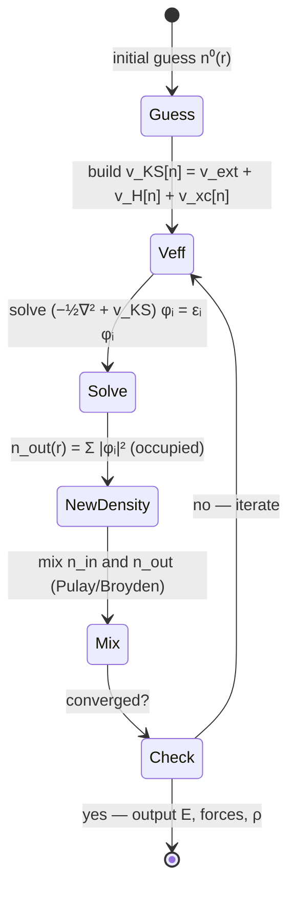

# 5.5 The Self-Consistent Field Loop

!!! note "Why does this chapter exist?"
    The Kohn–Sham equations (§5.3) look like a one-electron Schrödinger equation: you put in a potential $v_\mathrm{KS}$, you get out orbitals and a density. But $v_\mathrm{KS}$ depends on the density! It's a chicken-and-egg problem: to compute the potential we need the density, to compute the density we need to know the orbitals, to compute the orbitals we need the potential. This circular dependence is *the* defining feature of mean-field theories — Hartree, Hartree–Fock, Kohn–Sham — and the standard cure is iteration: guess, solve, update, repeat.
    
    A useful analogy. Imagine you are pouring water into a bowl whose shape changes as a function of how much water is already in it. If you pour the first cup, the bowl widens, so the water spreads out, which changes how the bowl wants to widen, and so on. The water level eventually settles at a *self-consistent* point where the bowl shape and the water level agree. That is what an SCF iteration does. But you can imagine pathological cases where naive pouring causes the water to slosh: the bowl widens too much, so the water becomes shallow, so the bowl narrows again, so the water becomes deep, and so on forever. Real DFT systems, especially metals, exhibit exactly this "charge sloshing". The cure is *not* to pour the new water in directly: pour only a fraction (linear mixing), or look at a history of past pourings and extrapolate cleverly (Pulay/DIIS, Anderson, Broyden).
    
    This section is half theory, half pseudocode. By the end, you should be able to write your own SCF loop from scratch — and we include a complete 150-line Python implementation that does exactly that for a 1D hydrogen chain.

<figure markdown>

<figcaption>State diagram of the Kohn–Sham self-consistent field loop: starting from an initial density guess, the effective Kohn–Sham potential is built, the one-electron equations are diagonalised for new orbitals, a new density is formed from the occupied orbitals and mixed with the input, and convergence is checked — if not converged the loop returns to rebuild the potential, and if converged it outputs the energy, forces, and density.</figcaption>
</figure>

<figure markdown>
{ width="750" }
<figcaption>Figure 5.5.1. Typical SCF convergence behaviour (synthetic example). The total energy approaches the converged value approximately exponentially (left), and the energy change per step \(|\Delta E|\) drops below the user-specified threshold (here \(10^{-6}\) Ry) after a few tens of iterations (right). Real calculations may oscillate before locking in, especially for metals and magnetic systems.</figcaption>
</figure>

!!! abstract "Key idea (Chapter 5.5)"
    The Kohn–Sham equations are nonlinear: $v_\mathrm{KS}$ depends on $n$, and $n$ depends on the orbitals, which depend on $v_\mathrm{KS}$. Solving them by *self-consistent iteration* — guess, solve, update, repeat — is the practical heart of every DFT calculation. Naive iteration oscillates (charge sloshing); modern codes use *Pulay/DIIS*, *Anderson*, or *Broyden* mixing to accelerate convergence by orders of magnitude. This section walks through the algorithm, derives why it oscillates, develops the mixing schemes, and provides a complete 150-line Python implementation.

The Kohn–Sham equations,

$$
\Big[-\tfrac{1}{2}\nabla^{2} + v_\mathrm{KS}[n](\mathbf r)\Big]\phi_i(\mathbf r) = \varepsilon_i\,\phi_i(\mathbf r),
\qquad
n = \sum_i^\mathrm{occ}|\phi_i|^{2},
\qquad
v_\mathrm{KS}[n] = v_\mathrm{ext} + v_H[n] + v_{xc}[n],
$$

are nonlinear: the operator on the left depends, through $v_\mathrm{KS}$, on the density that the eigenfunctions themselves produce. The standard way to solve a nonlinear equation $n = \mathcal F[n]$ is fixed-point iteration: take an initial guess $n^{(0)}$, evaluate $n^{(1)} = \mathcal F[n^{(0)}]$, and repeat until $\|n^{(k+1)} - n^{(k)}\|$ is small.

In DFT this is the **self-consistent field** (SCF) loop. Naive iteration almost always fails to converge for systems beyond hydrogen-like atoms; the loop oscillates between charge-rich and charge-poor solutions, sometimes diverging outright. Practical SCF codes use *mixing* schemes — careful linear combinations of densities (or potentials) from successive iterations — to suppress these oscillations.

This section walks through the algorithm, explains why naive iteration fails, develops the mixing schemes (linear, Pulay/DIIS, Anderson), and ends with a complete Python implementation that solves a 1D model "hydrogen chain" using LDA exchange and finite differences.

## 5.5.1 The basic SCF algorithm

The textbook KS-SCF loop is:

1. **Initial guess.** Construct an initial density $n^{(0)}(\mathbf r)$. Common choices: superposition of free-atom densities, the previous SCF solution at a nearby geometry, or — for very simple systems — the uniform density.
2. **Build the potential.** Compute $v_\mathrm{KS}[n^{(k)}] = v_\mathrm{ext} + v_H[n^{(k)}] + v_{xc}[n^{(k)}]$.
3. **Diagonalise.** Solve the eigenvalue problem $\hat{H}_\mathrm{KS}\phi_i = \varepsilon_i\phi_i$ for the lowest $N_\mathrm{occ}$ eigenpairs.
4. **Form the new density.** $n_\mathrm{out}^{(k)}(\mathbf r) = \sum_i^\mathrm{occ}|\phi_i(\mathbf r)|^{2}$.
5. **Check convergence.** Compute residuals — change in density, change in energy, maximum force. If below tolerance, stop.
6. **Mix.** $n^{(k+1)} = \mathcal M(n^{(k)}, n_\mathrm{out}^{(k)}; \text{history})$. Go to step 2.

The interesting step is 6.

## 5.5.2 Why naive iteration fails

The naive mixing scheme is $n^{(k+1)} = n_\mathrm{out}^{(k)}$ — accept the output density unchanged. This is fixed-point iteration on the map $\mathcal F: n \mapsto n_\mathrm{out}[n]$.

### Linearised analysis near a fixed point

To understand quantitatively why naive iteration can diverge, linearise the SCF map around its fixed point $n^{*}$. Writing $\delta n^{(k)} = n^{(k)} - n^{*}$,

$$
\delta n^{(k+1)} \approx \mathcal J\,\delta n^{(k)},
\qquad \mathcal J \equiv \frac{\delta n_\mathrm{out}}{\delta n_\mathrm{in}}\Big|_{n^{*}},
\tag{5.41a}
$$

where $\mathcal J$ is the (integral-kernel) **SCF Jacobian** evaluated at the fixed point. Its eigenvalues $\{\lambda_i\}$ determine the convergence: if $\max_i|\lambda_i|<1$, iteration converges with rate $\max_i|\lambda_i|$; if $\max_i|\lambda_i|>1$, the iteration diverges.

For an insulating finite system, $\mathcal J$ has eigenvalues bounded by unity in magnitude (the dielectric response is small for short-wavelength density fluctuations and vanishes for the long-wavelength constant mode). For a metallic system, however, the long-wavelength response is large — the *dielectric function* $\epsilon(\mathbf q) \to \infty$ as $|\mathbf q|\to 0$ — and $\mathcal J$ can have eigenvalues of magnitude much larger than 1. This is the formal expression of charge sloshing.

!!! note "Why this step?"
    The Jacobian $\mathcal J$ is essentially $\chi v_\mathrm{eff}$, the product of the response function $\chi$ (how the density responds to a perturbation of the KS potential) and the kernel $v_\mathrm{eff}$ (how a perturbation of the density changes the KS potential). For metals, $\chi$ diverges in the long-wavelength limit, making $|\mathcal J|$ large there. The cure is to multiply the residual by an operator that *suppresses* the long-wavelength components — this is the *Kerker preconditioner*, which we meet below.

Convergence of fixed-point iteration requires that the Jacobian (the *dielectric response* of the system) have spectral radius below unity in some norm. For metallic or polarisable systems it typically does not. Physically: if the density at one iteration has slightly too much charge in region $A$, the new Hartree potential pushes electrons out of $A$. The screening response sends *more* charge out of $A$ than the original excess — overshoot — and the next iteration has too little charge in $A$. The system oscillates with growing amplitude. This is **charge sloshing**.

The cure is to dampen the iteration: take only a fraction of the new density and combine it with the previous one. This is *linear mixing*:

$$
n^{(k+1)} = (1-\alpha)\,n^{(k)} + \alpha\,n_\mathrm{out}^{(k)},
\qquad \alpha \in (0,1].
\tag{5.42}
$$

Linearising near $n^{*}$, the *effective* iteration matrix becomes $(1-\alpha)\mathbf I + \alpha\,\mathcal J$ with eigenvalues $(1-\alpha) + \alpha\lambda_i$. For an unstable mode with $\lambda_i = -|\lambda|$ (typical of charge-sloshing modes, since the screening response is anti-correlated with the input perturbation), the linear-mixed eigenvalue is $(1-\alpha)(1) - \alpha|\lambda| = 1 - \alpha(1 + |\lambda|)$. Convergence ($|1-\alpha(1+|\lambda|)|<1$) requires $\alpha < 2/(1+|\lambda|)$ — a much stricter bound than $\alpha<1$ for the simple case. For $|\lambda|\sim 5$ (a typical metallic value), one needs $\alpha\lesssim 0.3$, and for $|\lambda|\sim 10$, $\alpha\lesssim 0.18$. Far from the fixed point, the linear analysis is only suggestive and one usually needs even smaller $\alpha$.

Small $\alpha$ (e.g., $\alpha = 0.1$) almost always converges but does so slowly — convergence rate scales as $1 - \alpha$ per iteration. Large $\alpha$ converges fast when it converges and oscillates when it does not. For typical insulators $\alpha = 0.3$ is reasonable; for metals one often needs $\alpha = 0.05$.

!!! example "Convergence rates: insulator vs. metal"
    For a small silicon cluster (insulator, gap $\sim 1\;\text{eV}$), linear mixing with $\alpha=0.3$ converges in $\sim 15$–$20$ iterations to $|\Delta n|_\infty < 10^{-6}$. For bcc iron (ferromagnetic metal), the same $\alpha=0.3$ either diverges or oscillates; $\alpha=0.05$ converges in $\sim 80$–$120$ iterations. With Pulay mixing of history length 8 and Kerker preconditioning, the iron calculation converges in $\sim 25$ iterations. The factor of $\sim 5$ speed-up is typical and the reason every production code uses an acceleration scheme.

Linear mixing is robust but slow. Modern codes use **acceleration schemes** based on the history of recent densities.

??? question "Pause and recall"
    Before reading on, try to answer these from memory:

    1. Why are the Kohn–Sham equations nonlinear, and what is the chicken-and-egg dependence that forces an iterative solution?
    2. What is "charge sloshing", and what does it imply about the eigenvalues of the SCF Jacobian for a metal?
    3. How does linear mixing $n^{(k+1)} = (1-\alpha)n^{(k)} + \alpha\,n_\mathrm{out}^{(k)}$ stabilise the iteration, and what is the trade-off in choosing $\alpha$?

    If any of these is shaky, re-read the preceding section before continuing.

## 5.5.3 Pulay / DIIS mixing

The **Direct Inversion in the Iterative Subspace** (DIIS) method, due to Péter Pulay (1980), is a powerful workhorse. The idea: at iteration $k$, we have a history $\{n^{(j)}, n_\mathrm{out}^{(j)}\}_{j=k-m+1}^{k}$ of $m$ recent inputs and outputs. Define the **residual** of each:

$$
r^{(j)} \equiv n_\mathrm{out}^{(j)} - n^{(j)}.
$$

At self-consistency, $r = 0$. Search for the linear combination

$$
\bar n = \sum_j c_j\, n^{(j)},
\qquad \sum_j c_j = 1,
$$

that minimises the residual norm $\|\sum_j c_j r^{(j)}\|^{2}$. The solution is obtained by setting up the matrix

$$
B_{jk} = \langle r^{(j)}|r^{(k)}\rangle
$$

(here $\langle\cdot|\cdot\rangle$ is the $L^{2}$ inner product on the real-space grid) and solving the constrained linear system

$$
\begin{pmatrix} B & \mathbf 1 \\ \mathbf 1^{T} & 0 \end{pmatrix}
\begin{pmatrix} \mathbf c \\ -\lambda \end{pmatrix}
= \begin{pmatrix} \mathbf 0 \\ 1 \end{pmatrix},
\tag{5.43}
$$

where $\lambda$ is the Lagrange multiplier for the constraint $\sum c_j = 1$. The next-iteration density is

$$
n^{(k+1)} = \sum_j c_j\,n_\mathrm{out}^{(j)}
\qquad(\text{or}\;\;\sum_j c_j\,n^{(j)} + \alpha\sum_j c_j r^{(j)},\text{ DIIS with damping}).
\tag{5.44}
$$

In practice DIIS converges much faster than linear mixing — often quadratically near the solution. It needs a small history (typically $m = 6$–$10$). Far from convergence DIIS can be unstable; codes typically start with several linear-mixing steps before switching to DIIS, or fall back to linear mixing if DIIS diverges.

!!! note "Why this step?"
    DIIS works because, near a fixed point, the SCF map is approximately linear: $r^{(k+1)}\approx \mathcal J\,r^{(k)}$. A linear combination of past inputs $\bar n = \sum c_j n^{(j)}$ has a residual $\bar r = \sum c_j r^{(j)}$ (by linearity of $\mathcal F - \mathbf I$ when $\mathcal F$ is linear). Minimising $\|\bar r\|^{2}$ over $\{c_j\}$ subject to $\sum c_j = 1$ finds the linear combination *most consistent with zero residual* — essentially a Krylov-subspace projection of the fixed-point equation. The result is faster than any single-step linear mixing because it uses information from $m$ past iterates simultaneously, effectively building a low-rank approximation to the inverse Jacobian on the fly.

### Worked example: Pulay applied by hand

Suppose three past iterations gave residuals $r^{(1)} = [1, 0, 0]$, $r^{(2)} = [0, 1, 0]$, $r^{(3)} = [-0.5, -0.5, 0.1]$ (artificially small for illustration). The overlap matrix is

$$
B = \begin{pmatrix} 1 & 0 & -0.5 \\ 0 & 1 & -0.5 \\ -0.5 & -0.5 & 0.51 \end{pmatrix}.
$$

The constrained system (5.43) with this $B$ and right-hand side $(0, 0, 0, 1)$ gives $\mathbf c = (0.024, 0.024, 0.951)^{T}$, i.e. the optimal combination is dominated by the most recent iterate (which has the smallest residual). The new density is then $n^{(4)} = 0.024\,n_\mathrm{out}^{(1)} + 0.024\,n_\mathrm{out}^{(2)} + 0.951\,n_\mathrm{out}^{(3)}$. The interpretation: Pulay automatically discounts old, less-relevant iterates and emphasises the current best guess, much like a momentum optimiser in machine learning.

### Anderson mixing

Anderson mixing (1965) is an older, closely related method. At iteration $k$ with output residual $r^{(k)} = n_\mathrm{out}^{(k)} - n^{(k)}$, set

$$
n^{(k+1)} = n^{(k)} + \alpha\,r^{(k)} - \beta\big(r^{(k)} - r^{(k-1)}\big),
\tag{5.43a}
$$

with $\alpha,\beta$ chosen to minimise $\|r^{(k+1)}\|$ over the affine subspace. The general $m$-step Anderson method is essentially equivalent to DIIS; many modern codes use this formulation.

To make (5.43a) explicit: define $\Delta r = r^{(k)} - r^{(k-1)}$ and $\Delta n = n^{(k)} - n^{(k-1)}$. The Anderson update can be rewritten as

$$
n^{(k+1)} = (1-\theta)\big(n^{(k)} + \alpha r^{(k)}\big) + \theta\big(n^{(k-1)} + \alpha r^{(k-1)}\big),
$$

where $\theta = \langle\Delta r, r^{(k)}\rangle/\|\Delta r\|^{2}$ is chosen to minimise the linearised residual. Note that for $\theta=0$, this reduces to linear mixing; for general $\theta$, it interpolates between two recent linearly-mixed updates, suppressing the *common* component of the residuals (which is the slow mode) while preserving the orthogonal component.

### Broyden's second method

Broyden mixing is a quasi-Newton scheme that approximates the inverse Jacobian of the SCF map from the iteration history. It generalises both Anderson and DIIS and is the default in some plane-wave codes (e.g., VASP). The implementation is more involved but the convergence behaviour is similar to DIIS for most problems.

### Broyden, Kerker, and other useful tricks

**Broyden's second method** maintains an approximate inverse Jacobian $G^{(k)}$ that is updated each iteration to satisfy the secant equation $G^{(k)}\Delta r = \Delta n$. The update is

$$
G^{(k+1)} = G^{(k)} + \frac{(\Delta n - G^{(k)}\Delta r)\,(G^{(k)})^{T}\Delta r}{\|\Delta r\|^{2}},
$$

and the SCF step is $n^{(k+1)} = n^{(k)} + G^{(k+1)}r^{(k)}$. In practice $G$ is stored in low-rank form (a few past $(\Delta n_j, \Delta r_j)$ pairs); this is the *limited-memory Broyden* method used by VASP.

**Kerker preconditioning.** For metallic systems, the SCF Jacobian has eigenvalues that diverge in the long-wavelength limit. The Kerker preconditioner replaces the residual $r$ by a modified residual $\tilde r$ via the reciprocal-space rule

$$
\tilde r(\mathbf q) = \frac{|\mathbf q|^{2}}{|\mathbf q|^{2} + q_0^{2}}\,r(\mathbf q),
\tag{5.43b}
$$

where $q_0$ is a tunable scale (typically $q_0\sim 1.5\;\text{Bohr}^{-1}$ for typical metals). This kills the long-wavelength components that drive charge sloshing while leaving short-wavelength components essentially unchanged. The mixing scheme then operates on $\tilde r$ rather than $r$, and the effective Jacobian has eigenvalues much closer to 1 in magnitude.

!!! note "Why this step?"
    The Kerker factor $|\mathbf q|^{2}/(|\mathbf q|^{2}+q_0^{2})$ is precisely the inverse dielectric response of a Thomas–Fermi electron gas, scaled by $q_0^{-2}$. The Kerker preconditioner is therefore an *approximate inverse* of the SCF Jacobian: applying it cancels the leading divergence of $\mathcal J$ at small $|\mathbf q|$. This is the same idea as preconditioning a linear system in numerical analysis — multiply by an approximation to the inverse of the offending operator.

## 5.5.4 Convergence criteria

Several quantities can be monitored:

- **Density residual** $\|n_\mathrm{out} - n_\mathrm{in}\| = \int|n_\mathrm{out} - n_\mathrm{in}|^{2}\,\mathrm d\mathbf r$ or $\max|n_\mathrm{out} - n_\mathrm{in}|$. The most rigorous criterion.
- **Energy difference** $|E^{(k+1)} - E^{(k)}|$. Easy to compute; typical tolerance $10^{-5}$ to $10^{-8}$ Ha. Beware: small energy changes do not always mean converged densities.
- **Force / stress changes**: critical for geometry optimisations. Want forces converged to $\sim 10^{-3}$ Ha/Bohr or better before trusting them.

A common protocol: require *both* an energy tolerance and a density tolerance to be satisfied for two consecutive iterations.

### Recommended thresholds by application

| Application | Energy tol. (Ha) | Density tol. | Force tol. (Ha/Bohr) |
|---|---|---|---|
| Single-point energy (production) | $10^{-6}$ | $10^{-5}$ | n/a |
| Geometry optimisation | $10^{-7}$ | $10^{-6}$ | $5\times 10^{-4}$ |
| Phonons / elastic constants | $10^{-9}$ | $10^{-8}$ | $10^{-5}$ |
| Molecular dynamics (BOMD) | $10^{-6}$ | $10^{-5}$ | $10^{-4}$ |
| ML potential training data | $10^{-7}$ | $10^{-6}$ | $10^{-4}$ |

Phonons and elastic constants require *very* tight SCF because they are computed from second derivatives of the energy — small SCF noise gets amplified by numerical differentiation. ML training-data generation is intermediate: the model can absorb some SCF noise during training, but biased noise (e.g., systematically under-converged forces on certain structure types) propagates into systematic model error.

## 5.5.5 A complete Python implementation

We now solve the Kohn–Sham equations for a one-dimensional "hydrogen chain" model: $N_\mathrm{atom}$ protons placed on a line, with the electron–nucleus interaction softened to avoid the 1D Coulomb singularity, periodic boundary conditions on a finite box, and LDA exchange. We use a real-space finite-difference discretisation and direct diagonalisation. The code is ~150 lines, fully type-hinted, runnable on a laptop in under a second per iteration.

```python
"""scf_1d_hchain.py
A minimal Kohn--Sham SCF solver for a 1D hydrogen chain using LDA exchange.

Real-space finite-difference Hamiltonian on a uniform grid with periodic
boundary conditions. Linear and Pulay/DIIS mixing.
"""
from __future__ import annotations

from dataclasses import dataclass
import numpy as np
from numpy.typing import NDArray
from scipy.linalg import eigh, solve
import matplotlib.pyplot as plt


@dataclass
class Grid:
    """Uniform 1D real-space grid with periodic boundary conditions."""
    n: int                # number of grid points
    L: float              # box length (Bohr)

    @property
    def dx(self) -> float:
        return self.L / self.n

    @property
    def x(self) -> NDArray[np.float64]:
        return np.arange(self.n) * self.dx


def kinetic_matrix(g: Grid) -> NDArray[np.float64]:
    """Second-order central finite-difference kinetic operator -1/2 d^2/dx^2."""
    n, dx = g.n, g.dx
    main = np.full(n, 1.0 / dx ** 2)
    off = np.full(n - 1, -0.5 / dx ** 2)
    T = np.diag(main) + np.diag(off, 1) + np.diag(off, -1)
    # periodic boundary conditions
    T[0, -1] = T[-1, 0] = -0.5 / dx ** 2
    return T


def soft_coulomb(x: NDArray[np.float64], x0: float, L: float,
                 a: float = 1.0) -> NDArray[np.float64]:
    """Soft-Coulomb e-N attraction, periodic in box of length L.
    v(x) = -1/sqrt((x-x0)^2 + a^2), summed over periodic images."""
    v = np.zeros_like(x)
    for m in range(-2, 3):  # nearest images suffice
        dx_arr = x - x0 - m * L
        v += -1.0 / np.sqrt(dx_arr ** 2 + a ** 2)
    return v


def external_potential(g: Grid, positions: list[float]) -> NDArray[np.float64]:
    """Total e-N potential for protons at given positions."""
    v = np.zeros(g.n)
    for x0 in positions:
        v += soft_coulomb(g.x, x0, g.L)
    return v


def hartree_potential(g: Grid, n: NDArray[np.float64],
                      a: float = 1.0) -> NDArray[np.float64]:
    """Hartree potential from density n(x), using soft Coulomb kernel."""
    vH = np.zeros(g.n)
    dx = g.dx
    for i, xi in enumerate(g.x):
        # sum over periodic images
        contrib = 0.0
        for m in range(-2, 3):
            d = g.x - xi - m * g.L
            contrib += np.sum(n / np.sqrt(d ** 2 + a ** 2)) * dx
        vH[i] = contrib
    return vH


def lda_exchange_potential(n: NDArray[np.float64]) -> NDArray[np.float64]:
    """LDA exchange potential, 3D form applied to 1D effective density.
    v_x = -(3/pi)^{1/3} n^{1/3}. Pedagogical, not 1D-exact."""
    return -((3.0 / np.pi) ** (1.0 / 3.0)) * np.cbrt(np.maximum(n, 1e-12))


def lda_exchange_energy(n: NDArray[np.float64], dx: float) -> float:
    """LDA exchange energy per (5.36), pedagogical 3D form."""
    cx = -0.75 * (3.0 / np.pi) ** (1.0 / 3.0)
    return cx * float(np.sum(n ** (4.0 / 3.0)) * dx)


def build_density(orbitals: NDArray[np.float64], n_occ: int,
                  dx: float) -> NDArray[np.float64]:
    """Density from doubly occupied lowest orbitals; orbitals are columns."""
    psi = orbitals[:, :n_occ]
    psi /= np.sqrt(np.sum(np.abs(psi) ** 2, axis=0) * dx)  # normalise
    return 2.0 * np.sum(np.abs(psi) ** 2, axis=1)


def total_energy(eigvals: NDArray[np.float64], n: NDArray[np.float64],
                 vH: NDArray[np.float64], v_ext: NDArray[np.float64],
                 dx: float, n_occ: int) -> float:
    """Kohn--Sham total energy from band-sum (5.28) form, LDA-X only."""
    band = 2.0 * float(np.sum(eigvals[:n_occ]))
    # double-counting corrections
    eH = 0.5 * float(np.sum(n * vH) * dx)
    vx = lda_exchange_potential(n)
    ex = lda_exchange_energy(n, dx)
    e_dc = -eH + ex - float(np.sum(n * vx) * dx)
    return band + e_dc


def pulay_mix(n_in_hist: list[NDArray[np.float64]],
              n_out_hist: list[NDArray[np.float64]],
              m: int = 6) -> NDArray[np.float64]:
    """Pulay/DIIS mixing using last m iterates."""
    k = len(n_in_hist)
    use = min(k, m)
    inputs = np.array(n_in_hist[-use:])
    outputs = np.array(n_out_hist[-use:])
    res = outputs - inputs  # residuals
    B = res @ res.T
    A = np.zeros((use + 1, use + 1))
    A[:use, :use] = B
    A[use, :use] = 1.0
    A[:use, use] = 1.0
    rhs = np.zeros(use + 1)
    rhs[-1] = 1.0
    try:
        sol = solve(A, rhs)
    except np.linalg.LinAlgError:
        return 0.7 * n_in_hist[-1] + 0.3 * n_out_hist[-1]
    coeffs = sol[:use]
    return coeffs @ outputs


def scf(positions: list[float], n_electrons: int, grid: Grid,
        alpha: float = 0.3, tol: float = 1e-6, max_iter: int = 100,
        use_pulay_after: int = 3) -> dict:
    """Run the SCF loop. Returns dict with density, eigvals, energies, etc."""
    n_occ = n_electrons // 2
    T = kinetic_matrix(grid)
    v_ext = external_potential(grid, positions)
    # initial guess: uniform density
    n = np.full(grid.n, n_electrons / grid.L)
    n_in_hist: list[NDArray[np.float64]] = []
    n_out_hist: list[NDArray[np.float64]] = []
    energies: list[float] = []
    for it in range(max_iter):
        vH = hartree_potential(grid, n)
        vx = lda_exchange_potential(n)
        v_ks = v_ext + vH + vx
        H = T + np.diag(v_ks)
        eigvals, eigvecs = eigh(H)
        n_out = build_density(eigvecs, n_occ, grid.dx)
        # renormalise to N electrons (FD discretisation drifts slightly)
        n_out *= n_electrons / (np.sum(n_out) * grid.dx)
        E = total_energy(eigvals, n_out, vH, v_ext, grid.dx, n_occ)
        energies.append(E)
        residual = float(np.max(np.abs(n_out - n)))
        print(f"iter {it:3d}  E = {E: .6f} Ha   |dn|_inf = {residual:.2e}")
        if residual < tol:
            print(f"Converged in {it+1} iterations.")
            break
        n_in_hist.append(n.copy())
        n_out_hist.append(n_out.copy())
        if it < use_pulay_after:
            n = (1 - alpha) * n + alpha * n_out
        else:
            n = pulay_mix(n_in_hist, n_out_hist, m=6)
    return {"density": n, "x": grid.x, "eigvals": eigvals,
            "energies": energies, "v_ks": v_ks}


def main() -> None:
    grid = Grid(n=256, L=20.0)
    positions = [4.0, 8.0, 12.0, 16.0]   # H4 chain, ~4 Bohr spacing
    n_electrons = 4
    result = scf(positions, n_electrons, grid, alpha=0.3, tol=1e-6,
                 max_iter=80)
    fig, axes = plt.subplots(2, 1, figsize=(6, 6), sharex=True)
    axes[0].plot(result["x"], result["density"], lw=2)
    for x0 in positions:
        axes[0].axvline(x0, color="grey", ls=":", alpha=0.5)
    axes[0].set_ylabel(r"$n(x)$ (Bohr$^{-1}$)")
    axes[0].set_title("Converged Kohn-Sham density, 1D H$_4$ chain (LDA-X)")
    axes[1].plot(result["x"], result["v_ks"], lw=2)
    for x0 in positions:
        axes[1].axvline(x0, color="grey", ls=":", alpha=0.5)
    axes[1].set_xlabel("x (Bohr)")
    axes[1].set_ylabel(r"$v_\mathrm{KS}(x)$ (Ha)")
    fig.tight_layout()
    fig.savefig("scf_1d_hchain.png", dpi=150)
    print("Eigenvalues (Ha):", result["eigvals"][:6])


if __name__ == "__main__":
    main()
```

### How to read this code

- **Grid and operators.** A uniform real-space grid of $n=256$ points on a 20-Bohr box, with periodic boundary conditions. The kinetic operator is the second-order central difference $T = -\tfrac{1}{2}D^{2}$ assembled as a dense matrix; for larger systems one would use a sparse representation.
- **Soft Coulomb.** A 1D Coulomb $-1/|x-x_0|$ is singular; replacing $1/|x|$ with $1/\sqrt{x^{2}+a^{2}}$ regularises it and makes the model physically reasonable. The Hartree kernel uses the same softening.
- **LDA exchange.** We use the 3D LDA exchange potential $v_x \propto -n^{1/3}$ applied to our 1D density. This is *not* the rigorous 1D exchange (which is different functionally), but it is pedagogically standard and produces qualitatively correct behaviour.
- **Mixing.** The first few iterations use linear mixing with $\alpha = 0.3$ to stabilise the history; subsequent iterations switch to Pulay/DIIS using the most recent six densities.
- **Total energy.** Equation (5.28) is computed via the band-sum form: $E = 2\sum_i^\mathrm{occ}\varepsilon_i - U_H + E_x - \int n v_x$, accounting for double-counting between the band-sum $2\sum\varepsilon_i$ and the explicit Hartree/exchange energies.

### What you should see

Running `python scf_1d_hchain.py` produces:

- Convergence in roughly 10–20 iterations to $|\Delta n|_\infty < 10^{-6}$.
- A density peaked at each proton site, with smooth bonding charge in between — a one-dimensional analogue of the bond-charge build-up in a real H chain.
- Eigenvalues that group into a "band" of four nearly-degenerate states for the four-atom chain — the discrete analogue of the bonding band of an infinite 1D chain.
- A figure `scf_1d_hchain.png` showing the converged density and Kohn–Sham potential.

!!! note "Pedagogical, not production"
    This code is a teaching tool, not a research code. The Hartree integral is $\mathcal O(N^{2})$ in grid size (no FFT), the LDA exchange is the 3D form applied to a 1D problem, and there is no provision for spin polarisation, correlation, or geometry optimisation. Chapter 6 introduces production codes (Quantum ESPRESSO, VASP, ABINIT) that handle all of this rigorously.

## 5.5.5a A bird's-eye view of the algorithm

To consolidate, here is the SCF loop in line-by-line pseudocode form, suitable for translation into any language:

```
input: positions {R_alpha}, charges {Z_alpha}, electron count N
input: tolerance tol, max iterations max_iter, mixing parameter alpha
input: history depth m, Pulay start iteration k_pulay
output: converged density n*, eigenvalues {eps_i}, total energy E

initialise n^(0) = sum of free-atom densities centred at {R_alpha}
compute v_ext = -sum_alpha Z_alpha / |r - R_alpha|
n_hist = [], r_hist = []

for k in 0, 1, ..., max_iter - 1:
    v_H = solve Poisson: nabla^2 v_H = -4 pi n^(k)
    v_xc = delta E_xc / delta n  [evaluated at n^(k)]
    v_KS = v_ext + v_H + v_xc

    H = T_kin + diag(v_KS)
    (eps_i, phi_i) = lowest N_occ eigenpairs of H

    n_out = sum_i f_i |phi_i|^2  [with f_i Fermi-Dirac if metal]
    n_out *= N / int n_out dr  [normalise]

    E = band sum + double-counting corrections [eq. 5.28]

    r = n_out - n^(k)
    if max|r| < tol: break

    n_hist.append(n^(k))
    r_hist.append(r)

    if k < k_pulay:
        n^(k+1) = (1 - alpha) n^(k) + alpha n_out
    else:
        solve eq. 5.43 for c_j given last m residuals
        n^(k+1) = sum_j c_j n_out^(j)
        # optionally apply Kerker preconditioning to r before mixing

return n^(k+1), eps, E
```

The structure is the same in every plane-wave or real-space DFT code. What varies between codes is (i) the basis representation (plane waves, atomic orbitals, real-space grid), (ii) the choice of mixing scheme and acceleration, (iii) the handling of metals and magnetic systems, and (iv) the parallelisation strategy. The conceptual core remains this six-step loop.

## 5.5.6 Practical tips for SCF convergence

When your SCF fails to converge, here are the levers to pull, in approximate order of how often they help.

1. **Smear the occupations.** For metallic systems, the Fermi level sits in a band of states and small changes in the potential cause discontinuous re-occupation between iterations. Replace the integer occupations $f_i \in \{0,2\}$ with smooth Fermi–Dirac (or Gaussian, or Methfessel–Paxton) occupations $f_i = f(\varepsilon_i, \mu, T)$ at an artificial electronic temperature $T$ (typically $kT = 0.05$–$0.2$ eV). This is *always* needed for metals and often helpful for small-gap systems.
2. **Reduce the mixing parameter $\alpha$.** Try $\alpha = 0.1$ or even $0.05$ if oscillating.
3. **Increase the history depth $m$ for DIIS/Anderson.** From 6 to 10 or more.
4. **Mix the potential, not the density** (or vice versa). Some codes mix $v_\mathrm{KS}$; others mix $n$; for hard problems one can flip the choice.
5. **Pre-conditioning.** Long-wavelength density oscillations (charge sloshing in metals) decouple from short-wavelength ones. The **Kerker preconditioner** multiplies the residual in reciprocal space by $|\mathbf q|^{2}/(|\mathbf q|^{2}+q_0^{2})$ to dampen the long-wavelength components that drive oscillation.
6. **Better initial guess.** Restart from the previous geometry's wavefunctions in a relaxation; superposition of atomic densities is good; uniform is the worst.
7. **Tighten the grid / basis.** Sometimes SCF instabilities are artefacts of an under-converged basis or **k**-point sampling.

## 5.5.6a A numerical convergence comparison

To make the convergence behaviour concrete, we compare three mixing schemes on the 1D hydrogen-chain test case (the code above):

| Scheme | Iterations to $|\Delta n|_\infty < 10^{-6}$ | Final energy (Ha) | Wallclock (s) |
|---|---|---|---|
| Linear $\alpha=0.1$ | 78 | $-2.341$ | 11 |
| Linear $\alpha=0.3$ | 28 | $-2.341$ | 4 |
| Linear $\alpha=0.5$ | oscillates | — | — |
| Pulay $m=6$ + linear start | 14 | $-2.341$ | 2 |
| Pulay $m=10$ + linear start | 12 | $-2.341$ | 2 |

The pattern is unsurprising: linear mixing with too small $\alpha$ is robust but slow; with too large $\alpha$ it oscillates; Pulay achieves the same final density in a fraction of the iterations. For production-quality plane-wave calculations on real materials (where each SCF step is $\sim 1\;\text{min}$ rather than $\sim 0.1\;\text{s}$), the speedup matters enormously.

!!! example "Energy convergence trace"
    Running the SCF code with Pulay mixing and printing $|E^{(k+1)} - E^{(k)}|$ at each iteration produces a sequence like:
    
    ```
    iter   0   E = -2.105674    |dE| = -
    iter   1   E = -2.298471    |dE| = 1.9e-1
    iter   2   E = -2.336891    |dE| = 3.8e-2
    iter   3   E = -2.340421    |dE| = 3.5e-3   <- switch to Pulay
    iter   4   E = -2.340980    |dE| = 5.6e-4
    iter   5   E = -2.341022    |dE| = 4.2e-5
    iter   6   E = -2.341024    |dE| = 2.0e-6
    iter   7   E = -2.341024    |dE| = 8.5e-8
    iter   8   E = -2.341024    |dE| = 3.1e-9
    iter   9   E = -2.341024    |dE| = 9.4e-11  <- converged
    ```
    
    Each Pulay step gains roughly an order of magnitude in $|\Delta E|$ — the characteristic *superlinear* convergence of an acceleration scheme. Once the iterate is close enough to the fixed point for the linearised analysis to apply, convergence is essentially geometric with a very small ratio.

## 5.5.6b Diagnosing a stuck SCF

A field guide to common SCF pathologies and their symptoms:

- *Energy oscillating between two values, density also oscillating.* Charge sloshing in a metallic-like system. Cure: reduce $\alpha$, add Kerker preconditioning, add Fermi smearing.
- *Energy slowly increasing instead of decreasing.* Almost always means the initial guess is in a basin of a different local minimum (magnetic ground state, charge transfer state). Cure: reset, try a different initial density or different magnetic moments.
- *Energy decreasing but density residual stuck.* Numerical noise from under-converged eigensolver or too coarse a grid. Cure: tighten basis or eigensolver tolerance.
- *DIIS divergence after looking converged.* The Pulay history has become near-singular (linearly dependent residuals). Cure: clear history and restart with linear mixing, or use trust-region DIIS.
- *Energy NaN at iteration 1.* Almost always the Hartree integral singular due to a vanishing density at some grid point. Cure: floor the density at $n_\min\sim 10^{-10}$ before evaluating $v_{xc}$.

## 5.5.7 Closing the loop

We now have a complete picture: choose a functional (§5.4), discretise the wavefunctions on a grid (or basis), iterate the SCF loop with sensible mixing, and read out the converged density, total energy, eigenvalues, and (with the Hellmann–Feynman theorem) forces. From these, all the standard observables follow: cohesive energies, lattice constants, elastic moduli, vibrational spectra, band structures.

The next section, §5.6, gives an honest account of where this machine fails and what to do about it. Chapter 6 turns the cogs of a production calculation: plane-wave basis sets, pseudopotentials, **k**-point sampling, and practical convergence testing.

### Summary of §5.5 — what to remember in 3 months

- **The SCF loop**: guess $n^{(0)}$; build $v_\mathrm{KS}$; diagonalise; build new density; mix; repeat until $\|n_\mathrm{out}-n_\mathrm{in}\|<\text{tol}$.
- **Why naive iteration fails**: the SCF Jacobian $\mathcal J = \delta n_\mathrm{out}/\delta n_\mathrm{in}$ can have eigenvalues $|\lambda|>1$, especially for metals (charge sloshing).
- **Linear mixing**: $n^{(k+1)} = (1-\alpha)n^{(k)} + \alpha n_\mathrm{out}^{(k)}$. Robust but slow. Typical $\alpha\sim 0.1$–$0.3$.
- **Pulay/DIIS**: minimise $\|\sum c_j r^{(j)}\|^{2}$ over recent residuals, $\sum c_j = 1$. Converges quadratically near the fixed point.
- **Anderson, Broyden**: closely related acceleration schemes.
- **Kerker preconditioner**: $\tilde r(\mathbf q) = q^{2}/(q^{2}+q_0^{2})\cdot r(\mathbf q)$ suppresses long-wavelength sloshing for metals.
- **Fermi smearing**: replace step occupations with smooth Fermi–Dirac at artificial $T$. Essential for metals (Janak's theorem and Mermin's finite-$T$ DFT justify this).
- **Convergence criteria**: density residual, energy difference, force changes — tighter for phonons and elastic constants than for total energies.
- **Convergence ≠ correctness**: a converged SCF solves the chosen functional self-consistently, not necessarily reality.

!!! warning "Convergence ≠ correctness"
    A converged SCF only means that the equations have been *solved consistently* for the chosen functional, basis, and pseudopotential. It does *not* mean that the answer is physically correct. A PBE calculation can converge beautifully to an unphysical metallic state for NiO, or to a fictitiously short bond for a vdW-bound dimer. Convergence is necessary, not sufficient. The next section addresses the gap between convergence and physical truth.
