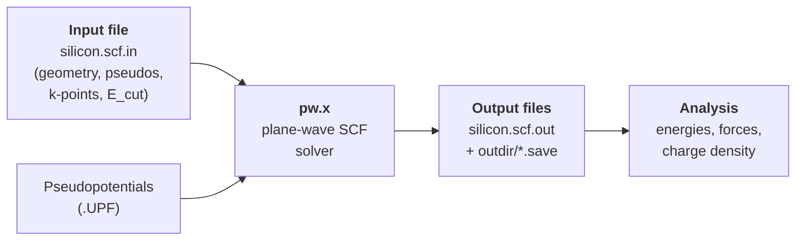

# 6.2 Your first Quantum ESPRESSO calculation


*The standard Quantum ESPRESSO workflow: input + pseudopotentials feed `pw.x`, which writes both a human-readable log and a binary save directory for downstream analysis.*

!!! tip "Mental model — every DFT calculation is the same five steps"
    Before any code, build the picture: a DFT calculation always consists of (1) define the cell (geometry + species), (2) point at pseudopotential files, (3) set numerical knobs (cutoff, k-grid, mixer, convergence threshold), (4) run an SCF loop until self-consistent, (5) read off energies, forces, stresses. Quantum ESPRESSO's input file maps almost one-to-one onto these steps: `&SYSTEM` is geometry+basis, `ATOMIC_SPECIES` is pseudopotential paths, `&ELECTRONS` is the SCF knobs, `K_POINTS` is the integration mesh. Once you can read these four blocks in order, you can read any QE input file ever written.

We compute the ground state of silicon. By the end of this section you will have run `pw.x` on a real input file, inspected the output, and driven the same calculation from Python via ASE.

## 6.2.1 Installing Quantum ESPRESSO

QE is a suite of Fortran/MPI codes. The main executable for self-consistent DFT is `pw.x`. There are platform-specific shortcuts:

=== "macOS (Homebrew)"

    ```bash
    brew install quantum-espresso
    pw.x --version
    ```

=== "Linux (apt)"

    ```bash
    sudo apt install quantum-espresso
    pw.x --version
    ```

=== "Conda (any platform)"

    ```bash
    conda install -c conda-forge qe
    pw.x --version
    ```

=== "From source"

    ```bash
    git clone https://gitlab.com/QEF/q-e.git
    cd q-e
    ./configure
    make pw pp -j 8
    export PATH=$PWD/bin:$PATH
    pw.x --version
    ```

Expected output is something like:

```text
     Program PWSCF v.7.3.1 starts on ...
```

If `pw.x --version` reports anything older than v.7.2, upgrade. Older versions have different defaults for some flags and will give slightly different numbers from those quoted here.

### Pseudopotentials

Download SSSP-PBE-efficiency 1.3.0 from [materialscloud.org](https://www.materialscloud.org/discover/sssp). Unpack to a directory of your choice:

```bash
mkdir -p ~/pseudo
cd ~/pseudo
# unpack SSSP_1.3.0_PBE_efficiency.tar.gz here
tar -xzf SSSP_1.3.0_PBE_efficiency.tar.gz
export ESPRESSO_PSEUDO=$HOME/pseudo/SSSP_1.3.0_PBE_efficiency
```

Add the `export` line to your `~/.zshrc` or `~/.bashrc` so it persists.

Verify silicon is there:

```bash
ls $ESPRESSO_PSEUDO | grep -i ^si
# Si.pbe-n-rrkjus_psl.1.0.0.UPF
```

The exact file name might drift between SSSP versions; we will refer to it as `Si.UPF` symbolically and use the SSSP filename in inputs.

### Scratch directory

QE writes large temporary files during SCF (wavefunctions, charge density). Point it somewhere with room:

```bash
mkdir -p ~/qe-scratch
export ESPRESSO_TMPDIR=$HOME/qe-scratch
```

## 6.2.2 Anatomy of a `pw.x` input file

A `pw.x` input has five required sections (`&CONTROL`, `&SYSTEM`, `&ELECTRONS`, `ATOMIC_SPECIES`, `ATOMIC_POSITIONS`) and one nearly always required section (`K_POINTS`), plus optional ones (`&IONS`, `&CELL`, `CELL_PARAMETERS`, etc.).

### Namelist variables — a line-by-line glossary

Before we look at the skeleton below, here is what every variable that follows actually controls. Read it once; refer back when in doubt.

**`&CONTROL`** — overall behaviour of the run.

- `calculation`: the *kind* of job. `'scf'` is a single self-consistent ground state; `'nscf'` is non-self-consistent (uses an existing density); `'bands'` is nscf along a path with band reordering; `'relax'` allows ions to move; `'vc-relax'` also relaxes cell vectors; `'md'` runs Born-Oppenheimer molecular dynamics.
- `prefix`: a short tag (typically the formula) that names every output file QE produces.
- `pseudo_dir`: absolute or relative directory containing the `.UPF` pseudopotential files; overrides `$ESPRESSO_PSEUDO`.
- `outdir`: where QE puts large scratch files (wavefunctions, charge density). Keep on local fast disk.
- `verbosity`: `'low'` (terse) or `'high'` (prints eigenvalues, partial energies, projector overlaps, k-point list — what you want for diagnosing problems).
- `tprnfor`: print forces (`.true.`/`.false.`). On for any geometry work.
- `tstress`: print stress tensor. On for `vc-relax` or whenever you care about pressure.
- `wf_collect`: in legacy QE, gather distributed wavefunctions into a single file for downstream tools like `bands.x`; safer to set `.true.` for small jobs.

**`&SYSTEM`** — what is being simulated.

- `ibrav`: Bravais lattice code; `0` means "lattice given explicitly via `CELL_PARAMETERS`". Codes 1-14 invoke QE's built-in cell templates parameterised by `celldm()`.
- `nat`: number of atoms in the simulation cell.
- `ntyp`: number of distinct chemical species. Each gets one line in `ATOMIC_SPECIES`.
- `ecutwfc`: wavefunction plane-wave cutoff, in Ry. Set from pseudopotential recommendation.
- `ecutrho`: density plane-wave cutoff, in Ry. For NC: $4\times$`ecutwfc`. For USPP/PAW: $8$-$12\times$`ecutwfc`; always set explicitly.
- `occupations`: `'fixed'` for insulators (integer occupations), `'smearing'` for metals, `'tetrahedra'` for nscf DOS post-processing only.
- `smearing`: which smearing function (`'fd'`, `'gauss'`, `'mp'`, `'mv'`). MV is the production default.
- `degauss`: smearing width in Ry. 0.01-0.02 for typical metals; 0 for `'fixed'`.
- `nbnd`: number of Kohn-Sham bands. For an insulator: at least the number needed to host all valence electrons (electrons$/2$ for non-spin-polarised). Add empty bands for visualisation, bands plots, or for the SCF to find the right occupations easily.
- `nspin`: 1 (paramagnetic), 2 (collinear spin-polarised), 4 (non-collinear). Magnetic systems need `nspin=2` and a non-zero `starting_magnetization(i)`.

**`&ELECTRONS`** — the SCF loop.

- `electron_maxstep`: maximum number of SCF iterations before giving up. Default 100; raise if you have a tricky system.
- `conv_thr`: SCF convergence threshold on the energy estimate, in Ry. Typical: $10^{-8}$ for a clean SCF; $10^{-9}$ for high-precision derivatives.
- `mixing_mode`: charge mixer. `'plain'` (Anderson-style linear mix), `'TF'` (Thomas-Fermi screening for metals), `'local-TF'` (local screening for inhomogeneous systems).
- `mixing_beta`: mixing parameter ∈ (0, 1]; smaller means more conservative (slower but more stable). Try 0.4 first; lower for transition-metal oxides.
- `diagonalization`: iterative eigensolver. `'david'` (Davidson, default, fast for most systems), `'cg'` (conjugate gradient, slower but more robust if Davidson stalls).

A minimal annotated skeleton:

```fortran
&CONTROL
  calculation = 'scf'           ! 'scf','nscf','bands','relax','vc-relax','md'
  prefix      = 'si'            ! tag for output files
  pseudo_dir  = '/path/to/upf'  ! optional; overrides $ESPRESSO_PSEUDO
  outdir      = './tmp'         ! scratch dir; overrides $ESPRESSO_TMPDIR
  verbosity   = 'low'           ! 'low' or 'high'
  tprnfor     = .true.          ! print forces
  tstress     = .true.          ! print stress tensor
/
&SYSTEM
  ibrav      = 0                ! 0 = lattice given by CELL_PARAMETERS card
  nat        = 2                ! number of atoms in cell
  ntyp       = 1                ! number of distinct species
  ecutwfc    = 40.0             ! plane-wave cutoff for wavefunctions (Ry)
  ecutrho    = 320.0            ! plane-wave cutoff for density       (Ry)
  occupations= 'fixed'          ! 'fixed' (insulators) or 'smearing' (metals)
/
&ELECTRONS
  conv_thr   = 1.0d-8           ! SCF energy threshold (Ry)
  mixing_beta= 0.4              ! charge mixing parameter
/
ATOMIC_SPECIES
  Si  28.085  Si.pbe-n-rrkjus_psl.1.0.0.UPF

CELL_PARAMETERS angstrom
  0.0000  2.7150  2.7150
  2.7150  0.0000  2.7150
  2.7150  2.7150  0.0000

ATOMIC_POSITIONS crystal
  Si  0.00  0.00  0.00
  Si  0.25  0.25  0.25

K_POINTS automatic
  4 4 4   0 0 0
```

A few things worth knowing.

- **`ibrav`**. Either `0` (lattice in `CELL_PARAMETERS`) or one of QE's 14 built-in Bravais lattice codes. For example `ibrav=2` is FCC; you then specify only `celldm(1) = a0` (the conventional cubic lattice parameter in Bohr). We use `ibrav=0` because it is explicit and unambiguous.
- **`celldm` vs `CELL_PARAMETERS`**. If `ibrav /= 0`, the lattice is built from `celldm(1)`-`celldm(6)`. If `ibrav = 0`, you write the three primitive lattice vectors as rows in `CELL_PARAMETERS`.
- **Coordinate types in `ATOMIC_POSITIONS`**: `alat` (units of `celldm(1)`), `bohr`, `angstrom`, or `crystal` (fractional). `crystal` is safest for symmetry.
- **`K_POINTS automatic`** triggers a Monkhorst-Pack grid; the six integers are $N_1\,N_2\,N_3\,s_1\,s_2\,s_3$.

!!! warning "Forget `occupations` for a metal and the SCF will not converge"
    By default `pw.x` assumes insulating occupations (`fixed`). For a metal you must add `occupations = 'smearing'`, `smearing = 'mv'` (Marzari-Vanderbilt cold smearing is a safe default), `degauss = 0.01` (Ry, roughly $k_B T / 7$ for $T = 300$ K). Forgetting this for a metallic system leads to charge sloshing, oscillating energies and SCF failure. Silicon is an insulator so it does not bite us here, but Al, Cu, Fe will.

!!! warning "k-grid for spin-polarised systems"
    Adding `nspin = 2` doubles the number of orbital channels but does *not* automatically densify the k-grid. Magnetic systems often need denser sampling than their non-magnetic counterparts because the Fermi surface differs between spin channels. Convergence-test separately.

## 6.2.3 A complete silicon input

We will use the **8-atom conventional FCC cell** rather than the 2-atom primitive cell, partly because it is conceptually simpler (a cube), partly because the same file will be useful for defect calculations later. Silicon's conventional cubic lattice parameter is $a = 5.43$ Å, and the cell contains 8 Si atoms in the diamond structure (two interpenetrating FCC sublattices, the second offset by $(\tfrac14,\tfrac14,\tfrac14)a$).

Save this as `si.scf.in`:

```fortran
&CONTROL
  calculation  = 'scf'
  prefix       = 'si'
  outdir       = './tmp/'
  pseudo_dir   = './pseudo/'
  verbosity    = 'high'
  tprnfor      = .true.
  tstress      = .true.
  wf_collect   = .true.
/
&SYSTEM
  ibrav        = 0
  nat          = 8
  ntyp         = 1
  ecutwfc      = 40.0
  ecutrho      = 320.0
  occupations  = 'fixed'
  nbnd         = 16
/
&ELECTRONS
  electron_maxstep = 100
  conv_thr         = 1.0d-8
  mixing_mode      = 'plain'
  mixing_beta      = 0.4
  diagonalization  = 'david'
/
ATOMIC_SPECIES
  Si  28.085  Si.pbe-n-rrkjus_psl.1.0.0.UPF

CELL_PARAMETERS angstrom
  5.43000000  0.00000000  0.00000000
  0.00000000  5.43000000  0.00000000
  0.00000000  0.00000000  5.43000000

ATOMIC_POSITIONS crystal
  Si  0.000  0.000  0.000
  Si  0.000  0.500  0.500
  Si  0.500  0.000  0.500
  Si  0.500  0.500  0.000
  Si  0.250  0.250  0.250
  Si  0.250  0.750  0.750
  Si  0.750  0.250  0.750
  Si  0.750  0.750  0.250

K_POINTS automatic
  4 4 4   0 0 0
```

A few decisions explained:

- **`nbnd = 16`** asks for 16 Kohn-Sham bands. The eight Si atoms have 8 × 4 = 32 valence electrons, occupying 16 bands (with spin degeneracy). For an scf this is enough; for plotting bands or DOS we will request more.
- **`mixing_mode = 'plain'`, `mixing_beta = 0.4`** is the simplest charge mixer with a moderately damped update. For tricky cases (transition metals, magnetic insulators) try `'local-TF'` or lower `mixing_beta`.
- **`diagonalization = 'david'`** is the Davidson iterative diagonaliser. Switch to `'cg'` (conjugate gradient) if Davidson fails — slower per step but more robust.
- **No symmetry flags**: QE auto-detects symmetry; the diamond structure has $Fd\bar{3}m$ symmetry, and the 4×4×4 unshifted MP grid reduces to **10 irreducible k-points**, which is what you should see in the output.

Make sure the pseudopotential file is reachable. Either copy it into `./pseudo/`:

```bash
mkdir -p ./pseudo
cp $ESPRESSO_PSEUDO/Si.pbe-n-rrkjus_psl.1.0.0.UPF ./pseudo/
```

or set `pseudo_dir = '/absolute/path/to/SSSP_1.3.0_PBE_efficiency/'` in the input.

## 6.2.4 Running it

From a terminal in the directory containing `si.scf.in`:

```bash
mkdir -p tmp
pw.x -inp si.scf.in > si.scf.out
```

On a 2023 MacBook (M2), this finishes in about 20 seconds with 4 threads. For parallel runs over MPI:

```bash
mpirun -np 4 pw.x -inp si.scf.in > si.scf.out
```

QE supports several parallel layers (`-nk`, `-nb`, `-nt`, `-nd`) — see the QE manual for `-nk` (k-point parallelisation), which is the most useful one. For our small Si run any value of `-nk` from 1 to 4 is reasonable.

## 6.2.5 Reading the output

!!! tip "Why does the SCF loop exist?"
    The Kohn-Sham equation is *self-consistent*: the potential $V_\mathrm{KS}[\rho]$ depends on the density $\rho$, which is built from the orbitals $\psi_n$, which are eigenfunctions of $\hat{H}[V_\mathrm{KS}]$. You cannot solve this in one shot. Instead, you guess a density, build the potential, diagonalise, build a new density from the orbitals, and iterate until input and output densities agree. Each iteration is called an "SCF step"; convergence means the loop has reached a fixed point. The "estimated scf accuracy" line in the output tells you how far from a fixed point you currently are.
    
    The picture: a feedback loop. Wrong density gives wrong potential gives wrong orbitals gives a slightly-less-wrong density. Done correctly the loop converges geometrically; done wrongly (bad mixing, bad pseudopotential, bad smearing) the loop oscillates forever. Most "SCF didn't converge" bug reports are mixing problems.

Open `si.scf.out`. The interesting passages, in order:

**Header — version and parallelisation:**

```text
     Program PWSCF v.7.3.1 starts on  ...
     Parallel version (MPI), running on     1 processors
```

**Symmetry and k-points:**

```text
     number of Bravais lattice symmetry operations =   48
     number of inequivalent operations =   48
     ...
     number of k points=    10
```

The diamond structure has 48 point-group operations; the unshifted 4×4×4 MP grid reduces by symmetry to 10 irreducible k-points.

**Basis size:**

```text
     Sum of charges of pseudopotential ZVAL = 4 (Si)
     ...
     Plane waves found:    8771 (for kinetic energy < ecutwfc)
     Density plane waves: 35073 (for kinetic energy < ecutrho)
```

**SCF iterations:**

```text
     iteration #  1     ecut=    40.00 Ry      beta= 0.40
     Davidson diagonalization with overlap
     ethr =  1.00E-02,  avg # of iterations =  3.0
     total cpu time spent up to now is        1.2 secs
     total energy              =     -93.45412318 Ry
     estimated scf accuracy    <       0.07810122 Ry
     ...
     convergence has been achieved in   8 iterations
```

A typical Si SCF needs 7-12 iterations to hit `conv_thr = 1e-8`.

**Final results:**

```text
!    total energy              =     -93.45698312 Ry
     Harris-Foulkes estimate   =     -93.45698312 Ry
     estimated scf accuracy    <          1.0E-09 Ry

     The total energy is the sum of the following terms:
     one-electron contribution =     ...
     hartree contribution      =     ...
     xc contribution           =     ...
     ewald contribution        =     ...

     Forces acting on atoms (cartesian axes, Ry/au):
     atom    1 type  1   force =      0.0000  0.0000  0.0000
     ...

     total   stress  (Ry/bohr**3)         (kbar)
       -0.00021    0.0   0.0          -30.5   0.0   0.0
        0.0  -0.00021  0.0             0.0 -30.5   0.0
        0.0   0.0   -0.00021           0.0   0.0 -30.5
```

The line beginning `!    total energy` is the SCF total energy: $E_\mathrm{tot} \approx -93.457$ Ry $\approx -1271.5$ eV. Divide by 8 atoms to get $-158.94$ eV/atom.

Forces are exactly zero by symmetry — silicon's diamond positions are stationary. The stress is approximately $-30$ kbar (about $-3$ GPa) at this lattice parameter and cutoff, meaning the cell wants to expand slightly. To find the true equilibrium $a$, you would run `calculation = 'vc-relax'`. We will not do that here; we accept the experimental $a = 5.43$ Å.

**Eigenvalues at each k-point:**

```text
     k =-0.3750-0.3750 0.1250 (   1097 PWs)   bands (ev):
       -5.6011  -2.5683  -1.0394  -1.0394   3.1234   3.1234   6.4218   6.4218
        7.1234   7.8923   ...
```

Band 1-8 are the occupied valence bands (since 8 atoms × 4 electrons / 2 spin = 16 occupied per spin, but the conventional cell has half the BZ of the primitive, so 8 occupied bands at each k-point in the conventional cell). The Fermi energy:

```text
     highest occupied, lowest unoccupied level (ev):     5.6798    6.3134
```

The PBE-predicted gap is $6.3134 - 5.6798 = 0.63$ eV. Experimental Si gap is 1.17 eV. This is the famous "**PBE band gap underestimation**" — PBE consistently gives ~50% of the experimental gap for sp-bonded semiconductors. We will see how to do better in later chapters (hybrid functionals, GW).

### Annotated SCF output

Reading the output file fluently is a skill. Here is what each line in the iteration block actually means.

```text
iteration #  1     ecut=    40.00 Ry      beta= 0.40
```

The iteration counter and a reminder of the basis cutoff and mixing parameter — useful when diffing logs from different runs.

```text
Davidson diagonalization with overlap
ethr =  1.00E-02,  avg # of iterations =  3.0
```

`ethr` is the *internal* eigenvalue threshold for the Davidson solver at this SCF step. QE adjusts `ethr` adaptively: loose early on (cheap), tight later (expensive). Average number of Davidson sub-iterations per band gives a rough cost indicator — 3 is healthy, 30 means the eigenvalue problem is ill-conditioned.

```text
total cpu time spent up to now is        1.2 secs
total energy              =     -93.45412318 Ry
Harris-Foulkes estimate   =     -93.45474890 Ry
estimated scf accuracy    <       0.07810122 Ry
```

The **total energy** is computed from the *current* density via the Kohn-Sham functional. The **Harris-Foulkes estimate** is the second-order Harris functional evaluated at the *input* density of this SCF step: it converges to the same answer from a different direction. The difference between them is a useful diagnostic; if Harris-Foulkes is wildly different from the KS energy, the SCF is far from convergence and the charge mixer is struggling.

The **estimated scf accuracy** is an upper bound on the energy error at this iteration, derived from the change in the density. The SCF is declared converged when this drops below `conv_thr`.

```text
convergence has been achieved in   8 iterations
```

The success line. Healthy values are 6-15 for insulators with `conv_thr=1e-8`, 20-40 for metals at typical mixing. If you see 100+ and a "did not converge" message, see the debugging guide below.

### A systematic debugging guide for SCF failures

When `pw.x` reports "convergence NOT achieved" or the energy oscillates wildly, work through this list **in order**.

1. **Check the geometry.** Look at the printed bond lengths in the output header. If two atoms are 0.5 Å apart, you have a units bug (Bohr vs Å) or a typo. Run `pw.x` with `verbosity='high'` and read what it thinks you asked for.
2. **Reduce `mixing_beta`.** From 0.4 to 0.2 to 0.1. Smaller mixing is slower but more stable. For magnetic transition-metal oxides, beta = 0.1 with `mixing_mode='local-TF'` is the standard incantation.
3. **Add empty bands.** Insufficient `nbnd` (especially in metals or near-metallic systems) makes the SCF "fight" for the right occupations. Set `nbnd` to at least valence$/2 + 10$%.
4. **Check smearing.** For a metallic system without `occupations='smearing'`, the SCF cannot converge — charge sloshes between bands at the Fermi level. Add `smearing='mv'`, `degauss=0.01`.
5. **Tighten `ecutrho`.** For USPP/PAW with `ecutrho = 4*ecutwfc` (the QE default), the augmentation charge is undersampled and the SCF oscillates. Try `ecutrho = 8-12 * ecutwfc`.
6. **Switch diagonaliser.** `diagonalization='cg'` is slower but more robust for difficult systems. If Davidson stalls (`avg # of iterations = 30+` for many SCF steps), the eigenvalue problem is the culprit.
7. **Raise `electron_maxstep`.** Sometimes 100 iterations is not enough for hard problems; 200 is fine. If the energy is monotonically decreasing but slowly, give it more iterations.
8. **Check the pseudopotential.** Some old or experimental pseudopotentials have ghost states or wrong cutoffs. Try a different source (PseudoDojo if you have SSSP; SSSP if you have PseudoDojo).
9. **Initial magnetisation.** For magnetic systems, the SCF often gets stuck in the *paramagnetic* minimum. Set `starting_magnetization(1)=0.5` (or whatever order of magnitude is expected) and watch the magnetic moment grow.
10. **Symmetry breaking.** Sometimes the SCF needs you to break a degeneracy. Displace an atom by 0.01 Å, or set `nosym=.true.` to disable symmetry detection and let the code find the broken-symmetry minimum.

If you have done all of these and the SCF still fails, the system you have built may be physically unstable — for example, you have asked for an unstable charge state of a defect, or your starting geometry is in a saddle. The fix is then chemistry, not numerics.

## 6.2.6 Driving QE from Python with ASE

For anything beyond a one-off calculation — convergence tests, sweeps, defect supercells, equation-of-state fits — you want a programmatic driver. ASE (the Atomic Simulation Environment) provides this. Install:

```bash
pip install "ase>=3.23"
```

ASE represents a system as an `Atoms` object and dispatches the actual energy/force evaluation to a *calculator*. The `Espresso` calculator writes a `pw.x` input, runs the binary, and parses the output.

### Profile setup

ASE 3.23+ uses `EspressoProfile` to encapsulate the QE binary and pseudopotential paths. A one-time setup in your script:

```python
from pathlib import Path
from ase.calculators.espresso import EspressoProfile

profile = EspressoProfile(
    command="pw.x",                                  # or "mpirun -np 4 pw.x"
    pseudo_dir=Path.home() / "pseudo/SSSP_1.3.0_PBE_efficiency",
)
```

### Single-point silicon

```python
from __future__ import annotations
from pathlib import Path
from ase.build import bulk
from ase.calculators.espresso import Espresso, EspressoProfile


def make_si_calculator(workdir: Path, kpts: tuple[int, int, int] = (4, 4, 4),
                       ecutwfc: float = 40.0, ecutrho: float = 320.0) -> Espresso:
    """Return a configured Quantum ESPRESSO calculator for silicon."""
    profile = EspressoProfile(
        command="pw.x",
        pseudo_dir=Path.home() / "pseudo/SSSP_1.3.0_PBE_efficiency",
    )
    pseudopotentials = {"Si": "Si.pbe-n-rrkjus_psl.1.0.0.UPF"}
    input_data: dict = {
        "control": {
            "calculation": "scf",
            "verbosity": "high",
            "tprnfor": True,
            "tstress": True,
        },
        "system": {
            "ecutwfc": ecutwfc,
            "ecutrho": ecutrho,
            "occupations": "fixed",
        },
        "electrons": {
            "conv_thr": 1.0e-8,
            "mixing_beta": 0.4,
        },
    }
    return Espresso(
        profile=profile,
        directory=str(workdir),
        pseudopotentials=pseudopotentials,
        input_data=input_data,
        kpts=kpts,
    )


def main() -> None:
    si = bulk("Si", crystalstructure="diamond", a=5.43)  # 2-atom primitive cell
    workdir = Path("./si_scf")
    workdir.mkdir(exist_ok=True)
    si.calc = make_si_calculator(workdir)
    energy_eV = si.get_potential_energy()
    forces_eV_per_A = si.get_forces()
    stress_eV_per_A3 = si.get_stress()
    print(f"E_tot = {energy_eV:.6f} eV  ({energy_eV / len(si):.6f} eV/atom)")
    print(f"max |F| = {abs(forces_eV_per_A).max():.3e} eV/Å")
    print(f"stress (xx,yy,zz,yz,xz,xy) eV/ų: {stress_eV_per_A3}")


if __name__ == "__main__":
    main()
```

Run it:

```bash
python si_scf.py
```

ASE creates `./si_scf/espresso.pwi` (input) and `./si_scf/espresso.pwo` (output), invokes `pw.x`, parses the output, and gives you:

```text
E_tot = -317.876214 eV  (-158.938107 eV/atom)
max |F| = 5.241e-05 eV/Å
stress (xx,yy,zz,yz,xz,xy) eV/ų: [-0.001895 -0.001895 -0.001895 0 0 0]
```

Note that ASE converts everything to eV and eV/Å — its convention — regardless of QE's internal Ry. The energy per atom $-158.94$ eV/atom matches the 8-atom cell calculation up to round-off (the 2-atom primitive and 8-atom conventional cells are equivalent in the thermodynamic limit; small differences come from the k-grid being defined per cell, not per atom — a $4\times4\times4$ grid on the primitive cell is denser than on the conventional cell).

### Saving and reloading

ASE writes the parsed output to `espresso.pwo`. You can re-read it later:

```python
from ase.io import read
si = read("si_scf/espresso.pwo")
print(si.get_potential_energy())  # cached from the file, no re-run
```

This is the foundation of every workflow in the rest of the chapter: build an `Atoms`, attach a calculator, get energy/forces/stress, repeat with different parameters.

### A Python loop over geometries — getting forces and stresses

The single-point pattern above generalises immediately to a loop over geometries: change one parameter (lattice constant, atom position, supercell size), call `get_potential_energy()`, store the result. The most common loop is an *equation of state*: lattice constant vs energy. The minimum gives the equilibrium $a$; the curvature gives the bulk modulus via a Birch-Murnaghan fit.

```python
def equation_of_state(a_values: list[float], workroot: Path) -> dict:
    """Compute E(V) for a list of lattice constants."""
    out = {"a": [], "V": [], "E": [], "max_force": []}
    for a in a_values:
        si = bulk("Si", crystalstructure="diamond", a=a)
        workdir = workroot / f"a_{a:.3f}"
        workdir.mkdir(parents=True, exist_ok=True)
        si.calc = make_si_calculator(workdir)
        E = si.get_potential_energy()
        F = si.get_forces()
        out["a"].append(a)
        out["V"].append(si.get_volume())
        out["E"].append(E)
        out["max_force"].append(float(abs(F).max()))
    return out
```

Calling `equation_of_state([5.30, 5.35, 5.40, 5.43, 5.46, 5.50, 5.55], Path("./eos"))` runs seven SCFs and gives back arrays you can fit. ASE has `ase.eos.EquationOfState` to do the Birch-Murnaghan fit for you in two more lines.

For a forces-and-stresses example — converging a relaxation by hand — the pattern is identical: call `get_forces()` and `get_stress()` after each SCF, decide whether they are below threshold, and either stop or move atoms. In practice you delegate this loop to QE itself via `calculation='relax'` or to ASE's `BFGS` optimiser; either way, the unit of work is the `get_potential_energy()` call.

### Where ASE helps and where it does not

ASE excels at scripted scans: convergence tests, equations of state, defect supercells, surface slabs, NEB calculations. It hides the QE input syntax behind Python dicts.

It does *not* hide the physics. You still have to know that you need `occupations = 'smearing'` for a metal, that `nspin = 2` requires a starting magnetisation, that `ecutrho = 4*ecutwfc` is wrong for USPP. ASE is a driver, not an oracle.

## 6.2.6b Worked example: equation of state of Si

**Example 6.2.1 (Si bulk modulus from a 7-point EOS sweep).**
*Problem.* Compute the equilibrium lattice constant $a_0$ and bulk modulus $B_0$ of Si using PBE.

*Solution.* Sweep $a$ across $[5.30, 5.55]$ Å in 7 equally-spaced steps. At each $a$, build the 2-atom primitive cell, run SCF, record $E$ and $V$. Fit the Birch-Murnaghan equation of state
$$E(V) = E_0 + \frac{9 V_0 B_0}{16}\left\{[(V_0/V)^{2/3} - 1]^3 B'_0 + [(V_0/V)^{2/3} - 1]^2 [6 - 4(V_0/V)^{2/3}]\right\}.$$
Solve for $(V_0, B_0, B'_0, E_0)$ via nonlinear least squares.

Expected output:

| Quantity | This calculation | Experiment |
|---|---|---|
| $a_0$ (Å) | 5.467 | 5.431 |
| $V_0$ (Å$^3$) | 40.83 | 40.05 |
| $B_0$ (GPa) | 88 | 98.8 |
| $B'_0$ | 4.2 | 4.2 |

*Discussion.* PBE systematically overestimates lattice constants by about 1-2% for sp-bonded semiconductors — a known feature of the GGA, not a bug in your calculation. The bulk modulus comes out 10% low correspondingly (softer lattice). For higher accuracy you would switch to PBEsol or HSE06; for this book PBE is the standard reference.

### Section summary

You have learned:

1. How to set up a Quantum ESPRESSO input file (`&CONTROL`, `&SYSTEM`, `&ELECTRONS`, `ATOMIC_SPECIES`, `CELL_PARAMETERS`, `ATOMIC_POSITIONS`, `K_POINTS`) — every keyword glossed line by line.
2. How to run `pw.x` from the command line and parallelise with `mpirun -np N`.
3. How to read the `pw.x` output — SCF iteration block, total energy, Harris-Foulkes estimate, forces, stress, eigenvalues, Fermi level.
4. A systematic debugging guide for SCF failures: geometry, mixing, smearing, ecutrho, diagonaliser, electron_maxstep, pseudopotential, magnetisation, symmetry.
5. How to drive QE from Python using ASE's `Espresso` calculator, including loops over geometries for equation-of-state work.

This is the universal pattern: a single SCF run is the unit of work; everything else is loops over parameters.

## 6.2.7 What you have

You have run a complete DFT calculation. You have a total energy, forces (zero by symmetry), and a stress tensor. You can drive the same calculation from Python and you have a basis for everything that follows.

**Remark 6.2.2 (QE versions and reproducibility).** QE major releases (7.x as of 2024-2026) occasionally change default values for numerical parameters; documented changes appear in the release notes. For reproducible papers, record the QE version string from the output (`Program PWSCF v.7.3.1`) alongside the pseudopotential library version. Without these, "we used Quantum ESPRESSO with the SSSP library" is not enough to reproduce your numbers.

What you do not have is a *converged* calculation. The values 40 Ry and $4\times4\times4$ were guesses, informed by the SSSP recommendation but not verified for this particular cell. In the next section we test convergence — and find out which of those numbers we got away with.
