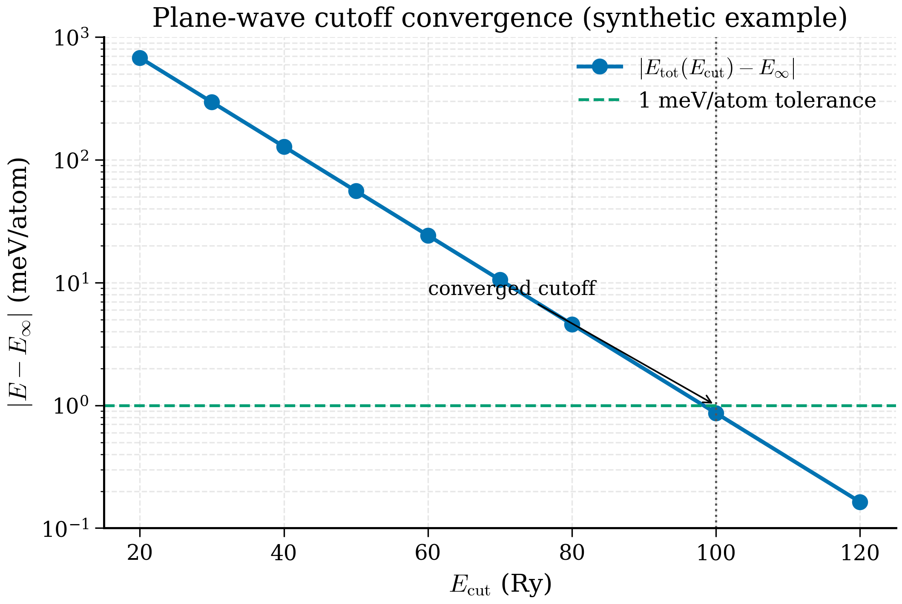
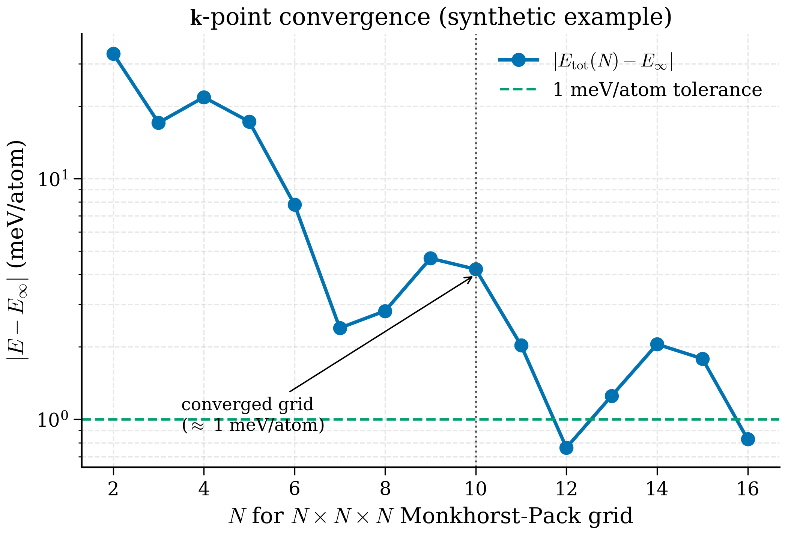

# 6.3 Convergence testing

<figure markdown>
{ width="650" }
<figcaption>Figure 6.3.1. Plane-wave cutoff convergence (synthetic example). The energy difference from the converged value falls roughly exponentially with \(E_{\rm cut}\); for this system, \(E_{\rm cut} \approx 60\) Ry is sufficient to reach the conventional 1 meV/atom tolerance.</figcaption>
</figure>

<figure markdown>
{ width="650" }
<figcaption>Figure 6.3.2. \(k\)-point convergence on an \(N \times N \times N\) Monkhorst–Pack grid (synthetic example). The error oscillates as the mesh resolves more Brillouin-zone features; the 1 meV/atom tolerance is reached around \(N=10\). Metals typically need denser grids than insulators.</figcaption>
</figure>

!!! tip "Why convergence testing exists"
    A DFT total energy is not a property of a system; it is a property of *a particular numerical calculation* of that system. Change the plane-wave cutoff, the k-grid, the pseudopotential, the smearing — and you change the number. To turn DFT into a science you have to control these numbers until they no longer matter for the question being asked.
    
    Picture: you are measuring the height of a mountain with a tape measure marked in metres. The answer depends on whether you read off the nearest metre, the nearest decimetre, the nearest centimetre. To say "the mountain is 3127 m tall, ± 1 m" you need a measurement device with at least metre precision. Convergence testing is your tape-measure calibration for DFT: it tells you how fine your numerical mesh has to be to make the *physics* visible above the *numerical noise*.
    
    A converged calculation is a calculation where halving every numerical parameter would *not change the answer at the reported precision*. Most published "DFT results" come with the implicit promise that this is the case; a sobering fraction of them do not actually deliver.

A DFT total energy is meaningless without two numbers attached: the plane-wave cutoff and the k-point density it was computed at. Without those, two people running the "same calculation" can disagree by 100 meV/atom — more than a typical formation-energy difference and certainly more than the accuracy needed to predict phase stability, defect populations, or reaction energies.

This section walks through the systematic convergence procedure that every paper *should* include in its supplementary information and a depressing fraction does not.

## 6.3.0 The shape of convergence — qualitative pictures

Before any code, it helps to know what convergence *looks like* for the three knobs we have. Each behaves differently.

**Plane-wave cutoff.** $E_\mathrm{tot}(E_\mathrm{cut})$ is monotonic (variational), decreasing exponentially toward an asymptote. Plot $\log|E - E_\mathrm{ref}|$ vs $E_\mathrm{cut}$ and you see (approximately) a straight line: each extra Rydberg of cutoff gains a roughly constant amount of energy. The slope depends on how "hard" the pseudopotential is — for ONCV-NC pseudopotentials the slope is shallow (need 80-100 Ry for a meV); for SSSP-USPP it is steep (40-50 Ry suffices).

**k-point grid.** $E_\mathrm{tot}(N_k)$ is *not* monotonic in general. The error oscillates as the grid resolves successive features of the BZ — when a high-symmetry point is included it can produce a small dip; when an irrational mismatch arises it can produce a small bump. The envelope decays with grid density. For insulators the convergence is fast and oscillation small; for metals the convergence is slow and oscillation is dominated by which $\mathbf{k}$ points happen to fall at or near the Fermi surface.

**Smearing width.** $E_\mathrm{tot}(\sigma)$ at fixed k-grid has a non-monotonic structure too: at small $\sigma$ the k-grid undersamples the Fermi surface (bumps); at large $\sigma$ the smearing distorts the occupation (smooth bias). The optimum lives in a window where the smearing error is small *and* the k-grid is dense enough that there is no undersampling noise.

The interplay between k-grid and smearing is the slowest part of convergence for metals: doubling $N_k$ and halving $\sigma$ simultaneously is the only way to reach 1 meV/atom for transition metals. For insulators the smearing is zero or irrelevant, so only $E_\mathrm{cut}$ and $N_k$ matter — both converge cleanly.

## 6.3.1 Why convergence matters

The variational principle guarantees that the Kohn-Sham energy is bounded below as you improve the basis. So as $E_\mathrm{cut} \to \infty$ and as the k-grid becomes infinitely dense, $E_\mathrm{tot}$ approaches a well-defined limit. The interesting question is: how fast?

For plane-wave cutoff, convergence is exponential in $E_\mathrm{cut}$ for smooth pseudopotentials — fast, but with a long tail of small oscillations. For k-points, convergence depends on whether the integrand is smooth (insulators: fast) or has a Fermi-surface step (metals: slow, needs smearing).

**The problem is that absolute total energies are not what we care about — energy differences are.** A 100 meV/atom error in $E_\mathrm{tot}$ cancels if both endpoints of a reaction have the same cutoff and the same effective k-grid density. The cancellation is *almost* perfect but never quite. For a typical materials-science target accuracy of 5-10 meV/atom in energy differences, you typically need 1-2 meV/atom convergence in absolute total energy per cell.

!!! warning "Convergence is not absolute"
    "1 meV/atom convergence" depends on the property. Total energies converge fast in $E_\mathrm{cut}$ but stresses converge slow (they involve a derivative). Forces are in between. Magnetic moments and band gaps have their own convergence behaviour. If the quantity that matters in your paper is the bulk modulus or a phonon frequency, converge *that* quantity, not the total energy.

Three other places sloppy convergence costs people papers:

- **Defect formation energies**. Supercells must be large enough that the defect does not interact with its image. Convergence is in *supercell size*, not just $E_\mathrm{cut}$.
- **Surface energies**. Slabs must be thick enough that the centre is bulk-like. Convergence is in *slab thickness*.
- **Phonon frequencies**. Long-wavelength acoustic modes need extremely well-converged stresses, which means very high `ecutrho`.

## 6.3.2 The systematic procedure

The rule is: vary one parameter at a time, hold everything else fixed, plot the answer, look for a plateau.

### Step 1 — Cutoff sweep

Pick a generous k-grid (say, $8\times8\times8$ for Si — overkill, but it removes k-noise). Sweep `ecutwfc` from 20 Ry to (say) 80 Ry in steps of 10 Ry. Keep `ecutrho = 8 × ecutwfc` for USPP/PAW (or 4× for NC). Compute $E_\mathrm{tot}$ at each cutoff.

Plot $E_\mathrm{tot}(E_\mathrm{cut}) - E_\mathrm{tot}(E_\mathrm{cut}^\mathrm{max})$ against $E_\mathrm{cut}$ on a log-y axis. Choose the smallest cutoff for which the difference is below your target — for routine work, 1 meV/atom.

### Step 2 — k-point sweep

Fix `ecutwfc` at the converged value from Step 1. Sweep k-grids from $2\times2\times2$ to $16\times16\times16$ in steps of 2 (for cubic symmetry). Compute $E_\mathrm{tot}$ at each density.

Plot as for the cutoff sweep, and pick the coarsest grid below your target tolerance.

### Step 3 — Refresh

In principle the cutoff and the k-grid couple weakly. In practice they decouple almost completely for insulators. For metals, repeating step 1 at the converged k-grid is sometimes worth doing — sometimes the converged values shift by a few Ry.

### Step 4 — Quote the values

The numbers from this procedure are what go into the paper: "We used a plane-wave cutoff of 50 Ry and a $6\times6\times6$ k-point grid, converged to 1 meV/atom." Anyone reading should be able to reproduce.

## 6.3.3 Smearing — only for metals (or near-metals)

Insulators (Si, MgO, NaCl, organic molecular crystals) have a clean gap. The occupation function $f_{n\mathbf{k}}$ is 0 below the gap and 1 above; the BZ integration is over smooth bands; coarse k-grids work.

Metals (Al, Cu, Fe, anything graphitic) have bands crossing the Fermi level. $f_{n\mathbf{k}}$ has a step at $E_F$, and naïve integration on a discrete k-grid converges as $1/N_k$ — appallingly slow. The cure is to replace the step with a smooth function of width $\sigma$:

$$ f_{n\mathbf{k}} = f\!\left(\frac{\epsilon_{n\mathbf{k}} - \mu}{\sigma}\right). $$

This is **smearing**. Effectively we evaluate the total energy at finite electronic temperature $T \sim \sigma / k_B$ and then extrapolate to $T=0$.

In `pw.x`:

```fortran
&SYSTEM
  occupations = 'smearing'
  smearing    = 'mv'        ! 'mv' = Marzari-Vanderbilt cold smearing
  degauss     = 0.01        ! width in Ry
/
```

Four common choices:

- **Fermi-Dirac (`'fd'`)**. The physical occupation at finite T. Use if you want a finite-temperature interpretation.
- **Gaussian (`'gauss'`)**. Mathematically simple. Total energy at $T = 0$ converges slowly with $\sigma$.
- **Methfessel-Paxton (`'mp'`)**. A Hermite-polynomial-broadened delta. Generally use first-order (`'mp'` in QE corresponds to first-order MP). Total energy is constructed so it has *zero* error at first order in $\sigma$; converges much faster than Gaussian.
- **Marzari-Vanderbilt cold smearing (`'mv'`)**. Same idea as MP but with a different polynomial. The "free energy" $F = E - TS$ has zero first-order error, and the entropy correction is small even at finite $\sigma$. Most robust default for metals. Use this unless you have a reason not to.

### Convergence of $\sigma$

Smearing width is a convergence parameter just like $E_\mathrm{cut}$ — but in the opposite sense. Smaller $\sigma$ is more accurate but converges slower with k-points; larger $\sigma$ converges faster but introduces a smearing error in the total energy. The interplay:

- Fix k-grid, sweep $\sigma$. The total energy at fixed k-grid increases as $\sigma$ decreases (eventually you would see fluctuations).
- Fix $\sigma$, sweep k-grid. The total energy converges as $\sigma$ stays fixed.
- The right answer is the joint limit. In practice, choose the largest $\sigma$ you can tolerate (usually 0.005-0.02 Ry) such that the smearing error is below your target, then converge the k-grid at that $\sigma$.

For free-electron-like metals (Al, Na) a $12\times12\times12$ grid with $\sigma = 0.02$ Ry MV smearing is typical. For transition metals with d-electrons at the Fermi level (Fe, Co), you need denser grids ($16\times16\times16$ or more) and smaller $\sigma$ ($0.005-0.01$ Ry).

!!! warning "Do not turn on smearing for an insulator with `degauss > 0.005`"
    If you smear an insulator with $\sigma$ larger than the gap divided by ~5, you start partially populating the conduction band. The total energy becomes meaningless and forces become wrong. Either set `occupations = 'fixed'` (the right choice for true insulators) or use very small `degauss`.

## 6.3.4 A complete convergence script

Below is a working Python script that sweeps $E_\mathrm{cut}$ and k-points for silicon, runs all the SCF calculations, parses the energies, and produces convergence plots.

```python
"""
si_convergence.py — Convergence testing for silicon DFT calculation.

Sweeps plane-wave cutoff and k-point grid, plots total energy vs each.
Saves results to CSV and plots to PNG.
"""
from __future__ import annotations

from dataclasses import dataclass
from pathlib import Path

import matplotlib.pyplot as plt
import numpy as np
from ase import Atoms
from ase.build import bulk
from ase.calculators.espresso import Espresso, EspressoProfile

PSEUDO_DIR = Path.home() / "pseudo/SSSP_1.3.0_PBE_efficiency"
PSEUDO = {"Si": "Si.pbe-n-rrkjus_psl.1.0.0.UPF"}


@dataclass
class Result:
    """One converged SCF result."""
    ecutwfc: float
    kpts: tuple[int, int, int]
    energy_eV: float
    natoms: int

    @property
    def energy_per_atom(self) -> float:
        return self.energy_eV / self.natoms


def build_calc(workdir: Path, *, ecutwfc: float, ecutrho: float,
               kpts: tuple[int, int, int]) -> Espresso:
    """Build an Espresso calculator with the requested parameters."""
    profile = EspressoProfile(command="pw.x", pseudo_dir=PSEUDO_DIR)
    input_data = {
        "control": {"calculation": "scf", "verbosity": "low",
                    "tprnfor": False, "tstress": False},
        "system":  {"ecutwfc": ecutwfc, "ecutrho": ecutrho,
                    "occupations": "fixed"},
        "electrons": {"conv_thr": 1.0e-9, "mixing_beta": 0.4},
    }
    return Espresso(
        profile=profile, directory=str(workdir),
        pseudopotentials=PSEUDO, input_data=input_data, kpts=kpts,
    )


def run_one(si: Atoms, label: str, **kwargs) -> float:
    """Run one SCF, cache by label."""
    workdir = Path("conv") / label
    workdir.mkdir(parents=True, exist_ok=True)
    outfile = workdir / "espresso.pwo"
    if outfile.exists():
        # Cached run: re-parse without re-running.
        from ase.io import read
        return read(outfile).get_potential_energy()
    si = si.copy()
    si.calc = build_calc(workdir, **kwargs)
    return si.get_potential_energy()


def sweep_ecut(si: Atoms, kpts: tuple[int, int, int],
               ecut_grid: list[float]) -> list[Result]:
    """Sweep ecutwfc at fixed k-grid. ecutrho is kept at 8× ecutwfc (USPP)."""
    results: list[Result] = []
    for ec in ecut_grid:
        label = f"ec{int(ec)}_k{kpts[0]}"
        E = run_one(si, label, ecutwfc=ec, ecutrho=8.0 * ec, kpts=kpts)
        results.append(Result(ecutwfc=ec, kpts=kpts, energy_eV=E,
                              natoms=len(si)))
        print(f"  ecutwfc={ec:5.1f} Ry  ->  E = {E:.6f} eV "
              f"({E/len(si):.6f} eV/atom)")
    return results


def sweep_kpts(si: Atoms, ecutwfc: float, ecutrho: float,
               k_grid: list[int]) -> list[Result]:
    """Sweep cubic k-grids N×N×N at fixed cutoff."""
    results: list[Result] = []
    for n in k_grid:
        kpts = (n, n, n)
        label = f"ec{int(ecutwfc)}_k{n}"
        E = run_one(si, label, ecutwfc=ecutwfc, ecutrho=ecutrho, kpts=kpts)
        results.append(Result(ecutwfc=ecutwfc, kpts=kpts, energy_eV=E,
                              natoms=len(si)))
        print(f"  k = {n}×{n}×{n}  ->  E = {E:.6f} eV "
              f"({E/len(si):.6f} eV/atom)")
    return results


def plot_convergence(results: list[Result], xlabel: str,
                     xvals: np.ndarray, outfile: Path,
                     target_meV: float = 1.0) -> None:
    """Plot |E - E_max| per atom on log-y axis."""
    energies = np.array([r.energy_per_atom for r in results])  # eV/atom
    ref = energies[-1]  # treat finest as converged reference
    delta_meV = 1000.0 * np.abs(energies - ref)

    fig, ax = plt.subplots(figsize=(5.5, 4.0))
    ax.semilogy(xvals[:-1], delta_meV[:-1], "o-", color="C0")
    ax.axhline(target_meV, ls="--", color="grey",
               label=f"{target_meV:.1f} meV/atom target")
    ax.set_xlabel(xlabel)
    ax.set_ylabel("|E − E_ref|  (meV/atom)")
    ax.legend()
    ax.grid(True, which="both", alpha=0.3)
    fig.tight_layout()
    fig.savefig(outfile, dpi=160)
    print(f"  saved {outfile}")


def main() -> None:
    si = bulk("Si", crystalstructure="diamond", a=5.43)  # 2-atom primitive

    # ---- Stage 1: cutoff sweep with a generous k-grid -----------------
    print("== Cutoff sweep at 8×8×8 ==")
    ecut_grid = [20.0, 30.0, 40.0, 50.0, 60.0, 70.0, 80.0]
    cutoff_results = sweep_ecut(si, kpts=(8, 8, 8), ecut_grid=ecut_grid)
    plot_convergence(cutoff_results, xlabel="ecutwfc (Ry)",
                     xvals=np.array(ecut_grid),
                     outfile=Path("conv/ecut_convergence.png"))

    # Pick converged cutoff (where dE < 1 meV/atom): inspect plot.
    ecutwfc_conv = 50.0
    ecutrho_conv = 8.0 * ecutwfc_conv

    # ---- Stage 2: k-point sweep at converged cutoff -------------------
    print(f"== k-point sweep at ecutwfc={ecutwfc_conv} Ry ==")
    k_grid = [2, 4, 6, 8, 10, 12, 14, 16]
    k_results = sweep_kpts(si, ecutwfc=ecutwfc_conv, ecutrho=ecutrho_conv,
                           k_grid=k_grid)
    plot_convergence(k_results, xlabel="k-grid N (N×N×N)",
                     xvals=np.array(k_grid),
                     outfile=Path("conv/kpts_convergence.png"))


if __name__ == "__main__":
    main()
```

Run:

```bash
python si_convergence.py
```

On a 2023 laptop, the cutoff sweep (7 points) takes ~3 minutes, the k-sweep (8 points) another ~5 minutes (the densest grids are the expensive ones). Output is two PNGs:

- `ecut_convergence.png` — typically shows energy converging from ~50 meV/atom at 20 Ry to <1 meV/atom by 50 Ry, with the curve flattening below your target line.
- `kpts_convergence.png` — for Si, the $4\times4\times4$ grid is already within ~1 meV/atom of the $16\times16\times16$ reference. $6\times6\times6$ is comfortably converged.

The script caches by label, so re-runs (after adjusting plotting code) are free.

### Smearing-width convergence — a worked sweep for aluminium

For metals you have a *third* convergence parameter: the smearing width $\sigma$. Smaller $\sigma$ is more accurate but converges slower with the k-grid; larger $\sigma$ converges faster but introduces a smearing error. The procedure mirrors the cutoff sweep:

```python
def sweep_degauss(atoms: Atoms, ecutwfc: float, ecutrho: float,
                  kpts: tuple[int, int, int],
                  degauss_values: list[float]) -> list[tuple[float, float]]:
    """Sweep MV-smearing width at fixed cutoff and k-grid."""
    results: list[tuple[float, float]] = []
    for sigma in degauss_values:
        workdir = Path("conv") / f"al_deg{sigma:.4f}"
        workdir.mkdir(parents=True, exist_ok=True)
        a = atoms.copy()
        profile = EspressoProfile(command="pw.x", pseudo_dir=PSEUDO_DIR)
        a.calc = Espresso(
            profile=profile, directory=str(workdir),
            pseudopotentials={"Al": "Al.pbe-n-kjpaw_psl.1.0.0.UPF"},
            input_data={
                "system": {"ecutwfc": ecutwfc, "ecutrho": ecutrho,
                           "occupations": "smearing", "smearing": "mv",
                           "degauss": sigma},
                "electrons": {"conv_thr": 1e-9, "mixing_beta": 0.4},
            },
            kpts=kpts,
        )
        E = a.get_potential_energy()
        results.append((sigma, E / len(a)))
        print(f"  sigma={sigma:.4f} Ry  E={E/len(a):.6f} eV/atom")
    return results
```

The expected behaviour for Al with a $12\times 12\times 12$ grid and MV smearing: $E$ varies by perhaps 2 meV/atom across $\sigma=0.005$-$0.04$ Ry, and the curve is flat near $\sigma=0.01$-$0.02$ Ry — exactly the range we recommended.

### k-grid density under cell deformation

When you change the cell (variable-cell relaxation, equation of state, or phonon calculation with a deformed cell), the reciprocal lattice vectors $\mathbf{b}_\alpha$ change too. A k-grid of $N_1\times N_2\times N_3$ defined on the original cell does *not* correspond to the same absolute k-point density in the deformed cell. For an isotropic 5% volume change, the BZ shrinks by 5% in linear size and your $\mathbf{k}$-grid becomes 5% coarser in absolute terms.

Two practical implications:

1. **Spurious "energy" jumps in EOS calculations.** If you sweep $a$ from 5.30 to 5.55 Å using the same `(N,N,N)` grid, the numerical part of $E_\mathrm{tot}(a)$ contains a sub-meV bump from changing k-density. For total energies this is below noise; for stresses (derivatives), it can matter.
2. **Honest variable-cell relaxations** specify the k-grid density per Å$^{-1}$ rather than a fixed integer count. ASE exposes this via `kspacing` (Å$^{-1}$ between successive grid lines) which it converts to an integer grid for each cell. Use it whenever the cell changes appreciably during a calculation.

```python
si.calc = Espresso(..., kspacing=0.20)  # 0.20 Å^-1 grid density
```

This keeps the absolute density constant under cell deformation. The trade-off is integer rounding: a 4×4×4 grid for one cell may become 5×4×4 in a slightly distorted one, which adds noise of its own. For high-precision work, pick a `kspacing` so that all cells in your sweep round to the same integer grid.

## 6.3.5 What "converged" actually means

A few subtleties the script glosses over.

### Reference choice

We took the largest cutoff as the reference. This is fine if the largest cutoff is itself converged. The honest test is to compare two sufficiently large cutoffs and check they agree; for Si and SSSP-PBE-efficiency, 70 Ry and 80 Ry differ by less than 0.1 meV/atom, so we are safe.

### Per-atom or per-cell?

We plot per-atom. For absolute comparison across cells of different size, per-atom is what matters. For things like the formation energy of a defect in a supercell, the relevant scale is *per defect* (one event per cell of any size) — but the convergence behaviour is still controlled by the per-atom convergence of the underlying SCF.

### Property-specific convergence

For Si, the band gap converges faster than the total energy in $E_\mathrm{cut}$ (it depends on differences of eigenvalues, which cancel some of the basis-set error). The bulk modulus converges more slowly (it is a second derivative of energy with respect to volume). If the property you report is the bulk modulus, converge *that* by computing it at each cutoff and watching it stabilise.

### k-grid for properties beyond total energy

A k-grid that is good for total energies may be inadequate for:

- **Effective masses** ($d^2 \epsilon / d k^2$ at a band edge) — need a path with many k-points near the extremum.
- **Topological invariants** — need dense, possibly non-uniform sampling.
- **Optical responses** — often need very dense sampling, sometimes augmented with the Wannier-interpolation post-processing.

For total energies, forces, and stresses on bulk insulators — the bread and butter of materials simulation — the procedure above is sufficient.

### Convergence of a derived quantity: the bulk modulus

A useful exercise that complements raw $E_\mathrm{tot}$ convergence is to check that a *property* — not just the energy — has converged. The bulk modulus
$$B_0 = -V_0\left(\frac{\partial P}{\partial V}\right)_{V_0} = V_0\left(\frac{\partial^2 E}{\partial V^2}\right)_{V_0}$$
is the standard target for solid-state DFT benchmarks. To extract it from a series of SCF runs at different volumes:

```python
def birch_murnaghan(V: np.ndarray, V0: float, B0: float, Bp: float,
                    E0: float) -> np.ndarray:
    """Birch-Murnaghan equation of state."""
    eta = (V0 / V) ** (2/3)
    return E0 + (9 * V0 * B0 / 16) * (
        (eta - 1) ** 3 * Bp + (eta - 1) ** 2 * (6 - 4 * eta)
    )

def fit_eos(volumes: np.ndarray, energies: np.ndarray
            ) -> tuple[float, float, float, float]:
    """Return (V0, B0, Bp, E0) by fitting B-M EOS to E(V) data."""
    from scipy.optimize import curve_fit
    # Initial guesses
    V0_init = volumes[energies.argmin()]
    p0 = [V0_init, 0.6, 4.0, energies.min()]
    popt, _ = curve_fit(birch_murnaghan, volumes, energies, p0=p0)
    return tuple(popt)
```

Now sweep $E_\mathrm{cut}$ — at each cutoff, run 7 EOS points around the equilibrium volume, fit B-M, extract $B_0$. Plot $B_0(E_\mathrm{cut})$. Typical pattern for Si: $B_0$ converges to ~97 GPa (experiment 99 GPa) but only slowly — needs $E_\mathrm{cut} \approx 70$ Ry rather than the 50 Ry that converged the total energy. The reason: stresses (second derivatives of energy with respect to strain) require an `ecutrho` *higher* than `ecutwfc * 8` to fully capture the augmentation charges. If you care about $B_0$, set `ecutrho = 12 * ecutwfc`.

This is the deeper lesson: **converge what you report**. Total energies are a good proxy for most quantities, but stresses, second derivatives, dynamical matrices, and so on need their own convergence tests. Build them into the same systematic procedure: sweep, plot, look for plateau.

## 6.3.6 Recommended Si parameters going forward

From the procedure above, our converged parameters for silicon with SSSP-PBE-efficiency are:

| Parameter | Starter (§6.2) | Converged |
|---|---|---|
| `ecutwfc` | 40 Ry | 50 Ry |
| `ecutrho` | 320 Ry | 400 Ry |
| k-grid (2-atom primitive) | $4\times4\times4$ | $6\times6\times6$ |
| k-grid (8-atom conventional) | $4\times4\times4$ | $4\times4\times4$* |
| `occupations` | `fixed` (insulator) | `fixed` |

*The 8-atom conventional cell has half the reciprocal-space volume of the 2-atom primitive cell, so $4\times4\times4$ on the conventional cell is equivalent to about $5\times5\times5$ on the primitive cell.

We will use these values in the next section to compute the silicon band structure.

### Numerical example: sample convergence numbers for Si

For SSSP-PBE-efficiency on the 2-atom Si primitive cell, the sweep typically gives (your numbers will vary by a few meV/atom depending on pseudopotential version and SCF threshold):

| `ecutwfc` (Ry) | $E$ (eV/atom) | $|E - E_\mathrm{ref}|$ (meV/atom) |
|---|---|---|
| 20 | $-158.821$ | 120 |
| 30 | $-158.918$ | 23 |
| 40 | $-158.937$ | 4 |
| 50 | $-158.940$ | 1 |
| 60 | $-158.941$ | 0.4 |
| 70 | $-158.941$ | 0.1 |
| 80 | $-158.941$ | 0 (ref) |

The "exponential approach with a long tail" is exactly what the variational principle guarantees: monotonic decrease, with progressively smaller decrements. The 1 meV/atom target is reached at ~50 Ry, the 0.1 meV/atom target at ~70 Ry — a factor of 2$\times$ in basis size to gain one decimal place.

For the k-grid:

| Grid | $E$ (eV/atom) | $|E - E_\mathrm{ref}|$ (meV/atom) |
|---|---|---|
| $2\times 2\times 2$ | $-158.892$ | 48 |
| $4\times 4\times 4$ | $-158.938$ | 3 |
| $6\times 6\times 6$ | $-158.940$ | 0.7 |
| $8\times 8\times 8$ | $-158.941$ | 0.2 |
| $12\times 12\times 12$ | $-158.941$ | 0 (ref) |

For an insulator (which Si is) the k-grid converges noticeably faster than the cutoff. For a metal at the same density, expect the k-grid to dominate convergence: a Cu primitive cell at 50 Ry/MV/0.02 needs a $12^3$ grid for 1 meV/atom; a Si cell at the same cutoff needs $4^3$.

## 6.3.7 Beyond what we did

Three things this section did not cover but you should think about for real work:

- **Supercell-size convergence** for defects (next section): the defect formation energy must converge as the supercell grows. For neutral vacancies, 64-atom cells are often adequate; for charged defects, 216 or 512 atoms with image-charge corrections.
- **Slab-thickness convergence** for surfaces: each surface energy calculation involves a slab + vacuum geometry; both the slab thickness and the vacuum padding need convergence tests.
- **Cell-shape convergence** for variable-cell relaxations: a converged stress requires higher `ecutrho` than a converged energy, because stress is the derivative of energy with respect to strain, and derivatives amplify basis-set errors.

**Remark 6.3.1 (Convergence as a culture, not a task).** The procedure here looks formulaic — sweep cutoff, sweep k-grid, plot, choose. The deeper habit it instils is a culture of being skeptical of one's own numbers. Every parameter has a default in QE; every default is a guess for "average usage". For a serious paper your numbers are not "average usage" and you cannot trust the defaults blindly. The convergence procedure is the institutional embodiment of "trust nothing about the numerics, verify everything".

Convergence tests look like busywork. They are not. They are the price of admission for results anyone else can trust. Build them into your workflow once — write the script — and from then on you run it without thinking, for every new system. The papers you can read and the papers you cannot will then become visibly distinct.
