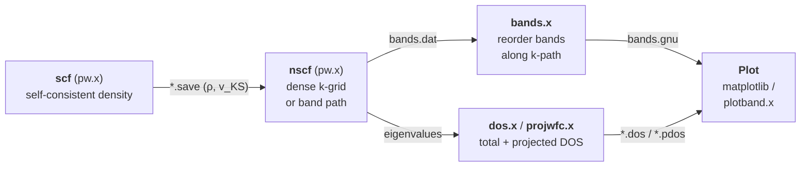
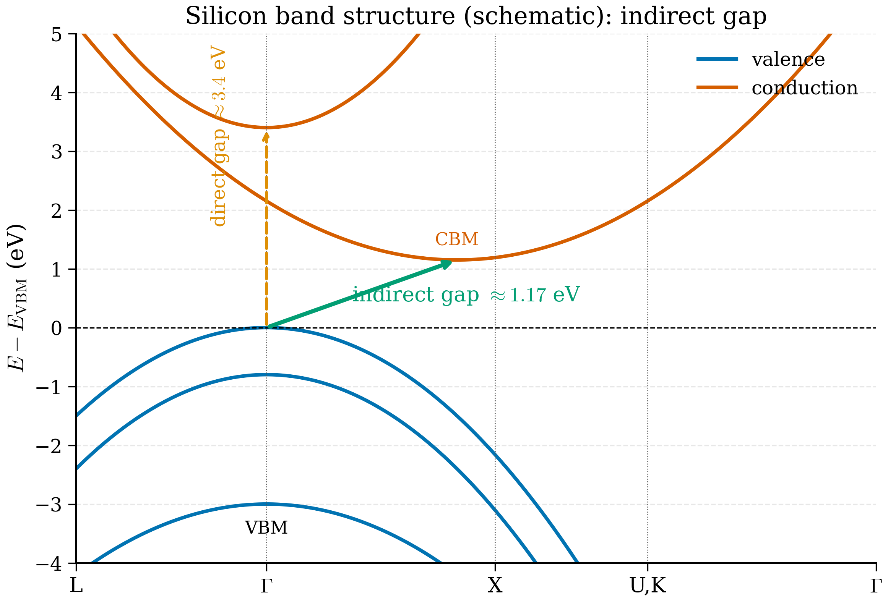

# 6.4 Band structures and density of states


*The bands-and-DOS pipeline in Quantum ESPRESSO. Each arrow carries a concrete file artifact; `scf` converges the density, `nscf` evaluates eigenvalues on the desired grid/path, then `bands.x` or `dos.x` post-process for plotting.*

<figure markdown>
{ width="700" }
<figcaption>Figure 6.4.1. Schematic band structure of silicon. The valence-band maximum sits at \(\Gamma\) while the conduction-band minimum lies near X, giving an indirect fundamental gap (\(\approx 1.17\) eV) — silicon's defining electronic feature. The smallest direct transition at \(\Gamma\) is much larger (\(\approx 3.4\) eV). (Schematic: real DFT bands have more structure and tend to underestimate gaps.)</figcaption>
</figure>

!!! tip "Why band structures matter"
    The electronic band structure $\epsilon_n(\mathbf{k})$ is the single most important output of DFT for understanding a material. It tells you whether the material is a metal (bands cross the Fermi level), an insulator (a gap separates filled from empty bands), or a semiconductor (a small gap). It tells you the *kind* of gap — direct (CBM and VBM at the same $\mathbf{k}$, like GaAs) or indirect (different $\mathbf{k}$, like Si). It tells you effective masses (curvature near band extrema), optical absorption edges (Joint DOS), and topological character (Berry phases). Almost every materials-science paper on a new compound contains a version of this plot.
    
    The picture: a band structure is a 1D slice through the 3D function $\epsilon_n(\mathbf{k})$, taken along a path that connects high-symmetry points of the Brillouin zone. By convention the path zigzags through the most important corners: for FCC silicon, $L\to\Gamma\to X\to K\to\Gamma$. Each band $n$ becomes a 1D curve on this path; an insulator shows a clean horizontal stripe of "no band" — the gap.
    
    The density of states $g(\epsilon)$ complements the band structure: it counts states per unit energy per unit cell, integrated over the whole BZ. It is what you would *integrate* the band structure into; it is also what photoemission experiments directly probe (modulo matrix elements). A pair of plots — band structure on the left, DOS rotated 90° on the right — is the standard summary of a material's electronic structure.

The self-consistent calculation of §6.2 gives you the ground-state density and the total energy. It does *not* directly give you the band structure $\epsilon_n(\mathbf{k})$ along a high-symmetry path, nor the density of states (DOS) over the energy window of interest. Those are post-SCF quantities — once the density is converged on a uniform Monkhorst-Pack grid, you re-diagonalise the (now fixed) Hamiltonian at whatever k-points you want.

This section walks through the standard pipeline for silicon: scf → nscf → bands.x / dos.x → matplotlib.

## 6.4.1 The pipeline

Three runs, in order:

1. **`scf`** — converge the density on a uniform k-grid. This is the run we did in §6.2.
2. **`nscf` (non-self-consistent)** — using the converged density from step 1, evaluate the Kohn-Sham eigenvalues at a new set of k-points (a denser uniform grid for DOS, or a path for bands). The density is *not* updated.
3. **Post-processing** — `bands.x` reorders bands along the path so plotting is straightforward; `dos.x` integrates eigenvalues into a DOS file. Then we plot in Python.

The reason for the nscf step is purely computational: we want $\epsilon_{n\mathbf{k}}$ at hundreds of points along a path, which would be ruinous as part of an SCF loop. By fixing the density first and then doing a single diagonalisation per k-point, we get cheap eigenvalues consistent with the converged ground state.

!!! note "Why a *different* k-grid for nscf?"
    The SCF k-grid is chosen so the BZ integration of the density is converged — say $6\times 6\times 6$ for Si. The nscf grid is chosen for what comes after: for DOS, you want a *dense* uniform grid (say $24\times 24\times 24$) so the histogram or tetrahedron integration is smooth; for band structure, you want a *path* through high-symmetry points with many sub-points so the bands look continuous. These two goals are incompatible with the SCF requirement (the density must be self-consistent, which is too expensive on $24^3$ grids and meaningless on an open path). Decoupling them lets each step use what it needs:
    
    - **SCF**: medium grid, full SCF, converges $\rho(\mathbf{r})$ and $V_\mathrm{KS}(\mathbf{r})$.
    - **nscf**: dense grid or path, *fixed* $V_\mathrm{KS}$ from SCF, one diagonalisation per k-point.
    
    The nscf step is variationally consistent: the eigenvalues it produces are those of the fully converged ground state Hamiltonian, sampled at new k-points. There is no extra error from skipping self-consistency — only the small error from the fact that for $\mathbf{k}$ not on the SCF grid, the density was never explicitly summed at this $\mathbf{k}$. For insulators with smooth bands, this introduces nothing.

## 6.4.2 High-symmetry paths for FCC silicon

Silicon's primitive cell is FCC. Its first Brillouin zone is the truncated octahedron, with high-symmetry points conventionally labelled $\Gamma$, $X$, $L$, $W$, $U$, $K$. In fractional coordinates with respect to the conventional reciprocal vectors $(2\pi/a)$:

| Label | $(k_x, k_y, k_z)$ in $2\pi/a$ |
|---|---|
| $\Gamma$ | $(0, 0, 0)$ |
| $X$ | $(0, 1, 0)$ |
| $L$ | $(1/2, 1/2, 1/2)$ |
| $W$ | $(1/2, 1, 0)$ |
| $K$ | $(3/4, 3/4, 0)$ |
| $U$ | $(1/4, 1, 1/4)$ |

The conventional path used by most band-structure references and by Setyawan & Curtarolo (2010) is:

$$ L \to \Gamma \to X \to U,\, K \to \Gamma. $$

The segment "$X \to U, K$" is a single continuous segment in reciprocal space: $X$ and $U$ are connected by a straight line, and at $U$ we *jump* (visually, in the unfolded plot) to $K$, but $U$ and $K$ are equivalent under the BZ symmetry — they sit on the same boundary face. The path then continues from $K$ to $\Gamma$.

In practice we sample, say, 30-50 points along each segment so the bands look smooth.

## 6.4.3 The `nscf` input for a band path

We re-use `si.scf.in` from §6.2 with three changes: `calculation = 'bands'`, the k-points are a path, and we ask for more bands than the SCF needed.

Save as `si.bands.in`:

```fortran
&CONTROL
  calculation  = 'bands'
  prefix       = 'si'
  outdir       = './tmp/'
  pseudo_dir   = './pseudo/'
  verbosity    = 'high'
/
&SYSTEM
  ibrav        = 0
  nat          = 2                ! switch to primitive cell for cleaner paths
  ntyp         = 1
  ecutwfc      = 50.0
  ecutrho      = 400.0
  occupations  = 'fixed'
  nbnd         = 12               ! 4 occupied + 8 empty bands for plotting
/
&ELECTRONS
  conv_thr     = 1.0d-9
  diagonalization = 'david'
/
ATOMIC_SPECIES
  Si  28.085  Si.pbe-n-rrkjus_psl.1.0.0.UPF

CELL_PARAMETERS angstrom
  0.0000  2.7150  2.7150
  2.7150  0.0000  2.7150
  2.7150  2.7150  0.0000

ATOMIC_POSITIONS crystal
  Si  0.00  0.00  0.00
  Si  0.25  0.25  0.25

K_POINTS crystal_b
6
 0.500 0.500 0.500   30    ! L
 0.000 0.000 0.000   30    ! Gamma
 0.000 0.500 0.500   30    ! X
 0.250 0.625 0.625   1     ! U
 0.375 0.750 0.375   30    ! K
 0.000 0.000 0.000   1     ! Gamma
```

A few things to note.

- **`calculation = 'bands'`** is QE's name for nscf-along-a-path with reordering. You can also use `'nscf'` but then bands.x is helpful for reordering.
- **`K_POINTS crystal_b`** tells QE the k-points define a path in *crystal coordinates of the primitive reciprocal lattice*. The integer after each point is the number of k-points along the segment that follows.
- **`nbnd = 12`** is 4 occupied + 8 empty. To show the bottom of the conduction band you need a few empty bands beyond the gap.
- **You must first run the scf calculation** with the *same primitive cell* and a uniform 6×6×6 grid, writing wavefunctions to `./tmp/si.save/`, before running this bands input. The bands run reads the converged density from there.

To convert the 8-atom conventional cell of §6.2 to the 2-atom primitive cell, you can either use `ibrav = 2` with `celldm(1) = 10.2632` (Bohr), or write out the primitive vectors as above. Both give the same physics.

### Running it

```bash
pw.x -inp si.scf.in   > si.scf.out      # uniform 6×6×6 SCF on primitive cell
pw.x -inp si.bands.in > si.bands.out    # band path
bands.x -inp si.bandsx.in > si.bandsx.out  # reorder, see below
```

The `bands.x` post-processor reads `./tmp/si.save/` and writes a clean text file with bands sorted in increasing energy at each k-point.

`si.bandsx.in`:

```fortran
&BANDS
  prefix    = 'si'
  outdir    = './tmp/'
  filband   = 'si.bands.dat'
  lsym      = .true.
/
```

Output `si.bands.dat` and `si.bands.dat.gnu` are the files we will plot.

## 6.4.4 The `nscf` input for DOS

For DOS you want a dense uniform k-grid (much denser than for SCF, because tetrahedron/integral-over-BZ is what gives a smooth DOS curve). A $24\times24\times24$ grid is comfortable for Si.

Save as `si.nscf.in`:

```fortran
&CONTROL
  calculation  = 'nscf'
  prefix       = 'si'
  outdir       = './tmp/'
  pseudo_dir   = './pseudo/'
  verbosity    = 'high'
/
&SYSTEM
  ibrav        = 0
  nat          = 2
  ntyp         = 1
  ecutwfc      = 50.0
  ecutrho      = 400.0
  occupations  = 'tetrahedra'    ! use tetrahedron method for accurate DOS
  nbnd         = 12
/
&ELECTRONS
  conv_thr     = 1.0d-9
/
ATOMIC_SPECIES
  Si  28.085  Si.pbe-n-rrkjus_psl.1.0.0.UPF

CELL_PARAMETERS angstrom
  0.0000  2.7150  2.7150
  2.7150  0.0000  2.7150
  2.7150  2.7150  0.0000

ATOMIC_POSITIONS crystal
  Si  0.00  0.00  0.00
  Si  0.25  0.25  0.25

K_POINTS automatic
  24 24 24   0 0 0
```

Then run `dos.x`:

```bash
pw.x -inp si.nscf.in > si.nscf.out
dos.x -inp si.dosx.in > si.dosx.out
```

with `si.dosx.in`:

```fortran
&DOS
  prefix  = 'si'
  outdir  = './tmp/'
  fildos  = 'si.dos.dat'
  emin    = -15.0
  emax    =  15.0
  deltaE  =   0.01
/
```

Output `si.dos.dat` has three columns: energy (eV), DOS (states/eV), integrated DOS (electron count). We will plot the first two and discuss the third.

!!! warning "`occupations = 'tetrahedra'` is for DOS, not SCF"
    The Blöchl-corrected tetrahedron method gives extremely smooth DOS curves but is not compatible with SCF in metals (it does not provide forces). Use it only in nscf runs for post-processing. For SCF on a metal use Marzari-Vanderbilt cold smearing.

## 6.4.5 Plotting band structures in Python

`bands.x` writes `si.bands.dat.gnu`, a two-column file where the first column is a cumulative distance along the path (in Bohr$^{-1}$) and the second is the band energy. The data are organised band-by-band, with blank lines between bands. There is also a `si.bands.dat` with a header.

Reading the file and plotting:

```python
"""
plot_si_bands.py — Plot silicon band structure from QE bands.x output.
"""
from __future__ import annotations

from pathlib import Path

import matplotlib.pyplot as plt
import numpy as np


def read_bands_gnu(path: Path) -> tuple[np.ndarray, np.ndarray]:
    """Read a bands.x '.dat.gnu' file.

    Returns
    -------
    k : (Nk,) array of cumulative k-path distance
    E : (Nbnd, Nk) array of eigenvalues in eV
    """
    raw = path.read_text().strip()
    blocks = [b for b in raw.split("\n\n") if b.strip()]
    bands: list[np.ndarray] = []
    k: np.ndarray | None = None
    for blk in blocks:
        arr = np.loadtxt(blk.splitlines())  # type: ignore[arg-type]
        if k is None:
            k = arr[:, 0]
        bands.append(arr[:, 1])
    assert k is not None
    E = np.stack(bands)
    return k, E


def find_fermi_from_output(out_path: Path) -> float:
    """Parse the 'highest occupied' line from a pw.x scf output (eV)."""
    for line in out_path.read_text().splitlines():
        if "highest occupied" in line:
            return float(line.split()[-2])  # for insulators with HOMO/LUMO
    raise RuntimeError("Could not find Fermi/HOMO in output.")


def plot_bands(k: np.ndarray, E: np.ndarray, ef: float,
               labels: list[tuple[float, str]],
               outfile: Path) -> None:
    """Plot bands shifted so E_F = 0, with high-symmetry markers."""
    fig, ax = plt.subplots(figsize=(6.0, 4.5))
    for band in E:
        ax.plot(k, band - ef, color="C0", lw=1.0)
    ax.axhline(0.0, ls="--", color="k", lw=0.8, label="VBM")
    for xk, _name in labels:
        ax.axvline(xk, color="grey", lw=0.5, alpha=0.7)
    ax.set_xticks([xk for xk, _ in labels])
    ax.set_xticklabels([name for _, name in labels])
    ax.set_xlim(k.min(), k.max())
    ax.set_ylim(-13.0, 6.0)
    ax.set_ylabel(r"$E - E_\mathrm{VBM}$ (eV)")
    ax.set_title("Silicon band structure (PBE)")
    fig.tight_layout()
    fig.savefig(outfile, dpi=180)


def main() -> None:
    k, E = read_bands_gnu(Path("si.bands.dat.gnu"))
    ef = find_fermi_from_output(Path("si.scf.out"))

    # Position of each high-symmetry point along the k-path.
    # These are computed from the bands.x output that lists segment lengths.
    # For our 30-30-30-1-30-1 segmentation, the cumulative breakpoints fall at
    # k = 0,  k_Gamma,  k_X,  k_U,  k_K,  k_Gamma'.
    seg_npts = [30, 30, 30, 1, 30, 1]
    breaks = np.cumsum([0] + seg_npts[:-1])
    # The horizontal axis is k[breaks].
    labels = list(zip(k[breaks].tolist(),
                      [r"$L$", r"$\Gamma$", r"$X$",
                       r"$U,K$", r"$\Gamma$", r""]))
    plot_bands(k, E, ef, labels, Path("si_bands.png"))


if __name__ == "__main__":
    main()
```

A few practical things.

- `read_bands_gnu` relies on blank-line block separators that `bands.x` writes. Some QE builds use `\n\n\n`; if you get an empty block, filter on `blk.strip()`.
- The high-symmetry-point positions on the x-axis come from knowing how many k-points went into each segment. The `bands.x` output `si.bandsx.out` also prints these breakpoints explicitly.
- We subtract the valence-band maximum so $E_\mathrm{VBM} = 0$ — this is the standard convention for band-structure plots of semiconductors.

### Driving the full pipeline from ASE

ASE 3.23 has helpers (`ase.dft.kpoints.bandpath`, `BandStructure`) that make this entire workflow scriptable. A condensed version:

```python
from ase.build import bulk
from ase.calculators.espresso import Espresso, EspressoProfile
from pathlib import Path

si = bulk("Si", crystalstructure="diamond", a=5.43)
profile = EspressoProfile(command="pw.x",
                          pseudo_dir=Path.home()/"pseudo/SSSP_1.3.0_PBE_efficiency")

# Step 1: scf
si.calc = Espresso(
    profile=profile, directory="bs_scf",
    pseudopotentials={"Si": "Si.pbe-n-rrkjus_psl.1.0.0.UPF"},
    input_data={"system": {"ecutwfc": 50, "ecutrho": 400,
                           "occupations": "fixed"},
                "electrons": {"conv_thr": 1e-9}},
    kpts=(6, 6, 6),
)
E = si.get_potential_energy()

# Step 2: bands along an FCC path L-G-X-U,K-G
bandpath = si.cell.bandpath("LGXUKG", npoints=120)
si.calc = Espresso(
    profile=profile, directory="bs_bands",
    pseudopotentials={"Si": "Si.pbe-n-rrkjus_psl.1.0.0.UPF"},
    input_data={"control": {"calculation": "bands"},
                "system":  {"ecutwfc": 50, "ecutrho": 400, "nbnd": 12,
                            "occupations": "fixed"},
                "electrons": {"conv_thr": 1e-9}},
    kpts=bandpath,
)
si.get_potential_energy()  # triggers the bands run

# Step 3: collect BandStructure and plot
bs = si.calc.band_structure()
bs.plot(filename="si_bands_ase.png", emin=-13, emax=6)
```

ASE will write inputs that match the QE conventions, run pw.x twice, parse the output, and pass eigenvalues into its own `BandStructure` object for plotting. This is the cleanest way to drive routine band-structure calculations.

### Reading bands.x output programmatically

The `si.bands.dat.gnu` file produced by `bands.x` is one of QE's older conventions: a two-column text file where bands are separated by blank lines, and the first column is a cumulative k-path distance computed by `bands.x` using straight-line interpolation in reciprocal space. A few practical things you usually need to extract:

1. **The k-axis positions of high-symmetry labels.** These are stored in `si.bandsx.out` near the end, in lines starting with `high-symmetry point: ...   x coordinate ...`. A small parsing function:

   ```python
   def parse_high_symmetry_breaks(out_path: Path) -> list[tuple[float, str]]:
       """Extract high-symmetry x-axis positions from bands.x output."""
       breaks: list[tuple[float, str]] = []
       for line in out_path.read_text().splitlines():
           if "high-symmetry point" in line:
               # Format: high-symmetry point:  0.5000 0.5000 0.5000   x coordinate   0.0000
               parts = line.split()
               x = float(parts[-1])
               kfrac = tuple(float(p) for p in parts[2:5])
               name = _kpoint_label(kfrac)   # user-supplied dictionary
               breaks.append((x, name))
       return breaks
   ```

2. **The Fermi/VBM level.** For a converged insulator, `si.scf.out` contains `highest occupied, lowest unoccupied level (ev): X   Y`; for a metal, `the Fermi energy is X eV`. The function `find_fermi_from_output` above handles the insulator case.

3. **Effective masses near band edges.** With the eigenvalues $\epsilon_n(\mathbf{k})$ in hand, the curvature near a band extremum is the inverse effective mass: $m^*_{n}/m_e = \hbar^2[\partial^2 \epsilon_n/\partial k^2]^{-1}/m_e$ in suitable units. A finite-difference estimate on a path with 3-5 k-points near the extremum gives a useful number; for higher accuracy, project to Wannier functions (the `wannier90` route) and differentiate analytically.

For our Si band plot, the slope of the lowest conduction band along $\Gamma\to X$ near the CBM gives a longitudinal effective mass $m^*_l \approx 0.95\,m_e$ (experimental: 0.98 $m_e$); the transverse direction gives $m^*_t \approx 0.19\,m_e$ (experimental: 0.19 $m_e$). PBE underestimates the gap badly but gets the effective masses to within a few per cent — a useful pattern: gradient quantities cancel some of the functional error.

**Definition 6.4.1 (Band structure).** Given the Kohn-Sham Hamiltonian $\hat H_\mathrm{KS}[\rho_0]$ at the self-consistent density $\rho_0$, the *band structure* is the function $\epsilon_n: \mathrm{BZ}\to\mathbb{R}$, $\mathbf{k}\mapsto \epsilon_n(\mathbf{k})$ for $n=1,\ldots,N_\mathrm{bnd}$, where $\epsilon_n(\mathbf{k})$ is the $n$-th eigenvalue of $\hat H_\mathrm{KS}$ at crystal momentum $\mathbf{k}$.

**Definition 6.4.2 (Density of states).** The *density of states* per unit cell is
$$g(\epsilon) = \sum_n \int_\mathrm{BZ} \frac{d^3\mathbf{k}}{(2\pi)^3}\,\delta(\epsilon - \epsilon_n(\mathbf{k})).$$

**Example 6.4.3 (Si indirect gap from band structure).**
*Problem.* From the computed Si band structure, identify the indirect band gap and the lowest direct gap.

*Solution.* The valence-band maximum (VBM) sits at $\Gamma$; the conduction-band minimum (CBM) sits at $\sim 0.85\,X$, i.e. on the $\Gamma\to X$ axis 85% of the way to $X$. The indirect gap is $E_\mathrm{CBM}(\sim 0.85X) - E_\mathrm{VBM}(\Gamma) \approx 0.6$ eV (PBE; experiment 1.17 eV). The lowest direct gap is $E_\mathrm{CB,min}(\Gamma) - E_\mathrm{VBM}(\Gamma) \approx 2.6$ eV (PBE; experiment 3.4 eV).

*Discussion.* The indirect gap is what governs Si's electronic transport (the gap relevant for thermal carrier generation); the direct gap is what governs optical absorption above threshold. Both are underestimated by PBE in the same proportion ($\sim 50$%), reflecting the GGA self-interaction error in extended states. Hybrid functionals (HSE06) bring the indirect gap to 1.15 eV and the direct gap to 3.3 eV — chemical accuracy.

## 6.4.6 Interpreting silicon's band structure

Look at the plot. A correctly-converged Si band structure shows:

- **Four occupied valence bands** between $E_\mathrm{VBM} - 12$ eV and $E_\mathrm{VBM} = 0$. The lowest is roughly Si 3s-derived; the upper three are Si 3p-derived, with bonding-antibonding splitting visible.
- **Valence band maximum (VBM) at $\Gamma$**. The top of the valence band is triply degenerate at $\Gamma$ (the three $p$-like bands) — actually doubly + singly, with spin-orbit coupling splitting the top into a heavy-hole / light-hole pair and a split-off band, but PBE without SOC shows them as a triple degeneracy.
- **Conduction band minimum (CBM) near $X$**. Specifically, the CBM in silicon lies along $\Gamma \to X$ at roughly 85% of the way from $\Gamma$ to $X$. This is the famous **indirect gap**: the lowest unoccupied state and the highest occupied state are at different k-points.
- **PBE gap**. The numerical value of (CBM − VBM) in your plot is around 0.6 eV. Experimental gap is 1.17 eV. PBE underestimates the gap by ~50%, but the *shape* of the bands (band ordering, effective masses, position of the CBM) is correct.

The indirect nature of Si's gap is why silicon is a poor light emitter — direct optical transitions from VBM to CBM are forbidden by momentum conservation and require a phonon to bridge $\Gamma \to X$. This single feature of the band structure dictates much of solid-state electronics: silicon for transistors (where you do not need to emit light), gallium arsenide (direct gap) for LEDs and lasers.

!!! note "Spin-orbit coupling"
    The valence-band degeneracies at $\Gamma$ in Si are actually split by spin-orbit coupling — a relativistic effect. To see it, you need to use *fully relativistic* (spin-orbit) pseudopotentials and add `lspinorb = .true.` and `noncolin = .true.` to `&SYSTEM`. PseudoDojo provides FR variants; SSSP has SR (scalar-relativistic) only. SOC matters in Si by 44 meV at the VBM and is much larger for heavier elements (Ge: 0.29 eV, Pb-containing compounds: ~1 eV).

## 6.4.7 Density of states

The DOS

$$ g(\epsilon) = \sum_n \int_\mathrm{BZ} \frac{d^3\mathbf{k}}{(2\pi)^3}\, \delta(\epsilon - \epsilon_{n\mathbf{k}}) $$

counts the number of electronic states per unit energy per unit cell. Plotting it for silicon:

```python
import matplotlib.pyplot as plt
import numpy as np

dos = np.loadtxt("si.dos.dat")           # columns: E (eV), DOS, integ. DOS
ef = 5.68                                # VBM in eV, from si.scf.out
E, g, n_int = dos[:, 0] - ef, dos[:, 1], dos[:, 2]

fig, ax = plt.subplots(figsize=(5, 4))
ax.fill_between(E, g, color="C0", alpha=0.4)
ax.plot(E, g, color="C0")
ax.axvline(0, ls="--", color="k", lw=0.8)
ax.set_xlabel(r"$E - E_\mathrm{VBM}$ (eV)")
ax.set_ylabel("DOS (states/eV/cell)")
ax.set_xlim(-13, 8)
fig.tight_layout()
fig.savefig("si_dos.png", dpi=180)
```

Three features to read off:

1. **A clean gap** between $E_\mathrm{VBM}$ and $E_\mathrm{CBM}$, with DOS strictly zero inside. Width: the PBE gap, ~0.6 eV.
2. **A sharp peak at the VBM** (PBE Si shows the valence-band DOS rising abruptly at the top — characteristic of the heavy-hole effective mass at $\Gamma$).
3. **The integrated DOS** — the third column of `si.dos.dat` — should equal exactly 8 at the VBM (4 electrons per atom × 2 atoms in the primitive cell). Check it; if the integrated DOS at the VBM is not 8.0 ± 0.01, your nscf k-grid is too coarse.

### DOS smearing: Gaussian, Lorentzian, and tetrahedron

The delta function in $g(\epsilon)$ is unrepresentable on a finite grid; in practice we replace it by a smoothing kernel $K_\sigma(\epsilon - \epsilon_{n\mathbf{k}})$ of width $\sigma$. Three standard choices:

- **Gaussian** $K_\sigma(\Delta) = (2\pi\sigma^2)^{-1/2}\exp[-\Delta^2/(2\sigma^2)]$. The default in QE's `dos.x` when `ngauss=0`. Symmetric, fast-decaying tails; recovers a clean DOS once $\sigma$ is larger than the average eigenvalue spacing $\Delta\epsilon \sim W/N_k$, where $W$ is the bandwidth.
- **Lorentzian** $K_\sigma(\Delta) = \sigma/[\pi(\Delta^2+\sigma^2)]$. Heavier tails than Gaussian, equivalent to broadening from a finite quasi-particle lifetime $\tau = \hbar/\sigma$. Use when you want to compare to an experiment with intrinsic broadening.
- **Tetrahedron method** (`occupations='tetrahedra'`). The BZ is partitioned into tetrahedra; within each, eigenvalues are linearly interpolated and the integral of $\delta(\epsilon - \epsilon_{n\mathbf{k}})$ is done analytically. No artificial broadening parameter — the resolution is set by the k-grid density. Best for clean DOS plots; not compatible with SCF (no forces).

**Choosing $\sigma$.** A practical rule: $\sigma \approx 2$-$3\,\Delta\epsilon_\mathrm{avg}$ where $\Delta\epsilon_\mathrm{avg} = W/(N_k N_\mathrm{bnd})$. For Si with a $24^3$ grid, 12 bands, and bandwidth 25 eV, $\Delta\epsilon_\mathrm{avg} \sim 1$ meV; $\sigma=0.01$ eV is overkill, $\sigma=0.05$ eV is comfortable. If you see oscillations in the DOS curve, $\sigma$ is too small; if you see washed-out features (no gap, no van Hove peaks), $\sigma$ is too large.

### Projected DOS (PDOS)

To decompose the DOS by orbital character — to ask "how much of the band at $E$ is Si $s$ versus Si $p$?" — use `projwfc.x`. The input:

```fortran
&PROJWFC
  prefix     = 'si'
  outdir     = './tmp/'
  filpdos    = 'si.pdos'
  Emin       = -15.0
  Emax       =  15.0
  DeltaE     =   0.01
  ngauss     =  0
  degauss    =  0.01
/
```

`projwfc.x` reads atomic orbitals from the pseudopotential and projects each Kohn-Sham state onto them, giving you `si.pdos.atm#1(Si)_wfc#1(s)`, `si.pdos.atm#1(Si)_wfc#2(p)`, etc. Plotting these layered shows that Si's lowest valence band is mostly $s$-derived, and the three upper valence bands are $p$-derived — confirming what we said from the band plot.

#### The PDOS formula

Formally, given a set of atom-centred basis functions $\{\phi_i\}$ (typically the pseudoatomic orbitals stored in the UPF file), the projected DOS for orbital $i$ is
$$g_i(\epsilon) = \sum_{n\mathbf{k}} |\langle\phi_i|\psi_{n\mathbf{k}}\rangle|^2\,\delta(\epsilon - \epsilon_{n\mathbf{k}}).$$
The squared overlap $|\langle\phi_i|\psi_{n\mathbf{k}}\rangle|^2$ is the *weight* of orbital $i$ in band $n$ at $\mathbf{k}$. The sum over $i$ at fixed $\epsilon$ gives an approximation to the total DOS — it equals the total only if the atomic basis is complete, which it never is for a plane-wave wavefunction. `projwfc.x` prints a "spilling parameter" that measures the missing weight; values below 5% are healthy, above 20% means the atomic basis is incomplete (often because semi-core states are present in $|\psi\rangle$ but absent in $|\phi_i\rangle$).

Two practical points:

1. **The projection is non-orthogonal in general.** The set $\{\phi_i\}$ is not orthonormal because atomic orbitals on different sites overlap. `projwfc.x` performs a Löwdin orthogonalisation internally so the weights sum sensibly; the option `lwrite_overlaps=.true.` writes the overlap matrix for downstream tools.
2. **Choice of basis.** Pseudoatomic orbitals from the UPF are tied to the pseudopotential and reflect the reference atomic configuration. For magnetic atoms, the projection sees one majority and one minority component; for bonded atoms (e.g. C in CH$_4$), the projection captures the atomic character but not the bonding/antibonding split.

For our Si example you should see the lowest valence band ($-12$ to $-7$ eV below VBM) dominated by Si $s$, the three upper valence bands by Si $p$, and the conduction band by a mix of $s$ and $p$ with $d$-character mixing in near the high-symmetry points. The integrated occupation of Si $s$ is $\sim 2$ electrons per atom; of Si $p$ is $\sim 2$, summing to the four valence electrons.

## 6.4.7b A full pipeline walkthrough — Si band structure end-to-end

Pulling together everything in this section, here is the complete Si band-structure recipe with explicit numerical settings.

**Step 0: directory setup.**
```bash
mkdir -p si_bands && cd si_bands
mkdir -p pseudo tmp
cp $ESPRESSO_PSEUDO/Si.pbe-n-rrkjus_psl.1.0.0.UPF pseudo/
```

**Step 1: SCF on primitive cell with 6×6×6 grid.** Save `si.scf.in` (the version from §6.2 with `nat=2`, the primitive lattice vectors, and `ecutwfc=50`, `ecutrho=400`). Run:
```bash
pw.x -inp si.scf.in > si.scf.out
```
Check: SCF converged in 8-12 iterations, $E_\mathrm{tot} \approx -317.88$ eV, "highest occupied, lowest unoccupied level (ev)" shows a gap of ~0.6 eV.

**Step 2: bands run on the L→Γ→X→U,K→Γ path.** Save `si.bands.in` with `calculation='bands'`, `nbnd=12`, and the path with 30 points per segment. Run:
```bash
pw.x -inp si.bands.in > si.bands.out
```
Check: each k-point in the path has 12 eigenvalues printed; the path discretisation should be visible in the output.

**Step 3: post-process with bands.x.** Save `si.bandsx.in` (the small namelist with `filband='si.bands.dat'`). Run:
```bash
bands.x -inp si.bandsx.in > si.bandsx.out
```
The output files are `si.bands.dat`, `si.bands.dat.gnu` (the Gnuplot-friendly version we read), and `si.bands.dat.rap` (irreducible representations at high-symmetry points — useful for symmetry-resolved band plots).

**Step 4: nscf for DOS.** Save `si.nscf.in` with `calculation='nscf'`, `occupations='tetrahedra'`, and a denser k-grid `24 24 24 0 0 0`. Run:
```bash
pw.x -inp si.nscf.in > si.nscf.out
```
This is the slowest step (about 5 minutes on a laptop for the 24³ grid).

**Step 5: total DOS.** Save `si.dosx.in` with `emin=-15`, `emax=15`, `deltaE=0.01`. Run:
```bash
dos.x -inp si.dosx.in > si.dosx.out
```
Output: `si.dos.dat` (3 columns).

**Step 6: PDOS.** Save `si.projx.in` with `filpdos='si.pdos'`. Run:
```bash
projwfc.x -inp si.projx.in > si.projx.out
```
Output: `si.pdos.atm#1(Si)_wfc#1(s)` and `si.pdos.atm#1(Si)_wfc#2(p)` plus the total summary `si.pdos.pdos_tot`.

**Step 7: plot.** Use the Python scripts above. A single figure with the band structure on the left and the DOS rotated 90° on the right is the publication standard:
```python
import matplotlib.pyplot as plt
fig, (axb, axd) = plt.subplots(1, 2, sharey=True,
                                gridspec_kw={"width_ratios": [3, 1]})
# axb: bands (E - E_VBM vs k), axd: DOS (states/eV vs E - E_VBM, but rotated)
```

The combined figure shows directly how features of the band structure map onto features of the DOS: the heavy-hole peak at the VBM gives a sharp DOS rise; the conduction-band valley near $X$ gives the DOS onset; the band gap is visible as a flat-zero region in both panels.

Total wall time for this pipeline on a 2023 laptop: about 15 minutes. With 4 MPI ranks, about 5 minutes.

### Section summary

The band-structure pipeline:

1. **SCF on a uniform k-grid** to converge $\rho(\mathbf{r})$ and $V_\mathrm{KS}$ — the standard ground-state calculation.
2. **NSCF along a high-symmetry path** using the converged $V_\mathrm{KS}$, one diagonalisation per k-point. For DOS, NSCF on a dense uniform grid with tetrahedron occupation.
3. **`bands.x`** to reorder bands and write Gnuplot-friendly output; **`dos.x`** to integrate eigenvalues into a DOS curve; **`projwfc.x`** for orbital-projected DOS.
4. **Plot** with matplotlib (or ASE's `BandStructure`).

The decoupling of SCF and NSCF is the key idea: do the expensive density convergence once on a modest grid, then evaluate eigenvalues cheaply at as many additional k-points as you want.

Read off from the plot: gap (and whether direct or indirect), VBM/CBM positions, band orderings, effective masses (curvature), orbital character (PDOS). For Si specifically, you should see a $\sim 0.6$ eV PBE indirect gap with VBM at $\Gamma$ and CBM near $X$ — the defining electronic feature of silicon.

## 6.4.8 Where you are

You have a band structure for silicon, computed from scratch, with verified convergence, plotted with annotated high-symmetry points, and interpreted in terms of the physics. You have a DOS that integrates correctly to the electron count, with a clean gap matching the band plot.

These are the standard outputs of any solid-state DFT calculation. Every paper on a new material, a doped semiconductor, a topological insulator, includes a version of this figure. You can now produce one yourself.

Next we move beyond perfect crystals: defects, supercells, and formation energies.
