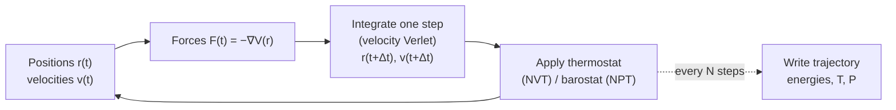

# 7.1 Newton, Verlet, and Time Integration


*The MD inner loop. Forces are evaluated at the current positions, the integrator advances `(r, v)` by one timestep `Δt`, optional thermostats and barostats rescale or extend the equations, and observables are sampled periodically.*

## Newton's second law for atoms

Take a system of $N$ atoms with positions $\mathbf{r}_i \in \mathbb{R}^3$ and masses $m_i$, interacting through a potential $U(\mathbf{r}_1,\ldots,\mathbf{r}_N)$. The force on atom $i$ is

$$
\mathbf{F}_i = -\nabla_i U,
\qquad
\nabla_i \equiv \left(\frac{\partial}{\partial x_i}, \frac{\partial}{\partial y_i}, \frac{\partial}{\partial z_i}\right),
\tag{7.1}
$$

and the trajectory obeys Newton's second law:

$$
m_i \ddot{\mathbf{r}}_i = -\nabla_i U(\mathbf{r}_1,\ldots,\mathbf{r}_N).
\tag{7.2}
$$

This is a system of $3N$ coupled second-order ODEs. Given initial positions $\mathbf{r}_i(0)$ and velocities $\mathbf{v}_i(0)$, the future of the system is determined for all time. The only thing standing between us and that future is a numerical integrator.

The potential $U$ can come from anywhere: from a classical force field (§7.4), from DFT (Chapter 6), or from a neural network trained on DFT (Chapter 9). For the rest of this section we treat it as a black box that returns forces; we will worry about where it comes from later.

## Why naive integration fails

The simplest discrete approximation to (7.2) is forward Euler. Discretise time with step $\Delta t$, write $\mathbf{r}^n \equiv \mathbf{r}(n\Delta t)$, and Taylor-expand:

$$
\mathbf{r}^{n+1} = \mathbf{r}^n + \Delta t\, \mathbf{v}^n,
\qquad
\mathbf{v}^{n+1} = \mathbf{v}^n + \Delta t\, \mathbf{a}^n,
\tag{7.3}
$$

where $\mathbf{a}^n = \mathbf{F}^n/m$. This looks innocent. It is not.

Apply (7.3) to the 1D harmonic oscillator $U(x) = \tfrac{1}{2}k x^2$, so $a = -\omega^2 x$ with $\omega = \sqrt{k/m}$. Combine the two updates into one matrix equation:

$$
\begin{pmatrix} x^{n+1} \\ v^{n+1} \end{pmatrix}
=
\begin{pmatrix} 1 & \Delta t \\ -\omega^2 \Delta t & 1 \end{pmatrix}
\begin{pmatrix} x^n \\ v^n \end{pmatrix}.
\tag{7.4}
$$

The eigenvalues of the update matrix are $1 \pm i\omega\Delta t$, with modulus $\sqrt{1 + \omega^2 \Delta t^2} > 1$. Every step inflates the amplitude geometrically. The exact orbit is a closed ellipse in phase space; Euler turns it into an outward spiral. The total energy

$$
E^n = \tfrac{1}{2} m (v^n)^2 + \tfrac{1}{2} k (x^n)^2
$$

grows like $(1 + \omega^2 \Delta t^2)^n \approx e^{n\omega^2 \Delta t^2}$. Over a nanosecond of MD with $\Delta t = 1$ fs and a C–H stretch at $\omega \approx 6\times 10^{14}$ rad/s, this factor is $\exp(6 \times 10^5)$. The simulation explodes before lunchtime.

Backward Euler decays just as inexorably to the origin. The problem is structural: neither method preserves the symplectic structure of Hamilton's equations.

!!! warning "Numerical integrators are not interchangeable"
    Adams-Bashforth, Runge-Kutta 4, Dormand-Prince — all the workhorses of numerical ODE libraries — drift in energy when applied to Hamiltonian systems, even though their formal accuracy is higher than Verlet. For MD you want a symplectic integrator, full stop. SciPy's `solve_ivp` is the wrong tool here.

## Verlet integration: derivation

The Verlet algorithm sidesteps the velocity entirely. Taylor-expand position to fourth order, forwards and backwards:

$$
\mathbf{r}(t + \Delta t) = \mathbf{r}(t) + \Delta t\, \dot{\mathbf{r}}(t) + \tfrac{1}{2}\Delta t^2 \ddot{\mathbf{r}}(t) + \tfrac{1}{6}\Delta t^3 \dddot{\mathbf{r}}(t) + O(\Delta t^4),
\tag{7.5}
$$

$$
\mathbf{r}(t - \Delta t) = \mathbf{r}(t) - \Delta t\, \dot{\mathbf{r}}(t) + \tfrac{1}{2}\Delta t^2 \ddot{\mathbf{r}}(t) - \tfrac{1}{6}\Delta t^3 \dddot{\mathbf{r}}(t) + O(\Delta t^4).
\tag{7.6}
$$

Add them. Every odd-order term cancels:

$$
\mathbf{r}(t + \Delta t) = 2\mathbf{r}(t) - \mathbf{r}(t - \Delta t) + \Delta t^2 \mathbf{a}(t) + O(\Delta t^4).
\tag{7.7}
$$

This is the **position-Verlet** scheme. Local truncation error is $O(\Delta t^4)$, global error $O(\Delta t^2)$ — one order better than Euler. More importantly, the algorithm is **time-reversible**: replacing $\Delta t \to -\Delta t$ in (7.7) gives back exactly the equation that propagates $\mathbf{r}(t - \Delta t)$ from $\mathbf{r}(t)$ and $\mathbf{r}(t+\Delta t)$.

Velocities are recovered by central differencing:

$$
\mathbf{v}(t) = \frac{\mathbf{r}(t+\Delta t) - \mathbf{r}(t - \Delta t)}{2\Delta t} + O(\Delta t^2).
\tag{7.8}
$$

Position-Verlet has an awkward feature: at step $n$ you need both $\mathbf{r}^n$ and $\mathbf{r}^{n-1}$, and velocities are only known one step in the past. **Velocity-Verlet** fixes this.

## Velocity-Verlet

Write the half-step velocity

$$
\mathbf{v}(t + \tfrac{\Delta t}{2}) = \mathbf{v}(t) + \tfrac{\Delta t}{2} \mathbf{a}(t).
\tag{7.9}
$$

Then the position update is exact in the half-step velocity:

$$
\mathbf{r}(t + \Delta t) = \mathbf{r}(t) + \Delta t\, \mathbf{v}(t + \tfrac{\Delta t}{2}).
\tag{7.10}
$$

Compute new forces at the new positions to get $\mathbf{a}(t + \Delta t)$, then complete the velocity:

$$
\mathbf{v}(t + \Delta t) = \mathbf{v}(t + \tfrac{\Delta t}{2}) + \tfrac{\Delta t}{2} \mathbf{a}(t + \Delta t).
\tag{7.11}
$$

Equations (7.9)–(7.11) form the **velocity-Verlet** algorithm. It is algebraically equivalent to position-Verlet but stores velocities explicitly, which is essential for thermostats (§7.3) and observables that depend on momenta (§7.6). Every production MD code uses this scheme or a close relative.

## Leapfrog form

A third equivalent rewriting is the **leapfrog** integrator, in which positions and velocities are stored at staggered times. Velocities live at half-integer steps:

$$
\mathbf{v}^{n + 1/2} = \mathbf{v}^{n - 1/2} + \Delta t\, \mathbf{a}^n,
\qquad
\mathbf{r}^{n+1} = \mathbf{r}^n + \Delta t\, \mathbf{v}^{n+1/2}.
\tag{7.12}
$$

Positions and forces alternate with velocities, hence the name. Leapfrog and velocity-Verlet produce **identical trajectories to floating-point precision** when initialised consistently — they are the same scheme written in two notations. GROMACS uses leapfrog by tradition; LAMMPS uses velocity-Verlet. The choice is cosmetic.

## Symplecticity and the shadow Hamiltonian

A Hamiltonian flow preserves the symplectic 2-form $\omega = \sum_i d p_i \wedge dq_i$ on phase space. Equivalently, the Jacobian of the time-evolution map has unit determinant: phase-space volume is conserved (Liouville's theorem). A numerical integrator is **symplectic** if it preserves this 2-form for finite $\Delta t$.

Verlet is symplectic. The proof is short: write (7.9)–(7.11) as a composition of three maps,

$$
\Phi_{\Delta t} = \Phi^{v}_{\Delta t/2} \circ \Phi^{r}_{\Delta t} \circ \Phi^{v}_{\Delta t/2},
$$

where $\Phi^v$ updates only momenta (shearing along $p$) and $\Phi^r$ updates only positions (shearing along $q$). Each shear has unit Jacobian; the composition does too.

Why does this matter for MD? A symplectic integrator does **not** conserve the exact Hamiltonian $H = T + U$. It does, however, conserve a nearby **shadow Hamiltonian**

$$
\tilde H = H + \Delta t^2 H_2 + \Delta t^4 H_4 + \ldots
\tag{7.13}
$$

exactly, where $H_2, H_4, \ldots$ are explicit functions of $H$ and its derivatives. Because $\tilde H$ is conserved, the true $H$ oscillates around its initial value in a bounded fashion: no secular drift. Over a million steps of a stable Verlet run you should see total energy fluctuating by perhaps $10^{-4}$ of the kinetic energy, with no monotonic trend.

That is the practical signature you check for. A drifting energy in NVE is a bug, almost always either (a) a time step too large for the highest frequency in the system, or (b) a non-symplectic component sneaking in — typically a thermostat misapplied to "NVE" (§7.3).

!!! note "Shadow Hamiltonian, not actual Hamiltonian"
    The conserved $\tilde H$ differs from $H$ by terms of order $\Delta t^2$. If you halve the time step, the fluctuation amplitude of $H$ drops by a factor of four. This is a useful diagnostic and explains why halving $\Delta t$ "fixes" mild energy drifts.

## Choosing the time step

The time step must resolve the fastest oscillation in your system. A general rule: $\Delta t \lesssim T_\mathrm{min}/20$, where $T_\mathrm{min}$ is the shortest vibrational period present.

The fastest vibrations in chemistry are C–H, O–H and N–H stretches at $\nu \approx 3000$ cm$^{-1}$, corresponding to

$$
T = \frac{1}{c\,\nu} = \frac{1}{(3\times 10^{10}\,\text{cm/s})(3000\,\text{cm}^{-1})} \approx 11\,\text{fs}.
$$

A safe step is therefore $\Delta t \approx 0.5$ fs. With SHAKE/RATTLE to constrain bond lengths involving H, you can extend to 2 fs; with hydrogen mass repartitioning, to 4 fs.

For systems without hydrogen (metals, oxides without OH groups), the highest phonon frequency is typically 500–1000 cm$^{-1}$, allowing $\Delta t = 1$–2 fs. For ab-initio MD with DFT forces, where each step is expensive, 0.5–1 fs is universal.

| System | Recommended $\Delta t$ |
|---|---|
| Aqueous biomolecules with flexible bonds | 0.5 fs |
| Aqueous biomolecules with SHAKE | 2 fs |
| Bulk metals (Cu, Fe, Ni) | 1–2 fs |
| Silicon, SiO$_2$ | 1 fs |
| Lennard-Jones reduced units | 0.001–0.005 $\tau$ |

If you are unsure, halve the time step and check whether the conserved energy fluctuation drops by a factor of four. If it does, you are in the convergent regime; if it does not, something is wrong.

## A complete velocity-Verlet implementation

Here is a working velocity-Verlet integrator for a 1D harmonic oscillator. Run it; verify energy conservation; modify it for your own potentials.

```python
"""Velocity-Verlet integration of a 1D harmonic oscillator.

Verifies symplectic energy conservation over many oscillation periods.
"""
from __future__ import annotations

from dataclasses import dataclass
from typing import Callable
import numpy as np
import matplotlib.pyplot as plt


@dataclass
class Oscillator:
    """1D harmonic oscillator U(x) = (1/2) k x^2."""

    mass: float = 1.0  # amu (arbitrary units here)
    k: float = 1.0     # spring constant

    def force(self, x: float) -> float:
        return -self.k * x

    def potential(self, x: float) -> float:
        return 0.5 * self.k * x * x

    @property
    def omega(self) -> float:
        return float(np.sqrt(self.k / self.mass))


def velocity_verlet(
    x0: float,
    v0: float,
    force_fn: Callable[[float], float],
    mass: float,
    dt: float,
    n_steps: int,
) -> tuple[np.ndarray, np.ndarray, np.ndarray]:
    """Integrate Newton's equations with velocity-Verlet.

    Parameters
    ----------
    x0, v0
        Initial position and velocity.
    force_fn
        Function returning force at a given position.
    mass
        Particle mass.
    dt
        Time step.
    n_steps
        Number of integration steps.

    Returns
    -------
    t, x, v
        Arrays of length n_steps + 1 with time, position, velocity.
    """
    t = np.zeros(n_steps + 1, dtype=np.float64)
    x = np.zeros(n_steps + 1, dtype=np.float64)
    v = np.zeros(n_steps + 1, dtype=np.float64)
    x[0], v[0] = x0, v0

    a = force_fn(x0) / mass
    for n in range(n_steps):
        # Half-step velocity
        v_half = v[n] + 0.5 * dt * a
        # Full-step position
        x[n + 1] = x[n] + dt * v_half
        # New acceleration at new position
        a_new = force_fn(x[n + 1]) / mass
        # Full-step velocity
        v[n + 1] = v_half + 0.5 * dt * a_new
        # Roll
        a = a_new
        t[n + 1] = t[n] + dt
    return t, x, v


def main() -> None:
    osc = Oscillator(mass=1.0, k=1.0)
    dt = 0.05  # 1/20 of period ~ 6.28
    n_steps = 200_000  # ~ 1600 oscillation periods

    t, x, v = velocity_verlet(
        x0=1.0, v0=0.0,
        force_fn=osc.force,
        mass=osc.mass,
        dt=dt, n_steps=n_steps,
    )

    ke = 0.5 * osc.mass * v * v
    pe = osc.potential(x)
    E = ke + pe

    drift = (E.max() - E.min()) / E[0]
    print(f"Initial energy:  {E[0]:.10f}")
    print(f"Final energy:    {E[-1]:.10f}")
    print(f"Max/min spread:  {drift:.2e}")

    fig, ax = plt.subplots(1, 2, figsize=(10, 4))
    ax[0].plot(t[:2000], x[:2000])
    ax[0].set(xlabel="t", ylabel="x(t)", title="Trajectory (first 100 periods)")
    ax[1].plot(t, (E - E[0]) / E[0])
    ax[1].set(xlabel="t", ylabel=r"$(E - E_0)/E_0$",
              title="Relative energy drift")
    fig.tight_layout()
    fig.savefig("verlet_harmonic.png", dpi=150)


if __name__ == "__main__":
    main()
```

Run this and you will see relative energy fluctuations bounded at about $6 \times 10^{-4}$ — independent of the number of steps. That is the symplectic signature. Replace velocity-Verlet with the Euler integrator from (7.3) and the relative energy will grow linearly with $n$; over $200\,000$ steps you will be many orders of magnitude off.

!!! tip "Sanity check every new integrator"
    Before deploying a new integrator on a real system, run it on a harmonic oscillator for $10^6$ steps. If the energy drifts, the bug is in the integrator, not the force field. This three-line check has saved entire PhDs.

## Looking ahead

We have an integrator that, given forces, can propagate atoms through time without drift. The next ingredient is the geometry of the simulation cell — atoms in a finite box are surrounded by surfaces, which is almost never what we want for a bulk material. That is [§7.2](02-pbc.md).
