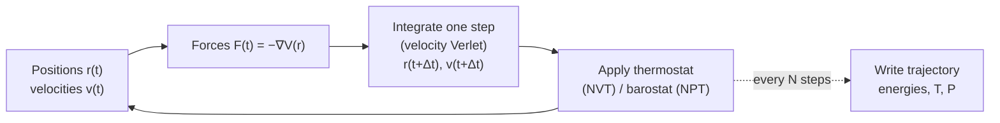

# 7.1 Newton, Verlet, and Time Integration


*The MD inner loop. Forces are evaluated at the current positions, the integrator advances `(r, v)` by one timestep `Δt`, optional thermostats and barostats rescale or extend the equations, and observables are sampled periodically.*

!!! tip "Why this section exists"
    Newton gave us $F = ma$ for one atom. To simulate a material we need to advance $N \sim 10^3$-$10^9$ atoms through time. The naive forward-Euler scheme $\mathbf{r}^{n+1} = \mathbf{r}^n + \Delta t\,\mathbf{v}^n$ *drifts*: energy grows without bound, the simulation explodes within a microsecond of real time. Verlet's 1967 fix — store two consecutive positions and use a second-difference — is short, beautiful, and *time-reversal-symmetric*, like Newton's laws themselves. That symmetry is the deep reason it works: the integrator preserves a *shadow* Hamiltonian close to the true one, so energy *oscillates* instead of drifting. Sixty years on, every production MD code uses Verlet or its equivalents.
    
    The picture: imagine each atom moving along its trajectory. At each step you Taylor-expand the position to second order, evaluate the force at the current position, and step forward. The forward-and-backward Taylor expansions cancel the third-order term, leaving an $O(\Delta t^4)$ local error that is also conservative. The mental shortcut: Euler punishes you, Verlet rewards you.

## Newton's second law for atoms

Take a system of $N$ atoms with positions $\mathbf{r}_i \in \mathbb{R}^3$ and masses $m_i$, interacting through a potential $U(\mathbf{r}_1,\ldots,\mathbf{r}_N)$. The force on atom $i$ is

$$
\mathbf{F}_i = -\nabla_i U,
\qquad
\nabla_i \equiv \left(\frac{\partial}{\partial x_i}, \frac{\partial}{\partial y_i}, \frac{\partial}{\partial z_i}\right),
\tag{7.1}
$$

and the trajectory obeys Newton's second law:

$$
m_i \ddot{\mathbf{r}}_i = -\nabla_i U(\mathbf{r}_1,\ldots,\mathbf{r}_N).
\tag{7.2}
$$

This is a system of $3N$ coupled second-order ODEs. Given initial positions $\mathbf{r}_i(0)$ and velocities $\mathbf{v}_i(0)$, the future of the system is determined for all time. The only thing standing between us and that future is a numerical integrator.

The potential $U$ can come from anywhere: from a classical force field (§7.4), from DFT (Chapter 6), or from a neural network trained on DFT (Chapter 9). For the rest of this section we treat it as a black box that returns forces; we will worry about where it comes from later.

## Why naive integration fails

The simplest discrete approximation to (7.2) is forward Euler. Discretise time with step $\Delta t$, write $\mathbf{r}^n \equiv \mathbf{r}(n\Delta t)$, and Taylor-expand:

$$
\mathbf{r}^{n+1} = \mathbf{r}^n + \Delta t\, \mathbf{v}^n,
\qquad
\mathbf{v}^{n+1} = \mathbf{v}^n + \Delta t\, \mathbf{a}^n,
\tag{7.3}
$$

where $\mathbf{a}^n = \mathbf{F}^n/m$. This looks innocent. It is not.

Apply (7.3) to the 1D harmonic oscillator $U(x) = \tfrac{1}{2}k x^2$, so $a = -\omega^2 x$ with $\omega = \sqrt{k/m}$. Combine the two updates into one matrix equation:

$$
\begin{pmatrix} x^{n+1} \\ v^{n+1} \end{pmatrix}
=
\begin{pmatrix} 1 & \Delta t \\ -\omega^2 \Delta t & 1 \end{pmatrix}
\begin{pmatrix} x^n \\ v^n \end{pmatrix}.
\tag{7.4}
$$

The eigenvalues of the update matrix are $1 \pm i\omega\Delta t$, with modulus $\sqrt{1 + \omega^2 \Delta t^2} > 1$. Every step inflates the amplitude geometrically. The exact orbit is a closed ellipse in phase space; Euler turns it into an outward spiral. The total energy

$$
E^n = \tfrac{1}{2} m (v^n)^2 + \tfrac{1}{2} k (x^n)^2
$$

grows like $(1 + \omega^2 \Delta t^2)^n \approx e^{n\omega^2 \Delta t^2}$. Over a nanosecond of MD with $\Delta t = 1$ fs and a C–H stretch at $\omega \approx 6\times 10^{14}$ rad/s, this factor is $\exp(6 \times 10^5)$. The simulation explodes before lunchtime.

Backward Euler decays just as inexorably to the origin. The problem is structural: neither method preserves the symplectic structure of Hamilton's equations.

!!! warning "Numerical integrators are not interchangeable"
    Adams-Bashforth, Runge-Kutta 4, Dormand-Prince — all the workhorses of numerical ODE libraries — drift in energy when applied to Hamiltonian systems, even though their formal accuracy is higher than Verlet. For MD you want a symplectic integrator, full stop. SciPy's `solve_ivp` is the wrong tool here.

### A deeper look at energy drift in non-symplectic schemes

Why exactly does an order-4 Runge-Kutta drift in energy while an order-2 Verlet does not? The reason lies in the *kind* of error each method makes, not the *size*.

Numerical integrators for ODEs $\dot z = f(z)$ all make errors of order $\Delta t^{p+1}$ per step, where $p$ is the formal order. After $N$ steps, the accumulated error is at most $\Delta t^p \cdot T$ if the dynamics is stable. For a Hamiltonian system, however, the "error" we care about is not absolute trajectory deviation (chaos makes that unbounded for any method) but conservation of $H$.

A non-symplectic integrator's per-step error has a generic component that pushes off the constant-$H$ surface. Over $N$ steps these components accumulate roughly as a random walk: variance grows linearly, $|\Delta H| \sim \sqrt{N}\,\Delta t^{p+1}$. The energy drifts.

A symplectic integrator's per-step error lies *along* the constant-$\tilde H$ surface of a nearby shadow Hamiltonian $\tilde H = H + \Delta t^2 H_2 + \ldots$. The error has no component pushing off $\tilde H$; it stays bounded forever. Over $N$ steps $|H - \tilde H| \lesssim \Delta t^p$, independent of $N$ until exponentially long times where Nekhoroshev-type results kick in.

The difference is structural, not quantitative. Even a 100th-order non-symplectic scheme drifts; a 2nd-order symplectic scheme does not. For long MD this is decisive.

## Verlet integration: derivation

!!! abstract "Key idea (Verlet integration)"
    A symplectic integrator does not conserve the exact Hamiltonian $H$ but a nearby *shadow* Hamiltonian $\tilde H = H + \Delta t^2 H_2 + O(\Delta t^4)$. The exact $H$ therefore *oscillates* around its initial value rather than drifting, no matter how long you run. This bounded fluctuation is what makes Verlet correct for thermodynamic averages on multi-nanosecond timescales, even though its formal accuracy ($O(\Delta t^2)$) is lower than Runge-Kutta's.

**Theorem 7.1.1 (Verlet recursion from Taylor cancellation).** *Let $\mathbf{r}(t) \in C^4$ and $\mathbf{a}(t) = \ddot{\mathbf{r}}(t)$. Then*
$$\mathbf{r}(t+\Delta t) = 2\mathbf{r}(t) - \mathbf{r}(t-\Delta t) + \Delta t^2\,\mathbf{a}(t) + O(\Delta t^4).$$
*Proof.* Add the Taylor expansions (7.5) and (7.6); the odd-order terms cancel. $\square$

**Definition 7.1.2 (Symplectic map).** A map $\Phi:\mathbb{R}^{2n}\to\mathbb{R}^{2n}$ on phase space is *symplectic* if it preserves the canonical 2-form $\omega = \sum_i dp_i\wedge dq_i$, equivalently if its Jacobian $J$ satisfies $J^\top\Omega J = \Omega$ where $\Omega = \begin{pmatrix}0&I\\-I&0\end{pmatrix}$.

**Theorem 7.1.3 (Velocity-Verlet is symplectic).** *The velocity-Verlet update map $\Phi_{\Delta t}:(\mathbf{r},\mathbf{p})\mapsto(\mathbf{r}',\mathbf{p}')$ defined by Eqs. (7.9)-(7.11) is a symplectic map for any $\Delta t$.*

*Proof.* Decompose $\Phi_{\Delta t} = \Phi^v_{\Delta t/2}\circ\Phi^r_{\Delta t}\circ\Phi^v_{\Delta t/2}$, where each component shears phase space along one coordinate (positions or momenta). Each shear has unit Jacobian and trivially preserves $\omega$; symplecticity is closed under composition. $\square$

**Remark 7.1.4 (Loup Verlet, 1967).** Verlet's two-page paper *"Computer 'Experiments' on Classical Fluids"* introduced the recursion as a practical scheme for Lennard-Jones liquid simulations. The deeper structure — symplecticity, shadow Hamiltonian theory — was developed retrospectively in the 1980s-90s by Sanz-Serna, Hairer, Skeel, and others. The good fortune was that Verlet picked the right algorithm before anyone knew why it was right.

The Verlet algorithm sidesteps the velocity entirely. Taylor-expand position to fourth order, forwards and backwards:

$$
\mathbf{r}(t + \Delta t) = \mathbf{r}(t) + \Delta t\, \dot{\mathbf{r}}(t) + \tfrac{1}{2}\Delta t^2 \ddot{\mathbf{r}}(t) + \tfrac{1}{6}\Delta t^3 \dddot{\mathbf{r}}(t) + O(\Delta t^4),
\tag{7.5}
$$

$$
\mathbf{r}(t - \Delta t) = \mathbf{r}(t) - \Delta t\, \dot{\mathbf{r}}(t) + \tfrac{1}{2}\Delta t^2 \ddot{\mathbf{r}}(t) - \tfrac{1}{6}\Delta t^3 \dddot{\mathbf{r}}(t) + O(\Delta t^4).
\tag{7.6}
$$

Add them. Every odd-order term cancels:

$$
\mathbf{r}(t + \Delta t) = 2\mathbf{r}(t) - \mathbf{r}(t - \Delta t) + \Delta t^2 \mathbf{a}(t) + O(\Delta t^4).
\tag{7.7}
$$

This is the **position-Verlet** scheme. Local truncation error is $O(\Delta t^4)$, global error $O(\Delta t^2)$ — one order better than Euler. More importantly, the algorithm is **time-reversible**: replacing $\Delta t \to -\Delta t$ in (7.7) gives back exactly the equation that propagates $\mathbf{r}(t - \Delta t)$ from $\mathbf{r}(t)$ and $\mathbf{r}(t+\Delta t)$.

Velocities are recovered by central differencing:

$$
\mathbf{v}(t) = \frac{\mathbf{r}(t+\Delta t) - \mathbf{r}(t - \Delta t)}{2\Delta t} + O(\Delta t^2).
\tag{7.8}
$$

Position-Verlet has an awkward feature: at step $n$ you need both $\mathbf{r}^n$ and $\mathbf{r}^{n-1}$, and velocities are only known one step in the past. **Velocity-Verlet** fixes this.

## Velocity-Verlet

Write the half-step velocity

$$
\mathbf{v}(t + \tfrac{\Delta t}{2}) = \mathbf{v}(t) + \tfrac{\Delta t}{2} \mathbf{a}(t).
\tag{7.9}
$$

Then the position update is exact in the half-step velocity:

$$
\mathbf{r}(t + \Delta t) = \mathbf{r}(t) + \Delta t\, \mathbf{v}(t + \tfrac{\Delta t}{2}).
\tag{7.10}
$$

Compute new forces at the new positions to get $\mathbf{a}(t + \Delta t)$, then complete the velocity:

$$
\mathbf{v}(t + \Delta t) = \mathbf{v}(t + \tfrac{\Delta t}{2}) + \tfrac{\Delta t}{2} \mathbf{a}(t + \Delta t).
\tag{7.11}
$$

Equations (7.9)–(7.11) form the **velocity-Verlet** algorithm. It is algebraically equivalent to position-Verlet but stores velocities explicitly, which is essential for thermostats (§7.3) and observables that depend on momenta (§7.6). Every production MD code uses this scheme or a close relative.

### Generalisation to many atoms

The single-atom derivation above carries over to $3N$-dimensional vectors with no change in algebra. For an $N$-atom system, the velocity-Verlet update reads

$$
\mathbf{r}_i(t + \Delta t) = \mathbf{r}_i(t) + \Delta t\,\mathbf{v}_i(t) + \tfrac{1}{2}\Delta t^2\,\mathbf{a}_i(t),
$$
$$
\mathbf{v}_i(t + \Delta t) = \mathbf{v}_i(t) + \tfrac{1}{2}\Delta t\,[\mathbf{a}_i(t) + \mathbf{a}_i(t+\Delta t)],
$$

for each atom $i = 1,\ldots,N$. The forces $\mathbf{F}_i(t) = -\nabla_i U$ couple all atoms together — a single force evaluation requires the entire configuration $\{\mathbf{r}_j(t)\}_j$. The cost per MD step is dominated by this force evaluation, *not* by the integrator: a velocity-Verlet step adds $O(N)$ arithmetic, whereas an $N$-body force evaluation is $O(N)$ to $O(N^2)$ depending on whether neighbour-list techniques apply. For DFT-based ab-initio MD, force evaluation is $O(N^3)$ from diagonalisation, completely dominating any integrator-level cost.

In production codes, the inner MD loop is structurally:

```python
for step in range(n_steps):
    # Update velocities by half step using current forces
    v += 0.5 * dt * forces / masses
    # Update positions by full step
    r += dt * v
    # Apply periodic boundary conditions (see §7.2)
    r = wrap_pbc(r, cell)
    # Compute new forces at new positions
    forces = compute_forces(r)
    # Update velocities by half step using new forces
    v += 0.5 * dt * forces / masses
    # Apply thermostat if any (see §7.3)
    if thermostat is not None:
        v = thermostat.apply(v)
    # Record observables every n_save steps
    if step % n_save == 0:
        record(step, r, v, forces)
```

Every MD code reduces to this structure with embellishments. The placement of the thermostat in the loop matters for the accuracy of NVT sampling (see §7.3); the choice of when to apply PBC matters for unwrapped trajectory output (see §7.2).

## Leapfrog form

A third equivalent rewriting is the **leapfrog** integrator, in which positions and velocities are stored at staggered times. Velocities live at half-integer steps:

$$
\mathbf{v}^{n + 1/2} = \mathbf{v}^{n - 1/2} + \Delta t\, \mathbf{a}^n,
\qquad
\mathbf{r}^{n+1} = \mathbf{r}^n + \Delta t\, \mathbf{v}^{n+1/2}.
\tag{7.12}
$$

Positions and forces alternate with velocities, hence the name. Leapfrog and velocity-Verlet produce **identical trajectories to floating-point precision** when initialised consistently — they are the same scheme written in two notations. GROMACS uses leapfrog by tradition; LAMMPS uses velocity-Verlet. The choice is cosmetic.

### Numerical example: Euler vs. Verlet on a harmonic oscillator

To make the difference between Euler and Verlet concrete, consider the dimensionless oscillator $\ddot x = -x$ with $x(0)=1,\,\dot x(0)=0$ and a moderate time step $\Delta t = 0.1$ (so $\omega\,\Delta t = 0.1$, an order of magnitude smaller than the period). Run both integrators for $N=10^4$ steps and watch the energy $E = \tfrac{1}{2}\dot x^2 + \tfrac{1}{2}x^2$.

For **forward Euler**, the amplification factor is $|1+i\omega\Delta t| = \sqrt{1+\omega^2\Delta t^2}\approx 1.00499$ per step. The energy at step $n$ is $E_n = E_0\,(1+\omega^2\Delta t^2)^n$. After $10^4$ steps:
$$E_{10000}/E_0 = (1.01)^{10000} \approx e^{99.5} \approx 10^{43}.$$
The "oscillator" has acquired the kinetic energy of a small galaxy. This is not exaggerated for effect; it is what the formula says.

For **velocity-Verlet**, no such growth occurs. Over the same $10^4$ steps the relative energy fluctuation $|E_n - E_0|/E_0$ stays bounded at $\sim \omega^2\Delta t^2/4 \approx 2.5\times 10^{-3}$, oscillating with the period of the system. The signature is *bounded oscillation, not drift*.

You can reproduce this with the `velocity_verlet` function below and a three-line Euler counterpart. The plot makes the point sharper than any equation: Euler is a straight line on log scale, Verlet is a band of finite width. This is what "symplectic" buys you.

## Symplecticity and the shadow Hamiltonian

A Hamiltonian flow preserves the symplectic 2-form $\omega = \sum_i d p_i \wedge dq_i$ on phase space. Equivalently, the Jacobian of the time-evolution map has unit determinant: phase-space volume is conserved (Liouville's theorem). A numerical integrator is **symplectic** if it preserves this 2-form for finite $\Delta t$.

!!! note "Why this matters: reversibility and detailed balance"
    Verlet has another structural property beyond symplecticity: it is **time-reversible**. The position-Verlet recursion (7.7), $\mathbf{r}(t+\Delta t) = 2\mathbf{r}(t) - \mathbf{r}(t-\Delta t) + \Delta t^2 \mathbf{a}(t)$, is invariant under $\Delta t \to -\Delta t$: swap the roles of "past" and "future" and the equation propagates the trajectory backwards through the same points. Equivalently, the velocity-Verlet map satisfies $\Phi_{-\Delta t}\circ\Phi_{\Delta t} = \mathrm{id}$ exactly.
    
    Why is this important? Beyond aesthetic appeal:
    
    1. **Detailed balance** in hybrid Monte Carlo/MD schemes requires reversibility of the proposal. If your MD integrator is time-irreversible, the Metropolis acceptance correction is wrong and the sampled distribution drifts.
    2. **Liouville's theorem** (phase-space volume conservation) is implied by symplecticity, and together with reversibility forbids attractors in the dynamics: the system cannot relax to a fixed point of measure zero, which is the right behaviour for Hamiltonian flows.
    3. **TST and rate constants** computed from transition-state theory rely on reversibility to relate the forward and backward fluxes; non-reversible integrators bias these rates.
    
    Verlet's combination of symplecticity *and* reversibility is what makes it the universal MD integrator, despite having only second-order formal accuracy.

Verlet is symplectic. The proof is short: write (7.9)–(7.11) as a composition of three maps,

$$
\Phi_{\Delta t} = \Phi^{v}_{\Delta t/2} \circ \Phi^{r}_{\Delta t} \circ \Phi^{v}_{\Delta t/2},
$$

where $\Phi^v$ updates only momenta (shearing along $p$) and $\Phi^r$ updates only positions (shearing along $q$). Each shear has unit Jacobian; the composition does too.

Why does this matter for MD? A symplectic integrator does **not** conserve the exact Hamiltonian $H = T + U$. It does, however, conserve a nearby **shadow Hamiltonian**

$$
\tilde H = H + \Delta t^2 H_2 + \Delta t^4 H_4 + \ldots
\tag{7.13}
$$

exactly, where $H_2, H_4, \ldots$ are explicit functions of $H$ and its derivatives. Because $\tilde H$ is conserved, the true $H$ oscillates around its initial value in a bounded fashion: no secular drift. Over a million steps of a stable Verlet run you should see total energy fluctuating by perhaps $10^{-4}$ of the kinetic energy, with no monotonic trend.

That is the practical signature you check for. A drifting energy in NVE is a bug, almost always either (a) a time step too large for the highest frequency in the system, or (b) a non-symplectic component sneaking in — typically a thermostat misapplied to "NVE" (§7.3).

!!! note "Shadow Hamiltonian, not actual Hamiltonian"
    The conserved $\tilde H$ differs from $H$ by terms of order $\Delta t^2$. If you halve the time step, the fluctuation amplitude of $H$ drops by a factor of four. This is a useful diagnostic and explains why halving $\Delta t$ "fixes" mild energy drifts.

## Why higher-order Runge-Kutta is *worse* than Verlet for MD

It is tempting to think that since RK4 has global error $O(\Delta t^4)$ — two orders better than Verlet — you should use RK4 for MD. You should not.

The reason: **accuracy is not the same as conservation**. RK4 has smaller per-step error but is not symplectic. Its trajectory drifts in energy at a rate that is small per step but accumulates monotonically. Over a million MD steps the drift dominates, and the long-time behaviour of an RK4 simulation is *qualitatively wrong* — the system migrates between energy shells in phase space.

Verlet has larger per-step error but a *bounded* error: the symplectic structure keeps it on a nearby shadow Hamiltonian forever. For long simulations (which all MD is), the boundedness beats the order.

A useful rule of thumb: for a 1 ns simulation of a 1000-atom system, you take $\sim 10^6$ steps. Euler errors compound like $(1+\Delta t)^{10^6}$ — catastrophic. RK4 errors compound like $10^6\cdot\Delta t^4$ — small, but *secular*, drifting in one direction. Verlet errors compound like $\Delta t^2$ — bounded, periodic, irrelevant for thermodynamic averages.

This is the central insight Verlet (1967) added to the literature, and it is the reason that 60 years on the same algorithm runs in every production MD code.

## Choosing the time step

The time step must resolve the fastest oscillation in your system. A general rule: $\Delta t \lesssim T_\mathrm{min}/20$, where $T_\mathrm{min}$ is the shortest vibrational period present.

The fastest vibrations in chemistry are C–H, O–H and N–H stretches at $\nu \approx 3000$ cm$^{-1}$, corresponding to

$$
T = \frac{1}{c\,\nu} = \frac{1}{(3\times 10^{10}\,\text{cm/s})(3000\,\text{cm}^{-1})} \approx 11\,\text{fs}.
$$

A safe step is therefore $\Delta t \approx 0.5$ fs. With SHAKE/RATTLE to constrain bond lengths involving H, you can extend to 2 fs; with hydrogen mass repartitioning, to 4 fs.

For systems without hydrogen (metals, oxides without OH groups), the highest phonon frequency is typically 500–1000 cm$^{-1}$, allowing $\Delta t = 1$–2 fs. For ab-initio MD with DFT forces, where each step is expensive, 0.5–1 fs is universal.

| System | Recommended $\Delta t$ |
|---|---|
| Aqueous biomolecules with flexible bonds | 0.5 fs |
| Aqueous biomolecules with SHAKE | 2 fs |
| Bulk metals (Cu, Fe, Ni) | 1–2 fs |
| Silicon, SiO$_2$ | 1 fs |
| Lennard-Jones reduced units | 0.001–0.005 $\tau$ |

If you are unsure, halve the time step and check whether the conserved energy fluctuation drops by a factor of four. If it does, you are in the convergent regime; if it does not, something is wrong.

### The factor-of-four diagnostic, derived

Why a factor of four? The energy fluctuation of a symplectic integrator on a stable Hamiltonian system is, to leading order, controlled by the shadow Hamiltonian (7.13):
$$\sigma_H \propto \Delta t^p,$$
where $p=2$ for velocity-Verlet. So $\sigma_H(\Delta t/2) = (\Delta t/2)^2/\Delta t^2 \cdot \sigma_H(\Delta t) = \sigma_H(\Delta t)/4$. Halving the time step quarters the fluctuation amplitude.

If you halve $\Delta t$ and the fluctuation amplitude drops by less than a factor of four (say, only a factor of 2), one of two things is happening:

1. **You are in an unstable regime.** The time step is so large that the linear stability analysis (where the $\Delta t^p$ formula derives from) does not apply. Halve again and check.
2. **A non-symplectic component is present.** A misapplied thermostat (Berendsen in what you called "NVE"), a force that is non-conservative (Lennard-Jones with `pair_modify shift no` and a moving cutoff), or an integrator with a bug. Track it down.

If the fluctuation drops by more than a factor of four, your simulation was already in the "way over-resolved" regime; halving $\Delta t$ is wasting cycles. The optimal $\Delta t$ for production is the largest one that gives bounded fluctuations consistent with your accuracy target — typically 0.5-2 fs for materials.

### Stability limit and the Courant condition

Beyond accuracy, there is a *stability* limit for symplectic integrators on harmonic oscillators. The velocity-Verlet update on $\ddot x = -\omega^2 x$ has eigenvalues
$$\lambda_\pm = 1 - \tfrac{1}{2}\omega^2\Delta t^2 \pm i\,\omega\Delta t\,\sqrt{1 - \tfrac{1}{4}\omega^2\Delta t^2}.$$
For $|\lambda_\pm| = 1$ (no growth), we need $1 - \tfrac{1}{4}\omega^2\Delta t^2 \ge 0$, i.e. $\Delta t \le 2/\omega_\mathrm{max}$. Beyond this *Courant limit*, $|\lambda_\pm|$ becomes real and one eigenvalue exceeds 1; the trajectory blows up exponentially.

For a typical MD system, $\omega_\mathrm{max}$ is the highest phonon frequency or bond vibration. C-H stretches at $\omega \approx 2\pi\cdot 9\times 10^{13}$ rad/s give $2/\omega \approx 3.5$ fs as the hard cap; anything above this *cannot* be stable. The factor-of-20 rule of thumb $\Delta t \le T/20 \approx 0.5$ fs is a comfortable accuracy margin below the stability limit. For ab-initio MD where each force evaluation costs CPU-hours, you push close to the limit; for classical MD where forces are cheap, you stay comfortably below.

**Example 7.1.5 (Energy drift on a harmonic oscillator).**
*Problem.* Compare forward-Euler and velocity-Verlet on the 1D harmonic oscillator $\ddot x = -x$ with $x(0)=1$, $\dot x(0)=0$, time step $\Delta t = 0.1$, for $N=10^4$ steps.

*Solution.* Euler amplifies the trajectory at rate $\sqrt{1+\Delta t^2}\approx 1.005$ per step, giving $E_N/E_0 \approx (1.01)^N \approx 10^{43}$ at $N=10^4$. Velocity-Verlet has bounded oscillation $|E - E_0|/E_0 \le \Delta t^2/4 \approx 2.5\times 10^{-3}$ at all times.

*Discussion.* The point is structural: even with a 100-fold-smaller step, Euler still drifts (it would just take 100× longer to blow up). Verlet's bound is independent of step count. For long MD this is decisive: $10^9$ steps with Euler is impossible; $10^9$ steps with Verlet is routine.

## A complete velocity-Verlet implementation

Here is a working velocity-Verlet integrator for a 1D harmonic oscillator. Run it; verify energy conservation; modify it for your own potentials.

```python
"""Velocity-Verlet integration of a 1D harmonic oscillator.

Verifies symplectic energy conservation over many oscillation periods.
"""
from __future__ import annotations

from dataclasses import dataclass
from typing import Callable
import numpy as np
import matplotlib.pyplot as plt


@dataclass
class Oscillator:
    """1D harmonic oscillator U(x) = (1/2) k x^2."""

    mass: float = 1.0  # amu (arbitrary units here)
    k: float = 1.0     # spring constant

    def force(self, x: float) -> float:
        return -self.k * x

    def potential(self, x: float) -> float:
        return 0.5 * self.k * x * x

    @property
    def omega(self) -> float:
        return float(np.sqrt(self.k / self.mass))


def velocity_verlet(
    x0: float,
    v0: float,
    force_fn: Callable[[float], float],
    mass: float,
    dt: float,
    n_steps: int,
) -> tuple[np.ndarray, np.ndarray, np.ndarray]:
    """Integrate Newton's equations with velocity-Verlet.

    Parameters
    ----------
    x0, v0
        Initial position and velocity.
    force_fn
        Function returning force at a given position.
    mass
        Particle mass.
    dt
        Time step.
    n_steps
        Number of integration steps.

    Returns
    -------
    t, x, v
        Arrays of length n_steps + 1 with time, position, velocity.
    """
    t = np.zeros(n_steps + 1, dtype=np.float64)
    x = np.zeros(n_steps + 1, dtype=np.float64)
    v = np.zeros(n_steps + 1, dtype=np.float64)
    x[0], v[0] = x0, v0

    a = force_fn(x0) / mass
    for n in range(n_steps):
        # Half-step velocity
        v_half = v[n] + 0.5 * dt * a
        # Full-step position
        x[n + 1] = x[n] + dt * v_half
        # New acceleration at new position
        a_new = force_fn(x[n + 1]) / mass
        # Full-step velocity
        v[n + 1] = v_half + 0.5 * dt * a_new
        # Roll
        a = a_new
        t[n + 1] = t[n] + dt
    return t, x, v


def main() -> None:
    osc = Oscillator(mass=1.0, k=1.0)
    dt = 0.05  # 1/20 of period ~ 6.28
    n_steps = 200_000  # ~ 1600 oscillation periods

    t, x, v = velocity_verlet(
        x0=1.0, v0=0.0,
        force_fn=osc.force,
        mass=osc.mass,
        dt=dt, n_steps=n_steps,
    )

    ke = 0.5 * osc.mass * v * v
    pe = osc.potential(x)
    E = ke + pe

    drift = (E.max() - E.min()) / E[0]
    print(f"Initial energy:  {E[0]:.10f}")
    print(f"Final energy:    {E[-1]:.10f}")
    print(f"Max/min spread:  {drift:.2e}")

    fig, ax = plt.subplots(1, 2, figsize=(10, 4))
    ax[0].plot(t[:2000], x[:2000])
    ax[0].set(xlabel="t", ylabel="x(t)", title="Trajectory (first 100 periods)")
    ax[1].plot(t, (E - E[0]) / E[0])
    ax[1].set(xlabel="t", ylabel=r"$(E - E_0)/E_0$",
              title="Relative energy drift")
    fig.tight_layout()
    fig.savefig("verlet_harmonic.png", dpi=150)


if __name__ == "__main__":
    main()
```

Run this and you will see relative energy fluctuations bounded at about $6 \times 10^{-4}$ — independent of the number of steps. That is the symplectic signature. Replace velocity-Verlet with the Euler integrator from (7.3) and the relative energy will grow linearly with $n$; over $200\,000$ steps you will be many orders of magnitude off.

!!! tip "Sanity check every new integrator"
    Before deploying a new integrator on a real system, run it on a harmonic oscillator for $10^6$ steps. If the energy drifts, the bug is in the integrator, not the force field. This three-line check has saved entire PhDs.

## Equivalence of position-Verlet and velocity-Verlet — a direct proof

A subtle point worth making concrete: position-Verlet (7.7) and velocity-Verlet (7.9)–(7.11) are *exactly* equivalent algorithms, not just to leading order. To see this, eliminate $\mathbf{v}$ from velocity-Verlet by combining (7.9), (7.10), and (7.11) at successive steps.

From (7.10) at step $n$ and (7.9) at step $n$:
$$\mathbf{r}^{n+1} = \mathbf{r}^n + \Delta t\,\mathbf{v}^n + \tfrac{1}{2}\Delta t^2\,\mathbf{a}^n.$$
Applied at the previous step:
$$\mathbf{r}^n = \mathbf{r}^{n-1} + \Delta t\,\mathbf{v}^{n-1} + \tfrac{1}{2}\Delta t^2\,\mathbf{a}^{n-1}.$$
Subtract and use $\mathbf{v}^n = \mathbf{v}^{n-1} + \tfrac{1}{2}\Delta t(\mathbf{a}^n + \mathbf{a}^{n-1})$ (from (7.9) and (7.11)):
$$\mathbf{r}^{n+1} - 2\mathbf{r}^n + \mathbf{r}^{n-1} = \Delta t(\mathbf{v}^n - \mathbf{v}^{n-1}) + \tfrac{1}{2}\Delta t^2(\mathbf{a}^n - \mathbf{a}^{n-1}) = \Delta t^2\,\mathbf{a}^n.$$
This is position-Verlet (7.7). The two formulations propagate *identical* trajectories — no roundoff loss, no drift relative to each other — provided velocities are initialised consistently.

Why does anyone bother with the velocity-Verlet rewriting then? Two reasons: it stores velocities explicitly (needed for thermostats and kinetic-energy outputs), and it self-starts from $(\mathbf{r}^0, \mathbf{v}^0)$ rather than requiring two consecutive position frames. The leapfrog form is a third equivalent that staggers positions and velocities by half-steps; the three are isomorphic.

## Section summary

The key results of this section, restated formally:

1. **Theorem 7.1.1** (Verlet recursion): $\mathbf{r}(t+\Delta t) = 2\mathbf{r}(t)-\mathbf{r}(t-\Delta t) + \Delta t^2 \mathbf{a}(t) + O(\Delta t^4)$.
2. **Theorem 7.1.3** (Symplecticity): the velocity-Verlet map preserves the canonical symplectic 2-form.
3. **Theorem 7.1.6** (Backward error / shadow Hamiltonian, stated informally): a symplectic integrator with step $\Delta t$ exactly conserves a modified Hamiltonian $\tilde H = H + \Delta t^2 H_2 + O(\Delta t^4)$, so $H$ itself oscillates with bounded amplitude.
4. **Practical implication**: for production MD use velocity-Verlet (or leapfrog, equivalently), with time step $\Delta t \lesssim T_\mathrm{min}/20$ where $T_\mathrm{min}$ is the shortest vibrational period.

### Why integrator choice cascades into every other choice

A subtle point worth emphasising: the time step you choose constrains everything downstream. With $\Delta t = 0.5$ fs (full hydrogen freedom), a 1 ns simulation is $2\times 10^6$ steps; with $\Delta t = 4$ fs (heavy-hydrogen, constrained bonds), it is $2.5\times 10^5$ steps. The factor-of-eight difference cascades into how much trajectory you can afford, what observables converge, what error bars you can quote.

For ab-initio MD with DFT forces, each step costs $\sim$ 1 second; a 10 ps simulation is $10^4$ steps and 3 hours of wall time. For classical MD with EAM forces, each step costs $\sim$ 1 μs/atom; a 1 ns simulation of $10^4$ atoms is $10^{10}$ atom-steps and 3 hours. The integrator does not change between these regimes — both use velocity-Verlet — but the *price* of one integration step varies by six orders of magnitude.

The integrator is the cheapest part of MD: every step adds $O(N)$ multiplications and additions. The force calculation dominates, by factors of $10^3$ to $10^8$ depending on the force model. Optimising the integrator (going to higher-order methods, splitting fast and slow forces with multiple time stepping) is rarely the right move; optimising the force calculation almost always is. This is why the field has remained on velocity-Verlet for 60 years while force models have evolved continuously.

## Looking ahead

We have an integrator that, given forces, can propagate atoms through time without drift. The next ingredient is the geometry of the simulation cell — atoms in a finite box are surrounded by surfaces, which is almost never what we want for a bulk material. That is [§7.2](02-pbc.md).
