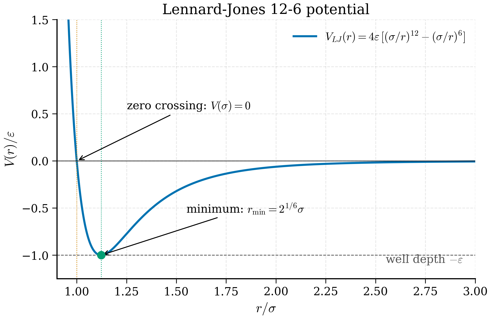

# 7.4 Force Fields

<figure markdown>
{ width="600" }
<figcaption>Figure 7.4.1. The Lennard-Jones 12-6 potential: the canonical pair potential, with a steep repulsive wall, a single minimum at \(r_{\min} = 2^{1/6}\sigma\), and a smooth attractive tail. (Synthetic curve in reduced units.)</figcaption>
</figure>

The integrators of §7.1 and the thermostats of §7.3 are agnostic to where forces come from. In [Chapter 6](../ch06-running-dft/index.md) we computed forces from DFT — accurate but expensive, scaling as $O(N^3)$ for hybrid functionals and limiting routine MD to a few hundred atoms for picoseconds. To reach the thousands-of-atoms, nanoseconds-and-beyond regime that materials science actually needs, we replace the DFT force calculation by an analytic functional form fitted to reference data. This is a **classical force field**.

The art of force-field design is a half-century-old enterprise. We survey four families that span the chemistry of materials: simple pair potentials, density-dependent metal potentials, bond-order potentials for covalent solids, and reactive force fields. Each has a regime where it is excellent and a regime where it fails badly. Together they motivate the machine-learning potentials of [Chapter 9](../ch09-mlip/index.md).

!!! tip "Why classical force fields exist"
    DFT computes forces by solving the Kohn-Sham equations *every time the atoms move*. Each force evaluation is seconds to minutes for a few hundred atoms, scaling as $O(N^3)$ with system size. To simulate a million-atom system for a nanosecond — needed for fracture mechanics, polymer crystallisation, alloy precipitation — at DFT cost would take longer than the age of the universe. Classical force fields replace the quantum-mechanical force calculation by an analytic function $U(\mathbf{r}_1,\ldots,\mathbf{r}_N)$ fitted to reference data. Force evaluation drops from seconds to microseconds per atom; simulations of millions of atoms become routine.
    
    Picture: a hand-drawn map versus a satellite photograph. The map is faster to consult but loses detail. Different force fields trade off accuracy for cost in different ways: Lennard-Jones is the rudest map (good for noble gases, useless for chemistry); EAM adds many-body density terms (works for metals); Tersoff/REBO add angular terms (works for covalent solids); ReaxFF adds dynamic bond breaking (works for reactive chemistry but slowly). Machine-learning potentials, the subject of Chapter 9, are the "best of both worlds": near-DFT accuracy at near-classical speed.

## Lennard-Jones

The simplest non-trivial pair potential is

$$
U_\mathrm{LJ}(r) = 4\epsilon \left[\left(\frac{\sigma}{r}\right)^{12} - \left(\frac{\sigma}{r}\right)^{6}\right].
\tag{7.44}
$$

The $r^{-12}$ term is a phenomenological short-range repulsion (Pauli exclusion); the $r^{-6}$ term comes from the second-order multipole expansion of the dispersion interaction (Section 2.6.2 of any electronic-structure textbook gives the derivation from London's 1930 result). Two parameters, $\epsilon$ and $\sigma$, set the energy and length scales.

**Equilibrium spacing.** At the minimum of $U_\mathrm{LJ}$,

$$
\frac{dU_\mathrm{LJ}}{dr} = 0 \quad \Longrightarrow \quad
4\epsilon\left[-12\,\frac{\sigma^{12}}{r^{13}} + 6\,\frac{\sigma^{6}}{r^{7}}\right] = 0,
$$

dividing through by the common factor $4\epsilon \cdot 6\sigma^6/r^{13}$ gives $-2(\sigma/r)^6 + 1 = 0$, so $(r/\sigma)^6 = 2$ and $r_\mathrm{eq} = 2^{1/6}\sigma \approx 1.122\sigma$. Substituting back into (7.44): $U_\mathrm{LJ}(r_\mathrm{eq}) = 4\epsilon[\tfrac{1}{4} - \tfrac{1}{2}] = -\epsilon$.

**Curvature at the minimum (effective spring constant).** A useful number is the second derivative of $U_\mathrm{LJ}$ at $r_\mathrm{eq}$, which sets the harmonic-oscillator frequency of small-amplitude oscillations of a bonded pair. Differentiate (7.44) twice:
$$\frac{d^2 U_\mathrm{LJ}}{dr^2} = 4\epsilon\left[156\,\frac{\sigma^{12}}{r^{14}} - 42\,\frac{\sigma^{6}}{r^{8}}\right].$$
At $r = r_\mathrm{eq} = 2^{1/6}\sigma$, $r^2 = 2^{1/3}\sigma^2$ and the factors evaluate to
$$U''(r_\mathrm{eq}) = 4\epsilon\,\frac{1}{r_\mathrm{eq}^2}\left[156\,(\sigma/r_\mathrm{eq})^{12} - 42\,(\sigma/r_\mathrm{eq})^{6}\right] = 4\epsilon\,\frac{1}{r_\mathrm{eq}^2}\left[156\cdot\tfrac{1}{4} - 42\cdot\tfrac{1}{2}\right] = \frac{72\,\epsilon}{r_\mathrm{eq}^2}.$$
So the effective spring constant of two LJ atoms at the bond minimum is $k_\mathrm{LJ} = 72\,\epsilon/r_\mathrm{eq}^2 \approx 57\,\epsilon/\sigma^2$. The pair vibrational frequency is $\omega = \sqrt{k_\mathrm{LJ}/\mu}$ with $\mu = m/2$ the reduced mass; for argon this gives $\omega \approx 60$ cm$^{-1}$, consistent with the dominant peak in the experimental vibrational spectrum.

**Reduced units.** Express lengths in $\sigma$, energies in $\epsilon$, times in $\tau = \sqrt{m\sigma^2/\epsilon}$, temperatures in $\epsilon/k_B$. The reduced LJ phase diagram is universal: triple point at $T^* \approx 0.69$, $\rho^* \approx 0.85$; critical point at $T^* \approx 1.31$, $\rho^* \approx 0.31$. These numbers are independent of the material — what makes "argon" different from "krypton" is the values of $\epsilon$ and $\sigma$.

**When LJ is enough.** Liquid noble gases (Ar, Kr, Xe) at moderate density are described almost quantitatively by LJ. Argon in particular has $\epsilon/k_B \approx 120$ K and $\sigma \approx 3.40$ Å, giving a predicted melting temperature near 84 K (experimental: 83.8 K) and a critical temperature of 158 K (experimental: 150.7 K) — agreement at the percent level. LJ is also the workhorse model for **conceptual** simulations of liquids: glass formation, nucleation, hydrodynamics, where universality matters more than chemical specificity.

LJ is the **wrong** model for: anything covalent, anything metallic, anything with hydrogen bonds, anything with significant polarisability. The bonding physics in those systems is not pairwise.

**Definition 7.4.1 (Lennard-Jones potential).** Given parameters $\epsilon > 0$ (energy scale) and $\sigma > 0$ (length scale), the *Lennard-Jones 12-6 potential* between two atoms separated by $r$ is given by (7.44).

**Theorem 7.4.2 (LJ equilibrium and curvature).** *The Lennard-Jones potential has a unique minimum at $r_\mathrm{eq} = 2^{1/6}\sigma$ with $U(r_\mathrm{eq}) = -\epsilon$ and harmonic spring constant $U''(r_\mathrm{eq}) = 72\,\epsilon/r_\mathrm{eq}^2$.*

*Proof.* Setting $dU/dr = 0$ gives $(r/\sigma)^6 = 2$, hence $r_\mathrm{eq} = 2^{1/6}\sigma$. Evaluating $U$ there gives $-\epsilon$. Computing $d^2 U/dr^2 = 4\epsilon[156\sigma^{12}/r^{14} - 42\sigma^6/r^8]$ and substituting $r=r_\mathrm{eq}$ gives $U''(r_\mathrm{eq}) = 72\epsilon/r_\mathrm{eq}^2$. $\square$

**Example 7.4.3 (Argon parameters in metal units).**
*Problem.* Compute the predicted bulk argon nearest-neighbour distance and vibrational frequency from LJ parameters $\epsilon = 0.0103$ eV, $\sigma = 3.405$ Å, $m=39.948$ amu.

*Solution.* Nearest-neighbour distance $r_\mathrm{eq} = 2^{1/6}\cdot 3.405 = 3.822$ Å. Spring constant $k = 72\epsilon/r_\mathrm{eq}^2 = 72\cdot 0.0103/3.822^2 = 0.0508$ eV/Å$^2$. Reduced mass $\mu = m/2 = 20$ amu. Frequency $\omega = \sqrt{k/\mu}$; convert to wavenumber via $\tilde\nu = \omega/(2\pi c)$:
$$\tilde\nu = \frac{1}{2\pi c}\sqrt{\frac{2k}{m}} \approx 60\,\mathrm{cm}^{-1}.$$

*Discussion.* Compared to experimental low-temperature inelastic neutron scattering on solid Ar (peak around 60-70 cm$^{-1}$), the LJ prediction is within 10%. This is why LJ is the right model for argon: a single pair of parameters captures both the lattice constant and the vibrational frequency.

!!! example "Try it interactively"
    Drag the well depth $\epsilon$ and the length scale $\sigma$ to reshape the LJ potential $V(r)$ in real time. The dashed lines mark $r_\text{eq} = 2^{1/6}\sigma$ and the well depth $-\epsilon$, so you can read off the equilibrium spacing visually as either slider moves.

    ```yaml
    # widget-config
    sliders:
      epsilon: {min: 0.001, max: 0.1, step: 0.001, default: 0.0103, label: "Well depth ε (eV)"}
      sigma:   {min: 1.0,   max: 4.0, step: 0.05,  default: 3.405,  label: "Length scale σ (Å)"}
    ```

    ```python
    # widget — Lennard-Jones pair potential V(r)
    import numpy as np
    import matplotlib.pyplot as plt

    eps = float(epsilon)
    sig = float(sigma)

    r = np.linspace(0.85 * sig, 3.0 * sig, 400)
    V = 4.0 * eps * ((sig / r) ** 12 - (sig / r) ** 6)
    r_eq = 2.0 ** (1.0 / 6.0) * sig

    print(f"ε = {eps:.4f} eV   σ = {sig:.3f} A")
    print(f"r_eq = 2^(1/6) σ  = {r_eq:.3f} A")
    print(f"V(r_eq)           = {-eps:.4f} eV")
    print(f"k_LJ = 72 ε/r_eq² = {72.0 * eps / r_eq ** 2:.4f} eV/A²")

    fig, ax = plt.subplots(figsize=(6.0, 3.8))
    ax.plot(r, V, color="#5e35b1", lw=1.8, label="V(r)")
    ax.axhline(0, color="k", lw=0.6)
    ax.axhline(-eps, color="grey", lw=0.7, ls="--",
               label=f"−ε = {-eps:.4f} eV")
    ax.axvline(r_eq, color="grey", lw=0.7, ls=":",
               label=f"r_eq = {r_eq:.2f} Å")
    ax.set_ylim(-1.4 * eps, 1.5 * eps)
    ax.set_xlabel("r (Å)")
    ax.set_ylabel("V(r) (eV)")
    ax.set_title("Lennard-Jones 12-6 potential")
    ax.legend(loc="upper right", fontsize=8)
    fig.tight_layout()
    plt.show()
    ```

## Embedded Atom Method for metals

A copper atom in bulk copper has 12 nearest neighbours. Adding a 13th neighbour costs more energy than adding the first 12 — the cohesive energy per neighbour decreases as the coordination increases. This **bond order** effect cannot be captured by any pairwise potential, where the per-neighbour energy is constant.

The Embedded Atom Method (Daw and Baskes, 1984) handles this by writing the energy as

$$
E = \sum_i F_i(\bar\rho_i) + \tfrac{1}{2} \sum_{i \ne j} \phi_{ij}(r_{ij}),
\qquad
\bar\rho_i = \sum_{j \ne i} \rho_j(r_{ij}).
\tag{7.45}
$$

Atom $i$ feels a "host electron density" $\bar\rho_i$ contributed by all its neighbours through pairwise density functions $\rho_j(r)$. The energy to embed atom $i$ in that density is a non-linear function $F_i(\bar\rho)$ — the **embedding function**. On top of this sits a pairwise potential $\phi_{ij}(r_{ij})$ that captures core-core repulsion.

The non-linearity of $F$ is what allows EAM to encode coordination dependence. For a typical EAM functional, $F$ is concave: doubling the density does not double the embedding energy. This is exactly the right behaviour for metals.

!!! note "Why EAM is many-body — a simple argument"
    Consider a pair potential applied to copper. Compute the cohesive energy of bulk fcc Cu (coordination 12) by summing over pair distances; then compute the cohesive energy of a Cu dimer (coordination 1) by evaluating the same pair function once. The ratio in cohesive energy per atom is 12:1 — much larger than the experimental ratio of about 3:1 (bulk: $-3.49$ eV/atom; dimer: $-1.04$ eV/atom).
    
    The pair potential cannot fix this without making the dimer wrong. The bond energy *decreases* with coordination, a many-body effect. EAM encodes this through the concave embedding function: doubling the local density doubles the linear part of $F$ but the curvature subtracts, giving sub-linear scaling of cohesive energy with coordination. This is the same physics that makes second-moment tight-binding theory and Finnis-Sinclair potentials work: $F(\bar\rho) \propto -\sqrt{\bar\rho}$ in the simplest tight-binding limit, giving the $\sqrt{Z}$ scaling of cohesive energy with coordination number $Z$.

The forces are slightly more involved than in a pair potential:

$$
\mathbf{F}_i = -\nabla_i E = -\sum_{j \ne i} \left[\phi'_{ij}(r_{ij}) + F'_i(\bar\rho_i) \rho'_j(r_{ij}) + F'_j(\bar\rho_j) \rho'_i(r_{ij})\right] \hat{\mathbf{r}}_{ij}.
\tag{7.46}
$$

Each force depends on the local densities at **both** atoms, which means EAM is not pairwise additive but its computational cost is only modestly higher than LJ — still $O(N)$ with neighbour lists.

EAM and its closely related cousins (Finnis-Sinclair, second-moment tight-binding, MEAM with angular terms) are the standard for simulating elemental and alloy metals. Public databases like the NIST Interatomic Potentials Repository host parameterisations for most metals; the original Foiles-Baskes-Daw set for Cu, Ag, Au, Ni, Pd, Pt is still in heavy use four decades on.

**Where EAM fails.** Surface reconstructions where directional bonding matters (Au(111) herringbone, Si(111) 7×7) are outside EAM's reach. Alloys with strong charge transfer (NiAl, FeAl) are marginal. Hydrogen in metals, where H sees a much sharper potential than the host atoms, often requires specialised parameterisations.

**Definition 7.4.4 (Embedded-atom potential).** An *EAM potential* on a system $\{(\mathbf{r}_i, t_i)\}_{i=1}^N$ (with $t_i$ the species type) is determined by, for each species, three functions: a *pairwise density* $\rho_t(r)$, an *embedding function* $F_t(\rho)$, and a *pair potential* $\phi_{tt'}(r)$. The total energy is given by (7.45).

**Theorem 7.4.5 (Cohesive energy scaling in tight-binding limit).** *In the second-moment tight-binding approximation where $F(\rho) \propto -\sqrt{\rho}$ and $\rho_t(r)$ has range $\sim$ nearest-neighbour, the cohesive energy of a crystal scales as $\sqrt{Z}$ with coordination number $Z$.*

*Proof sketch.* With $\rho_i = Z\rho_0$ (each neighbour contributes equally), $F(\rho_i) = -c\sqrt{Z\rho_0} = -c\sqrt{Z}\sqrt{\rho_0}$. The pair-potential contribution is linear in $Z$, but the embedding piece dominates for typical $F$. The result is $E_\mathrm{coh}/N \sim -\sqrt{Z}$, recovering the empirical Friedel scaling.

*Discussion.* This is the deep reason EAM works for metals. A pair potential would give linear scaling $E_\mathrm{coh}/N \sim -Z$, badly wrong for the dimer vs bulk comparison. The square-root law is built into EAM through the embedding non-linearity; it captures the right many-body physics without explicit three-body or four-body terms.

## Tersoff and bond-order potentials

For covalent solids — silicon, carbon, germanium, SiC, GaN — the bonding is highly directional. A silicon atom forms four tetrahedral bonds; bond angles around 109.5° are stabilised, others are penalised. A pair potential plus an EAM-style density cannot do this.

Tersoff's 1988 potential builds in angular information through a bond-order term. Write the energy as

$$
E = \tfrac{1}{2} \sum_{i \ne j} f_C(r_{ij}) \left[V_R(r_{ij}) - b_{ij} V_A(r_{ij})\right],
\tag{7.47}
$$

where $V_R$ is a repulsive Morse-like term, $V_A$ an attractive term, $f_C$ a smooth cutoff function, and $b_{ij}$ the **bond order** between atoms $i$ and $j$. The bond order depends on the local environment of $i$:

$$
b_{ij} = \left(1 + (\beta\, \zeta_{ij})^n\right)^{-1/(2n)},
\qquad
\zeta_{ij} = \sum_{k \ne i, j} f_C(r_{ik})\, g(\theta_{ijk}),
\tag{7.48}
$$

with $g(\theta)$ an angular function that favours specific bond angles. A bond between $i$ and $j$ is weakened (smaller $b_{ij}$) if there are many other neighbours $k$ of atom $i$ at "wrong" angles. The effect is to reproduce the saturated valence of covalent bonding: silicon's preference for four bonds, carbon's preference for three (sp$^2$) or four (sp$^3$) depending on environment.

#### The angular function

The standard Tersoff angular function is
$$g(\theta) = 1 + \frac{c^2}{d^2} - \frac{c^2}{d^2 + (h - \cos\theta)^2},$$
with three parameters $c, d, h$ per element. The value $h = -\tfrac{1}{3}$ corresponds to the tetrahedral angle ($\cos 109.47^\circ = -1/3$): $g$ is minimised when $\cos\theta = h$, so contributions from neighbours at that angle penalise the bond-order least. Silicon's Tersoff parameters have $h \approx -0.59$ (close to tetrahedral); carbon's REBO has multiple angular forms reflecting sp$^2$ vs sp$^3$ preferences.

The bond-order $b_{ij}$ in (7.48) is the *softmax-like* nonlinearity that interpolates between full bond strength ($\zeta_{ij}$ small, $b_{ij}\to 1$) and weakened bond ($\zeta_{ij}$ large, $b_{ij}\to 0$). The exponent $-1/(2n)$ with $n\sim 1$ controls how sharply the transition occurs. Different parameterisations of Tersoff for the same element (e.g. Si: Tersoff 1988 vs. Erhart-Albe 2005) differ mostly in the choice of these polynomial constants, and produce noticeably different elastic constants, melting points, and defect energies.

The Tersoff family includes Brenner's REBO (Reactive Empirical Bond Order, for hydrocarbons), AIREBO (Adaptive Intermolecular REBO, adding non-bonded interactions), and parameterisations for III-V semiconductors. Bond-order potentials can describe bond-breaking and bond-formation events qualitatively, which is why they are popular for studies of mechanical damage in covalent solids — crack tips, indentation, irradiation cascades. Quantitative chemistry (activation barriers, reaction enthalpies) is mostly beyond them.

## ReaxFF

ReaxFF (van Duin, Goddard et al., 2001) takes the bond-order idea to its logical extreme. Every interaction in the system — bond, angle, torsion, van der Waals, Coulomb — is modulated by continuously variable bond orders that respond to the local environment. Charges are redistributed self-consistently at every step via the **electronegativity equalisation method** (EEM) or the charge-equilibration (QEq) scheme, solving a charge-flow equation at each step:

$$
\frac{\partial E}{\partial q_i} = \chi_i + J_{ii} q_i + \sum_{j \ne i} J_{ij}(r_{ij}) q_j = \mu \quad \forall i,
\tag{7.49}
$$

with $\chi_i$ an electronegativity, $J_{ij}$ a hardness matrix, $\mu$ a chemical potential, and the charges constrained to sum to the total charge.

The upshot is a force field that can describe bond rearrangement: combustion of hydrocarbons, oxidation of metals, polymer cross-linking, the silica-water interface. ReaxFF parameterisations exist for most of the periodic table. The cost is steep: charge equilibration at every step adds an $O(N^2)$ piece (or $O(N \log N)$ with FFT-based variants), and a ReaxFF simulation is typically 30–100$\times$ slower per step than EAM or Tersoff.

ReaxFF is the right tool when chemistry happens during the simulation and you cannot afford DFT. It is the wrong tool for high-precision thermodynamics: parameterisations are typically accurate to a few kcal/mol for energies of reaction, and bond-breaking events are described qualitatively rather than to chemical accuracy.

## ReaxFF in more detail

The ReaxFF energy is composed of a dozen separate terms:
$$E_\mathrm{ReaxFF} = E_\mathrm{bond} + E_\mathrm{over} + E_\mathrm{under} + E_\mathrm{lp} + E_\mathrm{val} + E_\mathrm{pen} + E_\mathrm{tors} + E_\mathrm{conj} + E_\mathrm{vdW} + E_\mathrm{Coul} + \cdots$$
Each is a function of *continuously variable* bond orders $BO_{ij}(r_{ij})$ that smoothly interpolate from 0 (no bond) to 3 (triple bond) as $r_{ij}$ crosses a threshold near the typical bond length. The bond-order term provides the dominant attractive contribution:
$$E_\mathrm{bond} = -D_e\,BO_{ij}\,\exp\!\left[p_{be,1}\,(1 - BO_{ij}^{p_{be,2}})\right].$$

The overcoordination penalty $E_\mathrm{over}$ raises the energy when an atom forms more bonds than its valence allows, preventing unphysical configurations like a five-bonded carbon. The valence-angle term $E_\mathrm{val}$ favours equilibrium bond angles weighted by the bond orders.

The charge-equilibration sub-problem (7.49) is the costly piece: at every MD step, the charges $\{q_i\}$ must be re-solved self-consistently to minimise the electrostatic energy subject to charge neutrality. This is an $O(N^2)$ matrix problem (or $O(N\log N)$ with PPPM acceleration in LAMMPS' `pair_style reax/c`). Each MD step is thus 30-100× more expensive per atom than EAM, but the simulation can describe reactions that classical force fields cannot.

## The accuracy-cost gap

Pull together what each method costs and what it delivers, on a per-atom-per-step basis for a typical bulk simulation in 2026:

| Method | Cost/atom/step | Typical accuracy | Transferability |
|---|---|---|---|
| Lennard-Jones | $\sim 1\,\mu s$ | Cartoonish | Universal in reduced units |
| EAM | $\sim 5\,\mu s$ | $\sim 10\%$ for metals | Within one parameterisation |
| Tersoff/REBO | $\sim 10\,\mu s$ | $\sim 10\%$ for covalent | Within one parameterisation |
| ReaxFF | $\sim 300\,\mu s$ | $\sim 5\,\mathrm{kcal/mol}$ | Better, fitted to chemistry |
| DFT (PBE) | $\sim 10\,\mathrm{ms}$ — $1\,\mathrm{s}$ | $\sim 50$ meV/atom | True ab-initio |
| MLIP (Chapter 9) | $\sim 0.1$–$10$ ms | $\sim 5$ meV/atom | As good as training data |

The classical force fields are five to ten orders of magnitude faster than DFT but lose roughly an order of magnitude in accuracy. The energy resolution of EAM for a copper system, when compared to DFT, is around 50–100 meV/atom — large enough to get the wrong stacking-fault energy, miss vacancy-cluster binding energies, and place phase boundaries at the wrong temperature. For chemistry — bond breaking, reaction barriers, charge transfer — classical force fields lose at least another order of magnitude.

This gap is what machine-learning interatomic potentials (MLIPs) aim to close. A neural network or kernel method trained on a few thousand DFT energies and forces can deliver near-DFT accuracy at roughly $10^3$–$10^4 \times$ lower cost. The result is that a 10000-atom simulation that would have cost months on a supercomputer with DFT now runs in hours on a workstation. Chapter 9 is devoted to this transition; Chapter 10 to graph neural network architectures and Chapter 11 to active-learning protocols that build training sets efficiently.

!!! note "When to skip MLIPs"
    If you are simulating bulk argon, do not train a neural network. Lennard-Jones is fine. If you are simulating defect kinetics in tungsten on microsecond timescales for fusion-reactor materials work, classical EAM is the only thing that runs fast enough, and the missing physics often does not matter at the level of trends. MLIPs are the right tool for the **middle** regime: hundreds to tens of thousands of atoms, where you need DFT accuracy and classical speed simultaneously.

## A quantitative comparison: accuracy and speed on benchmarks

For a more concrete picture of the accuracy-cost trade-off, consider three benchmark systems and what each potential delivers.

**Liquid argon at 100 K, density 1.4 g/cm$^3$**:
- LJ ($\epsilon=0.0103$ eV, $\sigma=3.405$ Å, cutoff $2.5\sigma$): density 1.40 g/cm$^3$, $D = 2.0\times 10^{-9}$ m$^2$/s, $C_V = 1.05 N k_B$. All within 1-2% of experiment.
- DFT PBE: typically 1-5% accuracy on these too, but each force evaluation is ~$10^5$× more expensive.

**Bulk copper at 300 K**:
- LJ: predicts wrong cohesive energy (bonding is metallic, not van der Waals), wrong elastic constants, completely fails. The error is qualitative.
- EAM (Mishin et al.): cohesive energy $-3.54$ eV/atom (vs experiment $-3.49$), $B = 138$ GPa (vs 138), $C_{44} = 75$ GPa (vs 75), melting point 1340 K (vs 1358). 1-3% accuracy across the board.
- ReaxFF: comparable to EAM for bulk, slightly worse for elastic constants, much better for surface oxidation chemistry.
- MLIP (Allegro, MACE): within 0.5% of DFT for forces, near-DFT for everything; cost is 100-1000× EAM.

**Silicon vacancy in bulk Si**:
- LJ: nonsensical (wrong bonding model entirely).
- Tersoff: vacancy formation energy 3.7 eV (vs DFT-PBE 3.6, experiment ~3.6), migration barrier 0.5 eV (vs DFT 0.9), some Jahn-Teller relaxations qualitatively wrong.
- DFT: 3.3-3.6 eV depending on supercell, with proper relaxation.
- MLIP trained on Si: matches DFT to ~50 meV.

**Reaction barrier for H+H$_2$O → H$_2$+OH**:
- LJ, EAM, Tersoff: cannot describe bond making/breaking.
- ReaxFF: gives a barrier of ~12 kcal/mol (experiment 9 kcal/mol). Qualitatively right.
- DFT: typically 9-15 kcal/mol depending on functional.
- MLIP trained on reactive trajectories: chemical accuracy.

The pattern is clear: each method has a regime where it is excellent and a regime where it fails. The skill of MD practice is matching the method to the question.

## A practical sequence

If you are setting up a new material in MD for the first time:

1. **Search for an existing force field** in the LAMMPS distribution, the NIST IPR, or the OpenKIM project. For metals and oxides, parameterisations almost always exist. For exotic compositions, they do not.
2. **Validate against DFT** on a small training set: pick a dozen configurations of interest (relaxed crystal, dilated crystal, simple defects), compute energies and forces with both your force field and DFT, and compare.
3. **Decide whether the agreement is good enough.** "Good enough" depends on the question. For trends in elastic moduli across a series, 10% error is fine. For melting temperatures, 1% is needed.
4. **If not good enough, go to MLIPs (Chapter 9).** Reparameterising a classical force field by hand is a project that ate the careers of people in the 1990s; today it is rarely the right move.

## Forces in EAM — full derivation

Many users use EAM without ever differentiating the energy expression by hand. It is worth doing once.

Starting from (7.45),
$$E = \sum_i F_i(\bar\rho_i) + \tfrac{1}{2}\sum_{i\ne j}\phi_{ij}(r_{ij}),\qquad \bar\rho_i = \sum_{k\ne i}\rho_k(r_{ik}),$$
the force on atom $\ell$ is $\mathbf{F}_\ell = -\partial E/\partial \mathbf{r}_\ell$. The pair part is straightforward:
$$-\frac{\partial}{\partial\mathbf{r}_\ell}\!\left[\tfrac{1}{2}\sum_{i\ne j}\phi_{ij}(r_{ij})\right] = -\sum_{j\ne\ell}\phi'_{\ell j}(r_{\ell j})\,\hat{\mathbf{r}}_{\ell j}.$$
The embedding part needs care because $\bar\rho_i$ depends on $\mathbf{r}_\ell$ whenever atom $\ell$ is a neighbour of $i$:
$$\frac{\partial F_i(\bar\rho_i)}{\partial\mathbf{r}_\ell} = F'_i(\bar\rho_i)\,\frac{\partial \bar\rho_i}{\partial \mathbf{r}_\ell}.$$
Now $\bar\rho_i = \sum_{k\ne i}\rho_k(r_{ik})$. The dependence on $\mathbf{r}_\ell$ enters in two ways: either $i = \ell$ (atom $\ell$ is the central atom) or $k = \ell$ (atom $\ell$ is one of the neighbours contributing to $\bar\rho_i$).

For $i = \ell$:
$$\frac{\partial \bar\rho_\ell}{\partial \mathbf{r}_\ell} = \sum_{k\ne\ell}\rho'_k(r_{\ell k})\,\hat{\mathbf{r}}_{\ell k}.$$
For $k = \ell$ in some other atom's sum:
$$\frac{\partial \bar\rho_i}{\partial \mathbf{r}_\ell} = -\rho'_\ell(r_{i\ell})\,\hat{\mathbf{r}}_{i\ell} = \rho'_\ell(r_{\ell i})\,\hat{\mathbf{r}}_{\ell i}.$$
Combining:
$$\mathbf{F}_\ell = -\sum_{j\ne\ell}\left[\phi'_{\ell j}(r_{\ell j}) + F'_\ell(\bar\rho_\ell)\,\rho'_j(r_{\ell j}) + F'_j(\bar\rho_j)\,\rho'_\ell(r_{\ell j})\right]\hat{\mathbf{r}}_{\ell j}.$$
This is (7.46) in the main text. The expression has three contributions in each pair: the pair force, the part where $\ell$'s embedding "feels" $j$'s density, and the symmetric part where $j$'s embedding "feels" $\ell$'s density. The non-locality is hidden in the embedding-derivative factors $F'_i(\bar\rho_i)$: each force on $\ell$ depends on densities at $\ell$ *and* at every neighbour $j$, requiring a two-pass loop.

A typical EAM implementation:

```python
# Pass 1: compute local densities and embedding derivatives
bar_rho = np.zeros(N)
for i, j, r_ij in neighbour_pairs(positions):
    bar_rho[i] += rho_func(r_ij)
F_prime = embedding_deriv(bar_rho)

# Pass 2: compute forces
forces = np.zeros((N, 3))
for i, j, r_ij, r_hat_ij in neighbour_pairs(positions):
    pair_term = phi_prime(r_ij)
    emb_i = F_prime[i] * rho_prime(r_ij)
    emb_j = F_prime[j] * rho_prime(r_ij)
    f = -(pair_term + emb_i + emb_j) * r_hat_ij
    forces[i] += f
    forces[j] -= f
```

The two-pass structure adds about 50% over a pure pair potential — modest, given the many-body physics it captures.

### Section summary

The classical force-field landscape, by complexity and use case:

1. **Lennard-Jones** — two-parameter pair potential. Good for noble gases and rare-gas-like systems; standard for conceptual liquid simulations in reduced units. Bad for everything else.
2. **EAM/MEAM/Finnis-Sinclair** — pair plus embedding function of local electron density. Standard for metals; captures coordination dependence via the embedding non-linearity. ~1% accuracy on lattice constants, ~10% on defect energies.
3. **Tersoff/REBO/AIREBO** — pair plus bond-order modulation with angular dependence. Standard for covalent solids (Si, C, Ge); reasonable for bond-breaking events but quantitative reaction chemistry beyond reach.
4. **ReaxFF** — bond-order plus dynamic charge equilibration. Right for reactive chemistry where bonds form and break; 30-100× slower than EAM/Tersoff.
5. **MLIPs (Chapter 9)** — neural networks or kernels trained on DFT energies and forces. Near-DFT accuracy at $\sim 10^3$× lower cost; the modern frontier.

The "accuracy-cost gap" between classical force fields (~10% error, microseconds/atom-step) and DFT (~0.1% error, milliseconds/atom-step) is what MLIPs close. For the next few chapters, however, we continue to assume classical force fields as the cheap-and-cheerful force model.

## What we have

A complete recipe: integrator (§7.1), periodic cell (§7.2), thermostat or barostat (§7.3), force field (this section). We can now run a real simulation. Time to meet LAMMPS.
