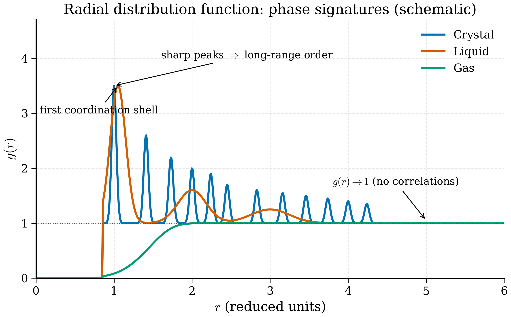

# 7.6 Analysing Trajectories

<figure markdown>
{ width="700" }
<figcaption>Figure 7.6.1. Radial distribution function \(g(r)\) for the three phases. Sharp, persistent peaks at well-defined neighbour shells signal a crystal; one or two broad peaks decaying to \(g(r) \to 1\) signal a liquid; a near-featureless approach to 1 signals a gas. (Synthetic curves for illustration.)</figcaption>
</figure>

<figure markdown>
{ width="700" }
<figcaption>Figure 7.6.2. Mean-squared displacement \(\langle r^2(t) \rangle\) versus time. A solid plateaus (bounded vibrations), a liquid is asymptotically linear with slope \(6D\) where \(D\) is the diffusion constant, and a gas has the same form but with a much larger \(D\). (Synthetic curves for illustration.)</figcaption>
</figure>

A LAMMPS trajectory is a few megabytes to a few terabytes of $(x, y, z)$ data. The physics is not in the data; it is in the time- and ensemble-averages you compute from it. This section covers the standard analyses: mean squared displacement (transport), radial distribution function (structure), velocity autocorrelation function (vibrations), and structure factor (the same structure, in reciprocal space). We code MSD and $g(r)$ from scratch with NumPy, then compare against MDAnalysis as a sanity check.

## Mean squared displacement

The MSD of a single atom is the time-averaged squared distance from its initial position:

$$
\mathrm{MSD}(t) = \langle |\mathbf{r}(t) - \mathbf{r}(0)|^2 \rangle,
\tag{7.51}
$$

where the average is over starting times $t_0$ and over atoms of the relevant species. For a free Brownian particle in $d$ dimensions the MSD grows as $2 d D t$:

$$
\mathrm{MSD}(t) = 6 D t \qquad (d = 3),
\tag{7.52}
$$

so the **diffusion coefficient** is

$$
D = \lim_{t \to \infty} \frac{\mathrm{MSD}(t)}{6 t}.
\tag{7.53}
$$

This is the **Einstein relation**. It is the standard way to extract $D$ from an MD trajectory.

Two practical considerations:

1. **Use unwrapped coordinates** (see §7.2). Wrapped MSD saturates at $L^2/4$, garbage.
2. **Use a time-origin average.** A naive evaluation of (7.51) uses only $\mathbf{r}(0)$ as the reference; averaging over many starting times reduces variance dramatically. For a trajectory of length $T$, the time-origin-averaged MSD at lag $\tau$ is

   $$
   \mathrm{MSD}(\tau) = \frac{1}{T - \tau} \int_0^{T - \tau} |\mathbf{r}(t + \tau) - \mathbf{r}(t)|^2\, dt.
   \tag{7.54}
   $$

A NumPy implementation, operating on an `(n_frames, n_atoms, 3)` array of unwrapped positions:

```python
"""Mean squared displacement from a trajectory.

Time-origin-averaged Einstein-relation MSD.
"""
from __future__ import annotations
import numpy as np


def msd(positions: np.ndarray) -> np.ndarray:
    """Compute the time-origin-averaged MSD of a trajectory.

    Parameters
    ----------
    positions : (n_frames, n_atoms, 3) array of unwrapped positions.

    Returns
    -------
    (n_frames,) array of MSD values at each lag in frames.
    """
    n_frames, n_atoms, _ = positions.shape
    msd_out = np.zeros(n_frames, dtype=np.float64)
    for tau in range(n_frames):
        diffs = positions[tau:] - positions[:n_frames - tau]
        msd_out[tau] = np.mean(np.sum(diffs ** 2, axis=-1))
    return msd_out
```

This is $O(N_\mathrm{frames}^2 N_\mathrm{atoms})$ — fine for $10^4$ frames, slow for $10^6$. A FFT-based version (Welford's trick or the auto-correlation theorem) reduces it to $O(N_\mathrm{frames} \log N_\mathrm{frames} \cdot N_\mathrm{atoms})$ and is what MDAnalysis and `tidynamics` use internally.

Extracting $D$ from the resulting MSD curve: plot $\mathrm{MSD}(t)$ vs $t$, identify the linear regime (typically excluding the first picosecond, where ballistic motion gives MSD $\propto t^2$, and the last few percent of the trajectory, where statistics are poor), and fit a straight line. The slope divided by 6 is $D$.

```python
def diffusion_coefficient(t: np.ndarray, msd_t: np.ndarray,
                          fit_range: tuple[float, float]) -> float:
    """Linear fit to MSD in a chosen time range.

    Parameters
    ----------
    t, msd_t : time array and MSD array, same length.
    fit_range : (t_min, t_max) for the linear fit, in same units as t.

    Returns
    -------
    Diffusion coefficient D = slope / 6.
    """
    mask = (t >= fit_range[0]) & (t <= fit_range[1])
    slope, _intercept = np.polyfit(t[mask], msd_t[mask], 1)
    return slope / 6.0
```

For liquid argon at 100 K with the LJ parameters of §7.5, the expected diffusion coefficient is around $2 \times 10^{-9}$ m$^2$/s. In LAMMPS `metal` units (Å$^2$/ps), $D = 2 \times 10^{-9}\,\mathrm{m}^2/\mathrm{s} = 0.02$ Å$^2$/ps. Verify against this; an order-of-magnitude discrepancy points to wrapped coordinates or a thermostat bug.

## Radial distribution function

The radial distribution function $g(r)$ measures the conditional probability of finding another atom at distance $r$ from a reference atom, normalised by what would be expected in an ideal gas at the same density:

$$
g(r) = \frac{V}{N(N-1)} \left\langle \sum_{i \ne j} \delta(r - r_{ij}) \right\rangle\, \frac{1}{4\pi r^2}.
\tag{7.55}
$$

In a perfect crystal $g(r)$ is a series of sharp delta functions at the discrete neighbour distances. In a liquid the first peak is broad and rounded — typically near $r/\sigma \approx 1$ for LJ — with smaller, broader peaks at successive shells that decay to $g(r) \to 1$ as $r \to \infty$. In a dilute gas $g(r) \approx 1$ everywhere except a small dip below 1 inside the contact distance.

Practical computation: bin the pair distances over a trajectory and normalise by the shell volume.

```python
def rdf(positions: np.ndarray, box: np.ndarray,
        r_max: float, n_bins: int = 200) -> tuple[np.ndarray, np.ndarray]:
    """Radial distribution function from a trajectory.

    Parameters
    ----------
    positions : (n_frames, n_atoms, 3), wrapped or unwrapped.
    box : (3,) orthorhombic box dimensions, assumed constant.
    r_max : maximum distance; must be < min(box) / 2.
    n_bins : number of histogram bins.

    Returns
    -------
    r : (n_bins,) bin centres.
    g : (n_bins,) radial distribution function.
    """
    n_frames, n_atoms, _ = positions.shape
    rho = n_atoms / np.prod(box)            # number density
    dr = r_max / n_bins
    hist = np.zeros(n_bins, dtype=np.int64)

    for frame in positions:
        for i in range(n_atoms - 1):
            dvec = frame[i + 1:] - frame[i]            # broadcast
            dvec -= box * np.round(dvec / box)          # min image
            d = np.linalg.norm(dvec, axis=-1)
            d = d[d < r_max]
            idx = (d / dr).astype(np.int64)
            np.add.at(hist, idx, 1)

    # Normalisation: shell volume 4πr^2 dr times density times pairs
    r = (np.arange(n_bins) + 0.5) * dr
    shell_vol = 4 * np.pi * r ** 2 * dr
    norm = shell_vol * rho * n_atoms * n_frames / 2.0   # /2 for i<j pairs counted once
    g = hist / norm
    return r, g
```

A few subtleties:

- We loop over $i$ and consider only $j > i$ to count pairs once, then divide by 2 in the normalisation. Equivalently, you could loop over all $i \ne j$ and divide by $N \cdot N_\mathrm{frames}$.
- $r_\mathrm{max}$ must be less than half the smallest box dimension; otherwise atoms within $r_\mathrm{max}$ in two images appear, double-counting.
- For binary systems, you compute three RDFs: $g_{AA}$, $g_{AB}$, $g_{BB}$. The normalisation prefactor changes accordingly: $\rho_B$ for the AB pair sums.

The first peak position of $g(r)$ in a liquid is the typical nearest-neighbour distance; the peak height is a coordination-shell signature ($\sim 3$ for liquid argon, $\sim 2.5$ for water O-O). The integral up to the first minimum gives the coordination number,

$$
n_1 = 4\pi \rho \int_0^{r_\mathrm{min}} g(r)\, r^2\, dr,
\tag{7.56}
$$

which for liquid Ar is about 11 (compared to 12 in the fcc crystal).

## Velocity autocorrelation function and VDOS

The **velocity autocorrelation function** (VACF),

$$
C_{vv}(t) = \frac{\langle \mathbf{v}(0)\cdot \mathbf{v}(t)\rangle}{\langle |\mathbf{v}(0)|^2\rangle},
\tag{7.57}
$$

measures how strongly an atom's velocity at time $t$ correlates with its velocity at $t = 0$. For a free particle $C_{vv}(t) = 1$ always; for an oscillator $C_{vv}(t) = \cos(\omega t)$; for a damped oscillator, a decaying cosine; for a liquid, a positive peak at zero followed by a negative dip (caging by neighbours) and decay.

The Fourier transform of $C_{vv}$ is the **vibrational density of states** (VDOS):

$$
\mathrm{VDOS}(\omega) = \int_{-\infty}^\infty C_{vv}(t)\, e^{-i\omega t}\, dt.
\tag{7.58}
$$

For a harmonic crystal, VDOS reduces to the phonon density of states; peaks correspond to optical branches, the low-frequency $\omega^2$ behaviour to acoustic phonons. For a liquid, the spectrum is broadened — there are no propagating modes — but the position of dominant features still reflects the underlying short-range bonding.

Implementation parallels MSD: a time-origin-averaged correlation, then FFT.

```python
def vacf_and_vdos(
    velocities: np.ndarray, dt: float
) -> tuple[np.ndarray, np.ndarray, np.ndarray]:
    """Velocity autocorrelation and vibrational DOS.

    Parameters
    ----------
    velocities : (n_frames, n_atoms, 3).
    dt : time step between frames.

    Returns
    -------
    t, C(t), VDOS(omega)
    """
    n_frames, n_atoms, _ = velocities.shape
    v_flat = velocities.reshape(n_frames, -1)           # (T, 3N)
    # Use FFT-based autocorrelation
    F = np.fft.rfft(v_flat, axis=0, n=2 * n_frames)
    acf = np.fft.irfft(F * np.conj(F), axis=0)[:n_frames]
    acf = acf.sum(axis=1)
    norm = (n_frames - np.arange(n_frames)) * v_flat.shape[1]
    acf = acf / norm
    acf /= acf[0]
    t = np.arange(n_frames) * dt
    # VDOS by FFT
    vdos = np.abs(np.fft.rfft(acf))
    omega = 2 * np.pi * np.fft.rfftfreq(n_frames, d=dt)
    return t, acf, vdos
```

## Structure factor

The static structure factor $S(q)$ is the Fourier transform of the radial distribution function:

$$
S(q) = 1 + \rho \int [g(r) - 1]\, e^{i\mathbf{q}\cdot \mathbf{r}}\, d^3 r,
\tag{7.59}
$$

or equivalently the squared magnitude of the density Fourier component,

$$
S(\mathbf{q}) = \frac{1}{N}\left\langle \left|\sum_i e^{i\mathbf{q}\cdot \mathbf{r}_i}\right|^2 \right\rangle.
\tag{7.60}
$$

$S(q)$ is what X-ray scattering, neutron scattering, and total-scattering experiments directly measure. Comparing simulation $S(q)$ to experimental $S(q)$ is the gold-standard validation of a force field for liquids and amorphous solids.

For a crystal, $S(q)$ shows sharp Bragg peaks at reciprocal lattice vectors. For a liquid, broad peaks; the first peak position $q_1 \approx 2\pi/r_1$ where $r_1$ is the first $g(r)$ maximum.

## ASE Trajectory and MDAnalysis

The reference analyses above are fine for small trajectories. For production work, two libraries do this better:

**ASE** reads LAMMPS dump files and many other formats:

```python
from ase.io import read
traj = read("argon.lammpstrj", index=":")       # list of Atoms
positions = np.array([a.get_positions() for a in traj])
box = np.array(traj[0].cell.lengths())
```

**MDAnalysis** is a more capable framework specifically for trajectory analysis:

```python
import MDAnalysis as mda
from MDAnalysis.analysis import rdf, msd

u = mda.Universe("argon.lammpstrj", topology_format="LAMMPSDUMP",
                 format="LAMMPSDUMP")

# RDF
g_calc = rdf.InterRDF(u.atoms, u.atoms, nbins=200, range=(0.5, 10.0))
g_calc.run()
r = g_calc.results.bins
g = g_calc.results.rdf

# MSD with FFT
msd_calc = msd.EinsteinMSD(u, select="all", msd_type="xyz", fft=True)
msd_calc.run()
times = msd_calc.times
msd_t = msd_calc.results.timeseries
```

MDAnalysis handles wrapping, unwrapping, image flags, mixed-species selections, FFT-based autocorrelations, and all the bookkeeping that becomes tedious in pure NumPy for large trajectories. For anything beyond the simplest analyses, prefer it.

That said, knowing how the algorithms work — what (7.51), (7.55), (7.57) really mean as estimators — is essential. The libraries are fast at the wrong analysis just as cheerfully as at the right one.

!!! tip "Sanity-check your analysis on a known system"
    A 10 ps trajectory of an ideal gas at temperature $T$ should give $D = \infty$ (diverging MSD), $g(r) = 1$ for all $r > 0$, and $C_{vv}(t) = \delta_{t,0}$ in the free-particle limit. Running your analysis pipeline on such a synthetic trajectory catches index errors and normalisation bugs before they corrupt research results.

## What we have

We can now run an MD simulation and extract from it the structural ($g(r)$, $S(q)$), dynamical (MSD, $D$, VACF), and thermodynamic (pressure, energy, temperature) observables that connect simulation to experiment. This is enough to complete a typical materials-science MD study end-to-end.

The next chapter ([Chapter 8](../ch08-statmech/index.md)) tightens the statistical-mechanical underpinnings: which ensemble are we actually sampling, how do we compute free energies, and how do we extract transport coefficients more carefully via Green-Kubo. Chapters 9–11 then return to force fields and replace the classical models of §7.4 with machine-learning potentials trained on DFT.

The exercises ([§7.7](exercises.md)) practise the integrator, the analyses, and the LAMMPS workflow.
