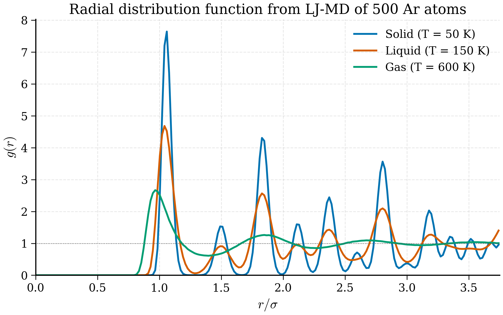
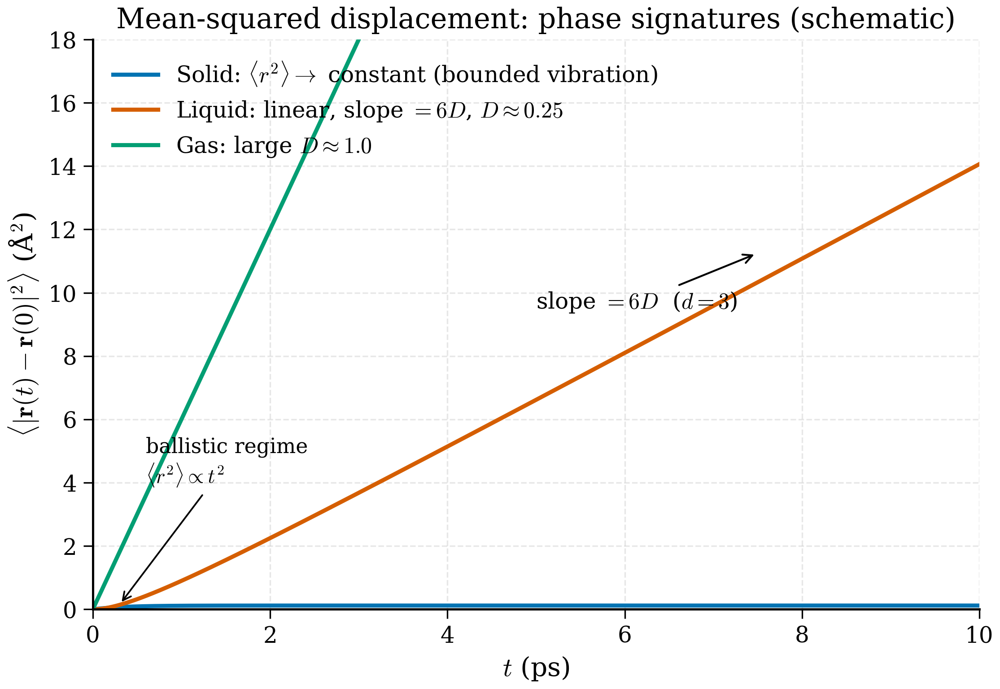

# 7.6 Analysing Trajectories

!!! tip "Why this section exists"
    Running an MD simulation generates terabytes of position data. The physics is *not* in the raw data; it is in time- and ensemble-averages computed from it. A trajectory file is a sequence of snapshots; an *observable* is what you compute by integrating or correlating over the sequence. Every connection between simulation and experiment goes through this layer.
    
    The picture: you have a movie of atoms wiggling. You want to extract numbers — the diffusion coefficient, the radial distribution function, the phonon spectrum — that an experimentalist can measure. Each of these is a specific functional of the trajectory. This section spells out the functionals and their estimators.

**Definition 7.6.1 (Trajectory).** A *trajectory* is a sequence $\{(\mathbf{r}^n_i,\mathbf{v}^n_i)\}_{n=0}^{N_t-1}$ for $i=1,\ldots,N$ atoms, sampled at times $t_n = n\Delta t_\mathrm{save}$ with frame interval $\Delta t_\mathrm{save}$ a multiple of the MD timestep.

<figure markdown>
{ width="700" }
<figcaption>Figure 7.6.1. Radial distribution function \(g(r)\) for the three phases. Sharp, persistent peaks at well-defined neighbour shells signal a crystal; one or two broad peaks decaying to \(g(r) \to 1\) signal a liquid; a near-featureless approach to 1 signals a gas. Computed from a real LJ-MD simulation of 500 argon atoms (\(\sigma = 3.405\) Å, \(\varepsilon/k_B = 119.8\) K) at three temperatures (50 K, 150 K, 600 K) via velocity-Verlet integration with Berendsen-style equilibration — see <code>scripts/figures/fig_rdf_real.py</code>. A simpler analytic-curve illustration is in <code>scripts/figures/fig_rdf_phases.py</code>.</figcaption>
</figure>

<figure markdown>
{ width="700" }
<figcaption>Figure 7.6.2. Mean-squared displacement \(\langle r^2(t) \rangle\) versus time. A solid plateaus (bounded vibrations), a liquid is asymptotically linear with slope \(6D\) where \(D\) is the diffusion constant, and a gas has the same form but with a much larger \(D\). (Synthetic curves for illustration.)</figcaption>
</figure>

A LAMMPS trajectory is a few megabytes to a few terabytes of $(x, y, z)$ data. The physics is not in the data; it is in the time- and ensemble-averages you compute from it. This section covers the standard analyses: mean squared displacement (transport), radial distribution function (structure), velocity autocorrelation function (vibrations), and structure factor (the same structure, in reciprocal space). We code MSD and $g(r)$ from scratch with NumPy, then compare against MDAnalysis as a sanity check.

## Mean squared displacement

!!! abstract "Key idea (Einstein relation)"
    A diffusing atom's mean-squared displacement grows linearly with time, with slope $2dD$ where $d$ is the dimensionality and $D$ the diffusion coefficient. The Einstein relation $D = \mathrm{MSD}(t)/(2dt)$ is the practical way to extract $D$ from an MD trajectory. The linear regime starts after the ballistic regime (typically picoseconds) and ends before statistical noise dominates (typically when $t$ approaches a fraction of the simulation length).

The MSD of a single atom is the time-averaged squared distance from its initial position:

$$
\mathrm{MSD}(t) = \langle |\mathbf{r}(t) - \mathbf{r}(0)|^2 \rangle,
\tag{7.51}
$$

where the average is over starting times $t_0$ and over atoms of the relevant species. For a free Brownian particle in $d$ dimensions the MSD grows as $2 d D t$:

$$
\mathrm{MSD}(t) = 6 D t \qquad (d = 3),
\tag{7.52}
$$

so the **diffusion coefficient** is

$$
D = \lim_{t \to \infty} \frac{\mathrm{MSD}(t)}{6 t}.
\tag{7.53}
$$

This is the **Einstein relation**.

!!! note "Deriving Einstein's relation"
    Take the Langevin equation in the overdamped limit (large $\gamma$, where momentum relaxes fast and only position diffuses): $\gamma m\dot{\mathbf{r}} = \boldsymbol{\eta}(t)$ with $\langle\eta_\alpha(t)\eta_\beta(t')\rangle = 2m\gamma k_BT\,\delta_{\alpha\beta}\delta(t-t')$. Integrating from 0 to $t$:
    $$\mathbf{r}(t) - \mathbf{r}(0) = \frac{1}{\gamma m}\int_0^t \boldsymbol{\eta}(t')\,dt'.$$
    Squaring and ensemble-averaging:
    $$\langle|\mathbf{r}(t)-\mathbf{r}(0)|^2\rangle = \frac{1}{\gamma^2 m^2}\int_0^t\int_0^t \langle\boldsymbol{\eta}(t')\cdot\boldsymbol{\eta}(t'')\rangle\,dt'\,dt'' = \frac{1}{\gamma^2 m^2}\cdot d\cdot 2m\gamma k_BT\cdot t = \frac{2d k_BT}{m\gamma}\,t.$$
    Comparing to $\mathrm{MSD}(t) = 2dD t$ gives $D = k_BT/(m\gamma)$, the **Stokes-Einstein form**. In an MD simulation without an explicit friction, $D$ is determined by the *effective* friction from interatomic collisions; the relation $\mathrm{MSD} = 2dD t$ still holds in the long-time limit, and $D$ is what you extract from the slope.
    
    The factor $d$ (dimensionality) is important: a Cartesian-x-only MSD grows as $2Dt$, a 3D MSD as $6Dt$, a 2D-slab MSD as $4Dt$. Be careful which one your analysis function returns. It is the standard way to extract $D$ from an MD trajectory.

Two practical considerations:

1. **Use unwrapped coordinates** (see §7.2). Wrapped MSD saturates at $L^2/4$, garbage.
2. **Use a time-origin average.** A naive evaluation of (7.51) uses only $\mathbf{r}(0)$ as the reference; averaging over many starting times reduces variance dramatically. For a trajectory of length $T$, the time-origin-averaged MSD at lag $\tau$ is

   $$
   \mathrm{MSD}(\tau) = \frac{1}{T - \tau} \int_0^{T - \tau} |\mathbf{r}(t + \tau) - \mathbf{r}(t)|^2\, dt.
   \tag{7.54}
   $$

A NumPy implementation, operating on an `(n_frames, n_atoms, 3)` array of unwrapped positions:

```python
"""Mean squared displacement from a trajectory.

Time-origin-averaged Einstein-relation MSD.
"""
from __future__ import annotations
import numpy as np


def msd(positions: np.ndarray) -> np.ndarray:
    """Compute the time-origin-averaged MSD of a trajectory.

    Parameters
    ----------
    positions : (n_frames, n_atoms, 3) array of unwrapped positions.

    Returns
    -------
    (n_frames,) array of MSD values at each lag in frames.
    """
    n_frames, n_atoms, _ = positions.shape
    msd_out = np.zeros(n_frames, dtype=np.float64)
    for tau in range(n_frames):
        diffs = positions[tau:] - positions[:n_frames - tau]
        msd_out[tau] = np.mean(np.sum(diffs ** 2, axis=-1))
    return msd_out
```

This is $O(N_\mathrm{frames}^2 N_\mathrm{atoms})$ — fine for $10^4$ frames, slow for $10^6$. A FFT-based version (Welford's trick or the auto-correlation theorem) reduces it to $O(N_\mathrm{frames} \log N_\mathrm{frames} \cdot N_\mathrm{atoms})$ and is what MDAnalysis and `tidynamics` use internally.

Extracting $D$ from the resulting MSD curve: plot $\mathrm{MSD}(t)$ vs $t$, identify the linear regime (typically excluding the first picosecond, where ballistic motion gives MSD $\propto t^2$, and the last few percent of the trajectory, where statistics are poor), and fit a straight line. The slope divided by 6 is $D$.

```python
def diffusion_coefficient(t: np.ndarray, msd_t: np.ndarray,
                          fit_range: tuple[float, float]) -> float:
    """Linear fit to MSD in a chosen time range.

    Parameters
    ----------
    t, msd_t : time array and MSD array, same length.
    fit_range : (t_min, t_max) for the linear fit, in same units as t.

    Returns
    -------
    Diffusion coefficient D = slope / 6.
    """
    mask = (t >= fit_range[0]) & (t <= fit_range[1])
    slope, _intercept = np.polyfit(t[mask], msd_t[mask], 1)
    return slope / 6.0
```

For liquid argon at 100 K with the LJ parameters of §7.5, the expected diffusion coefficient is around $2 \times 10^{-9}$ m$^2$/s. In LAMMPS `metal` units (Å$^2$/ps), $D = 2 \times 10^{-9}\,\mathrm{m}^2/\mathrm{s} = 0.02$ Å$^2$/ps. Verify against this; an order-of-magnitude discrepancy points to wrapped coordinates or a thermostat bug.

**Example 7.6.2 (Diffusion of liquid argon at 100 K).**
*Problem.* From a 200 ps NVT MD trajectory of 4000 LJ-Ar atoms at 100 K, compute $D$.

*Solution.* (i) Unwrap coordinates using image flags. (ii) Compute time-origin-averaged MSD via (7.54). (iii) Identify the linear regime — typically 2-100 ps for this system. (iv) Linear-fit `polyfit(t, msd, 1)`; divide slope by 6.

Expected outcome: $D \approx 0.02$ Å$^2$/ps $= 2\times 10^{-9}$ m$^2$/s, within 10% of the experimental value at the same temperature.

*Discussion.* The ballistic regime ($t<1$ ps) has MSD $\propto t^2$ — exclude it from the fit. The very late regime (last 10% of the trajectory) has poor statistics (few independent time origins) — exclude it too. The intermediate "diffusive" regime is where Einstein's relation holds.

## Radial distribution function

!!! abstract "Key idea (Radial distribution function)"
    The RDF $g(r)$ counts pair distances normalised to the ideal-gas expectation. Crystal: sharp peaks at neighbour-shell distances. Liquid: broad first peak, smaller secondary peaks decaying to 1. Gas: nearly flat at 1 with a dip below contact. $g(r)$ is the most direct probe of local structure and connects to X-ray and neutron scattering through Fourier transform.

The radial distribution function $g(r)$ measures the conditional probability of finding another atom at distance $r$ from a reference atom, normalised by what would be expected in an ideal gas at the same density:

$$
g(r) = \frac{V}{N(N-1)} \left\langle \sum_{i \ne j} \delta(r - r_{ij}) \right\rangle\, \frac{1}{4\pi r^2}.
\tag{7.55}
$$

!!! note "Deriving the practical histogram form"
    To turn (7.55) into an algorithm, replace the continuous $\delta(r-r_{ij})$ by a histogram bin of width $\Delta r$. The number of pairs falling into the spherical shell of inner radius $r$ and outer radius $r+\Delta r$ is
    $$n_\mathrm{shell}(r) = \frac{1}{N_\mathrm{frames}}\sum_\mathrm{frames}\sum_{i<j}\mathbb{1}[r \le r_{ij} < r+\Delta r],$$
    where the indicator function counts pairs in the shell. The expected number for an ideal gas at density $\rho = N/V$ would be
    $$n_\mathrm{ideal}(r) = N\cdot\rho\cdot 4\pi r^2\,\Delta r / 2,$$
    where the factor of $N\rho$ is the pair count, the $4\pi r^2\,\Delta r$ is the shell volume, and the $1/2$ avoids double-counting. The radial distribution function is the ratio:
    $$g(r) = \frac{n_\mathrm{shell}(r)}{n_\mathrm{ideal}(r)} = \frac{2\,n_\mathrm{shell}(r)}{N\,\rho\,4\pi r^2\,\Delta r}.$$
    This is exactly what the `rdf` function below computes, with $n_\mathrm{shell}(r)$ accumulated as `hist[idx]` and the normalisation
    $$\mathrm{norm}(r) = \rho\,4\pi r^2\,\Delta r\,\frac{N}{2}\cdot N_\mathrm{frames}.$$
    Forgetting the $4\pi r^2$ shell-volume normalisation is the most common bug in homegrown $g(r)$ implementations — the resulting curve looks vaguely like an RDF but with the wrong shape near $r=0$ and a non-converging tail.

In a perfect crystal $g(r)$ is a series of sharp delta functions at the discrete neighbour distances. In a liquid the first peak is broad and rounded — typically near $r/\sigma \approx 1$ for LJ — with smaller, broader peaks at successive shells that decay to $g(r) \to 1$ as $r \to \infty$. In a dilute gas $g(r) \approx 1$ everywhere except a small dip below 1 inside the contact distance.

Practical computation: bin the pair distances over a trajectory and normalise by the shell volume.

```python
def rdf(positions: np.ndarray, box: np.ndarray,
        r_max: float, n_bins: int = 200) -> tuple[np.ndarray, np.ndarray]:
    """Radial distribution function from a trajectory.

    Parameters
    ----------
    positions : (n_frames, n_atoms, 3), wrapped or unwrapped.
    box : (3,) orthorhombic box dimensions, assumed constant.
    r_max : maximum distance; must be < min(box) / 2.
    n_bins : number of histogram bins.

    Returns
    -------
    r : (n_bins,) bin centres.
    g : (n_bins,) radial distribution function.
    """
    n_frames, n_atoms, _ = positions.shape
    rho = n_atoms / np.prod(box)            # number density
    dr = r_max / n_bins
    hist = np.zeros(n_bins, dtype=np.int64)

    for frame in positions:
        for i in range(n_atoms - 1):
            dvec = frame[i + 1:] - frame[i]            # broadcast
            dvec -= box * np.round(dvec / box)          # min image
            d = np.linalg.norm(dvec, axis=-1)
            d = d[d < r_max]
            idx = (d / dr).astype(np.int64)
            np.add.at(hist, idx, 1)

    # Normalisation: shell volume 4πr^2 dr times density times pairs
    r = (np.arange(n_bins) + 0.5) * dr
    shell_vol = 4 * np.pi * r ** 2 * dr
    norm = shell_vol * rho * n_atoms * n_frames / 2.0   # /2 for i<j pairs counted once
    g = hist / norm
    return r, g
```

A few subtleties:

- We loop over $i$ and consider only $j > i$ to count pairs once, then divide by 2 in the normalisation. Equivalently, you could loop over all $i \ne j$ and divide by $N \cdot N_\mathrm{frames}$.
- $r_\mathrm{max}$ must be less than half the smallest box dimension; otherwise atoms within $r_\mathrm{max}$ in two images appear, double-counting.
- For binary systems, you compute three RDFs: $g_{AA}$, $g_{AB}$, $g_{BB}$. The normalisation prefactor changes accordingly: $\rho_B$ for the AB pair sums.

The first peak position of $g(r)$ in a liquid is the typical nearest-neighbour distance; the peak height is a coordination-shell signature ($\sim 3$ for liquid argon, $\sim 2.5$ for water O-O). The integral up to the first minimum gives the coordination number,

$$
n_1 = 4\pi \rho \int_0^{r_\mathrm{min}} g(r)\, r^2\, dr,
\tag{7.56}
$$

which for liquid Ar is about 11 (compared to 12 in the fcc crystal).

## Velocity autocorrelation function and VDOS

The **velocity autocorrelation function** (VACF),

$$
C_{vv}(t) = \frac{\langle \mathbf{v}(0)\cdot \mathbf{v}(t)\rangle}{\langle |\mathbf{v}(0)|^2\rangle},
\tag{7.57}
$$

measures how strongly an atom's velocity at time $t$ correlates with its velocity at $t = 0$. For a free particle $C_{vv}(t) = 1$ always; for an oscillator $C_{vv}(t) = \cos(\omega t)$; for a damped oscillator, a decaying cosine; for a liquid, a positive peak at zero followed by a negative dip (caging by neighbours) and decay.

The Fourier transform of $C_{vv}$ is the **vibrational density of states** (VDOS):

$$
\mathrm{VDOS}(\omega) = \int_{-\infty}^\infty C_{vv}(t)\, e^{-i\omega t}\, dt.
\tag{7.58}
$$

!!! note "Why FFT of VACF gives VDOS — Wiener-Khinchin"
    The Wiener-Khinchin theorem states that the power spectral density of a stationary stochastic process equals the Fourier transform of its autocorrelation function. For atomic velocities:
    $$|\tilde{\mathbf{v}}(\omega)|^2 = \int_{-\infty}^\infty C_{vv}(t)\,e^{-i\omega t}\,dt,$$
    where $\tilde{\mathbf{v}}(\omega)$ is the Fourier transform of $\mathbf{v}(t)$ over a long trajectory. The left-hand side is the power spectrum — how much kinetic energy lives at each frequency. The right-hand side is the FFT of the VACF.
    
    For a harmonic crystal, kinetic energy is shared equally between all normal modes (equipartition), so the power spectrum is a sum of delta functions at each phonon frequency, weighted by mode multiplicity. Integrated, this is the phonon density of states. In a real MD simulation the deltas are broadened by the finite simulation time (the energy resolution is $\Delta\omega \sim 2\pi/T_\mathrm{sim}$) and by anharmonicity, but the *positions* of dominant peaks still correspond to phonon branches.
    
    In a liquid, the modes are not propagating but the VDOS still encodes characteristic vibrational frequencies — the low-frequency end gives transport-related modes (related to the diffusion coefficient by $D = \tfrac{1}{3}\int_0^\infty C_{vv}(t)\,dt$, another consequence of Green-Kubo) and the high-frequency end gives the local-cage rattling.

For a harmonic crystal, VDOS reduces to the phonon density of states; peaks correspond to optical branches, the low-frequency $\omega^2$ behaviour to acoustic phonons. For a liquid, the spectrum is broadened — there are no propagating modes — but the position of dominant features still reflects the underlying short-range bonding.

Implementation parallels MSD: a time-origin-averaged correlation, then FFT.

```python
def vacf_and_vdos(
    velocities: np.ndarray, dt: float
) -> tuple[np.ndarray, np.ndarray, np.ndarray]:
    """Velocity autocorrelation and vibrational DOS.

    Parameters
    ----------
    velocities : (n_frames, n_atoms, 3).
    dt : time step between frames.

    Returns
    -------
    t, C(t), VDOS(omega)
    """
    n_frames, n_atoms, _ = velocities.shape
    v_flat = velocities.reshape(n_frames, -1)           # (T, 3N)
    # Use FFT-based autocorrelation
    F = np.fft.rfft(v_flat, axis=0, n=2 * n_frames)
    acf = np.fft.irfft(F * np.conj(F), axis=0)[:n_frames]
    acf = acf.sum(axis=1)
    norm = (n_frames - np.arange(n_frames)) * v_flat.shape[1]
    acf = acf / norm
    acf /= acf[0]
    t = np.arange(n_frames) * dt
    # VDOS by FFT
    vdos = np.abs(np.fft.rfft(acf))
    omega = 2 * np.pi * np.fft.rfftfreq(n_frames, d=dt)
    return t, acf, vdos
```

## Structure factor

The static structure factor $S(q)$ is the Fourier transform of the radial distribution function:

$$
S(q) = 1 + \rho \int [g(r) - 1]\, e^{i\mathbf{q}\cdot \mathbf{r}}\, d^3 r,
\tag{7.59}
$$

or equivalently the squared magnitude of the density Fourier component,

$$
S(\mathbf{q}) = \frac{1}{N}\left\langle \left|\sum_i e^{i\mathbf{q}\cdot \mathbf{r}_i}\right|^2 \right\rangle.
\tag{7.60}
$$

$S(q)$ is what X-ray scattering, neutron scattering, and total-scattering experiments directly measure. Comparing simulation $S(q)$ to experimental $S(q)$ is the gold-standard validation of a force field for liquids and amorphous solids.

For a crystal, $S(q)$ shows sharp Bragg peaks at reciprocal lattice vectors. For a liquid, broad peaks; the first peak position $q_1 \approx 2\pi/r_1$ where $r_1$ is the first $g(r)$ maximum.

#### Computing $S(q)$ from a trajectory

Two practical routes. **Direct (7.60):**
```python
def structure_factor_direct(positions: np.ndarray, q_vectors: np.ndarray) -> np.ndarray:
    """S(q) by direct evaluation of |sum exp(i q·r)|^2 / N."""
    n_frames, n_atoms, _ = positions.shape
    n_q = q_vectors.shape[0]
    S = np.zeros(n_q, dtype=np.float64)
    for frame in positions:
        phases = q_vectors @ frame.T            # (n_q, n_atoms)
        rho_q = np.exp(1j * phases).sum(axis=1) # (n_q,)
        S += np.abs(rho_q) ** 2 / n_atoms
    return S / n_frames
```
The cost is $O(N_\mathrm{frames}\,N_\mathrm{atoms}\,N_q)$. Choose $\mathbf{q}$-vectors on a spherical shell at a series of magnitudes to get $S(|q|)$.

**Indirect via $g(r)$ Fourier transform:**
$$S(q) = 1 + 4\pi\rho\,\int_0^\infty [g(r)-1]\,\frac{\sin(qr)}{qr}\,r^2\,dr.$$
This is the angular-averaged version of (7.59); it converts your already-computed $g(r)$ to $S(q)$ with one integral per $q$.

Both routes should agree to within statistics. Discrepancies often indicate that $g(r)$ was not computed out to a large enough $r_\mathrm{max}$ (truncation introduces ringing in $S(q)$ at high $q$) or that the trajectory is too short to converge the structure factor at long wavelengths.

## Coordination number and bond-orientational order

Beyond the simple $g(r)$ peak count, two derived quantities matter for understanding local structure.

### Coordination number

Given a cutoff $r_c$ chosen as the first minimum of $g(r)$, the coordination number of atom $i$ is
$$Z_i = \sum_{j\ne i} \mathbb{1}[r_{ij} < r_c],$$
and the average coordination $\langle Z\rangle$ characterises the structure. For liquid Ar at 100 K, $\langle Z\rangle \approx 11$; for fcc Ar at 50 K, exactly 12. The *distribution* of $Z_i$ across atoms is sometimes more informative than the mean: a bimodal distribution indicates phase coexistence or local order parameter heterogeneity.

### Steinhardt $Q_l$ parameters

For distinguishing crystal structures (fcc vs bcc vs hcp vs liquid), Steinhardt-Nelson-Ronchetti bond-orientational order parameters are the standard. Define the local bond order for atom $i$:
$$Q_{lm}(i) = \frac{1}{Z_i}\sum_{j\in\mathrm{neighbours}(i)} Y_{lm}(\theta_{ij}, \phi_{ij}),$$
where $Y_{lm}$ are spherical harmonics and $(\theta_{ij}, \phi_{ij})$ are the polar angles of the bond vector. The rotationally-invariant magnitude
$$Q_l(i) = \sqrt{\frac{4\pi}{2l+1}\sum_{m=-l}^l |Q_{lm}(i)|^2}$$
takes characteristic values for ideal crystals: $Q_6 = 0.575$ for fcc, $Q_6 = 0.628$ for bcc, $Q_6 \approx 0.485$ for hcp, $Q_6 \approx 0.3$ for liquid. Plotting $Q_4$ vs $Q_6$ for every atom gives a 2D scatter that cleanly separates crystal phases — the Steinhardt parameter is the work-horse order parameter for nucleation studies.

## Green-Kubo transport coefficients

The Einstein relation gives diffusion via $\mathrm{MSD}\to 6Dt$. The same idea applies to any transport coefficient through a **Green-Kubo formula**: the integral of an autocorrelation function gives a transport coefficient. The most useful are:

**Diffusion (Green-Kubo form)**:
$$D = \frac{1}{3}\int_0^\infty C_{vv}(t)\,dt,$$
which can be computed from the VACF and gives the same answer as the Einstein relation in principle, often faster in practice for short trajectories.

**Shear viscosity**:
$$\eta = \frac{V}{k_BT}\int_0^\infty \langle \sigma_{xy}(0)\sigma_{xy}(t)\rangle\,dt,$$
where $\sigma_{xy}$ is the off-diagonal stress tensor. LAMMPS' `compute pressure` gives the instantaneous stress; the Green-Kubo integral converges slowly (long tails from collective modes) and typically needs nanosecond trajectories with high sampling rate.

**Thermal conductivity**:
$$\kappa = \frac{V}{k_BT^2}\int_0^\infty \langle \mathbf{J}_E(0)\cdot\mathbf{J}_E(t)\rangle\,dt,$$
with $\mathbf{J}_E$ the energy current. Hardest to converge; nanoseconds at fine sampling.

The trade-off with Green-Kubo is that the integral has a long tail: cutting it off too early biases the coefficient. A common practical rule is to integrate until the autocorrelation has decayed to ~1% of its initial value, but for hydrodynamically slow modes this may require integrating much further. Non-equilibrium MD (NEMD), where you apply a fictitious driving force and measure the steady-state response, is often more efficient for shear viscosity in particular; LAMMPS' `fix viscosity` and `fix nvt/sllod` implement this.

## ASE Trajectory and MDAnalysis

The reference analyses above are fine for small trajectories. For production work, two libraries do this better:

**ASE** reads LAMMPS dump files and many other formats:

```python
from ase.io import read
traj = read("argon.lammpstrj", index=":")       # list of Atoms
positions = np.array([a.get_positions() for a in traj])
box = np.array(traj[0].cell.lengths())
```

**MDAnalysis** is a more capable framework specifically for trajectory analysis:

```python
import MDAnalysis as mda
from MDAnalysis.analysis import rdf, msd

u = mda.Universe("argon.lammpstrj", topology_format="LAMMPSDUMP",
                 format="LAMMPSDUMP")

# RDF
g_calc = rdf.InterRDF(u.atoms, u.atoms, nbins=200, range=(0.5, 10.0))
g_calc.run()
r = g_calc.results.bins
g = g_calc.results.rdf

# MSD with FFT
msd_calc = msd.EinsteinMSD(u, select="all", msd_type="xyz", fft=True)
msd_calc.run()
times = msd_calc.times
msd_t = msd_calc.results.timeseries
```

MDAnalysis handles wrapping, unwrapping, image flags, mixed-species selections, FFT-based autocorrelations, and all the bookkeeping that becomes tedious in pure NumPy for large trajectories. For anything beyond the simplest analyses, prefer it.

That said, knowing how the algorithms work — what (7.51), (7.55), (7.57) really mean as estimators — is essential. The libraries are fast at the wrong analysis just as cheerfully as at the right one.

!!! tip "Sanity-check your analysis on a known system"
    A 10 ps trajectory of an ideal gas at temperature $T$ should give $D = \infty$ (diverging MSD), $g(r) = 1$ for all $r > 0$, and $C_{vv}(t) = \delta_{t,0}$ in the free-particle limit. Running your analysis pipeline on such a synthetic trajectory catches index errors and normalisation bugs before they corrupt research results.

## Error estimates: block averaging

Every quantity you compute from an MD trajectory comes with statistical error. Ignoring it is the single most common reason for mismatch between simulation and experiment that is *not* a force-field problem.

Naive standard error of the mean assumes independent samples: $\sigma_\mu = \sigma/\sqrt{N}$. MD samples are correlated — successive frames are dynamically related — so this *underestimates* the error by a factor proportional to the autocorrelation time.

**Block averaging** is the standard cure. Partition the trajectory into $B$ contiguous blocks; compute the mean of each block; the variance of these block means, divided by $B-1$, is an unbiased estimator of the error of the overall mean. As $B$ decreases (blocks get longer), the block means become more nearly independent and the error estimate converges to its asymptotic value. Plotting the estimated error vs block size and looking for a plateau is the diagnostic.

```python
def block_average(samples: np.ndarray, n_blocks: int) -> tuple[float, float]:
    """Block-averaged mean and standard error."""
    block_size = len(samples) // n_blocks
    block_means = np.array([samples[i*block_size:(i+1)*block_size].mean()
                             for i in range(n_blocks)])
    mean = block_means.mean()
    sem = block_means.std(ddof=1) / np.sqrt(n_blocks)
    return mean, sem
```

A useful exercise: compute the temperature of an NVE simulation and check the error bar. For $N = 1000$ atoms over 100 ps with $\Delta t = 1$ fs, you have $10^5$ frames. The intrinsic temperature fluctuation is $T\sqrt{2/(3N)} \approx 2.6$ K at 100 K. The autocorrelation time of $T_\mathrm{kin}$ is the inverse of the lowest phonon frequency, $\sim 1$ ps, so the *effective* number of independent samples is 100. The standard error of the *mean* $T$ is therefore $2.6/\sqrt{100} = 0.26$ K — not 0.008 K as naive $\sqrt{N}$ would suggest. Quoting $T$ to 0.01 K from a 100 ps simulation is overconfident by a factor of 30.

### Section summary

The four standard MD analyses, with what each measures and the experiment it connects to:

1. **MSD → diffusion coefficient $D$** via Einstein's relation $\mathrm{MSD} = 2dD\,t$. Probes long-time transport. Connects to NMR pulsed-field-gradient experiments, tracer diffusion measurements.
2. **RDF $g(r)$ → local structure**. Peak positions are typical neighbour distances; integrated first peak is coordination number. Connects to X-ray and neutron diffraction via $S(q)$.
3. **VACF $C_{vv}(t) → $ VDOS via Fourier transform**. For crystals, the phonon density of states; for liquids, broadened modes. Connects to inelastic neutron scattering, IR spectroscopy.
4. **Structure factor $S(q)$ → scattering experiments directly**. Bragg peaks for crystals, broad features for liquids. The most direct simulation-experiment comparison.

All four are typically implemented in MDAnalysis, ASE, or `tidynamics`; the implementations here are pedagogical — to know what the libraries are computing, run your own against theirs once.

Error bars from block averaging are non-negotiable. The factor $\sqrt{\tau_\mathrm{corr}/T_\mathrm{sim}}$ in the effective sample size is what separates a trustworthy result from a hopeful one.

## What we have

We can now run an MD simulation and extract from it the structural ($g(r)$, $S(q)$), dynamical (MSD, $D$, VACF), and thermodynamic (pressure, energy, temperature) observables that connect simulation to experiment. This is enough to complete a typical materials-science MD study end-to-end.

**Remark 7.6.3 (Trajectory file formats).** LAMMPS' native dump format is text-based and bulky. For production use a binary or compressed format: LAMMPS supports `dump dcd`, `dump xtc`, `dump nc` (NetCDF) — all of these are faster to write, smaller on disk, and readable by MDAnalysis. For ten-nanosecond trajectories of large systems, text-format files can reach hundreds of gigabytes; binary formats compress 10-100×. Switch as soon as you outgrow the example-level workflow.

The next chapter ([Chapter 8](../ch08-statmech/index.md)) tightens the statistical-mechanical underpinnings: which ensemble are we actually sampling, how do we compute free energies, and how do we extract transport coefficients more carefully via Green-Kubo. Chapters 9–11 then return to force fields and replace the classical models of §7.4 with machine-learning potentials trained on DFT.

The exercises ([§7.7](exercises.md)) practise the integrator, the analyses, and the LAMMPS workflow.
