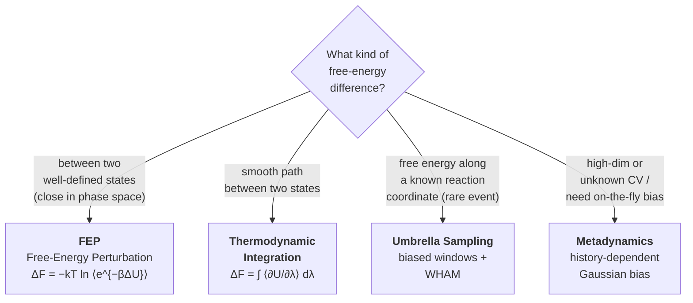

# 8.2 Free Energy Methods


*Decision tree for choosing a free-energy method. Endpoint states, path smoothness, and dimensionality of the collective variable drive the choice between FEP, TI, umbrella sampling, and metadynamics.*

## Why free energies are hard

The expectation value of any function $A(\mathbf{q})$ in the canonical ensemble is

$$
\langle A\rangle = \frac{1}{Z} \int d\mathbf{q}\, A(\mathbf{q})\, e^{-\beta U(\mathbf{q})}.
\tag{8.16}
$$

This is a phase-space integral with an exponentially peaked integrand. MD samples regions where $e^{-\beta U}$ is large in proportion to their weight, so $\langle A\rangle$ converges as $1/\sqrt{N_\mathrm{samples}}$ for $A$ that is reasonably smooth.

Free energies are different. $A = -k_B T \ln Z$ depends on the **value** of $Z$, not just on relative weights:

$$
A = -k_B T \ln \int d\mathbf{q}\, e^{-\beta U(\mathbf{q})}.
\tag{8.17}
$$

To compute $A$ directly we would need to know the integrand's value across all of phase space, including regions that MD never visits because $e^{-\beta U}$ is exponentially small there. This is hopeless — but the **difference** $A_2 - A_1$ between two systems is tractable, because it depends on the **ratio** $Z_2/Z_1$, which we can sample.

This section presents four classical recipes for computing free energy differences from MD: thermodynamic integration (TI), free energy perturbation (FEP), umbrella sampling with WHAM, and metadynamics. Each is the right tool somewhere.

## Why free energies matter

Three flagship applications:

- **Phase stability.** The phase with the lowest Gibbs free energy at $(T, P)$ is the equilibrium phase. To predict whether copper is fcc or hcp at $(T, P)$, compute $G_\mathrm{fcc}$ and $G_\mathrm{hcp}$; the smaller wins. The energy difference alone (zero-temperature) is wrong because it ignores entropy.
- **Reaction and activation barriers.** A catalyst's effectiveness is set by the free energy along the reaction coordinate. Activation free energies $\Delta G^\ddagger$ are the input to transition-state theory and to Arrhenius-rate predictions.
- **Solubility, partitioning, binding.** Drug binding affinities, solubilities, partition coefficients are all free energy differences. Computational drug discovery rests almost entirely on FEP-style calculations.

In each case, what you can extract from MD is a free energy **difference** between two well-defined states.

## Thermodynamic integration

Define a Hamiltonian that interpolates between two endpoints:

$$
H_\lambda(\mathbf{q}, \mathbf{p}) = (1 - \lambda)\, H_0(\mathbf{q}, \mathbf{p}) + \lambda\, H_1(\mathbf{q}, \mathbf{p}), \qquad \lambda \in [0, 1].
\tag{8.18}
$$

(In practice, only the potential is interpolated; the kinetic energy is the same for $H_0$ and $H_1$.) For each $\lambda$, $Z(\lambda) = \int e^{-\beta H_\lambda}$. The free energy difference between endpoints is

$$
\Delta A = A_1 - A_0 = -k_B T \ln \frac{Z_1}{Z_0} = -k_B T \int_0^1 \frac{d \ln Z(\lambda)}{d\lambda} d\lambda.
\tag{8.19}
$$

Differentiate $\ln Z(\lambda)$:

$$
\frac{d \ln Z(\lambda)}{d \lambda} = -\beta\, \frac{\int (\partial H_\lambda/\partial \lambda)\, e^{-\beta H_\lambda}}{\int e^{-\beta H_\lambda}} = -\beta\, \left\langle \frac{\partial H_\lambda}{\partial \lambda}\right\rangle_\lambda.
\tag{8.20}
$$

Substitute:

$$
\boxed{\Delta A = \int_0^1 \left\langle \frac{\partial H_\lambda}{\partial \lambda}\right\rangle_\lambda\, d\lambda.}
\tag{8.21}
$$

This is the **thermodynamic integration** formula. The strategy:

1. Choose a sequence of $\lambda$ values, $\lambda_1 < \lambda_2 < \ldots < \lambda_M$ (often 11 or 21 points equally spaced from 0 to 1).
2. At each $\lambda_k$, run an MD simulation with Hamiltonian $H_{\lambda_k}$, sufficiently long to equilibrate and to estimate $\langle \partial H/\partial \lambda\rangle_{\lambda_k}$ with small uncertainty.
3. Numerically integrate the values of $\langle \partial H/\partial \lambda\rangle$ over $\lambda$ (Simpson's rule or Gauss-Legendre quadrature).

The integrand $\langle \partial H/\partial \lambda\rangle_\lambda$ is just a force-field-style energy gradient; if $H_\lambda = U_0 + \lambda(U_1 - U_0)$, then $\partial H/\partial \lambda = U_1 - U_0$, the energy difference at the current configuration.

TI is robust and well-conditioned when the integrand varies slowly with $\lambda$ — typical case for smooth alchemical transformations between similar molecules. It struggles when the integrand has singularities (e.g., turning on a Lennard-Jones interaction from zero introduces a $\lambda^{-3}$ singularity in $\partial H/\partial \lambda$) which is handled by **soft-core potentials** that regularise the small-$\lambda$ behaviour.

## Free energy perturbation (Zwanzig)

Zwanzig's 1954 identity:

$$
\Delta A = A_1 - A_0 = -k_B T \ln \frac{Z_1}{Z_0} = -k_B T \ln \left\langle e^{-\beta(U_1 - U_0)}\right\rangle_0,
\tag{8.22}
$$

where $\langle \cdot\rangle_0$ is the average **in the ensemble of state 0**. That is, sample with $U_0$, accumulate $e^{-\beta \Delta U}$ at each step, log-average.

The derivation is one line:

$$
\frac{Z_1}{Z_0} = \frac{\int e^{-\beta U_1}}{\int e^{-\beta U_0}} = \frac{\int e^{-\beta(U_1 - U_0)} e^{-\beta U_0}}{\int e^{-\beta U_0}} = \langle e^{-\beta(U_1 - U_0)}\rangle_0.
$$

FEP is conceptually simpler than TI — one simulation, one expectation value — but suffers a severe practical problem: the estimator $e^{-\beta \Delta U}$ has poor statistics when $\Delta U$ is much larger than $k_B T$. The dominant configurations in state 1 may be exponentially rare in the sampled ensemble 0.

**Practical rule.** FEP works well when $|\beta \Delta U|$ is of order 2 or less — i.e., when the two states are similar enough that their canonical distributions overlap substantially. For larger differences, decompose the transformation into a chain of intermediate windows and FEP between adjacent windows (this is the multi-stage variant), which is essentially what TI does.

The Bennett Acceptance Ratio (BAR) and its extension to multiple states (MBAR, Shirts and Chodera) are the modern optimal estimators that improve on naive FEP by combining forward and backward perturbations between windows. They are now standard; `pymbar` is the canonical implementation.

## Umbrella sampling and WHAM

For free energies along a **collective variable** (CV) — a reaction coordinate, an order parameter — neither TI nor FEP is most natural. You want the potential of mean force (PMF)

$$
F(\xi) = -k_B T \ln P(\xi),
\qquad P(\xi) = \frac{1}{Z}\int d\mathbf{q}\, \delta(\xi(\mathbf{q}) - \xi)\, e^{-\beta U(\mathbf{q})},
\tag{8.23}
$$

as a function of the CV $\xi$. Naive sampling estimates $P(\xi)$ by histogramming MD output, but if $F(\xi)$ has a barrier of 10 $k_B T$, the system spends $e^{-10} \approx 5 \times 10^{-5}$ of its time near the barrier top, and the histogram is empty there.

**Umbrella sampling** (Torrie and Valleau, 1977) restores statistics in the barrier region by adding a bias potential $W_i(\xi)$ in each of several "windows" $i$:

$$
U_i^\mathrm{biased}(\mathbf{q}) = U(\mathbf{q}) + W_i(\xi(\mathbf{q})), \qquad W_i(\xi) = \tfrac{1}{2} k\, (\xi - \xi_i^0)^2.
\tag{8.24}
$$

The harmonic restraint keeps the system near $\xi_i^0$ regardless of how high the underlying barrier is. Each window samples a distribution $P_i^\mathrm{biased}(\xi)$, and the unbiased PMF is recovered window-by-window via

$$
P(\xi)\Big|_\mathrm{window\, i} \propto P_i^\mathrm{biased}(\xi)\, e^{+\beta W_i(\xi)}.
\tag{8.25}
$$

Combining the windows into a single PMF over the full range of $\xi$ requires resolving the unknown constant offsets between windows; the **Weighted Histogram Analysis Method** (WHAM, Kumar et al., 1992) does this by solving self-consistently for the offsets. Modern toolkits (`pymbar`, `wham`, `WESTPA`, PLUMED's `wham`) ship with this; you rarely write WHAM yourself.

US/WHAM is the workhorse for free energy profiles along a known reaction coordinate. Typical use cases:

- Dissociation curve of a complex (CV = centre-of-mass distance).
- Conformational change of a polymer (CV = end-to-end distance, or a dihedral).
- Translocation of an ion through a membrane (CV = $z$-position).

The cost is several tens of MD windows of order nanoseconds each, easily parallelisable.

## Metadynamics

Metadynamics (Laio and Parrinello, 2002) takes a different approach: rather than pre-defining windows, it **builds up** the bias adaptively. A Gaussian is deposited along the CV every $\tau$ steps centred at the current value $\xi(t)$, gradually filling up the wells of $F(\xi)$:

$$
V_\mathrm{bias}(\xi, t) = \sum_{t' \le t,\, t' = n\tau} w\, \exp\left[-\frac{(\xi - \xi(t'))^2}{2\sigma^2}\right].
\tag{8.26}
$$

Once the bias is large enough to flatten the underlying $F$, the system diffuses freely along $\xi$ and the bias itself becomes the negative of the free energy (up to a constant). Well-tempered metadynamics (Barducci et al., 2008) modifies the deposition rate adaptively, ensuring convergence to a smooth limit.

Compared to umbrella sampling:
- Metadynamics requires no choice of windows but does require sensible choices of $\sigma$, $w$, $\tau$, and bias factor.
- It extends naturally to two or three CVs (US becomes impractical past 1–2 CVs because the number of windows grows exponentially).
- It is the standard tool for chemistry-flavoured problems in materials simulation — nucleation, phase transitions in 2D order parameters, defect migration paths with multiple coordinates.

PLUMED is the universally adopted library; it interfaces with LAMMPS, GROMACS, NAMD, CP2K, QE, and most ASE-compatible codes.

## A worked example: chemical potential of an LJ liquid

Compute the **excess chemical potential** of a Lennard-Jones liquid at $T^* = 1.5, \rho^* = 0.8$ via thermodynamic integration from the ideal gas to the LJ liquid.

The chemical potential decomposes as $\mu = \mu^\mathrm{id}(\rho, T) + \mu^\mathrm{ex}(\rho, T)$, with $\mu^\mathrm{id}$ the ideal-gas value (analytical) and $\mu^\mathrm{ex}$ the excess due to interactions. Define a $\lambda$-coupled potential with $\lambda$ scaling the LJ interactions:

$$
U_\lambda(\{r_{ij}\}) = \lambda \sum_{i<j} U_\mathrm{LJ}(r_{ij}).
\tag{8.27}
$$

At $\lambda = 0$ atoms are an ideal gas; at $\lambda = 1$ they interact via the full LJ potential. By TI,

$$
\mu^\mathrm{ex} = \frac{1}{N}\int_0^1 \left\langle \sum_{i<j} U_\mathrm{LJ}(r_{ij})\right\rangle_\lambda\, d\lambda = \frac{1}{N}\int_0^1 \langle U\rangle_\lambda\, d\lambda.
\tag{8.28}
$$

Implementation (LAMMPS pseudocode):

```text
units           lj
atom_style      atomic
lattice         fcc 0.8
region          box block 0 6 0 6 0 6
create_box      1 box
create_atoms    1 box
mass            1 1.0

velocity        all create 1.5 12345
timestep        0.005
fix             1 all nvt temp 1.5 1.5 0.5

# Loop over lambda
variable lambda index 0.0 0.1 0.2 0.3 0.4 0.5 0.6 0.7 0.8 0.9 1.0
label loop
pair_style      lj/cut/soft 1.0 0.5 2.5     # soft-core LJ
pair_coeff      * * ${lambda} 1.0 1.0
run             50000                        # equilibration
fix             2 all ave/time 10 1000 10000 c_thermo_pe file U_${lambda}.dat
run             200000                       # production
unfix           2
next            lambda
jump            SELF loop
```

Run this; for each $\lambda$, read $\langle U\rangle/N$ from `U_*.dat`; numerically integrate via Simpson's rule:

```python
import numpy as np
lambdas = np.linspace(0, 1, 11)
U_per_atom = np.array([read_avg(f"U_{lam:.1f}.dat") for lam in lambdas]) / N
mu_ex = np.trapz(U_per_atom, lambdas)
print(f"mu_ex = {mu_ex:.4f} (LJ units)")
```

Reference value for LJ at $T^* = 1.5, \rho^* = 0.8$: $\mu^\mathrm{ex} \approx -1.6 \epsilon$. Your TI should reproduce this to within 1–2%.

A subtle point: the soft-core LJ (the `lj/cut/soft` style) is needed because turning on a $1/r^{12}$ repulsion from zero introduces a singularity in $\partial U/\partial \lambda$ at small $r$. Soft-core regularises the small-$r$ behaviour at low $\lambda$:

$$
U_\mathrm{SC}(r; \lambda) = 4\epsilon\lambda\, \left[\frac{1}{(\alpha(1-\lambda)^2 + (r/\sigma)^6)^2} - \frac{1}{\alpha(1-\lambda)^2 + (r/\sigma)^6}\right],
\tag{8.29}
$$

with $\alpha \approx 0.5$ the soft-core parameter. This is the standard fix and is built into every modern alchemical free energy code (LAMMPS, GROMACS, AMBER).

## Method selection

| Problem | Best method |
|---|---|
| Free energy difference between similar molecules (drug analogue) | FEP/BAR via alchemical mutation |
| Insertion free energy of a small molecule | Widom particle insertion + thermodynamic integration |
| Free energy of a phase transition | Two-phase coexistence (Chapter 8.4) + cross-validation by TI |
| Reaction barrier with known reaction coordinate | Umbrella sampling + WHAM |
| Multi-dimensional reaction surface | Metadynamics or path collective variables |
| Solubility / partitioning | Cycle of TI + appropriate thermodynamic cycle |

The most common rookie mistake is to use FEP across a transformation too large for it to converge ($|\Delta U| \gg k_B T$ in a single step), see a nice-looking number, and not realise the answer is wrong by tens of kJ/mol. Always cross-check forward vs reverse FEP estimates; they should agree to within the BAR error estimate.

!!! warning "Convergence of free energies is fragile"
    A free energy that "looks converged" — i.e., the running average has flattened — may still be wrong if the simulation has not visited all relevant states. Always run multiple independent replicates; if they agree to within their error bars, you have evidence of convergence. If they disagree, the longer-time-scale exploration is incomplete and your numbers are basin-trapped.

## What we have

The four canonical recipes for free energy differences — TI, FEP, US/WHAM, metadynamics — and a sense of which to deploy when. Combined with the ensemble framework of §8.1, they let us compute thermodynamic stability, reaction barriers, and binding affinities from atomistic simulation.

The next section turns from thermodynamics (which the ensemble averages give us) to **dynamics** — transport coefficients, accessed through equilibrium fluctuations via the Green-Kubo relations.
