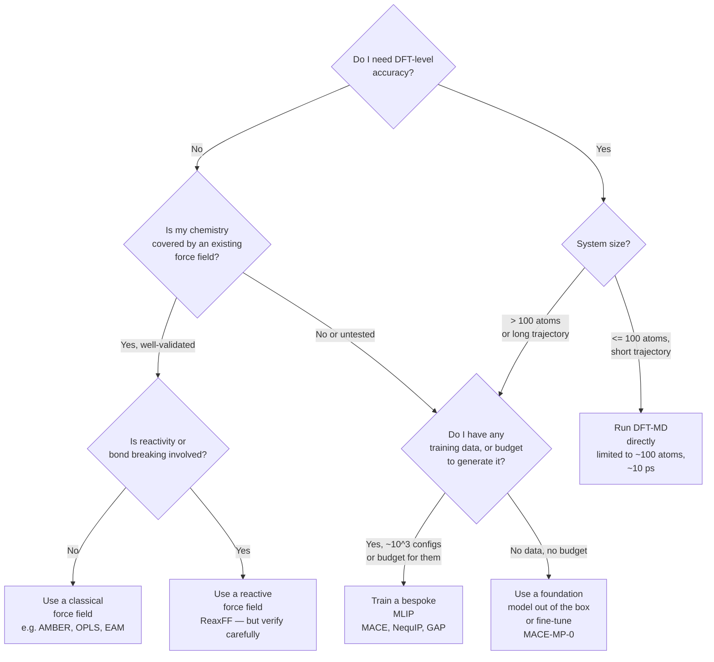

# 9.1 Why MLIPs — the accuracy–cost gap

The argument for machine learning interatomic potentials is, at root, an
argument about numbers. To see it cleanly we need to put the two
established alternatives — density functional theory and classical force
fields — side by side and ask what each can and cannot do.

## 9.1.0 A concrete example to anchor the numbers

Before the asymptotic scaling arguments, it helps to pin down a single
concrete calculation that we will refer back to throughout the chapter.

!!! example "A day in the life of a hybrid-DFT water simulation"
    Consider a periodic cubic cell of $192$ atoms — $64$ water molecules
    at roughly liquid density, an $r = 12.4\,\text{\AA}$ box — to be
    propagated by Born–Oppenheimer molecular dynamics with the
    revPBE0+D3 hybrid functional at the level of accuracy needed for
    quantitative dielectric and infrared properties.

    On a single $32$-core node of a modern HPC cluster, one
    self-consistent energy and force evaluation at HSE06 (a close
    cousin of revPBE0) takes about $10\,\mathrm{s}$ of wall time for
    $100$ atoms at moderate plane-wave cutoff; the $192$-atom problem
    is roughly twice that, call it $\tau_\mathrm{step} \approx
    20\,\mathrm{s}$. The MD time step must be $\Delta t =
    0.5\,\mathrm{fs}$ to resolve O–H stretches. Capturing the
    rotational autocorrelation of water (timescale $\sim 5\,\mathrm{ps}$)
    requires at least $10^5$ steps; converging the dielectric constant
    requires more like $10^6$.

    The arithmetic is brutal. $10^6$ steps $\times\;20\,\mathrm{s}$ =
    $2 \times 10^7\,\mathrm{s} \approx 230$ days of continuous compute
    on a dedicated node — call it a year of wall time when one accounts
    for queueing and restarts. The carbon and dollar costs are
    proportional. This is not a research project; it is a career.

    A well-trained MACE potential evaluates the same $192$-atom
    configuration in about $4\,\mathrm{ms}$ on a single NVIDIA A100. The
    same nanosecond of dynamics runs in eight thousand seconds — call
    it two hours including I/O. The same year of compute now buys
    *four thousand* such trajectories, enough to map the temperature
    dependence of the dielectric constant, to compare functionals, and
    to sample multiple isotopic substitutions.

    The factor that matters here is not the speedup per step
    ($\approx 5000\times$ for this problem) but its compounded effect
    on what science one can do in finite time. A two-month problem
    becomes a same-day problem; a multi-year campaign becomes a
    long lunch. This is the *qualitative* shift that MLIPs enable.

We will revisit the same $192$-atom water box repeatedly: §9.6
trains a MACE potential on a $1000$-configuration revPBE0+D3 dataset
for exactly this system, and the validation suite of §9.6.5 reports
the resulting accuracy.

## 9.1.1 The cost of DFT

A Kohn–Sham DFT calculation (Chapter 5) finds the self-consistent
electronic density of a periodic cell by repeatedly diagonalising a
Hamiltonian matrix whose dimension scales with the number of electrons.
For a plane-wave pseudopotential code with $N$ atoms in the cell, the
dominant cost is the orthogonalisation of $M$ Kohn–Sham orbitals at each
of $N_k$ k-points and each of $N_\mathrm{scf}$ self-consistency
iterations:

$$
T_\mathrm{DFT} \;\sim\; N_\mathrm{scf}\, N_k\, M^2 N_\mathrm{pw}
\;\sim\; O(N^3),
$$

where $N_\mathrm{pw}$, the size of the plane-wave basis, itself grows
linearly with $N$ for fixed energy cutoff. The prefactor is large: a
single SCF step on a 100-atom silicon cell with a moderate cutoff costs
roughly a CPU-hour on a modern node, and a converged self-consistent
calculation requires tens of such steps. A single energy-and-force
evaluation for 100 atoms therefore costs an hour or two of wall time on
sixteen cores.

This rules out almost everything one would call molecular dynamics. The
characteristic vibrational period of a stiff bond is around
$20\,\mathrm{fs}$, requiring a time step of $\Delta t \approx
0.5\,\mathrm{fs}$ to resolve it. A picosecond of dynamics is two thousand
steps; a nanosecond is two million. At an hour per step, a nanosecond of
DFT-MD on 100 atoms is two hundred years of computer time. Even the
heroic *ab initio* MD simulations published in the literature rarely
exceed $10\,\mathrm{ps}$ on $\sim\!200$ atoms, and only on the largest
supercomputers.

The scaling makes the picture worse, not better. A 1000-atom cell — the
size needed to study a single dislocation core or the solvation shell of
a polypeptide — is $10^3$ times more expensive than 100 atoms, so a
single force evaluation takes weeks. Linear-scaling DFT methods exist
(ONETEP, BigDFT, CONQUEST) but trade a worse prefactor for the better
asymptotics, and their accuracy on metallic or strongly correlated
systems remains a moving target.

The cost is not waste: it pays for chemical accuracy. A well-converged
GGA calculation reproduces bond energies to roughly
$50\,\mathrm{meV}/\mathrm{atom}$ and forces to a few
$\mathrm{meV}/\text{\AA}$, with no parameters fitted to the system at
hand. Hybrid functionals and beyond-DFT methods such as RPA push the
accuracy further at proportionally higher cost. *Whatever sits at the
end of an MLIP fitting pipeline can only be as good as the DFT data we
feed it.*

## 9.1.2 The transferability of classical force fields

A classical force field writes the potential energy as a sum of hand-coded
terms in interatomic coordinates:

$$
U = \sum_\mathrm{bonds} k_b (r-r_0)^2
  + \sum_\mathrm{angles} k_\theta (\theta-\theta_0)^2
  + \sum_\mathrm{dihedrals} V_n \cos(n\phi - \phi_0)
  + \sum_{i<j} 4\varepsilon_{ij}
    \!\left[\!\left(\tfrac{\sigma_{ij}}{r_{ij}}\right)^{\!12}
            -\!\left(\tfrac{\sigma_{ij}}{r_{ij}}\right)^{\!6}\right]
  + \sum_{i<j} \frac{q_i q_j}{4\pi\varepsilon_0 r_{ij}}.
$$

Each parameter — $k_b, r_0, \varepsilon, \sigma, q$ — is fitted once, to a
small reference dataset, and then frozen. Evaluation costs scale as $O(N)$
or $O(N\log N)$ for the long-range Coulomb part, with a prefactor
measured in nanoseconds per atom per step. A million-atom system runs in
real time on a single GPU.

The price of that speed is transferability. The functional form encodes
strong assumptions: bonds are harmonic, angles are harmonic, Lennard-Jones
captures all non-bonded interactions, charges are fixed. Move outside
the regime in which parameters were fitted — protonate a residue,
dissociate a bond, raise the temperature, change the metal — and the
predictions degrade silently. The harmonic bond term cannot break a
bond at all: stretch it past the inflection point and the force
increases without bound.

ReaxFF, the most ambitious of the reactive force fields, partially
overcomes this by replacing fixed bonds with bond-order variables that
respond to the local environment. The functional form has roughly
fifty parameters per element pair, and bond breaking is built in. In
practice, however, ReaxFF is notoriously brittle. Parameter sets fitted
for hydrocarbons fail on oxidation; parameter sets fitted for the bulk
metal fail on the surface. Cross-parameter coupling means that
re-fitting one element pair degrades others. Years of expert effort
produce parameter files that work in a small chemical neighbourhood and
fail outside it.

The structural reason is simple: any fixed functional form embeds a
prior about which interactions matter, and that prior is wrong as soon
as you visit a chemistry that was not anticipated. To make a force field
*genuinely* transferable across the periodic table you would need a
functional form rich enough to interpolate between all bonding regimes —
ionic, covalent, metallic, van der Waals — without being told in advance
which is operative.

## 9.1.3 The MLIP proposition

Machine learning interatomic potentials adopt exactly this stance. The
energy is still written as a sum of atomic contributions,

$$
U(\{\mathbf{r}_i\}) = \sum_i E_i(\{\mathbf{r}_j\}_{j \in \mathcal{N}(i)}),
$$

with each $E_i$ depending only on the atoms within a cutoff
$r_\mathrm{c}$ of atom $i$. But $E_i$ is no longer a hand-tuned
polynomial: it is a regression model — a neural network, a Gaussian
process, a sparse polynomial in a many-body basis — fitted to reproduce
DFT energies and forces on a reference dataset.

The model has enough flexibility that, given sufficient training data,
it can represent any smooth function of the local environment. The
training data is generated automatically from DFT calculations on small
configurations, and the model learns the chemistry of those
configurations without being told what bonds, angles, or hybridisations
to expect. If the training data covers the configurations the model
will encounter in production, the predictions match DFT to within the
training error — typically $1$–$50\,\mathrm{meV}/\mathrm{atom}$ for
energies, $20$–$100\,\mathrm{meV}/\text{\AA}$ for forces.

At inference time the model is just a function of atomic coordinates,
evaluated by a fixed number of matrix multiplications per atom. The
cost per atom is constant in $N$, and the absolute number is
small. A representative benchmark: MACE on a single NVIDIA A100 GPU
evaluates energy and forces for a $1000$-atom configuration in roughly
$10\,\mathrm{ms}$. That is $10\,\mu\mathrm{s}$ per atom per step,
versus roughly $30\,\mathrm{s}$ per atom per step for DFT — a
$3\times 10^6$ speedup. At $10\,\mathrm{ms}$ per step a researcher
running continuously fits eight million steps a day, or four
nanoseconds of MD on a 1000-atom cell with a $0.5\,\mathrm{fs}$ time
step. That brings nucleation, defect kinetics, electrochemistry,
biomolecular folding — every problem in the picosecond-to-microsecond
regime — within reach at DFT accuracy.

## 9.1.4 A potted history

The idea of fitting interatomic potentials to *ab initio* data is older
than machine learning. Empirical potentials such as Stillinger–Weber
(1985) and Tersoff (1988) were fitted to small DFT or
experimental datasets; embedded-atom-method potentials for metals
(Daw and Baskes, 1984) likewise. What was missing was a generic,
high-dimensional fitting strategy that did not require a chemist to
guess the functional form. That changed in the late 2000s.

Each milestone below answers a specific question that the previous
generation had left open. The progression is not a parade of buzzwords
but a sequence of pointed answers, and the engineer's reading of the
literature is sharper when one sees the question that each architecture
was designed to address.

**Behler and Parrinello (2007).** Behler and Parrinello proposed the
first modern MLIP. The local environment of each atom is encoded by a
set of *symmetry functions* — sums over neighbours of radial and angular
terms designed to be invariant under rotation and permutation — and the
resulting fixed-length descriptor is fed to a small feed-forward neural
network, one network per chemical element. Training is by stochastic
gradient descent on energy and force errors. The architecture, now
called a Behler–Parrinello neural network (BPNN), demonstrated for the
first time that a neural network could reproduce DFT energies of bulk
silicon over a broad range of densities and phases.

*Question answered:* can a generic high-dimensional regressor — rather
than a hand-crafted functional form — fit a DFT potential energy
surface? *Answer:* yes, provided the inputs satisfy the symmetries of
§9.2 exactly. The key insight was that the burden of inductive bias
moves from the *functional form* of the potential (Stillinger–Weber,
Tersoff) into the *descriptor* (the symmetry functions), leaving the
regressor a generic, problem-agnostic tool.

**Gaussian Approximation Potentials (Bartók et al., 2010).** The GAP
framework replaces the neural network with a Gaussian process, regresses
on the SOAP descriptor (introduced in the same paper), and obtains a
fully Bayesian potential with built-in uncertainty estimates. GAP
remains the gold standard for data efficiency on small datasets and
has produced production potentials for tungsten, silicon, amorphous
carbon, and many others.

*Question answered:* can a *complete* descriptor (one that
distinguishes any pair of inequivalent environments, up to a single
overall rotation) replace the hand-tuned Behler grid, and can one
obtain principled uncertainty estimates alongside predictions?
*Answer:* yes, via SOAP plus the Gaussian process posterior — and the
uncertainty is the key ingredient for active learning (Chapter 11).

**SchNet (Schütt et al., 2017).** SchNet was the first widely
adopted *deep* MLIP. Instead of hand-designed symmetry functions, the
network learns a representation directly from pairwise distances via
continuous-filter convolutions. The architecture is still invariant —
all features are scalars — but it generalised the
descriptor-then-regress pattern into a single end-to-end trainable
graph network. SchNet inspired a generation of descendants:
DimeNet, PaiNN, SpookyNet.

*Question answered:* can the descriptor be *learned* end-to-end
together with the regressor, removing the hand-tuning of $(\eta, r_s,
\zeta, \lambda)$ grids? *Answer:* yes, via continuous-filter
convolutions on a graph of atoms; the price is that everything is now
a deep neural network and demands more training data and more compute
to train.

**NequIP (Batzner et al., 2022).** NequIP introduced
*equivariant* features to MLIPs. Rather than throwing away
directional information by reducing to scalar descriptors at every
layer, NequIP propagates tensors that transform predictably under
rotation — irreducible representations of $\mathrm{O}(3)$. The
empirical effect is dramatic: on the rMD17 benchmark NequIP reaches the
same accuracy as SchNet with roughly twenty times less training data,
and extrapolates substantially better. Equivariance is now the
dominant paradigm.

*Question answered:* does throwing away directional information at
every layer hurt the data efficiency of deep MLIPs? *Answer:* yes —
catastrophically. Equivariant features are not optional optimisation;
they are the right inductive bias for the underlying physics, and
they pay back many-fold in the data budget.

**MACE (Batatia et al., 2023).** MACE combines NequIP's equivariant
message passing with the body-order expansion of the Atomic Cluster
Expansion. A single MACE layer captures interactions up to fourth body
order, and two layers suffice for most chemistries. MACE is currently
the most accurate publicly available architecture per parameter and
per training example, and inference is fast enough that million-step
trajectories on thousand-atom cells are routine.

*Question answered:* can the body-order expansion of ACE — explicit
many-body correlations within a single layer — be combined with
equivariant message passing, reducing the network depth required for a
given expressive power? *Answer:* yes, by raising the per-layer
correlation order via symmetric tensor products. The structural lesson
is that *depth* and *body order* are partly substitutable; MACE
exploits this to compress a four-layer NequIP-like network into two
layers without losing expressive power.

**MACE-MP-0 (Batatia et al., 2023).** MACE-MP-0 is the first
*foundation model* for materials chemistry: a single MACE potential
trained on the Materials Project dataset (roughly $1.5 \times 10^6$
DFT calculations spanning $89$ elements) and released as a checkpoint
that one can apply zero-shot to any chemistry. Out-of-the-box accuracy
is comparable to a well-fitted bespoke potential for many systems, and
the checkpoint can be fine-tuned on a few hundred new configurations
to match the bespoke potential exactly. Foundation models are the
subject of Chapter 12.

*Question answered:* does the language-model paradigm — train a single
large model on broad data, then specialise to downstream tasks —
transfer to atomistic chemistry? *Answer:* preliminarily, yes; the
zero-shot accuracy of MACE-MP-0 on systems it has never seen is often
within a factor of two of a bespoke potential, and fine-tuning closes
the gap.

## 9.1.4a When to use MLIP, classical force field, or DFT-MD

The choice of method for a given problem is not a religious matter; it
is an engineering decision shaped by accuracy needs, system size,
trajectory length, and the chemical novelty of the configurations to
be visited. The decision tree below makes the trade-offs explicit.

A few practical refinements that the tree elides:

- **Production sampling of a known biomolecule in solvent**: a
  classical force field (AMBER ff19SB for proteins, GAFF for ligands)
  is the right answer. MLIPs are not yet faster than tuned AMBER, and
  AMBER's parameterisation for canonical amino acids is excellent.
- **Catalysis on a transition-metal surface**: classical force fields
  fail; DFT-MD is too short; MLIP is the only option, and the
  training data must include both adsorbed and gas-phase
  configurations.
- **Phase transitions or nucleation**: DFT-MD is too short by orders
  of magnitude. MLIP plus enhanced sampling (Chapter 10) is the
  modern workflow.
- **Anything at finite temperature with quantum nuclei (water,
  methanol, light molecular crystals)**: ring-polymer MD on an MLIP
  surface is the only tractable approach; each centroid evaluation is
  cheap enough that the $\sim 32$-bead ring polymer is affordable.
- **Chemistry where you have no data and no DFT budget**: MACE-MP-0
  or other foundation models (Chapter 12). Expect $5$–$30\,\mathrm{meV}/\text{atom}$
  energy error and $50$–$200\,\mathrm{meV}/\text{\AA}$ force error
  zero-shot, often good enough for screening and qualitative answers.

A second axis is whether you need *uncertainty quantification*. If
yes, GAP or a MACE ensemble is required; a single point-estimate
neural network does not provide it. Chapter 11 develops active
learning on top of these uncertainty estimates.

## 9.1.5 What MLIPs are not

It is worth stating clearly what MLIPs do *not* solve. They are
interpolators: they reproduce the chemistry contained in their
training set, with smoothly varying confidence in nearby regions.
They extrapolate badly. A potential trained on equilibrium liquid
water will not, in general, describe water under shock compression.
A potential trained on stoichiometric crystals will not, in general,
describe defective ones unless the relevant defects are in the
training data. Training-set design — and its automation via active
learning, Chapter 11 — is the central engineering problem of the
field.

MLIPs also inherit every error of the underlying electronic-structure
theory. A GGA-trained MACE potential reproduces GGA energetics, with
GGA's overbinding, GGA's underestimated band gaps, GGA's poor
description of dispersion. If you need hybrid-DFT accuracy you must
train on hybrid-DFT data, which is roughly thirty times more expensive
per reference calculation. If you need CCSD(T) accuracy you must
train on CCSD(T) data, which is roughly $10^4$ times more expensive.

The MLIP does not absolve you of choosing the right theory; it
amortises the cost of running it.

!!! note "Why this step?"
    The point of separating the choice of *electronic-structure theory*
    from the choice of *interpolator* is methodological honesty. A
    paper that reports MACE-MP-0 predictions for a transition-metal
    surface is reporting GGA-PBE predictions, with all the
    well-documented limitations of GGA-PBE for transition-metal
    chemistry. The MLIP makes the calculation feasible; it does not
    change the answer it is interpolating. When you read a result
    in the literature, always trace it back to the underlying
    electronic-structure level: the MLIP is a lens, not a microscope
    of higher resolution.

A complementary blind spot worth flagging is the treatment of *long-range*
interactions. The locality assumption $E = \sum_i E_i$ with cutoff
$r_\mathrm{c} \sim 5\,\text{\AA}$ is excellent for short-range
covalent and metallic bonding but poor for ionic systems with
unscreened Coulomb tails, for systems with long-range dispersion in
low-dimensional geometries, and for any system with strong polarisation
under external fields. A separate body of work — long-range MLIPs
based on charge equilibration or learnable charges (4G-HDNNP, the
LODE descriptor, MACE-LR) — addresses this. We treat short-range MLIPs
as the default in this chapter and revisit the long-range question
where it bites in specific examples.

## 9.1.6 What we will build

Through the rest of this chapter we will build the components needed
to construct an MLIP from scratch and to use a state-of-the-art
implementation in production. The pedagogical sequence is:

1. State the symmetries any potential must satisfy (§9.2).
2. Encode them in a descriptor (§9.3) — Behler–Parrinello, SOAP, ACE.
3. Plug the descriptor into a regression model (§9.4) — BPNN, GAP.
4. Generalise the descriptor and the regressor jointly into an
   equivariant network (§9.5) — NequIP, MACE.
5. Train one (§9.6) and run MD with it.

The mathematical content is mostly linear algebra and a small amount of
group theory; the coding content is plain PyTorch. By the end you will
have trained a usable potential and will be in a position to read the
current literature.

!!! tip "Reading guide"
    The pedagogical strategy is *bottom-up*. We will not state an MLIP
    architecture and then dissect it; we will state the symmetry
    constraints, derive the descriptors that satisfy them, and then
    *recover* each modern architecture as a specific choice within
    the design space. By the time we reach MACE in §9.5, every
    component of the architecture will already be familiar in
    isolation, and the synthesis will feel inevitable rather than
    arbitrary.

    Readers in a hurry can skim §9.2 (it sets vocabulary) and §9.3
    (it derives the descriptors) and dive into §9.6 (the training
    walkthrough); but the time spent on §9.2 and §9.5 is what
    separates a user of MLIPs from a builder of them, and is the
    investment we recommend.

Forward references to be aware of as you read this chapter:

- Chapter 5 (DFT) — the source of ground-truth training data. The
  choice of functional, k-point sampling, and pseudopotential
  determines the ceiling of MLIP accuracy.
- Chapter 7 (MD) — the consumer of MLIPs. Once trained, an MLIP is
  just a calculator; the integration scheme, thermostat, and
  ensemble are independent design choices.
- Chapter 10 (enhanced sampling) — once the MLIP makes MD cheap,
  rare events become accessible via metadynamics, umbrella sampling,
  and replica exchange on top of the MLIP.
- Chapter 11 (active learning) — how to grow the training set
  intelligently rather than guessing it in advance.
- Chapter 12 (foundation models) — the MACE-MP-0 family and its
  descendants, plus the workflow for zero-shot prediction and
  fine-tuning.
