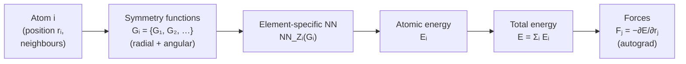

# 9.4 Behler–Parrinello neural networks and Gaussian Approximation Potentials


*Behler–Parrinello architecture. Each atom is encoded by hand-crafted symmetry functions, passed through an element-specific neural network to give an atomic energy, then summed. Forces fall out of autograd on the total energy.*

With a descriptor in hand we need a regression model to map the
descriptor of each atom to its energetic contribution $E_i$. Two
classical choices dominate the pre-equivariant literature:
Behler–Parrinello neural networks (BPNNs), which use a small
feed-forward network per element, and Gaussian Approximation Potentials
(GAP), which use Gaussian process regression on SOAP descriptors. They
illustrate the two main schools of statistical learning — parametric
(neural network) and non-parametric (kernel) — applied to the same
fitting problem.

## 9.4.1 Behler–Parrinello architecture

### Atomic energies via element-specific networks

The Behler–Parrinello architecture writes

$$
U(\{\mathbf{r}_i\}) = \sum_{i=1}^N E_i,
\qquad
E_i = \mathrm{NN}_{Z_i}\!\big(\mathbf{G}_i\big),
$$

where $\mathbf{G}_i$ is the symmetry-function descriptor of atom $i$
(§9.3.1) and $\mathrm{NN}_{Z_i}$ is a small feed-forward neural
network specific to the chemical species $Z_i$ of atom $i$. The
architectural decisions are:

- **One network per element.** Hydrogen has its own network, oxygen
  has its own network. Permutation invariance follows because all
  hydrogens use the same network with the same weights.
- **Atomic energy as a scalar output.** $E_i \in \mathbb{R}$. The
  partition $U = \sum_i E_i$ is exact only in the limit of strictly
  local atomic energies; in practice the cutoff $r_\mathrm{c}$ defines
  what *local* means.
- **Small, fully connected networks.** Two or three hidden layers of
  $30$–$100$ units each is typical. Larger networks easily overfit on
  the modest datasets used in MLIP training (often $10^3$–$10^4$
  configurations).

A minimal forward pass for a single element looks like:

$$
\mathbf{h}^{(1)} = \tanh(W_1 \mathbf{G}_i + \mathbf{b}_1),\quad
\mathbf{h}^{(2)} = \tanh(W_2 \mathbf{h}^{(1)} + \mathbf{b}_2),\quad
E_i = W_3 \mathbf{h}^{(2)} + b_3.
$$

The final linear layer has output dimension $1$. The activation is
typically $\tanh$ for legacy reasons (Behler used it originally);
modern variants use SiLU or softplus, both of which keep the
$C^\infty$ smoothness that forces require.

### Why a small network is enough

The descriptor $\mathbf{G}_i$ already encodes a great deal of the
physics: rotation invariance, permutation invariance, the smooth
cutoff. The neural network's job is only to learn a nonlinear
mapping from descriptor to energy. In practice this mapping is
smooth, low-dimensional, and well within the reach of a few-thousand-
parameter network.

A useful sanity check on a freshly trained BPNN: the
weights-and-biases distributions should look like ordinary
small-network weights ($\mathcal{O}(0.1)$ in magnitude), and the
training loss should plateau in a few hundred epochs on a modest
GPU. If the network needs millions of parameters and weeks to train,
either the descriptor is inadequate or the regression target is.

## 9.4.2 Training a BPNN

### The loss function

Training minimises a weighted sum of energy and force errors over the
training set:

$$
\mathcal{L} \;=\;
   w_E \sum_{s=1}^{S} \frac{1}{N_s} \big(E^\mathrm{pred}_s - E^\mathrm{DFT}_s\big)^2
\;+\; w_F \sum_{s=1}^{S} \frac{1}{3 N_s}
        \sum_{i=1}^{N_s} \big\|\mathbf{F}^\mathrm{pred}_{s,i}
                              - \mathbf{F}^\mathrm{DFT}_{s,i}\big\|^2.
$$

The sum is over structures $s$ in the training set; $N_s$ is the
number of atoms in structure $s$; $w_E$ and $w_F$ are dimensionful
weights (with units of $(\text{atom}/\text{eV})^2$ for the energy
term and $(\text{atom}/(\text{eV}/\text{\AA}))^2$ for the force term)
that balance the two contributions. A typical choice is
$w_E = 1$, $w_F = 100\,\text{\AA}^2$, so that a $1\,\mathrm{meV/atom}$
energy error and a $10\,\mathrm{meV/\text{\AA}}$ force error
contribute equally. Stress terms can be added analogously.

Including forces in the loss is crucial. A given structure provides
one energy label but $3N$ force labels: forces give roughly $3N$ times
more information per DFT call than energies alone. Empirically,
force-trained BPNNs reach the same accuracy with one to two orders of
magnitude less training data than energy-only BPNNs.

### Force derivation by analytical chain rule — a small example

Before turning to autograd, let us derive the analytical force
expression for a single-atom Behler model. This is the calculation
that PyTorch's autograd executes for you, and seeing it once by hand
clarifies what autograd is doing.

Consider two atoms $1, 2$ with a single Gaussian $G^2$ descriptor

$$
G_1 = e^{-\eta (r_{12} - r_s)^2}\, f_\mathrm{c}(r_{12}), \qquad
r_{12} = \|\mathbf{r}_2 - \mathbf{r}_1\|.
$$

The atomic energy is $E_1 = w \cdot G_1$ (a linear "network" with
weight $w$), and the total energy is $U = E_1 + E_2$ — by symmetry
$E_2 = w \cdot G_2$ with the same descriptor on the symmetric pair.
For simplicity assume $w$ is the same for both. We compute the force
on atom $2$:

$$
\mathbf{F}_2 = -\nabla_{\mathbf{r}_2} U
             = -w \nabla_{\mathbf{r}_2} G_1 - w \nabla_{\mathbf{r}_2} G_2.
$$

By symmetry $G_1 = G_2 \equiv G$, and $\nabla_{\mathbf{r}_2} G_1 =
\nabla_{\mathbf{r}_2} G_2$ (each depends on the pair $(\mathbf{r}_1,
\mathbf{r}_2)$ in the same way). So $\mathbf{F}_2 = -2w
\nabla_{\mathbf{r}_2} G$.

Applying the chain rule,

$$
\nabla_{\mathbf{r}_2} G = \frac{dG}{dr_{12}}\, \nabla_{\mathbf{r}_2} r_{12}
                       = \frac{dG}{dr_{12}}\, \hat{\mathbf{r}}_{12},
$$

where $\hat{\mathbf{r}}_{12} = (\mathbf{r}_2 - \mathbf{r}_1)/r_{12}$
is the unit vector from $1$ to $2$. The scalar derivative is

$$
\frac{dG}{dr_{12}} = \big[-2\eta (r_{12} - r_s) f_\mathrm{c}(r_{12})
                          + f_\mathrm{c}'(r_{12})\big] \, e^{-\eta (r_{12} - r_s)^2},
$$

which involves the derivative of both the Gaussian and the cosine
cutoff (where the smooth $f_\mathrm{c}'$ of §9.2.4 enters). The final
force is

$$
\mathbf{F}_2 = -2w\, \frac{dG}{dr_{12}}\, \hat{\mathbf{r}}_{12}.
$$

This is a *vector* with a definite direction ($\hat{\mathbf{r}}_{12}$,
which transforms correctly under rotation — equivariance!) and a
scalar magnitude that depends on the configuration. The force on atom
$1$ is the negative of this by Newton's third law:
$\mathbf{F}_1 = -\mathbf{F}_2$.

!!! tip "Sanity check"
    At $r_{12} = r_s$ (Gaussian centre), $dG/dr_{12} =
    f_\mathrm{c}'(r_s) e^{0} = f_\mathrm{c}'(r_s) < 0$ (the cutoff is
    monotonically decreasing). So $\mathbf{F}_2 = -2w
    \cdot (\text{negative}) \cdot \hat{\mathbf{r}}_{12}$ — for
    positive $w$, the force points along $+\hat{\mathbf{r}}_{12}$,
    pushing atom $2$ further from atom $1$. The sign tells us whether
    the descriptor and its weight predict attraction or repulsion at
    the equilibrium of the Gaussian shell.

For a full Behler descriptor (many $\eta, r_s$ pairs plus angular
features), the analytical force expression is a sum of such terms
involving the gradient of every Gaussian and every angular factor.
The bookkeeping is straightforward but tedious — exactly the kind of
thing one wants a computer to do. This is where autograd comes in.

### Why autograd beats analytical differentiation

For a $20$-element BPNN descriptor, the analytical force expression
fills a page. For a MACE network with $10^5$ parameters and tensor
products of irreps, it would fill a notebook. Worse, every time you
change the descriptor — add a body-order term, switch the cutoff,
include a long-range correction — the analytical formula must be
rederived from scratch.

Automatic differentiation eliminates this. PyTorch's autograd applies
the chain rule mechanically to *any* computational graph whose
forward pass is implemented as PyTorch tensor operations. By
declaring `positions.requires_grad_(True)`, recording the energy
calculation, and calling `torch.autograd.grad(energy, positions)`,
we obtain the gradient — and hence the force — to machine precision,
with no further programming.

The performance is also competitive. For a typical MACE forward pass,
the cost of computing forces by autograd is roughly $2$–$3\times$ the
forward pass alone. The analytical version is at most $2\times$
forward (one would have to write twice the code for the same speed),
and is far more error-prone. In every production MLIP code we know
of, autograd has won.

The one place where analytical force derivatives still appear is in
*GAP*. There, the regressor is a kernel sum $\sum_m \alpha_m
k(\mathbf{x}_i, \mathbf{x}_m^*)$, and the gradient of the kernel with
respect to atomic positions has a closed form. Computing this
analytically is faster than autograd through the SOAP descriptor;
GAP codes ship with hand-written derivatives for this reason.

### Force derivation by autograd

The force on atom $i$ in structure $s$ is

$$
\mathbf{F}_{s,i} = -\nabla_{\mathbf{r}_i} U_s
                  = -\sum_{j=1}^{N_s} \nabla_{\mathbf{r}_i} E_{s,j}.
$$

Because each $E_j$ depends on positions only via the symmetry-function
descriptor $\mathbf{G}_j$, the chain rule gives

$$
\mathbf{F}_{s,i} = -\sum_j \frac{\partial E_j}{\partial \mathbf{G}_j}
                       \cdot \frac{\partial \mathbf{G}_j}{\partial \mathbf{r}_i}.
$$

The first factor is the gradient of the neural network output with
respect to its input — a single backward pass per atom. The second
factor is the gradient of the descriptor with respect to atomic
positions, an analytical expression for Behler symmetry functions
(differentiate the cosine cutoff, the Gaussian, and any angular
factor). In modern PyTorch implementations one writes the network
forward, calls `torch.autograd.grad(energy, positions,
create_graph=True)` to obtain forces, and then differentiates the
loss through the force computation. The `create_graph=True` flag is
essential — without it the second-order gradient needed for the
force-loss backprop is unavailable.

```python
import torch

def predict_energy_and_forces(positions, model, descriptor_fn):
    positions = positions.requires_grad_(True)
    G = descriptor_fn(positions)             # (N, K) descriptors
    E_atoms = model(G)                       # (N, 1) atomic energies
    E_total = E_atoms.sum()
    forces = -torch.autograd.grad(
        E_total, positions, create_graph=True,
    )[0]
    return E_total, forces
```

!!! example "Comparing the loss when the energy weight is wrong"
    Take a hypothetical training set of $100$ structures, each with
    $50$ atoms. The DFT total energies range over $\sim 1\,\mathrm{eV}$
    (so per-atom variation $\sim 20\,\mathrm{meV/atom}$); forces range
    over $\sim 5\,\mathrm{eV}/\text{\AA}$.

    With $w_E = 1$, $w_F = 100$, a model off on forces by
    $50\,\mathrm{meV}/\text{\AA}$ contributes a force loss of
    $100 \times (0.05)^2 \times 3 \times 50 \times 100 = 3750$. A model
    off on energies by $10\,\mathrm{meV/atom}$ contributes an energy
    loss of $1 \times (0.5)^2 \times 100 = 25$. The force-error model
    has $150\times$ more loss — and so the optimiser will preferentially
    correct forces. This is the desired behaviour.

    With $w_E = 1, w_F = 1$ (wrong!), the same two errors contribute
    $37.5$ vs $25$, almost comparable; the optimiser will not
    aggressively correct forces, and the resulting model will pass
    energy tests but fail MD tests with terrible forces. This is the
    standard failure mode of beginners who use unweighted MSE losses.

### Calibrating the weight ratio from DFT noise

The choice $w_E : w_F = 1 : 100$ is a heuristic; the principled choice
depends on the noise levels of the energy and force labels. Modelling
the DFT labels as noisy with Gaussian noise of variance $\sigma_E^2$
on energies and $\sigma_F^2$ on each force component, the
maximum-likelihood loss is

$$
\mathcal{L}_\mathrm{ML} = \sum_s \frac{1}{2 \sigma_E^2}
                                 (E_s^\mathrm{pred} - E_s^\mathrm{DFT})^2
                       + \sum_s \sum_i \frac{1}{2 \sigma_F^2}
                                 \|\mathbf{F}^\mathrm{pred}_{s,i}
                                  - \mathbf{F}^\mathrm{DFT}_{s,i}\|^2,
$$

which fixes $w_E : w_F = 1/\sigma_E^2 : 1/\sigma_F^2$. With typical
DFT noise levels $\sigma_E \approx 1\,\mathrm{meV/atom}$ and
$\sigma_F \approx 10\,\mathrm{meV}/\text{\AA}$, the ratio is
$10^6 : 10^4 = 100 : 1$ — matching the heuristic exactly. The "rule
of thumb" is not arbitrary; it reflects the relative magnitudes of
intrinsic DFT noise on the two label types.

The `create_graph=True` carries the computational graph of the force
computation forward so that the loss

```python
loss = w_E * (E_total - E_dft)**2 + w_F * (forces - F_dft).pow(2).sum()
loss.backward()
```

can backpropagate through both energy and force terms. Exercise 9.1
asks you to verify by finite differences that autograd computes the
force correctly.

### Optimisation and regularisation

BPNNs are typically trained with Adam at learning rates of
$10^{-3}$ to $10^{-4}$, decayed by a factor of $\sim\!10$ at the
plateau. Batch sizes are small (a few structures at a time) because
each structure has a different number of atoms; gradient accumulation
keeps effective batch size larger.

Regularisation is mostly implicit, through:

- Early stopping on a held-out validation set. The validation force
  MAE typically drops monotonically for a few hundred epochs, then
  starts to rise — the classical overfitting signature. Stop at the
  minimum.
- Weight decay of $10^{-6}$ to $10^{-4}$.
- An explicit cap on weights, since the cosine activation gives
  exponentially decaying tails and unbounded weights can produce
  artefacts in extrapolation.

!!! tip "Common mistake"
    Training only on energies and then evaluating force accuracy is a
    classical mistake. Energy-trained networks tend to learn smooth
    energy surfaces that happen to fit the training totals but whose
    *gradients* — the forces — are wildly inaccurate. Always train on
    forces, always evaluate on forces.

## 9.4.3 Strengths and limitations of BPNNs

Strengths:

- Simple, transparent, easy to implement from scratch. A complete
  PyTorch BPNN fits in roughly two hundred lines.
- Fast at inference: each network is small and the descriptor is
  cheap to evaluate.
- Established track record on materials problems (water, silicon,
  copper, zinc oxide, lithium-ion electrolytes).
- The element-decomposed structure means new elements can be added
  by training only the relevant networks, leaving others frozen.

Limitations:

- Hand-tuned descriptor parameters. Different problems need
  different $\eta, r_s$ grids; the choice is a research project in
  itself.
- Pure invariance, so the degenerate-environment issue of §9.2.6
  applies.
- Body order limited to three. Distinguishing four-body patterns
  requires either explicit four-body descriptors (e.g. the wACSF
  family) or going to equivariant networks.
- Per-element networks scale awkwardly with the number of element
  types; for high-entropy alloys with $5$+ elements the model becomes
  unwieldy.

For binary or ternary systems with $10^4$ or more training
configurations, BPNNs remain competitive and are still the workhorse
of several production codes (RuNNer, n2p2, aenet).

## 9.4.4 Gaussian Approximation Potentials

GAP, introduced by Bartók et al. in the same 2010 paper that
introduced SOAP, replaces the neural network with a Gaussian process.

### Gaussian processes from first principles

GAP is built on Gaussian process regression, a Bayesian-non-parametric
fitting framework that is far less familiar than neural networks to
most machine-learning students. Because GP regression is at the heart
of GAP's data efficiency and its uncertainty-aware extensions
(Chapter 11), we develop it here in some detail.

A *Gaussian process* is a probability distribution over functions
such that, for any finite set of input points
$\{\mathbf{x}_1, \dots, \mathbf{x}_n\}$, the corresponding function
values $(f(\mathbf{x}_1), \dots, f(\mathbf{x}_n))$ are *jointly
Gaussian*. The distribution is specified by a mean function
$m(\mathbf{x})$ (usually taken to be zero by convention) and a
*kernel* (covariance function) $k(\mathbf{x}, \mathbf{x}')$, which
specifies how similar function values are at two input points:

$$
f \sim \mathcal{GP}(0, k(\mathbf{x}, \mathbf{x}'))
\quad \Longleftrightarrow \quad
\big(f(\mathbf{x}_1), \dots, f(\mathbf{x}_n)\big) \sim
\mathcal{N}(\mathbf{0}, K),
$$

where the *Gram matrix* $K$ has entries $K_{ij} = k(\mathbf{x}_i,
\mathbf{x}_j)$. The kernel encodes our prior beliefs about smoothness,
length scales, and any other structure of the function.

**Posterior prediction.** Given training observations $\mathbf{y} =
(y_1, \dots, y_n)$ at points $\{\mathbf{x}_i\}$, possibly corrupted
by Gaussian noise of variance $\sigma_n^2$, the posterior distribution
over the function value at a test point $\mathbf{x}^*$ is also
Gaussian with mean and variance

$$
\mu^*(\mathbf{x}^*) = \mathbf{k}_*^\top (K + \sigma_n^2 I)^{-1} \mathbf{y},
\qquad
\sigma^{*2}(\mathbf{x}^*) = k(\mathbf{x}^*, \mathbf{x}^*)
                          - \mathbf{k}_*^\top (K + \sigma_n^2 I)^{-1} \mathbf{k}_*,
$$

where $\mathbf{k}_* = (k(\mathbf{x}^*, \mathbf{x}_1), \dots,
k(\mathbf{x}^*, \mathbf{x}_n))$. The mean $\mu^*$ is the prediction;
the variance $\sigma^{*2}$ is the predictive uncertainty. This is the
defining feature of GPs and the source of GAP's principled uncertainty
estimates.

!!! note "Why this step? Where the formulae come from"
    The conditional-Gaussian formulae are not magic. They come from the
    standard identity that, if $(\mathbf{u}, \mathbf{v})$ is jointly
    Gaussian with covariance block matrix
    $\begin{pmatrix} \Sigma_{uu} & \Sigma_{uv} \\ \Sigma_{vu} & \Sigma_{vv} \end{pmatrix}$,
    then the conditional distribution of $\mathbf{u}$ given $\mathbf{v}$
    is Gaussian with mean $\Sigma_{uv} \Sigma_{vv}^{-1} \mathbf{v}$ and
    covariance $\Sigma_{uu} - \Sigma_{uv} \Sigma_{vv}^{-1} \Sigma_{vu}$.
    Setting $\mathbf{u} = f(\mathbf{x}^*)$ and $\mathbf{v} =
    \mathbf{y}$ reproduces the GP posterior formulae above. The whole
    machinery rests on the algebra of block-Gaussian conditioning.

**Computational cost.** The matrix inverse $(K + \sigma_n^2 I)^{-1}$
costs $O(n^3)$ to compute and $O(n^2)$ to store. For $n = 1000$
training points this is a coffee break; for $n = 10^5$ (typical for
an MLIP fit on $10^4$ structures of average size $10$) it is
prohibitive. The fix is *sparse* GP regression.

**Sparse GP via inducing points.** Choose a small subset of $M \ll
n$ representative input locations $\{\mathbf{x}_m^*\}_{m=1}^M$ — by
CUR decomposition, farthest-point sampling, or k-medoids — and approximate
the GP posterior by restricting to function values at the inducing
points. The cost drops from $O(n^3)$ to $O(n M^2)$, with prediction
cost $O(M)$ per test point. For typical MLIP problems, $M \approx
1000$ inducing points suffice to capture most of the structure
present in $n \approx 10^5$ training environments.

The sparse-GP prediction takes the form

$$
\mu^*(\mathbf{x}^*) = \sum_{m=1}^M \alpha_m\, k(\mathbf{x}^*, \mathbf{x}_m^*),
$$

a linear combination of kernel evaluations between the test point and
the inducing points. The coefficients $\boldsymbol{\alpha}$ are
obtained by least-squares (ridge) regression on the joint
energy-force-stress training labels.

### Gaussian process regression in one paragraph

A Gaussian process places a prior over functions: any finite collection
of function values $\{f(\mathbf{x}_1), \dots, f(\mathbf{x}_n)\}$ is
jointly Gaussian with mean $\mathbf{0}$ and covariance
$K_{ij} = k(\mathbf{x}_i, \mathbf{x}_j)$, where $k$ is a chosen
kernel. Conditioning on observed training values yields a Gaussian
posterior over $f(\mathbf{x}^*)$ at any test point. The posterior
mean is the GP prediction; the posterior variance is its uncertainty.
For Gaussian noise on observations, both mean and variance are
closed-form linear-algebra expressions.

For MLIPs, the input $\mathbf{x}$ is the SOAP descriptor of an atomic
environment, the output is the atomic energy, and the kernel is
typically the SOAP kernel itself:

$$
k_\mathrm{SOAP}(\mathbf{x}_i, \mathbf{x}_j) =
   \big( \hat{\mathbf{x}}_i \cdot \hat{\mathbf{x}}_j \big)^\zeta,
$$

with $\zeta \in \{2, 4\}$ controlling the sharpness and the hat
denoting normalisation. The SOAP kernel is itself rotation-invariant
because the SOAP power spectra are.

### The GAP energy

The energy of a configuration is a sum of GP-predicted atomic energies,

$$
U^\mathrm{GAP}(\{\mathbf{r}_i\}) =
  \sum_i E_i
= \sum_i \sum_{m=1}^M \alpha_m\, k_\mathrm{SOAP}(\mathbf{x}_i, \mathbf{x}_m^*),
$$

where $\{\mathbf{x}_m^*\}_{m=1}^M$ are *sparse representative points*
selected from the training set by CUR or farthest-point sampling, and
$\{\alpha_m\}$ are the regression coefficients fitted by ridge
regression on the joint energy-force-stress training labels.

The sparse-GP formulation is essential because full GP regression
scales as $O(n^3)$ in the number of training points $n$ — typically
$10^5$ to $10^6$ atomic environments in an MLIP fit — which is
prohibitive. With $M \approx 1000$ representative points the cost
falls to $O(n M^2)$, manageable on a workstation.

### Forces and stresses

Forces follow by analytical differentiation of the kernel, which is
smooth by construction. Stresses, used for fitting volumetric data,
are obtained from the virial expression
$\sigma_{\alpha\beta} = -\frac{1}{V}\sum_i \mathbf{r}_i \otimes \mathbf{F}_i$.
Each prediction returns not just a value but a posterior variance —
the GAP's confidence in itself at that environment.

### Strengths and limitations

GAP's strengths are remarkable for small datasets:

- **Built-in uncertainty.** The GP posterior variance is a *principled*
  measure of where the model is extrapolating. Configurations with high
  variance are exactly the ones one should add to the training set;
  this is the basis of active learning in Chapter 11.
- **Data efficiency on small problems.** With $\le 1000$ configurations,
  GAP often outperforms neural-network approaches because the GP prior
  is a stronger regulariser than weight decay.
- **No architecture choices.** Kernel form is essentially fixed; the
  only hyperparameters are the sparse-point count $M$, the kernel
  exponent $\zeta$, and SOAP's $N_\mathrm{rad}, \ell_\mathrm{max},
  \sigma_\mathrm{at}$.

Its limitations show up on larger problems:

- **Scaling.** Even with sparse GPs, training cost grows quickly with
  $M$, and inference cost is $O(M)$ per atom (versus
  $O(\text{layers} \times \text{hidden}^2)$ for a neural network with
  the same effective capacity).
- **Single-fidelity training.** Combining DFT data at different levels
  of theory, or mixing energies with experimental data, is awkward
  for a GP and natural for a neural network.
- **Equivariance.** Standard GAP uses the invariant SOAP power
  spectrum; the loss of geometric information of §9.2.6 still applies,
  though it is partially compensated by the high expressiveness of
  the SOAP descriptor.

For these reasons GAP has been displaced from the cutting edge by
equivariant networks but remains the gold standard for
small-data MLIP fits and for any application where uncertainty
estimates matter — most notably active-learning pipelines (Chapter 11).

### Uncertainty quantification in practice

The GP posterior variance $\sigma^{*2}$ defined above has a concrete
operational meaning. Configurations on which the GP is *certain* (low
$\sigma^*$) are well-represented in the training set; configurations
on which it is *uncertain* (high $\sigma^*$) are extrapolations.

A typical active-learning loop sets a threshold
$\sigma_\mathrm{thresh}$ — say, three times the average training-set
uncertainty — and flags any configuration during an MD trajectory
with $\sigma^*(\mathbf{x}_i) > \sigma_\mathrm{thresh}$ as needing a
DFT label. The configuration is added to the training set, the GP is
refit, and the loop continues. This is the principled basis for the
on-the-fly potential refinement procedures in Chapter 11.

Neural networks do not have such a built-in uncertainty estimate.
The standard workaround for MACE is to train an *ensemble* of $K
\approx 3$ to $5$ models with different random seeds, and to use
the variance of their predictions as a proxy for uncertainty. This
works well in practice but is $K$-times more expensive at inference
and lacks the Bayesian justification that GAP enjoys.

## 9.4.5 When to use which

A rough decision tree:

- **Dataset of $\sim\!100$ configurations and you need uncertainty**:
  use GAP. It is the data-efficient frontier and gives error bars for
  free.
- **Dataset of $10^3$–$10^4$ configurations of a one- or two-element
  system**: BPNN or GAP both work; BPNN is faster at inference.
- **Dataset of $10^4$+ configurations, multiple elements, accuracy
  critical**: use MACE (or NequIP). The data efficiency of
  equivariant networks dominates above $\sim\!10^3$ configurations.
- **A new chemistry with no data yet**: fine-tune the MACE-MP-0
  foundation model on a small custom set (Chapter 12).

In §9.5 we develop the equivariant architectures that dominate the
modern literature; in §9.6 we train one.

## 9.4.6 Why energy-only training is insufficient — the information argument

A reader new to MLIPs often asks why we bother with force labels at
all. Energies are simpler — one number per structure — and DFT codes
report them at the end of every SCF anyway. Why complicate training
with $3N$ extra force labels?

The information-theoretic answer is clean. A single structure of $N$
atoms produces:

- **1 energy label** ($1$ scalar)
- **$3N$ force labels** (three components per atom)
- **6 stress labels** (independent components of the symmetric stress
  tensor)

For $N = 100$, that is $1 + 300 + 6 = 307$ training labels per DFT
call, of which $98\%$ come from forces. Discarding forces and
training only on energies discards $98\%$ of the information.

More concretely, the energy is an *integrated* quantity — it averages
over all atoms — while the force is a *local* quantity. Two
configurations with very different local geometries but the same
total energy contribute the same label to the energy-only loss but
contradict each other in the force-trained loss, forcing the model
to learn the local energy decomposition correctly. The
configuration-by-configuration matching of forces is the most useful
local-decomposition signal we have.

Empirically, force-trained BPNNs and MACE potentials reach a given
accuracy with $10^2$–$10^3$ times less training data than energy-only
versions. For active learning (Chapter 11), the gap is even larger:
forces give per-atom error estimates, energies give only per-structure
estimates, and atom-resolved error is exactly what active learning
needs to flag suspect configurations.

The conventional weight ratio is $w_E : w_F \approx 1 : 100$ in
$(\text{atom}/\text{eV})^2 : (\text{atom}/(\text{eV}/\text{\AA}))^2$
units, so that an energy error of $1\,\mathrm{meV/atom}$ contributes
equally to the loss as a force error of $10\,\mathrm{meV}/\text{\AA}$.
This ratio is chosen so that, on a typical converged DFT dataset,
the energy and force loss contributions are of similar magnitude at
convergence. Departures from this ratio are useful diagnostics:
$w_E$ too small (e.g. $1 : 1000$) lets the model overfit forces at
the expense of getting absolute energies right; $w_E$ too large
($1 : 10$) underweights forces and produces a poorly-decomposed
energy.

## 9.4.7 Atomistic GP kernels in practice

The SOAP kernel $k_\mathrm{SOAP}(\mathbf{x}_i, \mathbf{x}_j) =
(\hat{\mathbf{x}}_i \cdot \hat{\mathbf{x}}_j)^\zeta$ deserves a moment
of attention because it is the canonical example of a *structured*
kernel — one whose form encodes physics rather than being plucked
from the standard library of squared-exponential or Matern kernels.

The dot product $\hat{\mathbf{x}}_i \cdot \hat{\mathbf{x}}_j$ between
normalised SOAP descriptors lies in $[-1, 1]$ and measures how
geometrically similar two atomic environments are: two identical
environments give $1$, two orthogonal environments (no shared
features) give $0$, and environments with anti-correlated features
give $-1$. Raising to power $\zeta \in \{2, 4\}$ sharpens the
similarity profile: only very close environments contribute
substantially.

The choice $\zeta = 2$ is the *linear kernel* in normalised
descriptors and gives the maximum-entropy GP prior over functions of
$\mathbf{x}$. Higher $\zeta$ produces a more peaked prior — better
suited to fitting strongly localised features in the energy landscape,
at the cost of needing more inducing points to cover the input space.
For typical materials problems, $\zeta = 4$ is a good default.

A useful diagnostic: plot the kernel value $k(\mathbf{x}_i,
\mathbf{x}_j)$ as a histogram over all pairs $(i, j)$ in the training
set. The distribution should be bimodal: most pairs are dissimilar
($k \approx 0$ in normalised SOAP) and a few are similar
($k \approx 1$). If the histogram is unimodal at low values, the
inducing-point set is sparse enough to miss most clusters; if it is
unimodal at high values, there is redundancy that should be pruned.

## 9.4.8 The two regression schools — a comparison

It is worth pausing to compare BPNN and GAP as instances of broader
machine-learning paradigms.

BPNN is *parametric*: the model has a fixed number of weights (the
NN parameters), trained by stochastic gradient descent. Inference cost
is $O(\text{NN size})$, independent of training-set size. Training is
$O(\text{NN size} \times \text{epochs} \times n)$. The hypothesis
class is rich but not arbitrary — it is the set of functions
representable by the chosen NN architecture.

GAP is *non-parametric*: the model has a number of "parameters"
$\alpha_m$ equal to the number of inducing points $M$, plus the
kernel hyperparameters. Inference cost is $O(M)$ per evaluation.
Training is $O(n M^2 + M^3)$. The hypothesis class is the
reproducing-kernel Hilbert space (RKHS) of the chosen kernel — a
function space whose smoothness and length scales are determined by
the kernel form.

Two operational consequences:

1. **Bayesian inference.** GAP gives principled posterior uncertainty
   for free. BPNN requires ensembling or Monte Carlo dropout to
   approximate it.
2. **Scalability.** BPNN scales gracefully to $n = 10^6$ training
   environments; GAP requires either careful inducing-point design or
   $O(n)$ approximations (variational GP, stochastic GP) to handle
   such sizes.

A subtle third point: BPNN can absorb non-uniform per-atom information
(e.g. magnetic moments, formal charges) by adding input channels;
GAP requires a new kernel for each new input modality, which is a
research project in itself. For multimodal datasets — common in the
foundation-model era — BPNN-style architectures dominate.

The lesson generalises beyond MLIPs: for any regression problem,
ask whether your dataset is small (and uncertainty is important) or
large (and inference speed is important). The answer determines the
school.
