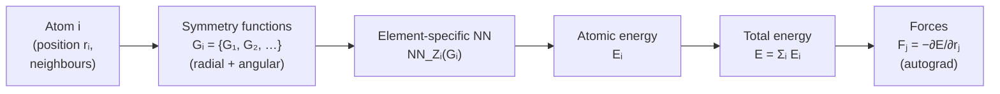

# 9.4 Behler–Parrinello neural networks and Gaussian Approximation Potentials


*Behler–Parrinello architecture. Each atom is encoded by hand-crafted symmetry functions, passed through an element-specific neural network to give an atomic energy, then summed. Forces fall out of autograd on the total energy.*

With a descriptor in hand we need a regression model to map the
descriptor of each atom to its energetic contribution $E_i$. Two
classical choices dominate the pre-equivariant literature:
Behler–Parrinello neural networks (BPNNs), which use a small
feed-forward network per element, and Gaussian Approximation Potentials
(GAP), which use Gaussian process regression on SOAP descriptors. They
illustrate the two main schools of statistical learning — parametric
(neural network) and non-parametric (kernel) — applied to the same
fitting problem.

## 9.4.1 Behler–Parrinello architecture

### Atomic energies via element-specific networks

The Behler–Parrinello architecture writes

$$
U(\{\mathbf{r}_i\}) = \sum_{i=1}^N E_i,
\qquad
E_i = \mathrm{NN}_{Z_i}\!\big(\mathbf{G}_i\big),
$$

where $\mathbf{G}_i$ is the symmetry-function descriptor of atom $i$
(§9.3.1) and $\mathrm{NN}_{Z_i}$ is a small feed-forward neural
network specific to the chemical species $Z_i$ of atom $i$. The
architectural decisions are:

- **One network per element.** Hydrogen has its own network, oxygen
  has its own network. Permutation invariance follows because all
  hydrogens use the same network with the same weights.
- **Atomic energy as a scalar output.** $E_i \in \mathbb{R}$. The
  partition $U = \sum_i E_i$ is exact only in the limit of strictly
  local atomic energies; in practice the cutoff $r_\mathrm{c}$ defines
  what *local* means.
- **Small, fully connected networks.** Two or three hidden layers of
  $30$–$100$ units each is typical. Larger networks easily overfit on
  the modest datasets used in MLIP training (often $10^3$–$10^4$
  configurations).

A minimal forward pass for a single element looks like:

$$
\mathbf{h}^{(1)} = \tanh(W_1 \mathbf{G}_i + \mathbf{b}_1),\quad
\mathbf{h}^{(2)} = \tanh(W_2 \mathbf{h}^{(1)} + \mathbf{b}_2),\quad
E_i = W_3 \mathbf{h}^{(2)} + b_3.
$$

The final linear layer has output dimension $1$. The activation is
typically $\tanh$ for legacy reasons (Behler used it originally);
modern variants use SiLU or softplus, both of which keep the
$C^\infty$ smoothness that forces require.

### Why a small network is enough

The descriptor $\mathbf{G}_i$ already encodes a great deal of the
physics: rotation invariance, permutation invariance, the smooth
cutoff. The neural network's job is only to learn a nonlinear
mapping from descriptor to energy. In practice this mapping is
smooth, low-dimensional, and well within the reach of a few-thousand-
parameter network.

A useful sanity check on a freshly trained BPNN: the
weights-and-biases distributions should look like ordinary
small-network weights ($\mathcal{O}(0.1)$ in magnitude), and the
training loss should plateau in a few hundred epochs on a modest
GPU. If the network needs millions of parameters and weeks to train,
either the descriptor is inadequate or the regression target is.

## 9.4.2 Training a BPNN

### The loss function

Training minimises a weighted sum of energy and force errors over the
training set:

$$
\mathcal{L} \;=\;
   w_E \sum_{s=1}^{S} \frac{1}{N_s} \big(E^\mathrm{pred}_s - E^\mathrm{DFT}_s\big)^2
\;+\; w_F \sum_{s=1}^{S} \frac{1}{3 N_s}
        \sum_{i=1}^{N_s} \big\|\mathbf{F}^\mathrm{pred}_{s,i}
                              - \mathbf{F}^\mathrm{DFT}_{s,i}\big\|^2.
$$

The sum is over structures $s$ in the training set; $N_s$ is the
number of atoms in structure $s$; $w_E$ and $w_F$ are dimensionful
weights (with units of $(\text{atom}/\text{eV})^2$ for the energy
term and $(\text{atom}/(\text{eV}/\text{\AA}))^2$ for the force term)
that balance the two contributions. A typical choice is
$w_E = 1$, $w_F = 100\,\text{\AA}^2$, so that a $1\,\mathrm{meV/atom}$
energy error and a $10\,\mathrm{meV/\text{\AA}}$ force error
contribute equally. Stress terms can be added analogously.

Including forces in the loss is crucial. A given structure provides
one energy label but $3N$ force labels: forces give roughly $3N$ times
more information per DFT call than energies alone. Empirically,
force-trained BPNNs reach the same accuracy with one to two orders of
magnitude less training data than energy-only BPNNs.

### Force derivation by autograd

The force on atom $i$ in structure $s$ is

$$
\mathbf{F}_{s,i} = -\nabla_{\mathbf{r}_i} U_s
                  = -\sum_{j=1}^{N_s} \nabla_{\mathbf{r}_i} E_{s,j}.
$$

Because each $E_j$ depends on positions only via the symmetry-function
descriptor $\mathbf{G}_j$, the chain rule gives

$$
\mathbf{F}_{s,i} = -\sum_j \frac{\partial E_j}{\partial \mathbf{G}_j}
                       \cdot \frac{\partial \mathbf{G}_j}{\partial \mathbf{r}_i}.
$$

The first factor is the gradient of the neural network output with
respect to its input — a single backward pass per atom. The second
factor is the gradient of the descriptor with respect to atomic
positions, an analytical expression for Behler symmetry functions
(differentiate the cosine cutoff, the Gaussian, and any angular
factor). In modern PyTorch implementations one writes the network
forward, calls `torch.autograd.grad(energy, positions,
create_graph=True)` to obtain forces, and then differentiates the
loss through the force computation. The `create_graph=True` flag is
essential — without it the second-order gradient needed for the
force-loss backprop is unavailable.

```python
import torch

def predict_energy_and_forces(positions, model, descriptor_fn):
    positions = positions.requires_grad_(True)
    G = descriptor_fn(positions)             # (N, K) descriptors
    E_atoms = model(G)                       # (N, 1) atomic energies
    E_total = E_atoms.sum()
    forces = -torch.autograd.grad(
        E_total, positions, create_graph=True,
    )[0]
    return E_total, forces
```

The `create_graph=True` carries the computational graph of the force
computation forward so that the loss

```python
loss = w_E * (E_total - E_dft)**2 + w_F * (forces - F_dft).pow(2).sum()
loss.backward()
```

can backpropagate through both energy and force terms. Exercise 9.1
asks you to verify by finite differences that autograd computes the
force correctly.

### Optimisation and regularisation

BPNNs are typically trained with Adam at learning rates of
$10^{-3}$ to $10^{-4}$, decayed by a factor of $\sim\!10$ at the
plateau. Batch sizes are small (a few structures at a time) because
each structure has a different number of atoms; gradient accumulation
keeps effective batch size larger.

Regularisation is mostly implicit, through:

- Early stopping on a held-out validation set. The validation force
  MAE typically drops monotonically for a few hundred epochs, then
  starts to rise — the classical overfitting signature. Stop at the
  minimum.
- Weight decay of $10^{-6}$ to $10^{-4}$.
- An explicit cap on weights, since the cosine activation gives
  exponentially decaying tails and unbounded weights can produce
  artefacts in extrapolation.

!!! tip "Common mistake"
    Training only on energies and then evaluating force accuracy is a
    classical mistake. Energy-trained networks tend to learn smooth
    energy surfaces that happen to fit the training totals but whose
    *gradients* — the forces — are wildly inaccurate. Always train on
    forces, always evaluate on forces.

## 9.4.3 Strengths and limitations of BPNNs

Strengths:

- Simple, transparent, easy to implement from scratch. A complete
  PyTorch BPNN fits in roughly two hundred lines.
- Fast at inference: each network is small and the descriptor is
  cheap to evaluate.
- Established track record on materials problems (water, silicon,
  copper, zinc oxide, lithium-ion electrolytes).
- The element-decomposed structure means new elements can be added
  by training only the relevant networks, leaving others frozen.

Limitations:

- Hand-tuned descriptor parameters. Different problems need
  different $\eta, r_s$ grids; the choice is a research project in
  itself.
- Pure invariance, so the degenerate-environment issue of §9.2.6
  applies.
- Body order limited to three. Distinguishing four-body patterns
  requires either explicit four-body descriptors (e.g. the wACSF
  family) or going to equivariant networks.
- Per-element networks scale awkwardly with the number of element
  types; for high-entropy alloys with $5$+ elements the model becomes
  unwieldy.

For binary or ternary systems with $10^4$ or more training
configurations, BPNNs remain competitive and are still the workhorse
of several production codes (RuNNer, n2p2, aenet).

## 9.4.4 Gaussian Approximation Potentials

GAP, introduced by Bartók et al. in the same 2010 paper that
introduced SOAP, replaces the neural network with a Gaussian process.

### Gaussian process regression in one paragraph

A Gaussian process places a prior over functions: any finite collection
of function values $\{f(\mathbf{x}_1), \dots, f(\mathbf{x}_n)\}$ is
jointly Gaussian with mean $\mathbf{0}$ and covariance
$K_{ij} = k(\mathbf{x}_i, \mathbf{x}_j)$, where $k$ is a chosen
kernel. Conditioning on observed training values yields a Gaussian
posterior over $f(\mathbf{x}^*)$ at any test point. The posterior
mean is the GP prediction; the posterior variance is its uncertainty.
For Gaussian noise on observations, both mean and variance are
closed-form linear-algebra expressions.

For MLIPs, the input $\mathbf{x}$ is the SOAP descriptor of an atomic
environment, the output is the atomic energy, and the kernel is
typically the SOAP kernel itself:

$$
k_\mathrm{SOAP}(\mathbf{x}_i, \mathbf{x}_j) =
   \big( \hat{\mathbf{x}}_i \cdot \hat{\mathbf{x}}_j \big)^\zeta,
$$

with $\zeta \in \{2, 4\}$ controlling the sharpness and the hat
denoting normalisation. The SOAP kernel is itself rotation-invariant
because the SOAP power spectra are.

### The GAP energy

The energy of a configuration is a sum of GP-predicted atomic energies,

$$
U^\mathrm{GAP}(\{\mathbf{r}_i\}) =
  \sum_i E_i
= \sum_i \sum_{m=1}^M \alpha_m\, k_\mathrm{SOAP}(\mathbf{x}_i, \mathbf{x}_m^*),
$$

where $\{\mathbf{x}_m^*\}_{m=1}^M$ are *sparse representative points*
selected from the training set by CUR or farthest-point sampling, and
$\{\alpha_m\}$ are the regression coefficients fitted by ridge
regression on the joint energy-force-stress training labels.

The sparse-GP formulation is essential because full GP regression
scales as $O(n^3)$ in the number of training points $n$ — typically
$10^5$ to $10^6$ atomic environments in an MLIP fit — which is
prohibitive. With $M \approx 1000$ representative points the cost
falls to $O(n M^2)$, manageable on a workstation.

### Forces and stresses

Forces follow by analytical differentiation of the kernel, which is
smooth by construction. Stresses, used for fitting volumetric data,
are obtained from the virial expression
$\sigma_{\alpha\beta} = -\frac{1}{V}\sum_i \mathbf{r}_i \otimes \mathbf{F}_i$.
Each prediction returns not just a value but a posterior variance —
the GAP's confidence in itself at that environment.

### Strengths and limitations

GAP's strengths are remarkable for small datasets:

- **Built-in uncertainty.** The GP posterior variance is a *principled*
  measure of where the model is extrapolating. Configurations with high
  variance are exactly the ones one should add to the training set;
  this is the basis of active learning in Chapter 11.
- **Data efficiency on small problems.** With $\le 1000$ configurations,
  GAP often outperforms neural-network approaches because the GP prior
  is a stronger regulariser than weight decay.
- **No architecture choices.** Kernel form is essentially fixed; the
  only hyperparameters are the sparse-point count $M$, the kernel
  exponent $\zeta$, and SOAP's $N_\mathrm{rad}, \ell_\mathrm{max},
  \sigma_\mathrm{at}$.

Its limitations show up on larger problems:

- **Scaling.** Even with sparse GPs, training cost grows quickly with
  $M$, and inference cost is $O(M)$ per atom (versus
  $O(\text{layers} \times \text{hidden}^2)$ for a neural network with
  the same effective capacity).
- **Single-fidelity training.** Combining DFT data at different levels
  of theory, or mixing energies with experimental data, is awkward
  for a GP and natural for a neural network.
- **Equivariance.** Standard GAP uses the invariant SOAP power
  spectrum; the loss of geometric information of §9.2.6 still applies,
  though it is partially compensated by the high expressiveness of
  the SOAP descriptor.

For these reasons GAP has been displaced from the cutting edge by
equivariant networks but remains the gold standard for
small-data MLIP fits and for any application where uncertainty
estimates matter — most notably active-learning pipelines (Chapter 11).

## 9.4.5 When to use which

A rough decision tree:

- **Dataset of $\sim\!100$ configurations and you need uncertainty**:
  use GAP. It is the data-efficient frontier and gives error bars for
  free.
- **Dataset of $10^3$–$10^4$ configurations of a one- or two-element
  system**: BPNN or GAP both work; BPNN is faster at inference.
- **Dataset of $10^4$+ configurations, multiple elements, accuracy
  critical**: use MACE (or NequIP). The data efficiency of
  equivariant networks dominates above $\sim\!10^3$ configurations.
- **A new chemistry with no data yet**: fine-tune the MACE-MP-0
  foundation model on a small custom set (Chapter 12).

In §9.5 we develop the equivariant architectures that dominate the
modern literature; in §9.6 we train one.
