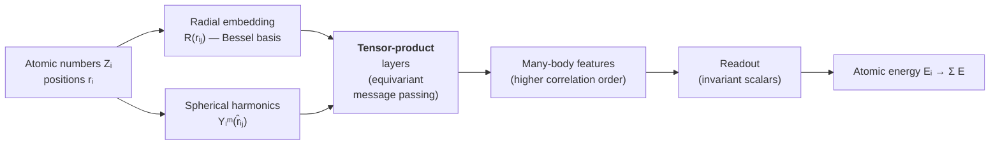

# 9.5 Equivariant networks — NequIP and MACE

*MACE architecture sketch. Radial and spherical features feed equivariant tensor-product layers that grow body-order with each iteration. An invariant readout yields per-atom energies; forces come from autograd.*

The Behler–Parrinello and GAP architectures of §9.4 reduce the local
environment of an atom to a *scalar* descriptor and then regress on
that scalar. As we saw in §9.2.6, this discards geometric information
that is, in principle, available. The equivariant revolution of the
2020s recovers that information by propagating *tensors* — features
indexed by the irreducible representations of $\mathrm{O}(3)$ —
through the network, and combining them with operations that respect
the rotation symmetry exactly. The empirical pay-off is dramatic
gains in data efficiency. This section develops the machinery, sketches
the NequIP and MACE architectures, and reviews the benchmark results
that have driven equivariant networks to dominance.

## 9.5.1 Why equivariance helps

Recall the distinction. An *invariant* feature is a scalar: it does
not change under rotation. An *equivariant* feature transforms
predictably: rotate the input by $R$, the feature rotates by the
matrix representation $D^{(\ell)}(R)$ of $R$ acting on the $\ell$-th
irreducible representation of $\mathrm{O}(3)$.

A scalar can be recovered from an equivariant by taking inner
products, so the equivariant feature carries strictly more
information than the invariant one. The question is whether that
extra information helps in fitting an interatomic potential.

The argument that it does comes in three flavours.

**Theoretical.** Pozdnyakov and Ceriotti showed in 2020 that any
finite collection of two- and three-body invariant scalars suffers
from *degenerate environments*: pairs of geometries that are not
related by rotation but produce identical invariants. The first
explicit examples involved four atoms; with more atoms the
constructions multiply. Equivariant features that propagate direction
information through a network can distinguish such environments and
therefore have an injective representation of geometry in a way that
purely invariant descriptors do not.

**Inductive bias.** The hypothesis class of equivariant functions is
strictly smaller than that of arbitrary functions of $3N$ Cartesian
coordinates. Smaller hypothesis classes, *when they contain the right
function*, need fewer training examples to identify the right
function. Rotation equivariance is provably the right inductive bias
for interatomic potentials (the underlying physics is rotation
covariant), so equivariant networks should — and do — generalise from
less data.

**Empirical.** On the rMD17 benchmark (10-molecule dataset, energies
and forces from DFT), MACE reaches the same accuracy as SchNet (an
invariant network) with roughly 1/20 the training data. On the
Materials Project subset used to train MACE-MP-0, equivariant networks
outperform invariant ones at every fixed training-set size. Section
9.5.5 collects representative numbers.

## 9.5.2 Irreducible representations of $\mathrm{O}(3)$

To make the construction concrete we need a working knowledge of the
$\mathrm{O}(3)$ irreps. They are labelled by a non-negative integer
$\ell \in \{0, 1, 2, \dots\}$ and a parity $p \in \{+1, -1\}$. The
$\ell$-th irrep has dimension $2\ell + 1$ and acts on a
$(2\ell+1)$-dimensional vector space:

- $\ell = 0$: scalars (dim $1$). Rotation acts trivially.
- $\ell = 1$: vectors (dim $3$). Rotation acts as $R \in \mathrm{SO}(3)$.
- $\ell = 2$: symmetric traceless rank-2 tensors (dim $5$).
- $\ell = 3$: rank-3 traceless tensors (dim $7$).

Under parity, an $\ell$-irrep is *even* if $p = (-1)^\ell$ and *odd*
otherwise. Position vectors transform as the *odd* $\ell = 1$ irrep
(parity sends $\mathbf{r} \mapsto -\mathbf{r}$), velocities likewise,
forces likewise. Pseudo-scalars (e.g. magnetic-field components) are
$\ell = 0$ odd.

The canonical basis on the unit sphere is the real spherical
harmonics $Y_\ell^m(\hat{\mathbf{r}})$ for $m = -\ell, \dots, \ell$.
Under rotation,

$$
Y_\ell^m(R^{-1} \hat{\mathbf{r}})
   = \sum_{m'} D^{(\ell)}_{m m'}(R) Y_\ell^{m'}(\hat{\mathbf{r}}),
$$

with $D^{(\ell)}$ the Wigner D-matrix of the rotation. A *feature
vector of irrep order $\ell$* is a $(2\ell+1)$-component object
$\mathbf{x}^{(\ell)} = (x_{-\ell}, \dots, x_\ell)$ that transforms in
the same way.

## 9.5.3 Tensor product and Clebsch–Gordan coupling

The single most important operation in equivariant networks is the
*tensor product* of two irreps. Given $\mathbf{u}^{(\ell_1)}$ and
$\mathbf{v}^{(\ell_2)}$, the product
$\mathbf{u} \otimes \mathbf{v}$ has $(2\ell_1+1)(2\ell_2+1)$ components
and decomposes into a direct sum of irreps:

$$
\ell_1 \otimes \ell_2
   = (\ell_1 + \ell_2) \oplus (\ell_1 + \ell_2 - 1) \oplus
     \cdots \oplus |\ell_1 - \ell_2|.
$$

The projection onto the $\ell$-irrep component is implemented by the
*Clebsch–Gordan symbols* $C^{\ell m}_{\ell_1 m_1; \ell_2 m_2}$, which
form a sparse three-index tensor:

$$
(\mathbf{u}^{(\ell_1)} \otimes \mathbf{v}^{(\ell_2)})^{(\ell)}_m
   = \sum_{m_1 m_2} C^{\ell m}_{\ell_1 m_1; \ell_2 m_2}\,
     u_{m_1}^{(\ell_1)} v_{m_2}^{(\ell_2)}.
$$

These are familiar from atomic physics: they couple two angular
momenta $\ell_1$ and $\ell_2$ to a total angular momentum $\ell$.

The tensor product is the equivariant generalisation of multiplication.
Two scalars multiply to a scalar; a scalar and a vector multiply to a
vector; two vectors multiply to a scalar (dot product, $\ell = 0$),
an axial vector ($\ell = 1$), or a symmetric traceless tensor
($\ell = 2$). Equivariant networks build features by repeatedly
applying tensor products between learned features and the spherical
harmonics of relative atomic positions.

The implementation cost is manageable: the e3nn library (Geiger and
Smidt, 2022) provides efficient sparse contractions for arbitrary
mixtures of irreps, and is the engine under NequIP and MACE.

## 9.5.4 NequIP — equivariant message passing

NequIP (Batzner et al., 2022) is the cleanest equivariant MLIP
architecture and the easiest place to develop intuition before
turning to MACE.

### Atomic features as direct sums of irreps

Each atom $i$ carries a feature

$$
\mathbf{h}_i =
  \bigoplus_{\ell = 0}^{\ell_\mathrm{max}}\bigoplus_{c=1}^{C_\ell}
  \mathbf{h}_i^{(\ell, c)},
$$

a direct sum over irreps $\ell$ and channels $c$. Each
$\mathbf{h}_i^{(\ell, c)}$ has $2\ell+1$ components and transforms as
the $\ell$-th irrep. The initial features at layer $0$ are typically
a one-hot embedding of the chemical species in the $\ell = 0$ channels
and zero in the higher-$\ell$ channels.

### Message construction

For each edge $(i, j)$ in the neighbour list, the message from $j$ to
$i$ is built by tensor-multiplying the sender's feature
$\mathbf{h}_j$ with the spherical harmonics
$Y(\hat{\mathbf{r}}_{ij})$ of the relative direction:

$$
\mathbf{m}_{j \to i}^{(\ell)}
   = \sum_{\ell_1, \ell_2 \to \ell}\;
     \mathrm{MLP}_{\ell_1 \ell_2}(r_{ij})\;
     \big(\mathbf{h}_j^{(\ell_1)}
          \otimes Y^{(\ell_2)}(\hat{\mathbf{r}}_{ij})\big)^{(\ell)}.
$$

Several things are happening here:

1. The *radial part* of the message is a small multilayer perceptron
   that maps the scalar $r_{ij}$ (after a basis expansion such as
   Bessel or Gaussian-radial-basis-functions) to a vector of weights,
   one per output channel and irrep. This is rotation-invariant
   because $r_{ij}$ is a scalar.
2. The *angular part* is the tensor product
   $\mathbf{h}_j^{(\ell_1)} \otimes Y^{(\ell_2)}(\hat{\mathbf{r}}_{ij})$,
   coupled to the output irrep $\ell$ via Clebsch–Gordan. This is
   equivariant by construction.
3. The product of the two — radial scalar times angular tensor — is
   equivariant.

The sum is over all $(\ell_1, \ell_2)$ that couple to $\ell$ under
$\ell_1 \otimes \ell_2 \supset \ell$. In practice one truncates to
$\ell \le \ell_\mathrm{max}$ throughout the network, with
$\ell_\mathrm{max} = 1, 2, 3$ being common.

### Message aggregation and update

Messages are summed over neighbours (permutation invariance),

$$
\mathbf{m}_i^{(\ell)} = \sum_{j \in \mathcal{N}(i)} \mathbf{m}_{j \to i}^{(\ell)},
$$

and combined with the previous-layer feature via a residual update,

$$
\mathbf{h}_i^{(\ell), t+1}
  = \mathbf{h}_i^{(\ell), t}
  + \mathrm{LinearMix}_\ell(\mathbf{m}_i^{(\ell)}, \mathbf{h}_i^{(\ell), t}),
$$

where the linear mix is an equivariant linear map — a learnable matrix
acting only within each $\ell$ channel (mixing across irreps would
break equivariance).

After $T$ layers (typically $T = 3$ to $5$), the scalar ($\ell = 0$)
channels of $\mathbf{h}_i^{(0), T}$ are mapped by a small invariant
MLP to the atomic energy $E_i$. Forces are obtained by autograd on the
total energy, as in §9.4.2.

### Hyperparameters and cost

NequIP has roughly the same hyperparameters as a BPNN — number of
layers, channel widths, learning rate, batch size — plus the new
$\ell_\mathrm{max}$. Setting $\ell_\mathrm{max} = 0$ recovers an
invariant network (SchNet-like); each higher $\ell$ buys accuracy
at modest extra cost (the tensor product kernels are sparse). For
production work $\ell_\mathrm{max} = 1$ is often sufficient, $\ell = 2$
sometimes needed for organic chemistry, $\ell = 3$ rare.

## 9.5.5 MACE — body-order plus equivariance

MACE (Batatia, Kovács, Simm, Ortner, Csányi, 2023) combines NequIP's
equivariant message passing with the body-order machinery of ACE
(§9.3.3). The key innovation is that each MACE layer captures
*high body-order* correlations within a single message-passing step,
rather than relying on many layers of two-body messages.

### Per-layer construction

At layer $t$, MACE constructs two-body messages exactly as in NequIP:
combine the neighbour feature with $Y(\hat{\mathbf{r}}_{ij})$ via a
tensor product, weight by a radial MLP, sum over neighbours. Call
this aggregated two-body message $\mathbf{A}_i^{(t)}$.

Where MACE goes beyond NequIP is the next step: it forms *products*
of $\mathbf{A}_i^{(t)}$ with itself to obtain higher body-order
features:

$$
\mathbf{B}_i^{(\nu, t)}
   = \big(\mathbf{A}_i^{(t)}\big)^{\otimes \nu},
$$

projected onto each output irrep $\ell$. With correlation order
$\nu = 3$, $\mathbf{B}_i^{(3, t)}$ depends on triples of neighbours
and thus carries four-body information about atom $i$ (itself plus
three neighbours) within a single layer. The product is symmetric
under permutation of the neighbours that contributed to
$\mathbf{A}_i$, so permutation invariance is preserved.

The update step then mixes $\mathbf{B}_i^{(\nu, t)}$ for
$\nu = 1, 2, 3$ via a learnable linear combination, applies a
nonlinearity in the scalar channel, and adds to the previous
feature to produce $\mathbf{h}_i^{(t+1)}$. The energy readout uses
the final scalar channels.

The end result: a two-layer MACE network captures up to seven-body
correlations, far more than NequIP needs many layers for. This
translates to faster inference at fixed accuracy and a smaller model
footprint.

### Typical hyperparameters

A canonical MACE training configuration for an organic system might be:

| Hyperparameter | Typical value |
|---|---|
| Cutoff $r_\mathrm{c}$ | 5.0 Å |
| Number of layers | 2 |
| Hidden channels (per irrep) | 128 |
| Maximum irrep $\ell_\mathrm{max}$ | 1 (i.e. up to $\ell=1$) |
| Correlation order $\nu$ | 3 |
| Radial basis | 8 Bessel functions |
| Radial MLP width | 64 |
| Batch size | 5–10 structures |
| Learning rate | $10^{-2}$ to $10^{-3}$ (Adam) |
| Training epochs | 100–500 |

The total parameter count is typically $1$–$5 \times 10^5$ — small by
modern neural-network standards but large enough to fit DFT energy
surfaces to chemical accuracy on $\sim\!1000$ training configurations.

### Locality and message passing

A subtle point: a $T$-layer message-passing network has effective
receptive field $T \times r_\mathrm{c}$, because information
propagates one cutoff per layer. With $T = 2$ and $r_\mathrm{c} = 5\,\text{\AA}$
the effective range is $10\,\text{\AA}$. This is both a benefit (more
context per atom) and a hazard (energy contributions become
non-strictly-local, which can complicate parallel inference on large
systems). For most production work this is a feature; for billion-atom
simulations it requires careful domain decomposition.

## 9.5.6 Benchmark results

The data efficiency of equivariant networks is best illustrated by
the rMD17 benchmark, which records force MAE for ten small organic
molecules trained on small DFT datasets. Representative numbers
(force MAE in $\mathrm{meV}/\text{\AA}$, averaged over molecules,
training-set size 1000 configurations):

| Architecture | Force MAE | Type |
|---|---|---|
| SchNet | 30 | invariant |
| DimeNet | 13 | invariant, 3-body |
| GemNet-T | 6 | invariant, 4-body |
| PaiNN | 5 | partially equivariant |
| NequIP | 3 | fully equivariant |
| MACE | 2 | equivariant + body-order |

The trend is monotone: more equivariance and more body order, less
error per training example. The same pattern holds on materials
benchmarks (the OC20 catalyst dataset, the Materials Project
formation-energy benchmark, the SPICE molecular benchmark), with
absolute numbers shifted by problem-specific factors.

In data-efficiency studies, MACE typically reaches a target force MAE
with 10–30× less training data than SchNet and 5–10× less than
DimeNet. For a researcher facing a fresh chemistry where DFT
calculations cost minutes each, this is the difference between a
month of compute and a day.

## 9.5.7 What we will use

The §9.6 walkthrough uses MACE (specifically the `mace-torch`
package) because it is currently the best documented, fastest, and
most accurate equivariant MLIP available in open source. The
architectural patterns transfer to NequIP, Allegro, SevenNet, and
the other equivariant codes; differences are mostly in the radial
basis, the body-order strategy, and the parallelisation. The
training data, validation methodology, and ASE-integration code in
§9.6 work identically across these architectures with minimal
modification.

A final pedagogical point. Equivariant networks are not magic. They
encode rotation symmetry exactly in the structure of the
representation, which removes the need for the network to learn
it from data. Everything else — body order, locality, smoothness —
must still be designed in. The combination of equivariance and the
body-order expansion is what makes MACE work; either alone is
weaker. As you read the rapidly evolving literature, the question
to ask of each new architecture is: *which symmetries does it
respect exactly, which does it approximate, and what is the
inductive bias for the rest?*
