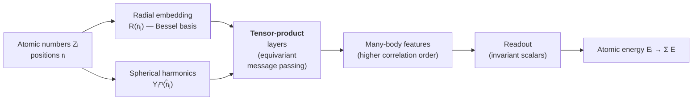

# 9.5 Equivariant networks — NequIP and MACE

*MACE architecture sketch. Radial and spherical features feed equivariant tensor-product layers that grow body-order with each iteration. An invariant readout yields per-atom energies; forces come from autograd.*

The Behler–Parrinello and GAP architectures of §9.4 reduce the local
environment of an atom to a *scalar* descriptor and then regress on
that scalar. As we saw in §9.2.6, this discards geometric information
that is, in principle, available. The equivariant revolution of the
2020s recovers that information by propagating *tensors* — features
indexed by the irreducible representations of $\mathrm{O}(3)$ —
through the network, and combining them with operations that respect
the rotation symmetry exactly. The empirical pay-off is dramatic
gains in data efficiency. This section develops the machinery, sketches
the NequIP and MACE architectures, and reviews the benchmark results
that have driven equivariant networks to dominance.

## 9.5.0 Equivariance from scratch — a worked introduction

This section develops the representation-theoretic machinery of
equivariance in slow, careful detail. Readers familiar with
$\mathrm{O}(3)$ irreps and Clebsch–Gordan coefficients from atomic
physics can skim to §9.5.4. Everyone else: please read this section
carefully. The pay-off is that NequIP and MACE will feel inevitable
rather than mysterious.

### Step 1: what is a representation?

A *representation* of a group $G$ is a map $\rho$ from group elements
to invertible matrices (acting on a vector space $V$) that respects
group multiplication: $\rho(g_1 g_2) = \rho(g_1) \rho(g_2)$. The
vector space $V$ is the *representation space*, and elements
$\mathbf{v} \in V$ are said to *transform under* the representation
$\rho$ if $\mathbf{v} \mapsto \rho(g) \mathbf{v}$ when $g$ acts.

The simplest example: $G = \mathrm{SO}(3)$ (rotations in 3D),
$V = \mathbb{R}^3$, $\rho(R) = R$ (the rotation matrix itself). A
3D vector $\mathbf{v}$ transforms as $\mathbf{v} \mapsto R\mathbf{v}$
under rotation. This is the *defining* representation.

Another example: $G = \mathrm{SO}(3)$, $V = \mathbb{R}$, $\rho(R) = 1$
for all $R$. The 1D space transforms trivially — every "rotation"
maps a number to itself. This is the *trivial* representation, and
its elements are the *scalars*.

A third example: $G = \mathrm{SO}(3)$, $V = $ symmetric traceless
$3 \times 3$ matrices (a 5-dimensional space), $\rho(R)$ acts as
$T \mapsto R T R^\top$. Stress tensors live here.

The conceptual point: vectors of different *types* transform
differently under rotation. Scalars are unmoved; 3-vectors rotate as
$R$; symmetric traceless tensors rotate as $R \otimes R$ (a $5 \times
5$ matrix in suitable basis). The set of vector types forms a
classification of *how things rotate*.

### Step 2: irreducible representations of $\mathrm{O}(3)$

A representation is *irreducible* (an "irrep") if it has no non-trivial
invariant subspace. For $\mathrm{O}(3)$, the irreps are labelled by a
non-negative integer $\ell \in \{0, 1, 2, \dots\}$ (and a parity which
we set aside for clarity). The $\ell$-th irrep has dimension
$2\ell + 1$:

- $\ell = 0$: scalar, dim $1$.
- $\ell = 1$: vector, dim $3$.
- $\ell = 2$: symmetric traceless tensor, dim $5$.
- $\ell = 3$: irreducible rank-3 tensor, dim $7$.
- General $\ell$: dim $2\ell + 1$.

These are *exhaustive*: every representation of $\mathrm{O}(3)$
decomposes as a direct sum of these irreps. So any object that
transforms under rotation can be expressed as a list
$(\mathbf{x}^{(0)}, \mathbf{x}^{(1)}, \mathbf{x}^{(2)}, \dots)$ of
irrep components, where $\mathbf{x}^{(\ell)}$ has $2\ell+1$
components and transforms as the $\ell$-th irrep.

This decomposition is the equivariant network's lingua franca.

### Step 3: spherical harmonics as the canonical basis

The functions on the unit sphere $S^2 \subset \mathbb{R}^3$ form an
infinite-dimensional vector space; how does $\mathrm{O}(3)$ act on
it? A rotation $R$ takes a function $f$ to a function $R f$ defined
by $(R f)(\hat{\mathbf{r}}) = f(R^{-1} \hat{\mathbf{r}})$ — pull back
along the inverse.

This action decomposes the space of sphere-functions into irreps,
each labelled by $\ell$ and spanned by the *spherical harmonics*
$Y_\ell^m(\hat{\mathbf{r}})$ for $m = -\ell, \dots, +\ell$. Explicitly,

$$
Y_0^0(\hat{\mathbf{r}}) = \frac{1}{\sqrt{4\pi}},
$$

$$
Y_1^{-1} = \sqrt{\tfrac{3}{4\pi}}\, y/r,\quad
Y_1^0 = \sqrt{\tfrac{3}{4\pi}}\, z/r,\quad
Y_1^{+1} = -\sqrt{\tfrac{3}{4\pi}}\, x/r
$$

(in the real basis; complex bases differ by phase factors), and
higher $\ell$'s follow from the standard atomic-physics formulae.
Note that $Y_1^{m}$ are essentially the $x, y, z$ components of the
unit vector $\hat{\mathbf{r}}$ — so the $\ell = 1$ spherical
harmonics *are* the position-vector components, up to normalisation.

Under rotation, the spherical harmonics transform within each $\ell$
block:

$$
Y_\ell^m(R^{-1} \hat{\mathbf{r}}) = \sum_{m'} D^{(\ell)}_{m m'}(R)\,
Y_\ell^{m'}(\hat{\mathbf{r}}),
$$

where $D^{(\ell)}(R)$ is the $(2\ell+1) \times (2\ell+1)$ *Wigner
D-matrix*. The Wigner D-matrices are unitary and form a representation
of $\mathrm{O}(3)$ on the $\ell$-irrep space.

The takeaway: spherical harmonics are the *canonical orthonormal
basis* for $\mathrm{O}(3)$-irrep spaces. Any function on the sphere
can be expanded in them, and the expansion coefficients carry definite
irrep labels.

### Step 4: tensor products and Clebsch–Gordan

The *tensor product* of two irreps, $\ell_1$ and $\ell_2$, lives in a
$(2\ell_1 + 1)(2\ell_2 + 1)$-dimensional space. As a representation
of $\mathrm{O}(3)$, this product is *not* irreducible — it decomposes
into a direct sum of irreps:

$$
\ell_1 \otimes \ell_2 = (\ell_1 + \ell_2) \oplus (\ell_1 + \ell_2 - 1) \oplus
   \cdots \oplus |\ell_1 - \ell_2|.
$$

The dimensions work out: $\sum_{\ell = |\ell_1 - \ell_2|}^{\ell_1 +
\ell_2} (2\ell + 1) = (2\ell_1 + 1)(2\ell_2 + 1)$ by a standard
identity.

The *Clebsch–Gordan coefficients* $C^{\ell m}_{\ell_1 m_1; \ell_2 m_2}$
are the basis change from the product basis $|m_1\rangle |m_2\rangle$
to the irrep basis $|\ell, m\rangle$:

$$
|\ell, m\rangle = \sum_{m_1, m_2} C^{\ell m}_{\ell_1 m_1; \ell_2 m_2}
   |m_1\rangle |m_2\rangle.
$$

They are non-zero only when $m = m_1 + m_2$ (azimuthal conservation)
and $|\ell_1 - \ell_2| \leq \ell \leq \ell_1 + \ell_2$ (triangle
inequality). Numerical values are tabulated in any atomic-physics text
or computed by `sympy.physics.wigner.clebsch_gordan`.

The Clebsch–Gordan tensor product is the *equivariant generalisation
of multiplication*. Two scalars ($\ell = 0$) multiply to give a scalar
($\ell = 0$). A scalar and a vector ($\ell = 1$) multiply to give a
vector. Two vectors multiply to give a scalar (dot product, $\ell =
0$), an axial vector (cross product, $\ell = 1$), or a symmetric
traceless tensor ($\ell = 2$) — the standard "tensor product of
vectors" you may remember from electromagnetism or fluid mechanics.

### Step 5: showing the tensor product is equivariant

We claim that combining two equivariant features with a Clebsch–Gordan
contraction produces a new equivariant feature. Let
$\mathbf{u}^{(\ell_1)}$ transform as the $\ell_1$ irrep and
$\mathbf{v}^{(\ell_2)}$ as the $\ell_2$ irrep. Define

$$
w^{(\ell)}_m = \sum_{m_1, m_2} C^{\ell m}_{\ell_1 m_1; \ell_2 m_2}\,
   u^{(\ell_1)}_{m_1}\, v^{(\ell_2)}_{m_2}.
$$

Under rotation, $u_{m_1} \mapsto \sum_{m_1'} D^{(\ell_1)}_{m_1 m_1'}
u_{m_1'}$ and similarly for $v_{m_2}$. So

$$
w^{(\ell)}_m \mapsto \sum_{m_1, m_2, m_1', m_2'}
   C^{\ell m}_{\ell_1 m_1; \ell_2 m_2}
   D^{(\ell_1)}_{m_1 m_1'} D^{(\ell_2)}_{m_2 m_2'}
   u_{m_1'} v_{m_2'}.
$$

A standard Clebsch–Gordan identity reorganises this to

$$
w^{(\ell)}_m \mapsto \sum_{m'} D^{(\ell)}_{m m'}\,
   \big(\sum_{m_1', m_2'} C^{\ell m'}_{\ell_1 m_1'; \ell_2 m_2'}
       u_{m_1'} v_{m_2'}\big)
   = \sum_{m'} D^{(\ell)}_{m m'}\, w^{(\ell)}_{m'}.
$$

So $\mathbf{w}^{(\ell)}$ transforms as the $\ell$-irrep — exactly what
we wanted. The Clebsch–Gordan contraction *preserves* equivariance,
mapping inputs of irreps $\ell_1, \ell_2$ to outputs of irrep $\ell$
in a rotation-covariant way.

This is the algebraic engine of every equivariant neural network. The
e3nn library (Geiger and Smidt, 2022) implements the tensor product
efficiently as a sparse contraction; NequIP and MACE call it.

### Step 6: the canonical "two-body message"

The simplest equivariant message in an MLIP is

$$
\mathbf{m}_{j \to i}^{(\ell)} = R^{(\ell)}(r_{ij})\,
   Y^{(\ell)}(\hat{\mathbf{r}}_{ij}),
$$

where $R^{(\ell)}(r_{ij})$ is a scalar-valued radial function
($\ell = 0$, i.e. a scalar weight) and $Y^{(\ell)}(\hat{\mathbf{r}}_{ij})$
is the $\ell$-th spherical harmonic of the unit vector
$\hat{\mathbf{r}}_{ij}$. The product of a scalar and an $\ell$-irrep
is an $\ell$-irrep, so the message transforms correctly.

This message *encodes the direction from $j$ to $i$* in an
equivariant way: rotate the configuration, the message rotates by the
Wigner D-matrix, no information is lost. Compare with the invariant
descriptor $r_{ij}$, which discards direction entirely.

The summed message $\sum_j \mathbf{m}_{j \to i}$ is then an equivariant
feature of atom $i$, which can be combined with the atom's existing
features via further tensor products to build up the full network.

This is the structure of every equivariant MLIP layer. The details
differ — NequIP couples node features with edge spherical harmonics,
MACE adds symmetric tensor products to raise body order — but the
underlying operation is always the Clebsch–Gordan-contracted tensor
product.

## 9.5.1 Why equivariance helps

Recall the distinction. An *invariant* feature is a scalar: it does
not change under rotation. An *equivariant* feature transforms
predictably: rotate the input by $R$, the feature rotates by the
matrix representation $D^{(\ell)}(R)$ of $R$ acting on the $\ell$-th
irreducible representation of $\mathrm{O}(3)$.

A scalar can be recovered from an equivariant by taking inner
products, so the equivariant feature carries strictly more
information than the invariant one. The question is whether that
extra information helps in fitting an interatomic potential.

The argument that it does comes in three flavours.

**Theoretical.** Pozdnyakov and Ceriotti showed in 2020 that any
finite collection of two- and three-body invariant scalars suffers
from *degenerate environments*: pairs of geometries that are not
related by rotation but produce identical invariants. The first
explicit examples involved four atoms; with more atoms the
constructions multiply. Equivariant features that propagate direction
information through a network can distinguish such environments and
therefore have an injective representation of geometry in a way that
purely invariant descriptors do not.

**Inductive bias.** The hypothesis class of equivariant functions is
strictly smaller than that of arbitrary functions of $3N$ Cartesian
coordinates. Smaller hypothesis classes, *when they contain the right
function*, need fewer training examples to identify the right
function. Rotation equivariance is provably the right inductive bias
for interatomic potentials (the underlying physics is rotation
covariant), so equivariant networks should — and do — generalise from
less data.

**Empirical.** On the rMD17 benchmark (10-molecule dataset, energies
and forces from DFT), MACE reaches the same accuracy as SchNet (an
invariant network) with roughly 1/20 the training data. On the
Materials Project subset used to train MACE-MP-0, equivariant networks
outperform invariant ones at every fixed training-set size. Section
9.5.5 collects representative numbers.

## 9.5.2 Irreducible representations of $\mathrm{O}(3)$

To make the construction concrete we need a working knowledge of the
$\mathrm{O}(3)$ irreps. They are labelled by a non-negative integer
$\ell \in \{0, 1, 2, \dots\}$ and a parity $p \in \{+1, -1\}$. The
$\ell$-th irrep has dimension $2\ell + 1$ and acts on a
$(2\ell+1)$-dimensional vector space:

- $\ell = 0$: scalars (dim $1$). Rotation acts trivially.
- $\ell = 1$: vectors (dim $3$). Rotation acts as $R \in \mathrm{SO}(3)$.
- $\ell = 2$: symmetric traceless rank-2 tensors (dim $5$).
- $\ell = 3$: rank-3 traceless tensors (dim $7$).

Under parity, an $\ell$-irrep is *even* if $p = (-1)^\ell$ and *odd*
otherwise. Position vectors transform as the *odd* $\ell = 1$ irrep
(parity sends $\mathbf{r} \mapsto -\mathbf{r}$), velocities likewise,
forces likewise. Pseudo-scalars (e.g. magnetic-field components) are
$\ell = 0$ odd.

The canonical basis on the unit sphere is the real spherical
harmonics $Y_\ell^m(\hat{\mathbf{r}})$ for $m = -\ell, \dots, \ell$.
Under rotation,

$$
Y_\ell^m(R^{-1} \hat{\mathbf{r}})
   = \sum_{m'} D^{(\ell)}_{m m'}(R) Y_\ell^{m'}(\hat{\mathbf{r}}),
$$

with $D^{(\ell)}$ the Wigner D-matrix of the rotation. A *feature
vector of irrep order $\ell$* is a $(2\ell+1)$-component object
$\mathbf{x}^{(\ell)} = (x_{-\ell}, \dots, x_\ell)$ that transforms in
the same way.

## 9.5.3 Tensor product and Clebsch–Gordan coupling

The single most important operation in equivariant networks is the
*tensor product* of two irreps. Given $\mathbf{u}^{(\ell_1)}$ and
$\mathbf{v}^{(\ell_2)}$, the product
$\mathbf{u} \otimes \mathbf{v}$ has $(2\ell_1+1)(2\ell_2+1)$ components
and decomposes into a direct sum of irreps:

$$
\ell_1 \otimes \ell_2
   = (\ell_1 + \ell_2) \oplus (\ell_1 + \ell_2 - 1) \oplus
     \cdots \oplus |\ell_1 - \ell_2|.
$$

The projection onto the $\ell$-irrep component is implemented by the
*Clebsch–Gordan symbols* $C^{\ell m}_{\ell_1 m_1; \ell_2 m_2}$, which
form a sparse three-index tensor:

$$
(\mathbf{u}^{(\ell_1)} \otimes \mathbf{v}^{(\ell_2)})^{(\ell)}_m
   = \sum_{m_1 m_2} C^{\ell m}_{\ell_1 m_1; \ell_2 m_2}\,
     u_{m_1}^{(\ell_1)} v_{m_2}^{(\ell_2)}.
$$

These are familiar from atomic physics: they couple two angular
momenta $\ell_1$ and $\ell_2$ to a total angular momentum $\ell$.

The tensor product is the equivariant generalisation of multiplication.
Two scalars multiply to a scalar; a scalar and a vector multiply to a
vector; two vectors multiply to a scalar (dot product, $\ell = 0$),
an axial vector ($\ell = 1$), or a symmetric traceless tensor
($\ell = 2$). Equivariant networks build features by repeatedly
applying tensor products between learned features and the spherical
harmonics of relative atomic positions.

The implementation cost is manageable: the e3nn library (Geiger and
Smidt, 2022) provides efficient sparse contractions for arbitrary
mixtures of irreps, and is the engine under NequIP and MACE.

## 9.5.4 NequIP — equivariant message passing

NequIP (Batzner et al., 2022) is the cleanest equivariant MLIP
architecture and the easiest place to develop intuition before
turning to MACE.

### Atomic features as direct sums of irreps

Each atom $i$ carries a feature

$$
\mathbf{h}_i =
  \bigoplus_{\ell = 0}^{\ell_\mathrm{max}}\bigoplus_{c=1}^{C_\ell}
  \mathbf{h}_i^{(\ell, c)},
$$

a direct sum over irreps $\ell$ and channels $c$. Each
$\mathbf{h}_i^{(\ell, c)}$ has $2\ell+1$ components and transforms as
the $\ell$-th irrep. The initial features at layer $0$ are typically
a one-hot embedding of the chemical species in the $\ell = 0$ channels
and zero in the higher-$\ell$ channels.

### Message construction

For each edge $(i, j)$ in the neighbour list, the message from $j$ to
$i$ is built by tensor-multiplying the sender's feature
$\mathbf{h}_j$ with the spherical harmonics
$Y(\hat{\mathbf{r}}_{ij})$ of the relative direction:

$$
\mathbf{m}_{j \to i}^{(\ell)}
   = \sum_{\ell_1, \ell_2 \to \ell}\;
     \mathrm{MLP}_{\ell_1 \ell_2}(r_{ij})\;
     \big(\mathbf{h}_j^{(\ell_1)}
          \otimes Y^{(\ell_2)}(\hat{\mathbf{r}}_{ij})\big)^{(\ell)}.
$$

Several things are happening here:

1. The *radial part* of the message is a small multilayer perceptron
   that maps the scalar $r_{ij}$ (after a basis expansion such as
   Bessel or Gaussian-radial-basis-functions) to a vector of weights,
   one per output channel and irrep. This is rotation-invariant
   because $r_{ij}$ is a scalar.
2. The *angular part* is the tensor product
   $\mathbf{h}_j^{(\ell_1)} \otimes Y^{(\ell_2)}(\hat{\mathbf{r}}_{ij})$,
   coupled to the output irrep $\ell$ via Clebsch–Gordan. This is
   equivariant by construction.
3. The product of the two — radial scalar times angular tensor — is
   equivariant.

The sum is over all $(\ell_1, \ell_2)$ that couple to $\ell$ under
$\ell_1 \otimes \ell_2 \supset \ell$. In practice one truncates to
$\ell \le \ell_\mathrm{max}$ throughout the network, with
$\ell_\mathrm{max} = 1, 2, 3$ being common.

### Message aggregation and update

Messages are summed over neighbours (permutation invariance),

$$
\mathbf{m}_i^{(\ell)} = \sum_{j \in \mathcal{N}(i)} \mathbf{m}_{j \to i}^{(\ell)},
$$

and combined with the previous-layer feature via a residual update,

$$
\mathbf{h}_i^{(\ell), t+1}
  = \mathbf{h}_i^{(\ell), t}
  + \mathrm{LinearMix}_\ell(\mathbf{m}_i^{(\ell)}, \mathbf{h}_i^{(\ell), t}),
$$

where the linear mix is an equivariant linear map — a learnable matrix
acting only within each $\ell$ channel (mixing across irreps would
break equivariance).

After $T$ layers (typically $T = 3$ to $5$), the scalar ($\ell = 0$)
channels of $\mathbf{h}_i^{(0), T}$ are mapped by a small invariant
MLP to the atomic energy $E_i$. Forces are obtained by autograd on the
total energy, as in §9.4.2.

### Hyperparameters and cost

NequIP has roughly the same hyperparameters as a BPNN — number of
layers, channel widths, learning rate, batch size — plus the new
$\ell_\mathrm{max}$. Setting $\ell_\mathrm{max} = 0$ recovers an
invariant network (SchNet-like); each higher $\ell$ buys accuracy
at modest extra cost (the tensor product kernels are sparse). For
production work $\ell_\mathrm{max} = 1$ is often sufficient, $\ell = 2$
sometimes needed for organic chemistry, $\ell = 3$ rare.

## 9.5.5 MACE — body-order plus equivariance

MACE (Batatia, Kovács, Simm, Ortner, Csányi, 2023) combines NequIP's
equivariant message passing with the body-order machinery of ACE
(§9.3.3). The key innovation is that each MACE layer captures
*high body-order* correlations within a single message-passing step,
rather than relying on many layers of two-body messages.

### MACE step by step

Let us trace one forward pass of a MACE network on a small example to
build intuition. Consider a single carbon atom $i$ with four hydrogen
neighbours arranged in a tetrahedron (methane CH$_4$). We walk through
the layers.

**Initial features (layer 0).** Each atom carries a learnable embedding
indexed by element: a vector $\mathbf{h}_i^{(\ell=0), t=0}$ in the
$\ell = 0$ (scalar) channels, of dimension $C_0$ (typically 128). The
embedding for carbon is initialised distinct from that for hydrogen.
Higher-$\ell$ channels are zero at layer 0.

**Build edge features.** For each neighbour $j$, compute:
- Radial features: $R(r_{ij}) \in \mathbb{R}^{N_\mathrm{rad}}$, a basis
  of $N_\mathrm{rad}$ Bessel or polynomial radial functions evaluated
  at the scalar distance $r_{ij}$. This is rotation-invariant.
- Angular features: $Y^{(\ell)}(\hat{\mathbf{r}}_{ij})$ for $\ell = 0,
  \dots, \ell_\mathrm{max}$, the spherical harmonics of the unit
  direction. The $\ell$-th block transforms as the $\ell$-irrep.

**Construct two-body messages.** Combine the sender feature
$\mathbf{h}_j$ with the angular spherical harmonic
$Y(\hat{\mathbf{r}}_{ij})$ via a tensor product, weighted by a learned
linear map of the radial features:

$$
\mathbf{m}_{j \to i}^{(\ell)}
   = \sum_{\ell_1, \ell_2 \to \ell} W_{\ell_1 \ell_2}(R(r_{ij}))\,
     \big(\mathbf{h}_j^{(\ell_1)} \otimes Y^{(\ell_2)}(\hat{\mathbf{r}}_{ij})\big)^{(\ell)}.
$$

For our methane example, with $\ell_\mathrm{max} = 1$ and only
$\ell = 0$ channels in $\mathbf{h}_j$ at layer 0, the only allowed
couplings produce $\ell = 0$ (from $0 \otimes 0$) or $\ell = 1$ (from
$0 \otimes 1$). The output $\mathbf{m}_{j \to i}^{(\ell=0)}$ is a
scalar; $\mathbf{m}_{j \to i}^{(\ell=1)}$ is a vector pointing along
$\hat{\mathbf{r}}_{ij}$.

**Aggregate over neighbours.** Sum:

$$
\mathbf{A}_i^{(\ell)} = \sum_{j \in \mathcal{N}(i)} \mathbf{m}_{j \to i}^{(\ell)}.
$$

For methane, $\mathbf{A}_i^{(\ell=1)} = \sum_j R^{(1)}(r_{ij})
\hat{\mathbf{r}}_{ij}$. The four unit vectors in a regular tetrahedron
sum to zero by symmetry — so $\mathbf{A}_i^{(\ell=1)} = 0$ for a
perfect tetrahedron. The $\ell = 1$ feature *encodes the asymmetry of
the local environment*, vanishing for symmetric environments and
non-zero for asymmetric ones. This is the kind of geometric
sensitivity equivariant features provide.

**Symmetric tensor product (the MACE-specific step).** Form products
$\mathbf{A}_i^{(\ell)} \otimes \mathbf{A}_i^{(\ell)} \otimes \cdots$
($\nu$ copies, symmetrised) and project onto each output irrep:

$$
\mathbf{B}_i^{(\nu, t)} = \big(\mathbf{A}_i^{(t)}\big)^{\otimes_\mathrm{sym} \nu}.
$$

With $\nu = 3$, this gives features sensitive to *triples* of
neighbours simultaneously — four-body correlations within a single
layer. By contrast, NequIP needs $\nu$ separate message-passing layers
to reach the same body order, with the corresponding $\nu \times
r_\mathrm{c}$ receptive field expansion.

**Update.** Mix $\mathbf{B}_i^{(\nu)}$ for $\nu = 1, 2, 3$ via a
learnable linear combination within each $\ell$ channel, apply a
nonlinearity in the scalar channel, and add to the previous feature:

$$
\mathbf{h}_i^{(t+1)} = \mathbf{h}_i^{(t)} +
   \mathrm{LinearMix}\big(\mathbf{B}_i^{(1)}, \mathbf{B}_i^{(2)}, \mathbf{B}_i^{(3)}\big).
$$

**Readout.** After $T$ layers (typically $T = 2$), pass the $\ell = 0$
component of $\mathbf{h}_i^{(T)}$ through a small MLP to produce the
atomic energy $E_i$. Sum over atoms: $U = \sum_i E_i$. Forces:
autograd on $U$.

### Per-layer construction

At layer $t$, MACE constructs two-body messages exactly as in NequIP:
combine the neighbour feature with $Y(\hat{\mathbf{r}}_{ij})$ via a
tensor product, weight by a radial MLP, sum over neighbours. Call
this aggregated two-body message $\mathbf{A}_i^{(t)}$.

Where MACE goes beyond NequIP is the next step: it forms *products*
of $\mathbf{A}_i^{(t)}$ with itself to obtain higher body-order
features:

$$
\mathbf{B}_i^{(\nu, t)}
   = \big(\mathbf{A}_i^{(t)}\big)^{\otimes \nu},
$$

projected onto each output irrep $\ell$. With correlation order
$\nu = 3$, $\mathbf{B}_i^{(3, t)}$ depends on triples of neighbours
and thus carries four-body information about atom $i$ (itself plus
three neighbours) within a single layer. The product is symmetric
under permutation of the neighbours that contributed to
$\mathbf{A}_i$, so permutation invariance is preserved.

The update step then mixes $\mathbf{B}_i^{(\nu, t)}$ for
$\nu = 1, 2, 3$ via a learnable linear combination, applies a
nonlinearity in the scalar channel, and adds to the previous
feature to produce $\mathbf{h}_i^{(t+1)}$. The energy readout uses
the final scalar channels.

The end result: a two-layer MACE network captures up to seven-body
correlations, far more than NequIP needs many layers for. This
translates to faster inference at fixed accuracy and a smaller model
footprint.

### Typical hyperparameters

A canonical MACE training configuration for an organic system might be:

| Hyperparameter | Typical value |
|---|---|
| Cutoff $r_\mathrm{c}$ | 5.0 Å |
| Number of layers | 2 |
| Hidden channels (per irrep) | 128 |
| Maximum irrep $\ell_\mathrm{max}$ | 1 (i.e. up to $\ell=1$) |
| Correlation order $\nu$ | 3 |
| Radial basis | 8 Bessel functions |
| Radial MLP width | 64 |
| Batch size | 5–10 structures |
| Learning rate | $10^{-2}$ to $10^{-3}$ (Adam) |
| Training epochs | 100–500 |

The total parameter count is typically $1$–$5 \times 10^5$ — small by
modern neural-network standards but large enough to fit DFT energy
surfaces to chemical accuracy on $\sim\!1000$ training configurations.

### Body order vs depth — the key trade-off

A useful way to see what MACE buys you is to count *correlations
per layer*. In a standard message-passing network like SchNet or
NequIP with two-body messages only, each layer increases the effective
body order by one (atom $i$ + neighbour + neighbour-of-neighbour +
...). To reach body order $\nu$, one needs $\nu - 1$ layers, each
costing one cutoff-radius step in receptive field. Six-body
correlations need five layers, an effective range of $5 r_\mathrm{c}$.

In MACE, the in-layer symmetric tensor product raises the body order
by $(\nu_\mathrm{layer} - 1)$ in a single layer. With
$\nu_\mathrm{layer} = 3$, two layers reach body order
$1 + 2 \cdot (3 - 1) = 5$, comfortably covering five-body
correlations. The effective receptive field is only $2 r_\mathrm{c}$,
which is a major advantage for parallel inference on large systems
(short halo regions).

Mathematically: the depth $T$ and the layer body order
$\nu_\mathrm{layer}$ are *partially substitutable*. MACE trades depth
for layer body order; NequIP trades layer body order for depth. The
total expressive power at fixed body order is similar; the parallel
efficiency and the receptive field structure differ.

For most production work, two MACE layers with $\nu_\mathrm{layer}
= 3$ outperform six NequIP layers in both accuracy per parameter and
inference speed. This is the empirical lesson of the rMD17 and
SPICE benchmarks.

!!! note "Why this step? The body-order receptive field equation"
    A message-passing layer with maximum in-layer correlation order
    $\nu_\mathrm{layer}$ contributes $(\nu_\mathrm{layer} - 1)$ to the
    body order of each atom's feature, *for each pass through the
    layer*. After $T$ layers, the body order reached is

    $$
    \nu_\mathrm{total} = 1 + T \cdot (\nu_\mathrm{layer} - 1).
    $$

    For SchNet/NequIP (two-body messages, $\nu_\mathrm{layer} = 2$),
    $\nu_\mathrm{total} = T + 1$ — body order grows linearly with
    depth. For MACE ($\nu_\mathrm{layer} = 3$), $\nu_\mathrm{total}
    = 2T + 1$ — body order grows twice as fast with depth.

    This is the key formula to keep in mind when deciding network
    depth. To reach body order 5 (which is typically sufficient for
    even complex organic chemistry), NequIP needs $T = 4$ layers,
    MACE needs $T = 2$ layers. Halving the depth at fixed expressive
    power is the engineering pay-off.

### MACE empirical benchmarks

For concreteness, here are representative numbers from the MACE paper
(Batatia et al., 2023) and follow-ups, on the rMD17 benchmark (10
small organic molecules, force MAE in meV/Å, train size 1000):

| Architecture | Aspirin | Ethanol | Naphthalene | Salicylic acid | Toluene |
|---|---|---|---|---|---|
| SchNet (2017) | 35 | 17 | 31 | 30 | 21 |
| DimeNet (2020) | 16 | 8 | 13 | 14 | 9 |
| NequIP $\ell=3$ (2022) | 5.7 | 2.3 | 3.6 | 5.4 | 2.4 |
| MACE $\ell=3, \nu=3$ (2023) | 5.4 | 2.1 | 3.0 | 4.6 | 2.1 |

The trend: each generation roughly halves the error per training
example. MACE achieves rMD17 force MAE below $5\,\mathrm{meV}/\text{\AA}$
with $1000$ configurations — typically only a $0.5\,\mathrm{meV}/\text{atom}$
in energy and a few percent in DFT spectroscopic observables.

To put the data efficiency in absolute terms: on the aspirin molecule,
MACE reaches $5\,\mathrm{meV}/\text{\AA}$ force MAE with $\sim 300$
configurations; SchNet requires $\sim 10\,000$ for the same accuracy.
For DFT calculations costing $\sim 1\,\text{CPU-hour}$ each, this is
the difference between a day and a month of compute.

### Locality and message passing

A subtle point: a $T$-layer message-passing network has effective
receptive field $T \times r_\mathrm{c}$, because information
propagates one cutoff per layer. With $T = 2$ and $r_\mathrm{c} = 5\,\text{\AA}$
the effective range is $10\,\text{\AA}$. This is both a benefit (more
context per atom) and a hazard (energy contributions become
non-strictly-local, which can complicate parallel inference on large
systems). For most production work this is a feature; for billion-atom
simulations it requires careful domain decomposition.

## 9.5.6 Benchmark results

The data efficiency of equivariant networks is best illustrated by
the rMD17 benchmark, which records force MAE for ten small organic
molecules trained on small DFT datasets. Representative numbers
(force MAE in $\mathrm{meV}/\text{\AA}$, averaged over molecules,
training-set size 1000 configurations):

| Architecture | Force MAE | Type |
|---|---|---|
| SchNet | 30 | invariant |
| DimeNet | 13 | invariant, 3-body |
| GemNet-T | 6 | invariant, 4-body |
| PaiNN | 5 | partially equivariant |
| NequIP | 3 | fully equivariant |
| MACE | 2 | equivariant + body-order |

The trend is monotone: more equivariance and more body order, less
error per training example. The same pattern holds on materials
benchmarks (the OC20 catalyst dataset, the Materials Project
formation-energy benchmark, the SPICE molecular benchmark), with
absolute numbers shifted by problem-specific factors.

In data-efficiency studies, MACE typically reaches a target force MAE
with 10–30× less training data than SchNet and 5–10× less than
DimeNet. For a researcher facing a fresh chemistry where DFT
calculations cost minutes each, this is the difference between a
month of compute and a day.

## 9.5.7 What we will use

The §9.6 walkthrough uses MACE (specifically the `mace-torch`
package) because it is currently the best documented, fastest, and
most accurate equivariant MLIP available in open source. The
architectural patterns transfer to NequIP, Allegro, SevenNet, and
the other equivariant codes; differences are mostly in the radial
basis, the body-order strategy, and the parallelisation. The
training data, validation methodology, and ASE-integration code in
§9.6 work identically across these architectures with minimal
modification.

A final pedagogical point. Equivariant networks are not magic. They
encode rotation symmetry exactly in the structure of the
representation, which removes the need for the network to learn
it from data. Everything else — body order, locality, smoothness —
must still be designed in. The combination of equivariance and the
body-order expansion is what makes MACE work; either alone is
weaker. As you read the rapidly evolving literature, the question
to ask of each new architecture is: *which symmetries does it
respect exactly, which does it approximate, and what is the
inductive bias for the rest?*

## 9.5.7a NequIP versus MACE in one table

| Property | NequIP | MACE |
|---|---|---|
| Per-layer body order | 2 (two-body messages only) | up to 4 (correlation $\nu=3$) |
| Layers to reach body order 5 | 4 | 2 |
| Receptive field at $r_\mathrm{c}=5$ Å | 20 Å | 10 Å |
| rMD17 aspirin force MAE (1000 train) | 5.7 meV/Å | 5.4 meV/Å |
| Parameters | $\sim 10^5$–$10^6$ | $\sim 10^5$–$10^6$ |
| Inference per atom (RTX 4090) | $\sim 50\,\mu$s | $\sim 30\,\mu$s |
| Implementation maturity | Reference: `nequip` | Reference: `mace-torch` |

The architectures are more similar than different — both build on
tensor products of equivariant features, both train via autograd on
energy and force losses, both inherit the same Bessel/cosine radial
basis. The differences are in the *internal scheduling of body
order*: NequIP grows it through depth, MACE through per-layer
correlation. For most practical purposes the answer is "either works";
MACE has a small efficiency edge and is currently better documented.

## 9.5.8 A small worked example of the tensor product

To make the tensor-product machinery concrete, here is a worked
example. Take two equivariant features: a vector $\mathbf{u}^{(1)} =
(1, 0, 0)$ (an $\ell = 1$ irrep pointing along $\hat{x}$) and another
vector $\mathbf{v}^{(1)} = (0, 1, 0)$ (along $\hat{y}$). We compute
their tensor product and decompose it into irreps.

In the complex spherical basis ($Y_1^{m}$ for $m = -1, 0, 1$), these
vectors have components $u_{-1} = (1 + 0i)/\sqrt{2}$, $u_0 = 0$,
$u_{+1} = (-1 + 0i)/\sqrt{2}$ for $\mathbf{u}$ (along $x$), and
similar for $\mathbf{v}$. The tensor product is the 9-dimensional
object $u_{m_1} v_{m_2}$.

The decomposition $1 \otimes 1 = 0 \oplus 1 \oplus 2$ gives three
output irreps. The $\ell = 0$ component is

$$
(\mathbf{u} \otimes \mathbf{v})^{(0)}_0 = \sum_{m_1 + m_2 = 0}
C^{0 0}_{1 m_1; 1 m_2}\, u_{m_1} v_{m_2}
= \frac{1}{\sqrt{3}}(u_{-1} v_{+1} - u_0 v_0 + u_{+1} v_{-1}).
$$

Plugging in: $u_{-1} v_{+1} = (1/\sqrt{2})(-1/\sqrt{2}) = -1/2$,
$u_0 v_0 = 0$, $u_{+1} v_{-1} = (-1/\sqrt{2})(1/\sqrt{2}) = -1/2$.
So $(\mathbf{u} \otimes \mathbf{v})^{(0)}_0 = (-1/2 - 0 - 1/2)/\sqrt{3}
= -1/\sqrt{3}$.

The conventional dot product $\mathbf{u} \cdot \mathbf{v} = 1 \times
0 + 0 \times 1 + 0 \times 0 = 0$. The $\ell = 0$ tensor-product
component is *proportional to the dot product* (up to a factor of
$-1/\sqrt{3}$ from the Clebsch–Gordan convention), confirming the
heuristic that "two vectors contracted to a scalar = dot product".

The $\ell = 1$ component (axial vector) is proportional to the cross
product $\mathbf{u} \times \mathbf{v} = (0, 0, 1)$, again up to
normalisation. The $\ell = 2$ component is a symmetric traceless
$3 \times 3$ tensor (the rank-2 part of $\mathbf{u} \otimes
\mathbf{v}$).

A modern implementation hides all this with a single call to
`e3nn.o3.TensorProduct`, which takes the input irrep specifications
and an output irrep specification and produces the tensor-product
layer. Internally it consults a Clebsch–Gordan table and emits a
sparse contraction; the user does not see the indices.

But the *operational meaning* of the tensor product — dot product,
cross product, symmetric tensor, all in one operation — is the same
in atomistic equivariant networks as in classical electromagnetism.
The notation is more abstract; the physics is identical.

## 9.5.9 Building intuition: an equivariant feature catalogue

It helps to enumerate what equivariant features of various irrep
labels physically represent in the local atomic environment.

- **$\ell = 0$ scalars.** Counts of neighbours, distances, energies,
  partial charges. The standard descriptor outputs.
- **$\ell = 1$ vectors.** The local *net displacement* of neighbours
  (zero for symmetric environments, non-zero for asymmetric ones).
  Local dipole moments. Per-atom force vectors are precisely $\ell = 1$
  features of the energy network's output. Local velocity if the
  network is run over a trajectory.
- **$\ell = 2$ symmetric traceless tensors.** Local *quadrupole
  moments*. Strain tensors. The asymmetry of a local environment
  along principal axes (e.g. distinguishing a prolate from an oblate
  arrangement of neighbours).
- **$\ell = 3$ and higher.** Higher angular structure. Octupoles,
  hexadecapoles. Most production work truncates at $\ell = 1$ or
  $\ell = 2$ because the marginal returns of $\ell = 3$ are small for
  typical chemistries.

The pattern: each higher $\ell$ captures finer angular structure of
the local environment. For systems with strong angular features
(transition metals with $d$-orbital character, organic molecules with
sp$^3$/sp$^2$ hybridisation distinctions, ionic systems with crystal
field), higher $\ell$ pays off. For weakly anisotropic systems (noble
gas crystals, simple liquids), $\ell = 1$ suffices.

The MACE convention `hidden_irreps = "128x0e + 128x1o"` (128 channels
of even scalars, 128 of odd vectors) is the right default for most
condensed-matter problems. Adding `+ 128x2e` (even rank-2 tensors)
extends to organic chemistry; extending further is rarely useful.
