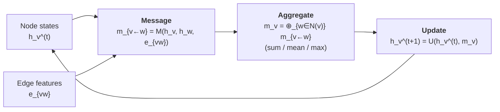

# 10.2 Message Passing

<figure markdown>

<figcaption>One layer of message passing on a graph. Current node states and edge features are combined by a message function into a message from each neighbour; all incoming messages at a node are aggregated by a permutation-invariant operation such as sum, mean or max; and an update function combines the aggregated message with the old node state to produce the new node state. Stacking such layers grows the receptive field.</figcaption>
</figure>

In 2017 Gilmer and co-workers, working on molecular property prediction,
observed something subtle. The half-dozen graph neural networks then in
circulation — convolutional graph nets, gated graph nets, interaction
networks, edge-conditioned convolutions, MPNN, neural fingerprints —
looked superficially different but operated on the same template. They
all updated each node's hidden state by aggregating information from its
neighbours and then applying a per-node nonlinearity. The differences
were details: what exactly was aggregated, how it was combined, whether
edge features participated, whether attention or gating was used.

The paper that codified this observation gave the template a name:
*message-passing neural network*, or MPNN. Almost every architecture
relevant to materials — SchNet, CGCNN, MEGNet, NequIP, ALIGNN, M3GNet,
MACE — is an instance of the MPNN abstraction. Understanding the
abstraction is therefore the right investment: once it is internalised,
the literature reads as a catalogue of design choices rather than a
proliferation of unrelated networks.

!!! note "Key Idea (Box 10.2.A)"
    Every modern GNN is a *message-passing neural network* (MPNN): at
    each layer $t$, each node aggregates messages from its neighbours
    via a permutation-invariant operation, then updates its state.
    Equations (10.1)–(10.3) specify the whole framework; specialising
    $M_t, U_t, R$ to particular forms recovers every architecture in
    the chapter.

## 10.2.1 The abstract framework

We are given a graph $G = (V, E)$ with node features
$h_v^{(0)} \in \mathbb{R}^{d_V}$ for each $v \in V$, and edge features
$e_{uv} \in \mathbb{R}^{d_E}$ for each edge $(u, v) \in E$. An MPNN is
defined by two families of learnable functions, $M_t$ and $U_t$,
indexed by a layer counter $t = 0, 1, \ldots, T - 1$. At each layer we
perform a two-step update.

**Step 1 — Compute messages and aggregate.** For each node $v$, compute
the incoming message from each neighbour $u \in \mathcal{N}(v)$ and sum
them:
$$
m_v^{(t+1)} = \sum_{u \in \mathcal{N}(v)} M_t\!\left(h_v^{(t)}, h_u^{(t)}, e_{uv}\right).
\tag{10.1}
$$
The function $M_t$ — the *message function* — is a small neural network
that takes the central node's state, the neighbour's state and the edge
feature, and returns a vector in $\mathbb{R}^{d_V}$. The sum is taken
over all incoming neighbours of $v$.

**Step 2 — Update the node state.** Combine the central node's previous
state with the aggregated message:
$$
h_v^{(t+1)} = U_t\!\left(h_v^{(t)}, m_v^{(t+1)}\right).
\tag{10.2}
$$
The function $U_t$ — the *update function* — is another small neural
network. In the simplest case it is a feed-forward layer applied to the
concatenation $[h_v^{(t)}; m_v^{(t+1)}]$; in gated variants it is a GRU
cell that respects the recurrent flavour of the update.

After $T$ rounds of updates we have a final set of node embeddings
$\{h_v^{(T)}\}_{v \in V}$. To predict a graph-level scalar — a formation
energy, a band gap — we apply a *readout*:
$$
\hat{y} = R\!\left(\{h_v^{(T)} : v \in V\}\right),
\tag{10.3}
$$
where $R$ is permutation-invariant in its arguments. The standard
choices are summation, mean, or a more elaborate set2set or attention
pooling.

That is the entire framework. Three equations, three learnable
ingredients ($M_t$, $U_t$, $R$). Specialising those three to particular
forms recovers essentially every GNN in the literature.

!!! example "One layer by hand: a three-node graph"
    Consider a path graph with nodes $V = \{1, 2, 3\}$ and undirected
    edges $\{(1,2), (2,3)\}$. Take $d_V = 1$, initial node features
    $h_1^{(0)} = 0.5$, $h_2^{(0)} = 1.0$, $h_3^{(0)} = -0.2$, edge
    features $e_{12} = e_{23} = 1.0$ (constant), and the simplest
    message and update,
    $$
    M(h_v, h_u, e_{uv}) = h_u + e_{uv}, \qquad
    U(h_v, m_v) = h_v + 0.5 \, m_v.
    $$
    Treating edges as undirected (so each edge contributes a message in
    both directions), the neighbour sets are
    $\mathcal{N}(1) = \{2\}$, $\mathcal{N}(2) = \{1, 3\}$,
    $\mathcal{N}(3) = \{2\}$.

    Step 1 — messages and aggregation.
    $$
    m_1 = h_2 + e_{12} = 2.0, \quad
    m_2 = (h_1 + e_{12}) + (h_3 + e_{23}) = 2.3, \quad
    m_3 = h_2 + e_{23} = 2.0.
    $$

    Step 2 — update.
    $$
    h_1^{(1)} = 0.5 + 0.5 \cdot 2.0 = 1.5, \quad
    h_2^{(1)} = 1.0 + 0.5 \cdot 2.3 = 2.15, \quad
    h_3^{(1)} = -0.2 + 0.5 \cdot 2.0 = 0.8.
    $$

    After one MPNN layer, every node has absorbed information from its
    immediate neighbours; after a second pass, node 1 would also see
    node 3 indirectly through node 2. This is the *receptive field*
    argument formalised in §10.2.5.

## 10.2.2 Example: a graph convolution

To anchor the abstraction in something concrete, consider the simplest
non-trivial MPNN — the graph convolution of Kipf and Welling (2017),
adapted slightly. Take
$$
M_t(h_v, h_u, e_{uv}) = W_t h_u,
\qquad
U_t(h_v, m_v) = \sigma\!\left(W_t' h_v + m_v\right),
$$
where $W_t, W_t' \in \mathbb{R}^{d_V \times d_V}$ are learnable matrices
and $\sigma$ a pointwise nonlinearity. Edge features are ignored. The
message from $u$ to $v$ is a linear projection of $u$'s state; the
update is a residual-style addition. Read out with a sum, attach a
linear head, and you have a working node-aggregation network. It is
unsuitable for crystals — the lack of distance dependence is fatal —
but it shows how minimal an MPNN can be.

!!! example "Numerical walkthrough: graph convolution on a triangle"
    Three nodes $V = \{1, 2, 3\}$ form a triangle: edges in both
    directions between every pair. Take $d_V = 2$, initial states
    $h_1^{(0)} = (1, 0)$, $h_2^{(0)} = (0, 1)$, $h_3^{(0)} = (1, 1)$,
    weight matrix $W = \mathrm{diag}(0.5, 0.5)$, and $\sigma$ the
    identity (for clarity).

    Aggregated message at node 1 (sum over neighbours 2 and 3):
    $W h_2 + W h_3 = (0, 0.5) + (0.5, 0.5) = (0.5, 1.0)$.
    The update is $\sigma(W' h_1 + m_1) = (0.5, 0) + (0.5, 1.0) = (1.0, 1.0)$,
    assuming $W' = W$. Similarly $h_2^{(1)} = (1.0, 1.0)$ and
    $h_3^{(1)} = (1.5, 1.0)$.

    After one layer node 3, which started as the "odd one out" with
    larger total magnitude, has retained its distinction. After more
    layers, however, all three converge towards the same average
    embedding — the over-smoothing prediction in miniature.

For CGCNN, MEGNet and SchNet the message function will involve the
edge feature explicitly:
$$
M_t(h_v, h_u, e_{uv}) = \phi\!\left( W h_u \odot \psi(e_{uv}) \right),
$$
where $\psi$ is a small MLP acting on the Gaussian-expanded distance
and $\odot$ is elementwise multiplication. This is the *continuous-filter
convolution* idea: the edge feature modulates the message, so a long
bond carries less information than a short one — automatically, with
parameters learned from data.

## 10.2.3 Permutation invariance, for free

A non-negotiable requirement for any graph model is that its output not
depend on the order in which we wrote down the nodes. Atom 17 and atom
42 might exchange labels under a relabelling; no observable property of
the crystal changes. Formally, if $\pi$ is any permutation of $V$ and we
apply it consistently to $h_v$ and to the edge index, the model output
must be invariant.

The MPNN framework gives this for free, by construction. Examine the
two update equations.

Equation (10.1) sums $M_t$-values over the neighbour set. Summation is
*commutative and associative*: relabelling the neighbours $u$ does not
change the result, because the sum does not depend on the order of
summation. Therefore $m_v^{(t+1)}$ is invariant to any permutation that
fixes $v$ — it depends only on the unordered multiset of neighbour
states.

Equation (10.2) operates on $h_v$ and $m_v$ alone, no neighbour ordering
involved. So $h_v^{(t+1)}$ is invariant to neighbour permutations as well.

Finally the readout in (10.3) is required to be permutation-invariant
across nodes. Summation and mean satisfy this trivially. Therefore the
entire model output is invariant under any global node permutation.

The proof is two lines. It is also the *only* reason permutation
invariance holds: if you replace the sum in (10.1) with, say,
concatenation in some fixed order, the model immediately becomes
permutation-sensitive and produces different predictions on the same
crystal under different labellings — a disaster.

A subtle point about *expressivity*. Sum aggregation is more expressive
than mean for unordered multisets, because mean discards the cardinality.
The famous Weisfeiler–Lehman analysis (Xu et al., 2019) shows that a
sufficiently deep sum-aggregating MPNN can distinguish any two graphs
that the 1-WL graph isomorphism test can distinguish — but no more.
This is a real limitation: there exist pairs of non-isomorphic graphs
that no MPNN with sum aggregation can tell apart. In practice this is
rarely a problem for crystals (we have edge features and node features
that break the symmetry), but it explains the recent interest in higher-
order GNNs and equivariant networks that operate on tuples.

!!! note "Derivation: permutation invariance, formally"
    Let $\pi: V \to V$ be a bijection (a relabelling of nodes), and let
    $h_{\pi(v)}^{(0)}$ and $e_{\pi(u)\pi(v)}$ denote the relabelled
    features. We claim that the layer-$t$ embedding transforms as
    $h_v^{(t)} \mapsto h_{\pi(v)}^{(t)}$, with no change in the values —
    only in the labels — and the final readout is identical.

    The proof is by induction on $t$. The base case $t = 0$ is true by
    assumption: $h_v^{(0)}$ is mapped to $h_{\pi(v)}^{(0)}$, which is
    the same value attached to the relabelled node.

    For the inductive step, assume $h_v^{(t)} \mapsto h_{\pi(v)}^{(t)}$.
    The relabelled neighbourhood of node $\pi(v)$ is exactly
    $\pi(\mathcal{N}(v))$. The aggregated message at $\pi(v)$ is
    $$
    m_{\pi(v)}^{(t+1)}
    = \sum_{u' \in \pi(\mathcal{N}(v))}
        M_t(h_{\pi(v)}^{(t)}, h_{u'}^{(t)}, e_{u' \pi(v)})
    = \sum_{u \in \mathcal{N}(v)}
        M_t(h_v^{(t)}, h_{u}^{(t)}, e_{uv})
    = m_v^{(t+1)},
    $$
    where the second equality re-indexes the sum over $u' = \pi(u)$ and
    uses that summation is commutative. Applying $U_t$ gives
    $h_{\pi(v)}^{(t+1)} = h_v^{(t+1)}$. The readout
    $R(\{h_v^{(T)}\}_v)$, being permutation-invariant in its input
    multiset, takes the same value in both labellings. $\square$

    The critical step is commutativity of the sum. Replace the sum by
    *list concatenation in label order* and the proof breaks: the value
    of $m_{\pi(v)}$ then depends on the order in which we list the
    neighbours, and the model is no longer permutation-invariant.

!!! note "The Weisfeiler–Lehman test and a counterexample"
    The 1-WL graph isomorphism test assigns each node an initial label
    (e.g. its degree). Iteratively, each node's label is updated to the
    multiset of its neighbours' labels, hashed back into a single
    symbol. Two graphs are declared equivalent if after sufficient
    iterations they produce the same multiset of node labels.

    Consider two graphs: $G_1$ is two disjoint triangles (six nodes,
    six edges), $G_2$ is a single hexagonal cycle (six nodes, six
    edges). Both are 2-regular — every node has degree two. The 1-WL
    test cannot distinguish them: at every iteration each node's
    multiset of neighbour labels is the same in both graphs. No
    sum-aggregating MPNN with featureless nodes can distinguish them
    either. This is why pure topology-only GNNs are limited; in
    crystals, distance- and element-features break this symmetry and
    restore expressivity in practice.

??? question "Pause and recall"
    Before reading on, try to answer these from memory:

    1. Name the three steps of one message-passing layer and say what each one does.
    2. Why must the aggregation step be permutation-invariant, and what would go wrong if it were not?
    3. How does stacking $L$ message-passing layers relate to the receptive field of a node?

    If any of these is shaky, re-read the preceding section before continuing.

## 10.2.3a Aggregation as a learnable operator

Modern GNNs sometimes blur the distinction between message and update
by introducing *learnable aggregators* — neural networks that take the
multiset of messages and return a fixed-size vector. The two canonical
designs are:

**DeepSet aggregation.** Apply a small MLP $\rho$ to each message
individually, sum, then apply another MLP $\phi$:
$\mathrm{agg} = \phi(\sum_u \rho(m_u))$. The Zaheer et al. (2017)
universal approximation theorem for permutation-invariant functions
guarantees this can express any such function in the limit of wide MLPs.

**Principal neighbourhood aggregation (PNA).** Stack several
aggregators — sum, mean, max, standard deviation — and concatenate the
result. The motivation is that no single aggregator captures all
information about the neighbour multiset; concatenating four gives the
network the choice. PNA is the empirical state of the art on several
benchmark graph tasks but at the cost of a $4\times$ multiplier on
parameters and runtime.

For crystals, gated-sum aggregation (CGCNN) is usually sufficient. The
learnable aggregators above shine on heterogeneous tasks where the
neighbour multiset has highly varied structure.

## 10.2.4 Translation, rotation, and the equivariance dimension

Permutation is one symmetry; the others are translation and rotation of
the structure in $\mathbb{R}^3$.

Translation invariance is automatic if the input contains only relative
information — interatomic distances and displacement vectors — never
absolute positions. Every architecture we will consider satisfies this
because the edge feature is $r_{uv}$ or $\mathbf{r}_{uv}$, neither of
which depends on the origin.

Rotation is more subtle. A network is *rotation-invariant* if every
internal feature is a scalar — a quantity unchanged by rotation. CGCNN,
SchNet and MEGNet are rotation-invariant: they use only scalar
distances and scalar node embeddings, and they cannot represent a vector
quantity like a force. A network is *rotation-equivariant* if its
internal features include vectors and higher tensors that *rotate
properly* under rotation of the input. Forces, stresses and dipole
moments are then natural outputs. NequIP, MACE and M3GNet are equivariant
in this sense.

Chapter 9 made this distinction at length for interatomic potentials.
The pattern repeats for property regression: an invariant network is
adequate for scalar targets (formation energy, band gap, magnetic
moment) and somewhat simpler to implement; an equivariant network is
required for tensor targets (elastic constants, Born charges) or when
you need forces consistent with the energy via autodifferentiation. For
the remainder of this chapter we work with the invariant case, since
CGCNN is invariant by design.

## 10.2.5 Receptive fields and depth

After $T$ message-passing layers the embedding $h_v^{(T)}$ at node $v$
depends on the input at every node reachable from $v$ within $T$ graph
hops. This set is called the *receptive field* of layer $T$.

In a crystal graph with cutoff 5 Å, one hop covers atoms within 5 Å of
$v$ — typically 10 to 20 neighbours in a dense oxide. Two hops cover
neighbours of neighbours, i.e. atoms within 10 Å, on the order of a
hundred atoms. The receptive field grows roughly cubically with $T$
until it saturates at the size of the unit cell.

!!! note "Derivation: receptive field equals graph $T$-ball"
    Define the $T$-hop neighbourhood
    $\mathcal{N}^T(v) = \{u : \text{shortest-path}(v, u) \leq T\}$.
    Claim: $h_v^{(T)}$ depends only on $\{h_u^{(0)} : u \in \mathcal{N}^T(v)\}$
    and the corresponding edges.

    Proof by induction. For $T = 0$, $h_v^{(0)}$ trivially depends only
    on itself, and $\mathcal{N}^0(v) = \{v\}$. Assume the claim for $T$.
    The equation $h_v^{(T+1)} = U_T(h_v^{(T)}, \sum_u M_T(\ldots))$
    involves $h_v^{(T)}$ (which depends on $\mathcal{N}^T(v)$) and
    $h_u^{(T)}$ for $u \in \mathcal{N}(v)$ (each of which depends on
    $\mathcal{N}^T(u)$). The union
    $\mathcal{N}^T(v) \cup \bigcup_{u \in \mathcal{N}(v)} \mathcal{N}^T(u)$
    equals $\mathcal{N}^{T+1}(v)$. $\square$

    Geometrically: with cutoff $r_c$, every hop adds roughly $r_c$ of
    Euclidean reach, so the $T$-hop ball covers approximately a sphere
    of radius $T \cdot r_c$. This is the right intuition for choosing
    the depth: pick $T$ so that $T \cdot r_c$ is at least the
    characteristic length scale of the physics one is trying to
    capture.

Two practical consequences follow.

**Some properties are short-ranged; some are not.** Bond energies and
formation enthalpies are dominated by chemistry within 5 Å of each atom.
Three or four layers, with cutoff 5 Å, gives a receptive field of
15–20 Å, which is generally sufficient. Long-range Coulomb interactions
(e.g. in dielectrics) and band-structure properties (which depend on the
periodic wavefunction) need more. Some specialised networks add explicit
long-range terms; this is an active research area.

**Depth has costs.** Naïvely one would expect that deeper is better — more
layers, larger receptive field, richer features. In practice GNNs
plateau and even degrade past four to six layers, a phenomenon called
*over-smoothing*. The mechanism is the following. Each message-passing
layer mixes a node's state with the average of its neighbours' states.
Iterate this enough times and every node's state converges to (close
to) the same global average; distinctions between nodes are smeared
out, and the readout becomes uninformative. Mathematically, the
aggregation operator has a dominant eigenvalue with eigenvector aligned
along the all-ones direction, and repeated application contracts onto
that eigenvector.

!!! note "Derivation: over-smoothing as eigenvalue contraction"
    Consider the simplest linear MPNN: $H^{(t+1)} = \tilde A H^{(t)} W$,
    where $H^{(t)} \in \mathbb{R}^{N \times d}$ stacks the node
    embeddings, $\tilde A = D^{-1/2}(A + I)D^{-1/2}$ is the symmetric
    normalised adjacency with self-loops added (the Kipf–Welling
    operator), and $W \in \mathbb{R}^{d \times d}$ is a learnable
    weight matrix. Ignore the nonlinearity $\sigma$ for the moment to
    isolate the propagation effect.

    Diagonalise $\tilde A = U \Lambda U^T$ with eigenvalues
    $1 = \lambda_1 \geq \lambda_2 \geq \cdots \geq \lambda_N > -1$. The
    largest eigenvalue is exactly 1 because $\tilde A$ is a normalised
    adjacency: this is the Perron–Frobenius property of stochastic-like
    matrices. The corresponding eigenvector $\mathbf{u}_1$ has all
    components positive (in fact proportional to $D^{1/2}\mathbf{1}$).

    Iterating $T$ times,
    $$
    H^{(T)} = \tilde A^T H^{(0)} W^T
        = U \Lambda^T U^T H^{(0)} W^T.
    $$
    As $T \to \infty$, $\lambda_k^T \to 0$ for all $k \geq 2$ (since
    $|\lambda_k| < 1$ strictly when the graph is connected), and the
    only surviving term is $\lambda_1^T \mathbf{u}_1 \mathbf{u}_1^T
    H^{(0)} W^T = \mathbf{u}_1 \mathbf{u}_1^T H^{(0)} W^T$. Every row
    of $H^{(T)}$ becomes proportional to $\mathbf{u}_1$, meaning every
    node has *the same embedding up to a known scaling*. All
    distinguishing information has been smoothed out.

    The rate of convergence is governed by the *spectral gap*
    $\lambda_1 - \lambda_2 = 1 - \lambda_2$. After $T$ layers the
    distinguishability of node embeddings has decayed by a factor of
    roughly $\lambda_2^T$. For a typical crystal graph with high
    connectivity, $\lambda_2 \approx 0.7$–$0.9$, so after $T = 10$
    layers distinguishability is reduced by $10\times$ to $100\times$,
    matching the empirical observation that GNNs plateau or degrade
    around $T = 4$–$8$ layers.

The standard fix is to add a residual connection: instead of
$h_v^{(t+1)} = U_t(\ldots)$, write $h_v^{(t+1)} = h_v^{(t)} + U_t(\ldots)$.
The skip preserves the previous-layer information and lets the network
choose how much new information to mix in. Most modern GNNs, CGCNN
included, use residual or gated updates of this form.

!!! note "Derivation: residuals and gradient flow"
    The reason residual connections rescue deep MPNNs is the same reason
    they rescue deep ResNets: they prevent the backward pass from
    vanishing. With $h^{(t+1)} = h^{(t)} + U_t(h^{(t)}, m^{(t+1)})$, the
    Jacobian of the layer with respect to its input is
    $$
    \frac{\partial h^{(t+1)}}{\partial h^{(t)}}
    = I + \frac{\partial U_t}{\partial h^{(t)}}.
    $$
    Chaining through $T$ layers, the gradient at the input is
    $\prod_{t=0}^{T-1}\bigl(I + \partial U_t / \partial h^{(t)}\bigr)$.
    Each factor is a perturbation of the identity, so the product
    cannot collapse to zero unless every $\partial U_t / \partial h^{(t)}$
    aligns to cancel the identity — an event of measure zero under
    random initialisation. In the non-residual version, the product is
    $\prod_t \partial U_t/\partial h^{(t)}$, which generically shrinks
    geometrically and produces vanishing gradients.

    The same identity-plus-perturbation structure explains why
    over-smoothing is mitigated: the iterated map is no longer pure
    eigenvalue contraction towards $\mathbf{u}_1$ but
    $H^{(t+1)} = H^{(t)} + (\text{contractive update})$, whose fixed
    points need not be one-dimensional.

A complementary fix is *layer normalisation* applied to $h_v^{(t)}$ at
each layer, which prevents the magnitudes from collapsing. And a third
is *DropEdge*, randomly dropping a fraction of edges during training,
which acts like dropout for graphs and prevents the network from
relying too heavily on any single edge.

## 10.2.6 Aggregation choices

We have so far written the aggregation as a sum. Common alternatives,
each with trade-offs:

- **Mean.** $\frac{1}{|\mathcal{N}(v)|} \sum_u M_t(\ldots)$. Insensitive
  to neighbour count, which is useful if different structures have
  wildly different coordination numbers. But it discards information
  about how many neighbours $v$ has, which is itself a feature in
  crystals.

- **Max.** $\max_u M_t(\ldots)$. Captures the dominant neighbour but
  ignores the rest. Popular in image-like applications, less so for
  crystals.

- **Attention-weighted.** A learnable weight $\alpha_{uv}$ multiplies
  each message before summing. The weight depends on $h_v$, $h_u$ and
  $e_{uv}$ through a small network. Graph Attention Networks (GATs)
  popularised this; for crystals it adds parameters and complexity but
  rarely large gains. ALIGNN, which we discuss in §10.4, uses gating
  rather than attention.

- **Gated.** Each message is multiplied by a sigmoid gate that depends
  on the distance. CGCNN's edge gate $\sigma(W_g[h_v; h_u; e_{uv}])$
  fits in this category. The gate softly thresholds: short bonds pass
  full messages, long bonds are suppressed, with a smooth transition.

For most crystal property regression tasks, sum or gated-sum aggregation
with three to five layers and a 5–8 Å cutoff is the right starting
configuration.

!!! note "When mean beats sum, and vice versa"
    Suppose we are predicting per-atom formation energy (an *intensive*
    property). Two crystals with identical local chemistry but different
    unit cell sizes should give the same prediction. If the readout is
    a sum of node embeddings, the prediction scales with the number of
    atoms — the wrong physics. The fix is either a mean readout or to
    normalise the target by atom count *before* the loss; CGCNN does
    the latter implicitly because the target is per-atom from the
    Materials Project.

    For *extensive* targets (total volume, total magnetisation) a sum
    readout is correct because the property scales linearly with system
    size. Choose readout to match the physical scaling of the property.

!!! tip "Cross-reference"
    The same intensive/extensive distinction governs MLIPs in
    Chapter 9: total energy is extensive (sum over atoms), force per
    atom is intensive (function of local environment). The architectural
    decisions follow the physics.

## 10.2.6a A geometric view: graphs as discrete differential operators

A complementary perspective on message passing is that it is a *discrete
approximation* of a differential operator on a manifold. To see this,
consider the heat equation on a continuous domain,
$$
\frac{\partial f}{\partial t} = \kappa \nabla^2 f,
$$
discretised in time as $f^{(t+1)} = f^{(t)} + \kappa \Delta t \nabla^2 f^{(t)}$.
On a graph, the discrete Laplacian is $L = D - A$, where $D$ is the
diagonal degree matrix and $A$ the adjacency. The update
$f^{(t+1)} = f^{(t)} - \kappa \Delta t \, L f^{(t)} = (I - \kappa \Delta t \, L) f^{(t)}$
is the simplest possible MPNN: mean-aggregate the neighbour features
and subtract a fraction of the current state.

This connection explains several empirical observations.

*Over-smoothing is heat diffusion.* The heat equation flattens any
initial condition into a constant as $t \to \infty$. Deep MPNNs with
mean-aggregation exhibit precisely this behaviour for the same
mathematical reason.

*Edge features modulate diffusion locally.* A bond with a short distance
acts like a region of high thermal conductivity; the gated CGCNN
message function $g_{uv} \odot c_{uv}$ implements precisely this — the
gate softly closes for long bonds, suppressing diffusion across them.

*Equivariance corresponds to a more general Laplacian.* On a Riemannian
manifold the Laplace–Beltrami operator acts on tensor fields, not just
scalars; the discrete analogue is an equivariant MPNN that maintains
vector and tensor features per node (Chapter 9).

The geometric interpretation is not strictly necessary for implementing
GNNs but provides a useful intuition pump for designing new aggregation
schemes.

## 10.2.6b Edge updates and edge-conditioned message passing

So far the edge features $e_{uv}$ have been static — assigned at graph
construction and never updated. Several modern architectures (MEGNet,
ALIGNN, M3GNet) also evolve edge features through the network, alongside
node features. The most general MPNN-with-edge-updates pattern is:

$$
e_{uv}^{(t+1)} = \phi_e^{(t)}\!\left(e_{uv}^{(t)}, h_u^{(t)}, h_v^{(t)}\right),
\qquad
h_v^{(t+1)} = U_t\!\left(h_v^{(t)}, \sum_{u \in \mathcal{N}(v)}
    M_t(h_v^{(t)}, h_u^{(t)}, e_{uv}^{(t+1)})\right).
$$

The intuition is that as the node embeddings refine, our representation
of *what each bond is* should also refine: a Ti–O bond at iteration 0
is just "a 1.9 Å bond between elements 22 and 8"; at iteration 3 it is
"a bond contributing to an octahedrally coordinated transition metal in
a perovskite", a much richer object. Updating edge features lets the
network express this hierarchical refinement.

The cost is roughly a 30% increase in compute and parameters per layer.
The benefit is consistent: edge-updating models reach 5–15% lower MAE
on Matbench tasks than their fixed-edge counterparts.

## 10.2.7 Putting it together: pseudo-code

```python
def mpnn_forward(
    h: torch.Tensor,            # (N, d_V) node features
    edge_index: torch.Tensor,   # (2, E)
    e: torch.Tensor,            # (E, d_E) edge features
    M_layers: list[Callable],   # message functions M_0 ... M_{T-1}
    U_layers: list[Callable],   # update functions
    R: Callable,                # readout
) -> torch.Tensor:
    src, dst = edge_index
    for M_t, U_t in zip(M_layers, U_layers):
        # Step 1: compute messages on every edge.
        msg = M_t(h[dst], h[src], e)            # (E, d_V)
        # Step 2: aggregate messages into destination nodes.
        agg = torch.zeros_like(h)
        agg.index_add_(0, dst, msg)             # sum over neighbours
        # Step 3: update node states.
        h = U_t(h, agg)
    return R(h)
```

`index_add_` is the standard PyTorch primitive for scatter-sum; the
PyTorch Geometric library wraps it in `scatter_add` and exposes a
`MessagePassing` base class that does the same bookkeeping. In §10.3
we will use that base class to implement CGCNN; the abstract template
above is what `MessagePassing` formalises.

!!! note "Computational complexity"
    A single MPNN layer costs $O(|E| \cdot d_V^2)$ for the message
    computation (each of $|E|$ edges runs a linear layer on a
    $d_V$-dimensional input) plus $O(|V| \cdot d_V^2)$ for the update.
    For typical crystal graphs $|E| \sim 30 |V|$, so the message
    computation dominates. With $T$ layers, the total forward-pass cost
    is $O(T |E| d_V^2)$, and on a modern GPU with $d_V = 64$ and
    $T = 4$ a batch of 32 structures with $\sim 50$ atoms each finishes
    in well under a millisecond.

    Memory scales as $O(|E| \cdot d_V)$ for the per-edge activations
    cached for backprop, which dominates over the $O(|V| \cdot d_V)$
    node activations because $|E| \gg |V|$. This is the practical
    reason that cutoff is a more consequential hyperparameter than
    depth: doubling the cutoff roughly octuples memory (because $|E|$
    scales as cutoff cubed), whereas doubling depth only doubles it.

!!! tip "Forward reference"
    Chapter 12 will revisit the message-passing template in the context
    of *foundation models for materials*: a single pre-trained MPNN
    whose node embeddings can be fine-tuned for any downstream property
    regression. The template developed here is exactly what those
    foundation models scale up.

## 10.2.8 Where we go next

We have now stripped graph neural networks down to a three-function
template — message, update, readout — that almost every architecture in
the literature instantiates. The remaining content of this chapter
amounts to choosing those functions cleverly and training the result on
real data.

Section 10.3 picks one such choice — the Crystal Graph Convolutional
Neural Network of Xie and Grossman — and builds it end-to-end. Once you
have working CGCNN code you have, in effect, a working template for any
property-regression GNN. Section 10.4 then surveys what changes if you
substitute MEGNet, ALIGNN or M3GNet for CGCNN.

### Section summary

- The MPNN template — message, aggregate, update, readout —
  underlies essentially every GNN in the materials literature.
- Permutation invariance follows for free from sum-aggregation, and
  is the architectural reason GNNs respect atom relabelling.
- The Weisfeiler–Lehman test bounds the expressivity of plain sum-MPNNs;
  edge and node features in crystal graphs typically suffice to
  exceed this bound in practice.
- Receptive field at depth $T$ equals the $T$-hop ball; over-smoothing
  is the eigenvalue-contraction failure mode of deep MPNNs, mitigated
  by residual connections.

!!! note "Summary of design choices in one table"
    Every MPNN sits in a five-dimensional design space:
    (i) message function — linear, MLP, edge-conditioned, gated;
    (ii) aggregation — sum, mean, max, attention, PNA;
    (iii) update — concatenation+linear, GRU, residual, gated residual;
    (iv) edge updates — none, MLP-update;
    (v) readout — sum, mean, set2set, attention.
    The literature is, in effect, a catalogue of points in this
    five-dimensional space. Reading a new GNN paper, locate it on these
    five axes first; the rest of the architecture follows.
