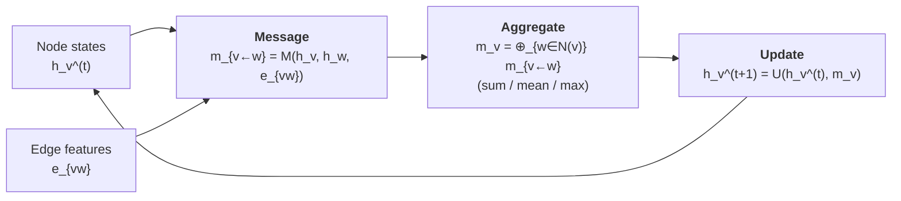

# 10.2 Message Passing


*One layer of message passing on a graph. Each node sends a message to each neighbour, all incoming messages are aggregated permutation-invariantly, and the node state is updated. Stacking layers grows the receptive field.*

In 2017 Gilmer and co-workers, working on molecular property prediction,
observed something subtle. The half-dozen graph neural networks then in
circulation — convolutional graph nets, gated graph nets, interaction
networks, edge-conditioned convolutions, MPNN, neural fingerprints —
looked superficially different but operated on the same template. They
all updated each node's hidden state by aggregating information from its
neighbours and then applying a per-node nonlinearity. The differences
were details: what exactly was aggregated, how it was combined, whether
edge features participated, whether attention or gating was used.

The paper that codified this observation gave the template a name:
*message-passing neural network*, or MPNN. Almost every architecture
relevant to materials — SchNet, CGCNN, MEGNet, NequIP, ALIGNN, M3GNet,
MACE — is an instance of the MPNN abstraction. Understanding the
abstraction is therefore the right investment: once it is internalised,
the literature reads as a catalogue of design choices rather than a
proliferation of unrelated networks.

## 10.2.1 The abstract framework

We are given a graph $G = (V, E)$ with node features
$h_v^{(0)} \in \mathbb{R}^{d_V}$ for each $v \in V$, and edge features
$e_{uv} \in \mathbb{R}^{d_E}$ for each edge $(u, v) \in E$. An MPNN is
defined by two families of learnable functions, $M_t$ and $U_t$,
indexed by a layer counter $t = 0, 1, \ldots, T - 1$. At each layer we
perform a two-step update.

**Step 1 — Compute messages and aggregate.** For each node $v$, compute
the incoming message from each neighbour $u \in \mathcal{N}(v)$ and sum
them:
$$
m_v^{(t+1)} = \sum_{u \in \mathcal{N}(v)} M_t\!\left(h_v^{(t)}, h_u^{(t)}, e_{uv}\right).
\tag{10.1}
$$
The function $M_t$ — the *message function* — is a small neural network
that takes the central node's state, the neighbour's state and the edge
feature, and returns a vector in $\mathbb{R}^{d_V}$. The sum is taken
over all incoming neighbours of $v$.

**Step 2 — Update the node state.** Combine the central node's previous
state with the aggregated message:
$$
h_v^{(t+1)} = U_t\!\left(h_v^{(t)}, m_v^{(t+1)}\right).
\tag{10.2}
$$
The function $U_t$ — the *update function* — is another small neural
network. In the simplest case it is a feed-forward layer applied to the
concatenation $[h_v^{(t)}; m_v^{(t+1)}]$; in gated variants it is a GRU
cell that respects the recurrent flavour of the update.

After $T$ rounds of updates we have a final set of node embeddings
$\{h_v^{(T)}\}_{v \in V}$. To predict a graph-level scalar — a formation
energy, a band gap — we apply a *readout*:
$$
\hat{y} = R\!\left(\{h_v^{(T)} : v \in V\}\right),
\tag{10.3}
$$
where $R$ is permutation-invariant in its arguments. The standard
choices are summation, mean, or a more elaborate set2set or attention
pooling.

That is the entire framework. Three equations, three learnable
ingredients ($M_t$, $U_t$, $R$). Specialising those three to particular
forms recovers essentially every GNN in the literature.

## 10.2.2 Example: a graph convolution

To anchor the abstraction in something concrete, consider the simplest
non-trivial MPNN — the graph convolution of Kipf and Welling (2017),
adapted slightly. Take
$$
M_t(h_v, h_u, e_{uv}) = W_t h_u,
\qquad
U_t(h_v, m_v) = \sigma\!\left(W_t' h_v + m_v\right),
$$
where $W_t, W_t' \in \mathbb{R}^{d_V \times d_V}$ are learnable matrices
and $\sigma$ a pointwise nonlinearity. Edge features are ignored. The
message from $u$ to $v$ is a linear projection of $u$'s state; the
update is a residual-style addition. Read out with a sum, attach a
linear head, and you have a working node-aggregation network. It is
unsuitable for crystals — the lack of distance dependence is fatal —
but it shows how minimal an MPNN can be.

For CGCNN, MEGNet and SchNet the message function will involve the
edge feature explicitly:
$$
M_t(h_v, h_u, e_{uv}) = \phi\!\left( W h_u \odot \psi(e_{uv}) \right),
$$
where $\psi$ is a small MLP acting on the Gaussian-expanded distance
and $\odot$ is elementwise multiplication. This is the *continuous-filter
convolution* idea: the edge feature modulates the message, so a long
bond carries less information than a short one — automatically, with
parameters learned from data.

## 10.2.3 Permutation invariance, for free

A non-negotiable requirement for any graph model is that its output not
depend on the order in which we wrote down the nodes. Atom 17 and atom
42 might exchange labels under a relabelling; no observable property of
the crystal changes. Formally, if $\pi$ is any permutation of $V$ and we
apply it consistently to $h_v$ and to the edge index, the model output
must be invariant.

The MPNN framework gives this for free, by construction. Examine the
two update equations.

Equation (10.1) sums $M_t$-values over the neighbour set. Summation is
*commutative and associative*: relabelling the neighbours $u$ does not
change the result, because the sum does not depend on the order of
summation. Therefore $m_v^{(t+1)}$ is invariant to any permutation that
fixes $v$ — it depends only on the unordered multiset of neighbour
states.

Equation (10.2) operates on $h_v$ and $m_v$ alone, no neighbour ordering
involved. So $h_v^{(t+1)}$ is invariant to neighbour permutations as well.

Finally the readout in (10.3) is required to be permutation-invariant
across nodes. Summation and mean satisfy this trivially. Therefore the
entire model output is invariant under any global node permutation.

The proof is two lines. It is also the *only* reason permutation
invariance holds: if you replace the sum in (10.1) with, say,
concatenation in some fixed order, the model immediately becomes
permutation-sensitive and produces different predictions on the same
crystal under different labellings — a disaster.

A subtle point about *expressivity*. Sum aggregation is more expressive
than mean for unordered multisets, because mean discards the cardinality.
The famous Weisfeiler–Lehman analysis (Xu et al., 2019) shows that a
sufficiently deep sum-aggregating MPNN can distinguish any two graphs
that the 1-WL graph isomorphism test can distinguish — but no more.
This is a real limitation: there exist pairs of non-isomorphic graphs
that no MPNN with sum aggregation can tell apart. In practice this is
rarely a problem for crystals (we have edge features and node features
that break the symmetry), but it explains the recent interest in higher-
order GNNs and equivariant networks that operate on tuples.

## 10.2.4 Translation, rotation, and the equivariance dimension

Permutation is one symmetry; the others are translation and rotation of
the structure in $\mathbb{R}^3$.

Translation invariance is automatic if the input contains only relative
information — interatomic distances and displacement vectors — never
absolute positions. Every architecture we will consider satisfies this
because the edge feature is $r_{uv}$ or $\mathbf{r}_{uv}$, neither of
which depends on the origin.

Rotation is more subtle. A network is *rotation-invariant* if every
internal feature is a scalar — a quantity unchanged by rotation. CGCNN,
SchNet and MEGNet are rotation-invariant: they use only scalar
distances and scalar node embeddings, and they cannot represent a vector
quantity like a force. A network is *rotation-equivariant* if its
internal features include vectors and higher tensors that *rotate
properly* under rotation of the input. Forces, stresses and dipole
moments are then natural outputs. NequIP, MACE and M3GNet are equivariant
in this sense.

Chapter 9 made this distinction at length for interatomic potentials.
The pattern repeats for property regression: an invariant network is
adequate for scalar targets (formation energy, band gap, magnetic
moment) and somewhat simpler to implement; an equivariant network is
required for tensor targets (elastic constants, Born charges) or when
you need forces consistent with the energy via autodifferentiation. For
the remainder of this chapter we work with the invariant case, since
CGCNN is invariant by design.

## 10.2.5 Receptive fields and depth

After $T$ message-passing layers the embedding $h_v^{(T)}$ at node $v$
depends on the input at every node reachable from $v$ within $T$ graph
hops. This set is called the *receptive field* of layer $T$.

In a crystal graph with cutoff 5 Å, one hop covers atoms within 5 Å of
$v$ — typically 10 to 20 neighbours in a dense oxide. Two hops cover
neighbours of neighbours, i.e. atoms within 10 Å, on the order of a
hundred atoms. The receptive field grows roughly cubically with $T$
until it saturates at the size of the unit cell.

Two practical consequences follow.

**Some properties are short-ranged; some are not.** Bond energies and
formation enthalpies are dominated by chemistry within 5 Å of each atom.
Three or four layers, with cutoff 5 Å, gives a receptive field of
15–20 Å, which is generally sufficient. Long-range Coulomb interactions
(e.g. in dielectrics) and band-structure properties (which depend on the
periodic wavefunction) need more. Some specialised networks add explicit
long-range terms; this is an active research area.

**Depth has costs.** Naïvely one would expect that deeper is better — more
layers, larger receptive field, richer features. In practice GNNs
plateau and even degrade past four to six layers, a phenomenon called
*over-smoothing*. The mechanism is the following. Each message-passing
layer mixes a node's state with the average of its neighbours' states.
Iterate this enough times and every node's state converges to (close
to) the same global average; distinctions between nodes are smeared
out, and the readout becomes uninformative. Mathematically, the
aggregation operator has a dominant eigenvalue with eigenvector aligned
along the all-ones direction, and repeated application contracts onto
that eigenvector.

The standard fix is to add a residual connection: instead of
$h_v^{(t+1)} = U_t(\ldots)$, write $h_v^{(t+1)} = h_v^{(t)} + U_t(\ldots)$.
The skip preserves the previous-layer information and lets the network
choose how much new information to mix in. Most modern GNNs, CGCNN
included, use residual or gated updates of this form.

A complementary fix is *layer normalisation* applied to $h_v^{(t)}$ at
each layer, which prevents the magnitudes from collapsing. And a third
is *DropEdge*, randomly dropping a fraction of edges during training,
which acts like dropout for graphs and prevents the network from
relying too heavily on any single edge.

## 10.2.6 Aggregation choices

We have so far written the aggregation as a sum. Common alternatives,
each with trade-offs:

- **Mean.** $\frac{1}{|\mathcal{N}(v)|} \sum_u M_t(\ldots)$. Insensitive
  to neighbour count, which is useful if different structures have
  wildly different coordination numbers. But it discards information
  about how many neighbours $v$ has, which is itself a feature in
  crystals.

- **Max.** $\max_u M_t(\ldots)$. Captures the dominant neighbour but
  ignores the rest. Popular in image-like applications, less so for
  crystals.

- **Attention-weighted.** A learnable weight $\alpha_{uv}$ multiplies
  each message before summing. The weight depends on $h_v$, $h_u$ and
  $e_{uv}$ through a small network. Graph Attention Networks (GATs)
  popularised this; for crystals it adds parameters and complexity but
  rarely large gains. ALIGNN, which we discuss in §10.4, uses gating
  rather than attention.

- **Gated.** Each message is multiplied by a sigmoid gate that depends
  on the distance. CGCNN's edge gate $\sigma(W_g[h_v; h_u; e_{uv}])$
  fits in this category. The gate softly thresholds: short bonds pass
  full messages, long bonds are suppressed, with a smooth transition.

For most crystal property regression tasks, sum or gated-sum aggregation
with three to five layers and a 5–8 Å cutoff is the right starting
configuration.

## 10.2.7 Putting it together: pseudo-code

```python
def mpnn_forward(
    h: torch.Tensor,            # (N, d_V) node features
    edge_index: torch.Tensor,   # (2, E)
    e: torch.Tensor,            # (E, d_E) edge features
    M_layers: list[Callable],   # message functions M_0 ... M_{T-1}
    U_layers: list[Callable],   # update functions
    R: Callable,                # readout
) -> torch.Tensor:
    src, dst = edge_index
    for M_t, U_t in zip(M_layers, U_layers):
        # Step 1: compute messages on every edge.
        msg = M_t(h[dst], h[src], e)            # (E, d_V)
        # Step 2: aggregate messages into destination nodes.
        agg = torch.zeros_like(h)
        agg.index_add_(0, dst, msg)             # sum over neighbours
        # Step 3: update node states.
        h = U_t(h, agg)
    return R(h)
```

`index_add_` is the standard PyTorch primitive for scatter-sum; the
PyTorch Geometric library wraps it in `scatter_add` and exposes a
`MessagePassing` base class that does the same bookkeeping. In §10.3
we will use that base class to implement CGCNN; the abstract template
above is what `MessagePassing` formalises.

## 10.2.8 Where we go next

We have now stripped graph neural networks down to a three-function
template — message, update, readout — that almost every architecture in
the literature instantiates. The remaining content of this chapter
amounts to choosing those functions cleverly and training the result on
real data.

Section 10.3 picks one such choice — the Crystal Graph Convolutional
Neural Network of Xie and Grossman — and builds it end-to-end. Once you
have working CGCNN code you have, in effect, a working template for any
property-regression GNN. Section 10.4 then surveys what changes if you
substitute MEGNet, ALIGNN or M3GNet for CGCNN.
