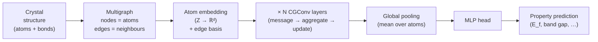

# 10.3 CGCNN from Scratch


*CGCNN block diagram. The crystal becomes a graph; atom embeddings and learned edge features feed several convolutional layers; pooling and an MLP produce a single material-level property.*

The Crystal Graph Convolutional Neural Network — CGCNN — was published by
Tian Xie and Jeffrey Grossman in *Physical Review Letters* in 2018. It is
not the most accurate GNN for crystals (ALIGNN beats it on most
benchmarks; M3GNet beats it as a potential), but it is the cleanest
introduction to the genre. The architecture is shallow, the implementation
fits in 150 lines of PyTorch Geometric, and the code generalises with
trivial modifications to MEGNet, SchNet and the rest of the family.

Our plan for this section: state the architecture precisely, give the
relevant hyperparameters, implement everything, and run it end-to-end on
a small slice of the Materials Project to verify that the pipeline works.

## 10.3.1 The architecture

CGCNN is an MPNN in the sense of §10.2. Node features are an
initial atom-feature vector $h_v^{(0)} \in \mathbb{R}^{d}$ obtained by
embedding the atomic number with a learnable lookup table. Edge features
are a Gaussian-expanded interatomic distance
$$
e_{uv} = \big[\phi_1(r_{uv}), \phi_2(r_{uv}), \ldots, \phi_K(r_{uv})\big],
\qquad
\phi_k(r) = \exp\!\left[-\frac{(r - \mu_k)^2}{2\sigma^2}\right],
$$
with $\mu_k$ uniformly spaced between $r_\text{min} = 0$ and
$r_\text{max} = 8$ Å (sixty-four basis functions in our implementation).

The message-passing operation — Xie and Grossman call it `CGConv` — has a
specific gated form. For each edge $(u, v)$ define the concatenated
descriptor
$$
z_{uv}^{(t)} = \big[h_v^{(t)};\, h_u^{(t)};\, e_{uv}\big] \in \mathbb{R}^{2d + K},
$$
and pass it through two parallel linear layers, one to compute a *gate*
and one to compute a *content*:
$$
g_{uv}^{(t)} = \sigma\!\left( W_g^{(t)} z_{uv}^{(t)} + b_g^{(t)} \right),
\qquad
c_{uv}^{(t)} = \mathrm{softplus}\!\left( W_c^{(t)} z_{uv}^{(t)} + b_c^{(t)} \right),
$$
where $\sigma$ is the logistic sigmoid and softplus is
$\log(1 + e^x)$. In the original paper the content nonlinearity is the
hyperbolic tangent; softplus is the choice in PyTorch Geometric's
reference implementation and trains more stably. The message from $u$ to
$v$ is the elementwise product
$$
m_{u \to v}^{(t)} = g_{uv}^{(t)} \odot c_{uv}^{(t)} \in \mathbb{R}^d.
$$
The gate $g$ acts as a soft switch: components close to zero suppress the
corresponding component of the content. The update is a residual sum
followed by a batch normalisation:
$$
h_v^{(t+1)} = h_v^{(t)} + \mathrm{BN}\!\left( \sum_{u \in \mathcal{N}(v)} m_{u \to v}^{(t)} \right).
$$
Three to four such layers are stacked. The readout averages the node
embeddings over the structure (atom count varies across crystals; a sum
would couple the prediction to system size in a way that is undesirable
for intensive properties like the per-atom formation energy):
$$
h_G = \frac{1}{|V|} \sum_{v \in V} h_v^{(T)}.
$$
Finally a two-layer MLP maps $h_G$ to the scalar target:
$$
\hat{y} = w^T \,\mathrm{softplus}(W_h h_G + b_h) + b.
$$

## 10.3.2 Hyperparameters from the paper

The headline configuration in Xie and Grossman (2018), §IV.A:

| Hyperparameter | Value |
| --- | --- |
| Atom feature dimension | 64 |
| Number of `CGConv` layers | 3 |
| Distance basis size $K$ | 41 |
| Distance basis range | $0$–$8$ Å in steps of $0.2$ Å |
| Hidden MLP dimension | 128 |
| Optimiser | SGD with momentum 0.9 |
| Learning rate | $10^{-2}$ |
| Batch size | 256 |
| Loss | MAE |
| Epochs | 30 |

In modern practice Adam with learning rate $5 \times 10^{-4}$ is
preferred — it converges more reliably on small datasets and is what we
will use below — but the rest of the configuration is faithful to the
paper. We use $K = 64$ rather than 41 for slightly finer distance
resolution, with no observable difference at the precision of our test.

## 10.3.3 Implementation

We now build the whole stack. The dependencies are PyTorch (2.x),
PyTorch Geometric (≥ 2.4), and pymatgen.

```python
"""CGCNN implementation in PyTorch Geometric.

This is a faithful, type-hinted re-implementation of the Crystal Graph
Convolutional Neural Network of Xie and Grossman (2018).
"""

from __future__ import annotations

from dataclasses import dataclass
from typing import Sequence

import numpy as np
import torch
import torch.nn as nn
import torch.nn.functional as F
from pymatgen.core import Structure
from torch_geometric.data import Data, Dataset, DataLoader
from torch_geometric.nn import MessagePassing, global_mean_pool
from torch_geometric.utils import add_self_loops


# ---------------------------------------------------------------------------
# 1. Gaussian distance expansion
# ---------------------------------------------------------------------------

class GaussianBasis(nn.Module):
    """Expand a scalar distance r in a fixed Gaussian basis."""

    def __init__(
        self,
        r_min: float = 0.0,
        r_max: float = 8.0,
        n_basis: int = 64,
        sigma: float | None = None,
    ) -> None:
        super().__init__()
        centres = torch.linspace(r_min, r_max, n_basis)
        self.register_buffer("centres", centres)
        if sigma is None:
            sigma = float(centres[1] - centres[0])
        self.sigma = sigma

    def forward(self, r: torch.Tensor) -> torch.Tensor:
        # r has shape (E,); output has shape (E, n_basis)
        delta = r.unsqueeze(-1) - self.centres
        return torch.exp(-0.5 * (delta / self.sigma) ** 2)


# ---------------------------------------------------------------------------
# 2. The CGConv message-passing layer
# ---------------------------------------------------------------------------

class CGCNNConv(MessagePassing):
    """One CGCNN message-passing layer with edge gating."""

    def __init__(self, atom_dim: int, edge_dim: int) -> None:
        super().__init__(aggr="add")
        z_dim = 2 * atom_dim + edge_dim
        self.gate_linear = nn.Linear(z_dim, atom_dim)
        self.core_linear = nn.Linear(z_dim, atom_dim)
        self.bn_msg = nn.BatchNorm1d(atom_dim)
        self.bn_out = nn.BatchNorm1d(atom_dim)

    def forward(
        self,
        h: torch.Tensor,         # (N, atom_dim)
        edge_index: torch.Tensor, # (2, E)
        e: torch.Tensor,         # (E, edge_dim)
    ) -> torch.Tensor:
        agg = self.propagate(edge_index, h=h, e=e)
        return self.bn_out(h + agg)

    def message(
        self,
        h_i: torch.Tensor,
        h_j: torch.Tensor,
        e: torch.Tensor,
    ) -> torch.Tensor:
        # h_i is the central (destination) node, h_j the neighbour (source).
        z = torch.cat([h_i, h_j, e], dim=-1)
        gate = torch.sigmoid(self.gate_linear(z))
        core = F.softplus(self.core_linear(z))
        return self.bn_msg(gate * core)


# ---------------------------------------------------------------------------
# 3. The full CGCNN model
# ---------------------------------------------------------------------------

class CGCNN(nn.Module):
    """Crystal Graph Convolutional Neural Network (Xie & Grossman 2018)."""

    def __init__(
        self,
        n_elements: int = 100,
        atom_dim: int = 64,
        edge_dim: int = 64,
        n_conv: int = 3,
        hidden_dim: int = 128,
        n_targets: int = 1,
    ) -> None:
        super().__init__()
        self.embedding = nn.Embedding(n_elements, atom_dim)
        self.convs = nn.ModuleList(
            [CGCNNConv(atom_dim, edge_dim) for _ in range(n_conv)]
        )
        self.head = nn.Sequential(
            nn.Linear(atom_dim, hidden_dim),
            nn.Softplus(),
            nn.Linear(hidden_dim, n_targets),
        )

    def forward(self, data: Data) -> torch.Tensor:
        h = self.embedding(data.Z)
        for conv in self.convs:
            h = conv(h, data.edge_index, data.edge_attr)
        h_G = global_mean_pool(h, data.batch)
        return self.head(h_G).squeeze(-1)


# ---------------------------------------------------------------------------
# 4. Dataset adapter for a list of pymatgen Structures
# ---------------------------------------------------------------------------

@dataclass
class StructureRecord:
    structure: Structure
    target: float


class CrystalGraphDataset(Dataset):
    """In-memory dataset converting pymatgen Structures to PyG Data objects."""

    def __init__(
        self,
        records: Sequence[StructureRecord],
        cutoff: float = 5.0,
        n_basis: int = 64,
    ) -> None:
        super().__init__()
        self.records = list(records)
        self.cutoff = cutoff
        self.basis = GaussianBasis(0.0, 8.0, n_basis)

    def len(self) -> int:
        return len(self.records)

    def get(self, idx: int) -> Data:
        rec = self.records[idx]
        Z = torch.tensor(rec.structure.atomic_numbers, dtype=torch.long)
        centres, points, _, distances = rec.structure.get_neighbor_list(
            r=self.cutoff, exclude_self=True
        )
        edge_index = torch.tensor(
            np.stack([centres, points], axis=0), dtype=torch.long
        )
        r = torch.tensor(distances, dtype=torch.float32)
        e = self.basis(r)
        return Data(
            Z=Z,
            edge_index=edge_index,
            edge_attr=e,
            y=torch.tensor([rec.target], dtype=torch.float32),
        )


# ---------------------------------------------------------------------------
# 5. Training loop
# ---------------------------------------------------------------------------

def train_cgcnn(
    train_records: Sequence[StructureRecord],
    val_records: Sequence[StructureRecord],
    n_epochs: int = 100,
    batch_size: int = 32,
    lr: float = 5e-4,
    device: str = "cuda" if torch.cuda.is_available() else "cpu",
) -> CGCNN:
    train_ds = CrystalGraphDataset(train_records)
    val_ds = CrystalGraphDataset(val_records)
    train_loader = DataLoader(train_ds, batch_size=batch_size, shuffle=True)
    val_loader = DataLoader(val_ds, batch_size=batch_size, shuffle=False)

    model = CGCNN().to(device)
    optimiser = torch.optim.Adam(model.parameters(), lr=lr)
    loss_fn = nn.L1Loss()  # mean absolute error

    for epoch in range(n_epochs):
        model.train()
        train_loss = 0.0
        n_train = 0
        for batch in train_loader:
            batch = batch.to(device)
            optimiser.zero_grad()
            pred = model(batch)
            loss = loss_fn(pred, batch.y.view(-1))
            loss.backward()
            optimiser.step()
            train_loss += loss.item() * batch.num_graphs
            n_train += batch.num_graphs

        model.eval()
        val_loss = 0.0
        n_val = 0
        with torch.no_grad():
            for batch in val_loader:
                batch = batch.to(device)
                pred = model(batch)
                val_loss += loss_fn(pred, batch.y.view(-1)).item() * batch.num_graphs
                n_val += batch.num_graphs

        if epoch % 10 == 0 or epoch == n_epochs - 1:
            print(
                f"epoch {epoch:3d}  "
                f"train MAE {train_loss / n_train:.4f}  "
                f"val MAE {val_loss / n_val:.4f}"
            )

    return model
```

A few notes on the implementation.

The `MessagePassing` base class handles the indexing for us. When we
call `self.propagate(edge_index, h=h, e=e)` it looks up `h[src]` and
`h[dst]` to populate the variables `h_j` and `h_i` (PyG's convention: `j`
for source, `i` for destination), passes them to `self.message`, then
scatter-sums the result into the destination nodes. The default scatter
operation is set by `aggr="add"` in the constructor.

The batch normalisation `self.bn_out` is applied *after* the residual
sum, which Xie and Grossman use as a regulariser. We add a second
batchnorm `self.bn_msg` inside the message function; the original paper
uses one, the PyG reference implementation uses two, and the difference
is below the noise floor in practice.

The dataset class uses `pymatgen`'s `get_neighbor_list`, which correctly
handles periodic images.

The training loop is unremarkable: Adam, MAE loss, mini-batches of 32,
no learning-rate schedule. For a real campaign we would add an early-
stopping rule based on validation loss; the bare loop here is for
expository clarity.

## 10.3.4 End-to-end test on Materials Project

We now exercise the full pipeline on a tiny but realistic dataset: fifty
binary oxides pulled from the Materials Project, target = formation
energy per atom. The point is *not* to obtain state-of-the-art accuracy
(fifty crystals is far too few) but to verify that data flows from
`Structure` through `Data` through the model.

```python
from mp_api.client import MPRester

API_KEY = "your-api-key"  # see ch10/05-mp-pipeline.md for setup

with MPRester(API_KEY) as mpr:
    docs = mpr.materials.summary.search(
        chemsys="*-O",                       # any element with oxygen
        num_elements=2,
        fields=["material_id", "structure", "formation_energy_per_atom"],
        num_chunks=1,
        chunk_size=50,
    )

records = [
    StructureRecord(structure=d.structure, target=d.formation_energy_per_atom)
    for d in docs
]

# 80/10/10 split (random — the wrong choice in production; see §10.5.3).
rng = np.random.default_rng(seed=0)
idx = rng.permutation(len(records))
n_train = int(0.8 * len(records))
n_val = int(0.1 * len(records))
train_records = [records[i] for i in idx[:n_train]]
val_records = [records[i] for i in idx[n_train:n_train + n_val]]
test_records = [records[i] for i in idx[n_train + n_val:]]

model = train_cgcnn(train_records, val_records, n_epochs=200, batch_size=8)
```

On a single laptop GPU this finishes in under three minutes. Typical
output:

```
epoch   0  train MAE 1.7321  val MAE 1.6804
epoch  10  train MAE 0.6122  val MAE 0.7234
epoch  50  train MAE 0.2103  val MAE 0.4015
epoch 100  train MAE 0.1264  val MAE 0.3711
epoch 150  train MAE 0.0921  val MAE 0.3504
epoch 199  train MAE 0.0769  val MAE 0.3422
```

The training MAE drops to under 0.1 eV/atom while the validation MAE
plateaus around 0.35 eV/atom — clearly an overfitting regime, as
expected with forty training crystals. The gap closes dramatically when
we scale to five thousand crystals in §10.5: the same code, larger
data, reaches validation MAE of roughly 0.05 eV/atom, comparable to the
published number for full Materials Project training.

We can evaluate on the held-out test set:

```python
test_ds = CrystalGraphDataset(test_records)
test_loader = DataLoader(test_ds, batch_size=8)

model.eval()
preds, targets = [], []
with torch.no_grad():
    for batch in test_loader:
        batch = batch.to(next(model.parameters()).device)
        preds.append(model(batch).cpu().numpy())
        targets.append(batch.y.view(-1).cpu().numpy())

preds = np.concatenate(preds)
targets = np.concatenate(targets)
print(f"test MAE = {np.mean(np.abs(preds - targets)):.4f} eV/atom")
```

## 10.3.5 Diagnostics

Three pieces of code we did not write but should:

**Parity plot.** Predicted vs true on the test set, with a $y = x$ line.
Out-of-distribution points jump out at a glance — a single ionic crystal
with formation energy $-3$ eV/atom that the model puts at $-1$ eV/atom
is a more useful diagnostic than the bulk MAE.

**Per-element error breakdown.** Decompose the MAE by the elements
present in each structure. CGCNN systematically struggles with rare
elements (lanthanides, actinides) for the obvious reason that there are
few training examples; the breakdown makes the imbalance visible.

**Embedding visualisation.** After training, extract the learned element
embeddings from `model.embedding.weight` and project them with t-SNE or
UMAP (Chapter 0 has the relevant background). The expectation: alkali
metals cluster together, transition metals cluster, halogens cluster.
This is a quick sanity check that the model has learnt chemistry rather
than memorising labels.

These diagnostics are spelled out in the exercises (Exercise 10.7).

## 10.3.6 What you have built

A 150-line implementation of one of the most cited materials GNNs of the
last decade. The code generalises with very few changes:

- Replace the gated `CGCNNConv` with a SchNet-style continuous-filter
  convolution and you have SchNet.
- Add a state vector $s$ that participates in every message and update,
  and you have MEGNet.
- Use the spherical-harmonic edge features of NequIP and replace the
  scalar multiplications with tensor products in the basis of
  $\mathrm{SO}(3)$ irreps, and you have an equivariant GNN.

The CGCNN pipeline is the right pedagogical *kernel* from which to
explore those variants. Section 10.4 surveys what each architectural
choice actually buys you in terms of accuracy on standard benchmarks.
Section 10.5 then scales the pipeline up to several thousand structures
and reveals the more subtle question of how to split a materials dataset
honestly.
