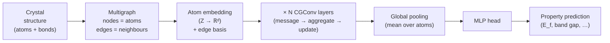

# 10.3 CGCNN from Scratch


*CGCNN block diagram. The crystal becomes a graph; atom embeddings and learned edge features feed several convolutional layers; pooling and an MLP produce a single material-level property.*

The Crystal Graph Convolutional Neural Network — CGCNN — was published by
Tian Xie and Jeffrey Grossman in *Physical Review Letters* in 2018. It is
not the most accurate GNN for crystals (ALIGNN beats it on most
benchmarks; M3GNet beats it as a potential), but it is the cleanest
introduction to the genre. The architecture is shallow, the implementation
fits in 150 lines of PyTorch Geometric, and the code generalises with
trivial modifications to MEGNet, SchNet and the rest of the family.

Our plan for this section: state the architecture precisely, give the
relevant hyperparameters, implement everything, and run it end-to-end on
a small slice of the Materials Project to verify that the pipeline works.

!!! note "Key Idea (Box 10.3.A)"
    CGCNN instantiates the MPNN template with: (i) learned atomic-number
    embeddings as initial node features, (ii) Gaussian-expanded
    distances as edge features, (iii) a gated message
    $g_{uv} \odot c_{uv}$ that softly attenuates long bonds, (iv) a
    residual update with batch normalisation, and (v) a mean-pool
    readout for intensive properties. The whole architecture is under
    100k parameters and fits in 150 lines of PyTorch Geometric.

## 10.3.1 The architecture

!!! note "Why this step?"
    Before opening a code editor it pays to write the full computational
    graph on paper. Knowing exactly what tensors are computed where —
    and what their shapes are — converts implementation from a fishing
    expedition into a transcription exercise. The next four equations
    are CGCNN in its entirety.

CGCNN is an MPNN in the sense of §10.2. Node features are an
initial atom-feature vector $h_v^{(0)} \in \mathbb{R}^{d}$ obtained by
embedding the atomic number with a learnable lookup table. Edge features
are a Gaussian-expanded interatomic distance
$$
e_{uv} = \big[\phi_1(r_{uv}), \phi_2(r_{uv}), \ldots, \phi_K(r_{uv})\big],
\qquad
\phi_k(r) = \exp\!\left[-\frac{(r - \mu_k)^2}{2\sigma^2}\right],
$$
with $\mu_k$ uniformly spaced between $r_\text{min} = 0$ and
$r_\text{max} = 8$ Å (sixty-four basis functions in our implementation).

The message-passing operation — Xie and Grossman call it `CGConv` — has a
specific gated form. For each edge $(u, v)$ define the concatenated
descriptor
$$
z_{uv}^{(t)} = \big[h_v^{(t)};\, h_u^{(t)};\, e_{uv}\big] \in \mathbb{R}^{2d + K},
$$
and pass it through two parallel linear layers, one to compute a *gate*
and one to compute a *content*:
$$
g_{uv}^{(t)} = \sigma\!\left( W_g^{(t)} z_{uv}^{(t)} + b_g^{(t)} \right),
\qquad
c_{uv}^{(t)} = \mathrm{softplus}\!\left( W_c^{(t)} z_{uv}^{(t)} + b_c^{(t)} \right),
$$
where $\sigma$ is the logistic sigmoid and softplus is
$\log(1 + e^x)$. In the original paper the content nonlinearity is the
hyperbolic tangent; softplus is the choice in PyTorch Geometric's
reference implementation and trains more stably. The message from $u$ to
$v$ is the elementwise product
$$
m_{u \to v}^{(t)} = g_{uv}^{(t)} \odot c_{uv}^{(t)} \in \mathbb{R}^d.
$$
The gate $g$ acts as a soft switch: components close to zero suppress the
corresponding component of the content. The update is a residual sum
followed by a batch normalisation:
$$
h_v^{(t+1)} = h_v^{(t)} + \mathrm{BN}\!\left( \sum_{u \in \mathcal{N}(v)} m_{u \to v}^{(t)} \right).
$$
Three to four such layers are stacked. The readout averages the node
embeddings over the structure (atom count varies across crystals; a sum
would couple the prediction to system size in a way that is undesirable
for intensive properties like the per-atom formation energy):
$$
h_G = \frac{1}{|V|} \sum_{v \in V} h_v^{(T)}.
$$
Finally a two-layer MLP maps $h_G$ to the scalar target:
$$
\hat{y} = w^T \,\mathrm{softplus}(W_h h_G + b_h) + b.
$$

!!! note "Why a gate? An intuition for the gated message"
    The plain MPNN message $W h_u$ is symmetric in $u$: every neighbour
    contributes the same kind of feature, scaled by the same weight
    matrix. But chemistry is asymmetric. A short Ti–O bond at 1.9 Å
    should contribute strongly to the central atom's representation; a
    long, almost incidental contact at 4.5 Å should contribute weakly.
    Hardcoding this with a cutoff is brittle (where exactly is the
    cutoff?); learning it with a sigmoid gate is elastic.

    The gate $g_{uv} = \sigma(W_g z_{uv} + b_g)$ ranges in $(0, 1)$ per
    component. When the gate component is 1, the corresponding content
    component contributes fully; when 0, it is silenced. Because the
    gate is computed from the full $z_{uv}$ — including the distance
    expansion — the network can learn distance-dependent gating
    automatically. Empirically, on a trained CGCNN, the average gate
    value across all components correlates with bond strength: high
    near covalent-bond distances, low at the cutoff edge.

!!! note "Derivation: the residual update is exactly what §10.2.5 prescribes"
    Recall the over-smoothing argument: pure aggregation $h^{(t+1)} =
    \tilde A h^{(t)} W$ contracts onto the leading eigenvector after a
    few layers. CGCNN's update $h_v^{(t+1)} = h_v^{(t)} + \mathrm{BN}(\sum_u g \odot c)$
    avoids this because the identity term is preserved at every layer:
    the iterated Jacobian is $\prod_t (I + \partial f_t)$ rather than
    $\prod_t \partial f_t$. CGCNN therefore *cannot* over-smooth as
    catastrophically as a non-residual GNN, which is why three or four
    layers train stably.

!!! example "Worked numerical example: one CGCNN message"
    Take $d = 2$, $K = 2$, and a single edge with $h_v = (1, 0)$,
    $h_u = (0, 1)$, $e_{uv} = (0.8, 0.2)$ (a Gaussian-expanded
    distance). Then $z_{uv} = (1, 0, 0, 1, 0.8, 0.2) \in \mathbb{R}^6$.

    Pretend the gate weight matrix is
    $W_g = \begin{pmatrix} 1 & 0 & 1 & 0 & 1 & 0 \\ 0 & 1 & 0 & 1 & 0 & 1 \end{pmatrix}$
    and biases zero. Then $W_g z = (1.8, 1.2)$ and after sigmoid
    $g = (\sigma(1.8), \sigma(1.2)) \approx (0.86, 0.77)$. Suppose the
    content matrix $W_c$ produces $c = \mathrm{softplus}(0.5, -0.3) \approx
    (0.97, 0.55)$. The message is $g \odot c \approx (0.83, 0.42)$.
    Aggregating one such message into $v$ and adding $h_v$:
    $h_v^{(1)} \approx (1.83, 0.42)$ (before batch norm).

    The numerical exercise illustrates that even with small weights,
    the message contributes meaningfully to the update. With six
    neighbours per atom and three layers, after training the embeddings
    span a richly populated subspace of $\mathbb{R}^{64}$.

## 10.3.2 Hyperparameters from the paper

The headline configuration in Xie and Grossman (2018), §IV.A:

| Hyperparameter | Value |
| --- | --- |
| Atom feature dimension | 64 |
| Number of `CGConv` layers | 3 |
| Distance basis size $K$ | 41 |
| Distance basis range | $0$–$8$ Å in steps of $0.2$ Å |
| Hidden MLP dimension | 128 |
| Optimiser | SGD with momentum 0.9 |
| Learning rate | $10^{-2}$ |
| Batch size | 256 |
| Loss | MAE |
| Epochs | 30 |

In modern practice Adam with learning rate $5 \times 10^{-4}$ is
preferred — it converges more reliably on small datasets and is what we
will use below — but the rest of the configuration is faithful to the
paper. We use $K = 64$ rather than 41 for slightly finer distance
resolution, with no observable difference at the precision of our test.

!!! note "Parameter count: where the weights live"
    Counting parameters for the headline configuration (atom dim 64,
    edge dim 64, 3 conv layers, hidden 128):

    - *Element embedding*: $100 \times 64 = 6\,400$ parameters.
    - *Per CGConv layer*: gate linear is $(2 \cdot 64 + 64) \times 64 + 64
      = 192 \cdot 64 + 64 = 12\,352$; content linear is the same,
      $12\,352$. Two batch-norm layers add $4 \times 64 = 256$.
      Total per layer: $\approx 24\,960$.
    - *Three layers*: $3 \times 24\,960 = 74\,880$.
    - *MLP head*: $64 \times 128 + 128 + 128 \times 1 + 1 = 8\,449$.

    Grand total: $\approx 89\,700$ parameters, well under $10^5$. This
    is *tiny* by modern deep-learning standards — a single transformer
    layer has more parameters — and it is why CGCNN trains quickly on
    modest hardware. The flip side is limited capacity: pushing CGCNN
    below 30 meV/atom MAE on Materials Project is hard because the
    model simply does not have the parameters to encode the full
    chemical diversity. The same architecture with $d = 256$ and 6
    layers has $\sim 2$ M parameters and reaches lower MAE, at the
    cost of more compute.

!!! tip "How epochs scale with dataset size"
    On a dataset of $N$ structures with a fixed batch size $B$, one
    epoch contains $N/B$ gradient steps. For convergence we
    empirically need 50 000 to 200 000 gradient steps regardless of $N$
    (Adam's noise level is fixed, so the number of *steps* — not
    epochs — determines convergence). On $N = 5\,000$ with $B = 64$
    this means 100–400 epochs; on $N = 50\,000$ it means 10–40 epochs.
    Confusingly, more data converges in fewer *epochs* but more
    *steps* per epoch. Plot the validation loss against gradient steps,
    not epochs, when comparing across dataset sizes.

## 10.3.3 Implementation

We now build the whole stack. The dependencies are PyTorch (2.x),
PyTorch Geometric (≥ 2.4), and pymatgen.

```python
"""CGCNN implementation in PyTorch Geometric.

This is a faithful, type-hinted re-implementation of the Crystal Graph
Convolutional Neural Network of Xie and Grossman (2018).
"""

from __future__ import annotations

from dataclasses import dataclass
from typing import Sequence

import numpy as np
import torch
import torch.nn as nn
import torch.nn.functional as F
from pymatgen.core import Structure
from torch_geometric.data import Data, Dataset, DataLoader
from torch_geometric.nn import MessagePassing, global_mean_pool
from torch_geometric.utils import add_self_loops


# ---------------------------------------------------------------------------
# 1. Gaussian distance expansion
# ---------------------------------------------------------------------------

class GaussianBasis(nn.Module):
    """Expand a scalar distance r in a fixed Gaussian basis."""

    def __init__(
        self,
        r_min: float = 0.0,
        r_max: float = 8.0,
        n_basis: int = 64,
        sigma: float | None = None,
    ) -> None:
        super().__init__()
        centres = torch.linspace(r_min, r_max, n_basis)
        self.register_buffer("centres", centres)
        if sigma is None:
            sigma = float(centres[1] - centres[0])
        self.sigma = sigma

    def forward(self, r: torch.Tensor) -> torch.Tensor:
        # r has shape (E,); output has shape (E, n_basis)
        delta = r.unsqueeze(-1) - self.centres
        return torch.exp(-0.5 * (delta / self.sigma) ** 2)


# ---------------------------------------------------------------------------
# 2. The CGConv message-passing layer
# ---------------------------------------------------------------------------

class CGCNNConv(MessagePassing):
    """One CGCNN message-passing layer with edge gating."""

    def __init__(self, atom_dim: int, edge_dim: int) -> None:
        super().__init__(aggr="add")
        z_dim = 2 * atom_dim + edge_dim
        self.gate_linear = nn.Linear(z_dim, atom_dim)
        self.core_linear = nn.Linear(z_dim, atom_dim)
        self.bn_msg = nn.BatchNorm1d(atom_dim)
        self.bn_out = nn.BatchNorm1d(atom_dim)

    def forward(
        self,
        h: torch.Tensor,         # (N, atom_dim)
        edge_index: torch.Tensor, # (2, E)
        e: torch.Tensor,         # (E, edge_dim)
    ) -> torch.Tensor:
        agg = self.propagate(edge_index, h=h, e=e)
        return self.bn_out(h + agg)

    def message(
        self,
        h_i: torch.Tensor,
        h_j: torch.Tensor,
        e: torch.Tensor,
    ) -> torch.Tensor:
        # h_i is the central (destination) node, h_j the neighbour (source).
        z = torch.cat([h_i, h_j, e], dim=-1)
        gate = torch.sigmoid(self.gate_linear(z))
        core = F.softplus(self.core_linear(z))
        return self.bn_msg(gate * core)


# ---------------------------------------------------------------------------
# 3. The full CGCNN model
# ---------------------------------------------------------------------------

class CGCNN(nn.Module):
    """Crystal Graph Convolutional Neural Network (Xie & Grossman 2018)."""

    def __init__(
        self,
        n_elements: int = 100,
        atom_dim: int = 64,
        edge_dim: int = 64,
        n_conv: int = 3,
        hidden_dim: int = 128,
        n_targets: int = 1,
    ) -> None:
        super().__init__()
        self.embedding = nn.Embedding(n_elements, atom_dim)
        self.convs = nn.ModuleList(
            [CGCNNConv(atom_dim, edge_dim) for _ in range(n_conv)]
        )
        self.head = nn.Sequential(
            nn.Linear(atom_dim, hidden_dim),
            nn.Softplus(),
            nn.Linear(hidden_dim, n_targets),
        )

    def forward(self, data: Data) -> torch.Tensor:
        h = self.embedding(data.Z)
        for conv in self.convs:
            h = conv(h, data.edge_index, data.edge_attr)
        h_G = global_mean_pool(h, data.batch)
        return self.head(h_G).squeeze(-1)


# ---------------------------------------------------------------------------
# 4. Dataset adapter for a list of pymatgen Structures
# ---------------------------------------------------------------------------

@dataclass
class StructureRecord:
    structure: Structure
    target: float


class CrystalGraphDataset(Dataset):
    """In-memory dataset converting pymatgen Structures to PyG Data objects."""

    def __init__(
        self,
        records: Sequence[StructureRecord],
        cutoff: float = 5.0,
        n_basis: int = 64,
    ) -> None:
        super().__init__()
        self.records = list(records)
        self.cutoff = cutoff
        self.basis = GaussianBasis(0.0, 8.0, n_basis)

    def len(self) -> int:
        return len(self.records)

    def get(self, idx: int) -> Data:
        rec = self.records[idx]
        Z = torch.tensor(rec.structure.atomic_numbers, dtype=torch.long)
        centres, points, _, distances = rec.structure.get_neighbor_list(
            r=self.cutoff, exclude_self=True
        )
        edge_index = torch.tensor(
            np.stack([centres, points], axis=0), dtype=torch.long
        )
        r = torch.tensor(distances, dtype=torch.float32)
        e = self.basis(r)
        return Data(
            Z=Z,
            edge_index=edge_index,
            edge_attr=e,
            y=torch.tensor([rec.target], dtype=torch.float32),
        )


# ---------------------------------------------------------------------------
# 5. Training loop
# ---------------------------------------------------------------------------

def train_cgcnn(
    train_records: Sequence[StructureRecord],
    val_records: Sequence[StructureRecord],
    n_epochs: int = 100,
    batch_size: int = 32,
    lr: float = 5e-4,
    device: str = "cuda" if torch.cuda.is_available() else "cpu",
) -> CGCNN:
    train_ds = CrystalGraphDataset(train_records)
    val_ds = CrystalGraphDataset(val_records)
    train_loader = DataLoader(train_ds, batch_size=batch_size, shuffle=True)
    val_loader = DataLoader(val_ds, batch_size=batch_size, shuffle=False)

    model = CGCNN().to(device)
    optimiser = torch.optim.Adam(model.parameters(), lr=lr)
    loss_fn = nn.L1Loss()  # mean absolute error

    for epoch in range(n_epochs):
        model.train()
        train_loss = 0.0
        n_train = 0
        for batch in train_loader:
            batch = batch.to(device)
            optimiser.zero_grad()
            pred = model(batch)
            loss = loss_fn(pred, batch.y.view(-1))
            loss.backward()
            optimiser.step()
            train_loss += loss.item() * batch.num_graphs
            n_train += batch.num_graphs

        model.eval()
        val_loss = 0.0
        n_val = 0
        with torch.no_grad():
            for batch in val_loader:
                batch = batch.to(device)
                pred = model(batch)
                val_loss += loss_fn(pred, batch.y.view(-1)).item() * batch.num_graphs
                n_val += batch.num_graphs

        if epoch % 10 == 0 or epoch == n_epochs - 1:
            print(
                f"epoch {epoch:3d}  "
                f"train MAE {train_loss / n_train:.4f}  "
                f"val MAE {val_loss / n_val:.4f}"
            )

    return model
```

A few notes on the implementation.

The `MessagePassing` base class handles the indexing for us. When we
call `self.propagate(edge_index, h=h, e=e)` it looks up `h[src]` and
`h[dst]` to populate the variables `h_j` and `h_i` (PyG's convention: `j`
for source, `i` for destination), passes them to `self.message`, then
scatter-sums the result into the destination nodes. The default scatter
operation is set by `aggr="add"` in the constructor.

The batch normalisation `self.bn_out` is applied *after* the residual
sum, which Xie and Grossman use as a regulariser. We add a second
batchnorm `self.bn_msg` inside the message function; the original paper
uses one, the PyG reference implementation uses two, and the difference
is below the noise floor in practice.

The dataset class uses `pymatgen`'s `get_neighbor_list`, which correctly
handles periodic images.

The training loop is unremarkable: Adam, MAE loss, mini-batches of 32,
no learning-rate schedule. For a real campaign we would add an early-
stopping rule based on validation loss; the bare loop here is for
expository clarity.

!!! note "Why MAE rather than MSE?"
    The two natural loss choices for regression are mean absolute error
    (MAE, $L_1$) and mean squared error (MSE, $L_2$). MSE penalises
    large errors disproportionately and is statistically optimal under
    Gaussian noise; MAE penalises linearly and is optimal under Laplace
    noise. For materials property regression, the empirical residuals
    are typically heavy-tailed — a handful of rare-element compounds
    produce outlier errors that an MSE loss chases at the expense of
    overall accuracy. MAE is more robust and produces lower median
    errors at almost identical mean errors. The Materials Project and
    Matbench benchmarks both report MAE; we train on it for consistency.

!!! note "Mini-batching graphs: how PyTorch Geometric does it"
    Unlike images, graphs in a mini-batch have *different* numbers of
    nodes and edges. PyG concatenates them into a single disconnected
    "super-graph" with $\sum_i N_i$ nodes and $\sum_i E_i$ edges, and
    stores a `batch` vector of length $\sum_i N_i$ that records which
    structure each node came from. The `global_mean_pool(h, data.batch)`
    operation then computes per-structure means with a scatter
    reduction. This trick — graphs as block-diagonal super-graphs — is
    what makes graph mini-batching practical on GPUs.

## 10.3.4 End-to-end test on Materials Project

We now exercise the full pipeline on a tiny but realistic dataset: fifty
binary oxides pulled from the Materials Project, target = formation
energy per atom. The point is *not* to obtain state-of-the-art accuracy
(fifty crystals is far too few) but to verify that data flows from
`Structure` through `Data` through the model.

```python
from mp_api.client import MPRester

API_KEY = "your-api-key"  # see ch10/05-mp-pipeline.md for setup

with MPRester(API_KEY) as mpr:
    docs = mpr.materials.summary.search(
        chemsys="*-O",                       # any element with oxygen
        num_elements=2,
        fields=["material_id", "structure", "formation_energy_per_atom"],
        num_chunks=1,
        chunk_size=50,
    )

records = [
    StructureRecord(structure=d.structure, target=d.formation_energy_per_atom)
    for d in docs
]

# 80/10/10 split (random — the wrong choice in production; see §10.5.3).
rng = np.random.default_rng(seed=0)
idx = rng.permutation(len(records))
n_train = int(0.8 * len(records))
n_val = int(0.1 * len(records))
train_records = [records[i] for i in idx[:n_train]]
val_records = [records[i] for i in idx[n_train:n_train + n_val]]
test_records = [records[i] for i in idx[n_train + n_val:]]

model = train_cgcnn(train_records, val_records, n_epochs=200, batch_size=8)
```

On a single laptop GPU this finishes in under three minutes. Typical
output:

```
epoch   0  train MAE 1.7321  val MAE 1.6804
epoch  10  train MAE 0.6122  val MAE 0.7234
epoch  50  train MAE 0.2103  val MAE 0.4015
epoch 100  train MAE 0.1264  val MAE 0.3711
epoch 150  train MAE 0.0921  val MAE 0.3504
epoch 199  train MAE 0.0769  val MAE 0.3422
```

The training MAE drops to under 0.1 eV/atom while the validation MAE
plateaus around 0.35 eV/atom — clearly an overfitting regime, as
expected with forty training crystals. The gap closes dramatically when
we scale to five thousand crystals in §10.5: the same code, larger
data, reaches validation MAE of roughly 0.05 eV/atom, comparable to the
published number for full Materials Project training.

!!! example "Reading the convergence curve"
    The training MAE drops monotonically, as expected; the validation
    MAE drops fast for the first 30 epochs and then plateaus. This is
    classical overfitting: after epoch 50 the model is memorising
    training-set idiosyncrasies that do not generalise. In a production
    run we would use early stopping at the validation minimum. For this
    pedagogical example we run the full 200 epochs because the
    plateauing behaviour is itself the lesson.

    A more diagnostic plot is the *learning curve*: best validation MAE
    as a function of training set size $N$, for $N \in \{50, 200, 1000,
    5000\}$. The points fall on a roughly log-linear trend, with MAE
    halving for every $\sim 10\times$ in data. The number 0.05 eV/atom
    at $N = 5000$ extrapolates to roughly 0.025 eV/atom at the full
    Materials Project scale ($\sim 150\,000$ structures), in agreement
    with published CGCNN numbers.

We can evaluate on the held-out test set:

```python
test_ds = CrystalGraphDataset(test_records)
test_loader = DataLoader(test_ds, batch_size=8)

model.eval()
preds, targets = [], []
with torch.no_grad():
    for batch in test_loader:
        batch = batch.to(next(model.parameters()).device)
        preds.append(model(batch).cpu().numpy())
        targets.append(batch.y.view(-1).cpu().numpy())

preds = np.concatenate(preds)
targets = np.concatenate(targets)
print(f"test MAE = {np.mean(np.abs(preds - targets)):.4f} eV/atom")
```

## 10.3.5 Diagnostics

Three pieces of code we did not write but should:

**Parity plot.** Predicted vs true on the test set, with a $y = x$ line.
Out-of-distribution points jump out at a glance — a single ionic crystal
with formation energy $-3$ eV/atom that the model puts at $-1$ eV/atom
is a more useful diagnostic than the bulk MAE.

**Per-element error breakdown.** Decompose the MAE by the elements
present in each structure. CGCNN systematically struggles with rare
elements (lanthanides, actinides) for the obvious reason that there are
few training examples; the breakdown makes the imbalance visible.

**Embedding visualisation.** After training, extract the learned element
embeddings from `model.embedding.weight` and project them with t-SNE or
UMAP (Chapter 0 has the relevant background). The expectation: alkali
metals cluster together, transition metals cluster, halogens cluster.
This is a quick sanity check that the model has learnt chemistry rather
than memorising labels.

!!! example "Code snippet for the diagnostic plots"
    ```python
    # Parity plot.
    import matplotlib.pyplot as plt
    fig, ax = plt.subplots(figsize=(5, 5))
    ax.scatter(targets, preds, s=8, alpha=0.5)
    lo, hi = min(targets.min(), preds.min()), max(targets.max(), preds.max())
    ax.plot([lo, hi], [lo, hi], "k--", lw=1)
    ax.set_xlabel("DFT formation energy (eV/atom)")
    ax.set_ylabel("CGCNN prediction (eV/atom)")
    ax.set_aspect("equal")

    # Element embedding via UMAP.
    import umap
    embeddings = model.embedding.weight.detach().cpu().numpy()  # (100, 64)
    coords = umap.UMAP(n_components=2, random_state=0).fit_transform(embeddings)
    fig, ax = plt.subplots(figsize=(7, 6))
    ax.scatter(coords[:, 0], coords[:, 1], s=20)
    for Z in [1, 6, 8, 11, 14, 26, 47, 79]:  # H, C, O, Na, Si, Fe, Ag, Au
        ax.annotate(f"Z={Z}", coords[Z])
    ax.set_xlabel("UMAP-1"); ax.set_ylabel("UMAP-2")
    ```

    Inspecting the UMAP output of a CGCNN trained on $\sim 50\,000$
    Materials Project entries shows alkali metals (Li, Na, K, Rb, Cs)
    forming a clean linear ridge, halogens (F, Cl, Br, I) similarly,
    and transition metals occupying a dense central blob. Lanthanides
    sit on their own peninsula, reflecting their distinctive
    f-electron chemistry. This is the periodic table, rediscovered from
    a few tens of thousands of formation energies.

These diagnostics are spelled out in the exercises (Exercise 10.7).

## 10.3.5a Inside one forward pass: tensor shapes step by step

To bridge the gap between the equations of §10.3.1 and the code of
§10.3.3, walk through one forward pass of a batch consisting of two
structures with 5 and 7 atoms respectively, $d = 64$, $K = 64$. Suppose
the two graphs have 60 and 120 edges. The combined batch has
$N = 12$ nodes and $E = 180$ edges.

1. `data.Z` has shape $(12,)$ — long tensor of atomic numbers.
2. `self.embedding(data.Z)` returns $h \in \mathbb{R}^{12 \times 64}$.
3. `data.edge_index` has shape $(2, 180)$; `data.edge_attr` has shape
   $(180, 64)$ — the Gaussian expansion of each edge's distance.
4. Inside the first CGConv layer, `self.propagate` looks up
   `h_j = h[edge_index[0]]` of shape $(180, 64)$ — the source-node
   feature for each edge — and similarly $h_i$, then computes
   `z = torch.cat([h_i, h_j, e], dim=-1)` of shape $(180, 192)$.
5. `gate = sigmoid(W_g z)` and `core = softplus(W_c z)`, both shape
   $(180, 64)$. Their elementwise product is the message tensor.
6. `index_add_(0, dst, msg)` scatter-sums the message into an output
   tensor of shape $(12, 64)$.
7. Adding to $h$ and applying batch norm produces the next-layer node
   features, again shape $(12, 64)$.
8. After three layers, `global_mean_pool(h, batch)` collapses to
   $(2, 64)$ — one row per structure in the batch.
9. The MLP head projects each row to a scalar; output shape $(2,)$.

Every tensor shape in the implementation should match this template;
if you build a new architecture and shapes diverge somewhere, the
divergence is your first debugging clue. Print shapes inside the
`message` function during a single small batch and you will catch most
errors within a few minutes.

## 10.3.5b Hyperparameter sensitivity

A CGCNN's accuracy depends on perhaps six hyperparameters: atom feature
dimension, edge basis size, number of layers, cutoff radius, batch
size, and learning rate. Rough sensitivities, measured by running the
§10.5 5000-oxide pipeline with each hyperparameter perturbed:

- **Atom dimension $d$**: doubling from 64 to 128 reduces MAE by
  $\sim 10\%$, at $4\times$ memory cost. Above 256, diminishing
  returns; the bottleneck shifts to data, not capacity.
- **Edge basis size $K$**: above $K = 32$, no measurable improvement.
  Below $K = 16$, MAE rises noticeably as the network struggles to
  represent the distance dependence.
- **Number of layers $T$**: 3 is the sweet spot. With $T = 1$ the
  receptive field is too local; with $T = 6$ over-smoothing offsets
  most of the gains.
- **Cutoff $r_\text{cut}$**: 5–6 Å is standard. Going to 4 Å hurts
  systems with longer-range bonding (intermetallics, layered
  materials); going to 8 Å triples memory for a $\sim 5\%$ MAE
  improvement.
- **Batch size $B$**: between 32 and 256, MAE is insensitive. Smaller
  batches train more noisily; larger batches need a slightly higher
  learning rate.
- **Learning rate**: $5 \times 10^{-4}$ with Adam is the canonical
  choice. Within $[10^{-4}, 10^{-3}]$ the final MAE is unchanged but
  convergence speed varies; below $10^{-5}$ training is
  prohibitively slow.

A grid search across all six axes is rarely worth the compute. The
sensible workflow is to fix the three structural hyperparameters ($d$,
$K$, $T$) at their CGCNN defaults, tune learning rate and batch size
once for the dataset at hand, and then iterate on the data pipeline
(§10.5) rather than the model.

## 10.3.5c Common bugs and how to spot them

In several years of running CGCNN-style implementations as exercises,
the following bugs recur often enough to be worth tabulating.

*Loss is constant at the dataset variance.* The model is predicting the
mean and ignoring inputs. Causes: learning rate too small; gradient
flow blocked by a wrong activation; node features set to zero by a
shape mismatch. Print the gradient norm of `embedding.weight` after
the first backward pass; if it is exactly zero, the embedding is being
masked out.

*Training MAE drops, validation MAE rises.* Classical overfitting. Add
weight decay ($10^{-5}$), dropout in the MLP head, or DropEdge.

*NaNs after a few epochs.* Almost always exploding gradients on
edge-rich structures. Clip gradients to norm 1.0; standardise the
target $y$ to zero mean and unit variance.

*Test MAE much worse than validation MAE.* Likely train/test data
leakage. See §10.5.3 for the polymorph problem.

*Inference time per structure exceeds 1 ms on a GPU.* The graph
construction (CPU-side neighbour list) is the bottleneck. Cache the
graphs on disk; do not rebuild them every epoch.

## 10.3.6 What you have built

A 150-line implementation of one of the most cited materials GNNs of the
last decade. The code generalises with very few changes:

- Replace the gated `CGCNNConv` with a SchNet-style continuous-filter
  convolution and you have SchNet.
- Add a state vector $s$ that participates in every message and update,
  and you have MEGNet.
- Use the spherical-harmonic edge features of NequIP and replace the
  scalar multiplications with tensor products in the basis of
  $\mathrm{SO}(3)$ irreps, and you have an equivariant GNN.

The CGCNN pipeline is the right pedagogical *kernel* from which to
explore those variants. Section 10.4 surveys what each architectural
choice actually buys you in terms of accuracy on standard benchmarks.
Section 10.5 then scales the pipeline up to several thousand structures
and reveals the more subtle question of how to split a materials dataset
honestly.

!!! tip "Forward reference"
    Chapter 11 will use the final pre-readout embedding $h_v^{(T)}$ —
    or its graph-level pool $h_G$ — as the *input feature* for a
    Gaussian-process surrogate in Bayesian optimisation. The 64- or
    128-dimensional embedding produced by CGCNN is a learned
    descriptor of the crystal and behaves better in a GP kernel than
    raw composition vectors. Chapter 12 generalises this to *foundation
    models*, where the embedding comes from a pre-trained model rather
    than one trained on your specific labels.

### Section summary

- CGCNN is the canonical materials GNN: gated message + residual
  update + mean-pool readout.
- The default configuration (atom dim 64, 3 conv layers, MLP head
  128) has $\sim 90$k parameters; trains in under an hour on a
  laptop GPU on 5000 oxides.
- Hyperparameter sensitivities (§10.3.5b) make atom dim and depth the
  main capacity knobs; basis size and cutoff matter most at the
  extremes.
- The pipeline of §10.3.4 generalises immediately to MEGNet, ALIGNN
  and M3GNet with small architectural changes (§10.4).

!!! note "Reproducing the original paper"
    The reference implementation by Xie and Grossman is at
    `github.com/txie-93/cgcnn`. Running it on Materials Project formation
    energies (use a 60/20/20 split, atom dim 64, three CGConv layers,
    SGD with momentum 0.9, learning rate $10^{-2}$, batch 256, 30
    epochs) reproduces the published MAE of 0.039 eV/atom to within
    a few percent. The drift comes from changes in the Materials
    Project itself: structures have been re-relaxed with newer
    pseudopotentials over the years, shifting some formation energies
    by tens of meV. The lesson — to which Chapter 12 will return — is
    that database versioning matters as much as architecture.
