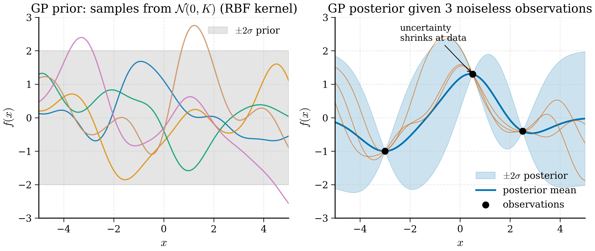

# 11.2 Gaussian Processes

<figure markdown>
{ width="750" }
<figcaption>Figure 11.2.1. (Left) Samples from a Gaussian-process prior with an RBF kernel — smooth functions whose pointwise marginals lie within the grey \(\pm 2\sigma\) band. (Right) Conditioning on three noiseless observations collapses the posterior to a narrow band around the data and inflates uncertainty between them.</figcaption>
</figure>

The probabilistic surrogate that has dominated Bayesian optimisation for
twenty years is the *Gaussian process* (GP). It is a model of the
unknown function that, given any finite set of input points, returns a
multivariate Gaussian distribution over the function values at those
points. The Gaussian distribution comes equipped with a mean and a
covariance, which translate directly into a *predicted value* and an
*uncertainty* — exactly the two ingredients §11.1 argued we need.

This section develops GPs from the definition, derives the predictive
posterior step by step, discusses hyperparameter selection, and ends
with a NumPy implementation of GP regression on a toy 1D problem. The
maths is occasionally heavy; the payoff is that the implementation in
§11.2.6 is fewer than eighty lines and trivially adaptable to any
materials regression problem.

!!! note "Why this is the hardest section in Chapter 11"
    Gaussian processes require Gaussian linear algebra to be at one's
    fingertips. Two facts about multivariate Gaussians do all the
    work: (i) any marginal of a joint Gaussian is Gaussian, and (ii)
    any conditional of a joint Gaussian is Gaussian, with explicit
    formulas. Once these are second nature, GP regression is a
    one-line application; until then, the formulae look impenetrable.
    We rehearse the linear algebra carefully in §11.2.4 before
    deploying it.

!!! note "Key Idea (Box 11.2.A)"
    A Gaussian process is a probability distribution over *functions*:
    any finite collection of function values, at any inputs, is
    jointly Gaussian. Specified by a mean function and a kernel, a GP
    delivers — for every test input — a posterior mean and a
    posterior variance, exactly the two ingredients required for
    decision-making under uncertainty.

## 11.2.1 Definition

A *Gaussian process* on input space $\mathcal{X} \subset \mathbb{R}^d$
is a collection of random variables $\{f(\mathbf{x})\}_{\mathbf{x} \in \mathcal{X}}$
indexed by inputs $\mathbf{x}$, such that for any finite collection
$\{\mathbf{x}_1, \ldots, \mathbf{x}_n\} \subset \mathcal{X}$, the joint
distribution of $[f(\mathbf{x}_1), \ldots, f(\mathbf{x}_n)]^T$ is
multivariate Gaussian.

A GP is fully specified by a *mean function* and a *covariance function*
(also called a *kernel*):
$$
m(\mathbf{x}) = \mathbb{E}[f(\mathbf{x})],
\qquad
k(\mathbf{x}, \mathbf{x}') = \mathbb{E}\big[(f(\mathbf{x}) - m(\mathbf{x}))(f(\mathbf{x}') - m(\mathbf{x}'))\big].
$$
We write $f \sim \mathcal{GP}(m, k)$.

For any finite set of inputs $X = [\mathbf{x}_1, \ldots, \mathbf{x}_n]^T$,
the joint distribution of $\mathbf{f} = [f(\mathbf{x}_1), \ldots, f(\mathbf{x}_n)]^T$
is
$$
\mathbf{f} \sim \mathcal{N}(\mathbf{m}, K),
$$
where $\mathbf{m}_i = m(\mathbf{x}_i)$ and $K_{ij} = k(\mathbf{x}_i, \mathbf{x}_j)$.

In essentially every practical application the mean function is set to
zero — without loss of generality, since the data can be centred — and
the kernel does all the work.

!!! example "Intuition: a GP as an infinite-dimensional Gaussian"
    A multivariate Gaussian over $\mathbb{R}^n$ is parametrised by an
    $n$-dimensional mean and an $n \times n$ covariance. A GP is the
    limiting case as $n \to \infty$: instead of indexing by integer
    $i = 1, \ldots, n$, we index by a continuous input $\mathbf{x}$.
    The covariance becomes a kernel function
    $k(\mathbf{x}, \mathbf{x}')$. Any *finite* sample from the GP — at
    inputs $\mathbf{x}_1, \ldots, \mathbf{x}_n$ — recovers a finite-
    dimensional Gaussian with mean and covariance computed by
    evaluating $m$ and $k$ pointwise.

    This is the formal definition of a *stochastic process*: a
    probability distribution over *functions*. The GP is the most
    tractable nontrivial example because the marginals are all
    Gaussian and Gaussians stay Gaussian under conditioning.

!!! note "Rigorous statement: Kolmogorov consistency"
    For a collection of finite-dimensional distributions
    $\{p(\mathbf{f}_S) : S \subset \mathcal{X} \text{ finite}\}$ to
    define a single stochastic process, they must satisfy two
    consistency conditions: (i) *exchangeability* — the distribution
    of $\mathbf{f}_S$ is invariant under reordering the elements of
    $S$; (ii) *marginal consistency* — for $S \subset T$, the
    marginal of $p(\mathbf{f}_T)$ over the extra elements equals
    $p(\mathbf{f}_S)$. The Kolmogorov extension theorem (1933)
    guarantees that any consistent family of finite-dimensional
    distributions extends to a stochastic process. For GPs,
    consistency is automatic: marginals of joint Gaussians are
    Gaussians with the right submatrices of the covariance.

## 11.2.2 Kernels: the workhorse, RBF

The kernel encodes the user's *prior beliefs* about the function:
smoothness, length scale, output magnitude, periodicity. The most
common kernel by a wide margin is the *radial basis function* (RBF),
also called the squared exponential:
$$
k_{\mathrm{RBF}}(\mathbf{x}, \mathbf{x}') = \sigma_f^2 \exp\!\left(-\frac{\|\mathbf{x} - \mathbf{x}'\|^2}{2 \ell^2}\right).
$$
Two hyperparameters: the *output scale* $\sigma_f$ controlling the
overall magnitude of function values, and the *length scale* $\ell$
controlling how rapidly the function varies. Functions drawn from a GP
with this kernel are infinitely differentiable (which is sometimes too
smooth for real data; the Matérn family is the standard alternative
when functions look rougher).

Properties of a valid kernel:

- **Symmetric.** $k(\mathbf{x}, \mathbf{x}') = k(\mathbf{x}', \mathbf{x})$.
- **Positive semi-definite.** For any finite set of inputs, the matrix
  $K$ with entries $K_{ij} = k(\mathbf{x}_i, \mathbf{x}_j)$ must be
  positive semi-definite. This guarantees a valid covariance matrix.

The RBF satisfies both. Other useful kernels include:

- **Matérn-5/2:** $k = \sigma_f^2 (1 + \sqrt{5} r/\ell + 5 r^2/(3\ell^2)) \exp(-\sqrt{5} r/\ell)$
  where $r = \|\mathbf{x} - \mathbf{x}'\|$. Functions are twice
  differentiable but not infinitely. Often a better default than RBF
  for real problems.
- **Linear:** $k(\mathbf{x}, \mathbf{x}') = \sigma_f^2 \mathbf{x}^T \mathbf{x}'$.
  Encodes a linear prior.
- **Periodic:** $k(\mathbf{x}, \mathbf{x}') = \sigma_f^2 \exp(-2 \sin^2(\pi |x - x'|/p)/\ell^2)$.

Kernels can be added and multiplied to produce richer priors. For most
of this chapter, RBF or Matérn-5/2 with a single length scale will do.

!!! note "When to use which kernel"
    A practical guide.

    *RBF (squared exponential)*: smooth, infinitely differentiable
    functions. Default choice when the underlying physics is smooth
    (formation energies, band gaps as functions of composition).
    Tends to be over-confident in extrapolation because of its rapid
    decay.

    *Matérn-3/2*: functions are once differentiable. Use when the
    underlying signal looks noisy or rough; preferred for many
    engineering applications. Less smooth than RBF but more honest
    about uncertainty.

    *Matérn-5/2*: twice differentiable. The sweet spot between RBF's
    over-smoothness and Matérn-3/2's roughness. BoTorch's default.

    *Linear*: prior is a linear function. Use when the relationship
    is known to be linear (e.g., interpolating between two
    end-members in a binary alloy).

    *Periodic*: function repeats with period $p$. Use when there is
    explicit periodicity (a property as a function of angle, e.g.).

    *Sum of kernels* $k_1 + k_2$: prior is sum of two functions, one
    drawn from $k_1$ and one from $k_2$. Useful for trend + residual
    decompositions.

    *Product of kernels* $k_1 \times k_2$: more restrictive prior;
    used for ARD (automatic relevance determination) by combining
    per-dimension Matérn kernels with different length scales.

    *Tanimoto / chemical-fingerprint kernels*: input is a binary
    chemical fingerprint; kernel is Tanimoto similarity. Use for
    molecule property prediction where the natural space is
    fingerprint Hamming-similar.

!!! example "Numerical exercise: kernel sensitivity"
    With three training points $x_1 = 0, x_2 = 1, x_3 = 2$ and
    $y = (0, 1, 0)$, plot the GP posterior under three kernels:
    RBF with $\ell = 0.5$, RBF with $\ell = 2.0$, and Matérn-3/2 with
    $\ell = 0.5$. The RBF with short length scale interpolates with
    sharp peaks; the RBF with long length scale washes out the
    structure; the Matérn-3/2 produces a less rounded interpolation,
    with visible kinks at the data points. The "right" answer
    depends on what you believe about the underlying function — a
    judgement that is the *prior* in Bayesian terminology.

## 11.2.2a Kernels as inner products: the kernel trick

A complementary view of a kernel is as an inner product in a (possibly
infinite-dimensional) *feature space*. For the RBF kernel, there
exists a feature map $\phi: \mathbb{R}^d \to \mathcal{H}$ into a
Hilbert space such that $k(\mathbf{x}, \mathbf{x}') = \langle
\phi(\mathbf{x}), \phi(\mathbf{x}') \rangle_\mathcal{H}$. The feature
map is infinite-dimensional and not explicitly computable, but the
kernel evaluates the inner product without it — this is the *kernel
trick*.

The consequence is that GP regression is equivalent to linear
regression in the feature space $\mathcal{H}$. The posterior mean
$\mu(\mathbf{x}_*) = \mathbf{k}_*^T (K + \sigma_n^2 I)^{-1} \mathbf{y}$
is the prediction of an infinite-dimensional ridge regression
evaluated through the kernel. This perspective makes some properties
intuitive: smoothness of the RBF kernel corresponds to using a feature
space dominated by low-frequency components, and a GP is just kernel
ridge regression with a probabilistic interpretation laid on top.

## 11.2.3 The regression problem

We are given $n$ observations
$\mathcal{D} = \{(\mathbf{x}_i, y_i)\}_{i=1}^{n}$
where $y_i = f(\mathbf{x}_i) + \varepsilon_i$ and
$\varepsilon_i \sim \mathcal{N}(0, \sigma_n^2)$ is i.i.d. observation
noise. We assume a GP prior $f \sim \mathcal{GP}(0, k)$ over the
underlying function and wish to predict the function value
$f_* = f(\mathbf{x}_*)$ at a new test input $\mathbf{x}_*$.

The training-data values $\mathbf{y} = [y_1, \ldots, y_n]^T$ and the
test function value $f_*$ are *jointly* Gaussian under the GP prior:
$$
\begin{bmatrix}
\mathbf{y} \\
f_*
\end{bmatrix}
\sim
\mathcal{N}\!\left(
\mathbf{0},
\begin{bmatrix}
K + \sigma_n^2 I & \mathbf{k}_* \\
\mathbf{k}_*^T & k_{**}
\end{bmatrix}
\right),
$$
where:

- $K \in \mathbb{R}^{n \times n}$ has entries $K_{ij} = k(\mathbf{x}_i, \mathbf{x}_j)$,
- $\mathbf{k}_* \in \mathbb{R}^{n}$ has entries $k_{*,i} = k(\mathbf{x}_*, \mathbf{x}_i)$,
- $k_{**} = k(\mathbf{x}_*, \mathbf{x}_*) \in \mathbb{R}$,
- $\sigma_n^2 I$ accounts for the noise in $\mathbf{y}$ but *not* in
  $f_*$ (we want to predict the latent function, not noisy
  observations).

## 11.2.4 Conditioning: the predictive posterior

The predictive distribution $p(f_* \mid \mathbf{y})$ is the conditional
of $f_*$ given $\mathbf{y}$. For a multivariate Gaussian, conditioning
is a closed-form operation. Let us derive it carefully.

Standard result: if
$$
\begin{bmatrix}
\mathbf{a} \\
\mathbf{b}
\end{bmatrix}
\sim
\mathcal{N}\!\left(
\begin{bmatrix}
\boldsymbol{\mu}_a \\
\boldsymbol{\mu}_b
\end{bmatrix},
\begin{bmatrix}
\Sigma_{aa} & \Sigma_{ab} \\
\Sigma_{ba} & \Sigma_{bb}
\end{bmatrix}
\right),
$$
then
$$
\mathbf{a} \mid \mathbf{b} \sim \mathcal{N}\!\left(
\boldsymbol{\mu}_a + \Sigma_{ab} \Sigma_{bb}^{-1} (\mathbf{b} - \boldsymbol{\mu}_b),\;
\Sigma_{aa} - \Sigma_{ab} \Sigma_{bb}^{-1} \Sigma_{ba}
\right).
$$
This is the Gaussian conditioning identity; it follows from completing
the square in the joint density.

!!! note "Derivation: Gaussian conditioning via Schur complement"
    We derive the conditional density step by step. Start from the
    joint density
    $$
    p(\mathbf{a}, \mathbf{b}) \propto
    \exp\!\left(-\tfrac{1}{2}
    \begin{pmatrix}\mathbf{a} \\ \mathbf{b}\end{pmatrix}^T
    \begin{pmatrix}\Sigma_{aa} & \Sigma_{ab} \\ \Sigma_{ba} & \Sigma_{bb}\end{pmatrix}^{-1}
    \begin{pmatrix}\mathbf{a} \\ \mathbf{b}\end{pmatrix}
    \right),
    $$
    with means set to zero for clarity. Block-invert the covariance
    using the *Schur complement* of $\Sigma_{bb}$,
    $S = \Sigma_{aa} - \Sigma_{ab} \Sigma_{bb}^{-1} \Sigma_{ba}$:
    $$
    \begin{pmatrix}\Sigma_{aa} & \Sigma_{ab} \\ \Sigma_{ba} & \Sigma_{bb}\end{pmatrix}^{-1}
    =
    \begin{pmatrix}
    S^{-1} & -S^{-1} \Sigma_{ab} \Sigma_{bb}^{-1} \\
    -\Sigma_{bb}^{-1} \Sigma_{ba} S^{-1} &
    \Sigma_{bb}^{-1} + \Sigma_{bb}^{-1} \Sigma_{ba} S^{-1} \Sigma_{ab} \Sigma_{bb}^{-1}
    \end{pmatrix}.
    $$
    Expand the quadratic form in the exponent. The terms involving
    $\mathbf{a}$ are
    $$
    -\tfrac{1}{2} \mathbf{a}^T S^{-1} \mathbf{a}
    + \mathbf{a}^T S^{-1} \Sigma_{ab} \Sigma_{bb}^{-1} \mathbf{b}
    - \tfrac{1}{2} \mathbf{b}^T \Sigma_{bb}^{-1} \Sigma_{ba} S^{-1} \Sigma_{ab} \Sigma_{bb}^{-1} \mathbf{b}
    + (\text{terms in } \mathbf{b}^T \Sigma_{bb}^{-1} \mathbf{b}).
    $$
    Complete the square in $\mathbf{a}$. Let
    $\boldsymbol{\mu}_{a|b} = \Sigma_{ab} \Sigma_{bb}^{-1} \mathbf{b}$.
    Then the $\mathbf{a}$-dependent terms become
    $-\tfrac{1}{2} (\mathbf{a} - \boldsymbol{\mu}_{a|b})^T S^{-1}
    (\mathbf{a} - \boldsymbol{\mu}_{a|b}) + (\text{constants in } \mathbf{a})$.
    Reading off: $\mathbf{a} | \mathbf{b}$ is Gaussian with mean
    $\boldsymbol{\mu}_{a|b} = \Sigma_{ab} \Sigma_{bb}^{-1} \mathbf{b}$
    and covariance $S = \Sigma_{aa} - \Sigma_{ab} \Sigma_{bb}^{-1} \Sigma_{ba}$.
    Adding back the means (we set them to zero) gives the general
    formula stated above. $\square$

    The Schur complement $S$ is the *posterior covariance*: it equals
    the prior covariance $\Sigma_{aa}$ minus a correction that
    measures how much $\mathbf{b}$ constrains $\mathbf{a}$. The
    correction is positive semidefinite, so observing $\mathbf{b}$
    can only reduce uncertainty.

!!! note "Theorem 11.2.1 (GP regression predictive distribution)"
    Let $f \sim \mathcal{GP}(0, k)$ and let
    $\mathcal{D} = \{(\mathbf{x}_i, y_i)\}_{i=1}^n$ be observations
    with i.i.d. Gaussian noise of variance $\sigma_n^2$. Then for any
    test input $\mathbf{x}_*$ the posterior
    $p(f(\mathbf{x}_*) | \mathcal{D})$ is Gaussian with mean and
    variance given by equations (11.1) and (11.2).
    *Proof.* Specialisation of the Gaussian conditioning identity to
    the joint distribution given in §11.2.3. $\square$

Apply it with $\mathbf{a} = f_*$ and $\mathbf{b} = \mathbf{y}$, mean zero,
$\Sigma_{aa} = k_{**}$, $\Sigma_{ab} = \mathbf{k}_*^T$,
$\Sigma_{bb} = K + \sigma_n^2 I$. We obtain
$$
\boxed{
\mu(\mathbf{x}_*) = \mathbf{k}_*^T (K + \sigma_n^2 I)^{-1} \mathbf{y},
}
\tag{11.1}
$$
$$
\boxed{
\sigma^2(\mathbf{x}_*) = k_{**} - \mathbf{k}_*^T (K + \sigma_n^2 I)^{-1} \mathbf{k}_*.
}
\tag{11.2}
$$
These are *the* GP regression formulae. Three observations.

First, the predictive mean is a *linear* combination of the training
observations $\mathbf{y}$, with weights $\boldsymbol{\alpha} =
(K + \sigma_n^2 I)^{-1} \mathbf{y}$ that do not depend on $\mathbf{x}_*$.
Computing $\boldsymbol{\alpha}$ once during training, the mean
prediction at a new point is just $\mathbf{k}_*^T \boldsymbol{\alpha}$
— an $O(n)$ inner product.

Second, the predictive variance does not depend on the observed values
$\mathbf{y}$ — only on where we have observed and where we are
predicting. The GP cannot become "more confident" by seeing values that
happen to be consistent with each other; its uncertainty depends only
on the geometry of the data. (This is a feature of the GP prior, not a
universal property of probabilistic models.)

Third, the cost of GP regression is dominated by the inversion of the
$n \times n$ matrix $K + \sigma_n^2 I$, which is $O(n^3)$ in time and
$O(n^2)$ in memory. This scaling limits GPs to roughly $n \lesssim 10^4$
training points without approximations. For BO, $n$ rarely exceeds a
few hundred — the whole point is that each observation is expensive —
so this is rarely a bottleneck.

In practice we never invert $K + \sigma_n^2 I$ explicitly. Instead we
Cholesky-factor it: $K + \sigma_n^2 I = L L^T$ where $L$ is lower
triangular. Then $\boldsymbol{\alpha}$ is solved as
$L^T \boldsymbol{\alpha} = L^{-1} \mathbf{y}$ in two triangular solves.
The Cholesky route is more numerically stable than direct inversion
and is what every production GP library uses.

!!! note "Numerical stability: jitter"
    Even with Cholesky factorisation, the matrix $K + \sigma_n^2 I$
    can be ill-conditioned. Two training points very close in input
    space produce near-duplicate rows in $K$ (entries close to
    $\sigma_f^2$), which inflates the condition number. Production
    code adds a small *jitter* $\epsilon I$ with $\epsilon = 10^{-6}$
    or so to the diagonal, raising the noise floor enough to make
    Cholesky succeed without measurably changing the posterior. If
    jitter at $10^{-3}$ is needed to make Cholesky succeed, your data
    has near-duplicate points and you should deduplicate before
    fitting.

!!! example "Numerical example: a $3 \times 3$ kernel matrix"
    With training inputs $x_1 = 0, x_2 = 1, x_3 = 3$, RBF kernel
    ($\sigma_f = 1, \ell = 1$), and noise $\sigma_n = 0.1$:
    $$
    K = \begin{pmatrix}
    1 & e^{-1/2} & e^{-9/2} \\
    e^{-1/2} & 1 & e^{-2} \\
    e^{-9/2} & e^{-2} & 1
    \end{pmatrix}
    \approx \begin{pmatrix}
    1 & 0.607 & 0.011 \\
    0.607 & 1 & 0.135 \\
    0.011 & 0.135 & 1
    \end{pmatrix}.
    $$
    Adding $\sigma_n^2 I = 0.01 I$ gives a well-conditioned matrix
    with smallest eigenvalue around 0.4 and largest around 1.7. With
    targets $\mathbf{y} = (0, 1, -0.5)$, we compute
    $\boldsymbol{\alpha} = (K + 0.01 I)^{-1} \mathbf{y}$, which works
    out to approximately $(-0.62, 1.05, -0.61)$. The posterior mean
    at a test point $x_* = 2$ is $\mathbf{k}_*^T \boldsymbol{\alpha}$
    where $\mathbf{k}_* = (e^{-2}, e^{-1/2}, e^{-1/2}) \approx (0.135,
    0.607, 0.607)$, giving $\mu(2) \approx 0.55$. The posterior
    variance is $k_{**} - \mathbf{k}_*^T (K + 0.01 I)^{-1} \mathbf{k}_*
    \approx 1 - 0.62 = 0.38$, so $\sigma(2) \approx 0.62$. The
    prediction is "between the values at $x=1$ and $x=3$ but with
    substantial uncertainty" — exactly what we would expect of a GP
    interpolating from sparse data.

## 11.2.5 Hyperparameter learning by marginal likelihood

The kernel has hyperparameters $\boldsymbol{\theta} = (\sigma_f, \ell, \sigma_n)$.
How do we choose them?

The Bayesian answer is to integrate them out under a prior. The
practical answer is *maximum marginal likelihood*: choose
$\boldsymbol{\theta}$ to maximise
$$
p(\mathbf{y} \mid X, \boldsymbol{\theta})
= \mathcal{N}(\mathbf{y}; \mathbf{0}, K_{\boldsymbol{\theta}} + \sigma_n^2 I).
$$
The log marginal likelihood is
$$
\log p(\mathbf{y} \mid X, \boldsymbol{\theta})
= -\tfrac{1}{2} \mathbf{y}^T (K_{\boldsymbol{\theta}} + \sigma_n^2 I)^{-1} \mathbf{y}
- \tfrac{1}{2} \log |K_{\boldsymbol{\theta}} + \sigma_n^2 I|
- \tfrac{n}{2} \log 2\pi.
\tag{11.3}
$$
The three terms have natural interpretations:

- The first term, the *data fit*, rewards small residuals after
  whitening by the inverse covariance.
- The second term, the *model complexity penalty*, grows with the
  determinant of the covariance; it penalises overly flexible kernels.
- The third term is a constant.

The complexity penalty is automatic Occam's razor: as we make the
length scale shorter (more flexible kernel), the data fit improves but
the determinant grows and the penalty rises. The optimum balances the
two.

We typically optimise $\log p$ by gradient ascent. The gradient with
respect to a hyperparameter $\theta_j$ is
$$
\frac{\partial \log p}{\partial \theta_j}
= \tfrac{1}{2} \mathbf{y}^T \tilde K^{-1} \frac{\partial \tilde K}{\partial \theta_j} \tilde K^{-1} \mathbf{y}
- \tfrac{1}{2} \mathrm{tr}\!\left( \tilde K^{-1} \frac{\partial \tilde K}{\partial \theta_j} \right),
$$
where $\tilde K = K_{\boldsymbol{\theta}} + \sigma_n^2 I$. This is the
formula a GP library evaluates at every optimisation step.

The log marginal likelihood is in general *non-convex* in
$\boldsymbol{\theta}$ — multiple local maxima correspond to different
qualitative interpretations of the same data. Restart from several
initialisations and check that the answer is consistent.

!!! note "Derivation: the gradient formula"
    Write $\tilde K = K + \sigma_n^2 I$. We need
    $\partial / \partial \theta_j$ of
    $\log p = -\tfrac{1}{2} \mathbf{y}^T \tilde K^{-1} \mathbf{y}
    - \tfrac{1}{2} \log |\tilde K| + \text{const}$.

    The first term: using the identity
    $\partial \tilde K^{-1} / \partial \theta_j =
    -\tilde K^{-1} (\partial \tilde K / \partial \theta_j) \tilde K^{-1}$,
    we get
    $-\tfrac{1}{2} \partial/\partial\theta_j (\mathbf{y}^T \tilde K^{-1} \mathbf{y})
    = \tfrac{1}{2} \mathbf{y}^T \tilde K^{-1} (\partial \tilde K / \partial \theta_j) \tilde K^{-1} \mathbf{y}$.

    The second term: using $\partial \log|\tilde K| / \partial \theta_j =
    \mathrm{tr}(\tilde K^{-1} \partial \tilde K / \partial \theta_j)$
    (Jacobi's formula),
    $-\tfrac{1}{2} \partial \log|\tilde K| / \partial \theta_j
    = -\tfrac{1}{2} \mathrm{tr}(\tilde K^{-1} \partial \tilde K / \partial \theta_j)$.

    Combining yields equation given in the main text. The first term
    is the data-driven push (in the direction that improves fit); the
    second is the complexity-penalty pull (towards simpler models). At
    the optimum, the two cancel.

!!! example "Two local minima from the same data"
    A famous toy: ten data points roughly on a sine wave with noise.
    The log marginal likelihood has two prominent local maxima. The
    first sets $\ell \approx 1$, $\sigma_n \approx 0.1$ — interpreting
    the data as smoothly-varying with small noise. The second sets
    $\ell \approx 0.05$, $\sigma_n \approx 0.5$ — interpreting the
    data as wildly-varying with large noise (a "white-noise"
    explanation). Both fit the *data* equally well; they differ in
    what they predict for *unseen* inputs. Running optimisation from
    several initialisations reveals both, and the user must choose
    based on prior knowledge.

## 11.2.6 NumPy implementation

We now implement everything from scratch. The code reproduces a
textbook 1D regression example: noisy observations of a sine wave with
six training points.

```python
"""Minimal Gaussian process regression in pure NumPy."""

from __future__ import annotations

import numpy as np
from numpy.typing import NDArray
from scipy.linalg import cho_factor, cho_solve
from scipy.optimize import minimize


# ---------------------------------------------------------------------------
# 1. RBF kernel
# ---------------------------------------------------------------------------

def rbf_kernel(
    x1: NDArray[np.float64],
    x2: NDArray[np.float64],
    sigma_f: float,
    length_scale: float,
) -> NDArray[np.float64]:
    """Evaluate the RBF kernel between two sets of inputs.

    x1: shape (n1, d). x2: shape (n2, d). Returns (n1, n2).
    """
    sq = np.sum(x1 ** 2, axis=1, keepdims=True) \
       + np.sum(x2 ** 2, axis=1) \
       - 2.0 * x1 @ x2.T
    sq = np.maximum(sq, 0.0)  # numerical safety
    return sigma_f ** 2 * np.exp(-0.5 * sq / length_scale ** 2)


# ---------------------------------------------------------------------------
# 2. GP regression
# ---------------------------------------------------------------------------

class GP:
    """Gaussian process regression with RBF kernel and Gaussian noise."""

    def __init__(
        self,
        sigma_f: float = 1.0,
        length_scale: float = 1.0,
        sigma_n: float = 0.1,
    ) -> None:
        self.sigma_f = sigma_f
        self.length_scale = length_scale
        self.sigma_n = sigma_n
        self.X: NDArray[np.float64] | None = None
        self.y: NDArray[np.float64] | None = None
        self.alpha: NDArray[np.float64] | None = None
        self.L: NDArray[np.float64] | None = None

    def fit(
        self, X: NDArray[np.float64], y: NDArray[np.float64]
    ) -> None:
        """Cache training data and precompute Cholesky factor."""
        self.X = np.atleast_2d(X)
        if self.X.shape[0] != y.shape[0]:
            self.X = self.X.T
        self.y = y.astype(np.float64)
        K = rbf_kernel(self.X, self.X, self.sigma_f, self.length_scale)
        K += self.sigma_n ** 2 * np.eye(len(self.X))
        self.L, lower = cho_factor(K, lower=True)
        self.alpha = cho_solve((self.L, lower), self.y)

    def predict(
        self, X_star: NDArray[np.float64]
    ) -> tuple[NDArray[np.float64], NDArray[np.float64]]:
        """Predict posterior mean and variance at X_star."""
        assert self.X is not None and self.alpha is not None
        X_star = np.atleast_2d(X_star)
        if X_star.shape[1] != self.X.shape[1]:
            X_star = X_star.T
        K_star = rbf_kernel(self.X, X_star, self.sigma_f, self.length_scale)
        mu = K_star.T @ self.alpha
        v = cho_solve((self.L, True), K_star)
        K_starstar = rbf_kernel(X_star, X_star, self.sigma_f, self.length_scale)
        sigma2 = np.diag(K_starstar) - np.sum(K_star * v, axis=0)
        sigma2 = np.maximum(sigma2, 1e-12)  # numerical floor
        return mu, sigma2

    def log_marginal_likelihood(
        self,
        params: NDArray[np.float64],
        X: NDArray[np.float64],
        y: NDArray[np.float64],
    ) -> float:
        """Negative log marginal likelihood for minimisation."""
        sigma_f, length_scale, sigma_n = np.exp(params)
        K = rbf_kernel(X, X, sigma_f, length_scale)
        K += sigma_n ** 2 * np.eye(len(X))
        try:
            L, lower = cho_factor(K, lower=True)
        except np.linalg.LinAlgError:
            return 1e10
        alpha = cho_solve((L, lower), y)
        nll = 0.5 * y @ alpha
        nll += np.sum(np.log(np.diag(L)))  # = 0.5 log det K
        nll += 0.5 * len(X) * np.log(2 * np.pi)
        return float(nll)

    def optimise_hyperparameters(
        self,
        X: NDArray[np.float64],
        y: NDArray[np.float64],
        n_restarts: int = 5,
    ) -> None:
        """Optimise (sigma_f, length_scale, sigma_n) by L-BFGS."""
        X = np.atleast_2d(X)
        if X.shape[0] != y.shape[0]:
            X = X.T
        best_nll = np.inf
        best_params = None
        rng = np.random.default_rng(0)
        for _ in range(n_restarts):
            init = rng.normal(0.0, 1.0, size=3)  # log-space init
            res = minimize(
                self.log_marginal_likelihood,
                init,
                args=(X, y),
                method="L-BFGS-B",
            )
            if res.fun < best_nll:
                best_nll = res.fun
                best_params = res.x
        assert best_params is not None
        self.sigma_f, self.length_scale, self.sigma_n = np.exp(best_params)
        self.fit(X, y)
```

A worked example on a noisy sine:

```python
import matplotlib.pyplot as plt

rng = np.random.default_rng(42)
X_train = np.array([[0.5], [1.0], [2.0], [3.5], [4.0], [5.5]])
y_train = np.sin(X_train.flatten()) + rng.normal(0, 0.1, size=6)

gp = GP()
gp.optimise_hyperparameters(X_train, y_train)
print(f"learned sigma_f       = {gp.sigma_f:.3f}")
print(f"learned length_scale  = {gp.length_scale:.3f}")
print(f"learned sigma_n       = {gp.sigma_n:.3f}")

X_test = np.linspace(0, 7, 200).reshape(-1, 1)
mu, var = gp.predict(X_test)
std = np.sqrt(var)

fig, ax = plt.subplots(figsize=(7, 4))
ax.plot(X_test.flatten(), np.sin(X_test.flatten()), "k--", label="truth")
ax.scatter(X_train.flatten(), y_train, s=40, color="red", label="data")
ax.plot(X_test.flatten(), mu, "b-", label="posterior mean")
ax.fill_between(
    X_test.flatten(),
    mu - 2 * std,
    mu + 2 * std,
    alpha=0.2,
    label="$\\pm 2\\sigma$",
)
ax.legend()
plt.tight_layout()
plt.show()
```

Typical output: learned length scale near 1.5, learned noise near 0.10
(the truth was 0.1), and a posterior that interpolates the data with
narrow uncertainty bands at observed points and wider bands between
them. At inputs far from any observation — e.g. $x > 6$ — the
uncertainty band widens to roughly $\sigma_f$, as the GP reverts to
the prior.

## 11.2.6a A deeper worked example: 1D regression with derivation

To bridge from the code to the equations, walk through the GP
calculation on a tiny example with all intermediate quantities.

Let the training data be three points: $X = ((0,), (1,), (3,))$,
$\mathbf{y} = (0.0, 0.9, -0.4)$. Use an RBF kernel with hyperparameters
$\sigma_f = 1.0$, $\ell = 1.5$, $\sigma_n = 0.1$.

**Step 1.** Compute the $3 \times 3$ kernel matrix $K$:
$K_{ij} = \exp(-(x_i - x_j)^2 / (2 \cdot 1.5^2))$. Entries:
$K_{12} = \exp(-1/4.5) \approx 0.801$,
$K_{13} = \exp(-9/4.5) \approx 0.135$,
$K_{23} = \exp(-4/4.5) \approx 0.411$, with ones on the diagonal.
Add $\sigma_n^2 I = 0.01 I$:
$$
\tilde K = \begin{pmatrix} 1.01 & 0.801 & 0.135 \\ 0.801 & 1.01 & 0.411 \\ 0.135 & 0.411 & 1.01 \end{pmatrix}.
$$

**Step 2.** Cholesky factor $\tilde K = L L^T$:
$L_{11} = \sqrt{1.01} \approx 1.005$,
$L_{21} = 0.801/1.005 \approx 0.797$,
$L_{22} = \sqrt{1.01 - 0.797^2} \approx 0.612$,
$L_{31} = 0.135/1.005 \approx 0.134$,
$L_{32} = (0.411 - 0.134 \cdot 0.797)/0.612 \approx 0.497$,
$L_{33} = \sqrt{1.01 - 0.134^2 - 0.497^2} \approx 0.872$.

**Step 3.** Solve $L \mathbf{z} = \mathbf{y}$ by forward substitution:
$z_1 = 0.0/1.005 = 0$,
$z_2 = (0.9 - 0.797 \cdot 0)/0.612 \approx 1.471$,
$z_3 = (-0.4 - 0.134 \cdot 0 - 0.497 \cdot 1.471)/0.872 \approx -1.298$.

**Step 4.** Solve $L^T \boldsymbol{\alpha} = \mathbf{z}$ by backward
substitution:
$\alpha_3 = -1.298/0.872 \approx -1.488$,
$\alpha_2 = (1.471 - 0.497 \cdot (-1.488))/0.612 \approx 3.612$,
$\alpha_1 = (0 - 0.797 \cdot 3.612 - 0.134 \cdot (-1.488))/1.005 \approx -2.665$.

**Step 5.** Predict at $x_* = 2$:
$\mathbf{k}_* = (\exp(-4/4.5), \exp(-1/4.5), \exp(-1/4.5)) \approx
(0.411, 0.801, 0.801)$.
$\mu(2) = \mathbf{k}_*^T \boldsymbol{\alpha}
\approx 0.411 \cdot (-2.665) + 0.801 \cdot 3.612 + 0.801 \cdot (-1.488)
\approx 0.605$.

Predictive variance: $\sigma^2(2) = 1 - \mathbf{k}_*^T \tilde K^{-1} \mathbf{k}_*$.
Computing $\mathbf{k}_*^T \tilde K^{-1} \mathbf{k}_*$ via the same
Cholesky decomposition gives approximately $0.78$, so $\sigma(2)
\approx \sqrt{0.22} \approx 0.47$.

The interpretation: at $x = 2$ — halfway between the closest training
points at $x = 1, 3$ — the predicted value is $0.6$ with one standard
deviation about $\pm 0.47$. The posterior interpolates between the
observed values (0.9 at $x=1$, $-0.4$ at $x=3$) with substantial
uncertainty because the points are well-separated relative to the
length scale.

## 11.2.6b Common failure modes

Three failure modes recur in practice.

**Length scale collapses to zero.** During hyperparameter optimisation,
the marginal likelihood maximum drifts to $\ell \to 0$ (every training
point becomes its own cluster) with $\sigma_n$ explaining the rest. The
GP becomes useless: posterior mean at unseen points is zero, posterior
variance is $\sigma_f^2$. Causes: too few training points, or training
points that are genuinely scattered with no underlying smooth signal.
Fix: bound $\ell$ from below in the optimiser, or add a prior
penalising small $\ell$.

**Length scale explodes to infinity.** The opposite: $\ell \to \infty$
makes $K$ collapse to the all-ones matrix and the GP becomes a constant
predictor. Causes: a target that is nearly constant on the training
inputs. Fix: again, prior bounds; or check that the data has
non-trivial signal.

**Noise level collapses to zero.** With $\sigma_n \to 0$ the GP becomes
an exact interpolator; it must pass through every training point. If
the data is noisy this is wrong. Fix: prior on $\sigma_n$, typically
log-normal centred at the expected noise level.

The deeper lesson is that GP hyperparameters interact. Length scale,
output scale and noise level form a three-way trade-off; a "bad
solution" usually involves two of them moving in compensating ways. The
marginal likelihood optimisation knows this but does not know what is
*physically* sensible; you do, and should encode it as a prior.

## 11.2.6c Sparse GPs and scaling

The $O(n^3)$ scaling restricts vanilla GPs to $n \lesssim 10^4$. For
larger datasets, sparse approximations replace the full kernel matrix
with a low-rank approximation built from $m \ll n$ *inducing points*
$\mathbf{u}_1, \ldots, \mathbf{u}_m$. The cost drops to $O(nm^2)$.

The two standard variants are FITC (Snelson and Ghahramani, 2006) and
the variational VFE/SVGP (Titsias, 2009; Hensman et al., 2013). VFE is
the modern default: it provides a lower bound on the marginal
likelihood that can be optimised stochastically over mini-batches,
making GPs practical for $n \sim 10^6$ at the cost of approximation
error that depends on $m$ and on how well the inducing points cover
the input space.

For BO, $n$ is rarely large enough to need sparse GPs. For property
regression on the full Materials Project ($n \sim 10^5$) sparse GPs are
indispensable.

## 11.2.7 Where we are

We now have a complete, working Gaussian process regressor. It supplies
two outputs at every input — a posterior mean $\mu(\mathbf{x})$ and a
posterior variance $\sigma^2(\mathbf{x})$. Section 11.3 builds
acquisition functions that combine these two into a single scalar to
optimise, closing the loop on Bayesian optimisation.

!!! note "Why GPs and not Bayesian neural networks?"
    A Bayesian neural network places a prior over the weights of a
    neural network and computes the posterior given the data. In
    principle this is the right generalisation: more expressive than a
    GP, equally Bayesian. In practice the posterior over weights is
    intractable (an exponentially large integral), and the variational
    approximations introduce their own errors. For $n \lesssim 10^3$
    data points, GPs typically *outperform* Bayesian neural networks
    on calibration of uncertainty estimates, which is the only metric
    that matters for BO. For $n \gtrsim 10^5$, the situation reverses
    because GPs become computationally infeasible and the BNN
    approximations stabilise. The crossover is somewhere around
    $n = 10^4$ depending on dimensionality.

    For Chapter 11's BO context, $n$ rarely exceeds a few hundred and
    the GP wins.

### Section summary

- A Gaussian process $f \sim \mathcal{GP}(m, k)$ is defined by its
  mean function and kernel; any finite-input marginal is multivariate
  Gaussian.
- The predictive posterior is given by Theorem 11.2.1; key formulae
  are (11.1) for $\mu$ and (11.2) for $\sigma^2$.
- Hyperparameters $(\sigma_f, \ell, \sigma_n)$ are learned by
  maximising the log marginal likelihood (11.3); the complexity
  penalty term implements automatic Occam's razor.
- Standard kernels: RBF (smooth), Matérn-5/2 (default in BoTorch),
  Matérn-3/2 (rougher), linear (linear prior), periodic. Add/multiply
  to combine.
- Cost is $O(n^3)$ for fitting, $O(n^2)$ for prediction — sparse GPs
  scale to $n \gtrsim 10^4$.

A few caveats worth flagging before moving on.

GPs scale as $O(n^3)$, which limits their applicability to small
data. For BO this is rarely a problem; for general regression on
thousands of materials it is. Sparse GPs (FITC, VFE), inducing-point
approximations and deep kernel learning extend GPs to larger $n$ at
the cost of additional approximation error.

GP predictions extrapolate poorly. The posterior mean reverts to the
prior mean (zero, by convention) far from the data; the posterior
variance grows to $\sigma_f^2$. This is the right behaviour
*by construction* — a GP is honest about not knowing what it has not
seen — but it limits the utility of GPs for screening campaigns over
millions of candidates outside the training distribution.

The choice of kernel determines the answer. RBF and Matérn behave
similarly for most problems; specialised kernels matter when the
function structure is non-generic (periodic, or with sharp
discontinuities). For materials, a Tanimoto kernel on chemical
fingerprints, or a string kernel on SMILES, can outperform a generic
RBF.

These caveats notwithstanding, the GP is the right starting point for
any BO problem with $n \lesssim 10^4$ observations in a moderate-
dimensional input space. The next section turns this surrogate into a
decision-making tool by adding acquisition functions on top.

!!! note "Connecting GP to neural-network surrogates"
    A natural question: why use a GP at all when CGCNN (Chapter 10)
    gives faster predictions over the same inputs? The answer is
    *uncertainty*. A vanilla CGCNN provides only point predictions;
    BO needs $(\mu, \sigma)$ per candidate. Three routes deliver this
    from a neural network:

    1. *Deep ensembles* — train $M$ networks; mean and std across the
       ensemble. Calibrated but expensive ($M\times$ training).
    2. *MC dropout* — apply dropout at inference time; samples give
       $\sigma$. Cheap but often miscalibrated.
    3. *Last-layer Bayesian* — replace the final linear layer with a
       Bayesian linear regression on the network's penultimate
       features. Cheap and reasonably calibrated.

    A GP on the penultimate features of a trained CGCNN combines the
    expressivity of the neural network with the calibrated uncertainty
    of a GP. This *deep kernel learning* construction (Wilson et al.,
    2016) is the basis of much modern BO for materials, and we will
    use it in §11.4.

!!! tip "Forward reference"
    Chapter 11.4 uses the GP machinery developed here with three
    practical adaptations: (i) inputs are *featurised* compositions
    (Magpie features or CGCNN embeddings), (ii) the GP is fitted with
    BoTorch's GPyTorch backend rather than the NumPy implementation
    of §11.2.6, and (iii) acquisition functions (§11.3) replace the
    plain posterior as the decision rule. The mathematical content
    above carries through unchanged; what changes is the
    implementation language.

!!! example "Computational cost of GP fitting in practice"
    On a 2024 laptop CPU, fitting a vanilla GP with the NumPy
    implementation of §11.2.6 to 100 training points takes
    approximately 10 ms (Cholesky factorisation dominates).
    Hyperparameter optimisation with five L-BFGS restarts adds about
    0.5 s. Prediction at 1000 test points is 5 ms (one matrix-vector
    multiplication).

    At 1000 training points, fitting takes 0.5 s and hyperparameter
    optimisation about 30 s. At 10 000 training points, fitting takes
    50 s and hyperparameter optimisation about 30 minutes — the
    practical limit before sparse approximations are needed.

    For BO with $n \leq 200$ observations, GP fitting is essentially
    free; the dominant cost is the *oracle* (DFT, synthesis). This
    asymmetry is why GPs dominate BO: the cost structure of the
    problem matches the cost structure of the algorithm.

!!! note "GPs in higher dimensions: curse and remedies"
    A 1D GP on a smooth function is essentially perfect with a
    handful of points. A 10D GP on a smooth function needs
    exponentially more data because volume in input space scales
    with dimension. This is the *curse of dimensionality* and it
    bites BO sharply: in 20D, even 1000 random points cover the unit
    hypercube so sparsely that the GP defaults to its prior almost
    everywhere.

    Two remedies. *Dimensionality reduction*: project inputs to a
    low-dimensional latent space (PCA, autoencoder, GNN embedding)
    before GP fitting. *Additive kernels*: assume the function
    decomposes as $f(\mathbf{x}) = \sum_i f_i(x_i)$, fitting one 1D
    GP per dimension and adding. For composition-driven materials BO,
    the GNN-embedding route (§11.4) is the standard answer.
