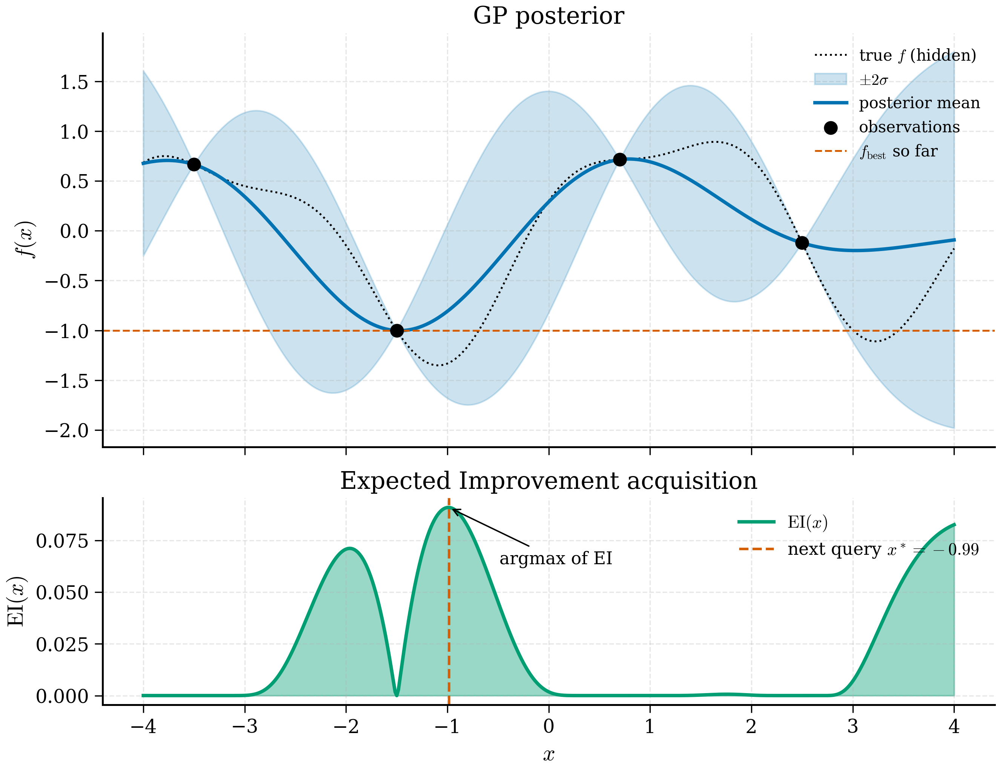

# 11.3 Acquisition Functions

<figure markdown>
{ width="650" }
<figcaption>Figure 11.3.1. The Expected Improvement (EI) acquisition function in 1D. The top panel shows a GP posterior over four observations; the bottom panel shows EI, which is large where the posterior mean is below \(f_{\text{best}}\) <em>or</em> the uncertainty is large. The next query is placed at the EI maximum.</figcaption>
</figure>

A Gaussian process gives, at every input $\mathbf{x}$, two numbers — a
posterior mean $\mu(\mathbf{x})$ and a posterior standard deviation
$\sigma(\mathbf{x})$. Bayesian optimisation reduces these two numbers
to a single scalar, the *acquisition function* $\alpha(\mathbf{x})$,
and selects the next query as
$$
\mathbf{x}_\text{next} = \arg\max_{\mathbf{x} \in \mathcal{X}} \alpha(\mathbf{x}).
$$
The acquisition function encodes the exploration-exploitation trade-off
discussed in §11.1; its specific form embodies a specific stance on
how to weight uncertain candidates relative to confident ones. This
section derives the three workhorse acquisitions — expected
improvement, upper confidence bound, Thompson sampling — discusses the
knowledge gradient, sketches multi-objective extensions, and implements
EI and UCB on the 1D example from §11.2.

We adopt the convention that the BO objective is *maximisation* (a band
gap to maximise, an efficiency to maximise). Minimisation is recovered
by negating the target.

## 11.3.1 Expected Improvement

Let $f^+ = \max_i y_i$ denote the best observed value so far, where the
$y_i$ are the noisy training labels (some authors use the latent
function value at the best observed input; the difference is small in
practice). Define the *improvement* of a candidate $\mathbf{x}$ as
$$
I(\mathbf{x}) = \max(f(\mathbf{x}) - f^+, 0).
$$
This is non-negative: a candidate that exceeds the current best by
$\Delta$ achieves improvement $\Delta$; a candidate that underperforms
achieves zero improvement.

Under the GP posterior, $f(\mathbf{x}) \sim \mathcal{N}(\mu(\mathbf{x}), \sigma^2(\mathbf{x}))$,
and the improvement is a random variable. The *expected improvement* is
the expectation of $I(\mathbf{x})$ over this posterior:
$$
\mathrm{EI}(\mathbf{x}) = \mathbb{E}\!\left[\max(f(\mathbf{x}) - f^+, 0)\right].
$$
This is the central acquisition function of Bayesian optimisation. We
derive its closed form.

Let $Z = (f(\mathbf{x}) - \mu(\mathbf{x})) / \sigma(\mathbf{x})$ be the
standardised posterior variable; it is standard normal. Then
$f(\mathbf{x}) - f^+ = \sigma(\mathbf{x}) Z + (\mu(\mathbf{x}) - f^+)$.
Define
$$
z = \frac{\mu(\mathbf{x}) - f^+}{\sigma(\mathbf{x})}.
$$
Then $f(\mathbf{x}) - f^+ = \sigma(\mathbf{x})(Z + z)$, which is
non-negative iff $Z \geq -z$. Therefore
$$
\mathrm{EI}(\mathbf{x}) = \int_{-z}^{\infty} \sigma(\mathbf{x})(z' + z) \phi(z') \, dz',
$$
where $\phi$ is the standard normal density. Splitting the integral,
$$
\mathrm{EI}(\mathbf{x}) = \sigma(\mathbf{x}) \left[ z \int_{-z}^{\infty} \phi(z') \, dz' + \int_{-z}^{\infty} z' \phi(z') \, dz' \right].
$$
The first integral is $1 - \Phi(-z) = \Phi(z)$, where $\Phi$ is the
standard normal CDF. The second uses
$\int z' \phi(z') dz' = -\phi(z')$:
$$
\int_{-z}^{\infty} z' \phi(z') \, dz' = -\phi(z')\Big|_{-z}^{\infty} = \phi(-z) = \phi(z).
$$
Assembling,
$$
\boxed{
\mathrm{EI}(\mathbf{x}) = \sigma(\mathbf{x}) \left[ z \Phi(z) + \phi(z) \right],
\qquad
z = \frac{\mu(\mathbf{x}) - f^+}{\sigma(\mathbf{x})}.
}
\tag{11.4}
$$
This is the form derived by Mockus (1975) and rediscovered by Jones,
Schonlau and Welch (1998) — the latter is the paper most cited in the
modern BO literature.

Two limits illuminate the formula.

When $\mu \gg f^+$ and $\sigma$ is moderate, $z \to \infty$,
$\Phi(z) \to 1$, $\phi(z) \to 0$, and $\mathrm{EI} \to \mu - f^+$. The
acquisition reduces to the predicted improvement — pure exploitation.

When $\sigma \to 0$ at a point with $\mu \leq f^+$, $\mathrm{EI} \to 0$.
A candidate the model is sure is no better than the current best is not
worth investigating.

When $\sigma$ is large at a point where $\mu \approx f^+$, $z \approx 0$,
$\Phi(0) = 1/2$, $\phi(0) = 1/\sqrt{2\pi}$, and
$\mathrm{EI} \approx \sigma / \sqrt{2\pi}$. The acquisition grows
linearly in $\sigma$: uncertain candidates near the current best are
attractive even if their mean is not exceptional.

This *automatic* trade-off is what makes EI so widely used. There is no
explicit exploration parameter; the function naturally balances the
two.

EI has a known weakness: it can over-exploit when the posterior is
badly miscalibrated. A small but stubborn refinement is *exploration-
augmented EI*, which adds a small $\xi > 0$ to the threshold:
$z = (\mu - f^+ - \xi) / \sigma$. With $\xi$ in the range $0.01$ to
$0.1$ (in the units of $y$), EI requires candidates to beat the current
best by a comfortable margin before being scored — discouraging the
algorithm from clustering around the current optimum. This trick is
standard in production BO codes.

## 11.3.2 Upper Confidence Bound

The upper confidence bound (UCB) is simpler:
$$
\boxed{
\mathrm{UCB}(\mathbf{x}) = \mu(\mathbf{x}) + \kappa \sigma(\mathbf{x}).
}
\tag{11.5}
$$
It scores each candidate as the upper edge of a $\kappa$-standard-
deviation confidence interval around its mean. Large $\kappa$ favours
high-uncertainty candidates; small $\kappa$ favours high-mean
candidates.

The trade-off here is fully explicit and externally controlled. Two
common choices for $\kappa$.

**Fixed $\kappa$.** Set $\kappa = 2$ (corresponding to a 95% upper
bound under Gaussian assumptions). Simple, predictable, used widely in
practice.

**Time-decaying $\kappa$.** Set $\kappa_t = \sqrt{2 \log(t^2 \pi^2 / (6\delta))}$
where $t$ is the iteration index and $\delta$ is a small constant.
This is the schedule from Srinivas et al. (2010), who proved that
GP-UCB with this schedule has sublinear regret — the average per-
iteration suboptimality decays to zero as $t \to \infty$. The
schedule explores aggressively early and exploits late.

UCB is in some sense the *most theoretically grounded* acquisition,
with sharper regret bounds than EI. In practice the two are
competitive; UCB is preferred when one wants explicit control over
the exploration-exploitation balance, EI when one wants a sensible
default.

## 11.3.3 Thompson sampling

Thompson sampling has the most distinctive flavour of the three. At
each iteration, *sample* a function $\tilde f$ from the GP posterior
and select the next query as the maximum of the sample:
$$
\mathbf{x}_\text{next} = \arg\max_{\mathbf{x}} \tilde f(\mathbf{x}),
\qquad \tilde f \sim p(f \mid \mathcal{D}).
$$
Where does the trade-off come from? In regions where the GP is
confident, samples cluster around the posterior mean; the sampled
maximum reliably lies near the posterior maximum (exploit). In regions
where the GP is uncertain, different samples assign wildly different
function values; the sampled maximum sometimes lies in those uncertain
regions (explore). The randomness of the sample mixes the two.

A practical wrinkle: drawing a *function* from a GP is expensive — the
sample is jointly Gaussian over all candidate inputs, so one must
sample from a multivariate Gaussian with covariance of size $N \times N$
where $N$ is the candidate count. For $N \lesssim 10^4$ this is
tractable. For larger $N$, *random Fourier features* allow approximate
sampling at much lower cost.

Thompson sampling is particularly elegant in *batch* settings: drawing
$B$ independent function samples and selecting their respective maxima
naturally diversifies the batch, without requiring an explicit batch
acquisition function. BoTorch supports this directly.

## 11.3.4 The Knowledge Gradient

The acquisitions so far ask "what is the immediate improvement from
querying $\mathbf{x}$?" — a one-step-lookahead. The *knowledge gradient*
(KG) asks a more refined question: "after querying $\mathbf{x}$ and
updating the GP, how much better is my future predicted best value
than my current predicted best?" Formally,
$$
\mathrm{KG}(\mathbf{x}) = \mathbb{E}\!\left[ \max_{\mathbf{x}'} \mu_{t+1}(\mathbf{x}') \;\bigg|\; \text{queried } \mathbf{x} \right] - \max_{\mathbf{x}'} \mu_t(\mathbf{x}').
$$
The expectation is over the posterior distribution of the next
observation $y_{t+1}$. The integral cannot in general be done in
closed form, but can be approximated by Monte Carlo sampling.

KG is the natural acquisition when the goal is the *final
recommendation* after the campaign, not the best in-progress value. It
handles noisy observations and finite-budget terminal-reward problems
more naturally than EI, at the cost of harder optimisation.

In practice KG is used when its higher quality justifies the
implementation overhead — primarily in industrial chemistry and
process optimisation. For most academic materials BO, EI is the
default, with UCB as the explicit-control alternative.

## 11.3.5 When each is the right choice

A practical guide:

- **Use EI** as the default when:
  - your objective is real-valued and the goal is to maximise it,
  - you have a single objective (not Pareto),
  - your GP is reasonably well-calibrated,
  - you have moderate observation noise (variance noise/signal of
    order 1).

- **Use UCB** when:
  - you need explicit, tunable control over exploration vs exploitation,
  - you are tracking theoretical regret bounds,
  - you want a smoother acquisition surface (UCB is easier to optimise
    than EI for some kernels).

- **Use Thompson sampling** when:
  - you want batch BO without writing a batch acquisition,
  - you want a fully Bayesian feel to the algorithm,
  - your candidate set is small enough to draw posterior samples.

- **Use Knowledge Gradient** when:
  - you have noisy observations and care only about the terminal
    recommendation,
  - the implementation effort is justified by the problem stakes.

For multi-objective problems, none of the above apply directly; see
the next subsection.

## 11.3.6 Multi-objective BO and Pareto fronts

Most materials problems have more than one objective. A
high-performance solar cell needs both high efficiency and low cost;
a structural alloy needs strength *and* ductility. The two objectives
are usually in tension, and there is no single best material —
instead a *Pareto front* of materials that cannot be improved on one
objective without worsening another.

The standard acquisition for multi-objective BO is *expected
hypervolume improvement* (EHVI). Given a set of observed objective
vectors $\{(y_1^{(i)}, y_2^{(i)}, \ldots, y_M^{(i)})\}$, define the
*dominated hypervolume* as the volume of the region in objective
space dominated by at least one observed point (bounded by a reference
point). EHVI asks: if we query candidate $\mathbf{x}$, how much do we
expect to grow the dominated hypervolume?

For two objectives EHVI is computable in closed form via a partition
of the dominated region; for three or more objectives one resorts to
Monte Carlo. BoTorch implements this directly via
`qExpectedHypervolumeImprovement`, which is the right starting point
for any multi-objective materials problem.

The conceptual content is the same as single-objective EI — quantify
the expected improvement under the surrogate's posterior, query the
candidate that maximises it — generalised from a scalar to a Pareto-
front objective. We will use EHVI in the perovskite case study of §11.4.

## 11.3.7 Implementation: EI and UCB on the 1D example

We extend the GP from §11.2.6 with acquisition functions and run a
short BO loop on the sine objective.

```python
"""Acquisition functions and a short BO loop."""

from __future__ import annotations

import numpy as np
from numpy.typing import NDArray
from scipy.stats import norm

# Assume GP from 02-gp.md is imported.


def expected_improvement(
    gp: GP,
    X: NDArray[np.float64],
    f_best: float,
    xi: float = 0.01,
) -> NDArray[np.float64]:
    """Expected improvement for a maximisation objective."""
    mu, var = gp.predict(X)
    sigma = np.sqrt(np.maximum(var, 1e-12))
    z = (mu - f_best - xi) / sigma
    ei = sigma * (z * norm.cdf(z) + norm.pdf(z))
    ei[sigma < 1e-9] = 0.0  # zero-uncertainty points get no EI
    return ei


def upper_confidence_bound(
    gp: GP,
    X: NDArray[np.float64],
    kappa: float = 2.0,
) -> NDArray[np.float64]:
    """UCB acquisition."""
    mu, var = gp.predict(X)
    return mu + kappa * np.sqrt(np.maximum(var, 1e-12))
```

Demonstration: maximise $f(x) = \sin(x)$ on $x \in [0, 7]$ starting
from three initial observations.

```python
import matplotlib.pyplot as plt

rng = np.random.default_rng(0)
true_f = lambda x: np.sin(x)
noise_level = 0.05

# Initial training data
X_init = np.array([[1.5], [3.0], [5.0]])
y_init = true_f(X_init.flatten()) + rng.normal(0, noise_level, size=3)
X_train = X_init.copy()
y_train = y_init.copy()

# Candidate set for acquisition optimisation (dense grid for 1D)
X_cand = np.linspace(0, 7, 500).reshape(-1, 1)

for iteration in range(10):
    gp = GP()
    gp.optimise_hyperparameters(X_train, y_train)
    f_best = float(np.max(y_train))
    ei = expected_improvement(gp, X_cand, f_best, xi=0.01)
    x_next = X_cand[np.argmax(ei)].reshape(1, -1)
    y_next = true_f(float(x_next)) + rng.normal(0, noise_level)
    X_train = np.vstack([X_train, x_next])
    y_train = np.append(y_train, y_next)
    print(
        f"iter {iteration:2d}: queried x = {float(x_next):.3f}, "
        f"y = {y_next:+.3f}, best so far = {np.max(y_train):+.3f}"
    )

# Final plot
gp = GP()
gp.optimise_hyperparameters(X_train, y_train)
mu, var = gp.predict(X_cand)
std = np.sqrt(var)
ei = expected_improvement(gp, X_cand, float(np.max(y_train)), xi=0.01)

fig, (ax1, ax2) = plt.subplots(2, 1, figsize=(8, 6), sharex=True)
ax1.plot(X_cand.flatten(), true_f(X_cand.flatten()), "k--", label="truth")
ax1.plot(X_cand.flatten(), mu, "b-", label="GP mean")
ax1.fill_between(X_cand.flatten(), mu - 2 * std, mu + 2 * std, alpha=0.2)
ax1.scatter(X_train.flatten(), y_train, c="red", s=30, label="queries")
ax1.legend()
ax1.set_ylabel("f(x)")
ax2.plot(X_cand.flatten(), ei, "g-")
ax2.set_xlabel("x")
ax2.set_ylabel("EI(x)")
plt.tight_layout()
plt.show()
```

Typical run output:

```
iter  0: queried x = 1.566, y = +1.001, best so far = +1.001
iter  1: queried x = 6.293, y = -0.018, best so far = +1.001
iter  2: queried x = 1.535, y = +1.013, best so far = +1.013
...
iter  9: queried x = 1.572, y = +0.996, best so far = +1.013
```

By iteration 2 the algorithm has localised the global maximum at
$x \approx \pi/2$ (true maximum $\sin(\pi/2) = 1$), then alternates
between confirming it and probing other regions to confirm no better
maximum exists. The acquisition surface at convergence is essentially
flat — the GP is confident everywhere — and the BO loop has converged.

If we replace EI with UCB and set $\kappa = 2$, the qualitative
behaviour is similar but the algorithm spends more time probing
high-variance regions early. Setting $\kappa = 5$ explores even more
aggressively, sometimes at the cost of slower convergence to the
maximum but with stronger guarantees that no better maximum has been
missed.

## 11.3.8 Where we are

We have a GP that produces calibrated posteriors and a family of
acquisition functions that turn those posteriors into action. Combined,
they constitute the full Bayesian optimisation algorithm:

1. Initialise with a few queries (random or quasi-random).
2. Fit GP, optimise hyperparameters.
3. Optimise the acquisition function to pick the next query.
4. Evaluate the objective at the chosen query, append to data.
5. Return to step 2 until budget is exhausted.

This loop, with EI on a GP, is what BoTorch and GPyOpt and Trieste all
implement under the hood. The remaining mathematical machinery is
mostly engineering: batch acquisitions, multi-fidelity, constraints,
high-dimensional adaptations.

Section 11.4 turns to applications: how to apply this machinery to
real materials-discovery problems. The featurisation choices (what
$\mathbf{x}$ should look like for a candidate material), the choice
of oracle (DFT, MLIP, experiment), and the practical workflow with
BoTorch are the subjects of the next section.
