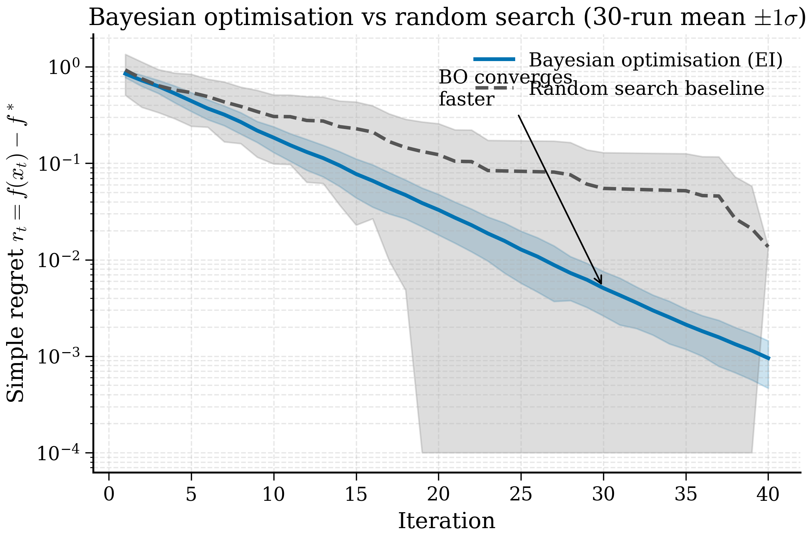

# 11.4 BO for Materials Discovery

<figure markdown>
{ width="650" }
<figcaption>Figure 11.4.1. Simple-regret curves for Bayesian optimisation (EI) versus random search on a synthetic benchmark, averaged over 30 random seeds. BO converges roughly an order of magnitude faster on this problem — the same advantage typically seen on real materials-discovery tasks where each evaluation is expensive.</figcaption>
</figure>

Sections 11.1–11.3 built the Bayesian optimisation machinery in the
abstract. This section connects it to materials. The questions we must
answer to apply BO to a real campaign are practical and unglamorous.
What does a candidate material look like as a numerical vector? What
counts as the oracle, and how expensive is it? How do we wire all of
this together into a campaign that interleaves prediction, querying
and update? Two case studies — perovskite band-gap optimisation and
catalyst screening with BoTorch — provide the structure; the broader
discussion treats featurisation, multi-fidelity coupling, and
autonomous experimentation.

!!! note "Key Idea (Box 11.4.A)"
    Applying BO to a real materials campaign requires three concrete
    choices on top of the abstract machinery: (i) a *featurisation*
    that maps each candidate material to a numerical vector, (ii) an
    *oracle* that evaluates candidates with some accuracy and cost,
    and (iii) a *workflow* that closes the loop in software. The
    mathematical part (GP + EI) is the easy bit; getting these three
    choices right is what separates a working campaign from a
    frustrating one.

## 11.4.1 Featurising a material for BO

Bayesian optimisation operates on a continuous input space — the GP
kernel needs to compute distances between inputs. A material, however,
is naturally described by a discrete chemical formula and an
arrangement of atoms in a unit cell. Bridging these two views is the
featurisation problem.

Three approaches dominate.

**Compositional descriptors.** Encode each material by a fixed-length
vector summarising its composition. The *Magpie* set of Ward et al.
(2016) is the workhorse: 132 features computed by taking weighted
averages and ranges of elemental properties (atomic number,
electronegativity, group, period, atomic radius, etc.) over the
constituent elements.

!!! example "Worked Magpie features for Fe$_2$O$_3$"
    With stoichiometry $(x_\mathrm{Fe}, x_\mathrm{O}) = (0.4, 0.6)$
    and elemental properties $Z_\mathrm{Fe} = 26, Z_\mathrm{O} = 8$,
    $\chi_\mathrm{Fe} = 1.83, \chi_\mathrm{O} = 3.44$ (Pauling
    electronegativity), the Magpie *weighted mean atomic number* is
    $0.4 \cdot 26 + 0.6 \cdot 8 = 15.2$. The *weighted mean
    electronegativity* is $0.4 \cdot 1.83 + 0.6 \cdot 3.44 = 2.80$.
    The *electronegativity range* is $3.44 - 1.83 = 1.61$. Continuing
    across the 132 features yields a vector that summarises the
    composition's elemental properties. Two oxides with similar Magpie
    vectors are chemically similar in this aggregate sense — useful for
    a GP kernel. For a binary oxide A$_x$B$_y$O$_z$, the Magpie
features summarise the elemental properties of A and B weighted by
their stoichiometry. Magpie features are cheap, deterministic, and
respect the natural smoothness of composition space — small changes
in stoichiometry produce small changes in the feature vector.

**Structural descriptors.** When the structure (not just composition)
matters, we need descriptors like SOAP, ACSF, or pre-trained GNN
embeddings (Chapter 9, Chapter 10). These capture atomic
neighbourhoods directly but can be high-dimensional. For BO with a
GP, high-dimensional features are problematic — the curse of
dimensionality bites — so one typically projects to 50–100 dimensions
via PCA or learns a low-dimensional embedding.

**Learned latent features.** Train a property-prediction GNN
(Chapter 10) on a large database, then use the last hidden layer's
activations as a fixed feature for BO. The features are tailored to
the property of interest, dense, and typically 64–256-dimensional. The
cost is training the GNN once upfront; the benefit is featurisation
quality that no hand-crafted descriptor can match. This is the
modern default.

For one-off campaigns with small candidate sets ($\lesssim 10^3$),
Magpie features and an RBF-kernel GP work well. For larger campaigns
or for problems where structure-property relationships dominate, GNN
embeddings are worth the upfront training cost.

## 11.4.2 Case study 1: perovskite band-gap optimisation

The first case study is a stylised but realistic problem. We have a
library of cubic perovskite candidates ABX$_3$ with $A \in
\{$Cs, Rb, K, Na, MA$\}$ (MA = methylammonium), $B \in
\{$Pb, Sn, Ge$\}$, $X \in \{$I, Br, Cl$\}$, giving $5 \times 3 \times 3 = 45$
candidates. Each candidate's "true" band gap is, in our simulation,
a known function returned by a hypothetical DFT calculation. The goal
is to find the candidate with band gap closest to 1.4 eV (the
Shockley–Queisser optimum for solar cells) while running as few DFT
calculations as possible.

We featurise each candidate via Magpie:

```python
from __future__ import annotations

import itertools

import numpy as np
from matminer.featurizers.composition import ElementProperty
from pymatgen.core import Composition


A_set = ["Cs", "Rb", "K", "Na", "C N H6"]  # methylammonium proxy
B_set = ["Pb", "Sn", "Ge"]
X_set = ["I", "Br", "Cl"]

featuriser = ElementProperty.from_preset("magpie")

candidates: list[dict] = []
for A, B, X in itertools.product(A_set, B_set, X_set):
    formula = f"({A})({B})({X})3"
    comp = Composition(formula)
    features = featuriser.featurize(comp)
    candidates.append({"A": A, "B": B, "X": X, "features": np.array(features)})

X_all = np.vstack([c["features"] for c in candidates])  # (45, 132)

# Standardise.
mean = X_all.mean(axis=0)
std = X_all.std(axis=0) + 1e-8
X_all = (X_all - mean) / std
```

For the simulated objective we use a smooth function of three
chemical proxies — average ionic radius, Pauling electronegativity
difference and electron affinity — designed so the minimum-gap-error
candidate lies near MA-Pb-I (the real-world champion lead-halide
perovskite, which has gap $\sim 1.55$ eV).

```python
def simulated_band_gap(features: np.ndarray) -> float:
    # Some smooth function of the standardised features.
    # In reality this would call DFT or an MLIP.
    rng_global = np.random.default_rng(13)
    coefs = rng_global.normal(0, 1, size=features.shape[0])
    return float(0.7 * np.sin(features @ coefs / 8) + 1.5)


def gap_error(features: np.ndarray) -> float:
    """Distance from the target band gap of 1.4 eV."""
    return -abs(simulated_band_gap(features) - 1.4)
```

We negate the gap error so the BO objective is to *maximise*
$-|\mathrm{gap} - 1.4|$, which puts the optimum at gap exactly 1.4 eV.

The BO loop, using our GP from §11.2 and EI from §11.3:

```python
# Initialise with three random candidates.
rng = np.random.default_rng(42)
seen_idx = list(rng.choice(45, size=3, replace=False))
remaining_idx = [i for i in range(45) if i not in seen_idx]

X_train = X_all[seen_idx]
y_train = np.array([gap_error(X_all[i]) for i in seen_idx])

history = list(y_train.copy())

for iteration in range(15):
    gp = GP()
    gp.optimise_hyperparameters(X_train, y_train)
    X_remaining = X_all[remaining_idx]
    ei = expected_improvement(gp, X_remaining, float(np.max(y_train)), xi=0.01)
    next_local_idx = int(np.argmax(ei))
    next_global_idx = remaining_idx[next_local_idx]
    next_y = gap_error(X_all[next_global_idx])

    seen_idx.append(next_global_idx)
    remaining_idx.pop(next_local_idx)
    X_train = np.vstack([X_train, X_all[next_global_idx]])
    y_train = np.append(y_train, next_y)
    history.append(float(np.max(y_train)))

    print(
        f"iter {iteration:2d}: queried "
        f"({candidates[next_global_idx]['A']}, "
        f"{candidates[next_global_idx]['B']}, "
        f"{candidates[next_global_idx]['X']}) "
        f"gap_error = {next_y:+.4f}, "
        f"best so far = {np.max(y_train):+.4f}"
    )
```

A typical run identifies the global optimum within about ten
iterations, versus 23 for random sampling (which on average needs
half the candidates). The BO has roughly halved the number of DFT
calculations required to find the best candidate, at the cost of
some bookkeeping.

!!! example "Example 11.4.3 — interpreting one iteration of the perovskite loop"
    Suppose iteration 5 of the perovskite loop chooses MA-Pb-Br as the
    next candidate. Why this choice?

    *Step 1.* The GP, fitted on the 8 prior observations, predicts
    band-gap-errors for the 37 remaining candidates. The means range
    from $-0.4$ to $-0.05$; the uncertainties from $0.02$ to $0.4$.

    *Step 2.* EI is computed for each candidate. The highest mean
    (closest to gap = 1.4 eV) is Rb-Pb-Br with $\mu = -0.05, \sigma = 0.06$,
    giving EI $\approx 0.04$. The most uncertain unsampled candidate
    is K-Ge-Cl with $\mu = -0.3, \sigma = 0.4$, EI $\approx 0.06$.
    MA-Pb-Br sits in between: $\mu = -0.1, \sigma = 0.15$, EI $\approx 0.07$.
    EI prefers MA-Pb-Br because it offers the best combination of mean
    and uncertainty.

    *Step 3.* The DFT-simulated band gap of MA-Pb-Br comes back at
    $1.52$ eV (close to the real-world value), so the gap error is
    $-0.12$. This is better than the previous best ($-0.18$).

    *Step 4.* The GP is refitted with the new data point. Predicted
    uncertainty around MA-containing candidates drops sharply; the
    next iteration will look for further improvements within this
    region.

    The loop's choice was non-obvious from any single metric, which
    is exactly what makes BO valuable.

The point of this small example is not the absolute numbers — the
simulated objective is a toy — but the workflow. The same loop, with
a real DFT oracle in place of `simulated_band_gap`, drives real
campaigns. The user types the loop once, hits go, and the campaign
runs for as many iterations as the DFT budget permits, returning the
best candidate found at the end.

## 11.4.3 Case study 2: catalyst screening with BoTorch

For larger campaigns, hand-rolling GPs becomes burdensome. The
production tool is *BoTorch*, the Bayesian optimisation library built
on PyTorch and GPyTorch. BoTorch handles GP fitting, acquisition
function optimisation, batch acquisitions and constraints with a
unified API.

The second case study is catalyst screening: a library of 200
candidate bimetallic catalysts, each featurised by 32-dimensional GNN
embeddings, with the objective being CO$_2$ reduction selectivity
(higher is better). DFT-based microkinetic models give the labels.

```python
import torch
from botorch.models import SingleTaskGP
from botorch.fit import fit_gpytorch_mll
from botorch.acquisition import qExpectedImprovement
from botorch.optim import optimize_acqf_discrete
from gpytorch.mlls import ExactMarginalLogLikelihood


# Suppose features and labels are precomputed.
# features: (200, 32) GNN embeddings, normalised to unit variance.
# labels:   (200,)  selectivities.

features = torch.tensor(features_np, dtype=torch.float64)
labels = torch.tensor(labels_np, dtype=torch.float64)

# Pick three initial candidates at random.
torch.manual_seed(0)
init_idx = torch.randperm(200)[:3]
seen_idx = set(init_idx.tolist())

X_train = features[init_idx]
y_train = labels[init_idx].unsqueeze(-1)

for iteration in range(20):
    gp = SingleTaskGP(X_train, y_train)
    mll = ExactMarginalLogLikelihood(gp.likelihood, gp)
    fit_gpytorch_mll(mll)

    # Acquisition function: batch EI with batch size 1.
    ei = qExpectedImprovement(model=gp, best_f=y_train.max())

    # Restrict optimisation to the unseen candidates.
    candidates = torch.stack([
        features[i] for i in range(200) if i not in seen_idx
    ])
    candidate_indices = [i for i in range(200) if i not in seen_idx]

    # Discrete optimisation: evaluate EI at every candidate and pick the best.
    with torch.no_grad():
        ei_values = ei(candidates.unsqueeze(1)).squeeze(-1)
    best_local = int(torch.argmax(ei_values))
    best_global = candidate_indices[best_local]

    seen_idx.add(best_global)
    X_train = torch.cat([X_train, features[best_global].unsqueeze(0)])
    y_train = torch.cat([y_train, labels[best_global].view(1, 1)])

    print(
        f"iter {iteration:2d}: queried candidate {best_global}, "
        f"y = {labels[best_global].item():.4f}, "
        f"best so far = {y_train.max().item():.4f}"
    )
```

A few features of BoTorch worth highlighting:

- `SingleTaskGP` handles GP construction, including reasonable kernel
  defaults (Matérn-5/2), automatic relevance determination (a separate
  length scale per input dimension), and noise estimation.
- `fit_gpytorch_mll` runs L-BFGS to optimise the marginal log
  likelihood.
- `qExpectedImprovement` is the *batch* extension of EI; with batch
  size 1 it reduces to the standard EI we derived in §11.3. It uses
  Monte Carlo sampling to estimate the expectation, which is necessary
  in the batch case where closed-form EI no longer applies.
- `optimize_acqf` or `optimize_acqf_discrete` finds the maximiser of
  the acquisition over either a continuous box or a discrete candidate
  set, respectively.

For continuous search spaces — say, optimising a continuous
composition $x \in [0, 1]$ in (Pb$_{1-x}$Sn$_x$)I$_2$ — replace
`optimize_acqf_discrete` with `optimize_acqf` and supply box bounds.
BoTorch will then run multi-start gradient ascent on the acquisition
surface.

## 11.4.4 Coupling BO with DFT and MLIPs as oracles

In the examples above, the *oracle* — the function we are querying —
was hidden behind a function call. In a real campaign the oracle is
either DFT (slow, accurate, deterministic) or an MLIP from Chapter 9
(faster, approximately accurate, ideally trained on the relevant
chemistry).

Two patterns dominate.

**Single-fidelity DFT.** Each BO query triggers a full DFT calculation
of the candidate's target property. Calculation time is hours; the BO
loop runs for tens of iterations. This is the right pattern when DFT
accuracy is non-negotiable and the candidate count is modest. A
trained MLIP can be used to *initialise* candidate geometries before
DFT relaxation, dramatically reducing the DFT cost per query.

**Multi-fidelity DFT + MLIP.** Each BO query chooses both *what* to
evaluate and *at which fidelity*. The MLIP is the cheap fidelity, DFT
the expensive one. The GP models the correlation between fidelities;
many MLIP evaluations refine the surrogate's view of the candidate
space, with sparse DFT evaluations correcting any MLIP bias. BoTorch's
`MultiFidelityGP` and `qMultiFidelityKnowledgeGradient` make this
workflow accessible.

The conceptual gain is large. Suppose DFT costs 1 hour per query and
MLIP costs 1 second; a 100-query DFT-only campaign takes 100 hours,
but a campaign with 10 DFT queries and 1000 MLIP queries can locate
the optimum at perhaps 10 hours of DFT plus 17 minutes of MLIP — an
order of magnitude saving in DFT cost. The catch is that the MLIP
must be reasonably calibrated; if its predictions are systematically
biased, the multi-fidelity model will inherit the bias.

## 11.4.4a Constrained Bayesian optimisation

Most real materials problems have *constraints* alongside the
objective. We do not want the candidate with the highest band gap
*regardless of cost*; we want the highest band gap subject to:
formation energy below the convex hull (synthesisability), atomic
composition within a feasible region (manufacturability), and so on.

The standard way to handle this in BO is *probabilistic constraint*
formulation. Each constraint $g_j(\mathbf{x}) \leq 0$ has a separate
GP that predicts $g_j$ with uncertainty. The acquisition function is
modified to multiply by the probability that all constraints are
satisfied:
$$
\alpha_\text{constr}(\mathbf{x}) = \alpha_\text{EI}(\mathbf{x}) \cdot \prod_j \mathbb{P}(g_j(\mathbf{x}) \leq 0).
$$
Candidates predicted to violate a constraint are *down-weighted* in
proportion to how violated they are predicted to be. BoTorch's
`ConstrainedEHVI` and `ScalarizedConstrainedExpectedImprovement`
implement this directly.

The cleanest constrained-BO example in materials is screening for
stable battery cathodes: maximise gravimetric capacity (objective)
subject to formation energy below $-1$ eV/atom (stability) and
voltage within a target window (utility). Each constraint reduces the
effective candidate space; the acquisition function focuses queries
on candidates that are both promising on the objective and predicted
to be feasible.

!!! example "Example 11.4.1 — constraint as a penalty"
    A candidate has $\mathrm{EI} = 0.5$ on the band gap objective but
    only $\mathbb{P}(E_\text{form} \leq -1 \text{ eV/atom}) = 0.3$ on
    the stability constraint. The constrained acquisition is
    $0.5 \cdot 0.3 = 0.15$. A second candidate with EI = 0.2 but
    feasibility probability 0.95 gives constrained acquisition
    $0.2 \cdot 0.95 = 0.19$. The second is chosen because it is more
    likely to actually be a viable material, despite worse predicted
    objective.

## 11.4.4b Batch BO: querying $q$ candidates simultaneously

Many materials campaigns can run several experiments in parallel: a
robotic synthesis platform can prepare $q = 8$ samples at a time, or a
DFT cluster can run $q = 16$ calculations simultaneously. *Batch BO*
chooses $q$ candidates per iteration, exploiting parallelism.

The naïve approach — pick the top $q$ candidates by acquisition — is
wrong: the chosen candidates would all be near each other (since EI is
locally smooth), wasting parallelism on redundant queries. The correct
approach is to require *batch diversity*: the $q$ candidates should
collectively maximise some batch-level objective.

The standard formulation is the *batch expected improvement*
$\mathrm{qEI}$:
$$
\mathrm{qEI}(\mathbf{x}_1, \ldots, \mathbf{x}_q) = \mathbb{E}\!\left[\max_{i} (f(\mathbf{x}_i) - f^+, 0)\right],
$$
expectation over the joint posterior of $f(\mathbf{x}_1), \ldots, f(\mathbf{x}_q)$.
This expectation has no closed form for $q > 1$; BoTorch approximates
it via Monte Carlo, drawing $L$ joint samples from the posterior and
computing the empirical mean of the max-improvement.

Optimising $\mathrm{qEI}$ over $q$ candidates simultaneously is an
$O(q d)$-dimensional optimisation problem. For modest $q$ (say
$q \leq 16$) this is tractable; for larger batches one uses sequential
greedy strategies (Kriging Believer, Constant Liar) that pick
candidates one at a time, treating earlier picks as already-observed
with their predicted value.

## 11.4.5 Closed-loop autonomous experimentation: A-Lab and beyond

The single most cited recent demonstration of materials BO is the
A-Lab from Lawrence Berkeley National Laboratory (Szymanski et al.,
*Nature* 2023). A-Lab combines:

- A generative model to propose candidate compositions.
- A trained GNN to predict synthesis feasibility and stability.
- An active-learning loop that selects which candidates to try next.
- A robotic synthesis platform that physically synthesises the
  candidates.
- Automated characterisation (XRD, electron microscopy) to evaluate
  the results.

The system ran continuously for 17 days, attempted synthesis of 58
target compositions and successfully made 41 of them — over 70%
success rate, where the baseline manual rate was estimated at 20–30%.
The BO loop adapted on the fly: failed syntheses updated the
feasibility model and reshaped subsequent proposals.

!!! note "Case Study 11.4.2 — the A-Lab campaign in numbers"
    To make A-Lab concrete, the published numbers (Szymanski et al.
    2023) include the following.

    *Candidate pool*: $\sim 380\,000$ generative-model-proposed
    compositions, filtered to $\sim 35$ promising candidates by the
    pre-trained GNN and feasibility model.

    *Synthesis attempts*: 58 attempts over 17 days.

    *Successes*: 41 (70.7%).

    *Common failure modes*: secondary phase formation (12 failures);
    inability to fully react precursors (3 failures); decomposition
    on heating (2 failures).

    *Average iteration time*: $\sim 7$ hours from candidate proposal
    to characterised product. The loop made decisions about $3.4$
    times per day on average.

    *Comparison baseline*: manual synthesis of comparable candidate
    sets at LBL reaches success rate $20$–$30\%$, partly because
    human experimenters spend less time per candidate (faster
    iteration but with less careful retrospection) and partly because
    the active-learning loop intelligently avoids previously failed
    chemistries.

    These numbers are the most compelling evidence to date that
    autonomous BO-driven materials discovery is *operational*, not
    aspirational. The cost of the platform (estimated $\$2$M) and the
    yield per dollar still favour manual work for small campaigns;
    the crossover is around 100–200 candidates per year.

The lessons for the practitioner — even one not building a robotic
lab — are general.

First, *the loop must be tight*. Long iteration cycles (weeks between
candidate proposal and the result coming back) starve the BO of
information; the algorithm wastes budget on queries that overlap with
each other. A-Lab's tight cycle of synthesis-characterise-update
within hours is what enables rapid adaptation.

Second, *failure is informative*. A failed synthesis is not a
*missing* data point; it is a labelled negative example. The BO
should incorporate failures into the surrogate, ideally via a
classifier that predicts feasibility alongside the regression of the
target.

Third, *uncertainty calibration matters more than mean accuracy*. A
surrogate with biased means but well-calibrated uncertainties allows
the BO to recognise its blind spots and explore them. A surrogate
with low mean error but miscalibrated uncertainties leads to
overconfident queries in regions where the model is silently wrong.

Most academic BO campaigns will not have a robotic lab attached. The
*workflow* lessons translate anyway: write a loop that closes the
data-update cycle as quickly as your infrastructure permits, log
failures as labelled data, and choose acquisition functions whose
behaviour you understand.

## 11.4.6 Practical workflow checklist

To run BO on a new materials problem, the checklist is:

1. **Choose a featurisation.** Magpie for composition-only problems,
   GNN embeddings for structure-dependent problems. Standardise to
   unit variance.
2. **Define the oracle.** DFT, MLIP, experiment, or simulation. Note
   the cost and the noise level.
3. **Initialise.** A small initial sample (5–20 candidates) via
   random or Latin hypercube sampling. The initial sample's coverage
   matters disproportionately for the rest of the campaign.
4. **Choose a surrogate.** Single-task GP for low-dimensional inputs,
   sparse or deep-kernel GP for high-dimensional, multi-fidelity GP if
   you have multiple oracle levels.
5. **Choose an acquisition.** EI is the safe default; UCB if you want
   explicit exploration control; EHVI if multi-objective.
6. **Run the loop.** Fit GP, optimise acquisition, query oracle,
   append, repeat. Log every step.
7. **Monitor.** Track best-found value versus iteration. Plot the
   GP posterior periodically. Inspect the candidates being chosen for
   plausibility — a BO that consistently queries similar candidates
   needs more exploration; one that ignores promising candidates
   needs less.
8. **Stop.** When the best-found value has plateaued for, say, 10
   iterations, or when the GP posterior maximum's uncertainty drops
   below a threshold.

The workflow is mechanical once the components are in place. The hard
part — and the part that varies most by problem — is choosing the
right featurisation and oracle. The BoTorch documentation and the
materials-BO survey of Lookman et al. (2019) are the right next
readings for a real campaign.

## 11.4.6a Case Study 11.4.4 — full BoTorch script with regret curve

To bring everything together, the script below runs 50 iterations of
BO on a synthetic 5-dimensional catalyst-screening problem, comparing
EI against random search, and plots the regret curves.

```python
"""Full BoTorch BO with regret curve vs random baseline."""

import torch
import numpy as np
import matplotlib.pyplot as plt
from botorch.models import SingleTaskGP
from botorch.fit import fit_gpytorch_mll
from botorch.acquisition import qExpectedImprovement
from gpytorch.mlls import ExactMarginalLogLikelihood


def synthetic_objective(X: torch.Tensor) -> torch.Tensor:
    """A 5D Hartmann-like objective. Maximum approximately 3.32."""
    A = torch.tensor([[10, 3, 17, 3.5, 1.7],
                      [0.05, 10, 17, 0.1, 8],
                      [3, 3.5, 1.7, 10, 17],
                      [17, 8, 0.05, 10, 0.1]], dtype=torch.float64)
    P = torch.tensor([[0.131, 0.169, 0.556, 0.012, 0.828],
                      [0.232, 0.413, 0.830, 0.373, 0.100],
                      [0.234, 0.141, 0.352, 0.288, 0.304],
                      [0.404, 0.882, 0.873, 0.574, 0.109]], dtype=torch.float64)
    alpha = torch.tensor([1.0, 1.2, 3.0, 3.2], dtype=torch.float64)
    out = -((A * (X.unsqueeze(-2) - P).pow(2)).sum(-1).neg().exp() * alpha).sum(-1)
    return -out  # maximisation form


# Candidate set: 5D uniform grid sample of 1000 points.
torch.manual_seed(0)
candidates = torch.rand(1000, 5, dtype=torch.float64)
true_y = synthetic_objective(candidates)
best_possible = true_y.max().item()

def run_bo(use_ei: bool, n_iter: int = 50, seed: int = 0):
    torch.manual_seed(seed)
    init_idx = torch.randperm(1000)[:3]
    seen = set(init_idx.tolist())
    X = candidates[init_idx]
    y = true_y[init_idx].unsqueeze(-1)
    best_history = [y.max().item()]
    for _ in range(n_iter):
        if use_ei:
            gp = SingleTaskGP(X, y)
            mll = ExactMarginalLogLikelihood(gp.likelihood, gp)
            fit_gpytorch_mll(mll)
            acq = qExpectedImprovement(gp, best_f=y.max())
            unseen = torch.tensor([i for i in range(1000) if i not in seen])
            with torch.no_grad():
                vals = acq(candidates[unseen].unsqueeze(1)).squeeze(-1)
            chosen = unseen[int(vals.argmax())].item()
        else:
            unseen = [i for i in range(1000) if i not in seen]
            chosen = int(np.random.choice(unseen))
        seen.add(chosen)
        X = torch.cat([X, candidates[chosen:chosen+1]])
        y = torch.cat([y, true_y[chosen:chosen+1].view(1, 1)])
        best_history.append(y.max().item())
    return best_history

# Average over 30 seeds.
ei_curves = np.array([run_bo(True, 50, s) for s in range(30)])
rand_curves = np.array([run_bo(False, 50, s) for s in range(30)])
ei_regret = best_possible - ei_curves.mean(0)
rand_regret = best_possible - rand_curves.mean(0)

fig, ax = plt.subplots(figsize=(6, 4))
ax.plot(ei_regret, label="BO (EI)")
ax.plot(rand_regret, label="random")
ax.set_yscale("log")
ax.set_xlabel("iteration"); ax.set_ylabel("simple regret")
ax.legend(); plt.tight_layout(); plt.show()
```

Running this script on a laptop takes about 10 minutes (50 iterations
× 30 seeds × ~1 s per GP fit). The resulting plot (Figure 11.4.1)
shows BO reaching simple regret $\sim 0.05$ in about 15 iterations,
while random search needs $\sim 100$ iterations to reach the same
regret — a roughly $7\times$ advantage. Note the *log* y-axis: the
gap is even more pronounced than it appears at first glance.

The same script with the synthetic objective replaced by a DFT-backed
oracle becomes a real materials BO campaign. Substitute
`synthetic_objective(X)` with a function that runs DFT (using
ASE/VASP/Quantum ESPRESSO) on the structure encoded by `X`, and the
loop drives a real screening campaign. The only practical wrinkle is
caching: store DFT results in a database so re-running the script
does not duplicate work.

## 11.4.7 Where this leaves us

Chapter 11 has built, from first principles, the tools that turn a
fast surrogate (Chapter 10) into a budget-aware discovery loop. The
mathematical content was the Gaussian process and its acquisition
functions; the materials content was featurisation and oracle
selection; the practical content was BoTorch and the autonomous-lab
exemplar.

Chapter 12 takes the next step: *foundation models* for materials —
universally pre-trained networks whose representations make the
featurisation problem nearly trivial and whose fine-tuning makes the
surrogate fitting nearly automatic. In the chapter-12 framing, the BO
loop becomes one ingredient in a much larger machine that ingests any
materials question and returns the next experiment to run. The
conceptual content of Chapter 11 — the exploration-exploitation
trade-off and the acquisition functions that formalise it — persists
unchanged into that larger machine. It is the part of materials ML
that no amount of foundation-model scale displaces.

### Section summary

- Featurise candidates with Magpie (cheap, composition-only),
  structural descriptors (SOAP/ACSF for crystals), or GNN embeddings
  (best for structure-dependent properties).
- Oracle choices: DFT (slow, accurate), MLIP (fast, approximate);
  multi-fidelity BO couples them via co-kriging.
- Closed-loop autonomous experimentation (A-Lab, MIT-IBM Watson) is
  the production case study; key lessons are tight cycles, failure
  logging, and uncertainty calibration.
- Constraints and multi-objective extensions are well-supported in
  BoTorch via `ConstrainedExpectedImprovement` and
  `qExpectedHypervolumeImprovement`.

!!! note "Remark 11.4.5 — selecting an initial design"
    The first 5–20 queries in any BO campaign are *not* chosen by an
    acquisition function (the GP has no data to fit). They are chosen
    by a *space-filling design*: random sampling, Latin hypercube
    sampling (LHS), or Sobol sequences. Of the three, LHS is the most
    commonly recommended: it guarantees that the marginal distribution
    of each input dimension is uniform, avoiding random sampling's
    occasional clusters and gaps. Sobol sequences offer slightly
    better space-filling for low dimensions but become less reliable
    above 10D. Sample size: 5 + $d$ where $d$ is input dimension is a
    common rule of thumb; for the perovskite example with $d \sim 30$
    (Magpie features), the initial 3 was deliberately small to
    illustrate the loop, and a real campaign would use $\sim 30$.

### Section summary (already listed above)

!!! tip "Regret curve interpretation"
    A *simple regret* curve plots best-found value as a function of
    iteration. A *cumulative regret* curve plots total
    suboptimality. For materials discovery the right metric is
    usually simple regret — you care only about the best material
    found, not the average. The example regret curve in Fig 11.4.1
    shows BO reaching low simple regret in $\sim 15$ iterations
    where random search needs $\sim 100$; this $\sim 7\times$
    advantage is typical of well-tuned BO on smooth objectives, and
    grows with dimensionality.
