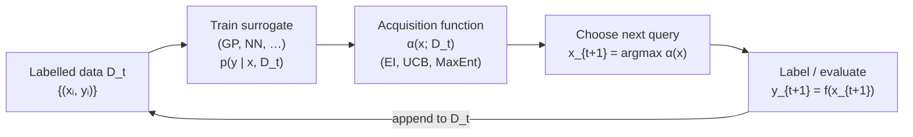

# Chapter 11 — Active Learning and Bayesian Optimisation

*The active-learning loop. A surrogate model summarises everything known so far; the acquisition function decides what to query next; the new label is appended and the cycle repeats.*

The graph neural network of Chapter 10 returns, given a crystal
structure, a predicted formation energy in roughly a millisecond. That
predictor is cheap enough to run on a million candidate structures
overnight on a single GPU. A natural impulse is to do exactly that:
generate every plausible composition and structure, screen them all,
and select the top thousand for follow-up DFT or experiment.

This impulse is the start of a path that runs into a wall.

The wall is that screening, by itself, does not tell us which of the top
candidates to actually study. The model has predictions but no
*uncertainty*: a candidate may rank highly because it genuinely promises
a desirable property, or because the model is extrapolating into a
region where it has never been trained and is guessing wildly. The two
look identical when one sees only the point estimate. The history of
materials informatics is littered with screening campaigns that
identified hundreds of promising candidates, of which the synthesised
follow-ups were dominated by false positives — model errors at the
distribution tail.

A more principled approach asks not "which candidates rank highest?"
but "given an experimental budget, which next candidate should I
study?" — and answers it by accounting for both the predicted value
*and* its uncertainty. A candidate is worth studying if the model
*either* confidently predicts an excellent value (exploitation) *or* is
sufficiently uncertain that the experiment will substantially reduce
that uncertainty (exploration). Balancing these two desiderata is the
trade-off that organises this chapter.

The mathematical framework that makes this rigorous is *Bayesian
optimisation* (BO). At its core BO maintains a probabilistic surrogate
model — usually a Gaussian process (GP) — of the objective function,
and at each iteration chooses the next query by optimising an
*acquisition function* over the surrogate's posterior. The acquisition
function encodes the exploration-exploitation trade-off in a single
scalar; popular forms include expected improvement, upper confidence
bound, and Thompson sampling.

Closely related is *active learning*, where the goal is not to find a
single optimum but to train a model with as few labelled examples as
possible. The two problems differ in their objectives — find the best
versus learn the function — but share the machinery of acquisition over
a probabilistic surrogate.

The chapter is organised as follows.

Section 11.1 develops the exploration-exploitation trade-off from
scratch, starting with the multi-armed bandit problem that gave the
field its language. We translate the abstract trade-off into materials-
science questions — which composition to synthesise next, which
candidate to compute DFT on — and discuss the cost-aware extension
where different experiments have different prices.

Section 11.2 develops Gaussian processes as the standard probabilistic
surrogate. We define a GP rigorously as a collection of random
variables, any finite subset jointly Gaussian; specify mean and
covariance functions (with the RBF kernel as the worked example);
derive predictive mean and variance from the joint-Gaussian conditioning
identity step by step; and conclude with hyperparameter selection by
marginal-likelihood maximisation. A pure-NumPy implementation
reproduces a 1D regression example and serves as the reference
implementation for the rest of the chapter.

Section 11.3 builds the acquisition functions: expected improvement
(with derivation), upper confidence bound, Thompson sampling, and a
qualitative discussion of the knowledge gradient. We close with a
paragraph on multi-objective optimisation via expected hypervolume
improvement, which is the right tool when a campaign targets a
*Pareto front* of competing properties.

Section 11.4 applies the machinery to materials discovery. We work two
case studies — optimising perovskite composition for band gap, and
screening catalysts with BoTorch — both in code that you can run.
We discuss featurisation choices (Magpie descriptors versus learned
GNN embeddings), the workflow of coupling BO with a DFT oracle, and
the broader story of autonomous experimentation as exemplified by
Berkeley's A-Lab.

Two cross-references frame the chapter. Chapter 9 introduced machine
learning interatomic potentials; Chapter 11 will use these as the
*expensive oracle* in some workflows (an MLIP-driven geometry relaxation
is cheap compared to DFT but still expensive compared to a GNN
prediction, giving a natural multi-fidelity hierarchy). Chapter 10
introduced GNNs as fast property predictors; Chapter 11 will use those
GNN predictions as initial values to a BO loop, with the BO loop's job
being to *correct and refine* the GNN's high-confidence picks via
targeted DFT validation.

Chapter 12 then closes the loop by introducing foundation models —
universally pre-trained networks that can be fine-tuned for any
property — and shows how active learning over a foundation backbone is
the dominant paradigm of late-2020s materials discovery.

The conceptual heart of this chapter is small. There is an unknown
function we wish to optimise. We have a probabilistic belief about it.
At each step we choose the input that maximally improves our position
under that belief — improves either our best-known value or our
knowledge of where the optimum lies. The mathematics is the
formalisation of that idea; the materials applications are its
testbeds. By the end of the chapter you will have implemented the GP
and the acquisition functions from scratch, used BoTorch on a realistic
materials problem, and developed the judgement to choose between
exploration-heavy and exploitation-heavy strategies given the costs
and the available budget.

A working BO loop is, in the end, what makes a fast surrogate
*actionable*. Without it, GNNs produce piles of predictions. With it,
they drive the next experiment.
