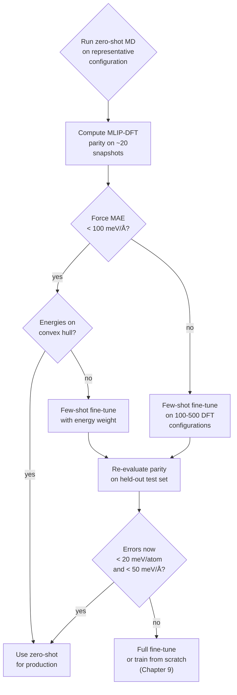

# 12.1 The Foundation-Model Paradigm

## Where the term comes from

The phrase *foundation model* was introduced in a 2021 report from the
Stanford Center for Research on Foundation Models, but the practice it
describes is older. It denotes a model that is

1. **trained once, on broad data, at large scale**, and
2. **adapted — by fine-tuning, prompting or feature extraction — to a
   wide range of downstream tasks**.

The exemplars are familiar. GPT-3 (2020) is pre-trained on a corpus of
roughly $300$ billion tokens and is subsequently used, without
gradient updates, to translate, summarise, write code and answer
questions. CLIP (2021) is pre-trained on $400$ million image–text
pairs and provides a joint embedding space in which downstream
classifiers can be built with handfuls of labelled examples.
BERT (2018) is fine-tuned for sentiment analysis, named entity
recognition and question answering using training sets two or three
orders of magnitude smaller than would be needed to train an
equivalent model from scratch.

What unifies these examples — and distinguishes them from earlier
transfer-learning work — is the *generality of the pre-training task*.
Language modelling (predict the next token) and contrastive
image–text alignment (match captions to images) impose no particular
downstream commitment. They simply require the model to build a rich
internal representation of its input domain. The downstream tasks then
become exercises in *re-routing* that representation, not in building
it from scratch.

The economic argument is decisive. A modern foundation model can cost
tens of millions of dollars to pre-train. A fine-tuning run, on a
specialised dataset of perhaps $10^4$ examples, costs perhaps a hundred
dollars of GPU time. If one organisation absorbs the pre-training cost
and releases the weights, everyone else inherits the representation
for free. This is the architecture of, for instance, Hugging Face's
model hub: a small number of expensive backbones, each surrounded by
hundreds of cheap, task-specific heads.

## Why the paradigm transfers to materials

There was no a priori guarantee that the foundation-model approach would
work in the physical sciences. Language is an artefact of human culture;
its statistical regularities exist because humans built them. There is
no comparable reason to expect the structures of inorganic crystals to
admit a universal compressed representation.

Three structural features of materials science nevertheless make the
transfer plausible.

**A finite alphabet.** The chemistry of matter is built from $118$
elements, of which perhaps the first $96$ appear in any practical
context. This is a vocabulary roughly four orders of magnitude smaller
than the vocabulary of a tokenised natural language. A model that
learns one representation per element — with a few thousand learnable
parameters per embedding — can in principle cover the entire periodic
table without combinatorial explosion. Compare this to the cost of
training one MLIP per chemistry, which is the regime Chapter 9
described.

**Shared local physics.** Two carbon atoms in two different solids see
broadly the same potential within their immediate neighbourhood. The
covalent bond, the metallic environment, the ionic interaction — these
local motifs are remarkably stable across the periodic table. The
nearest-neighbour shell of a Mg cation in MgO is not so different from
its environment in MgSiO$_3$. A foundation MLIP, equipped with a
many-body local descriptor that respects $SE(3)$ equivariance (see
Chapter 9), is therefore representing a *physical* invariance: the
energy of an atom is determined, to a good approximation, by its local
environment, *regardless of what crystal that environment happens to
sit inside*.

**Self-supervised labels for free.** The standard pre-training signal
for an MLIP is the DFT energy and forces of a relaxation snapshot. No
human annotation is required: the supervisory signal is the underlying
physics. This is the same advantage that language models enjoy (the
next token is the label) and that image models lack (someone had to
label ImageNet). Public DFT databases now contain millions of such
snapshots, generated for entirely different purposes (high-throughput
screening, materials genome studies) and freely available for
foundation-model training.

A useful way to think about all three points is that the *symmetries
and locality* of physics give us, almost for free, the kind of
inductive bias that the deep-learning community spent the 2010s
laboriously designing into convolutional architectures.

## From task-specific to universal MLIPs

The historical trajectory is instructive. Through the 2010s, the
training of a machine-learning interatomic potential was a craft
exercise. One would identify a system of interest — say, amorphous
silicon, or a Cu surface with adsorbed CO — generate a few hundred to
a few thousand configurations by ab initio molecular dynamics, label
them with energies and forces, fit a Gaussian Approximation Potential
(GAP) or a Behler–Parrinello neural-network potential to that dataset,
and validate on a held-out set drawn from the same ensemble. The
result was a potential of remarkable accuracy for the system it was
fitted to, and of unknown — usually poor — quality outside that
window.

A typical such potential would contain perhaps $10^5$ parameters and
train in hours on a single GPU. It would be useless on any chemistry
absent from its training distribution: a Si–H potential could not say
anything sensible about Si–C, no matter how subtle the chemical
relationship.

The shift to universal MLIPs is a shift in ambition. M3GNet (2022)
trained a single network on the Materials Project relaxation
trajectories — about $190{,}000$ relaxations across most of the
periodic table — and reported reasonable accuracy *across all of it*.
CHGNet (2023) extended this to include charge information, again
trained on Materials Project data. MACE-MP-0 (2023) used the same
data with a more expressive equivariant architecture and demonstrated
that the accuracy on individual systems was, in many cases, competitive
with bespoke potentials.

In each case the pre-training corpus is in the millions of
configurations and the model size is in the millions of parameters.
The training cost runs to weeks of multi-GPU compute. The output is a
single set of weights that anyone can download and run.

## Three regimes of use

Once a universal model is in hand, three usage regimes are worth
distinguishing.

**Zero-shot.** Apply the pre-trained model to a new system with no
further training. This is the cheapest mode and surprisingly often
sufficient. Reasonable starting points: equilibrium structures, MD at
moderate temperatures, screening calculations where one cares about
relative energies between candidates of similar chemistry. The MACE-MP-0
authors report median force errors of $\sim 100$ meV/Å on out-of-
distribution test sets, which is competitive with semi-empirical
methods and, for many purposes, with hybrid functionals.

**Few-shot fine-tuning.** Take the pre-trained weights, freeze (or
heavily regularise) the early layers, and train the final readout on
a small ($10^2$ to $10^3$ structures) domain-specific dataset. The
intuition is that the local feature extractor already encodes
generally useful chemistry; only the system-specific mapping from
features to energy needs adjustment. This is by far the most useful
regime for working practitioners. A few hundred DFT calculations,
typically already in your possession as part of a publication's
supporting information, are enough to reduce force errors by a factor
of three to ten.

**Full fine-tuning or training from scratch.** Reserved for systems
that lie outside the training distribution of the foundation model —
typically those with chemistry the model has never seen (open-shell
organic molecules, lanthanide-heavy compounds, exotic high-pressure
phases) — or for which strict accuracy guarantees are needed (e.g.,
reaction-barrier studies where every meV matters). Here one falls
back on the methods of Chapter 9, with the difference that one might
initialise from a pre-trained checkpoint to accelerate convergence.

The decision between these regimes is largely empirical, but a useful
heuristic is to start with zero-shot, run a small validation set
through DFT, and step up the level of fine-tuning if the errors are
unacceptable.

## How much data is enough?

Cost–accuracy curves for foundation MLIPs follow a recognisable shape.
With $N$ fine-tuning structures, the validation force error typically
scales as
$$
\text{MAE}(F) \approx A \cdot N^{-\alpha} + B,
$$
where $A$ is a system-dependent prefactor, the exponent $\alpha$ is
empirically in the range $0.3$–$0.5$, and $B$ is an irreducible floor
set by the foundation model's representation capacity and the
distributional gap between pre-training and target. In rough numbers:

| Fine-tuning size | Typical use-case |
|------------------|------------------|
| $0$ (zero-shot) | Screening, exploratory MD, rough relaxations |
| $\sim 50$ | Equilibrium geometry of a specific compound |
| $\sim 500$ | Reaction barriers, defect formation energies |
| $\sim 5{,}000$ | Phase diagrams, finite-temperature thermodynamics |
| $\gtrsim 50{,}000$ | Approaching DFT-quality on the target system |

These numbers should be treated as orientation, not law. A reactive
system with strong charge transfer may need an order of magnitude more
data than an inert oxide. The right way to read the table is as the
*starting allocation* of computational resources when planning a study.

!!! note "On the role of forces"
    The most important single design decision in fine-tuning is whether
    to include forces in the loss. Including them roughly triples the
    effective dataset size: a structure with $N$ atoms contributes one
    energy label and $3N$ force labels. For systems with $N \gtrsim 50$
    this is a large multiplier and should almost always be exploited.

## The data sources

Pre-training a foundation MLIP requires a corpus of DFT-labelled
configurations spanning the periodic table. As of 2026 the relevant
public datasets are:

- **Materials Project relaxation trajectories** (MPtrj). About
  $1.6 \times 10^6$ configurations from $\sim 1.5 \times 10^5$
  relaxations, mostly PBE+U with a few hybrid corrections. The basis
  of MACE-MP-0, CHGNet and M3GNet. Covers $89$ elements with strongly
  imbalanced sampling (oxides over-represented, organics
  under-represented).

- **OMat24** (Meta, 2024). Approximately $1.2 \times 10^8$
  configurations from a deliberately designed exploration of out-of-
  equilibrium structures, including rattled and strained variants of
  Alexandria and MPtrj entries. Built explicitly to address the
  observation that MPtrj over-represents near-equilibrium geometries
  and gives MLIPs trained on it poor extrapolation.

- **Alexandria**. About $5 \times 10^6$ DFT-relaxed structures generated
  by Schmidt and collaborators using prototype-based substitutional
  generation. Useful both as a pre-training corpus and as a target for
  property-prediction GNNs.

- **OC20 / OC22**. Open Catalyst datasets, $\sim 10^8$ configurations
  of adsorbates on metal surfaces. Specialised but very large; the
  natural choice if catalysis is the downstream domain.

- **SPICE, ANI-1x, QMugs**. Molecular datasets, important for
  fine-tuning when the target system includes organic fragments.

Most of these are downloadable through standard Python interfaces. The
practical workflow — query the dataset, filter to your chemistry of
interest, fine-tune the foundation model — is the subject of the next
section.

## In-distribution and out-of-distribution: the central diagnostic

The single most consequential question a practitioner can ask of a
universal MLIP is: *how far from the training distribution is the
system I want to simulate?* Foundation models work well in the regime
they have seen and degrade — often without warning — in the regime
they have not. The decision between zero-shot use, light fine-tuning,
and full retraining is, in essence, a quantitative answer to this
question.

### Why universal MLIPs degrade on novel chemistries

The reason is structural rather than incidental. A universal MLIP
learns a mapping from local atomic environments — typically encoded
in a radial-and-angular descriptor truncated at a $5$–$6$ Å cutoff —
to energy contributions. Its training corpus is finite. Any local
environment whose descriptor lies outside the convex hull of the
training descriptors is, formally, *extrapolated* rather than
interpolated, and the model has no principled way to know which
extrapolation is correct. For smooth descriptors and gentle
extrapolation the error grows slowly; for descriptors that are
discontinuous on chemical-bond rearrangements, it can grow
catastrophically.

The empirical signature is well-documented. The Riebesell et al.
*Matbench-Discovery* benchmark (2023, updated through 2025) holds
out structures from chemical systems entirely absent from the
training corpus. Foundation MLIPs that achieve $\sim 30$ meV/atom
errors on in-distribution test sets typically report two to four
times worse on the held-out chemistries. The degradation correlates
with the number of training configurations involving the rare
elements: under-represented elements give larger errors, in a
relationship that is roughly linear in $\log N_\mathrm{train}$.

### Empirical observation: MACE-MP-0 on lithium battery materials

A documented case study from the Cheng group (2024) is informative.
MACE-MP-0 (medium), trained on MPtrj, was applied zero-shot to
several lithium-rich battery cathodes (Li$_2$MnO$_3$, Li-excess
NMC). Energy errors on near-equilibrium configurations were
$\sim 30$ meV/atom — competitive with bespoke potentials. On
configurations sampled at high temperature in production MD, where
Li-Li distances fell below the typical $2.6$ Å distance seen in
MPtrj training data, errors grew to $\sim 50$–$80$ meV/atom and the
forces became qualitatively wrong on the migrating Li atoms.

The mechanism: MPtrj is built from DFT *relaxations*, which converge
toward stable minima. Off-equilibrium configurations — exactly the
ones an MD trajectory at $1000$ K explores — are systematically
under-represented. Lithium battery cathodes, with their unusually
short Li-Li distances and structural disorder, push the model into a
sparsely-sampled corner of the descriptor space.

The OMat24 dataset (Meta, 2024), constructed by deliberately rattling
and straining Alexandria structures to populate this off-equilibrium
region, was a direct response. MACE-MP-0b and EquiformerV2-OMat,
trained or fine-tuned on OMat24, show substantially reduced
errors on the same lithium-cathode benchmarks — typically halving
the energy MAE.

### A concrete diagnostic

Before committing serious compute to a foundation-model simulation,
the cheapest sanity check is a *descriptor coverage* analysis on a
single configuration of the target system:

1. Build a representative configuration of the target — a unit cell
   or a small supercell.
2. Compute pairwise distance and three-body angle distributions
   within the cutoff radius. Plot them as histograms.
3. Compute the same histograms from a subsample (say $10^4$
   configurations) of MPtrj or whatever the model's training set
   was.
4. Overlay the two. Any bin where the target system has substantial
   density and the training set has near-zero density is an
   extrapolation warning.

The diagnostic is not fool-proof — descriptor coverage in bond
lengths and angles does not guarantee coverage in the higher-body
correlations a deep network actually uses — but it is cheap and
catches the clearest failure modes. Several recent universal MLIPs
ship with built-in *uncertainty estimators* (deep ensembles in Orb;
gradient-based committee variance in MACE) that act as a learned
version of this same diagnostic; they are increasingly the preferred
approach.

### A decision flowchart for zero-shot vs fine-tuning

A pragmatic protocol, condensing the considerations above:

The two thresholds — $100$ meV/Å on forces, $20$ meV/atom on energy
post-tuning — are empirical and somewhat field-dependent. For
catalysis $50$ meV/atom may be unacceptable; for screening it may be
plenty. The discipline is to fix the threshold *before* looking at
the data, in line with the same statistical hygiene one would apply
to any model comparison.

The single most expensive mistake is to skip the zero-shot parity
check and run a long production MD with an unvalidated foundation
model. The cost of generating $20$ DFT single-points to validate is
small; the cost of discovering, three weeks later, that the entire
trajectory was sampled with $200$ meV/Å force errors and is
therefore qualitatively wrong, is enormous.

## A note on what is *not* a foundation model

The phrase has acquired some marketing weight. Three clarifications
are worth making.

First, a graph neural network trained on $10{,}000$ Materials Project
structures to predict band gaps is not a foundation model. It is a
property-prediction model. It can be very useful, but the
foundation-model label requires that the *same weights* serve a wide
range of downstream tasks, which is generally only achieved when the
pre-training task is itself broad (energy and forces across the
periodic table, in the MLIP case).

Second, a model is not a foundation model merely because it is large.
Scale is necessary but not sufficient. The fitness criterion is
generality, demonstrated by transfer to held-out tasks.

Third, the foundation-model label does not imply a particular
architecture. MACE-MP-0 is a message-passing GNN. MatterGen is a
diffusion model. A hypothetical transformer-on-graphs would be
neither. What unites them is the role they play in a workflow, not
the wiring of their layers.

## Where this leaves us

The remainder of the chapter examines two concrete instantiations of
the paradigm. Section 12.2 takes MACE-MP-0 as the canonical universal
MLIP and walks through its installation, zero-shot evaluation,
fine-tuning, and comparison with the contemporary alternatives.
Section 12.3 turns to generative models, where the foundation idea is
applied to the *inverse* problem of producing structures with desired
properties. Section 12.4 surveys what is still missing.

Throughout, the connection to Chapter 9 (MLIPs from scratch) and
Chapter 10 (graph neural networks) should be kept in mind. Foundation
models do not replace these methods; they shift the starting point. A
universal MLIP is a pre-trained MLIP; a generative model on crystals
is a generative model on the graphs of Chapter 10. The intellectual
machinery is the same; only the scale, and the way the weights are
shared across projects, has changed.
