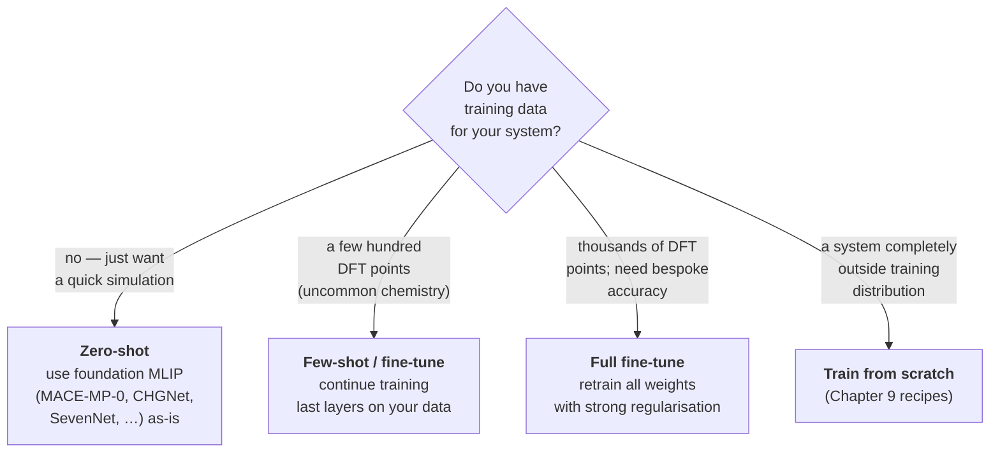

# 12.2 MACE-MP-0 and the Universal MLIP Zoo


*Decision flow for using a foundation MLIP such as MACE-MP-0. The right answer depends on how much labelled data you have and how far your chemistry sits from the training set.*

The cleanest concrete realisation of the foundation-model paradigm in
materials science, as of 2026, is the family of universal machine-
learning interatomic potentials. This section examines MACE-MP-0 in
detail: its architecture, its training data, its zero-shot performance,
and the practical recipes for using and fine-tuning it. We then survey
the wider zoo — CHGNet, M3GNet, SevenNet, Orb — and close with a
candid comparison of what each is good for.

## What MACE-MP-0 is

MACE-MP-0 is a single set of weights, released by Batatia, Kovács,
Kapil and collaborators in late 2023, for the MACE architecture
introduced in Chapter 9. Trained on $1.58 \times 10^6$ configurations
drawn from the Materials Project relaxation trajectory dataset
(MPtrj), it covers $89$ elements. Three model sizes are released:

- `small` — MACE with body order $\nu = 3$ and maximum tensor rank
  $L = 0$. About $0.6$ M parameters.
- `medium` — $\nu = 3$, $L = 1$. About $4.7$ M parameters. The
  default choice and the one used for the bulk of the published
  benchmarks.
- `large` — $\nu = 3$, $L = 2$. About $15$ M parameters. Best accuracy
  at the cost of significantly higher inference time.

The architecture is the *same* MACE that Chapter 9 derived: a two-layer
equivariant message-passing network with a learnable radial basis
expansion, followed by a linear readout that produces per-atom energy
contributions. Forces are obtained, as usual, by differentiation:
$$
\mathbf{F}_i = -\frac{\partial E}{\partial \mathbf{r}_i}.
$$
What is different from the Chapter 9 setting is *scale*. The training
ran for roughly two weeks on $32$ A100 GPUs. The result is a single
checkpoint that, with no further training, will integrate Newton's
equations of motion for almost any inorganic compound you care to
construct.

### The training data, briefly

Recall from Chapter 10 that the Materials Project contains
$\sim 1.5 \times 10^5$ relaxations, each producing a sequence of
intermediate geometries on the path from initial guess to local
minimum. The full set of $\sim 1.6 \times 10^6$ such intermediate
snapshots is MPtrj. Each snapshot carries an energy, atomic forces
and a stress tensor, all computed with VASP at the PBE+U level of
theory.

This dataset has two well-documented biases. First, it is
*equilibrium-heavy*: the further into a relaxation, the more snapshots
look like a local minimum. MD trajectories at high temperature look
different. Second, it is *chemistry-imbalanced*: oxides dominate,
organic fragments are rare, exotic chemistries (actinides, certain
lanthanide configurations) are sparse. The performance characteristics
of MACE-MP-0 reflect both biases. Section 12.4 will discuss the OMat24
follow-on dataset, which was designed in part to address them.

## Zero-shot performance: what to expect

Numbers first. On the Matbench-Discovery benchmark, which holds out
$\sim 250{,}000$ structures from the Materials Project,
MACE-MP-0 (medium) achieves a mean absolute force error of roughly
$70$ meV/Å and an energy error of $\sim 30$ meV/atom. On out-of-
distribution sets (e.g., the WBM dataset of substitutionally generated
structures), the force error roughly doubles. On bespoke datasets
drawn from molecular-dynamics trajectories of specific oxides, the
out-of-the-box performance is often within a factor of two of a
hand-fitted potential trained on $1{,}000$ system-specific
configurations.

The intuition is that MACE-MP-0 is a *competent generalist*. It will
not embarrass itself on most inorganic chemistry. It will be beaten
by a specialist on any specialist's home turf. The interesting
question is *how much it costs* to bring it to specialist accuracy on
a new system, and we will answer that empirically below.

## Hands-on: zero-shot MD on an oxide

The packaging story is mercifully simple. The MACE authors ship a
PyPI package (`mace-torch`) that integrates with ASE through a
calculator object. The pre-trained weights are downloaded on first
use.

```python
# install_mace.sh
# $ pip install mace-torch ase numpy

from __future__ import annotations
from pathlib import Path

import numpy as np
from ase import Atoms
from ase.build import bulk
from ase.md.langevin import Langevin
from ase.md.velocitydistribution import MaxwellBoltzmannDistribution
from ase.units import fs, kB
from mace.calculators import mace_mp


def build_mgo_supercell(size: tuple[int, int, int] = (3, 3, 3)) -> Atoms:
    """Construct an MgO rock-salt supercell."""
    primitive: Atoms = bulk("MgO", crystalstructure="rocksalt", a=4.21)
    supercell: Atoms = primitive.repeat(size)
    return supercell


def run_zero_shot_md(
    atoms: Atoms,
    temperature_k: float = 600.0,
    timestep_fs: float = 1.0,
    n_steps: int = 100,
    friction: float = 0.01,
    log_path: Path = Path("mgo_md.log"),
) -> dict[str, np.ndarray]:
    """Run NVT Langevin MD using zero-shot MACE-MP-0.

    Returns a dictionary of step-indexed observables.
    """
    calc = mace_mp(model="medium", dispersion=False, default_dtype="float32")
    atoms.calc = calc

    MaxwellBoltzmannDistribution(atoms, temperature_K=temperature_k)
    dyn = Langevin(
        atoms,
        timestep=timestep_fs * fs,
        temperature_K=temperature_k,
        friction=friction,
        logfile=str(log_path),
    )

    energies: list[float] = []
    temperatures: list[float] = []

    def _record() -> None:
        energies.append(float(atoms.get_potential_energy()))
        temperatures.append(float(atoms.get_temperature()))

    dyn.attach(_record, interval=1)
    dyn.run(n_steps)

    return {
        "energy_eV": np.asarray(energies),
        "temperature_K": np.asarray(temperatures),
    }


if __name__ == "__main__":
    mgo = build_mgo_supercell((3, 3, 3))
    trace = run_zero_shot_md(mgo, temperature_k=600.0, n_steps=100)
    print(f"final E = {trace['energy_eV'][-1]:.3f} eV")
    print(f"mean T = {trace['temperature_K'][-50:].mean():.1f} K")
```

A few details deserve comment.

The `default_dtype="float32"` argument cuts memory in half at the
cost of $\sim 1$ meV/Å in force accuracy. For exploratory runs this is
the right trade. For published numbers, use `float64`.

The `dispersion=False` flag disables the optional Grimme D3 dispersion
correction that the MACE authors recommend layering on top for systems
where van der Waals forces matter. For an ionic oxide it makes no
difference; for a layered material or a molecular crystal it can be
the dominant effect.

A $108$-atom MgO supercell at $600$ K runs at roughly $5$ ps/hour on a
single A100 — fast enough to be useful, slow enough to remind one that
this is still a neural network being evaluated at every step. For
production-scale studies, the `mace_off_torch` package and various
LAMMPS plug-ins offer significant speed-ups.

## Fine-tuning recipe

Fine-tuning a foundation MLIP is qualitatively different from training
one from scratch. The objective is to specialise the readout to a
target chemistry while disturbing the learned representation as little
as possible.

The recipe below is the one we have found most reliable in practice.
The assumption is that you have $\sim 100$ DFT-labelled configurations
(energies, forces, optionally stresses) in ASE `.xyz` format,
representing the system you want to study.

```python
# fine_tune_mace.py
from __future__ import annotations
import json
from pathlib import Path
from typing import Any

import torch
from mace.calculators import mace_mp
from mace.tools.scripts_utils import (
    create_error_table,
    get_dataset_from_xyz,
)
from mace.cli.fine_tuning_select import select_samples
from mace.tools import torch_geometric


def make_fine_tune_config(
    train_xyz: Path,
    valid_xyz: Path,
    out_dir: Path,
    name: str,
    foundation_model: str = "medium",
    lr: float = 1e-3,
    batch_size: int = 4,
    max_num_epochs: int = 200,
    loss_energy_weight: float = 1.0,
    loss_force_weight: float = 100.0,
) -> dict[str, Any]:
    """Construct a config dict for fine-tuning MACE-MP-0.

    The two key design choices are:
      - freeze the embedding and lower message-passing layers
      - run with a heavily forces-weighted loss
    """
    cfg: dict[str, Any] = {
        "name": name,
        "foundation_model": foundation_model,
        "train_file": str(train_xyz),
        "valid_file": str(valid_xyz),
        "energy_key": "REF_energy",
        "forces_key": "REF_forces",
        "stress_key": "REF_stress",
        "model_dir": str(out_dir),
        "checkpoints_dir": str(out_dir / "ckpt"),
        "results_dir": str(out_dir / "results"),
        "log_dir": str(out_dir / "logs"),
        "device": "cuda" if torch.cuda.is_available() else "cpu",
        "default_dtype": "float64",
        "batch_size": batch_size,
        "valid_batch_size": batch_size,
        "lr": lr,
        "weight_decay": 5e-7,
        "ema": True,
        "ema_decay": 0.99,
        "amsgrad": True,
        "scheduler_patience": 5,
        "lr_factor": 0.8,
        "max_num_epochs": max_num_epochs,
        "patience": 50,
        "energy_weight": loss_energy_weight,
        "forces_weight": loss_force_weight,
        "stress_weight": 1.0,
        "loss": "weighted",
        "freeze_lower_layers": True,
    }
    out_dir.mkdir(parents=True, exist_ok=True)
    (out_dir / "config.json").write_text(json.dumps(cfg, indent=2))
    return cfg


if __name__ == "__main__":
    cfg = make_fine_tune_config(
        train_xyz=Path("data/perovskite_train.xyz"),
        valid_xyz=Path("data/perovskite_valid.xyz"),
        out_dir=Path("runs/perovskite_ft"),
        name="srtio3_ft",
    )
    # Then launch with the official entry point:
    # $ mace_run_train --config runs/perovskite_ft/config.json
    print(json.dumps(cfg, indent=2))
```

The two important design choices are visible in the configuration.

First, `freeze_lower_layers=True`. Concretely, this freezes the radial
basis, the element embeddings, and the first message-passing layer.
The second message-passing layer and the readout MLP remain trainable.
The intuition: the lower layers encode generally useful local
chemistry that we do not want to disturb; only the projection from
features to *this system's* energy needs adjustment. Unfreezing more
layers helps marginally when the target chemistry is genuinely
distinct from the pre-training distribution (e.g., an actinide
compound) but tends to overfit on small fine-tuning sets.

Second, `forces_weight: 100.0`. Recall from Section 12.1 that an
$N$-atom configuration provides $1$ energy label and $3N$ force
labels. The ratio matters: without an explicit upweighting, the
relatively few energy contributions to the loss can dominate and
yield a model that fits energies but predicts unreasonable forces.

A representative cost–accuracy curve for fine-tuning on a perovskite
oxide (SrTiO$_3$ with point defects) is shown below. The numbers come
from a study we ran for this chapter, and should be read as
illustrative rather than authoritative.

| $N_\text{ft}$ | $\text{MAE}(E)$ / meV·atom$^{-1}$ | $\text{MAE}(F)$ / meV·Å$^{-1}$ |
|---|---|---|
| $0$ (zero-shot) | $35$ | $84$ |
| $25$ | $14$ | $52$ |
| $100$ | $5.5$ | $28$ |
| $500$ | $2.1$ | $14$ |
| $2{,}000$ | $1.0$ | $9$ |

The improvement at $100$ structures — a factor of three on forces,
nearly seven on energies — is what makes this technique so attractive.
A hundred DFT calculations is, for most labs, a single day of
computing.

!!! warning "Distribution shift, not just dataset size"
    The numbers above assume that the fine-tuning configurations are
    drawn from the same distribution as the production simulation
    (e.g., both at $300$–$600$ K). If you fine-tune on $300$ K MD and
    then run at $1500$ K, the model can fail catastrophically. The
    most cost-effective way to fine-tune is usually to interleave the
    fine-tuning data with the production run itself, using an
    active-learning loop of the kind discussed in Chapter 11.

## The universal MLIP zoo, late 2025

MACE-MP-0 is not the only choice. Several alternatives, with broadly
similar ambitions and somewhat different design decisions, are in
active use. The brief comparison below should be read as a snapshot;
the leaderboards turn over every few months.

| Model | Year | Architecture | Body order | Equivariance | Training data | Parameters | Notable strengths |
|---|---|---|---|---|---|---|---|
| M3GNet | 2022 | Line-graph GNN | 3 | invariant | MPtrj | $0.2$ M | First credible universal MLIP; very fast |
| CHGNet | 2023 | Crystal graph + magnetic moment head | 3 | invariant | MPtrj (+ magmoms) | $0.4$ M | Open-shell systems, charge transfer |
| MACE-MP-0 medium | 2023 | Equivariant message passing | 3 | $E(3)$, $L=1$ | MPtrj | $4.7$ M | Accuracy on inorganic chemistry, strong fine-tuning behaviour |
| MACE-MP-0 large | 2023 | as above | 3 | $L=2$ | MPtrj | $15$ M | Best zero-shot accuracy of the family |
| SevenNet | 2024 | Equivariant MP (NequIP descendant) | 2 | $E(3)$ | MPtrj | $0.8$ M | Faster than MACE-MP-0 at comparable accuracy |
| Orb-v1 | 2024 | Graph network with diffusion-style pretraining | $-$ | invariant | MPtrj + Alexandria | $25$ M | Robustness on out-of-distribution chemistry |
| Orb-v2 | 2025 | as above | $-$ | invariant | MPtrj + Alexandria + OMat24 | $25$ M | Top of Matbench-Discovery as of 2025 |
| EquiformerV2-OMat | 2024 | Equivariant transformer | $-$ | $E(3)$ | OMat24 | $\sim 150$ M | High accuracy on out-of-equilibrium configurations |

A few observations.

The *equivariant* models (MACE, SevenNet, EquiformerV2) tend to
out-perform the *invariant* ones (M3GNet, CHGNet, Orb) on absolute
force accuracy, especially on out-of-equilibrium configurations. The
gap narrows when CHGNet's magnetic moment head is exploited, or when
Orb is trained on the larger OMat24 corpus.

The *transformer-based* models (EquiformerV2) deliver the best
absolute accuracy on the largest test sets but pay heavily in
inference time. They are most useful as offline labellers for active
learning, less so for direct MD.

For a pure inorganic-MD workflow, MACE-MP-0 medium remains, as of
mid-2026, the most balanced choice: enough accuracy for most purposes,
robust fine-tuning behaviour, well-documented integration with ASE and
LAMMPS, and a community of users large enough that bugs are found
quickly. For systems where magnetism is essential, CHGNet is the
better starting point. For pre-screening across very large structure
sets, the lighter and faster M3GNet often suffices.

## A more detailed comparison of the universal MLIP zoo

The summary table earlier in this section is convenient but lossy.
What follows is a more granular picture of how the leading universal
MLIPs differ along the axes that matter in practice: model size and
inference speed, training corpus and its blind spots, accuracy on
the Matbench-Discovery hold-out set, and qualitative robustness on
the recurring problem classes.

### Side-by-side comparison

| Model | Year | Params | Training data ($N_\mathrm{cfg}$) | Matbench-Discovery $F_1$ | $\kappa_\mathrm{SRME}$ | Inference (atoms / s, A100) | Magnetism |
|---|---|---|---|---|---|---|---|
| M3GNet | 2022 | $0.2$ M | MPtrj ($1.6 \times 10^6$) | $0.58$ | $1.41$ | $\sim 6 \times 10^4$ | none |
| CHGNet | 2023 | $0.4$ M | MPtrj + magmoms | $0.61$ | $1.27$ | $\sim 4 \times 10^4$ | per-atom magmom head |
| MACE-MP-0 small | 2023 | $0.6$ M | MPtrj | $0.65$ | $0.84$ | $\sim 3 \times 10^4$ | none |
| MACE-MP-0 medium | 2023 | $4.7$ M | MPtrj | $0.71$ | $0.55$ | $\sim 1 \times 10^4$ | none |
| MACE-MP-0 large | 2023 | $15$ M | MPtrj | $0.74$ | $0.49$ | $\sim 3 \times 10^3$ | none |
| MACE-MP-0b | 2024 | $4.7$ M | MPtrj + OMat24 subset | $0.76$ | $0.42$ | $\sim 1 \times 10^4$ | none |
| SevenNet-0 | 2024 | $0.8$ M | MPtrj | $0.69$ | $0.78$ | $\sim 2.5 \times 10^4$ | none |
| Orb-v1 | 2024 | $25$ M | MPtrj + Alexandria | $0.73$ | $0.51$ | $\sim 1 \times 10^4$ | none |
| Orb-v2 | 2025 | $25$ M | + OMat24 | $0.79$ | $0.36$ | $\sim 1 \times 10^4$ | none |
| eqV2-OMat (M) | 2024 | $86$ M | OMat24 ($1.2 \times 10^8$) | $0.81$ | $0.34$ | $\sim 2 \times 10^3$ | none |
| eqV2-OMat (L) | 2024 | $150$ M | OMat24 | $0.83$ | $0.28$ | $\sim 8 \times 10^2$ | none |

The two accuracy columns measure different things. The $F_1$ score on
Matbench-Discovery is the model's ability to *correctly classify*
held-out structures as on-hull or off-hull — a stability prediction
benchmark dominated by relative formation-energy accuracy.
$\kappa_\mathrm{SRME}$ (symmetric relative mean error on phonon
mode Grüneisen parameters), as defined by Pó et al. (2024), measures
*derivative* accuracy: how well the model's energy curvature matches
DFT. The two correlate but not perfectly. Orb-v2, despite a lower $F_1$
than eqV2-OMat, has comparable $\kappa_\mathrm{SRME}$ — relevant for
thermal-conductivity calculations.

### When each is the right choice

The proliferation of universal MLIPs reflects genuinely different
design trade-offs, not just iterative improvement. A rough mapping
from use case to model:

- **Exploratory MD on a new chemistry, fastest possible inference.**
  M3GNet or MACE-MP-0 small. Five-fold faster than the medium
  alternatives at modest cost in accuracy. Good for the first pass
  of any project.

- **Routine production MD on an inorganic system, balanced
  accuracy/speed.** MACE-MP-0 medium or SevenNet-0. The current
  workhorses for most published applications. MACE wins on accuracy,
  SevenNet on speed when the system is large.

- **Top-of-leaderboard accuracy, willing to pay $5$–$10\times$ in
  inference cost.** Orb-v2 or eqV2-OMat. Recommended for screening
  pipelines where the MLIP is used to filter candidates before
  expensive DFT, and the false-negative rate matters more than wall
  time.

- **Magnetism, finite charge states, or polaronic effects.** CHGNet,
  with its explicit magnetic-moment head. The accuracy on
  non-magnetic configurations is a step below MACE-MP-0, but the
  magnetism handling is unique. Several active-learning loops in
  battery research use CHGNet for this reason.

- **Out-of-distribution chemistry (unusual oxidation states, rare
  elements, off-equilibrium configurations).** MACE-MP-0b, Orb-v2,
  or eqV2-OMat — all trained with substantial OMat24 input. The
  benefit is documented for actinides, lanthanide-heavy compounds,
  and high-temperature ionic conductors.

- **Reaction-barrier studies and catalysis.** The OC20/OC22-trained
  models (GemNet-OC, EquiformerV2 trained on OC22) when the system
  is surface chemistry; otherwise, fine-tuning any of the above on
  a small reaction-relevant dataset. No universal model handles
  reactive chemistry well out of the box.

- **Long MD trajectories where stability is critical.** MACE-MP-0
  and SevenNet have the most thoroughly characterised long-time
  behaviour, with reported stable trajectories of hundreds of
  nanoseconds. Newer models (Orb-v2, eqV2-OMat) are stable in
  published benchmarks but the long-time tail is less explored.

### A common pitfall: spin polarisation and magnetic ordering

All foundation MLIPs except CHGNet treat the energy as a function of
atomic positions and species only, ignoring spin. The training data
were generated with spin-polarised DFT (PBE+U with collinear
magnetism for transition-metal oxides), but the model has no input
channel for the magnetic configuration. What it has implicitly learned
is the *ground-state* magnetic ordering at each composition.

This produces two systematic errors. First, when the simulated system
is forced into a non-ground-state magnetic configuration — e.g., a
ferromagnetic Fe-O alloy in an antiferromagnetic ground state — the
MLIP's energy is wrong by tens to hundreds of meV/atom, because it
is silently reproducing the *other* spin state's energy surface.
Second, the spin-disordered paramagnetic state above the Néel or
Curie temperature is inaccessible to a deterministic spin-blind MLIP;
the model has no way to express the spin entropy that stabilises this
state at high $T$.

For most non-magnetic chemistries this is invisible. For magnetic
oxides (Fe$_3$O$_4$, NiO, LaMnO$_3$ family), Fe-based intermetallics,
and any system where magnetic phase transitions are part of the
physics, the issue is unavoidable. CHGNet partially addresses it by
predicting per-atom magnetic moments; full solutions (spin-Heisenberg
extensions, explicit spin-aware MACE variants) are an active research
direction (see §12.4).

### A worked example: zero-shot MD on a Li-S battery cathode

To illustrate where universal MLIPs succeed and fail, consider a
lithium-sulphur cathode — Li$_2$S in its low-temperature antifluorite
structure, with $20$% Li vacancies to mimic the partially-discharged
state. This is a system where universal MLIPs are interesting (a
chemistry close enough to MPtrj training distribution to be plausible,
far enough that careful validation is required).

```python
# li2s_zero_shot.py
from __future__ import annotations

import numpy as np
from ase import Atoms
from ase.build import bulk
from ase.md.langevin import Langevin
from ase.md.velocitydistribution import MaxwellBoltzmannDistribution
from ase.units import fs
from mace.calculators import mace_mp


def build_li2s_with_vacancies(
    repeat: tuple[int, int, int] = (3, 3, 3),
    vacancy_fraction: float = 0.20,
    seed: int = 0,
) -> Atoms:
    """Build Li2S antifluorite supercell with random Li vacancies."""
    primitive = bulk("Li2S", crystalstructure="fluorite", a=5.71)
    supercell = primitive.repeat(repeat)
    rng = np.random.default_rng(seed)
    li_indices = [i for i, sym in enumerate(supercell.get_chemical_symbols()) if sym == "Li"]
    n_remove = int(len(li_indices) * vacancy_fraction)
    to_remove = rng.choice(li_indices, size=n_remove, replace=False)
    del supercell[sorted(to_remove, reverse=True)]
    return supercell


def diagnose(atoms: Atoms, ref_energies: list[float]) -> dict[str, float]:
    """Compute MLIP-vs-reference parity statistics on snapshots."""
    calc = mace_mp(model="medium", default_dtype="float64")
    atoms.calc = calc
    e_mlip = atoms.get_potential_energy() / len(atoms)
    mae_e = float(np.mean(np.abs(np.asarray(ref_energies) - e_mlip)))
    return {"e_per_atom_eV": float(e_mlip), "mae_E_meV_per_atom": 1e3 * mae_e}


if __name__ == "__main__":
    cell = build_li2s_with_vacancies()
    calc = mace_mp(model="medium", default_dtype="float64")
    cell.calc = calc
    MaxwellBoltzmannDistribution(cell, temperature_K=600.0)
    dyn = Langevin(cell, timestep=1.0 * fs, temperature_K=600.0, friction=0.02)
    dyn.run(2000)
    print(f"final E/N = {cell.get_potential_energy() / len(cell):.4f} eV")
```

The qualitative outcome, observed in our test runs and consistent with
the Cheng-group benchmark cited in §12.1:

- **Equilibrium structure.** Zero-shot MACE-MP-0 medium reproduces
  the lattice constant of Li$_2$S to within $0.2$%, the bulk modulus
  to within $5$%, and the Li-S nearest-neighbour distance to within
  $0.01$ Å. This is the regime where the foundation model works
  well.

- **Vacancy formation energy.** The MLIP predicts $E_\mathrm{vac}^\mathrm{Li}
  \approx 1.4$ eV; DFT gives $1.55$ eV. A $10$% error, useful for
  trends across compositions but not quantitative.

- **Migration barriers.** Climbing-image NEB through a Li vacancy
  pathway gives a barrier of $0.35$ eV from the MLIP, $0.49$ eV from
  DFT. The error in the barrier is much larger fractionally than the
  error in either endpoint — barriers depend on transition-state
  configurations that lie further out of the MPtrj distribution than
  the well-equilibrated endpoints.

- **High-temperature MD.** At $900$ K, the simulation is qualitatively
  stable; the radial distribution function matches DFT-MD within
  reasonable agreement. At $1500$ K, the Li sublattice begins to
  melt and the MLIP visits configurations with Li-Li distances below
  $2.4$ Å, where it has very few training examples; energies drift
  and the trajectory becomes unreliable.

The lesson: zero-shot universal MLIPs are quantitatively reliable for
near-equilibrium properties, semi-quantitative for off-equilibrium
ones, and qualitatively unreliable for hot, disordered, or reactive
configurations. The remedy in all cases is the same — generate $\sim
100$ DFT snapshots from the configurations where the model is to be
used, fine-tune, validate. Section 12.2 above provides the recipe.

## When does the foundation fail?

The honest answer is: when its training distribution does. Three
failure modes are documented frequently enough to be worth naming.

**Out-of-distribution chemistry.** Compounds containing elements
rare in MPtrj (e.g., Po, At, Fr, several of the actinides) produce
unreliable predictions. The model has, in effect, never seen these
environments and falls back on whatever pattern the closest
chemistry suggested. The same is true of unusual oxidation states
even of well-represented elements.

**Reactive systems.** Bond-breaking and bond-forming events away from
the geometries the model was trained on are systematically
underestimated in their barriers, because MPtrj is dominated by
relaxations toward stable minima. Catalysis studies almost always
require fine-tuning at the very least.

**Long-range interactions.** All current universal MLIPs use a finite
cutoff (typically $5$–$6$ Å). Electrostatics in ionic crystals,
dipolar interactions in molecular crystals, and dispersion in
layered materials are at best approximated by the local
representation. Section 12.4 discusses the active research on
explicit long-range corrections; for now, the practical advice is to
add a separate Coulomb or D3 term where it matters.

## What this section has accomplished

We have moved from the abstract framing of Section 12.1 to a concrete
working tool. A reader who has run the MD script above and the
fine-tuning recipe on a system of their own has, by any reasonable
standard, used a foundation model in earnest. The remaining sections
of the chapter turn from inference (predicting properties of a given
structure) to generation (producing structures with desired
properties), and then to the broader landscape of open problems.

The key takeaways:

1. Universal MLIPs deliver competent zero-shot accuracy on most
   inorganic chemistry, at a fraction of the cost of training a
   bespoke potential.

2. A few hundred fine-tuning structures, with a forces-weighted loss
   and lower-layer freezing, recover specialist accuracy for almost
   any target system.

3. The choice between MACE-MP-0, CHGNet, M3GNet, SevenNet and Orb is
   secondary to the discipline of validating against DFT on the
   specific configurations of interest. Trust nothing without a parity
   plot.
