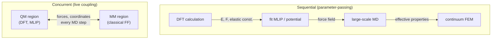

# Coupling Schemes

<figure markdown>

<figcaption>The two flavours of multiscale coupling. In the sequential or parameter-passing scheme (top), a DFT calculation supplies energies, forces and elastic constants to fit a potential, which drives a large-scale MD simulation, whose effective properties in turn feed a continuum finite-element model — each handoff happens once. In the concurrent or live-coupling scheme (bottom), a quantum-mechanical region and a classical molecular-mechanics region are embedded in the same running simulation and exchange forces and coordinates at every MD step.</figcaption>
</figure>

There are two fundamentally different ways to make two simulation methods work
together. We will call them *sequential* and *concurrent*. Almost every named
multiscale technique you will encounter — QM/MM, ONIOM, coupled atomistic and
discrete dislocation (CADD), phase-field-crystal embedding, hierarchical MD-FEM
— is a variation on one of these two themes. Getting the distinction clear at
the start will save you many headaches.

## Sequential coupling

In sequential (sometimes called *hierarchical* or *one-way*) coupling, one
method runs to completion, produces some output, and that output becomes the
input of the next method. Information flows in a single direction, from finer
to coarser (usually).

A canonical example, which we have already implicitly seen in the MLIP chapter:

1. Run a few thousand DFT single-point calculations on diverse configurations.
2. Use those energies and forces to fit a machine-learning interatomic
   potential.
3. Run large MD with the MLIP to compute elastic constants over a range of
   strains.
4. Feed the elastic constants into a finite-element model of a component.
5. Use the FEM result in a higher-level engineering design tool.

At no point does the FEM ask the DFT a question. The DFT runs once, produces
training data, and is then discarded. The MLIP runs once, produces elastic
constants, and is then discarded. The chain is unidirectional.

Sequential coupling has three big advantages.

**It is simple to implement.** Each method runs in its own world with its own
software stack. The "coupling" is a file-format conversion at each interface.

**It is computationally cheap.** Each scale only runs as much as is needed to
feed the next. You do not pay for the expensive method to be on standby.

**It is easy to validate.** You can check each stage of the pipeline against
experiment or against a higher-level method, independently.

It also has three real disadvantages.

**It cannot handle feedback.** If the coarse scale changes the conditions
under which the fine scale should run — for example, if the FEM-computed
strain field changes which barrier should be used in the KMC — sequential
coupling cannot capture that. You would need to re-run the chain.

**It assumes scale separation.** Sequential coupling works because at each
interface, the fast variables (atomic vibrations, electronic motion) have been
averaged out into a small number of slow variables (elastic constants,
diffusion coefficients). When scale separation breaks down — near a phase
transition, at a moving crack tip, in a glassy system — the averaging
introduces uncontrolled errors.

**Error accumulation.** Each pass-through loses information. The DFT might
give energies to 1 meV/atom; the MLIP fit to 5 meV/atom; the elastic constant
fit to 5% accuracy; the FEM averaging to 10% accuracy. The downstream tool
inherits all of this.

Despite its limitations, sequential coupling is the workhorse of computational
materials science. Most of what you read in *npj Computational Materials* is,
when you look at the methods section carefully, a sequential pipeline.

### A worked sequential pipeline

Let us write out one such pipeline in some detail, to make the data flow
concrete. The problem: predict the temperature-dependent thermal conductivity
of a thermoelectric, say SnSe.

1. **DFT step.** Compute the ground-state energy, electronic structure, and
   phonon dispersion at a handful of volumes. This gives you anharmonic force
   constants by finite displacement, plus the Grüneisen parameters.
2. **Phonon Boltzmann transport step.** Feed those force constants into a
   linearised Boltzmann transport equation solver (ShengBTE, Phono3py).
   Output: $\kappa_l(T)$, the lattice thermal conductivity.
3. **Optional MLIP step.** If the DFT phonons converge slowly with supercell
   size, fit an MLIP and run larger supercells to get converged force constants.
4. **Engineering step.** Combine $\kappa_l(T)$ with the electronic
   transport prediction to get $zT$, the figure of merit.

At no point does the BTE solver send information back to the DFT. The interface
is a `FORCE_CONSTANTS` text file, plus a few `POSCAR`s.

??? question "Pause and recall"
    Before reading on, try to answer these from memory:

    1. What is the defining difference between sequential (parameter-passing) and concurrent (live) coupling?
    2. In a sequential workflow, what kind of artefact is passed between methods, and how often?
    3. Why is sequential coupling simpler to implement but potentially fragile when the large-scale simulation explores states the small-scale calculation never sampled?

    If any of these is shaky, re-read the preceding section before continuing.

## Concurrent coupling

In concurrent (sometimes called *embedded*, *online*, or *two-way*) coupling,
two methods run *simultaneously* on *different regions* of the same system. The
canonical example is QM/MM, which we treat in detail in
[Section 2](02-qm-mm.md). The atoms in the reactive region feel quantum forces;
the atoms in the bulk environment feel classical forces; and at every MD step
or every geometry optimisation step, both regions are updated.

The hallmark of concurrent coupling is that the methods are *coupled at the
level of forces or energies, not at the level of derived quantities*. The MM
force field does not feed an averaged property to the QM region; it feeds raw
forces at every step.

Concurrent coupling makes sense when:

- The fast scale (electronic, atomistic) is not in equilibrium relative to the
  slow scale. The chemistry at a crack tip changes as the crack propagates;
  there is no point in pre-computing all possible chemistries and putting them
  in a table.
- The geometry of the fine scale is not known in advance. A reactive event in
  an enzyme moves atoms about; you cannot do a fixed-cell phonon calculation.
- Feedback between scales is the entire point. In QM/MM electrostatic
  embedding, the MM charges polarise the QM electron density, which then
  produces forces on the MM atoms, which then move, which then changes the
  polarisation field on the QM region…

Concurrent coupling is harder to implement, harder to converge, and harder to
validate. A great deal of the technical literature is about the *hand-shake
region* — the buffer of atoms where the two methods meet.

### Categories of concurrent scheme

Within concurrent coupling, the main flavours are:

- **QM/MM (quantum/classical).** A small reactive region uses DFT (or
  post-Hartree-Fock); the environment uses a classical force field. We treat
  this fully in [Section 2](02-qm-mm.md).
- **Atomistic/continuum.** A small atomistic region near a defect uses MD;
  the surrounding solid is treated as a linear-elastic continuum and solved by
  FEM. The CADD method and the bridging-domain method are the classic
  examples.
- **Coarse-grained/atomistic.** A region of interest uses fully atomistic MD;
  the surrounding solvent or polymer matrix is coarse-grained. Adaptive
  resolution schemes (AdResS) allow molecules to transition smoothly between
  the two.

In every case the structure is the same: a fine region, a coarse region, and a
boundary or hand-shake where the two methods must agree.

## Multifidelity is not multiscale

This is a distinction that is worth being pedantic about, because the two
ideas are increasingly confused in the machine-learning literature.

**Multiscale**: different *physics* (or different *degrees of freedom*) at
different scales. DFT in one place, MM in another. Atoms in one region, a
continuum in another.

**Multifidelity**: different *cost approximations to the same physics* at the
same scale. A small MLIP and a large MLIP. A coarse FEM mesh and a fine one.
PBE DFT and hybrid DFT.

The reason it matters: the maths is different.

A multiscale method needs to negotiate a *physical* boundary between two
descriptions. It must conserve energy across the boundary (or at least not
double-count it). It must handle forces at the interface.

A multifidelity method needs to negotiate a *statistical* relationship between
two estimators of the same quantity. The standard tool is *control variates*:
let $f_\mathrm{HF}$ be the high-fidelity estimator (expensive, accurate) and
$f_\mathrm{LF}$ be the low-fidelity one (cheap, biased). Then

$$
\hat{f} = f_\mathrm{LF}(\mathbf{x}) + \big[f_\mathrm{HF}(\mathbf{x}^*) - f_\mathrm{LF}(\mathbf{x}^*)\big]
$$

where $\mathbf{x}^*$ is a small subset on which both have been evaluated. You
sample the low-fidelity model heavily and the high-fidelity sparingly, and the
$\delta$-correction kills the bias.

Multifidelity is statistical efficiency. Multiscale is physical bridging. Both
can be in the same pipeline — for instance, a multifidelity ensemble of MLIPs
embedded inside a sequential multiscale workflow — but you should know which
hat you are wearing at each step.

!!! warning "A common confusion"
    "Train a cheap model to mimic an expensive one and use the cheap one in
    production" is *not* multiscale, even if the expensive one is DFT and the
    cheap one is an MLIP. It is single-scale multifidelity surrogate modelling.
    You are still doing atomistic simulation; you are just doing it with a
    cheaper energy function.

## The hand-shake region

In concurrent coupling, the place where the fine and coarse methods meet is
where errors live. Three pathologies recur.

### Energy and force inconsistency

If the QM region computes a chemical bond energy as $-4.5$ eV and the MM
region's force field gives the same bond as $-4.2$ eV, then an atom that walks
across the boundary from QM-side to MM-side suddenly experiences a $0.3$ eV
jump in its potential energy. That is a $\sim 3500$ K thermal kick. It is enough
to evaporate a small molecule.

The cure is either to *reparameterise* the MM force field so that it agrees
with the QM in the boundary region, or to use a *smooth blending function*
that interpolates between the two energies as a function of position.

A common blending choice is

$$
E_\mathrm{blend}(\mathbf{r}) = \lambda(\mathbf{r}) E_\mathrm{QM}(\mathbf{r}) + \big[1 - \lambda(\mathbf{r})\big] E_\mathrm{MM}(\mathbf{r})
$$

with $\lambda$ a smooth function that is 1 deep in the QM region and 0 deep in
the MM region. Forces are obtained by differentiating $\lambda$, which means
that even where $E_\mathrm{QM} = E_\mathrm{MM}$, the *gradient* of $\lambda$
contributes spurious forces. This is the so-called "ghost force" problem and
has spawned an entire literature.

### Double counting

If the QM Hamiltonian already includes the interaction between QM atoms and
the partial charges of MM atoms (electrostatic embedding), and you then add a
separate MM-MM electrostatic term for those same QM atoms, you have counted
the QM-MM interaction twice. The energy will be wrong; the forces, doubly so.

The defensive habit is to write down your total energy expression *in symbols*
before you write any code, and check that every pairwise interaction appears
exactly once.

### Smoothness and dynamics

Even when energies match, the *spectrum* of vibrational modes in the two
regions may not. A QM region near a defect will have a phonon density of
states that differs from the MM bulk. If you run finite-temperature MD across
the boundary without any thermostatting tricks, energy will not equipartition
correctly. Modes in the QM region that should be hot will be cold, and vice
versa, because the boundary acts like a partial reflector for phonons.

The standard cure is a *stadium* thermostat: thermostat the buffer region
between QM and MM aggressively, so that the QM-MM boundary is in local
equilibrium with the imposed temperature. This decouples the slow problem of
thermal transport across the boundary from the fast problem of the actual
chemistry.

## Choosing between sequential and concurrent

A practical decision tree:

1. **Is your fine scale in steady state?** If yes, sequential coupling is
   almost always preferable. Run the fine scale once, extract a coarse
   quantity, use it in the coarse model.
2. **Is your fine scale strongly affected by the boundary conditions imposed
   by the coarse scale?** If yes (a crack tip changes shape as the load
   changes), concurrent coupling is needed.
3. **Do you have feedback?** If a coarse-scale change must modify the
   fine-scale problem within a single simulation, concurrent.
4. **Are you a PhD student with six months?** Sequential. Always start
   sequential. Switch to concurrent only when you have demonstrated that
   sequential fails.

Concurrent coupling is intellectually attractive and computationally seductive
— it feels like "real" multiscale. But the literature is full of papers where
the authors built a beautiful concurrent framework only to discover that a
plain sequential pipeline would have given the same answer.

!!! tip "Default to sequential"
    If you can express your problem as a chain of one-way handoffs, do so. The
    moment you cannot — when the answer at one scale legitimately depends on
    the answer at another scale within a single simulation — that is when
    concurrent coupling becomes earnt rather than indulgent.

## Looking ahead

The rest of this chapter unpacks specific instances of these schemes:

- [QM/MM](02-qm-mm.md) is the concurrent scheme par excellence.
- [Coarse-graining](03-coarse-graining.md) is a sequential bridge from
  atomistic to mesoscale.
- [KMC and phase-field](04-kmc-phase-field.md) are sequential bridges that
  consume atomistic input and produce mesoscopic output.
- [FEM bridges](05-finite-element-bridge.md) connect simulation to engineering
  design.

In every case, ask yourself: what is the fine scale, what is the coarse scale,
where is the boundary, and which way is information flowing.
