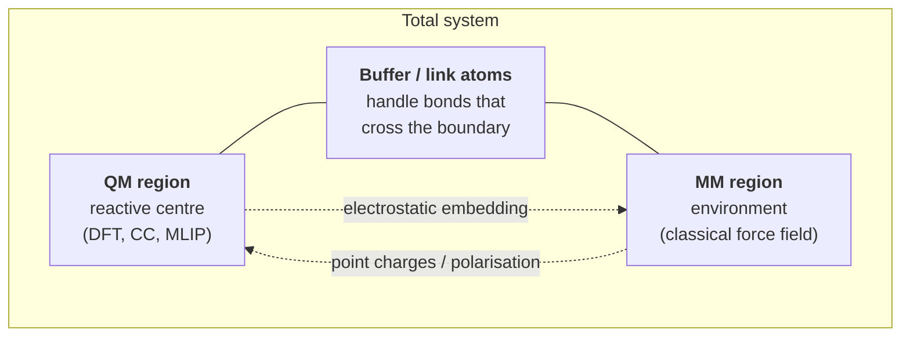

# QM/MM Methods


*Region diagram of a QM/MM partition. A small chemically active region is treated quantum-mechanically; the bulk environment is treated with a classical force field; a buffer zone with link atoms or capping schemes glues them together.*

QM/MM is the prototypical concurrent multiscale method. A small region of
chemical interest is treated with quantum mechanics, usually DFT; everything
else is treated with a classical force field; the two regions interact through
a carefully constructed Hamiltonian. The method was introduced by Warshel and
Levitt in 1976 to study enzyme catalysis, and earned them a share of the 2013
Nobel Prize in Chemistry.

In computational materials science, QM/MM is less central than in biochemistry,
but it appears in three important contexts:

- **Defects with reactive environments.** A point defect in a metal or
  semiconductor where the local chemistry (charge state, bonding) is
  non-trivial, but the elastic far-field is just a strained lattice.
- **Electrochemistry.** An electrode-electrolyte interface where bond making
  and breaking happens at the metal surface, but the bulk electrolyte is a
  mundane solvent.
- **Crack tips and dislocation cores.** The bond-breaking chemistry at the
  defect is QM; the surrounding strain field is classical.

This section walks through the maths of QM/MM, the choices that have to be
made at the boundary, and gives a working example you can run on a laptop.

## The QM/MM idea, informally

The total system contains $N_\mathrm{QM}$ atoms in the *inner region* (where
chemistry happens) and $N_\mathrm{MM}$ atoms in the *outer region* (where it
does not). We want a total energy

$$
E_\mathrm{total} = E_\mathrm{QM}^\mathrm{contribution} + E_\mathrm{MM}^\mathrm{contribution} + E_\mathrm{interaction}
$$

such that the forces on every atom can be computed, the energy is
$\Sigma$-additive over the partition, and (this is the hard part) the QM and
MM descriptions agree at the boundary.

There are two classical ways to split this. The *subtractive* scheme, due
mainly to Morokuma and the ONIOM family of methods, computes the energy by a
clever inclusion-exclusion. The *additive* scheme writes the total energy as
the sum of three contributions and treats the cross-term explicitly. Both have
their place.

## Subtractive scheme (ONIOM)

The subtractive scheme starts with the observation that if the MM force field
were *perfect* — i.e. if it reproduced QM energies exactly — then we could just
do an MM calculation on the whole system. It is not perfect, especially in the
inner region where chemistry happens. So we correct it.

Let:

- $E_\mathrm{MM}^\mathrm{full}$ = MM energy of the entire system, inner + outer.
- $E_\mathrm{QM}^\mathrm{inner}$ = QM energy of just the inner region, with
  some appropriate cap to satisfy valence (more on this later).
- $E_\mathrm{MM}^\mathrm{inner}$ = MM energy of just the inner region, with
  the same cap.

The subtractive ONIOM energy is

$$
\boxed{\quad E_\mathrm{ONIOM} = E_\mathrm{MM}^\mathrm{full} + E_\mathrm{QM}^\mathrm{inner} - E_\mathrm{MM}^\mathrm{inner} \quad}
$$

The intuition: take the cheap MM energy of the whole system, then *correct*
the inner region by swapping its MM energy out and the QM energy in. The
subtraction prevents double counting.

A few things to notice.

First, the QM calculation does not "see" the MM environment at all in the
purely subtractive version. The polarising effect of the outer region on the
inner electron density is missed. This is sometimes called *mechanical
embedding* — the only coupling between QM and MM is through the geometry. For
many problems (steric strain, conformational preference) this is enough; for
problems where the electronic structure of the inner region is sensitive to
the electric field of the outer (most of charge-transfer chemistry,
electrochemistry, biological enzymes) it is not.

Second, the MM force field must be able to handle the inner region. If your
inner region contains a transition state with a partially formed bond, the MM
force field does not know what to do with it. This is one of the limitations
of subtractive schemes: the MM force field must be defined for every state
the inner region visits.

Third, the gradient (force) is simply the same subtraction, term by term, of
the gradients. As long as each individual energy is differentiable, you have
forces.

ONIOM generalises to more than two layers (QM:MM:MM with three different
methods), and even to QM:QM:MM (using cheap and expensive QM in nested
fashion). The same subtractive pattern applies recursively.

### When subtractive is enough

Use subtractive (ONIOM) when:

- Your MM force field is well-parameterised for the species in the inner
  region (e.g. organic molecules with AMBER, biomolecules with CHARMM,
  silicates with ReaxFF).
- The electrostatic polarisation of the inner region by the outer is not a
  primary effect.
- You want a simple, robust scheme with a clear energy expression.

Most calculations of binding energies of ligands to enzyme active sites, or
of small molecules adsorbed on a defective surface in a non-polar matrix, are
done with ONIOM-style subtractive schemes.

## Additive scheme

The additive scheme writes the total energy as

$$
\boxed{\quad E_\mathrm{additive} = E_\mathrm{QM}^\mathrm{inner} + E_\mathrm{MM}^\mathrm{outer} + E_\mathrm{interaction}^\mathrm{QM-MM} \quad}
$$

The three terms are:

- $E_\mathrm{QM}^\mathrm{inner}$: a QM calculation on the inner region only,
  possibly with capping.
- $E_\mathrm{MM}^\mathrm{outer}$: an MM calculation on the outer region only,
  including any internal MM-MM bonded and non-bonded terms.
- $E_\mathrm{interaction}^\mathrm{QM-MM}$: the cross-term — interactions
  between the QM and MM regions.

The additive scheme places all the modelling subtlety into
$E_\mathrm{interaction}$. There are three standard choices, in increasing
order of fidelity and cost.

### Mechanical embedding

The interaction between QM and MM is purely classical. The QM atoms have
fixed point charges (typically taken from an MM force field or from a
gas-phase electronic-structure calculation), and the QM-MM electrostatic
interaction is

$$
E^\mathrm{ME}_\mathrm{elec} = \sum_{i \in \mathrm{QM}} \sum_{j \in \mathrm{MM}} \frac{q_i^{(\mathrm{fixed})} q_j}{4\pi\varepsilon_0 r_{ij}}
$$

plus the standard Lennard-Jones (or equivalent) van der Waals terms.

This is essentially what subtractive ONIOM does in disguise. It is the
cheapest option and the one you reach for first.

### Electrostatic embedding

The QM Hamiltonian is augmented with a potential from the MM point charges:

$$
\hat{H}_\mathrm{QM}^\mathrm{embedded} = \hat{H}_\mathrm{QM}^\mathrm{vacuum} + \sum_{j \in \mathrm{MM}} \int \frac{q_j\,\hat{\rho}(\mathbf{r})}{4\pi\varepsilon_0 |\mathbf{r} - \mathbf{R}_j|} d^3 r
$$

That is, the MM charges enter the one-electron part of the QM Hamiltonian as
external point charges. The QM electron density $\hat{\rho}$ is allowed to
polarise in response, which is precisely the physics that mechanical embedding
misses.

The forces on MM atoms now include a contribution from the polarised QM
density, which is consistent (this is what is meant by saying that the
embedding is *self-consistent*).

Electrostatic embedding is the usual choice for problems where the QM region
is in a polar environment. The cost increase over mechanical embedding is
modest: a few extra one-electron integrals.

### Polarisable embedding

The MM atoms themselves are no longer treated as fixed point charges, but as
*polarisable sites* with induced dipoles that respond to the QM electric
field. The induced dipoles in turn polarise the QM density, and the whole
thing is solved self-consistently.

Polarisable embedding (PE, also called QM/MMpol) is the state of the art for
problems where mutual polarisation matters: solvatochromism, excited-state
chemistry in proteins, redox couples. It is computationally more expensive
and requires a polarisable force field (AMOEBA being the most common).

## Boundary atoms

A subtlety we have skirted is what happens when the QM/MM partition cuts
through a covalent bond. This is unavoidable in enzymes (you can hardly put
the whole protein in the QM region) and common in materials (the QM cluster
ends at some surface).

A cut bond presents two problems:

- The QM region now has a dangling bond — an open valence. Left alone it will
  produce a free radical, which has different chemistry from the intended
  closed-shell structure.
- The MM region has lost a bonded neighbour. Most force fields specify
  internal coordinates (bond lengths, angles) relative to atoms which no
  longer have a QM-side partner.

Three standard treatments:

**Link atoms.** Add a hydrogen atom (or sometimes a fluorine) at the cut
bond on the QM side, positioned to satisfy the valence. The link atom appears
only in the QM calculation; the MM force field still sees the original heavy
atom. The bond length is constrained, usually as a fraction of the original
bond, so that the link atom does not introduce a spurious degree of freedom.

The link atom approach is simple and widely used, but it is approximate: a
C-H bond is not chemically identical to a C-C bond, and the electronegativity
mismatch can introduce small charge-transfer artefacts.

**Capping atoms.** A more sophisticated variant: the cap is a pseudo-atom
parameterised to mimic the electronic environment of the original neighbour.
These are sometimes called "frozen-orbital" or "generalised hybrid orbital"
caps.

**Hybrid orbitals.** The most rigorous treatment: place a hybrid sp$^3$
orbital at the boundary, oriented along the cut bond direction, with one
electron, and freeze it. The QM region sees a partially occupied orbital that
correctly represents the bond stub. This is the approach behind methods like
the local self-consistent field (LSCF) and the generalised hybrid orbital
(GHO) methods.

For materials calculations, where the cut bond is often a metal-metal or a
metal-oxygen bond, the link-atom approach is harder to justify and the
hybrid-orbital schemes have not been widely developed. In practice, materials
QM/MM tries to define the QM region so that it does not cut covalent bonds in
the first place — e.g. defining it as a set of complete coordination
polyhedra rather than as a sphere of atoms.

!!! warning "Where to cut"
    The single most important QM/MM design decision is where to draw the
    boundary. Cut through ionic interactions or weak van der Waals contacts
    if you can; never cut through a $\pi$-bond, a delocalised system, or a
    metal centre's first coordination shell.

## A laptop-runnable example with ASE

Let us make this concrete. We will set up a simple QM/MM calculation using
ASE's `SimpleQMMM` class. To keep the example laptop-runnable, we will use
the embedded atom method (EAM) calculator as our "QM" surrogate and a
Lennard-Jones force field as our "MM". The point here is not the physics —
EAM is not quantum — but the *plumbing*: how energies, forces, and the
boundary are wired together.

The system: a small Cu nanoparticle (the "QM" inner region) embedded inside a
larger argon-like classical cluster.

```python
"""Minimal QM/MM example: Cu inner region inside a classical LJ shell.

Uses ase.calculators.qmmm.SimpleQMMM. EAM stands in for QM here; the goal
is to exercise the coupling machinery, not to learn copper physics.
"""
from __future__ import annotations

import numpy as np
from ase import Atoms
from ase.build import bulk
from ase.calculators.emt import EMT
from ase.calculators.lj import LennardJones
from ase.calculators.qmmm import SimpleQMMM
from ase.optimize import BFGS


def build_system(n_inner: int = 13, n_outer_shells: int = 2) -> Atoms:
    """Build a small Cu cluster (inner) plus a surrounding LJ shell (outer).

    Parameters
    ----------
    n_inner : int
        Number of Cu atoms in the inner (QM-treated) region.
    n_outer_shells : int
        Number of fcc shells of LJ pseudo-atoms to add around the inner cluster.

    Returns
    -------
    Atoms
        Combined atoms object. The first ``n_inner`` atoms are the inner
        region; the remainder are the outer region.
    """
    # Build a small fcc Cu chunk and trim to n_inner atoms.
    parent = bulk("Cu", "fcc", a=3.61, cubic=True).repeat((3, 3, 3))
    centre = parent.get_center_of_mass()
    distances = np.linalg.norm(parent.positions - centre, axis=1)
    order = np.argsort(distances)
    inner = parent[order[:n_inner]]
    inner.set_chemical_symbols(["Cu"] * n_inner)

    # Build outer shells from the *next* atoms in the sorted parent.
    n_outer = 26 * n_outer_shells  # rough surface count
    outer = parent[order[n_inner:n_inner + n_outer]]
    outer.set_chemical_symbols(["Ar"] * len(outer))  # pretend they are LJ

    system = inner + outer
    system.center(vacuum=6.0)
    return system


def make_qmmm_calculator(n_inner: int) -> SimpleQMMM:
    """Wire up the inner (EMT, the 'QM' stand-in) and outer (LJ) calculators."""
    qm_indices = list(range(n_inner))
    qm_calc = EMT()                   # cheap, fast, decent for Cu
    mm_calc = LennardJones(           # generic LJ for the Ar shell
        epsilon=0.0103, sigma=3.40,
    )
    mm_calc_inner = LennardJones(     # SAME MM applied to the inner subsystem
        epsilon=0.0103, sigma=3.40,
    )
    return SimpleQMMM(
        selection=qm_indices,
        qmcalc=qm_calc,
        mmcalc1=mm_calc,
        mmcalc2=mm_calc_inner,
    )


def main() -> None:
    n_inner = 13
    atoms = build_system(n_inner=n_inner)
    atoms.calc = make_qmmm_calculator(n_inner=n_inner)

    e0 = atoms.get_potential_energy()
    print(f"Initial QM/MM energy: {e0:.4f} eV")

    # A few BFGS steps just to show that forces propagate sensibly.
    dyn = BFGS(atoms, logfile="-")
    dyn.run(fmax=0.05, steps=20)

    e1 = atoms.get_potential_energy()
    print(f"Relaxed QM/MM energy: {e1:.4f} eV")
    print(f"Relaxation energy:    {e0 - e1:.4f} eV")


if __name__ == "__main__":
    main()
```

What this code does, mechanically:

1. Builds an fcc Cu chunk, takes the 13 atoms closest to the centre as the
   inner ("QM") region, and the next 26-or-so atoms as the outer ("MM")
   region. The outer atoms are renamed to Ar so we can use a standard LJ
   force field on them.
2. Constructs a `SimpleQMMM` calculator. The three sub-calculators correspond
   to the three energies in the subtractive expression:

   $$
   E_\mathrm{ONIOM} = E_\mathrm{MM}^\mathrm{full} + E_\mathrm{QM}^\mathrm{inner} - E_\mathrm{MM}^\mathrm{inner}.
   $$

   `mmcalc1` is the full-system MM, `qmcalc` is the inner QM, and
   `mmcalc2` is the inner MM that gets subtracted.
3. Runs a BFGS optimisation. Forces on every atom are correctly computed by
   the subtractive scheme.

A few things to keep in mind when generalising this:

- For a real QM/MM job in materials, you would replace `EMT()` with a real
  DFT calculator (`GPAW`, `Quantum ESPRESSO`, `VASP` via ASE) and the LJ outer
  with a real classical force field (`OpenMM`, `LAMMPS` via ASE).
- `SimpleQMMM` is the *subtractive* variant. ASE also provides `EIQMMM` for
  electrostatic interaction QM/MM, which adds the polarising potential of
  the MM charges to the QM Hamiltonian.
- The boundary in this toy example does not cut covalent bonds. If yours
  does, you must explicitly add link atoms; ASE supports this via the
  `embedding` argument.

The relaxation step here is just to demonstrate that the forces are
self-consistent and that the optimiser converges. The energy difference
between initial and relaxed geometry is small (sub-eV) because the system is
already near a reasonable configuration.

### Things that will go wrong in your first QM/MM job

In order of how often they bite the unwary:

1. **The QM region is too small.** A common mistake is to put just the atoms
   "of interest" in the QM region. But the second-shell neighbours are often
   chemically essential — they polarise the QM region or participate in the
   reactive mechanism. Always check convergence with respect to QM region
   size, just as you would check k-point convergence in pure DFT.
2. **The MM force field disagrees with the QM at the boundary.** Plot the
   $E_\mathrm{QM}^\mathrm{inner}$ and $E_\mathrm{MM}^\mathrm{inner}$ as a
   function of some geometric coordinate (a bond length, an angle). If they
   diverge, the subtractive correction is fighting itself and your results
   will be unstable.
3. **Electrostatic embedding without a redistribution scheme.** When you cut
   a bond and use a link atom, the partial charge that the MM force field
   assigned to the now-replaced atom must go *somewhere*. The standard fix
   is to redistribute it onto neighbours. If you forget, you get a spurious
   net charge on the QM region.
4. **Spurious drift in MD.** QM/MM molecular dynamics frequently shows slow
   energy drift because the gradients of the partitioning function (the
   $\lambda$ in our [Section 1](01-coupling-schemes.md) discussion) introduce
   ghost forces. The conventional patch is to keep the QM/MM partition
   *fixed* during MD (no adaptive boundary), which is a strong restriction
   but avoids the problem.

## Summary

QM/MM is the right tool when:

- you have a localised region of interesting chemistry,
- the surrounding environment is large but boring,
- classical force fields exist for the environment,
- and you can draw a partition that does not cut through delicate bonding.

For materials applications, QM/MM is most commonly seen in the embedded
cluster treatment of defects in ionic insulators, in electrochemistry, and
occasionally in fracture mechanics. For most bulk materials questions it is
overkill: a converged supercell DFT calculation, or DFT-trained MLIP MD, will
do.

We turn next to *coarse-graining*, which is in a sense the opposite move:
instead of zooming in on a small reactive region, we zoom out by deliberately
throwing away atomic resolution.
