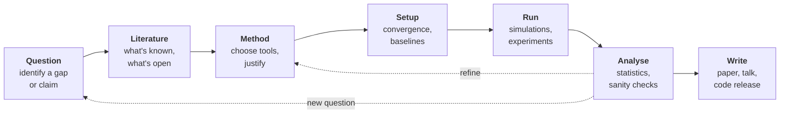

# How Research Works

*The idealised research loop, with the unglamorous but vital back-arrows: analysis usually sends you back to refine the method or even to reframe the question.*

A computational materials thesis, in idealised cartoon form, looks like
this. You walk in on Day 1, your supervisor hands you a question. You
read for a fortnight, learn the relevant software in another fortnight,
launch your production calculations in month three, gather results in
month four, analyse them in month five, write up in month six, and
defend. Everything is clean, sequential, planned, predictable.

This is not how research works.

What actually happens, in our experience, is more like this. You walk in
on Day 1. You spend the first two weeks somewhat confused, reading papers
that you only half understand because half the methods are unfamiliar. By
the end of week two you have a vague sense of the area but not yet a
question. Your supervisor, who started thinking about your project six
months before you arrived, gives you a more specific direction. You spend
the next month learning the software, generating wrong-looking results,
not knowing if they are wrong or just unfamiliar, until eventually you
have a working calculation. Three weeks before your deadline you realise
that your interpretation of one parameter has been wrong the whole time
and you have to redo three months of calculations. You make it to the
deadline by writing in a panic for the last two weeks, fuelled by anxiety
and bad takeaway.

That is a successful thesis. An *unsuccessful* one is shorter and more
painful.

This section is about narrowing the gap between the cartoon and the
reality.

## The full pipeline, properly described

Here is a more honest decomposition. A computational research project, of
the kind you will do for a thesis, has roughly the following stages:

**Question.** What are you actually trying to find out? This is often
delivered to you by a supervisor in compressed form ("can you compute the
defect formation energy of Cr in austenitic stainless steel?"), but it
contains an implicit set of choices: *which* defect, *which* compositions,
*at which level of theory*, *with what claim of accuracy*. Unpacking these
choices is the first task.

**Literature.** What is already known? Three categories: papers that have
done *exactly* what you are trying to do (worry — your work risks being
duplicate; look harder, maybe your question needs refining); papers that
have done *something similar* (gold — read these carefully, they are your
template); papers that establish background methods or properties.

**Method choice.** Given the question, which technique? This is largely
the subject of the previous chapters of this handbook. It is rarely a
free choice; constraints come from accuracy requirements, computational
budget, what your group has expertise in.

**Setup.** Build the geometry. Choose the parameters: cutoff energy,
k-point grid, exchange-correlation functional, smearing, supercell size,
timestep, ensemble, force field, MLIP architecture. Each is a choice that
must be defended later.

**Convergence.** For every parameter you chose in the setup, you must
demonstrate that the answer no longer depends on it. This is the subject
of [Section 4](04-convergence-and-validation.md).

**Production.** The actual calculations that will appear in your thesis.
Many runs, sometimes many thousand, often spanning days or weeks on a
cluster. Bookkeeping becomes a real skill.

**Analysis.** Turning raw output files into figures and numbers. This
takes more time than you expect — typically 1.5 to 2 months for a 6-month
thesis, far more than the "two weeks of plotting" that many students
mentally allocate.

**Write-up.** Producing the thesis or paper. Drafting, redrafting,
incorporating feedback. Allow more time than you think.

**Revision.** After your supervisor reads draft 1, you will rewrite. You
will rewrite several times. The first draft is for you to find out what you
think. The last draft is for the examiner.

## A time budget for a six-month thesis

The cartoon evenly distributes time across stages. Reality is lumpier.

A reasonable budget for a six-month MSc or final-year undergraduate
project:

| Stage | Time | Common student estimate |
|---|---|---|
| Literature + initial question shaping | 1 month | 2 weeks |
| Setup and learning the software | 1 month | 2 weeks |
| Convergence studies | 2-3 weeks | "done implicitly" |
| Production | 6-8 weeks | 3 months |
| Analysis | 6 weeks | 2 weeks |
| Write-up | 4 weeks | 1-2 weeks |
| Revision | within the writing time | not allocated |

The right-hand column is what students *think* they will spend. The
left-hand column is what they actually need. The biggest mismatches are
*analysis* (students chronically underestimate) and *writing* (same).

A useful rule: **whatever you think writing will take, double it.** The
second-biggest rule: **whatever you think analysis will take, multiply by
three.** Production time, on the other hand, is often *over*-estimated:
once a workflow is automated, it does not need you sitting next to it.

!!! tip "Plan for the end, work from the start"
    Block out the last four weeks of your project as *write-up time, no
    new calculations*. Mean it. Many students reach week 22 with no
    figures and start trying to generate them in week 25; the result is
    a thesis with hasty analysis and a confused narrative. If you reach
    your write-up window with even partial results, you can write a
    coherent thesis around them.

## Group meetings, supervisor check-ins, and getting help

You are not doing this alone. The single most undervalued resource of a
beginning researcher is *the time of more experienced researchers*. They
will not always volunteer it, but they will almost always give it if asked
in a specific, structured way.

**Group meetings.** Most computational groups have a weekly meeting where
people present their work and discuss problems. Three rules:

1. *Show up*, even when you have nothing to present. You learn what your
   peers are doing, which methods they use, which problems they have. You
   build the implicit understanding of the field that is otherwise only
   accessible through years of reading.

2. *Present your work* when it is your turn, even when you feel you have
   "nothing to show". Often the most useful presentations are ones where
   you have a problem you cannot solve. Stating it out loud to people who
   are paying attention is half the route to fixing it.

3. *Ask questions*, even ones you think might be stupid. The actually
   stupid question is the one nobody asks, after which a generation of
   students inherits the misconception.

**One-on-one check-ins with your supervisor.** Aim for weekly or
fortnightly, depending on the supervisor's style. Three rules:

1. *Prepare an agenda* — even one bullet point — and send it the day
   before. This converts the meeting from a casual chat into a useful
   piece of work.

2. *Be specific about what you do not know*. "I am stuck on the
   calculation" is a black hole. "When I run with a 4×4×4 k-grid I get a
   formation energy of 1.3 eV, and with 6×6×6 I get 0.9 eV, and I do not
   know whether to push higher or whether the smearing is the real
   problem" is a question your supervisor can answer.

3. *Write down what was agreed* immediately after the meeting and email
   it to your supervisor. ("To be clear, my plan for the next fortnight
   is X, Y, Z.") This protects you from the entirely human tendency of
   both parties to remember the meeting slightly differently.

**Asking online.** Most software packages (VASP, Quantum ESPRESSO, ASE,
LAMMPS) have public mailing lists or forums. Search before you ask;
nine times in ten your question has already been asked. When asking,
include: the version of the software, the input files, the exact error
message, what you have already tried. A well-formed question gets a
response within a day; a poorly-formed one gets ignored.

## A few illustrative anecdotes

These are composites of real student experiences, anonymised and somewhat
exaggerated for teaching purposes.

### The student who never converged k-points

A student was computing the formation energy of a substitutional defect in
a metal. After two months they reported a value that did not agree with
the literature. After three months they reported a slightly different
value. After four months they reported a third value. In month five, when
finally asked to plot the energy as a function of k-grid density, it
turned out the answer was still drifting at $24 \times 24 \times 24$. The
literature value had used $32 \times 32 \times 32$ and a different
smearing. The student's "results" had been the noise of an unconverged
calculation the whole time. They re-ran with $32^3$ and reproduced the
literature value within 0.05 eV.

The lesson: convergence is not optional. We will return to this in
[Section 4](04-convergence-and-validation.md).

### The student who over-claimed MLIP transferability

A student trained an MLIP on Al-Cu alloy configurations near the Cu-rich
end of the phase diagram. Validation on held-out configurations from the
same composition range gave an MAE of 1.5 meV/atom. The student wrote in
their thesis that the MLIP could be used to predict properties of any
Al-Cu composition. When the external examiner asked whether they had
tested on Al-rich compositions, the answer was no. A quick test during
the viva showed an MAE on Al-rich configurations of 35 meV/atom — well
outside what one would call accurate.

The lesson: *transferability claims must be tested in the regime where
you make them*. An MLIP that is accurate where you trained it tells you
very little about its accuracy elsewhere. See
[Section 5](05-common-pitfalls.md) for more on this and related issues
with train/test design.

### The student who chose the wrong functional

A student computed adsorption energies of small molecules on a graphene
surface using PBE. The numbers were small, in the range 0.05-0.2 eV. The
ordering of binding energies disagreed with experiment. After much
puzzling, a senior group member pointed out that PBE does not include van
der Waals interactions, and for graphene-molecule binding van der Waals
is the entire effect being measured. The student re-ran with PBE-D3 and
recovered correct ordering, with reasonable magnitudes.

The lesson: *the choice of functional is part of the methods. It is a
modelling assumption*. See [Section 5](05-common-pitfalls.md) for
specific failure modes by functional.

### The student who did everything right

A student picked a tightly scoped question (vacancy formation energy in
pure iron under hydrostatic compression). They converged k-points and
cutoff in the first three weeks, with plots. They ran a clean set of
production calculations spanning the parameter range. They analysed the
results with a simple fit. They reproduced two published values exactly
and extended the range to compressions that had not been computed before.
Their thesis was eighty pages and reproducible. They got a distinction.

There is no lesson in this anecdote, except to say: when a project is
scoped well and executed carefully, everything goes smoothly. Cinderella
endings exist; they are not the default; they are the result of good
process.

## What "research" actually rewards

A final word on what research, in your supervisor's view, actually
rewards.

It does not reward heroic effort on the wrong problem. It does not
reward beautiful coding without scientific results. It does not reward
publishing many papers on small variations of the same idea.

It rewards the production of *correct, well-supported, reproducible
claims about the natural world*. The whole process — question selection,
method choice, convergence, analysis, writing — is in service of this.
A modest thesis with three solid claims, each defended carefully, is a
better thesis than an ambitious thesis with twelve claims that fall apart
under questioning.

If you internalise one thing from this section, let it be this: **fewer
claims, better defended.** The instinct will be to do as much as possible.
Resist it. Pick a small thing. Get it right. Write it up clearly. That is
research.

[Section 2](02-choosing-a-problem.md) is about how to pick the small
thing.
