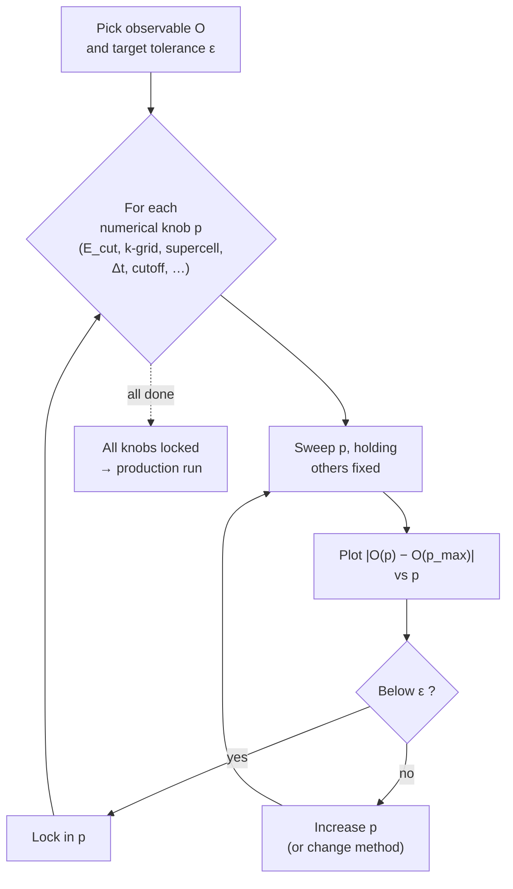

# Convergence and Validation

<figure markdown>

<figcaption>Convergence study decision tree. Start by picking the observable of interest and a target tolerance up front. Then, for each numerical knob — plane-wave cutoff, k-grid, supercell size, timestep, neighbour cutoff and so on — sweep that knob while holding the others fixed, plot the deviation of the observable from its finest-grid value, and check whether it is below tolerance: if so, lock in the parameter and move to the next knob; if not, increase the parameter or change method and sweep again. Once every knob is locked, proceed to the production run.</figcaption>
</figure>

There is exactly one inviolable rule of computational materials science:
*every result must be converged with respect to every parameter that
could affect it.* No exceptions. No "the literature uses X so it must be
fine". No "we are time-pressed". An unconverged result is not a result;
it is a wrong number that happens to be in roughly the right ballpark,
and the difference between "right number" and "wrong number near the
right number" is the difference between research and noise.

This section is about how to demonstrate convergence on *your* system,
and how to validate against external benchmarks before claiming any new
result.

## What convergence means

A computed property $P$ depends on a list of numerical parameters
$\theta_1, \theta_2, \ldots$ Convergence means: as each parameter is
taken toward its limiting value (typically: large cutoff energy, dense
k-grid, large supercell, small timestep, long MD run), the property $P$
approaches a limit, and the difference from that limit is smaller than
the precision you need.

In equations: for each parameter $\theta_i$, there exists a value
$\theta_i^*$ such that

$$
|P(\theta_1, \ldots, \theta_i, \ldots) - P(\theta_1, \ldots, \theta_i^*, \ldots)| < \epsilon
$$

for all $\theta_i \geq \theta_i^*$ (assuming "larger is more converged"),
and $\epsilon$ is the precision you have committed to.

The numerical practice is to compute $P$ at several values of each
parameter, plot $P$ versus the parameter, and visually identify the
plateau region where $P$ no longer changes.

## A convergence checklist

For each major method, the parameters that must be tested:

### DFT (plane-wave codes)

- **Cutoff energy** $E_\mathrm{cut}$: the plane-wave basis size. Test a
  range like 200, 300, 400, 500 eV. The property of interest should
  plateau before you commit to a working value.
- **K-point grid**: density of $\mathbf{k}$-point sampling. Test 2×2×2,
  4×4×4, 6×6×6, 8×8×8, etc., scaled appropriately for cell shape.
- **Smearing** (for metals): smearing scheme (Gaussian, Methfessel-Paxton,
  Fermi-Dirac) and smearing width. Different schemes have different
  best-practice widths; check the manual.
- **Pseudopotential / PAW dataset**: less commonly varied, but if you
  have access to two compatible datasets, compare. Some elements have
  notoriously inconsistent published pseudopotentials.
- **Exchange-correlation functional**: PBE vs. PBEsol vs. SCAN vs.
  hybrid. Test on a known property to choose, then *report which you
  chose and why*.
- **Spin polarisation**: if your system has unpaired electrons, you
  must allow spin-polarised solutions and converge them properly. Do
  not assume the closed-shell solution is the ground state.

### DFT (localised basis codes)

Same as above, except:

- **Basis set**: instead of cutoff energy, specify the basis (e.g. 6-31G*,
  cc-pVDZ, def2-TZVPP). Convergence is tested by going to a larger
  basis.

### Molecular dynamics

- **Timestep**: small enough that the fastest motion (typically a C-H
  vibration if present, or any fast bond) is well-resolved. Standard
  rule: at least 20 timesteps per period of the fastest mode. Test by
  running with different timesteps and checking energy conservation in
  NVE.
- **Equilibration time**: how long does the system need to "forget" its
  initial condition? Test by plotting an observable (temperature,
  density, RDF) as a function of MD time; the equilibration period is
  before the observable plateaus.
- **Production time**: long enough that statistical uncertainty in the
  property of interest is below your target precision. The number of
  *independent* samples scales as $t_\mathrm{prod} / \tau_\mathrm{corr}$
  where $\tau_\mathrm{corr}$ is the autocorrelation time of your
  observable. Block averaging helps you estimate the uncertainty
  honestly.
- **Thermostat / barostat coupling**: too tight gives spurious dynamics;
  too loose gives bad temperature control. Test by checking that your
  derived observables do not depend on the coupling parameter within
  reasonable ranges.
- **System size**: defects and finite-size effects can dominate small
  cells. Test the property at 2-3 different system sizes.

### Defect calculations

- **Supercell size**: a defect in a 64-atom supercell is rarely
  converged; 128 or 216 atoms is a more common target, and for charged
  defects you may need 432 atoms or more *plus* image-charge
  corrections.
- **Image-charge correction**: for charged defects under periodic
  boundary conditions, the Makov-Payne or Freysoldt corrections are
  essential.
- **Chemical potentials**: for formation energies, the chemical
  potential of each species must be defined in a way consistent with
  your thermodynamic boundary conditions.

### MLIP training

- **Training data coverage**: does your training set span the
  configurations your production runs will visit? An MLIP that has
  never seen a low-energy structure is unreliable on that structure.
- **Validation curve**: plot training and validation loss as a function
  of training data size and epochs. Both should plateau.
- **Out-of-sample validation**: at the very minimum, hold out a set of
  configurations *generated differently* from the training set (e.g.
  trained on AIMD, tested on minimum-energy structures), and report
  the error there.
- **Active learning convergence**: if you are using AL, the loop should
  terminate (in principle) when the model's uncertainty on candidate
  configurations is below threshold. In practice, monitor the rate at
  which new configurations are being added and stop when it slows.

### Monte Carlo

- **Equilibration**: same considerations as MD; the MC chain needs to
  forget its starting point.
- **Statistical convergence**: standard error of the mean of your
  observables, with proper accounting for autocorrelation between MC
  steps.

??? question "Pause and recall"
    Before reading on, try to answer these from memory:

    1. What does it mean for a calculation to be "converged" with respect to a numerical parameter?
    2. Why must you converge the *observable you report* rather than just the total energy?
    3. Why is each numerical knob swept independently while the others are held fixed?

    If any of these is shaky, re-read the preceding section before continuing.

## How to actually run a convergence study

The temptation is to do convergence "on the side" — a few quick checks,
record the numbers in a lab notebook, move on. This is fine if you are
disciplined. In practice, most students do not record the convergence
checks carefully and end up redoing them under viva pressure.

A better workflow:

1. **Set up a dedicated convergence directory** with subdirectories
   labelled by the parameter being varied. E.g.
   `convergence/ecut/300/`, `convergence/ecut/400/`, etc.

2. **Run the same calculation at each parameter value**, varying only
   the parameter of interest.

3. **Extract the target property** from each. A short Python script
   (10-30 lines) suffices.

4. **Plot the property versus the parameter** as a figure.

5. **Include the figure in your thesis** (probably in an appendix) and
   reference it from the methods section.

This makes the convergence study *first-class output*, not an
afterthought.

A minimal Python sketch for the extraction and plotting:

```python
"""Sketch for a convergence study: plot a target property vs. a
varied parameter, saving the figure for the thesis appendix.
"""
from __future__ import annotations

from pathlib import Path
import matplotlib.pyplot as plt
import numpy as np


def extract_energy(directory: Path) -> float:
    """Pull the final energy from a single converged DFT run."""
    # Pseudocode; adapt to your DFT code's output format.
    output = (directory / "OUTPUT").read_text()
    for line in reversed(output.splitlines()):
        if line.strip().startswith("Final total energy"):
            return float(line.split()[-2])
    raise RuntimeError(f"No energy in {directory}")


def main() -> None:
    base = Path("convergence/ecut")
    cutoffs: list[int] = [200, 250, 300, 350, 400, 450, 500]
    energies: list[float] = [
        extract_energy(base / str(ec)) for ec in cutoffs
    ]
    # Use the largest cutoff as reference.
    e_ref = energies[-1]
    deltas = [e - e_ref for e in energies]

    fig, ax = plt.subplots(figsize=(5, 3.5))
    ax.plot(cutoffs, np.array(deltas) * 1000.0, "o-")  # convert to meV
    ax.axhline(0.0, color="k", lw=0.5)
    ax.set_xlabel("Plane-wave cutoff (eV)")
    ax.set_ylabel("Energy relative to converged (meV/cell)")
    ax.set_title("Convergence with respect to cutoff")
    fig.tight_layout()
    fig.savefig("convergence_ecut.pdf")


if __name__ == "__main__":
    main()
```

Three habits embedded in this sketch that you should adopt:

- **One script per convergence study.** Reproducible, version-controlled,
  re-runnable.
- **Plot the *difference* from a reference**, not absolute values. The
  plateau is easier to see in millielectronvolts than in hartrees.
- **Save the figure as PDF** for the thesis. Do not screenshot. Do not
  embed PNGs in the printed copy.

## How tight does convergence need to be?

This depends on the property and the comparison you intend to make.
Rule-of-thumb targets:

| Property | Target convergence | Reason |
|---|---|---|
| Total energy per atom | 1-5 meV/atom | For comparing structures |
| Formation energy of defects | 10-20 meV | Comparison with literature |
| Adsorption energy | 10-30 meV | Catalysis benchmarks |
| Band gap | 0.05-0.1 eV | Comparison with experiment |
| Lattice parameter | 0.005-0.01 Å | Comparison with X-ray |
| Elastic constants | 5% | Comparison with experiment |
| Phonon frequencies | 5-10 cm$^{-1}$ | Comparison with Raman/IR |
| MD diffusion coefficient | 20% | Order-of-magnitude work |

If you are computing differences (e.g. defect formation energies = bulk
energy minus defective-cell energy), some of the absolute energy
convergence cancels. You may be able to get away with coarser
absolute-energy convergence as long as the *difference* is converged.
But test this explicitly — do not assume.

## Validation against external benchmarks

Convergence shows that your numerical scheme has reached its limit.
Validation shows that the limit it has reached is *correct*. The two are
different.

The minimum standard, for any computational thesis: **reproduce a known
result for your system before claiming a new one.**

Examples of acceptable validation benchmarks:

- For DFT: reproduce a published lattice parameter, formation energy,
  or band gap for the system at hand. If the published number used a
  different functional, compute with the same functional and check.
- For MD: reproduce a published density at room temperature, or a
  published diffusion coefficient.
- For an MLIP: validate against held-out DFT data, and additionally
  against an experimental observable (lattice parameter at finite T,
  say) where feasible.
- For high-throughput screening: pick 5-10 known systems and check that
  your pipeline reproduces their database values.

The validation does not need to be exact. PBE band gaps disagree with
experiment by 30-50%; that is a well-known systematic error of the
method, not a flaw of your calculation. The point of validation is to
catch *gross* errors — wrong stoichiometry, wrong number of valence
electrons, mis-specified pseudopotential, wrong functional input — that
would render the work meaningless.

A failed validation is a vital warning signal. *Do not push past a
failed validation*. Find the cause. Most of the time it is a setup
error (a typo, a misunderstood parameter); occasionally it is a real
sign that the method does not apply to your system, and you need to
re-think.

## What to put in the thesis

Convergence and validation belong in the **methods section** (briefly)
and in the **appendix** (in full). A reasonable structure:

In the methods section:

> *Convergence tests were performed for plane-wave cutoff (200-500 eV in
> steps of 50 eV), Monkhorst-Pack k-grid (from 2×2×2 to 12×12×12), and
> supercell size (54-432 atoms). The values used in production —
> $E_\mathrm{cut} = 450$ eV, $8 \times 8 \times 8$ k-grid, 128-atom
> supercell — converge the defect formation energy to within 15 meV.
> Convergence plots are shown in Appendix A.*

In the appendix:

- A figure for each parameter, showing the target property vs. the
  parameter.
- A short paragraph explaining the choice of working value.
- A reference value (literature or your own benchmark) for comparison.

This is enough to convince any reasonable examiner that the
calculations are converged. It is also enough that a future researcher
could reproduce your choices.

## Negative results matter

A common mistake is to treat unsuccessful convergence as a failure to
be hidden. It is not. *A clear demonstration that a particular
calculation does not converge with available resources is a valuable
result*, and one that an honest thesis includes.

Example: you wanted to compute the formation energy of a charged defect
in a 64-atom cell, found that the result depends sensitively on the
cell size, and could only converge satisfactorily in a 432-atom cell at
the limit of your computational budget. The honest thesis includes
both observations: "we tested up to 432 atoms and found that smaller
cells give artefacts up to 0.3 eV. The 432-atom result is reported
with that caveat."

The dishonest thesis omits the smaller cells and reports only the
432-atom number, leaving the reader to wonder whether convergence has
been demonstrated.

The instinct will be toward the dishonest version. Resist. Examiners
and reviewers can usually smell omitted convergence checks, and the
damage to your credibility is greater than the embarrassment of a
slightly messy convergence story.

!!! warning "The 'good enough' trap"
    A common student rationalisation: "my supervisor said this k-grid is
    fine, so I do not need to test." Two responses. First, the supervisor's
    advice was for a different system or a different property; check that
    it applies to yours. Second, even if it does, you still need to run
    the test and produce the plot. The thesis examiner does not take your
    supervisor's word for it; they take your evidence.

## A final word: convergence is a habit

The skill of running convergence studies is, in the end, a habit. Once
you have run two or three on different systems, you will start
automatically running them on every new project. The first time you
*don't* run one and then have to face the question "how do you know
this is converged?" is the time you internalise the rule.

The five capstone projects ([Section 7](07-the-five-projects.md)) each
require a convergence section. Use them as practice.

[Section 5](05-common-pitfalls.md) collects specific pitfalls beyond
convergence that bite undergraduate projects.
