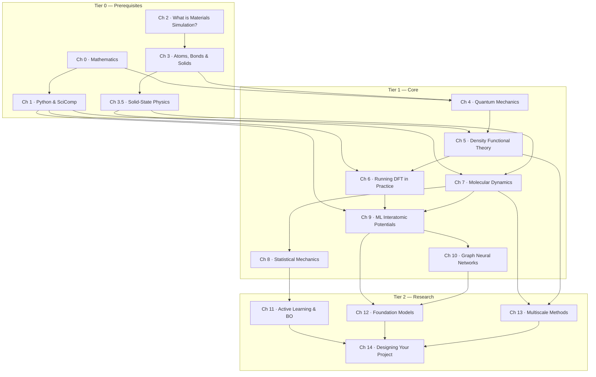

# Learning Path

This page is a map. It shows how the fifteen chapters of the *Materials Simulation Handbook* fit together, how long each one takes, and three different routes through them depending on what you already know and what you want to do.

The book is deliberately built in three tiers. Tier 0 (Prerequisites) gives you the maths, the Python and the physical chemistry you need before you can sensibly run a calculation. Tier 1 (Core) is the textbook proper: quantum mechanics, density functional theory, molecular dynamics, statistical mechanics and machine-learning interatomic potentials. Tier 2 (Research) takes you to the modern frontier — active learning, foundation models, multiscale coupling — and finishes with a capstone chapter that walks you through doing your own small research project.

You can read the book linearly, or you can take one of the shortcuts below. Either is fine. Pick the route that matches your starting point.

---

## The dependency graph

Arrows mean "you will be much happier if you have read the source chapter first." Dotted reasoning, hand-wavy intuition and "trust me for now" boxes are sprinkled throughout to let you skip arrows when you must.

---

## Estimated time per chapter

Hours below are total wall-clock time for an attentive reader: reading the text once, working through the worked examples on paper, running the notebooks, and attempting (not necessarily finishing) the exercises. Multiply by 1.5 if this is your first encounter with the topic; halve it if you are revising.

| Chapter | Tier | Read | Exercises | Code/notebooks | Total |
|---|---|---|---|---|---|
| Ch 0 · Mathematics | 0 | 6 h | 4 h | 2 h | 12 h |
| Ch 1 · Python | 0 | 4 h | 3 h | 3 h | 10 h |
| Ch 2 · What is Materials Simulation? | 0 | 3 h | 1 h | 1 h | 5 h |
| Ch 3 · Atoms, Bonds, Solids | 0 | 5 h | 3 h | 2 h | 10 h |
| Ch 3.5 · Solid-State Prerequisites | 0 | 8 h | 5 h | 3 h | 16 h |
| Ch 4 · Quantum Mechanics | 1 | 8 h | 6 h | 4 h | 18 h |
| Ch 5 · Density Functional Theory | 1 | 8 h | 5 h | 3 h | 16 h |
| Ch 6 · Running DFT | 1 | 5 h | 4 h | 8 h | 17 h |
| Ch 7 · Molecular Dynamics | 1 | 6 h | 4 h | 6 h | 16 h |
| Ch 8 · Statistical Mechanics | 1 | 6 h | 4 h | 4 h | 14 h |
| Ch 9 · MLIPs | 1 | 8 h | 4 h | 8 h | 20 h |
| Ch 10 · Graph Neural Networks | 1 | 6 h | 3 h | 6 h | 15 h |
| Ch 11 · Active Learning & BO | 2 | 5 h | 3 h | 4 h | 12 h |
| Ch 12 · Foundation Models | 2 | 5 h | 2 h | 4 h | 11 h |
| Ch 13 · Multiscale Methods | 2 | 5 h | 3 h | 3 h | 11 h |
| Ch 14 · Designing Your Project | 2 | 4 h | 6 h | open-ended | 10 h+ |
| **Total** | | **92 h** | **60 h** | **61 h+** | **213 h+** |

Two hundred hours is roughly one full-time semester, or two evenings a week for a calendar year. Most readers do not finish the book; most readers do not need to.

---

## Reading paths

### Path A — Linear (12–16 weeks, full coverage)

**For whom.** An undergraduate with strong A-level / first-year maths and physics but no exposure to materials science, no prior DFT, and only basic Python. This is the path the book was designed around.

**How.** Read every chapter in order. Do at least half of the exercises in each chapter. Run every notebook. Do not skip Chapter 0; even if you know the maths, the notation choices made there are used throughout.

**Pacing.**

- Weeks 1–2: Ch 0, Ch 1.
- Weeks 3–4: Ch 2, Ch 3, Ch 4 (single-particle quantum mechanics).
- Weeks 5–7: Ch 3.5 (solid-state prereq, uses Ch 4 lightly), then Ch 5 (DFT).
- Week 8: Ch 6 (get a real DFT calculation running on your own machine or a free cluster).
- Weeks 9–10: Ch 7, Ch 8.
- Weeks 11–12: Ch 9, Ch 10.
- Weeks 13–14: Ch 11, Ch 12.
- Weeks 15–16: Ch 13, Ch 14 and a small capstone project.

If you have only twelve weeks, drop Ch 13 and pick a single Tier-2 chapter that matches the project you choose in Ch 14.

### Path B — Deep core (10–12 weeks, skim prerequisites)

**For whom.** A reader with a physics, chemistry or materials-science background who already knows what a Brillouin zone is, has solved a few one-dimensional Schrödinger equations on paper, but has never run a DFT calculation and has not touched machine learning. Roughly a Cambridge IB Natural Sciences finalist, or anyone with an MSci / MSc in a related discipline.

**How.** Skim Chapters 0 to 3.5, picking up only the notation, the few results you cannot recall, and the Python idioms used later. Then read the entirety of Tier 1 carefully. Touch Tier 2 lightly: skim Ch 11 and Ch 12, read Ch 14 to ground your own project ideas, treat Ch 13 as a reference rather than a sit-and-read chapter.

**Pacing.**

- Week 1: Speed-skim Ch 0–3.5 (~10 h total). Do the exercises only where you fail a self-check question.
- Weeks 2–4: Ch 4, Ch 5 — these contain the conceptual core and are worth slow time.
- Weeks 5–6: Ch 6, Ch 7.
- Weeks 7–8: Ch 8, Ch 9.
- Weeks 9–10: Ch 10, Ch 11.
- Weeks 11–12: Ch 12 and Ch 14, plus a small project.

### Path C — Project-driven (8 weeks)

**For whom.** A machine-learning researcher who wants to do a serious side-project on a materials problem, treats reading materials physics as cost rather than reward, and learns best from a goal.

**How.** Open the `projects/` folder and skim the five READMEs. Pick one. Read **only** the chapters listed as prerequisites in that project's README, plus Ch 1 if you do not yet have an ASE / Quantum ESPRESSO / LAMMPS environment running. Then jump straight into the project; come back to the textbook on demand.

**Indicative pacing (Project 4 — MLIP from scratch).**

- Week 1: Ch 1 environment, Ch 3 atoms/crystals fast read, Ch 9 §§1–3 (descriptors).
- Week 2: Ch 9 §§4–5 (Behler–Parrinello, NequIP/MACE).
- Week 3: Ch 7 §§1–3, just enough MD to run a trajectory.
- Week 4: Ch 8 §1 to know what ensemble you are sampling.
- Weeks 5–8: Project work, returning to Ch 6, Ch 11 or Ch 12 when stuck.

Every project's `README.md` lists its prerequisite chapters explicitly, so you do not need to guess which ones to skip.

---

## Cross-reference matrix

Direct dependencies only. "Direct" means: a result, formula, function or piece of notation introduced in the prior chapter is used without re-derivation in the current chapter.

| Chapter | Directly depends on |
|---|---|
| Ch 0 · Mathematics | — |
| Ch 1 · Python | Ch 0 (for the maths examples) |
| Ch 2 · What is Materials Simulation? | — |
| Ch 3 · Atoms, Bonds, Solids | Ch 0 (linear algebra), Ch 2 |
| Ch 3.5 · Solid-State Prerequisites | Ch 0 (Fourier, linear algebra), Ch 3 |
| Ch 4 · Quantum Mechanics | Ch 0 (calculus, linear algebra, complex numbers) |
| Ch 5 · Density Functional Theory | Ch 3.5 (Bloch theorem, reciprocal space), Ch 4 (many-electron problem) |
| Ch 6 · Running DFT | Ch 1 (Python, shell), Ch 5 |
| Ch 7 · Molecular Dynamics | Ch 0 (ODE intuition), Ch 1, Ch 3.5 (phonons help) |
| Ch 8 · Statistical Mechanics | Ch 0 (probability), Ch 7 |
| Ch 9 · MLIPs | Ch 1, Ch 6 (where data comes from), Ch 7 (what they are for) |
| Ch 10 · Graph Neural Networks | Ch 1, Ch 9 (concept of descriptors) |
| Ch 11 · Active Learning & BO | Ch 0 (probability), Ch 8 (sampling intuition), Ch 9 |
| Ch 12 · Foundation Models | Ch 9, Ch 10 |
| Ch 13 · Multiscale Methods | Ch 5, Ch 7 |
| Ch 14 · Designing Your Project | All of Tier 1; familiarity with at least one of Ch 11–13 |

If you are coming back to a chapter after a long gap, this table is a quick way to figure out which earlier section you have forgotten.

---

## What you can skip on a first pass

The book is opinionated about what is essential and what is enrichment. The following sections are historically important and intellectually beautiful, but they are not load-bearing for the modern simulation workflow. Skipping them on a first reading will not hurt you; come back when you have time.

- **Ch 4 · Quantum Mechanics, §7 (Hartree–Fock).** Conceptually superseded by Kohn–Sham DFT for our purposes. Read it once you are comfortable with Ch 5; it will then make perfect sense as the "non-density" cousin.
- **Ch 5 · DFT, §1 (Thomas–Fermi).** A pre-modern functional that nobody runs in 2026. It is the natural opening for the Hohenberg–Kohn theorem, but if you already accept that energy is a functional of the density, you can start at §2 and lose nothing.
- **Ch 9 · MLIPs, §4 (Behler–Parrinello and GAP).** Historically the first MLIPs. If you are time-pressed, learn the symmetry-and-descriptor framework in §§2–3 and then jump to §5 (equivariant networks); BP and GAP can be picked up later as special cases.
- **Ch 10 · GNNs, §4 (MEGNet → M3GNet evolution).** This is a comparative section. Skim it; the implementation lessons are in §§1–3.

These are not "bad" sections — they are background. The first-pass reader is trying to reach a working modern pipeline as quickly as possible.

---

## Practical advice

1. **Run the code.** Materials simulation is an experimental science even when the experiment is on a CPU. Every chapter has at least one notebook; pulling them down and re-running them is worth more than re-reading the text.
2. **Pick a target system early.** Choose one material — silicon, water, copper, a perovskite, whatever — and keep using it across chapters as your private benchmark. The exercises encourage this.
3. **Do not optimise for completeness.** A reader who finishes Ch 9 having understood MACE and produced a working potential is in a better position than a reader who has skimmed Chs 0–12.
4. **Use the prerequisites checker.** If you do not know which path to take, spend twenty minutes on the [Prerequisites Check](prerequisites-checker.md). It points to a specific starting chapter based on your score.
5. **Re-read the index pages.** Every chapter's `index.md` is a one-page map of the chapter. Read it before starting, and again after finishing; the gap between the two is what you have learnt.

A good road through this book is the one that gets you to a research question you care about. Pick one of the three paths, choose a project, and start reading.
